# Introduction

This file provides code, context and additional information related to the STAT540 lectures on RNA-seq analysis.

Among other things it shows how to run differential expression analysis on RNA-seq data sets using a variety of methods. We'll get a sense at how the results differ across methods, though obviously doing this on a single data set is not a real evaluation. The example data set is the same "Gompers" Chd8 mutant data set we used for lecture 3 ("exploration"). 

# Setup

First we'll make sure the necessary packages are installed. If any of the following are not installed on your system, please run the corresponding lines of code from the code chunk below (currently set to `eval = FALSE`).


```r
library(BiocManager)
install("tidyverse")
install("limma")
install("DESeq2")
install("edgeR")
install("pheatmap")
install("qvalue")
install("GGally")
install("UpSetR")
```

Next, we'll load these libraries and set some plotting defaults.


```r
knitr::opts_chunk$set(echo = TRUE)
library(tidyverse)
library(limma)
library(DESeq2)
library(edgeR)
library(pheatmap)
library(qvalue)
library(GGally)
library(UpSetR)

bcols<-colorRampPalette(c("#000000" ,"#800000" ,"#FF8000" ,"#FFFF00", "#FFFFFF"))(20)
# Set some defaults for ggplot2.
theme_set(theme_bw(base_size = 16))
theme_update(panel.grid.major = element_blank(), panel.grid.minor = element_blank())
```

# Preparing for analysis

## Loading and preparing data

We will use the same dataset as we used in the [exploratory data analysis lecture](https://stat540-ubc.github.io/lectures/lectures_2021/lect03-eda.html#1), which was also explored in the [companion document](https://github.com/STAT540-UBC/STAT540-UBC.github.io/blob/master/examples/exploration-examples/explore.md). This is the data from [Gompers et al., 2017](https://www.ncbi.nlm.nih.gov/pubmed/28671691), that is available on GEO, at [Accession GSE99331](https://www.ncbi.nlm.nih.gov/geo/query/acc.cgi?acc=GSE99331). However, note that this data is only available as RPKM values, *not* raw counts. As raw counts are preferable for differential expression analysis, Paul obtained these counts directly from the authors in Jan 2018. 

Note that we are using a corrected version of the meta-data obtained from the authors that fixes the miscoded sex for P0 animals.

As in the lecture 3 example, following the nomenclature of the authors, "Group" indicates the Chd8 genotype (wild type or heterozygous mutant), "DPC" indicates "Days post conception" (developmental stage).

First, we'll read in the metadata, and recode the categorical variables as factors with meaningful levels - so we don't have to remember whether `Sex = 1` refers to male or female.


```r
m <- read.csv("nn.4592-S4.fixed.csv") %>%
   mutate(Sample = Sample.ID) %>%
   column_to_rownames(var = "Sample.ID") %>%
   select(-Number)

m <- m %>% 
   dplyr::rename(DPC = `Stage..DPC.`,
                 Sex = `Sex..1.male.`,
                 Group = `Group..1.WT.`,
                 SeqRun = `SeqRun`,
                 MappedReads = `Mapped.Reads`,
                 FeatureCounts = `Feature.Counts`) %>%
   mutate(Sex = factor(Sex, labels = c("M", "F")),
          Group = factor(Group, labels = c("WT", "Mu")),
          SeqRun = factor(SeqRun),
          DPC = factor(DPC))
```

Next, we'll read in the feature counts.


```r
counts <- read.table("Gompers_NN_CountMatrix.txt", 
                     header = TRUE, row.names = 1)
```

We'll check that the sample IDs in the columns of our count matrix match *exactly* the sample IDs in the rows of our metadata.

```r
identical(colnames(counts), rownames(m))
```

```
## [1] TRUE
```

Great!

Now, we'll do some preliminary filtering to remove rows that are all zeroes (not expressed in any sample). We'll do more filtering later.


```r
dim(counts)
```

```
## [1] 24015    44
```

```r
counts <- counts %>% filter(rowSums(.) > 0)
dim(counts)
```

```
## [1] 20962    44
```

### Sequencing space

Here we examine the "soaker" genes (just looking at the most extreme case).


```r
soaker <- which.max(rowMeans(counts))
soaker
```

```
## Rn45s 
## 15860
```

```r
rowMeans(counts)[soaker]
```

```
##    Rn45s 
## 222291.8
```

We see that gene Rn45s has mean expression 2.222918\times 10^{5}. Let's look at a distribution of expression values across samples for this gene. 


```r
data.frame(count = as.numeric(counts[soaker,])) %>%
  ggplot() +
    geom_density(aes(x = count)) 
```

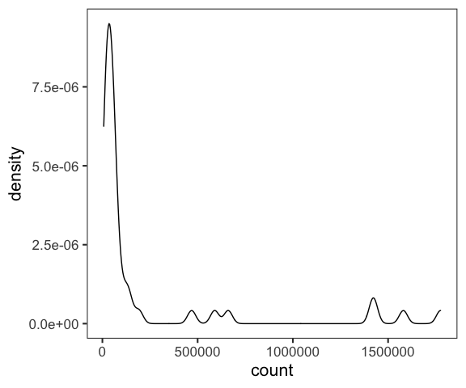<!-- -->

Next, let's look at the relationship between counts of this gene, and total number of reads in the sample.


```r
data.frame(count = as.numeric(counts[soaker,]),
           total = colSums(counts)) %>%
  ggplot(aes(x = count, y = total)) +
    geom_point() + 
    xlab("Rn45s raw read count") +
    ylab("Total reads in sample")
```

<!-- -->

In some samples, this gene has over 1e6 reads - it's an outlier even relative to the sample.

Let's calculate the proportion of all reads mapping to this one gene.


```r
frcrn45s <- counts[soaker,]/ colSums(counts)
quantile(frcrn45s)
```

```
##                 0%         25%         50%         75%       100%
## Rn45s 0.0003286862 0.001003311 0.001826259 0.003166741 0.08605762
```

This one gene is up to 8.6% of the reads! This is not unusual.

Let's look at the cumulative distribution of the number of reads per gene.


```r
cpgcum <- data.frame(apply(counts, 2, function(x) cumsum(sort(x))/sum(x)), 
                     index = (1:dim(counts)[1])/dim(counts)[1]) %>%
  pivot_longer(names_to = "Sample", values_to = "CumulativeFracCounts", 
               cols = -index)
ggplot(cpgcum, aes(x = index, y = CumulativeFracCounts, group = Sample)) + 
  geom_hline(yintercept = 0.5, color="grey", linetype = "dashed") + 
  geom_vline(xintercept = c(0.95), color="grey", linetype = "dashed") + 
  geom_line(show.legend = FALSE, aes(color = Sample), alpha = 0.5) +
  xlab("Proportion of genes") +
  ylab("Cumulative proportion of total counts")
```

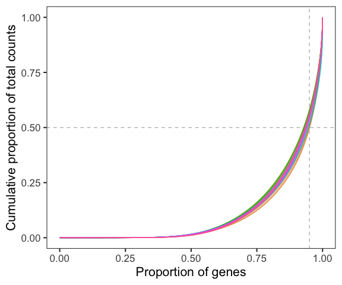<!-- -->

From this we see that for most samples, the top ~5% of genes (vertical dashed line) make up approximately 50% of the counts (horizontal dashed line)!

## Counts to CPM

CPM (counts per million mapped reads) can be a useful transformation for visualization, since it removes the variation in counts among different samples that is due to the total number of reads in each sample. 

The log2 transformation is another useful transformation for visualization, since we saw in the previous section that the distribution of raw counts is right-skewed. Since counts can have a value of zero, we have to add a pseudocount before taking the log. We'll use a value of 1, so we compute log2(CPM + 1).

First we show two separate ways to compute CPM: (1) by 'hand', and (2) using `edgeR::cpm()`:


```r
# 1) by hand
totalReads <- colSums(counts)
cpm1 <- t(apply(counts, 1, function(x) x/totalReads*10^6))

# 2) using edgeR::cpm
cpm2 <- cpm(counts, log = FALSE, normalized.lib.sizes = FALSE)

all.equal(cpm1, cpm2)
```

```
## [1] TRUE
```

Things are getting unwieldy with counts, CPM, and metadata in separate objects. Let's create a `SummarizedExperiment` object to house them all in one container. Recall that `SummarizedExperiment` is a generalization of `ExpressionSet` that allows us to store more than one expression matrix ("assay") - this will be useful for us to store both the counts and the log(CPM + 1) values.


```r
sumexp <- SummarizedExperiment(assays = SimpleList(counts = as.matrix(counts)), 
                             colData = DataFrame(m))

assays(sumexp)$cpm <- cpm(counts, log = FALSE, normalized.lib.sizes = FALSE)
sumexp
```

```
## class: SummarizedExperiment 
## dim: 20962 44 
## metadata(0):
## assays(2): counts cpm
## rownames(20962): 0610005C13Rik 0610007P14Rik ... Zzef1 Zzz3
## rowData names(0):
## colnames(44): Sample_ANAN001A Sample_ANAN001B ... Chd8.adult.S29
##   Chd8.adult.S31
## colData names(7): DPC Sex ... FeatureCounts Sample
```

Now we can see that the raw counts are in the `counts` slot and CPM are in the `cpm` slot of `assays(sumexp)`. 

Next, we'll create a filter for lowly expressed genes. Specifically, we'll use the threshold used by the authors: only keep genes with at least 2 samples that have CPM greater than 10. 


```r
keep <- which(rowSums(assays(sumexp)$cpm > 10) > 2)
length(keep)  
```

```
## [1] 12021
```

```r
sumexp <- sumexp[keep,]
```

Note that the filtering step subsetted both the raw counts and the CPM matrix. 

And now we'll compute log2(CPM + 1) for these filtered genes, and add to a slot we'll call `log2cpm`.


```r
assays(sumexp)$log2cpm <- log2(assays(sumexp)$cpm + 1)
sumexp
```

```
## class: SummarizedExperiment 
## dim: 12021 44 
## metadata(0):
## assays(3): counts cpm log2cpm
## rownames(12021): 0610007P14Rik 0610009B22Rik ... Zzef1 Zzz3
## rowData names(0):
## colnames(44): Sample_ANAN001A Sample_ANAN001B ... Chd8.adult.S29
##   Chd8.adult.S31
## colData names(7): DPC Sex ... FeatureCounts Sample
```

Now, let's examine the distribution of log2(CPM + 1) for our 'soaker' gene. Note that since we've filtered, we can't use the same index as before (1.586\times 10^{4}), so we'll subset the `SummarizedExperiment` object by the name of the soaker gene (Rn45s). 


```r
data.frame(log2cpm = as.numeric(assays(sumexp[names(soaker),])$log2cpm)) %>%
  ggplot() +
    geom_density(aes(x = log2cpm)) +
    xlab("log2(CPM + 1)")
```

<!-- -->


## Setting up our design matrix 

To run a differential expression analysis, we first have to set up a design matrix. First, we decide which factors to include in the model. I want to use Group, DPC and Sex. SeqRun is confounded with DPC so I don't use it.

(Note: in the paper, they say they correct for Sex as well as both SeqRun and DPC, but in the R script they provide, they actually only use SeqRun. That does correct for both at the same time because of the confound. But I am going to use DPC anyway as the batch effect for the one time point that was run in two batches seemed minor).

tldr: We're going to use Sex, Group and DPC in the model, no interactions.


```r
modm <- model.matrix(~ Sex + Group + DPC, data = colData(sumexp))

head(modm)
```

```
##                 (Intercept) SexF GroupMu DPC14.5 DPC17.5 DPC21 DPC77
## Sample_ANAN001A           1    1       1       0       0     0     0
## Sample_ANAN001B           1    0       0       0       0     0     0
## Sample_ANAN001C           1    0       0       0       0     0     0
## Sample_ANAN001D           1    1       1       0       0     0     0
## Sample_ANAN001E           1    1       1       0       0     0     0
## Sample_ANAN001F           1    1       0       0       0     0     0
```

# Differential expression analysis

## Using standard linear model

It's not unreasonable to ask whether just using standard linear models on log2(CPM + 1) would be okay. Remember the problems with this are supposed to be:

* Counts have non-normal behaviour (motivating `edgeR` and `DESeq`)
* Accounting for mean-variance effects is important (motivating limma-voom and limma-trend)
* Using moderation of the variance estimates is a good idea.

We'll see how much this matters (for this particular data set). 

In this section we'll use the base `lm` approach on log2(CPM + 1). In the next section we'll bring in the moderated t statistics (`eBayes`) and weighted regression (`voom`) and other variations on that theme, followed by the `edgeR` and `DESeq2` methods.

We are just going to keep all the results from the different runs in a data frame so we can compare them later (just the p-values for "Group").

Note: The `limma` package fits linear models efficiently _en masse_, but then adds other features that we want to see the effect of, while still using the rest of the limma workflow (e.g. `topTable`). To do so we need to turn off the extras (specifically variance shrinkage and degrees of freedom adjustment), but `limma` does not provide any built-in way to do that. Therefore, I provide some code that lets you use the usual limma workflow, but without the bells and whistles; I call it `noBayes` to replace `eBayes`. In using `noBayes` we don't get the `B` statistic so you have to specify `sort.by = "p"` in the call to `topTable`, since `sort.by="B"` is the default when examining single coefficients.


```r
source("noBayes.R")
lmlogcpm <- lmFit(assays(sumexp)$log2cpm, design = modm)
lmlogcpm <- noBayes(lmlogcpm) 
```

We'll print the top 10 genes by `lm` for the Sex, Group, and DPC covariates, then save the results for Group in the dataframe we'll add other results to.


```r
signif(topTable(lmlogcpm, number = 10, coef = "SexF", sort.by = "p"), 3)   # sex
```

```
##                logFC AveExpr      t  P.Value adj.P.Val
## Ddx3y         -5.870    2.42 -95.10 8.11e-46  9.75e-42
## Xist           8.210    5.52  67.20 2.77e-40  1.66e-36
## Kdm5d         -5.410    2.13 -58.80 3.75e-38  1.50e-34
## Uty           -4.550    1.82 -54.30 7.03e-37  2.11e-33
## Eif2s3y       -5.400    2.17 -39.20 9.58e-32  2.30e-28
## Kdm6a          0.533    5.62   9.97 5.00e-12  1.00e-08
## Eif2s3x        0.648    4.27   8.29 5.87e-10  1.01e-06
## 5530601H04Rik  0.490    3.76   6.48 1.43e-07  2.15e-04
## Kdm5c          0.320    7.32   6.06 5.29e-07  7.06e-04
## Pbdc1          0.366    4.77   4.96 1.61e-05  1.94e-02
```

```r
signif(topTable(lmlogcpm, number = 10, coef = "GroupMu", sort.by = "p"), 3)   # group
```

```
##          logFC AveExpr      t  P.Value adj.P.Val
## Chd8    -0.575    7.12 -10.90 4.28e-13  5.14e-09
## Vrk3     0.231    5.01   6.79 5.39e-08  2.22e-04
## Git1     0.163    7.87   6.78 5.55e-08  2.22e-04
## Dnajc4   0.311    3.55   6.69 7.42e-08  2.23e-04
## Lrrc48   0.356    3.05   5.89 8.79e-07  2.11e-03
## Parva    0.258    6.03   5.63 1.96e-06  3.93e-03
## Hmgcll1 -0.250    4.69  -5.58 2.36e-06  4.06e-03
## Anxa11   0.361    2.15   5.51 2.86e-06  4.30e-03
## Mtrr     0.223    3.99   5.46 3.36e-06  4.49e-03
## Mbtps2  -0.191    5.60  -5.43 3.76e-06  4.52e-03
```

```r
signif(topTable(lmlogcpm, number =10, coef = c("DPC14.5", "DPC17.5", "DPC21", "DPC77")), 3) # DPC
```

```
##        DPC14.5 DPC17.5 DPC21 DPC77 AveExpr    F  P.Value adj.P.Val
## Rps23    -7.24   -7.76 -7.78 -7.60    1.73 4310 8.25e-49  9.91e-45
## Rps13    -7.20   -7.54 -7.56 -7.54    1.79 3680 1.48e-47  8.91e-44
## Rpl28    -7.54   -7.48 -7.10 -7.80    2.21 2930 1.01e-45  4.05e-42
## Rps29    -7.58   -7.60 -7.49 -7.76    1.80 2720 3.92e-45  1.18e-41
## Rpl19    -7.38   -7.82 -7.93 -7.59    2.30 2430 3.08e-44  7.40e-41
## Rpl36a   -6.17   -6.48 -6.63 -6.32    1.68 2330 6.57e-44  1.32e-40
## Rps16    -6.28   -6.65 -6.57 -6.80    1.86 2190 2.19e-43  3.75e-40
## Gapdh    -8.09   -8.31 -7.88 -7.93    3.10 2080 5.32e-43  7.99e-40
## Rpsa     -6.63   -7.35 -7.51 -8.04    3.93 1960 1.71e-42  2.28e-39
## Rps17    -7.28   -7.39 -7.52 -7.72    2.13 1900 3.04e-42  3.65e-39
```

```r
# Start to collect the data from the different methods.
difmethods <- data.frame(row.names = row.names(sumexp))
difmethods$lmlogcpm <- topTable(lmlogcpm, number = Inf, coef = "GroupMu", sort.by = "none")$P.Value
```

## Using limma on log2cpm

Now we repeat, using regular `limma` with `eBayes`, as if this was a microarray data set.


```r
limmalogcpm <- lmFit(assays(sumexp)$log2cpm, design = modm)
limmalogcpm <- eBayes(limmalogcpm)
plotSA(limmalogcpm, main = "Default limma")
```

<!-- -->

```r
signif(topTable(limmalogcpm, number = 10, coef = "SexF", sort.by = "p"), 3)   # sex
```

```
##                logFC AveExpr      t  P.Value adj.P.Val     B
## Ddx3y         -5.870    2.42 -95.20 4.43e-50  5.33e-46 75.20
## Xist           8.210    5.52  70.10 1.33e-44  8.00e-41 71.70
## Kdm5d         -5.410    2.13 -60.60 4.96e-42  1.99e-38 69.50
## Uty           -4.550    1.82 -55.70 1.61e-40  4.83e-37 68.00
## Eif2s3y       -5.400    2.17 -41.00 4.08e-35  9.80e-32 61.40
## Kdm6a          0.533    5.62   9.82 2.26e-12  4.52e-09 18.00
## Eif2s3x        0.648    4.27   8.47 1.42e-10  2.44e-07 14.10
## 5530601H04Rik  0.490    3.76   6.60 5.80e-08  8.72e-05  8.23
## Kdm5c          0.320    7.32   5.96 4.83e-07  6.45e-04  6.18
## Pbdc1          0.366    4.77   5.04 9.57e-06  1.15e-02  3.29
```

```r
signif(topTable(limmalogcpm, number = 10, coef = "GroupMu", sort.by = "p"), 3)   # group
```

```
##          logFC AveExpr      t  P.Value adj.P.Val     B
## Chd8    -0.575    7.12 -10.80 1.21e-13  1.46e-09 19.30
## Dnajc4   0.311    3.55   6.54 7.11e-08  4.28e-04  7.80
## Vrk3     0.231    5.01   6.26 1.77e-07  7.10e-04  6.98
## Lrrc48   0.356    3.05   5.94 5.11e-07  1.53e-03  6.03
## Git1     0.163    7.87   5.62 1.49e-06  3.17e-03  5.07
## Anxa11   0.361    2.15   5.60 1.58e-06  3.17e-03  5.02
## Parva    0.258    6.03   5.50 2.19e-06  3.75e-03  4.73
## Hmgcll1 -0.250    4.69  -5.42 2.77e-06  4.17e-03  4.51
## Xrcc4    0.303    3.84   5.37 3.31e-06  4.41e-03  4.35
## Mtrr     0.223    3.99   5.23 5.19e-06  6.24e-03  3.95
```

```r
signif(topTable(limmalogcpm, number =10, coef = c("DPC14.5", "DPC17.5", "DPC21", "DPC77")), 3) # DPC
```

```
##        DPC14.5 DPC17.5 DPC21 DPC77 AveExpr    F  P.Value adj.P.Val
## Rps23    -7.24   -7.76 -7.78 -7.60    1.73 4110 3.74e-53  4.49e-49
## Rps13    -7.20   -7.54 -7.56 -7.54    1.79 3570 6.80e-52  4.09e-48
## Rpl28    -7.54   -7.48 -7.10 -7.80    2.21 2910 4.46e-50  1.79e-46
## Rps29    -7.58   -7.60 -7.49 -7.76    1.80 2740 1.58e-49  4.75e-46
## Rpl19    -7.38   -7.82 -7.93 -7.59    2.30 2480 1.18e-48  2.83e-45
## Rpl36a   -6.17   -6.48 -6.63 -6.32    1.68 2310 5.35e-48  1.07e-44
## Rps16    -6.28   -6.65 -6.57 -6.80    1.86 2190 1.63e-47  2.80e-44
## Gapdh    -8.09   -8.31 -7.88 -7.93    3.10 2170 1.95e-47  2.93e-44
## Rpsa     -6.63   -7.35 -7.51 -8.04    3.93 2020 8.45e-47  1.13e-43
## Rps17    -7.28   -7.39 -7.52 -7.72    2.13 1960 1.49e-46  1.79e-43
```

```r
difmethods$limmalogcpm <- topTable(limmalogcpm, number = Inf, coef = "GroupMu", 
                                   sort.by = "none")$P.Value
```

We see there's a bit of a decreasing mean-variance trend here. We'll next try out the limma-trend method to adjust for this. 

Note that the prior degrees of freedom are the extra degrees of freedom we get for using `eBayes`. 


```r
limmalogcpm$df.prior
```

```
## [1] 4.351693
```


### Bonus topic: P-value distribution

Not specifically related to RNA-seq. An essential diagnostic after doing this kind of statistical analysis is to examine the distribution of the p-values, because those p-values are used to estimate false discovery rates, which in turn depend on p-values following some sort of expected behaviour.

Options here include looking at p-value distributions (I recommend) or quantile-quantile plots of p-values. Quantile-quantile plots are also often used to examine test statistics.


```r
hist(topTable(limmalogcpm, number = Inf, coef = "SexF")$P.Value, breaks=100, 
     xlab = "P-value",
     main="Pval dist for 'Sex' (limma on logcpm)")
```

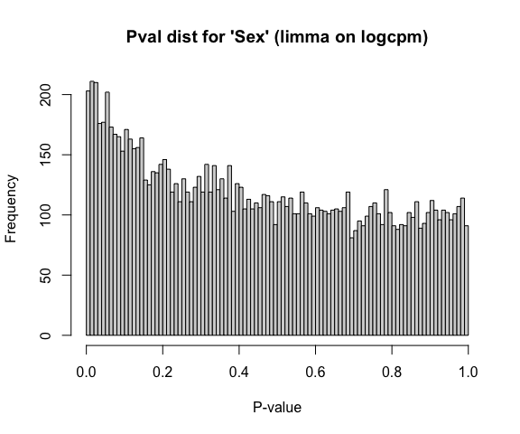<!-- -->

```r
hist(topTable(limmalogcpm, number = Inf, coef = "GroupMu")$P.Value, breaks=100, 
     xlab = "P-value",
     main="Pval dist for 'Sex' (limma on logcpm)")
```

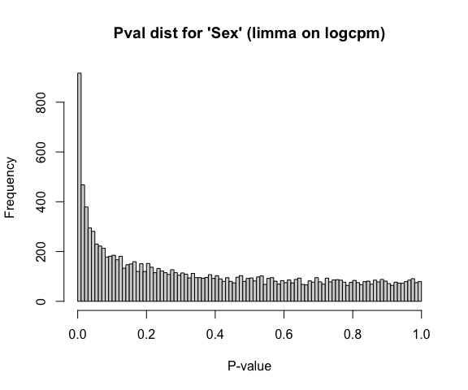<!-- -->

```r
hist(topTable(limmalogcpm, number = Inf, coef = c("DPC14.5", "DPC17.5", "DPC21", "DPC77"))$P.Value,
     breaks=100, xlab = "P-value",
     main="Pval dist for 'DPC' (limma on logcpm)") 
```

<!-- -->

```r
# Instead of using pvalue histrograms, you might see QQ-plots. Here it is for 'Sex' and 'Group' 
psx <- topTable(limmalogcpm, number = Inf, coef = "SexF")$P.Value
qqplot( -log10(qunif(1-psx)), -log10(psx) , ylim=c(0,50) , xlab="expected -log10p", ylab="observed -log10p", main="QQ p for Sex (limma on cpm)", pch=20, cex=0.5)
abline(0,1, lty=3)
```

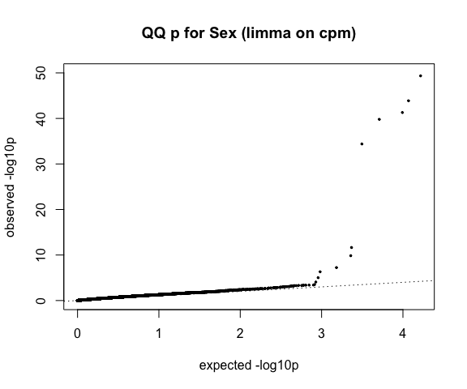<!-- -->

```r
ps <- topTable(limmalogcpm, number = Inf, coef = "GroupMu")$P.Value
qqplot( -log10(qunif(1-ps)), -log10(ps) , ylim=c(0,15) , xlab="expected -log10p", ylab="observed -log10p", main="QQ p for Group (limma on cpm)", pch=20, cex=0.5)
abline(0,1, lty=3)
```

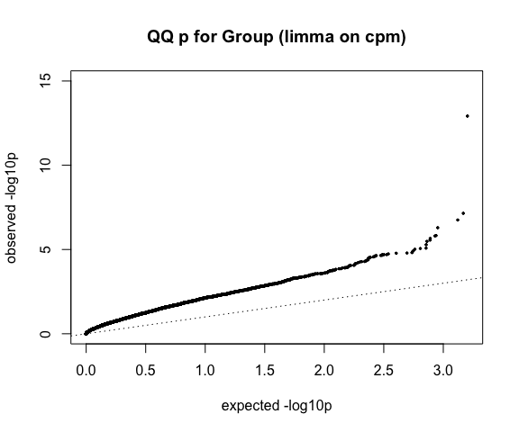<!-- -->

Compared to the histogram, the qq-plot gives a stronger impression of the deviation of the p-value distribution from the expected uniform throughout its range. The "inflation" we observe for the Chd8 genotype effect suggests *either* the effects of Chd8 are very widespread (biologically plausible) or there is a problem with our data/model resulting in inaccurate p-values (hard to know for certain, but the Sex statistics don't show this inflation).

Visualizing the p-value distributions you get a sense of how much of a "signal" there is, but this can be quantified using the `qvalue::qvalue()` method. The output `pi_0` is the estimated fraction of "true null hypotheses" while `1 - pi_0` or `pi_1` is the estimated (in this case) fraction of differentially expressed genes (with respect to the selected coefficients in the linear model we are fitting). This is useful, though wouldn't take these numbers too seriously, especially if your p-value distribution is at all "defective". You'll note that it breaks down if too many genes are differentially expressed so I don't show the call for the DPC analysis. 


```r
# Check pi0 estimates from qvalue
1 - qvalue(topTable(limmalogcpm, number = Inf, coef = "SexF")$P.Value)$pi0
```

```
## [1] 0.1630153
```

```r
1 - qvalue(topTable(limmalogcpm, number = Inf, coef = "GroupMu")$P.Value)$pi0 # this is the one we care about
```

```
## [1] 0.3530434
```

```r
# For DPC, qvalue breaks because basically every gene is diff expr - basically 100%
1 - qvalue(topTable(limmalogcpm, Inf, coef = c("DPC14.5", "DPC17.5", "DPC21", "DPC77"))$P.Value)$pi0 
```

```
## [1] 0.9976471
```

```r
# You can also use qvalue to generate some diagnostic plots, related to p-value
# distributions and pi0
plot(qvalue(topTable(limmalogcpm, Inf, coef = "GroupMu")$P.Value))
```

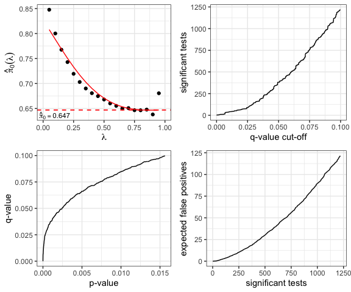<!-- -->

For brevity's sake I'm not going to show the full p-value histograms and qvalue analyses for each of the analyses.


## Using limma-trend

Limma-trend is a modification to the standard limma approach that incorporates mean expression level as a covariate into the prior hyperparameter estimation. Its goal is to adjust for any mean-variance relationship still leftover after transformation using log CPM. Limma-trend is robust (according to the user manual) if the sequencing depth is "reasonably consistent" across samples (less than 3-fold range, which is not quite the case here - see below). Though it's worth noting that in the original voom paper, voom was a bit better than 'trend'. The way limma-trend works is the mean expression level is used as a covariate in the prior hyperparameter estimation.


```r
# note that the maximum depth is more than 4-fold higher than the minimum
max(colSums(assays(sumexp)$counts)/min(colSums(assays(sumexp)$counts)))
```

```
## [1] 4.126554
```

```r
limmatrend <- lmFit( assays(sumexp)$log2cpm, design = modm)
limmatrend <- eBayes(limmatrend, trend = TRUE) # trend=TRUE is the only diff from regular limma.
plotSA(limmatrend, main = "limma-trend") 
```

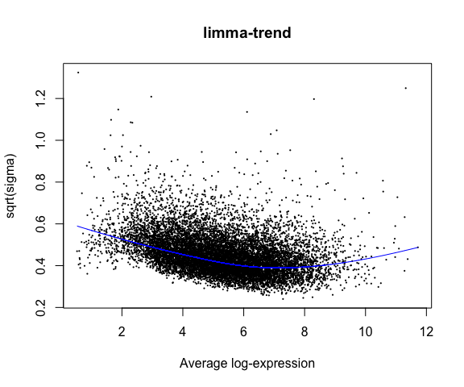<!-- -->

We can see the mean-variance trend estimated by limma-trend in the blue line. Next we'll examine the top ten genes by Sex, Group and DPC, as well as add the p-values for Group for the limma-trend approach to our data frame of results.


```r
signif(topTable(limmatrend, number = 10, coef = "SexF", sort.by = "p") ,3)
```

```
##                logFC AveExpr      t  P.Value adj.P.Val     B
## Ddx3y         -5.870    2.42 -89.30 9.85e-50  1.18e-45 75.30
## Xist           8.210    5.52  70.70 1.71e-45  1.03e-41 72.50
## Kdm5d         -5.410    2.13 -58.70 4.11e-42  1.65e-38 69.70
## Uty           -4.550    1.82 -53.10 2.68e-40  8.07e-37 67.80
## Eif2s3y       -5.400    2.17 -40.60 1.79e-35  4.30e-32 61.90
## Kdm6a          0.533    5.62   9.90 1.42e-12  2.85e-09 18.50
## Eif2s3x        0.648    4.27   8.42 1.40e-10  2.40e-07 14.10
## 5530601H04Rik  0.490    3.76   6.51 7.27e-08  1.09e-04  8.01
## Kdm5c          0.320    7.32   6.07 3.11e-07  4.15e-04  6.61
## Pbdc1          0.366    4.77   5.04 9.16e-06  1.10e-02  3.34
```

```r
signif(topTable(limmatrend, number = 10, coef = "GroupMu", sort.by = "p") ,3)
```

```
##          logFC AveExpr      t  P.Value adj.P.Val     B
## Chd8    -0.575    7.12 -11.00 5.36e-14  6.44e-10 20.00
## Dnajc4   0.311    3.55   6.24 1.76e-07  8.67e-04  6.98
## Vrk3     0.231    5.01   6.18 2.16e-07  8.67e-04  6.80
## Git1     0.163    7.87   5.78 8.13e-07  2.41e-03  5.61
## Lrrc48   0.356    3.05   5.72 1.00e-06  2.41e-03  5.42
## Parva    0.258    6.03   5.57 1.61e-06  3.23e-03  4.99
## Hmgcll1 -0.250    4.69  -5.35 3.34e-06  5.73e-03  4.34
## Anxa11   0.361    2.15   5.29 4.05e-06  6.08e-03  4.17
## Xrcc4    0.303    3.84   5.24 4.73e-06  6.32e-03  4.03
## Mbtps2  -0.191    5.60  -5.07 8.37e-06  9.24e-03  3.51
```

```r
signif(topTable(limmatrend, number = 10, coef = c("DPC14.5", "DPC17.5", "DPC21", "DPC77")),3)
```

```
##        DPC14.5 DPC17.5 DPC21 DPC77 AveExpr    F  P.Value adj.P.Val
## Rps23    -7.24   -7.76 -7.78 -7.60    1.73 3180 9.83e-52  1.18e-47
## Rps13    -7.20   -7.54 -7.56 -7.54    1.79 2840 1.03e-50  6.21e-47
## Rpl28    -7.54   -7.48 -7.10 -7.80    2.21 2490 1.63e-49  6.52e-46
## Rps29    -7.58   -7.60 -7.49 -7.76    1.80 2310 7.86e-49  2.36e-45
## Rpl19    -7.38   -7.82 -7.93 -7.59    2.30 2220 1.92e-48  4.62e-45
## Gapdh    -8.09   -8.31 -7.88 -7.93    3.10 2060 9.25e-48  1.85e-44
## Rpsa     -6.63   -7.35 -7.51 -8.04    3.93 1960 2.40e-47  4.12e-44
## Rpl36a   -6.17   -6.48 -6.63 -6.32    1.68 1870 6.45e-47  9.69e-44
## Rps16    -6.28   -6.65 -6.57 -6.80    1.86 1830 1.03e-46  1.38e-43
## Thy1      2.92    5.64  6.76  9.53    5.07 1810 1.37e-46  1.65e-43
```

```r
difmethods$limmatrend <- topTable(limmatrend, number = Inf, coef = "GroupMu", sort = "none")$P.Value 
```

## Using limma-voom

Now we introduce the weighted regression method suggested by the limma developers to utilize the raw counts (instead of using log-transformed CPM values). Here we start to get into the mean-variance relationships (a form of heteroscedasticity) and how it can be addressed. 

Note that we are using the `counts` slot of `assays(sumexp)` now instead of the `log2cpm` slot.


```r
# voom() takes counts, NOT cpm. 
vw <- voom(assays(sumexp)$counts, design = modm, plot = TRUE, span = 0.5)  
```

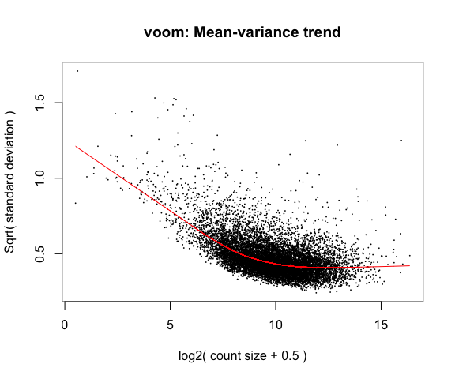<!-- -->

We see the characteristic mean-variance relationship that the voom weights will adjust for.


```r
lmvoom <- lmFit(vw, modm)
lmvoom <- eBayes(lmvoom)
plotSA(lmvoom, main= "voom")
```

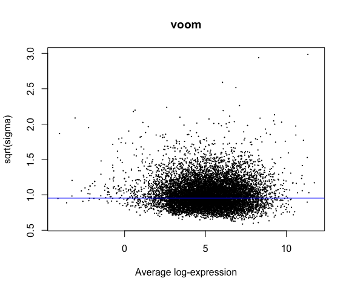<!-- -->

With the limma-voom adjustment, we see the trend between mean and variance is largely gone. 

Now we'll look at the top 10 signficant for Sex, Group, and DPC, and add the p-values for the Group coefficient to our comparison table. 


```r
signif(topTable(lmvoom, number = 10, coef = "SexF", sort.by = "p") ,3)
```

```
##                 logFC AveExpr      t  P.Value adj.P.Val     B
## Kdm5d         -10.400  -0.806 -41.90 4.23e-36  5.08e-32 44.60
## Uty            -9.370  -1.080 -38.20 1.90e-34  1.14e-30 44.00
## Ddx3y         -10.500  -0.344 -33.30 5.50e-32  2.21e-28 42.30
## Xist            9.970   4.700  23.00 1.57e-25  4.72e-22 41.20
## Eif2s3y       -10.400  -0.734 -19.40 1.04e-22  2.49e-19 32.70
## Kdm6a           0.555   5.600  10.10 7.23e-13  1.45e-09 19.10
## Eif2s3x         0.671   4.190   8.65 6.64e-11  1.14e-07 14.70
## 5530601H04Rik   0.517   3.650   6.27 1.57e-07  2.36e-04  7.03
## Kdm5c           0.321   7.330   6.04 3.35e-07  4.47e-04  5.94
## Pbdc1           0.380   4.730   5.15 6.37e-06  7.66e-03  3.21
```

```r
signif(topTable(lmvoom, number = 10, coef = "GroupMu", sort.by = "p") ,3)
```

```
##         logFC AveExpr      t  P.Value adj.P.Val     B
## Chd8   -0.577    7.12 -11.00 5.51e-14  6.62e-10 21.70
## Plin4   2.070   -1.86   7.51 2.58e-09  1.36e-05  8.36
## Anxa11  0.592    1.68   7.43 3.41e-09  1.36e-05 10.40
## Dnajc4  0.360    3.43   6.46 8.45e-08  2.54e-04  7.84
## Vrk3    0.230    4.98   5.98 4.17e-07  1.00e-03  6.34
## Lrrc48  0.435    2.85   5.89 5.60e-07  1.11e-03  6.01
## Xdh     0.986   -2.58   5.84 6.48e-07  1.11e-03  4.50
## Git1    0.163    7.87   5.78 7.91e-07  1.19e-03  5.65
## Etnppl  0.820   -3.58   5.75 8.93e-07  1.19e-03  4.67
## Parva   0.265    6.01   5.70 1.06e-06  1.27e-03  5.41
```

```r
signif(topTable(lmvoom, number = 10, coef = c("DPC14.5", "DPC17.5", "DPC21", "DPC77")),3)
```

```
##       DPC14.5 DPC17.5 DPC21 DPC77 AveExpr    F  P.Value adj.P.Val
## Rpsa    -6.81   -7.62 -7.81 -8.51    3.72 2030 9.71e-48  1.17e-43
## Gapdh   -8.66   -9.00 -8.35 -8.41    2.65 1610 1.35e-45  8.09e-42
## Rps7    -6.16   -6.53 -6.88 -7.79    2.88 1390 2.69e-44  1.08e-40
## Hmgb1   -4.24   -5.31 -5.77 -6.27    4.83 1340 6.02e-44  1.81e-40
## Rpl21   -6.30   -6.32 -6.22 -7.09    3.40 1320 8.70e-44  2.09e-40
## Rpl10   -6.58   -7.04 -6.72 -8.52    2.79 1120 2.64e-42  5.30e-39
## Rpl28   -8.80   -8.69 -7.91 -9.58    1.22 1100 3.84e-42  6.14e-39
## Rpl17   -6.80   -7.17 -7.39 -8.12    2.62 1100 4.09e-42  6.14e-39
## Rpl11   -7.04   -8.46 -8.11 -8.31    2.07 1090 4.93e-42  6.58e-39
## Cplx1    2.28    3.47  3.90  6.11    6.91 1020 1.66e-41  1.99e-38
```

```r
difmethods$limmavoom <- topTable(lmvoom, number = Inf, coef = "GroupMu", sort = "none")$P.Value 
```

## Using limma-voom with TMM

In the previous, we use just the data without any extra normalization. The next analysis has this added (using the TMM method from `edgeR::calcNormFactors`). Later we use the same normalization approach for `edgeR`.


```r
dge <- DGEList(assays(sumexp)$counts)
dge <- calcNormFactors(dge)
vwn <- voom(dge, modm )

limmavoomTPM <- lmFit(vwn, modm)
limmavoomTPM <- eBayes(limmavoomTPM)
plotSA(limmavoomTPM, main= "limma voom + TMM")
```

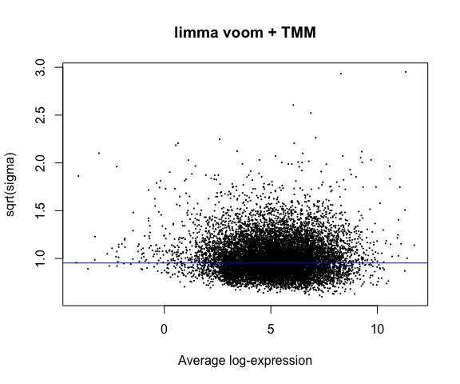<!-- -->

```r
signif(topTable(limmavoomTPM, number = 10, coef = "SexF", sort.by = "p") ,3)
```

```
##                 logFC AveExpr      t  P.Value adj.P.Val     B
## Kdm5d         -10.400  -0.806 -42.60 2.70e-36  3.25e-32 44.90
## Uty            -9.370  -1.080 -39.40 6.51e-35  3.91e-31 44.50
## Ddx3y         -10.500  -0.344 -33.40 5.27e-32  2.11e-28 42.50
## Xist            9.950   4.700  23.00 1.60e-25  4.80e-22 41.30
## Eif2s3y       -10.400  -0.734 -19.10 2.41e-22  5.79e-19 32.40
## Kdm6a           0.539   5.600  10.40 3.22e-13  6.44e-10 19.80
## Eif2s3x         0.654   4.190   8.42 1.41e-10  2.42e-07 13.90
## 5530601H04Rik   0.500   3.650   6.33 1.29e-07  1.93e-04  7.20
## Kdm5c           0.307   7.330   5.58 1.56e-06  2.08e-03  4.40
## Pbdc1           0.362   4.730   5.13 6.79e-06  8.17e-03  3.12
```

```r
signif(topTable(limmavoomTPM, number = 10, coef = "GroupMu", sort.by = "p") ,3)
```

```
##          logFC AveExpr      t  P.Value adj.P.Val     B
## Chd8    -0.587    7.12 -11.30 2.26e-14  2.71e-10 22.50
## Plin4    2.080   -1.86   7.60 2.01e-09  1.21e-05  8.53
## Anxa11   0.588    1.68   7.21 7.13e-09  2.86e-05  9.74
## Dnajc4   0.350    3.43   6.85 2.36e-08  7.08e-05  9.04
## Vrk3     0.220    4.98   6.02 3.70e-07  8.91e-04  6.45
## Etnppl   0.830   -3.58   5.86 6.19e-07  1.13e-03  4.97
## Xdh      0.998   -2.58   5.84 6.61e-07  1.13e-03  4.49
## Hmgcll1 -0.278    4.64  -5.75 8.99e-07  1.35e-03  5.61
## Lrrc48   0.426    2.85   5.69 1.10e-06  1.47e-03  5.40
## Mtrr     0.243    3.91   5.60 1.46e-06  1.75e-03  5.18
```

```r
signif(topTable(limmavoomTPM, number = 10, coef = c("DPC14.5", "DPC17.5", "DPC21", "DPC77")),3)
```

```
##       DPC14.5 DPC17.5 DPC21 DPC77 AveExpr    F  P.Value adj.P.Val
## Rpsa    -6.92   -7.64 -7.79 -8.29    3.72 2140 4.32e-48  5.20e-44
## Gapdh   -8.77   -9.01 -8.34 -8.20    2.65 1650 9.67e-46  5.81e-42
## Rps7    -6.27   -6.54 -6.86 -7.57    2.88 1490 7.88e-45  3.16e-41
## Rpl21   -6.41   -6.34 -6.21 -6.88    3.40 1360 5.58e-44  1.68e-40
## Hmgb1   -4.36   -5.32 -5.75 -6.05    4.83 1320 1.01e-43  2.43e-40
## Rpl10   -6.69   -7.05 -6.71 -8.30    2.79 1220 5.72e-43  1.15e-39
## Rpl17   -6.91   -7.18 -7.38 -7.90    2.62 1190 9.56e-43  1.64e-39
## Rpl28   -8.91   -8.70 -7.90 -9.36    1.22 1160 1.58e-42  2.38e-39
## Rpl11   -7.15   -8.47 -8.10 -8.09    2.07 1150 1.99e-42  2.65e-39
## Rpl31   -5.04   -5.28 -5.72 -5.66    3.41 1090 5.46e-42  6.56e-39
```

```r
difmethods$limmavoomTPM <- topTable(limmavoomTPM, number = Inf, coef = "GroupMu", 
                                    sort = "none")$P.Value 
```


## Using edgeR LRT

`edgeR` is quite a different approach than `limma` and its variants limma-trend and limma-voom. `edgeR` models the counts directly (instead of log transformed CPM values). 

### Likelihood ratio test (LRT)

`edgeR` provides two ways to do the model fitting and hypothesis testing: Likelihood ratio tests (LRT), and quasi-likelihood F-test. Starting here with the first approach. Recall that the object we created above for limma-voom (we called it `dge`) is a `DGEList` that contains the raw counts. This is the input for `edgeR`. First we add the normalization factors to the object and visualize them.


```r
dge <- calcNormFactors(dge, method="TMM")

hist(dge$samples$norm.factors, breaks = 10, xlab = "Norm factor", main = "TMM Normalization factors")
```

<!-- -->
The TMM normalization factors are values approximately centered at 1. Values less than 1 indicate that high-count genes are monopolizing the "read space". Note that if we have a large fraction (i.e. greater than 50%) differentially expressed genes, this violates the assumptions of normalization methods like TMM. 

We proceed by first estimating dispersions (recall that these are analogous to the gene-specific variances in limma), and plotting these estimates using the `plotBCV` function.


```r
# Estimate dispersion while automatically setting prior.df
dge <- estimateDisp(dge, design = modm, robust = TRUE)

# Check prior.df for sanity (can instead set manually with prior.df param in estimateDisp)
range(dge$prior.df)
```

```
## [1] 1.486164 4.597337
```

```r
# plot mean var trend
plotBCV(dge,  cex=0.5)
```

<!-- -->

These estimates will be used in fitting the LRT model, which we'll do using the `glmFit` function. Then we'll pull out the top 10 genes with the `edgeR::topTags` function (similar to `topTable` in `limma`), and add the p-values for the Group covariate to our results dataframe.


```r
lfit <- glmFit(dge, modm)

topTags(glmLRT(lfit, coef = "SexF"))$table %>% signif(3)
```

```
##                 logFC logCPM     LR    PValue       FDR
## Kdm5d         -10.700   4.00 6230.0  0.00e+00  0.00e+00
## Eif2s3y       -10.600   4.09 1650.0  0.00e+00  0.00e+00
## Ddx3y         -10.500   4.59 4340.0  0.00e+00  0.00e+00
## Uty            -9.630   3.16 4350.0  0.00e+00  0.00e+00
## Xist            9.850   8.31 1390.0 3.02e-303 7.25e-300
## Kdm6a           0.534   5.70   99.6  1.90e-23  3.80e-20
## Eif2s3x         0.664   4.68   64.2  1.14e-15  1.95e-12
## 5530601H04Rik   0.514   3.73   40.9  1.63e-10  2.45e-07
## Kdm5c           0.308   7.41   27.8  1.36e-07  1.82e-04
## Pbdc1           0.368   4.90   25.0  5.77e-07  6.94e-04
```

```r
topTags(glmLRT(lfit, coef = "GroupMu"))$table %>% signif(3)
```

```
##          logFC logCPM    LR   PValue      FDR
## Chd8    -0.590   7.17 123.0 1.55e-28 1.86e-24
## Dnajc4   0.339   3.48  40.6 1.91e-10 1.15e-06
## Vrk3     0.223   5.02  33.5 7.01e-09 2.50e-05
## Anxa11   0.519   2.96  33.2 8.32e-09 2.50e-05
## Hmgcll1 -0.275   4.68  29.5 5.47e-08 1.31e-04
## Xrcc4    0.322   3.80  28.3 1.06e-07 2.13e-04
## Lrrc48   0.407   3.07  27.6 1.50e-07 2.58e-04
## Mtrr     0.237   3.94  26.1 3.17e-07 4.50e-04
## Usp11   -0.268   7.33  25.8 3.78e-07 4.50e-04
## Parva    0.249   6.16  25.8 3.86e-07 4.50e-04
```

```r
topTags(glmLRT(lfit, coef = c("DPC14.5", "DPC17.5", "DPC21", "DPC77")))$table %>% signif(3)
```

```
##        logFC.DPC14.5 logFC.DPC17.5 logFC.DPC21 logFC.DPC77 logCPM    LR PValue
## Rps29          -9.64         -9.41       -9.14      -10.30   5.60  8760      0
## Rpl5           -9.08         -9.66       -9.37       -9.37   6.09  3130      0
## Rpl28          -8.94         -8.68       -7.90       -9.38   5.88 14400      0
## Gapdh          -8.77         -9.00       -8.33       -8.19   7.25  9430      0
## Rps13          -8.68         -9.80       -9.80       -9.32   5.46  9910      0
## Rps23          -8.63        -10.70      -10.60       -9.74   5.55 12100      0
## Rps17          -8.40         -8.58       -8.85       -9.18   5.81  7860      0
## Rpl19          -8.27         -9.00       -9.27       -8.41   6.18 11300      0
## Rpl24          -7.98         -7.92       -7.98       -8.78   4.87  2950      0
## Rpl23a         -7.84         -7.92       -7.79       -6.54   5.06  2620      0
##        FDR
## Rps29    0
## Rpl5     0
## Rpl28    0
## Gapdh    0
## Rps13    0
## Rps23    0
## Rps17    0
## Rpl19    0
## Rpl24    0
## Rpl23a   0
```

```r
difmethods$edgeRlrt <- topTags(glmLRT(lfit, coef = "GroupMu"), n=Inf, sort.by = "none")$table$PValue 
```

To examine see how much shrinkage we got, we'll redo the dispersion estimation, this time forcing `prior.df = 0` (no shrinkage). 


```r
rawd <- estimateDisp(dge, design = modm, prior.df = 0)
plotBCV(rawd, cex=0.5)
```

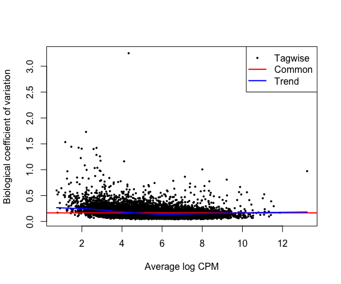<!-- -->

```r
# Direct comparison
plot( sqrt(rawd$tagwise.dispersion), sqrt(dge$tagwise.dispersion) - sqrt(rawd$tagwise.dispersion),
      pch = 20, xlab = "sqrt Unshrunk disp", ylab = "difference (sqrt Shrunk - sqrt Unshrunk disp)")
abline(0,0, lty=3)
```

<!-- -->

## Using edgeR Quasi-likelihood 

The previous section (LRT) is the  "traditional" `edgeR` approach. The newer quasi-likelihood method is generally the preferred method according to the `edgeR` documentation. It adapts approaches from limma-trend for adjusting (shrinking) the error variances (`sqeezeVar`). According to the documentation, edgeR-QL is "more conservative and rigorous" than edgeR-LR in controlling false discoveries.

Here we'll use the Quasi-likelihood approach, which is done very similarly to the traditional LRT, except using functions `glmQLFit()` and `glmQLFTest()`.

Note that we estimated dispersions the same way as before (with `estimateDisp`), except now only the trended dispersion is used under the quasi-likelihood (QL) pipeline. 


```r
dge <- estimateDisp(dge, design = modm, robust = TRUE)

qfit <- glmQLFit(dge, modm)

topTags(glmQLFTest(qfit, coef = "SexF"))$table %>% signif(3)
```

```
##                 logFC logCPM      F   PValue      FDR
## Kdm5d         -10.700   4.00 4790.0 1.59e-44 1.91e-40
## Ddx3y         -10.500   4.59 3640.0 4.57e-42 2.75e-38
## Uty            -9.640   3.16 2750.0 1.45e-39 5.82e-36
## Eif2s3y       -10.500   4.09 1950.0 1.51e-36 4.54e-33
## Xist            9.840   8.31 1770.0 1.18e-35 2.83e-32
## Kdm6a           0.533   5.70  107.0 4.41e-13 8.83e-10
## Eif2s3x         0.664   4.68   65.8 4.24e-10 7.28e-07
## 5530601H04Rik   0.515   3.73   43.0 6.53e-08 9.81e-05
## Kdm5c           0.308   7.41   29.9 2.40e-06 3.21e-03
## Pbdc1           0.368   4.90   26.2 7.32e-06 8.80e-03
```

```r
topTags(glmQLFTest(qfit, coef = "GroupMu"))$table %>% signif(3)
```

```
##          logFC logCPM     F   PValue      FDR
## Chd8    -0.591   7.17 131.0 1.90e-14 2.28e-10
## Dnajc4   0.334   3.48  43.8 5.42e-08 3.26e-04
## Vrk3     0.227   5.02  39.3 1.72e-07 6.90e-04
## Hmgcll1 -0.273   4.68  32.4 1.13e-06 3.40e-03
## Anxa11   0.499   2.96  31.1 1.67e-06 3.68e-03
## Xrcc4    0.321   3.80  30.8 1.84e-06 3.68e-03
## Lrrc48   0.408   3.07  27.9 4.35e-06 5.54e-03
## Usp11   -0.268   7.33  27.7 4.57e-06 5.54e-03
## Myef2   -0.261   6.47  27.7 4.64e-06 5.54e-03
## Parva    0.248   6.16  27.4 5.11e-06 5.54e-03
```

```r
topTags(glmQLFTest(qfit, coef = c("DPC14.5", "DPC17.5", "DPC21", "DPC77")))$table %>% signif(3)
```

```
##       logFC.DPC14.5 logFC.DPC17.5 logFC.DPC21 logFC.DPC77 logCPM    F   PValue
## Rpl28         -8.94         -8.69       -7.90       -9.38   5.88 3010 1.55e-50
## Rpsa          -6.88         -7.63       -7.79       -8.27   7.51 2550 4.55e-49
## Gapdh         -8.77         -9.00       -8.33       -8.19   7.25 2400 1.61e-48
## Rpl19         -8.27         -9.00       -9.27       -8.41   6.18 2350 2.50e-48
## Rps7          -6.27         -6.54       -6.87       -7.56   6.04 2260 5.40e-48
## Rps13         -8.68         -9.80       -9.80       -9.32   5.46 2150 1.52e-47
## Rpl11         -7.10         -8.44       -8.11       -8.05   6.18 2050 4.03e-47
## Rps23         -8.62        -10.70      -10.60       -9.72   5.55 2040 4.92e-47
## Rps17         -8.40         -8.58       -8.86       -9.17   5.81 1920 1.57e-46
## Rps29         -9.64         -9.40       -9.14      -10.30   5.60 1850 3.57e-46
##            FDR
## Rpl28 1.86e-46
## Rpsa  2.74e-45
## Gapdh 6.47e-45
## Rpl19 7.51e-45
## Rps7  1.30e-44
## Rps13 3.04e-44
## Rpl11 6.92e-44
## Rps23 7.39e-44
## Rps17 2.09e-43
## Rps29 4.29e-43
```

```r
difmethods$edgeRquasi <- topTags(glmQLFTest(qfit, coef = "GroupMu"), n=Inf, 
                                 sort.by = "none")$table$PValue 
```

Comparing the p-values for the LRT and QL approach, we see that both approaches give similar p-values, but the QL approach shrinks very significant values a bit less significant.


```r
df <- data.frame(lrt = -log10(difmethods$edgeRlrt),
                 diff = -log10(difmethods$edgeRquasi) + log10(difmethods$edgeRlrt)) 
df %>% ggplot() +
  geom_point(aes(x = lrt, y = diff), alpha = 0.1) + 
  geom_hline(yintercept = 0, linetype = "dashed", colour = "red") + 
  ylim(-3,3) + xlim(0,10) +
  xlab("-log10 p-value LRT") +
  ylab("Difference QL - LRT (-log10 pval)")
```

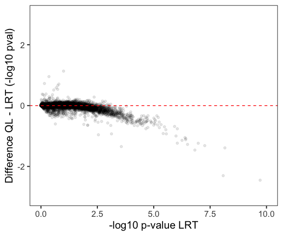<!-- -->


## Using DESeq2

Finally, we'll compare using `DESeq2`, a method similar to `edgeR` that also directly models the raw counts. 

First we have to construct a `DESeqDataSet` object. This is easy to do given a `SummarizedExperiment` object and design formula, which we already have: 


```r
dds <- DESeqDataSet(sumexp, modm)
dds
```

```
## class: DESeqDataSet 
## dim: 12021 44 
## metadata(1): version
## assays(3): counts cpm log2cpm
## rownames(12021): 0610007P14Rik 0610009B22Rik ... Zzef1 Zzz3
## rowData names(0):
## colnames(44): Sample_ANAN001A Sample_ANAN001B ... Chd8.adult.S29
##   Chd8.adult.S31
## colData names(7): DPC Sex ... FeatureCounts Sample
```
We'll compare the `DEseq` size factors to the TMM normalization factors. Note that we don't normally need to manually add the normalization size factors with `estimateSizeFactors`, because automatically run for us in the `DESeq` function, but we'll do so here so we can pull them out to compare with TMM.


```r
dds <- estimateSizeFactors(dds)
# double check that samples are in the same order in both edger and deseq objects
identical(colnames(dge), colnames(dds))
```

```
## [1] TRUE
```

```r
plot(dge$samples$norm.factors, colData(dds)$sizeFactor, pch = 20,
     xlab = "TMM normalization factors", ylab = "DESeq2 size factors")
abline(0,1, lty = 3)
```

<!-- -->

```r
plot(dge$samples$norm.factors, colSums(counts), pch = 20,
     xlab = "TMM normalization factors", ylab = "depth")
```

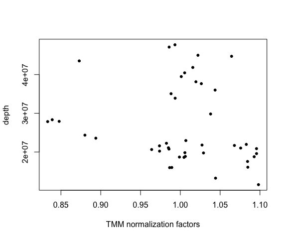<!-- -->

```r
plot(colData(dds)$sizeFactor, colSums(counts), pch = 20,
     xlab = "DESeq2 size factors", ylab = "depth")
```

<!-- -->
There's not a huge amount of agreement between the DESeq2 size factors and the TMM normalization factors. The DESeq2 factors are much more correlated with depth than TMM.

Next, we run the analysis and pull out the results table for the Group comparison (`results` is analogous to limma's `topTable` and edgeR's `topTags` functions). We'll also add those p-values to our results object. 


```r
dds <- DESeq(dds)
```

```
## using supplied model matrix
```

```
## using pre-existing size factors
```

```
## estimating dispersions
```

```
## gene-wise dispersion estimates
```

```
## mean-dispersion relationship
```

```
## final dispersion estimates
```

```
## fitting model and testing
```

```r
resultsNames(dds)
```

```
## [1] "Intercept" "SexF"      "GroupMu"   "DPC14.5"   "DPC17.5"   "DPC21"    
## [7] "DPC77"
```

```r
deseq_group <- results(dds, name = "GroupMu")

# top genes for Chd8 group
head( deseq_group[ order(deseq_group$pvalue), ] )
```

```
## log2 fold change (MLE): GroupMu 
## Wald test p-value: GroupMu 
## DataFrame with 6 rows and 6 columns
##          baseMean log2FoldChange     lfcSE      stat      pvalue        padj
##         <numeric>      <numeric> <numeric> <numeric>   <numeric>   <numeric>
## Chd8     3559.587      -0.595634 0.0530429 -11.22929 2.92834e-29 3.51928e-25
## Dnajc4    276.170       0.335255 0.0511633   6.55264 5.65275e-11 3.39674e-07
## Vrk3      799.698       0.218074 0.0344039   6.33865 2.31786e-10 9.28535e-07
## Hmgcll1   633.362      -0.279230 0.0493657  -5.65636 1.54618e-08 4.64549e-05
## Anxa11    195.354       0.515134 0.0930001   5.53907 3.04078e-08 7.30882e-05
## Xrcc4     343.157       0.317841 0.0581397   5.46685 4.58110e-08 9.17595e-05
```

```r
difmethods$deseq2 <-  deseq_group$pvalue
```

Here's an MA plot for the Group comparisons, with blue points representing genes with FDR < 0.05.


```r
plotMA(deseq_group, alpha = 0.05)
```

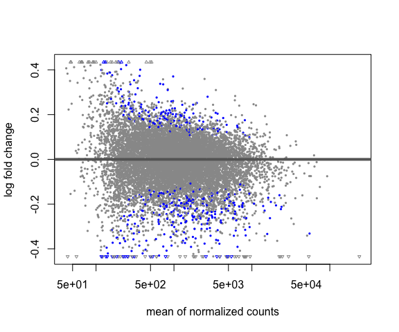<!-- -->

Note that `DESeq2` fails to give results for three genes (they have extreme outliers). But they are not interesting genes (high pvalues in other methods).


```r
difmethods[apply(difmethods, 1, function(x) any(is.na(x))),]
```

```
##        lmlogcpm limmalogcpm limmatrend limmavoom limmavoomTPM  edgeRlrt
## Gh    0.9666708   0.9647626  0.9644664 0.4963914    0.5060823 0.2294544
## Inadl 0.1857345   0.1667272  0.1654464 0.1497694    0.1713521 0.1089240
## Prkcd 0.5978009   0.5797309  0.5764311 0.6065118    0.6539891 0.3446382
##       edgeRquasi deseq2
## Gh     0.9204300     NA
## Inadl  0.1157458     NA
## Prkcd  0.3489087     NA
```

Also note that by default `DESeq2` applies Independent Filtering when computing adjusted p-values. This is different than standard FDR correction, and tends to have greater power by 'spending' the type I error according to the overall mean expression. However, it can also lead to additional genes with missing adjusted p-values (these are 'filtered' out due to low overall expression). For more info, see [this section of the DESeq2 vignette](https://bioconductor.org/packages/release/bioc/vignettes/DESeq2/inst/doc/DESeq2.html#independent-filtering-of-results). 

# Heatmaps of top genes (limma-voom)

Just showing how this is done, using the analysis we just did. As an illustration, we'll use the limma-voom results, but we could sub in any of the methods from the previous section. Note that we are displaying top genes selected by p-value. This can easily be modified to separate genes by up- and down-regulated or some other arrangement.

We'll plot the log2(CPM+1) values, and order the columns by the factor of interest first, and let the rows cluster.


```r
#  make a copy of the data ordered by the factor of interest.
sumexpS <- sumexp[, order(colData(sumexp)$Sex, colData(sumexp)$Group, colData(sumexp)$DPC)]
sumexpD <- sumexp[, order(colData(sumexp)$DPC, colData(sumexp)$Group, colData(sumexp)$Sex)]
sumexpG <- sumexp[, order(colData(sumexp)$Group, colData(sumexp)$DPC, colData(sumexp)$Sex)]

pheatmap(assays(sumexpS)$log2cpm %>% data.frame() %>%
           dplyr::filter(rownames(sumexpS) %in% rownames(topTable(limmavoomTPM, number = 30, 
                                                     coef = "SexF", sort.by = "p"))),
         scale="row", color = bcols, border_color = NA,
         cluster_cols = FALSE,
         annotation_col = colData(sumexpS)[,c("Sex", "DPC", "Group")] %>% data.frame(), 
         main = "Top genes for Sex effect (limma-voom with TPM)")
```

<!-- -->

```r
pheatmap(assays(sumexpG)$log2cpm %>% data.frame() %>%
           dplyr::filter(rownames(sumexpG) %in% rownames(topTable(limmavoomTPM, number = 30, 
                                                     coef = "GroupMu", sort.by = "p"))),
         scale="row", color = bcols, border_color = NA,
         cluster_cols = FALSE,
         annotation_col = colData(sumexpG)[,c("Group", "DPC", "Sex")] %>% data.frame(), 
         main = "Top genes for Group effect (limma-voom with TPM)")
```

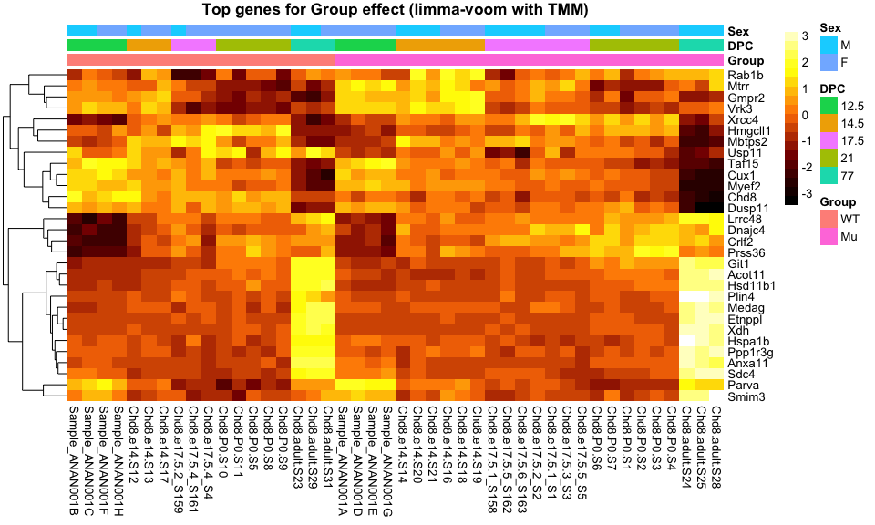<!-- -->

```r
pheatmap(assays(sumexpD)$log2cpm %>% data.frame() %>%
           dplyr::filter(rownames(sumexpD) %in% rownames(topTable(limmavoomTPM, number = 30, 
                                                     coef = c("DPC14.5", "DPC17.5", "DPC21", "DPC77"),
                                                     sort.by = "F"))),
         scale="row", color = bcols, border_color = NA,
         cluster_cols = FALSE,
         annotation_col = colData(sumexpD)[,c("DPC", "Group", "Sex")] %>% data.frame(), 
         main = "Top genes for DPC effect (limma-voom with TPM)")
```

<!-- -->

We see the strongest visual effect with the DPC variable.

## Bonus topic: Heatmap with adjusted data (limma-trend)

Because the expression changes due to Group are small, to visualize them better we can first adjust the data for DPC, as that's a huge signal in the data. It's OK to do this as long as it's clearly indicated that it has been done. We'll use the limma-trend version of the analysis since this is carried out on the log2 CPM values, which are nice to use for visualization (as opposed to counts). In addition, we'll show how to clip the heatmap.

The estimated (fitted) effect of DPC is the fitted coefficients for DPC multiplied by the relevant part of the design matrix. We subtract that from the original data to give us our "DPC-corrected" data.


```r
dadj <- assays(sumexp)$log2cpm  - 
  coefficients(limmatrend)[,c("DPC14.5", "DPC17.5", "DPC21", "DPC77")] %*%
  t(modm[,c("DPC14.5", "DPC17.5", "DPC21", "DPC77")])
dadjG <- dadj[, order(colData(sumexp)$Group, colData(sumexp)$DPC, colData(sumexp)$Sex)]

# Makes it a lot easier to see the Chd8-driven pattern:
pheatmap(dadjG %>% data.frame() %>%
           dplyr::filter(rownames(sumexpG) %in% rownames(topTable(limmavoomTPM, number = 30, 
                                                     coef = "GroupMu", sort.by = "p"))),
         scale="row", 
         cluster_rows = TRUE, cluster_cols = FALSE, color = bcols, border_color = NA,
           annotation_col = colData(sumexpG)[,c("Group", "DPC","Sex" )] %>% data.frame(),
         main = "Chd8 genotype effect, Dev stage-corrected (limma-trend)")
```

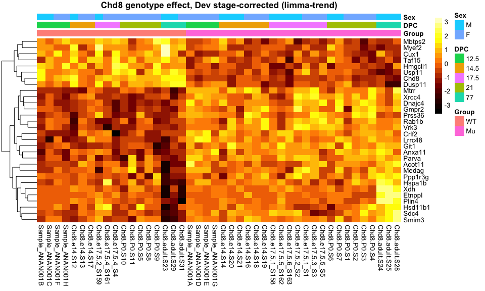<!-- -->

Now the pattern by Group (WT vs Mutant) is a bit easier to see. 

Clipping the data (recall from our lecture on exploratory data analysis and visualization) may make it easier to visualize. It's somewhat a matter of taste; and in this case it doesn't make a huge difference. 


```r
# Sets the minimum (-3), the maximum (3), and the increasing steps (range divided by number of colors)
# for the color scale
breaksList = seq(-3, 3, by = 6/length(bcols))

pheatmap(dadjG %>% data.frame() %>%
           dplyr::filter(rownames(sumexpG) %in% rownames(topTable(limmavoomTPM, number = 30, 
                                                     coef = "GroupMu", sort.by = "p"))),
         scale="row", breaks = breaksList,
         cluster_rows = TRUE, cluster_cols = FALSE, color = bcols, border_color = NA,
           annotation_col = colData(sumexpG)[,c("Group", "DPC","Sex" )] %>% data.frame(),
         main = "Chd8 genotype effect, Dev stage-corrected,  clipped (limma-trend)")
```

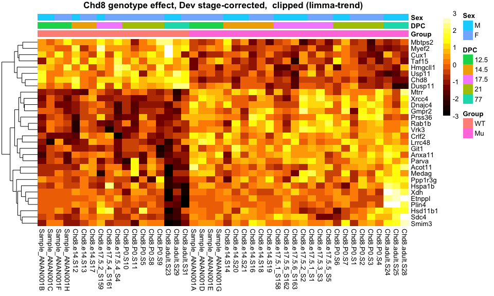<!-- -->

Heatmap for all the FDR < 0.05 genes (there are 299 by limma-trend:


```r
breaksList = seq(-3, 3, by = 6/length(bcols))

pheatmap(dadjG %>% data.frame() %>%
           dplyr::filter(rownames(sumexpG) %in% rownames(topTable(limmavoomTPM, number = Inf, 
                                                                  p.value = 0.05,
                                                                  coef = "GroupMu", 
                                                                  sort.by = "p"))),
         scale="row", breaks = breaksList, show_rownames = FALSE,
         cluster_rows = TRUE, cluster_cols = FALSE, color = bcols, border_color = NA,
           annotation_col = colData(sumexpG)[,c("Group", "DPC","Sex" )] %>% data.frame(),
         main = "Chd8 genotype FDR < 0.05, Dev stage-corrected, clipped (limma-trend)")
```

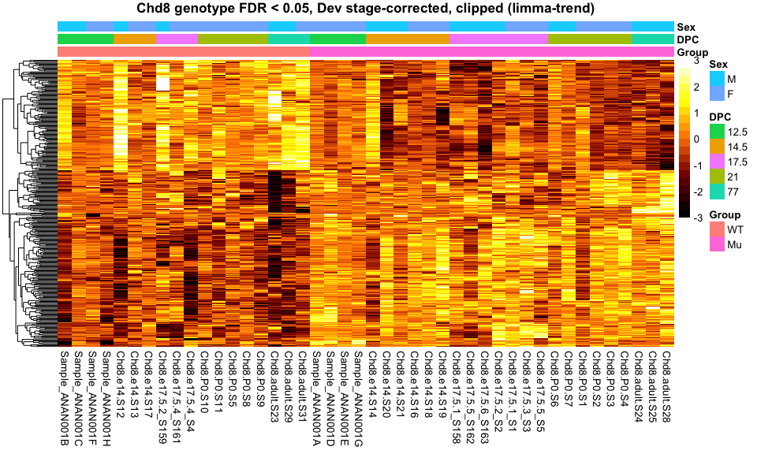<!-- -->


# Comparing methods

Now that we've run 8 different approaches to test each gene for differences in expression by Group (Chd8 mutant vs WT), let's finally compare the results!

Do all methods find the Chd8 gene as significant (FDR < 0.05, with FDR estimated by q-value)?


```r
# compute qvals
difqval <- apply(difmethods, 2, function(x) qvalue(x)$qvalue)

difqval["Chd8",]
```

```
##     lmlogcpm  limmalogcpm   limmatrend    limmavoom limmavoomTPM     edgeRlrt 
## 3.337684e-09 9.422548e-10 4.172884e-10 4.122962e-10 1.775047e-10 1.251449e-24 
##   edgeRquasi       deseq2 
## 1.536544e-10 2.245049e-25
```
Yes! Though the p-values for DESeq2 and edgeR-LRT are much smaller than the rest.

Now, let's examine the overall p-value distributions for each approach to make sure they all look well-behaved.


```r
difmethods %>%
  pivot_longer(names_to = "Method", values_to = "p-value", cols = everything()) %>%
  ggplot(aes(x = `p-value`, group = Method)) +
  geom_histogram(bins = 50) +
  facet_wrap(~ Method)
```

```
## Warning: Removed 3 rows containing non-finite values (stat_bin).
```

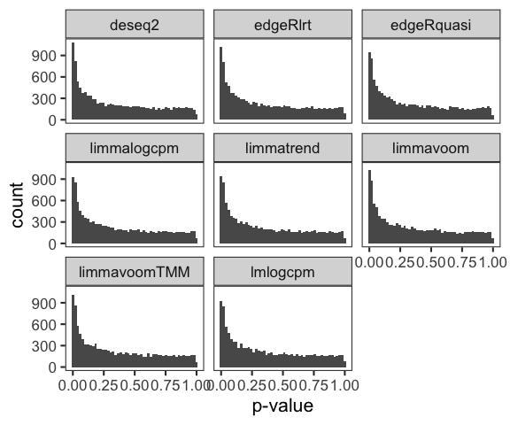<!-- -->

They all look reasonable; no obvious cause for concern. 

Next, here's a plot of pair-wise comparisons of p-values (-log10). To avoid warnings, we remove genes that have missing values.


```r
-log10(difmethods) %>% 
  drop_na() %>%
  ggpairs(lower = list(continuous = wrap("points", alpha = 0.2, size = 0.1)))
```

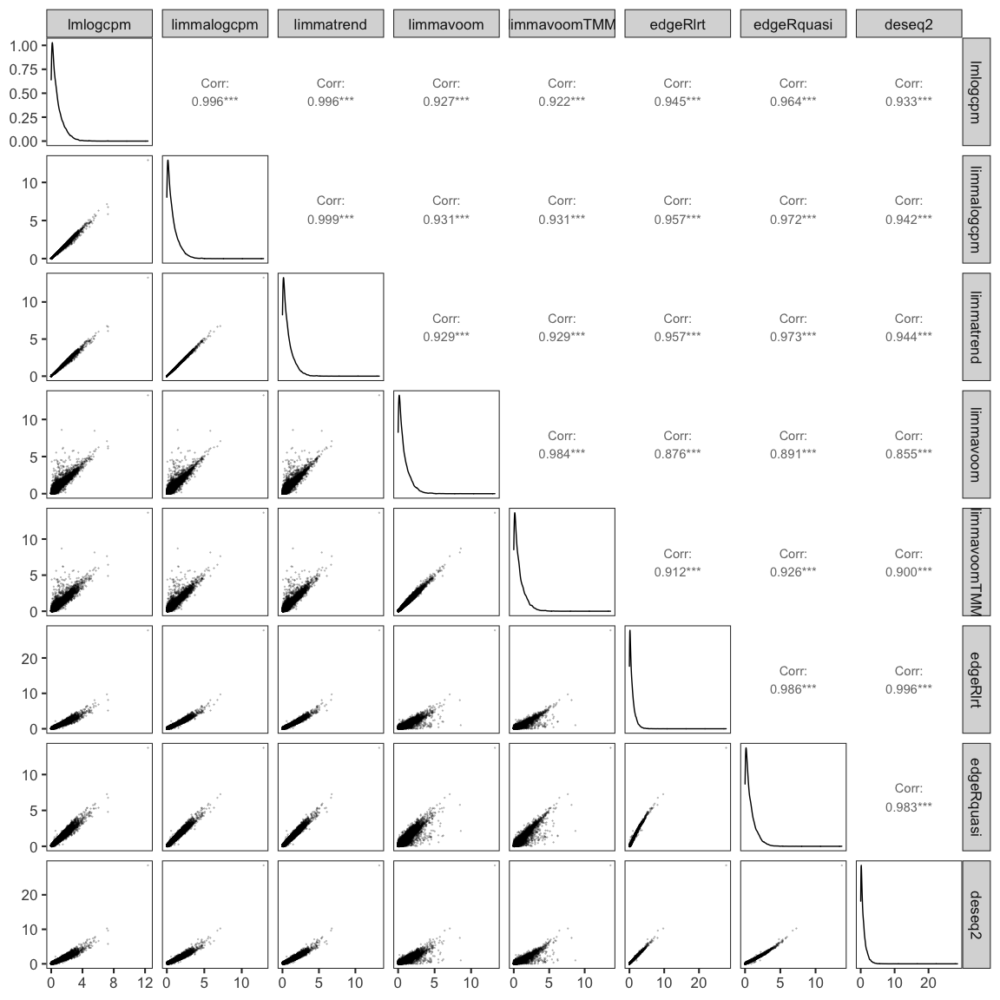<!-- -->
We can see that some methods have extremely high (Pearson) correlation (e.g. lm on logCPM and limma on logCPM), and others a bit lower (e.g. limma-voom and DESeq2).

Here we make a heatmap of Spearman correlations among methods. Clustering of rows and columns as want to see what's similar to what.


```r
mcor <- cor(difmethods, method="spear", use="pair")
pheatmap(mcor, color = bcols)
```

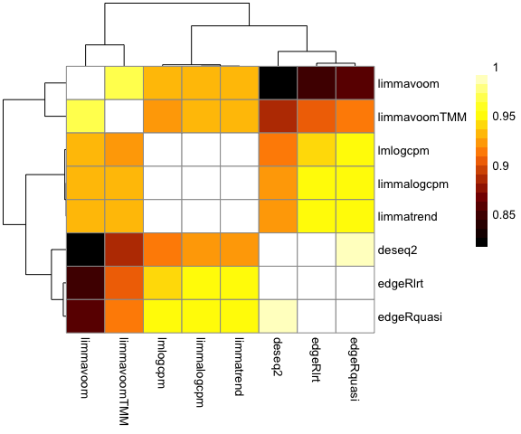<!-- -->

Interestingly, it seems there are three main groupings: (1) limma-voom approaches, (2) the other limma approaches (original and trend) along with regular lm, and (3) DESeq2 and edgeR approaches.

Let's examine the agreement of the top genes (FDR < 0.05), with FDR estimated by q-value.


```r
# get genes qval < 0.05
topGenes <- apply(difqval, 2, function(x) row.names(difqval[x < 0.05,]))

# Counts for each method
unlist(lapply(topGenes, length))
```

```
##     lmlogcpm  limmalogcpm   limmatrend    limmavoom limmavoomTPM     edgeRlrt 
##          416          381          384          615          586          552 
##   edgeRquasi       deseq2 
##          402          710
```

```r
# Upset plot
upset(fromList(topGenes), nsets = 8, order.by = "freq")
```

<!-- -->

We see that `DESeq2` finds the highest number of significant genes, and `limma` on logCPM values finds the fewest. There is a large set of genes that all methods call significant. 

There are plenty of other ways we could evaluate the similarities and differences of the results, or drill into details, but this is good enough to give a sense.

General observations:

* Overall agreement among methods is quite good, especially for the top genes.
* Most significant p-values from edgeR (LR) and DESeq2 are much smaller than for other methods (not that you should seriously believe p-values like 10^-30).
* limma-trend didn't perform much differently than regular limma, possibly because of the wide range of depths among samples (greater than 4-fold difference).
* Variations of approach within methods doesn't make a massive difference (e.g. voom with or without norm factors)

## Differences between limma-trend and limma-voom

While things look very similar overall, we should be curious about the genes that the methods disagree about. Let's examine the gene ranks between limma-trend and limma-voom.


```r
# This is a zoom in on just two methods.
plot(rank(difmethods[,"limmatrend"]), rank(difmethods[,"limmavoom"]), pch=20, cex=0.4,)
```

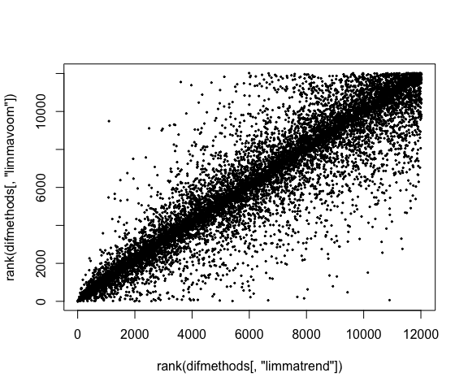<!-- -->

We'll isolate genes which rank high in limma-voom but low in limma-trend: ranked in top 10 of limma-voom, but not in top 1000 of limma-trend.


```r
difranks <- apply(difmethods, 2, rank)

disg <- row.names(difmethods)[which( difranks[,"limmavoom"] < 10 & 
                                     difranks[,"limmatrend"] > 1000)]

# these "hits" are specific to voom.
signif(difmethods[disg,], 3)
```

```
##        lmlogcpm limmalogcpm limmatrend limmavoom limmavoomTPM edgeRlrt
## Etnppl   0.0339      0.0325     0.0600  8.93e-07     6.19e-07  0.00855
## Plin4    0.0455      0.0354     0.0369  2.58e-09     2.01e-09  0.09960
## Xdh      0.0296      0.0262     0.0430  6.48e-07     6.61e-07  0.01070
##        edgeRquasi deseq2
## Etnppl    0.03810 0.1170
## Plin4     0.00731 0.0995
## Xdh       0.03190 0.0473
```

```r
difranks[disg,]
```

```
##        lmlogcpm limmalogcpm limmatrend limmavoom limmavoomTPM edgeRlrt
## Etnppl     1900        1840       2578         9            6      923
## Plin4      2217        1928       1994         2            2     3353
## Xdh        1741        1638       2154         7            7     1055
##        edgeRquasi deseq2
## Etnppl       2013   3737
## Plin4         766   3435
## Xdh          1837   2351
```

What do these genes look like?


```r
# get counts in tidy format
counts_long <- assays(sumexp)$counts %>% data.frame() %>%
  rownames_to_column("Gene") %>%
  pivot_longer(names_to = "Sample", values_to = "Count", cols = -Gene) %>%
  left_join(data.frame(colData(sumexp)), by="Sample")

counts_long %>% 
  filter(Gene %in% disg) %>%
  ggplot(aes(x = Group, y = Count, colour = Group)) +
  geom_jitter(width=0.05, height=0, size=3 )  + 
  facet_grid(Gene ~ DPC) + 
  ggtitle("limma-voom only genes (counts)") + 
  labs(x="Group" ) + 
  geom_hline(yintercept = log2(1), color="grey")
```

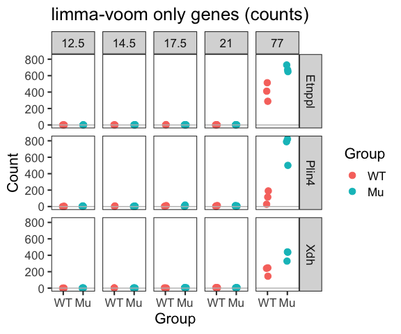<!-- -->

*Conclusions:* Each of these three genes being among the top hits for limma-voom looks fishy. Except for adults, they are is barely expressed (0-4 raw counts vs ~500). Maybe we'd like to see this gene come up if we were looking for interaction effects. 

Why does this happen? For voom the weighting means that very low expression values are going to have little effect on the model fit. Inspecting the weights (`vw[disg,]$weights`) they are about 30-40x higher for the adults.

Whether you think Etnppl, Plin4, and Xdh are false positives or not could be a matter of opinion (we don't know the ground truth), but one lesson is: before getting excited about any particular result, look at the data!
