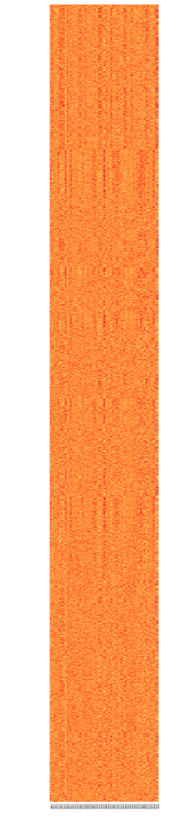

```{r, echo = FALSE}
knitr::opts_chunk$set(warning = FALSE, message = FALSE, fig.retina=3)
ggplot2::theme_set(ggplot2::theme_bw(base_size = 20))
ggplot2::update_geom_defaults("point", list(size = 3))
```


```{css, echo = FALSE}
.remark-code, .remark-inline-code {
  background: #f0f0f0;
}
.remark-code {
  font-size: 20px;
}
.huge .remark-code { /*Change made here*/
  font-size: 200% !important;
}
.tiny .remark-code { /*Change made here*/
  font-size: 60% !important;
}
.small .remark-code { /*Change made here*/
  font-size: 90% !important;
}
.smaller .remark-code { /*Change made here*/
  font-size: 80% !important;
}
```

```{r xaringan-logo, echo=FALSE}
# Put placeholder for video for recordings

# If xaringanExtra isn't isntalled, first run:
#devtools::install_github("gadenbuie/xaringanExtra") 
xaringanExtra::use_logo(
  image_url = "img/video_placeholder.jpg",
  position = xaringanExtra::css_position(top = "0em", right = "0em"),
  exclude_class = c("hide_logo"),
  width = "5.07cm",
  height = "2.87cm",
)
```
<style>
div.blue { background-color:#e6f0ff; border-radius: 5px; padding: 20px;}
</style>

<big><big>

## Learning objectives 

* General principles on organizing your data

* Components of exploratory data analysis (EDA)  

* Common types of plots used in genomics 

* Data quality and experimental design considerations


---

<big><big>

# Where to find code to generate these polots

- These slides were made using R Markdown, which means the R Markdown file **contains the code used to generate the R plots shown** (see [source code here](https://github.com/STAT540-UBC/STAT540-UBC.github.io/tree/master/lectures/lectures_2021/source/lec03-eda))

- Companion R Markdown / html / markdown document that demonstrates multiple ways of making these plots and more detailed info can be found [here](https://github.com/STAT540-UBC/STAT540-UBC.github.io/tree/master/examples/exploration-examples)

---

# Recall the CHD8 RNA-seq experiment

- [Gompers et al. (Nature Neuroscience 2017)](https://www.ncbi.nlm.nih.gov/pmc/articles/PMC6008102/) analyzed 26 Chd8+/del5 and 18 WT littermates

- “Using a statistical model that accounted for sex, developmental stage and sequencing batch, we tested for differential expression across 11,936 genes that were robustly expressed in our data sets”

- We'll use this dataset throughout this lecture to illustrate EDA 

```{r, echo=FALSE, out.width="31%", fig.show = 'hold', fig.cap = 'Figures from Gompers et al. (2017) paper'}
knitr::include_graphics(c("img/GompersDesign.png", "img/GompersHeatmap.png"))
```

  
---

```{r, echo = FALSE}
# read in data behind the scenes
library(tidyverse)
library(plyr)
library(readxl)
library(gridExtra)
library(ComplexHeatmap) 
library(GGally)
library(SummarizedExperiment)
library(pheatmap)

# Set up color scheme for heatmaps 
bcols<-colorRampPalette(c("#000000" ,"#800000" ,"#FF8000" ,"#FFFF00", "#FFFFFF"))(20)

# Set some defaults for ggplot2.
theme_update(panel.grid.major = element_blank(), panel.grid.minor = element_blank())

rpkm.url <- "https://www.ncbi.nlm.nih.gov/geo/download/?acc=GSE99331&format=file&file=GSE99331%5FGompers%5FlogRPKM%5FMatrix%2Etxt%2Egz"
#rpkm.file <- tempfile()
rpkm.file <- "exprs.tsv.gz"
if (!file.exists(rpkm.file))
  download.file(rpkm.url, destfile = rpkm.file)
d <- read.table(gzfile(rpkm.file), header=T, row.names=1)
names(d)<-sub("^X[0-9]+\\.([0-9]+\\.)+", names(d), replacement="")

meta.url <- "https://static-content.springer.com/esm/art%3A10.1038%2Fnn.4592/MediaObjects/41593_2017_BFnn4592_MOESM4_ESM.xlsx"
# meta.file <- tempfile()
meta.file <- "meta.xlsx"
if (!file.exists(meta.file))
download.file(meta.url, destfile = meta.file)
m <- read_xlsx(meta.file)
names(m)<-c("Number", "Sample", "DPC", "Sex", "Group", 
            "SeqRun", "MappedReads", "FeatureCounts")
m$Sex<-factor(m$Sex)
m$Group<-factor(m$Group)
m$Sex=recode(m$Sex, `1`="M", `2`="F")
m$Group=recode(m$Group, `1`="WT", `2`="Mutant")
m$SeqRun=factor(m$SeqRun)
```

# Data organization

- As is often the case, this data was obtained in two separate files

  - **Main data file**: expression values - one per gene, per sample ( $G$ genes $\times$ $N$ samples)
  
  - **Metadata file**: several covariates for each sample, including experimental design variables ( $N$ samples $\times$ $P$ covariates)
  
- We read these into R (not shown here, but shown in [source code]((https://github.com/STAT540-UBC/STAT540-UBC.github.io/tree/master/lectures/lectures_2021/source/lec03-eda) and [companion document](https://github.com/STAT540-UBC/STAT540-UBC.github.io/tree/master/examples/exploration-examples)) as `data.frame`s or `tibble`s - **matrix-like** objects that have column names, and variable types for each column:

```{r}
# data (expression) matrix
dim(d)

# metadata
dim(m)
```

---

# Small but **important** detail

<big>

**Columns of main data matrix should match the rows of the metadata matrix _exactly_**
- the two objects should represent the same set of samples
- the order of the columns in the data matrix should be the same as the order of the rows in the metadata matrix

```{r}
head(colnames(d))
head(rownames(m))
identical(colnames(d), rownames(m))
```

---

# Data matrix 

```{r}
head(d)
```

---

# Metadata

```{r}
m
```

---

# Organizing the data - two main issues

- How you set up your input files for easy reading into R 

  - Easiest to work with are text files (e.g. tab-delimited tsv)
  
  - Excel files not uncommon but not recommended
  
  - Almost always some data cleaning/wrangling involved (e.g. checking consistency, recoding, renaming variables)

- Within R, being able to refer to subsets of both data sets (main data & metadata) and other manipulations that require “matching” the expression data with the sample information (“slicing and dicing”) 

  - For example: “Get me the expression level data for CHD8 in the female adult wild type mice” – this uses information from both sets
  
  - In practice, you may have to do it multiple ways to play nice with different R packages (e.g. one way for visualization, and another for downstream analysis)

---

# Organizing your data: **Option 1 - Separated**

### <span style="color: red;">**Keep main data and metadata tables separate**</span>

Pros:

- Minimal effort and minimal extra code

- Can be compatible with downstream analysis methods (e.g. Bioconductor)

Cons:

- **Risky**: easy to make a mistake when subsetting and/or reordering samples - extra sanity checks required

- Not a convenient format for visualization since main data is separated from its metadata

Overall: <span style="color: red;">*not recommended*</span>

---

# Organizing your data: **Option 2 - Tidy way**

### <span style="color: red;">**The tidy way - combine main data & metadata into one 'long' table**</span>

Pros:
- Unambiguous - keeps all data in one object with one row per observation (e.g. each sample/gene combination is one row, along with all its metadata)

- Plays nice with tidyverse tools (e.g. dplyr manipulations, ggplot2 visualization)

Cons:
- 'long' format is inefficient data storage - sample information is repeated

- Not compatible with many tools for downstream analysis (e.g. Bioconductor)

Overall: <span style="color: red;">*recommended for EDA/visualization*</span>

---

# The Tidy way

```{r pivot_longer, echo = FALSE, results = 'hide'}
# RPKMs in 'long' format - one
d_long <- d %>% 
  rownames_to_column("gene") %>%
  gather(key="Sample", value="Expression", -gene)

# join rpkms with meta data (already in long format)
d_long <- as.tibble(join(d_long, m, by="Sample"))

dim(d_long)

head(d_long)
```

.smaller[
```{r}
d_long
```
]

---

# Organizing your data: **Option 3 - Bioconductor way**

### <span style="color: red;">**The Bioconductor way - combine main data & metadata into one specially formatted object**</span>

Pros:
- Unambiguous - keeps all data in one object with special slots that can be accessed with handy functions

- Plays nice with Bioconductor tools 

- Efficient storage (no duplication of information like tidy way)

Cons:
- Specific to Bioconductor

- Not a compatible format for visualization (e.g. ggplot2)

Overall: <span style="color: red;">*recommended for downstream analysis (e.g. Differential Expression)*</span>

.center[[](https://bioconductor.org/)]

---

# The Bioconductor way: SummarizedExperiment

.pull-left[
<big> 

- [`SummarizedExperiment`](https://bioconductor.org/packages/release/bioc/vignettes/SummarizedExperiment/inst/doc/SummarizedExperiment.html): A special object format that is designed to contain data & metadata

- Comes along with handy accessor functions

- Many related / similar types of objects for specialized data types (e.g. [`RangedSummarizedExperiment`](https://www.bioconductor.org/packages/devel/bioc/vignettes/SummarizedExperiment/inst/doc/SummarizedExperiment.html#anatomy-of-a-summarizedexperiment), [`SingleCellExperiment`](https://bioconductor.org/packages/release/bioc/html/SingleCellExperiment.html), [`DGEList`](https://rdrr.io/bioc/edgeR/man/DGEList.html))
]

.pull-right[
```{r, echo=FALSE, out.width="110%", fig.cap = "Anatomy of a SummarizedExperiment object", fig.show = 'hold', fig.align = 'center'}
knitr::include_graphics(c("img/summarizedexperiment.png"))
```
]

---

# Now what? Time to explore!

<big><big>

- Understand / get a feel for the data

- Formulate hypotheses / develop models

- Identify problems

---

# First questions - sanity checks

- Is the file the expected size? Format?

- Do we have the expected number of samples?

- Are there extra columns/rows in either file? 

- Do the sample names in both files match? (Do not assume same ordering!)

- Are sample / feature names formatted correctly (e.g. no Excel conversion errors)?

- What do features represent? (e.g. Gene names, probe identifiers, etc.)

- Is the data numeric? Integers or decimal? Ratios (to what?)

- Are the data on a log scale? If so what is the base?

- Are there missing data points? What do they mean?

- Do factors have the expected number of levels?

- Do we have all the sample information we need?

---

# These questions might lead to concerns

<big><big>

- If you are the one generating the data, save yourself grief by paying attention to these issues up front. Document what you did and be consistent!

- If you are the analyst, hopefully you were involved in the design stage so there will be fewer surprises.

---

# Making sense of the data

### Data is what we observe, we want to infer something about “where it came from”

```{r, echo=FALSE, out.width="80%", fig.show = 'hold', fig.align = 'center'}
knitr::include_graphics(c("img/statisticsdogma.png"))
```

---

# Model of gene expression data generation

- The measured expression level of gene $g$ is the combination of many effects

- Analysis goal is often to determine relative role of effects - separate signal from “noise”


```{r, echo=FALSE, out.width="80%", fig.show = 'hold', fig.align = 'center'}
knitr::include_graphics(c("img/geneexpmodel.png"))
```

---

# Variability: friend and foe

- If there is no variability, you don’t have any information. The key is controlling/understanding sources of *wanted vs. unwanted* variability. One person’s noise may be another’s signal.

- First line of defense: Know the enemy
  - You can only “correct” for things you know about
  
  - **Keep track of potential sources of variance**: Batches of reagents, slides, personnel, processing dates, etc.

- **Design experiments to minimize impact of technical variability**
  - Don't process all control samples on day 1 and all treated samples on day 10
  
- Ensure appropriate **replication**
  - Biological (important)
  
  - Technical (usually less important but might need to convince yourself)

---

# Biggest pitfall in (high-dimensional) data analysis

<big>

If you don’t **look** at the data, you are likely going to miss important things

- Not just at the beginning, but at every stage

- That could mean making plots, or examining numerical patterns - probably both

- “Sanity checks” should make up a lot of your early effort

- Blindly following recipes/pipelines/vignettes/seminar code → trouble.

---

# First looks at the CHD8 expression data

.left-column[
- What is the size of the data?

- What is the range of the data?

- Are there any missing values?

- Are the data transformed in any way?

]
.right-column[
.smaller[
```{r summarizedexperiment, echo = FALSE}
se <- SummarizedExperiment(assays = list(logrpkm=d),
                           colData = m)
```

```{r}
se

range(assays(se)$logrpkm)
```
]
]

---

# Examining the metadata 

.left-column[
Sample info:
- Age (Days Post-conception, DPC)

- Sex

- Group (genotype)

- Sequencing run (batch)

- Number of mapped reads

- feature counts
]
.right-column[
.small[
```{r}
table(se$DPC)
table(se$Sex)
table(se$SeqRun)
```
]
]

---

# How to look at the rest of the data?

```{r, echo=FALSE, out.width="100%", fig.show = 'hold', fig.align = 'center'}
knitr::include_graphics(c("img/viz.png"))
```

---

# Exploratory Data Analysis

<big><big>

- EDA is “compute a little and graph a lot”

- Exploratory plots can be quick and dirty - making them publication quality takes a lot of time and effort

- I’ll show a few simple approaches that are common in genomics 

- Reminder that code to generate the plots you see here can be found in the [source code for these slides]((https://github.com/STAT540-UBC/STAT540-UBC.github.io/tree/master/lectures/lectures_2021/source/lec03-eda) and in the more detailed [companion document](https://github.com/STAT540-UBC/STAT540-UBC.github.io/tree/master/examples/exploration-examples)

---

# Sanity check: expression of CHD8

.pull-left[
<big>

- Paper reported that CHD8 went down over time, and is lower in the mutant: confirmed!

- Note that we are not doing any formal “analysis” here nor trying to make this plot beautiful – keeping it very simple for our exploration

]
.pull-right[

```{r, fig.width=7, fig.height=6, echo=FALSE}
d_long %>% 
  filter(gene == "Chd8") %>%
  mutate(DPC = as.factor(DPC)) %>%
  ggplot(aes(DPC, Expression, color=Group)) + 
    geom_point( size=2 ) + 
    ggtitle("Expression of Chd8") 
```
]

---

# Boxplots to compare samples

.left-column[
- Quick and dirty; reasonable tool for summarizing large amounts of data

- Not ideal if your distribution is multimodal

- Don’t use box plots (alone) when you have small numbers of points (show the points instead!)
]
.right-column[
```{r, fig.width=11, fig.height=6, echo = FALSE}
ggplot(d_long, aes(Sample, Expression)) + 
  geom_boxplot() + 
  theme(axis.text.x = element_blank())
```
]

---

# Two views of the same data: <br> Let the data speak for itself!

```{r, echo = FALSE, warning = FALSE, message = FALSE, fig.width = 10, fig.height = 5, fig.align= 'center'}
library(ggplot2)
library(gridExtra)

set.seed(124)
df <- data.frame(
  Treatment = c(rep("Control", 25), rep("Treatment", 25)),
  Response = c(pmax(0, rnorm(25, 5, 1.5)), pmax(0, rnorm(23, 7, 4)), 17.4, 19.8)
)

p1 <- ggplot(df, aes(x=Treatment, y=Response)) +
  geom_errorbar(stat = "summary", width = 0.2) +
  geom_bar(stat = "summary") 

p2 <- ggplot(df, aes(x=Treatment, y=Response)) +
  geom_boxplot(outlier.shape = NA) + 
  geom_jitter(height=0, width = 0.1, colour = "grey")

p <- grid.arrange(p1, p2, nrow=1)

```

- What is the sample size? 
- Is the distribution symmetrical, or skewed? 
- Are there any outliers? 

---

# Examining distributions: Histograms and Density plots 

.pull-left[
```{r histograms, fig.width=7, fig.height=6, echo = FALSE}
#ggplot:
d_long %>% 
  ggplot(aes(Expression)) + 
    geom_histogram(binwidth = 0.4) + 
    ggtitle("All genes in all samples")
```
]
.pull-right[
```{r, fig.width=7, fig.height=6, echo = FALSE}
# Overlaid plots
ggplot(data = d_long) + 
  geom_density(aes(Expression, group=Sample, group="Group"), color="grey") + 
  geom_density(aes(Expression), color="black", size=1.5) +
  ggtitle("All genes in all samples")
```
]

---

# Don't use density plots for bounded data


```{r boundeddatahist, fig.width=12, fig.height=6, echo = FALSE, fig.align='center'}
set.seed(123)
bd <- data.frame(value = runif(1000))
p1 <- bd %>% 
  ggplot(aes(value)) +
    geom_histogram(binwidth = 0.05, boundary=0) 

p2 <- bd %>%
  ggplot(aes(value)) +
    geom_density() 

grid.arrange(p1, p2, nrow = 1)
```

---

# Violin plots

### A hybrid of density plots and box plots

```{r violin, fig.width=12, fig.height=6, fig.align='center', echo = FALSE}
d_long %>%
  ggplot(aes(Sample, Expression)) + 
    geom_violin(aes(fill=Group)) + 
    theme(axis.text.x = element_blank())
```

---

# Scatter plots

### Major problem is 'over-plotting' - use transparency or 2D density


```{r, fig.align='center', fig.width=14, fig.height=6, echo = FALSE}
p1 <- ggplot(d, aes(Sample_ANAN001A, Sample_ANAN001G)) + 
  geom_point( alpha=1 ) +
  ggtitle("Default")
p2 <- ggplot(d, aes(Sample_ANAN001A, Sample_ANAN001G)) + 
  geom_point( alpha=1/20) + 
  ggtitle("alpha=1/20")
p3 <- ggplot(d, aes(Sample_ANAN001A, Sample_ANAN001G)) +
  geom_hex(bins=100) + 
  ggtitle("2D density (geom_hex)")
grid.arrange(p1,p2,p3, nrow=1, widths = c(1,1,1.4))
```

---

# Transformations

- Many real data have very skewed distributions – in this case, most values are <500, but there are a smattering up to 10,000
- If your plots look like this, try taking the logarithm
- If have non-positive values (typically 0) add a small constant “pseudocount”

```{r, fig.width=12, fig.height = 5, fig.align = 'center', echo = FALSE}
p1 <- d_long %>% 
  mutate(Expression_raw = 2^Expression) %>%
  ggplot(aes(Expression_raw)) +
    geom_histogram(bins = 45)
p2 <- d_long %>% 
  mutate(Expression_log = Expression) %>%
  ggplot(aes(Expression_log)) +
    geom_histogram(bins = 45)
grid.arrange(p1, p2, nrow=1)
```

---

# Pairwise (scatter) plots to compare samples

.left-column[
## This is nice but unwieldy (or won’t work) for large data sets
]

.right-column[
```{r, fig.width=7, fig.height=7, message = FALSE, echo = FALSE, fig.align='center'}
n<-1000
ggpairs(d[sample(nrow(d), n),6:11], 
        lower=list(continuous=wrap(ggally_points, size=0.5, alpha=0.1))) +
  theme_bw(base_size=12)
```
]

---

# Examining the metadata more globally

.left-column[
- Sex is not that well balanced; all but one of the adults is male 

- There is a batch confound: The stages were run in different batches (except 17.5 was split in two)

- Mapped reads varies with the batches (SeqRun)
]
.right-column[
```{r, fig.width=12, fig.height=7, message = FALSE, echo = FALSE, fig.align='center'}
m %>% select(-Number, -Sample) %>%
  ggpairs(aes(color=Group, alpha=0.4))
```
]

---

# EDA Summary

<big>
Purpose:
- Sanity checks
- Visualization to spot patterns / oddities

Three principles:
- **Let the data speak for itself** - avoid dynamite plots in favor of boxplots, overlayed with points if feasible number
- **Avoid over-plotting** points with transparency and/or 2D density plots
- **Consider transformations** (e.g. log) for skewed distributions

Additional exploratory techniques will be discussed later in the course
- Clustering
- PCA

---

# Heatmaps

```{r, echo=FALSE, out.width="85%", fig.show = 'hold', fig.align = 'center'}
knitr::include_graphics(c("img/heatmaps.png"))
```

---

# R options for making heatmaps

- Desired features
  - Doesn’t complain when handed slightly messy data and has sensible default behaviour
  
  - Allow setting of color used for missing values (e.g. na.color=“grey”)
  
  - Allow easy control of layout such as annotations and scale bar
  
  - Allow easy control over clustering behaviour
  
- There are *many* functions/packages for making heatmaps; here are three
  - [**base::heatmap**](https://www.rdocumentation.org/packages/stats/versions/3.6.2/topics/heatmap) - ok for quick and dirty but otherwise very limited
  
  - [**pheatmap**](https://www.rdocumentation.org/packages/pheatmap/versions/1.0.12/topics/pheatmap) - Default colour schemes not ideal, otherwise good option (used in STAT 540 seminars)
  
  - [**ComplexHeatmaps**](https://bioconductor.org/packages/release/bioc/html/ComplexHeatmap.html) - most powerful/flexible, but a bit more complex to learn 

---

# Heatmap of 50 random rows

```{r, echo = FALSE, fig.align='center', fig.width=8, fig.height=7}
set.seed(654)

# This code selects 'nr' random rows, and then scales (z-scores). base::scale operates on columns, so we have to use t() twice.
nr=50
hd <- as.matrix(d[sample(nrow(d), nr),])
#hd<-t(scale(t(hd))))

heatmap(hd, Colv=NA,  Rowv=NA, scale="none", cexCol=0.5, cexRow=0.5, col=bcols)
```

---

# Revision 1: Same input data, but rows are scaled

.left-column[
- Rows are scaled to have mean 0 and variance 1 (z-scores)

- Subtract the mean; divide by the standard deviation - use `scale()` on the data rows (*some packages will do this by default*)

- It is now easier to compare the rows and see a bit of structure

]

```{r, echo = FALSE, fig.align='center', fig.width=8, fig.height=7}
hd<-t(scale(t(hd)))

heatmap(hd, Colv=NA,  Rowv=NA, scale=NULL, cexCol=0.5, cexRow=0.5, col=bcols)
```

---

# Revision 2: adjusting contrast

.left-column[

- Range of values is **clipped** to (-2,2): aything more than two SDs from the row mean is set to 2

- Limit values of 2 or 3 SDs are common

### Clipping hides outliers but allows us to see variation in the bulk of the data

]

```{r, echo = FALSE, fig.align='center', fig.width=8, fig.height=7}
clip=2
hd[hd < -clip]<--clip
hd[hd > clip]<-clip

heatmap(hd, Colv=NA,  Rowv=NA, scale=NULL, cexCol=0.5, cexRow=0.5, col=bcols)
```

---

# Plotting too much data

.left-column[

]

.right-column[
<big> 

- An entire data set (>10k rows)

- If the cells are less than 1 pixel, everything starts to turn to mush and can even be misleading

- If your heatmap has too many rows to see labels (genes), make sure it is conveying useful information (what are you trying to show?)
]

---

# Choice of colours


```{r, echo=FALSE, out.width="68%", fig.show = 'hold', fig.align = 'center'}
knitr::include_graphics(c("img/colour.png"))
```

- Humans can’t really tell the difference between a 8 and 16 colour scale
- R defaults: ketchup and mustard
- [`RColorBrewer`](https://rdrr.io/cran/RColorBrewer/man/ColorBrewer.html): scales based on work of visualization experts
- Red-black-green: commonly used but *not colourblind friendly*; blue-black-yellow is better
- Greyscale: loss of dynamic range, but cheaper to publish!

---

# Divergent vs. sequential maps

```{r, echo=FALSE, out.width="95%", fig.show = 'hold', fig.align = 'center'}
knitr::include_graphics(c("img/seqdiv.png"))
```

.pull-left[
**Divergent**: colours pass through black or white at the midpoint (e.g. mean). Ideal if your original data are naturally “symmetric” around zero (or some other value) - Otherwise it might just be confusing
]
.pull-right[
**Sequential**: colours go from light to dark. Darker colours mean “higher” by default in `RColorBrewer`. No defined midpoint.
]

---

# A confusing heat map (Matlab)

- Too many different colours to readily interpret relative ordering of values

- Not recommended to use these types of scales for continuous values

- Rainbow or other scales with many distinct colours are better for factors/categorical variables

```{r, echo=FALSE, out.width="40%", fig.show = 'hold', fig.align = 'center'}
knitr::include_graphics(c("img/matlab.png"))
```

---

# Heatmap recommendations

.pull-left[
<big>
- Show a scale bar (so don’t use `base::heatmap`)

- Either cluster rows / columns, or order by something meaningful (e.g. sample info)

- Add annotation bars of meaningful covariates

- If you have missing data points, make sure it is obvious where they are (e.g. different colour)
]

.pull-right[
```{r, echo = FALSE, fig.align='center', fig.width=8, fig.height=7}
pheatmap(hd, color = bcols, 
         border_color = NA, 
         cluster_rows = T, 
         cluster_cols = T, 
         annotation_col = data.frame(Sex = se$Sex, 
                                     DPC = factor(se$DPC), 
                                     Group = se$Group,
                                     row.names = colnames(se)),
         fontsize=8)
```
]

---

class: middle

# Experimental design and quality

---

# Experimental design considerations

- Will the experiment answer the question?
  - Consider properties of the measurement technology as well as the biology

- Sample size?
  - Power calculations: how many individuals should I study? 
  - For many experiments, this is hard to answer (*even though your grant reviewer might demand it!*)
  - Often settle for “enough power to find something useful” rather than “find everything” (not easy to define anyway)

- Biological replicates are essential and more important than technical replicates (usually)
  - Doing a study with too few replicates is arguably worse than not doing the study

- Beware of unwanted variation
  - Avoiding/control confounding factors
  - “Pooling” samples might sound like a good idea, but it is not a substitute for replication
  - For example, if your question is “do people respond to the drug”, the unit of analysis must be Person, not Group of people

---

# Data quality considerations

<big>
General types of issues:

- High technical variability

- Outliers

- Batch artifacts (or other systematic trends)

Effects on the data: 

- Some will yield false positives (confounds, “false signals”)

- Others will yield false negatives (by decreasing signal-to-noise)

---

# Consistency over perfection

<big> 

- Assuming your focus is on comparing samples to each other in some way, the variance of a QC measure is at least as important as its mean

- Be prepared to remove samples to tighten up the spread in quality (removing outliers)

- Though, if most samples are poor by objective criteria, you might want to start over

- **Signal to noise ratio** is more important than amount of noise

---

# Filtering your data

<big>

- Here I mean “Removing part of the data from a sample” and doing that to all samples

- In many studies, especially gene expression, it is common to remove genes that have no or very low signal (“not expressed”)

- Similarly: Common to remove data that have “too many missing values” compared to other samples (if you actually have missing values)

- Deciding what to remove is often not straighforward, but make a principled decision and stick with it (see next slide)

---

# Filters must be “unsupervised”

<big>

- Filtering strategy should treat all samples the same

  - Don't apply one filtering strategy to treated samples and another to controls
  
  - This could bias towards retention of genes that have differences between conditions

- Filter strategy should be decided up front; do not apply iterative filtering

  - Once you filter the data, you are stuck with it. Don’t be tempted to go back and change it based on downstream results

  - For example: “I filtered out 30% of the mostly lowly experessed genes, but then I didn’t get any cool results in my analysis, so I was worried I may have filtered out some good stuff, so I went back and filtered at a less stringent 10%” = **Data Dredging** or **p-hacking**

---

# Batch effects

### “Batch effects are sub-groups of measurements that have qualitatively different behaviour across conditions and are unrelated to the biological or scientific variables in a study”
Leek et al. 2010 Nature Rev. Genetics 11:733


```{r, echo=FALSE, out.width="85%", fig.show = 'hold', fig.align = 'center'}
knitr::include_graphics(c("img/batch.png"))
```

- Magnitude of batch effects vary

- Consider correcting for them if possible - batch artifact detection and correction will be covered in more detail in a later lecture

---

# Avoiding batch artifacts

<big>
- Don’t run in batches - **Confounding** (can be hard to avoid)
- Balance or randomize design with respect to batches.
- Avoid (or at least record) obvious potential sources of artifacts, such as a new tube of a reagent, or a different person doing the bench work
- Run some technical replicates across your batches

```{r}
table(se$DPC, se$SeqRun)
```

---

# Outliers

<big>
Hard to define. To some extent, you’ll know it when you see it.

- “A sample that deviates significantly from the rest of the samples in its class”

- “An observation differing widely from the rest of the data.”

- “A data point notably further out from the central value than the others.  Outliers invite explanation as observational errors, or intrusions from another set, or something of that sort.”

- "... a value that lies 1.5 IQR beyond the upper or lower quartile”

Features (e.g. genes) are not **usually** called “outliers” in the sense of “should remove from the data”

---

# Recommendation for outliers

<big><big>
- Make sample sizes large enough that your study won’t fail if you have a couple of outliers to remove

- Don’t freak out: a mild outlier in a well-powered study probably won’t cause a lot of problems

- Develop criteria for deciding what is an outlier and stick with it

- Once outliers are removed, they stay removed

---

# Identifying outlier samples

<big>
- Relative vs. absolute quality is important

- Usually, we might consider a sample an outlier if (relative to others):
  - It has “very low” signals
  - “High” background
  -“Low” correlation with most (or all) other samples from the same group (see next slides)
  - There may be technology-specific factors
  
- If a sample is questionable, we might ask: Is there anything in the notebook that would make us suspect it? (e.g. “Sample dropped on floor”) 
  – this will help justify decisions to remove a sample beyond supposedly objective criteria like “>1.5 IQR”

---

# A basic but effective outlier detection method

.left-column[
A **heatmap of the sample-sample correlation** matrix (generally a useful diagnostic plot)

Expect correlations to be tighter **within** experimental groups than **across** groups
- There are no firm guidelines for evaluating this ... but you could apply a rule like “out of >1.5 IQR”
- In practice, outliers are often pretty obvious
]

.right-column[

```{r,  fig.width = 9, fig.height = 6.8, fig.align = 'center', echo = FALSE}
cc <- data.frame(cor(d), 
                 row.names = names(d))

Heatmap(as.matrix(cc), col=bcols, 
        cluster_rows = FALSE, cluster_columns = FALSE, 
        top_annotation = HeatmapAnnotation(Group = m$Group,
                                           Batch=m$SeqRun, 
                                           DPC=factor(m$DPC)), 
        row_names_gp = gpar(fontsize = 8), 
        column_names_gp = gpar(fontsize = 8))
```
]


