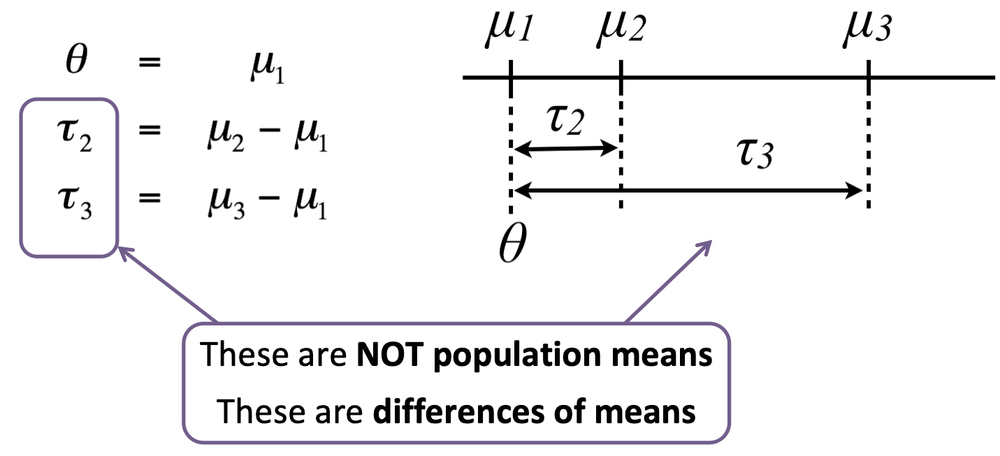

layout: true
background-image: url("img/video_placeholder.jpg")
background-size: 240px
background-position: 100% 0%

```{r, include = FALSE}
knitr::opts_chunk$set(tidy = FALSE, tidy.opts=list(width.cutoff=80), fig.retina=3)
ggplot2::theme_set(ggplot2::theme_bw(base_size = 20))
ggplot2::update_geom_defaults("point", list(size = 3))
```

```{css, echo = FALSE}
.remark-code, .remark-inline-code {
  background: #f0f0f0;
}
.remark-code {
  font-size: 24px;
}
.huge .remark-code { /*Change made here*/
  font-size: 200% !important;
}
.tiny .remark-code { /*Change made here*/
  font-size: 60% !important;
}
.smaller .remark-code { /*Change made here*/
  font-size: 90% !important;
}
.smaller2 .remark-code { /*Change made here*/
  font-size: 80% !important;
}
```


```{r wrap-hook, include=FALSE}
library(knitr)
hook_output = knit_hooks$get('output')
knit_hooks$set(output = function(x, options) {
  # this hook is used only when the linewidth option is not NULL
  if (!is.null(n <- options$linewidth)) {
    x = knitr:::split_lines(x)
    # any lines wider than n should be wrapped
    if (any(nchar(x) > n)) x = strwrap(x, width = n)
    x = paste(x, collapse = '\n')
  }
  
  lines <- options$output.lines
   if (is.null(lines)) {
     return(hook_output(x, options))  # pass to default hook
   }
   x <- unlist(strsplit(x, "\n"))
   if (length(lines)==1) {        # first n lines
     if (length(x) > lines) {
       # truncate the output
       x <- c(head(x, lines))
     }
   } else {
     x <- c(x[lines])
   }
   # paste these lines together
   x <- paste(c(x, ""), collapse = "\n")

  hook_output(x, options)
})

```

---


```{r, include=FALSE}
library(GEOquery)
library(gridExtra)
library(tidyverse)
library(broom)
library(latex2exp)

eset <- getGEO("GSE4051", getGPL = FALSE)[[1]]

# recode time points
pData(eset) <- pData(eset) %>%
  mutate(sample_id = geo_accession) %>%
  mutate(dev_stage =  case_when(
    grepl("E16", title) ~ "E16",
    grepl("P2", title) ~ "P2",
    grepl("P6", title) ~ "P6",
    grepl("P10", title) ~ "P10",
    grepl("4 weeks", title) ~ "4W"
  )) %>%
  mutate(genotype = case_when(
    grepl("Nrl-ko", title) ~ "NrlKO",
    grepl("wt", title) ~ "WT"
  ))

pData(eset) <- pData(eset) %>%
  mutate(dev_stage = fct_relevel(dev_stage, "E16", "P2", "P6", "P10", "4W")) %>%
  mutate(genotype = as.factor(genotype)) %>%
  mutate(genotype = fct_relevel(genotype, "WT", "NrlKO"))

toLongerMeta <- function(expset) {
    stopifnot(class(expset) == "ExpressionSet")
    
    expressionMatrix <- lonExpressionressionMatrix <- exprs(expset) %>% 
    as.data.frame() %>%
    rownames_to_column("gene") %>%
    pivot_longer(cols = !gene, 
                 values_to = "expression",
                 names_to = "sample_id") %>%
    left_join(pData(expset) %>% select(sample_id, dev_stage, genotype),
            by = "sample_id")
  return(expressionMatrix)
}

twoGenes <- toLongerMeta(eset) %>% 
  filter(gene %in% c("1440645_at", "1443184_at")) %>%
  mutate(gene = ifelse(gene == "1440645_at", "BB114814", "Cdc14a")) 
```

# Recall from last class...

<big>

### 1. How to compare means of different groups (2 or more) using a linear regression model

  - dummy/indicator variables to model the levels of a qualitative explanatory variable

### 2. Write a linear model using matrix notation

  - understand which matrix is built by R
  
### 3. Distinguish between **single** and **joint** hypotheses

  - $t$-tests vs $F$-tests  
  
---

# Do we think that the expression levels at different developmental stages are generated by distributions <br> with different location (mean)? Or a single common distribution? 

```{r, include=FALSE}
hitLim <- twoGenes %>% filter(gene == "BB114814") %>%
  ggplot(aes(x = dev_stage, y = expression)) + 
             geom_jitter(width = 0.2, alpha = 0.5) +
             labs(title = "BB114814") +
             theme(legend.position = "none") +
             ylim(5, 10) +
             xlab("") +
             stat_summary(aes(group=1), fun=mean, geom="line", colour="red")

boreLim <- twoGenes %>% filter(gene == "Cdc14a") %>%
  ggplot(aes(x = dev_stage, y = expression)) + 
             geom_jitter(width = 0.2, alpha = 0.5) +
             labs(title = "Cdc14a") +
             theme(legend.position = "none") +
             ylim(5, 10) +
             xlab("") +
             stat_summary(aes(group=1), fun=mean, geom="line", colour="red")
```

```{r, echo=FALSE, fig.width=12.5, fig.height=4, fig.align="center"}
grid.arrange(boreLim, hitLim, nrow = 1)
```

---

## **Quick review**: from $t$-test to linear regression
<big>

### **2-sample t-test**

$$
Y \sim F; \ E[Y]= \mu_Y ; \ Z \sim G; \ E[Z]= \mu_Z
$$
$$ H_0: \mu_Y = \mu_Z$$

<center><big><big> ↓? </big></big></center>

### **Linear regression**

$$ Y = X\alpha + \epsilon; \text{ }\hspace{1em} H_0: \alpha_j = 0$$

<center>
## <font color="blue"><b>HOW? WHY?</b></font>

---

## <font color="blue"> **HOW??** </font>: Cell means model using dummy variables 


$$
Y \sim F; \ E[Y]= \mu_Y ; \ Z \sim G; \ E[Z]= \mu_Z
$$
<center>**↓**

$$Y_{ij}= \mu_1 x_{ij1} + \mu_2 x_{ij2} + \varepsilon_{ij}; \ i=1, \dots, n; \ j={1,2}$$
$$x_{ij1}=\bigg\{\begin{array}{l} 
1\text{ if } j=1\\
0 \text{ otherwise}\\
\end{array}, \hspace{1em} x_{ij2}=\bigg\{\begin{array}{l} 
1\text{ if } j=2\\
0 \text{ otherwise}\\
\end{array}$$

<center>**↓**


.pull-left[
<br>
<br>
<br>
$$\begin{array}{l}
E[Y_{i1}] &= \mu_1 \\
E[Y_{i2}] &= \mu_2
\end{array}$$

]

.pull-right[
```{r,echo=FALSE,out.width="300"}

```
]


---

## <font color="blue"> **HOW??** </font>: Changing the parameterization to reference-treatment <br> using dummy variables

$$
Y \sim F; \ E[Y]= \mu_Y ; \ Z \sim G; \ E[Z]= \mu_Z
$$
<center>**↓**

$$Y_{ij}=\theta + \tau_1 x_{ij1} + \tau_2 x_{ij2} + \varepsilon_{ij}; \ i=1, \dots, n; \ j={1,2}; \tau_1=0$$
$$x_{ij1}=\bigg\{\begin{array}{l} 
1\text{ if } j=1\\
0 \text{ otherwise}\\
\end{array}, \hspace{1em} x_{ij2}=\bigg\{\begin{array}{l} 
1\text{ if } j=2\\
0 \text{ otherwise}\\
\end{array}$$

<center>**↓**


.pull-left[
<br>
<br>
<br>
$$\begin{array}{l}
E[Y_{i1}] &= \theta=\mu_1 \\
E[Y_{i2}] &= \theta + \tau_2=\mu_1\ + (\mu_2 - \mu_1) = \mu_2
\end{array}$$

]

.pull-right[
```{r,echo=FALSE,out.width="150"}
knitr::include_graphics("img/param.png")
```
]

---

## <font color="blue"> **HOW??** </font>: Changing the parameterization to reference-treatment <br> using dummy variables

Removing the $\tau_1  x_{ij1}$ term since $\tau_1 = 0$:

$$
Y \sim F; \ E[Y]= \mu_Y ; \ Z \sim G; \ E[Z]= \mu_Z
$$
<center>**↓**

$$Y_{ij}=\theta+ \tau_2 x_{ij2} + \varepsilon_{ij}; \ i=1, \dots, n; \ j={1,2}$$
$$x_{ij2}=\bigg\{\begin{array}{l} 
1\text{ if } j=2\\
0 \text{ otherwise}\\
\end{array}$$

<center>**↓**


.pull-left[
<br>
<br>
<br>
$$\begin{array}{l}
E[Y_{i1}] &= \theta=\mu_1 \\
E[Y_{i2}] &= \theta + \tau_2=\mu_1\ + (\mu_2 - \mu_1) = \mu_2
\end{array}$$

]

.pull-right[
```{r,echo=FALSE,out.width="150"}
knitr::include_graphics("img/param.png")
```
]

---

## **Using matrix notation ...**

.pull-left[
$$Y_{ij}=\theta+ \tau_2 x_{ij2} + \varepsilon_{ij} \Rightarrow \bf{Y} = \bf{X\alpha+\epsilon}$$
```{r,echo=FALSE,out.width="600", align="center"}

```
]
.pull-right[

* $x_{ij2}$ is the second column of design matrix $X$

* $x_{112} = 0$ and $x_{122} = 1$

<font color="red">Red</font>
$$Y_{11} = 1*\theta + 0*\tau_2 + \epsilon_{11} =\theta + \epsilon_{11}$$

<font color="blue">Blue</font>
$$Y_{12} = 1*\theta + 1*\tau_2 + \epsilon_{12} = \theta + \tau_2 + \epsilon_{12}$$
* Tip: examine design matrix in R with `model.matrix()`

]

### ... and similarly beyond 2 group comparisons (ANOVA)

---
class: center

```{r,echo=FALSE,out.width="750", align="center"}
knitr::include_graphics("img/LM_vbles.png")
```

---

# **Parameterizations**

## Different ways of writing this [design matrix, parameter vector] pair correspond to different **parameterizations** of the model
# $$Y = [X\alpha] + \varepsilon$$
<br> <big>
 Understanding these concepts makes it easier ...
- to interpret and compare fitted models
- to fit models such that comparisons you care most about are directly addressed in the inferential "report"

---

## Example: comparisons of mean expression between groups
<center>
```{r,echo=FALSE,out.width="400"}

```
</center>

--

By default, `lm` estimates group mean differences (with respect to a reference group):

.smaller[
```{r}
filter(twoGenes, gene == "BB114814") %>%
  lm(expression ~ dev_stage, data = .) %>%
  summary() %>% .$coef
```
]

---

# We can tell R to use the cell-means parameterization

Write the formula as `Y ~ 0 + x` in the `lm` call to remove the intercept $(\theta)$ parameter and fit cell means parameters instead.

.small[
```{r}
filter(twoGenes, gene == "BB114814") %>%
  lm(expression ~ 0 + dev_stage, data = .) %>%
  summary() %>% .$coef
```
]

What null hypothesis does the *t*-test column now represent?

--

$H_0$: Each group mean is equal to zero

---

## Recall that we can obtain one set of parameters from the other!

```{r,echo=FALSE,out.width="700", fig.align="center"}
knitr::include_graphics("img/paramconvert.png")
```

.pull-left[
.tiny[
```{r}
filter(twoGenes, gene == "BB114814") %>%
  lm(expression ~ 0 + dev_stage, data = .) %>%
  summary() %>% .$coef
```
]
]

.pull-right[
.tiny[
```{r}
filter(twoGenes, gene == "BB114814") %>%
  lm(expression ~ dev_stage, data = .) %>%
  summary() %>% .$coef
```
]
]

---

# Learning objectives for today

### 1. Model more than one factor with multiple levels

  - build models with multiple categorical variables and their interaction

### 2. Distinguish between **simple** and **main** effects 

  - `lm` vs `anova` tests
  
### 3. Test main effects using nested models 

  - $t$-tests vs $F$-tests
  
  

---

## Increasing the complexity of the linear model ...

```{r,echo=FALSE, include=FALSE}
##########################################################
## simplying dev_stage to first and last timepoints
##########################################################

# Gene selected for illustration
oneGene <- toLongerMeta(eset) %>% 
  filter(gene == "1455695_at") %>%
  filter(dev_stage %in% levels(dev_stage)[c(1, nlevels(dev_stage))]) %>%
  mutate(dev_stage = droplevels(dev_stage),
        `genotype:dev_stage` = interaction(genotype, dev_stage))
```

#### What if you have *two* categorical variables?

  e.g., `genotype` and `dev_stage` (for simplicity, let's consider only E16 and 4W)

- ANOVA is usually used to study models with one or more categorical variables (factors)

- Can we combine 2 levels in each of 2 factors into 4 groups (treat as one factor)? 

&nbsp;  

```{r,echo=FALSE,fig.height= 4, fig.width = 5.833, fig.align="left"}
set.seed(3849)
mu.hat <- oneGene %>% 
  group_by(`genotype:dev_stage`) %>% 
  summarize(meanExpr = mean(expression)) %>%
  data.frame()

p0 <- ggplot(oneGene, 
                aes(x = `genotype:dev_stage`, y = expression)) + 
  geom_jitter(width = 0.1, alpha = 0.6) +
  ylim(6, 13) + 
  geom_line(data = oneGene %>% group_by(`genotype:dev_stage`) %>%
              summarize(meanExp = mean(expression)),
            aes(x = `genotype:dev_stage`, y = meanExp, group = 1),
               size = 1.5) +
  ggtitle("One-way ANOVA (4 groups)")

p1 <- ggplot(oneGene, 
                aes(x = dev_stage, y = expression, colour = genotype)) + 
  geom_jitter(width = 0.1, alpha = 0.6) +
  ylim(6, 13) + 
  stat_summary(aes(group = genotype,colour=genotype), 
               fun = mean, geom = "line", size = 1.5) +
  ggtitle("Two-way ANOVA") +
  scale_color_manual(values = c('WT' = '#00BFC4', 'NrlKO' = '#F8766D'))

p0
```

---

## Increasing the complexity of the linear model ...

#### What if you have *two* categorical variables?

  e.g., `genotype` and `dev_stage` (for simplicity, let's consider only E16 and 4W)

- ANOVA is usually used to study models with one or more categorical variables (factors)

- Can we combine 2 levels in each of 2 factors into 4 groups (treat as one factor)? 

  - This would be a one-way ANOVA: we miss the interaction effect

```{r,echo=FALSE,fig.height= 4, fig.width = 14, fig.align="center"}
grid.arrange(p0, p1, nrow = 1, widths = c(1, 1.4))
```


---


## Two-way ANOVA (or a linear model with interaction)

.pull-left[
Which group means are we comparing in a model with 2 factors? 

$$\mu_1=E[Y_{(WT,E16)}]$$ 
$$\mu_2=E[Y_{(NrlKO,E16)}]$$
$$\mu_3=E[Y_{(WT,4W)}]$$
$$\mu_4=E[Y_{(NrlKO,4W)}]$$
]

.pull-right[
```{r,echo=FALSE,fig.height= 4, fig.align="center"}
p1 <- p1 + ggtitle(paste0("Probe ", oneGene$gene[1]))
p1 +
  geom_text(aes(x = "E16", y = mu.hat[1,2], 
                label = TeX("$\\widehat{\\mu}_1$", output = "character")), 
            colour = "black", size = 6, parse = TRUE, nudge_x = -0.08) +
  geom_text(aes(x = "E16", y = mu.hat[2,2], 
                label = TeX("$\\widehat{\\mu}_2}$", output = "character")), 
            colour="black", size=6,parse = TRUE, nudge_x = -0.08) +
  geom_text(aes(x = "4W", y = mu.hat[3,2], 
                label = TeX("$\\widehat{\\mu}_3$", output = "character")), 
            colour = "black", size = 6, parse = TRUE, nudge_x = 0.1) +
  geom_text(aes(x = "4W", y = mu.hat[4,2], 
                label = TeX("$\\widehat{\\mu}_4$", output = "character")), 
            colour = "black", size = 6, parse = TRUE, nudge_x = 0.1) +
  geom_point(aes(x = "E16", y = mu.hat[1,2]), size=3, shape=1, colour='black') +
  geom_point(aes(x = "E16", y = mu.hat[2,2]), size=3, shape=1, colour='black') +
  geom_point(aes(x = "4W", y = mu.hat[3,2]), size=3, shape=1, colour='black') +
  geom_point(aes(x = "4W", y = mu.hat[4,2]), size=3, shape=1, colour='black')

```
]
---

# Reference-treatment effect parameterization

<big>

* By default, `lm` assumes a <font color = "red">**reference-treatment effect**</font> parameterization 

* Mathematically, we need *more* dummy variables, see [companion handout](https://stat540-ubc.github.io/examples/linearModels/lect07_companion_linear_models.html) for more details

```{r,tidy.opts=list(width.cutoff=40)}
twoFactFit <- lm(expression ~ genotype * dev_stage, oneGene)
```

```{r,echo=FALSE}
summary(twoFactFit)$coeff
```

---

## Cell-means and treatment effects in the two-way model - <br> why do we need more dummy variables?

.smaller[
```{r,tidy.opts=list(width.cutoff=40)}
table(oneGene$dev_stage, oneGene$genotype)
```
```{r,tidy.opts=list(width.cutoff=40), message = FALSE}
(means.2Fact <- group_by(oneGene, dev_stage, genotype) %>% 
          summarize(cellMeans = mean(expression)) %>% ungroup() %>%
          mutate(txEffects = cellMeans - cellMeans[1],
                 lmEst = as.vector(summary(twoFactFit)$coeff[,1])))
```
]

---

# What is the reference group here?

<big>
<center><font color="blue"> WT & E16 </font></center>

As before, comparisons are relative to a reference but in this case there is a reference level *in each factor*: <font color="blue">WT and E16 </font>

```{r,echo=FALSE,fig.width= 7.5, fig.height=4.5, fig.align="center"}
p1 +
  geom_text(aes(x = "E16", y = mu.hat[1,2], 
                label = TeX("$\\widehat{\\theta}=\\widehat{\\mu}_1$", output = "character")),
            colour="black", size=6, parse = TRUE, nudge_x = -0.15) + 
  geom_point(aes(x = 1, y = mu.hat[1,2]), size=3, shape=1, colour='black')
```

---

# The reference: WT & E16

**Mean of reference group**: $\theta=E[Y_{WT,E16}]$ 
  
**`lm` estimate**: $\hat{\theta}$ is the sample mean of the group 

.smaller[
```{r,echo=FALSE,highlight.output = c(2)}
summary(twoFactFit)$coeff
```
```{r,echo=FALSE,highlight.output = c(4)}
means.2Fact
```
]

In general, one is not interested in: $H_0: \theta=0$

---

## Simple genotype effect: WT *vs* NrlKO <font color="blue"> at E16 </font>

<big>
And now the "treatment effects"... 

> **Important**: effects are not marginal but *conditional* effects (<font color="blue">at a given level </font> of the other factor, e.g., at E16), usually called **simple effects**

```{r,echo=FALSE,fig.align="center", fig.width= 8, fig.height=4}
p1 +
  geom_text(aes(x = "E16", y = abs(mu.hat[1,2]+mu.hat[2,2])/2, 
                label = TeX("$\\widehat{\\tau}_{KO}$", output = "character")),
            colour = "black", size = 6, parse = TRUE, nudge_x = -0.15) + 
  geom_point(aes(x = "E16", y = mu.hat[1,2]), 
             size = 3, shape = 1, colour = 'black', alpha = 0.5) +
  geom_point(aes(x = "E16", y = mu.hat[2,2]), 
             size = 3, shape = 1, colour = 'black', alpha = 0.5) +
  geom_segment(aes(x = 0.96, y=mu.hat[1,2], xend = 0.96, yend = mu.hat[2,2]),
               colour = 1, arrow = arrow(length = unit(0.1,"in")), size = 0.75) 
```

---

class: middle

## Simple **genotype** effect: WT *vs* NrlKO <font color="blue"> at E16 </font>

**Effect of genotype at E16**: $\tau_{KO}=E[Y_{NrlKO,E16}]-E[Y_{WT,E16}]$

**`lm` estimate**: $\hat{\tau}_{KO}$ is the *difference* of sample respective means (check below)

.smaller[
```{r,echo=F,highlight.output = c(3)}
summary(twoFactFit)$coeff
```

```{r,echo=F,highlight.output = c(5)}
means.2Fact
```
]

**But**, do you want to test the *conditional* effect at E16: $H_0: \tau_{KO}=0$?? 

---

## Simple **developmental** effect: E16 *vs* 4W <font color="blue"> in WT </font>

<big>

Similarly, for the other factor: $\tau_{4W}$ is the effect of developmental time (4W vs E16)
**in WT**

```{r,echo=FALSE,fig.height= 4.5, fig.width=8, fig.align="center"}
p1 +
#parameter and segments
  geom_text(aes(x = 2.2, y = abs(mu.hat[1,2]+mu.hat[3,2])/2, 
                label = TeX("$\\widehat{\\tau}_{4W}$", output = "character")), 
            colour = "black", size = 6, parse = TRUE) + 
  geom_segment(aes(x=2.1,y=mu.hat[1,2],xend=2.1,yend=mu.hat[3,2]),colour=1,
               arrow = arrow(length = unit(0.1,"in")), size = 0.75) + 
  geom_segment(aes(x = 1, y = mu.hat[1,2], xend = 2, yend = mu.hat[1,2]), 
               colour = 'darkgrey', linetype = 2, size = 0.75) +
  #circles around mean
  geom_point(aes(x = 1, y = mu.hat[1,2]), size = 3, shape = 1, colour = 'black') +
  geom_point(aes(x = 2, y = mu.hat[3,2]), size = 3, shape = 1, colour = 'black') 
```

---

## Simple developmental effect: E16 *vs* 4W <font color="blue"> in WT </font>

**Effect of development in WT**: $\tau_{4W}=E[Y_{WT,4W}]-E[Y_{WT,E16}]$

**`lm` estimate**: $\hat{\tau}_{4W}$ is the *difference* of respective sample means (check below)

.smaller[
```{r,echo=F,highlight.output = c(4)}
summary(twoFactFit)$coeff
```

```{r,echo=F,highlight.output = c(6)}
means.2Fact
```
]

---

# Interaction effect

Is the effect of genotype the same at different developmental stages? (or is the development effect the same for both genotypes?)

```{r,echo=FALSE,fig.height= 3.75, fig.width=8, fig.align="center"}
mu.add <- mu.hat[3,2] - (mu.hat[1,2] - mu.hat[2,2])

p1.itx  <- p1 
p1.itx
```

---

# Interaction effect

Is the effect of genotype the same at different developmental stages? (or is the development effect the same for both genotypes?)

```{r,echo=FALSE,fig.height= 3.75, fig.width=8, fig.align="center"}
mu.add <- mu.hat[3,2] - (mu.hat[1,2] - mu.hat[2,2])

p1.itx  <- p1 +
  #circles at means    
     geom_point(aes(x = 2, y = mu.hat[3,2] - (mu.hat[1,2]-mu.hat[2,2])), 
                size = 3, shape = 1, colour = 'darkgrey') +
     geom_point(aes(x = 2, y = mu.hat[3,2]), 
                size = 3, shape = 1, colour = 'black') +
    #parameters and segments
  #additive position
    geom_segment(aes(x = 1, y = mu.hat[2,2], xend = 2, yend = mu.add), 
                 colour='grey', linetype = 2, size = 0.75)+
  #tau_4W
    geom_segment(aes(x = 2.1, y = mu.hat[3,2], xend = 2.1, yend = mu.add),
                 colour = 'grey', arrow = arrow(length = unit(0.1,"in")),
                 size = 0.75) +
    geom_text(aes(x = 2.2, y = abs(mu.hat[3,2]+mu.add)/2, 
                  label = TeX("$\\widehat{\\tau}_{KO}$", output = "character")),
              colour = 'grey', size = 6, parse = TRUE) 
p1.itx
```

---

# Interaction effect

Is the effect of genotype the same at different developmental stages? (or is the development effect the same for both genotypes?)


```{r,echo=FALSE,fig.height= 3.75, fig.width=8, fig.align="center"}
p1.itx +
  #circles at means    
    geom_point(aes(x = 2, y = mu.hat[4,2]), size = 3, shape = 1, colour = 'blue') +
  #interaction
    geom_segment(aes(x = 2.1, y = mu.add, xend = 2.1, yend = mu.hat[4,2]),
                 colour = 'blue', arrow = arrow(length = unit(0.1,"in")),
                 size = 0.75) +
    geom_text(aes(x = 2.26, y = abs(mu.hat[4,2] + mu.add)/2, 
                  label = TeX("$\\widehat{\\tau}_{KO:4W}$", output = "character")),
              colour = "blue", size = 6, parse = TRUE)
```

--

**Yes, if** there's no interaction effect, i.e., $\tau_{KO:4W}=0$ 

The genotype effect at E16 is $\tau_{KO}$. However, $\tau_{KO}$ does not seem to be the effect at 4W. The difference is the interaction effect!

---

# Interaction effect

Difference of differences:

$$\tau_{KO:4W}= (E[Y_{NrlKO,4W}]-E[Y_{WT,4W}]) - (E[Y_{NrlKO,E16}]-E[Y_{WT,E16}])$$

<small>

```{r,echo=FALSE,highlight.output = c(5)}
summary(twoFactFit)$coeff
```

```{r, echo = FALSE}
mean.E16.WT <- means.2Fact %>% filter(dev_stage == "E16" & genotype == "WT") %>% pull(cellMeans)
mean.E16.KO <- means.2Fact %>% filter(dev_stage == "E16" & genotype == "NrlKO") %>% pull(cellMeans)
mean.4W.WT <- means.2Fact %>% filter(dev_stage == "4W" & genotype == "WT") %>% pull(cellMeans)
mean.4W.KO <- means.2Fact %>% filter(dev_stage == "4W" & genotype == "NrlKO") %>% pull(cellMeans)
```

```{r}
(mean.4W.KO - mean.4W.WT) - (mean.E16.KO - mean.E16.WT) 
```

---

## Summary of model parameters: with interaction 

model parameter | `lm` estimate| stats | interpretation
--------|---------|---------
$\theta$ | `(Intercept)` | $E[Y_{WT,E16}]$ | reference
$\tau_{KO}$ | `genotypeNrlKO` | $E[Y_{NrlKO,E16}] - E[Y_{WT,E16}]$ | *conditional* effect of NrlKO at E16
$\tau_{4W}$ | `dev_stage4W` | $E[Y_{WT,4W}] - E[Y_{WT,E16}]$ | *conditional* effect of 4W in WT
$\tau_{KO:4W}$ | `genotypeNrlKO:dev_stage4W`  | $E[Y_{NrlKO,4W}] - E[Y_{WT,4W}] - \tau_{KO}$  | *interaction* effect of NrlKO and 4W

It is *important* to remember that `lm` reports **simple, not main** effects! <font color="blue"> 
Why? Because of the parameterization used! </font> (see see[companion handout](https://stat540-ubc.github.io/examples/linearModels/lect07_companion_linear_models.html))

It can also be shown that $\tau_{KO:4W}=E[Y_{NrlKO,4W}]-\tau_{4W}-\tau_{KO}-\theta$ (see previous slide and handout).

---
class: middle

### Let's examine these parameters closer and some examples

<big>     
For our model, `lm` tests 4 hypotheses:

.pull-left[
> ### $H_0: \theta=0$
### $H_0: \tau_{KO}=0$
### $H_0: \tau_{4W}=0$
### $H_0: \tau_{KO:4W}=0$
]
.pull-right[
<br>
```{r,echo=FALSE,out.width="400", fig.align="center"}
knitr::include_graphics("img/2way_param.png")
```

]

We may not be interested in these hypotheses, e.g., $\tau_{KO}$ and $\tau_{4W}$ are *conditional* effects *at* a given level of a factor (*simple effects*)
---

## Example 1: nothing is statistically significant, very flat genes 
```{r,tidy.opts=list(width.cutoff=30), echo = FALSE}
# Gene selected for illustration
twoGenes <- toLongerMeta(eset) %>% 
  filter(gene %in% c("1442080_at","1448243_at")) %>%
  filter(dev_stage %in% levels(dev_stage)[c(1, nlevels(dev_stage))]) %>%
  mutate(dev_stage = droplevels(dev_stage),
        `genotype:dev_stage` = interaction(genotype, dev_stage))
```


```{r echo=FALSE, fig.height=6, fig.width=14, warning=FALSE,message=FALSE}
plot1Lim <- filter(twoGenes, gene == "1442080_at") %>%
  ggplot(aes(x = dev_stage, y = expression, group = genotype, colour = genotype)) + 
  geom_jitter(width = 0.1, alpha = 0.6) +
  labs(title = "1442080_at") +
  theme(legend.position = "none") +
  ylim(6, 10) +  
  stat_summary(fun = mean, geom = "line", size = 1.5) +
  scale_color_manual(values = c('WT' = '#00BFC4', 'NrlKO' = '#F8766D'))

plot2Lim <- filter(twoGenes, gene == "1448243_at") %>%
  ggplot(aes(x = dev_stage, y = expression, group = genotype, colour = genotype)) + 
  geom_jitter(width = 0.1, alpha = 0.6) +
  labs(title = "1448243_at") +
  ylim(6, 10) +  
  ylab("") +
  stat_summary(fun = mean, geom = "line", size = 1.5) +
  scale_color_manual(values = c('WT' = '#00BFC4', 'NrlKO' = '#F8766D'))

grid.arrange(plot1Lim, plot2Lim, nrow = 1, widths = c(1, 1.3))
```

---

## Example 1: nothing is statistically significant, very flat genes 


Summary of `lm` for the gene in the right plot on previous slide:

```{r,highlight.output = c(3:5)}
filter(twoGenes, gene == "1448243_at") %>%
  lm(expression ~ genotype * dev_stage, data = .) %>%
  summary() %>% .$coeff
```

---

## Example 2: statistically significant interaction (non-parallel) 

```{r,echo=FALSE,warning=FALSE}
# Gene selected for illustration
twoGenes <- toLongerMeta(eset) %>% 
  filter(gene %in% c("1434709_at","1458220_at")) %>%
  filter(dev_stage %in% levels(dev_stage)[c(1, nlevels(dev_stage))]) %>%
  mutate(dev_stage = droplevels(dev_stage),
        `genotype:dev_stage` = interaction(genotype, dev_stage))
```


```{r echo=FALSE, fig.height=6, fig.width=14}
plot1Lim <- filter(twoGenes, gene == "1434709_at") %>%
  ggplot(aes(x = dev_stage, y = expression, group = genotype, colour = genotype)) + 
  geom_jitter(width = 0.1, alpha = 0.6) +
  labs(title = "1434709_at") +
  theme(legend.position = "none") +
  ylim(5, 11) +  
  stat_summary(fun = mean, geom = "line", size = 1.5) +
  scale_color_manual(values = c('WT' = '#00BFC4', 'NrlKO' = '#F8766D'))

plot2Lim <- filter(twoGenes, gene == "1458220_at") %>%
  ggplot(aes(x = dev_stage, y = expression, group = genotype, colour = genotype)) + 
  geom_jitter(width = 0.1, alpha = 0.6) +
  labs(title = "1458220_at") +
  ylim(5, 11) +  
  ylab("") +
  stat_summary(fun = mean, geom = "line", size = 1.5) +
  scale_color_manual(values = c('WT' = '#00BFC4', 'NrlKO' = '#F8766D'))

grid.arrange(plot1Lim, plot2Lim, nrow = 1, widths = c(1, 1.3))
```

---

## Example 2: statistically significant interaction (non-parallel) 

Summary of `lm` for the gene in the left plot on previous slide:

```{r,echo=FALSE,warning=FALSE}
filter(twoGenes, gene == "1434709_at") %>%
  lm(expression ~ genotype * dev_stage, data = .) %>%
  summary() %>% .$coeff
```

- Note that interaction means the **simple** effects may not agree: compare the genotype effect @E16 (`genotypeNrlKO`) with that @4W

  - What is the effect of genotype at 4W?

--

- **Main** effects (overall): does genotype have an effect on gene expression? 

--

> We can't (yet) answer this question! It depends (on the level of `dev_stage`)! (more later) 

---

## Example 3: **BALANCED** & only genotype @E16 is significant

For simplicity here, we'll add a random observation in the NrlKO & E16 group (close to its mean) to have a *balanced* design 
> In *unbalanced* designs the *main* effects are a *weighted* average of the simple effects, and the weights are not easy to interpret (beyond the scope of this course but worth noting the issue!)

<small>

```{r, echo = FALSE}
set.seed(484)
# Genes selected for illustration
twoGenes <- toLongerMeta(eset) %>% 
  filter(gene %in% c("1447753_at","1431651_at")) %>%
  filter(dev_stage %in% levels(dev_stage)[c(1, nlevels(dev_stage))]) %>%
  mutate(dev_stage = droplevels(dev_stage))
```
.smaller[
```{r, tidy.opts=list(width.cutoff=50)}
# recall our unbalanced design
table(pData(eset)$genotype, pData(eset)$dev_stage)

# Duplicate sample GSM92615 (E16 NrlKO) and add noise expression
twoGenes <- filter(twoGenes, sample_id == "GSM92615") %>%
  mutate(expression = expression + rnorm(n(), 0, 0.1)) %>%
  rbind(twoGenes)
```
]

---

## Example 3: only genotype @E16 is significant

```{r echo=FALSE, fig.height=4.5, fig.width=14}
plot1Lim <- filter(twoGenes, gene == "1447753_at") %>%
  ggplot(aes(x = dev_stage, y = expression, group = genotype, colour = genotype)) + 
  geom_jitter(width = 0.1, alpha = 0.6) +
  labs(title = "1447753_at") +
  theme(legend.position = "none") +
  ylim(6.1, 7.1) +  
  stat_summary(fun = mean, geom = "line", size = 1.5) +
  scale_color_manual(values = c('WT' = '#00BFC4', 'NrlKO' = '#F8766D'))

plot2Lim <- filter(twoGenes, gene == "1431651_at") %>%
  ggplot(aes(x = dev_stage, y = expression, group = genotype, colour = genotype)) + 
  geom_jitter(width = 0.1, alpha = 0.6) +
  labs(title = "1431651_at") +
  ylim(6.1, 7.1) +  
  ylab("") +
  stat_summary(fun = mean, geom = "line", size = 1.5) +
  scale_color_manual(values = c('WT' = '#00BFC4', 'NrlKO' = '#F8766D'))

grid.arrange(plot1Lim, plot2Lim, nrow = 1, widths = c(1, 1.3))
```


* The interaction effect is not significant (almost parallel pattern)

* The effect of developmental stage is not significant for WT (almost flat pattern)

---


## Example 3: only genotype @E16 is significant 

```{r, highlight.output = 3}
filter(twoGenes, gene == "1447753_at") %>%
  lm(expression ~ genotype * dev_stage, data = .) %>%
  summary() %>% .$coeff
```

* There is a genotype effect at E16

* There may be a genotype effect *regardless* of the developmental stage (**main** effect). However, that hypothesis is **not** tested here!!  

--

* How do we test a **main** effect??  

---

# How do we test for a **main** effect?

<big>

- The main effect measures the *overall* association between the response and a factor. They are the (weighted) average of an effect over the levels of the other factor

> **Note**: a significant interaction means that the effect of a factor depends on the level of the other one. Thus, looking at main effects alone may mask interesting results!

- `anova()` can be used to test the main effects

- The following is the null hypothesis that there is no main effect of genotype:

$$H_0: \frac{(E[Y_{KO,E16}]-E[Y_{WT,E16}])+(E[Y_{KO,4W}]-E[Y_{WT,4W}])}{2}=0$$

> **Note** that for unbalanced experiments $H_0: w_1 \text{effect}_{E16}+ w_2 \text{effect}_{4W}=0$, where $w_1$ and $w_2$ are sample size weights

---

# Main effects using `anova`

.smaller[
```{r,highlight.output = c(4:5)}
filter(twoGenes, gene == "1447753_at") %>%
  lm(expression ~ genotype * dev_stage, data = .) %>%
  anova() %>% tidy()
```
]

As we suspected, there is a **significant genotype effect** for this probe (1447753_at), i.e., its mean expression changes in NrlKO group (compared to WT), on average over developmental stages.

> **Technical note**: `anova()` uses *type I sums of squares* (sequential/conditional), thus order matters in unbalanced designs!

---

# Main & interaction effects: important notes

<big>

- A **significant interaction effect** means that the effect of one factor depends on the levels of another 
  - e.g., the effect of genotype depends on developmental stage

- **Main effects**: are the (weighted) average of an effect over the levels of the other factor. 

- A **non-significant main effect** means that, on average, there's no evidence of a factor's effect
  - e.g., no evidence of a genotype effect, on average over both developmental stages

- **Note of caution**: if the interaction is significant, it is possible that one or both simple effects are significant but the average effect (i.e., the main effect) is not. This is because the effect of a factor *depends on* the level of the other one!

---

# Additive models

- In some applications, we need to/want to test the interaction term

- However, additive models are easier and smaller

- If there are no statistical or biological grounds to include the interaction term, additive models are preferred 

- Additive effects: $E[Y_{NrlKO,4W}]-E[Y_{WT,E16}]=\tau_{KO}+\tau_{4W}$

```{r}
filter(twoGenes, gene == "1447753_at") %>%
  lm(expression ~ genotype + dev_stage, data = .) %>%
  summary() %>% .$coeff
```


---

# **Additive models** and balanced designs

<big>

- In an additive model for a balanced design, the parameters are **average effects**, over the levels of the other factor. Now, same as in `anova()`!

  - Note the agreement! This is gone in unbalanced designs since weights are computed differently! 

- The intercept parameter is now $\bar{Y} - \bar{x}_{ij,KO}\hat{\tau}_{KO} - \bar{x}_{ij,4W}\hat{\tau}_{4W}$

> **Note**: *Type III sum of squares* (marginal, conditional on all other terms in the model) are required for agreement in unbalanced designs (use `car::Anova` to obtain) - beyond our scope

---

## Parameters in balanced additive models represent main effects

<small>
.smaller[
```{r,tidy.opts=list(width.cutoff=40),highlight.output =c(3)}
(fit <- filter(twoGenes, gene == "1447753_at") %>%
  lm(expression ~ genotype + dev_stage, data = .)) %>%
  summary() %>% .$coeff
```

```{r,tidy.opts=list(width.cutoff=40), highlight.output = 1}
summary(fit)$coeff[2,3]^2
```

```{r,highlight.output=c(4)}
fit %>% anova() %>% tidy()
```
]

---

```{r echo=FALSE, fig.height=4, fig.width=10, fig.align="center", warning=FALSE}
#cell-means for plot 1
addEst <- filter(twoGenes, gene == "1447753_at") %>%
  lm(expression ~ genotype + dev_stage, data = .) %>%
  summary() %>% .$coeff %>% .[,1]
multEst <- filter(twoGenes, gene == "1447753_at") %>%
  lm(expression ~ genotype * dev_stage, data = .) %>%
  summary() %>% .$coeff %>% .[,1]

mu.hat <- filter(twoGenes, gene == "1447753_at") %>% 
  mutate(itx = interaction(genotype, dev_stage)) %>%
  group_by(itx) %>% 
  summarize(meanExpr = mean(expression)) %>%
  pull(meanExpr)

plot1Lim <- plot1Lim +
  geom_segment(aes(x = 2, y = mu.hat[3], xend = 2, yend = mu.hat[4]), colour = 1,
               arrow = arrow(length = unit(0.1,"in"))) +
  geom_segment(aes(x = 1, y = mu.hat[1], xend = 1, yend = mu.hat[2]), colour = 1,
               arrow = arrow(length = unit(0.1,"in"))) +
  ggtitle("Interaction Model")
  
  
plotAdd <- filter(twoGenes, gene == "1447753_at") %>% 
  ggplot(aes(x = dev_stage, y = expression, colour = genotype)) + 
  geom_jitter(width = 0.1) +
  labs(title = "Additive Model") +
  theme(legend.position = "none") +
  ylim(6.1, 7.1) +  
  #equal slope regression lines (not mathematical meaning)
  geom_segment(aes(x = 1, xend = 2, y = addEst[1],
                   yend = addEst[1] + addEst[3]), color = '#00BFC4', size = 1.5) +
  geom_segment(aes(x = 1, xend = 2, y = addEst[1] + addEst[2], 
                   yend = addEst[1] + addEst[2] + addEst[3]), color = '#F8766D', size = 1.5) +
  scale_color_manual(values = c('WT' = '#00BFC4', 'NrlKO' = '#F8766D')) +
  #parallel lines
  geom_segment(aes(x = 1, y = addEst[1], xend = 1, 
                   yend = addEst[1] + addEst[2]), 
               colour = 1, arrow = arrow(length = unit(0.1,"in"))) +
  geom_segment(aes(x = 2, y = addEst[1] + addEst[3], xend = 2,
                   yend = addEst[1] + addEst[2] + addEst[3]),
               colour = 1,arrow = arrow(length = unit(0.1,"in"))) +
  theme(legend.position = "right")

grid.arrange(plot1Lim, plotAdd, nrow = 1, widths = c(1, 1.3))
```

.smaller[
```{r}
addEst # additive model estimates
multEst # interaction model estimates
```
]

---

## Interactions with multi-level factors (more than 2 groups)

Back to our old friend the BB114814 gene

```{r, fig.height = 5, fig.width = 7, fig.align = 'center', echo = FALSE}
hitLim
```

---

## Interactions with multi-level factors (more than 2 groups)

We can generalize the regression model to factors with more levels (e.g., E16, P2, P10 and 4W): we just add more dummy variables (and parameters)!

**With interaction**

.smaller[
```{r,echo=FALSE}
hitGene <- toLongerMeta(eset) %>% 
  filter(gene %in% c("1440645_at")) %>%
  mutate(gene = "BB114814")

(itxFit <- lm(expression ~ genotype*dev_stage, data = hitGene)) %>%
  summary() %>% .$coef
```
]

Note that all the `dev_stage` parameters are still **simple** effects, but we now have more: one for each level compared to the reference

---

# Factors with multiple levels (cont.)
<big>

**Without interaction: additive**

```{r,echo=FALSE}
(addFit <- lm(expression ~ genotype + dev_stage, data = hitGene)) %>%
  summary() %>% .$coef
```

Parameters are now **main** effects (on average over the levels of the other factor) but we have more!

<font color="blue"> Is developmental stage a significant effect? </font> 

--

We haven't tested that!!

---

# Simultaneous hypotheses again

### We generally test two types of null hypotheses:
      
.pull-left[
<center>
$$H_0: \tau_j = 0$$
vs
$$H_0: \tau_j \neq 0$$
for each *j* <font color="red">individually</font>
          
e.g., Is gene A differentially expressed 2 days after birth compared to E16?
$$H_0: \tau_{P2}=0$$
          ]
    
.pull-right[
<center>

$$H_0: \tau_j = 0$$
        vs
$$H_0: \tau_j \neq 0$$
for all *j* <font color="red">at the same time</font>
        
e.g., Is gene A significantly affected by time (`dev_stage`)?
        
$$H_0: \tau_{P2}=\tau_{P6}=\tau_{P10}=\tau_{4W}=0$$
        ]
---
class: middle
    
## *F*-test and overall significance: a deja vu 
<big>
  - the *t*-test in linear regression allows us to test single hypotheses. Those are given in the summary of `lm`
      $$H_0 : \tau_i = 0$$
      $$H_A : \tau_j \neq 0$$
  - but we often like to test multiple hypotheses *simultaneously*: 
      $$H_0 : \tau_{P2} = \tau_{P6} = \tau_{P10} = \tau_{4W}=0\textrm{ [AND statement]}$$
      $$H_A : \tau_j \neq 0 \textrm{ for at least one j [OR statement]}$$ the *F*-test allows us to test such compound tests
      
---

# Overall effects: compound tests

#### With interaction

> $H_0: \tau_{KO}=0$ (1 df) <br>
> $H_0: \tau_{P2}=\tau_{P6}=\tau_{P10}=\tau_{4W}=0$ (**in WT!**, 4 df) <br>
> $H_0: \tau_{KO:P2}=\tau_{KO:P6}=\tau_{KO:P10}=\tau_{KO:4W}=0$ (4 df)

```{r}
anova(itxFit) %>% tidy()
```

Tests of overall effects of a factor controlling for the previous ones 

---

# Overall effects: compound tests (cont.)

#### Without interaction (additive)

> $H_0: \tau_{KO}=0$ (1 df) <br>
$H_0: \tau_{P2}=\tau_{P6}=\tau_{P10}=\tau_{4W}=0$ (**on average!**, 4 df)

```{r}
anova(addFit) %>% tidy()
```
Tests of overall effects of a factor controlling for the other one

<small>
> Note: The $t$-test in `lm` and the $F$-test (1 df) in `anova` for genotype are not equivalent here due to unbalancedness (order matters)
---

## These examples are just special cases of **nested models**
For example: does development have a significant effect on gene expression?

<font color=blue> Compare the models with and without `dev_stage`!!  

<font color=black>

**Model 1**: `expression ~ genotype`

**Model 2**: `expression ~ genotype + dev_stage`

Mathematically:

**Model 1**: $Y_{ijk}=\theta + \tau_{KO}x_{KO,ijk} + \varepsilon$

**Model 2**: $Y_{ijk}=\theta + \tau_{KO}x_{KO,ijk} + \tau_{P2}x_{P2,ijk}+\tau_{P6}x_{P6,ijk}+\tau_{P10}x_{P10,ijk}+\tau_{4W}x_{4W,ijk}+ \varepsilon$
 
 $$H_0: \tau_{P2}=\tau_{P6}=\tau_{P10}=\tau_{4W}=0$$

 The $x_{DD,ijk}$ are dummy variables (see [companion handout](https://stat540-ubc.github.io/examples/linearModels/lect07_companion_linear_models.html))
 
---
## More general!

### F-test to compare nested models

$$H_0: \alpha_{k+1} = ... = \alpha_{k+p}$$
$$F =  \frac{(SS_{reduced} - SS_{full})/(p)}{SS_{full} / (n-p-k-1)} \sim \mathbf{F}_{p, \,n-p-k-1}$$
This $F$-statistic compares the following two models:

- Reduced (k + 1 parameters): 
$$y_i = \alpha_0 + \alpha_1 x_{i1} + ... +  \alpha_k x_{ik} + \epsilon_i$$
- Full (p + k + 1 parameters): 
$$y_i = \alpha_0 + \alpha_1 x_{i1} + ... +  \alpha_k x_{ik} + ... +  \alpha_p x_{ip} + \epsilon_i$$

--

A *significant* F-statistic here means that the full model explains significantly more variation in the outcome variable than the reduced model. 

---

## Nested models in R

<small>
.smaller[
```{r, highlight.output = c(7)}
addReduced <- lm(expression ~ genotype, data = hitGene)
addFull <- lm(expression ~ genotype + dev_stage, data = hitGene)
anova(addReduced,addFull)
```
```{r, highlight.output = c(5)}
anova(addFull) %>% tidy()
```
]
---

## Another special case: goodness of fit!

Compare the full *vs* the intercept-only models (compound test)!
$$H_0: \tau_{KO}=\tau_{P2}=\tau_{P6}=\tau_{P10}=\tau_{4W}=0, \ (5 \text{ df})$$

.smaller[
```{r,echo=FALSE}
addReduced <- lm(expression ~ 1, data = hitGene)
anova(addReduced,addFull)
```

```{r}
summary(addFull)$fstatistic # also given in the summary of lm
```
]
---


## Goodness of fit also given in output of `lm`

.tiny[
```{r, highlight.output=21, output.lines=c(2:22)}
summary(addFull)
```
]

---

## Summary so far

<big>

- ** *t*-tests** can be used to test the equality of **2** population means

- **ANOVA** can be used to test the equality of **more than 2** population means simultaneously (main effects)

- **Linear regression** provides a general framework for modelling the relationship between a response and different type of explanatory variables

  - *t*-tests are used to test the significance of **simple effects** (*individual* coefficients)

  - *F*-tests are used to test the significance of **main effects** (*simultaneously* multiple coefficients) 

- *F*-tests are used to compare nested models
  - e.g., **overall** effects or *goodness of fit* 

- Next time: continuous explanatory variables! Multiple genes!
