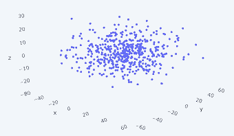
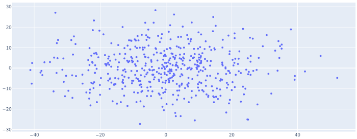
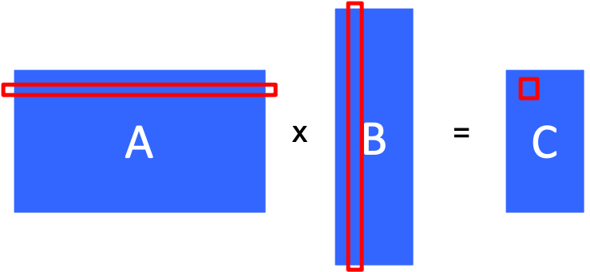
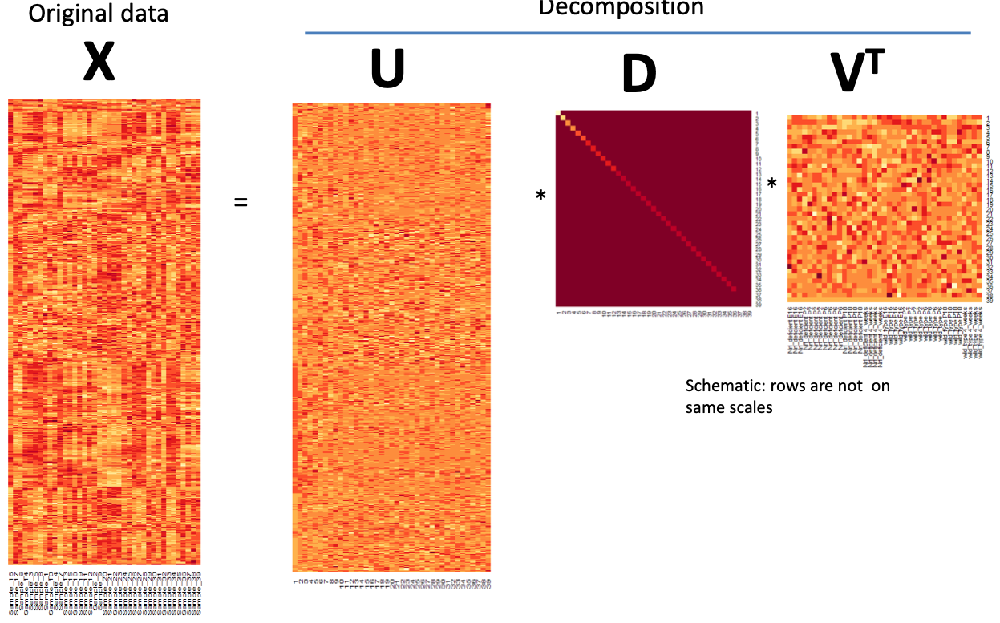
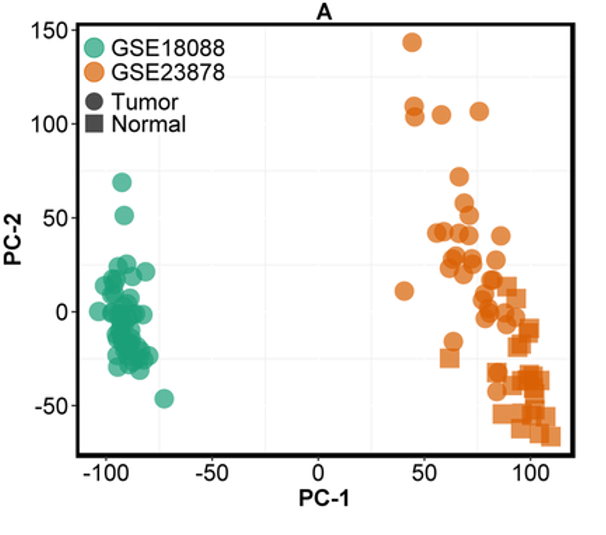
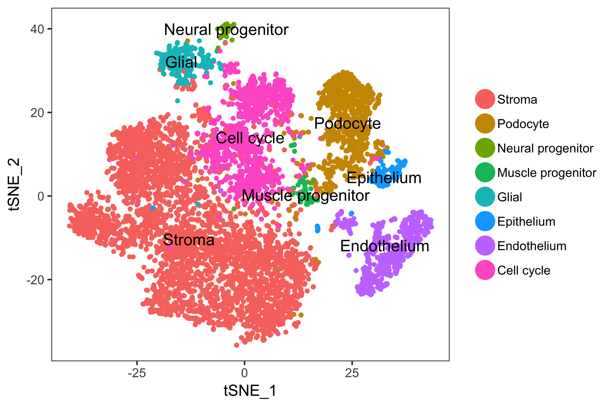

layout: true
background-image: url("img/video_placeholder.jpg")
background-size: 240px
background-position: 100% 0%

```{r, include = FALSE}
knitr::opts_chunk$set(tidy = FALSE, tidy.opts=list(width.cutoff=80), fig.retina=3)
ggplot2::theme_set(ggplot2::theme_bw(base_size = 20))
ggplot2::update_geom_defaults("point", list(size = 3))
```

```{css, echo = FALSE}
.remark-code, .remark-inline-code {
  background: #f0f0f0;
}
.remark-code {
  font-size: 24px;
}
.huge .remark-code { /*Change made here*/
  font-size: 200% !important;
}
.tiny .remark-code { /*Change made here*/
  font-size: 60% !important;
}
.smaller .remark-code { /*Change made here*/
  font-size: 90% !important;
}
.smaller2 .remark-code { /*Change made here*/
  font-size: 80% !important;
}
.smaller3 .remark-code { /*Change made here*/
  font-size: 70% !important;
}
```


```{r wrap-hook, include=FALSE}
library(knitr)
hook_output = knit_hooks$get('output')
knit_hooks$set(output = function(x, options) {
  # this hook is used only when the linewidth option is not NULL
  if (!is.null(n <- options$linewidth)) {
    x = knitr:::split_lines(x)
    # any lines wider than n should be wrapped
    if (any(nchar(x) > n)) x = strwrap(x, width = n)
    x = paste(x, collapse = '\n')
  }
  
  lines <- options$output.lines
   if (is.null(lines)) {
     return(hook_output(x, options))  # pass to default hook
   }
   x <- unlist(strsplit(x, "\n"))
   if (length(lines)==1) {        # first n lines
     if (length(x) > lines) {
       # truncate the output
       x <- c(head(x, lines))
     }
   } else {
     x <- c(x[lines])
   }
   # paste these lines together
   x <- paste(c(x, ""), collapse = "\n")

  hook_output(x, options)
})

```

---

# Learning objectives 

<big>

* Explain the purpose of **unsupervised learning**
  * (and in future lectures) understand how it differs from **supervised learning** 

* Explain the purpose of **dimension reduction**

* Understand the main ideas behind the mathematical framework of **Principal Component Analysis (PCA)**, and its connections to 
  * Singular Value Decomposition (SVD)
  * Surrogate Variable Analysis (SVA)

* Apply PCA to a high-dimensional genomic dataset, and interpret the results in the context of phenotypic / experimental measures

---

# Unsupervised learning

### A procedure or algorithm which aims to find patterns or structure in the data - *without using any outside knowledge (e.g. response variable, metadata, 'labels', etc)*

<big> The distinction between unsupervised and supervised learning will become more clear in future lectures

--

#### Two general frameworks:

1. **Dimension reduction** 

2. **Clustering** (next lecture)

---

# Unsupervised data representation


.left-column[
```{r, include=FALSE}
library(GEOquery)
library(ggplot2)
library(ggrastr)
library(tidyverse)
library(gridExtra)
library(ComplexHeatmap)
library(pheatmap)

bcols<-colorRampPalette(c("#000000" ,"#800000" ,"#FF8000" ,"#FFFF00", "#FFFFFF"))(20)

eset <- getGEO("GSE4051", getGPL= FALSE)[[1]]

# recode time points
pData(eset) <- pData(eset) %>%
  mutate(sample_id = geo_accession) %>%
  mutate(dev_stage =  case_when(
    grepl("E16", title) ~ "E16",
    grepl("P2", title) ~ "P2",
    grepl("P6", title) ~ "P6",
    grepl("P10", title) ~ "P10",
    grepl("4 weeks", title) ~ "4W"
  )) %>%
  mutate(genotype = case_when(
    grepl("Nrl-ko", title) ~ "NrlKO",
    grepl("wt", title) ~ "WT"
  ))

pData(eset) <- pData(eset) %>%
  mutate(dev_stage = fct_relevel(dev_stage, "E16", "P2", "P6", "P10", "4W")) %>%
  mutate(genotype = as.factor(genotype)) %>%
  mutate(genotype = fct_relevel(genotype, "WT", "NrlKO")) %>%
  mutate(age = ifelse(dev_stage == "E16", -4,
                        ifelse(dev_stage == "P2", 2, 
                                ifelse(dev_stage == "P6", 6, 
                                      ifelse(dev_stage == "P10", 10, 28))))) %>%
  select(sample_id, dev_stage, genotype, age)
```

```{r, echo = FALSE, fig.align='center', fig.width = 2.5, fig.height = 5.5}
set.seed(345)
x <- exprs(eset)[sample(seq_len(nrow(eset)), 1000), ]
hm <- pheatmap(x,
         color = bcols,
         border_color = NA,
         cluster_cols = FALSE, cluster_rows = FALSE,
         show_rownames = FALSE,
         show_colnames = FALSE)
hm
```
.center[Photoreceptor dataset (~45K genes)]
]

.right-column[
<big> 

* Assume all of our *measured* data is contained in a matrix called $X$

* $X$ has $m$ rows (number of features, e.g. genes, transcripts, or probes), and $n$ columns (number of samples)

* **Importantly**, $X$ has *no information* about experimental design or other external information (i.e. metadata, sample phenotypes, batch, etc. are *not* part of $X$)

### Each sample is represented by a vector of length $m$ (i.e. each sample is a vector in $m$ *dimensional* space)

]

---

# Unsupervised data representation

.left-column[

```{r, echo = FALSE, fig.align='center', fig.width = 2.5, fig.height = 5.5}
hm
```
.center[Photoreceptor dataset (~45K genes)]
]

.right-column[
<big> 
Photoreceptor data:

* 39 columns (samples)
  
  * *Each sample is a vector in 45K-dimensional space*

* ~45K rows (genes)

  * *Each gene is a vector in 39-dimensional space*


]

---

# 1-dimensional representations

.left-column[
```{r, echo = FALSE, fig.align='center', fig.width = 2.5, fig.height = 5.5}
hm 
```
.center[Photoreceptor dataset (~45K genes)]
]

.right-column[

To get a sense of the data, we can look at just a part of it, e.g.

* The expression level of one gene across *all samples* (row vector, 39 elements)

```{r, fig.align='center', fig.width=6, fig.height=2.2, echo = FALSE}
x[1,] %>% 
  data.frame() %>% 
  ggplot(aes(y = `.`, x = seq_along(`.`))) +
   geom_point(size = 0.4) +
   xlab("Index (samples)") + 
   ylab("Expr gene 1")
```

* The expression level of *all genes* for one sample (column vector, 45K elements)

```{r, fig.align='center', fig.width=6, fig.height=2.34, echo = FALSE}
exprs(eset)[,1] %>% 
  data.frame() %>% 
  ggplot(aes(y = `.`, x = seq_along(`.`))) +
   rasterise(geom_point(alpha = 0.2, size = 0.3)) +
   xlab("Index (genes)") + 
   ylab("Expr sample 1")
```

]

---

# 2-dimensional representation (samples)

.left-column[
```{r, echo = FALSE, fig.align='center', fig.width = 2.5, fig.height = 5.5}
hm 
```
.center[Photoreceptor dataset (~45K genes)]
]

.right-column[
<big>

* We can do a better than 1D representation

* Let's represent each sample in 2D space (scatterplot of two rows):

```{r, fig.align='center', fig.width=5, fig.height=5, echo = FALSE}
df <- t(x[c(2, 4),]) %>% data.frame()
ggplot(df, aes(x = df[,1], y = df[,2]), environment = environment()) +
   rasterize(geom_point(size = 0.4)) +
   xlab("Expr Gene 1") + 
   ylab("Expr Gene 2")
```


]

---

# 2-dimensional representation (genes)

.left-column[
```{r, echo = FALSE, fig.align='center', fig.width = 2.5, fig.height = 5.5}
hm 
```
.center[Photoreceptor dataset (~45K genes)]
]

.right-column[
<big>

* We can do a better than 1D representation

* 2D representation of each gene (scatterplot of two columns):

```{r, fig.align='center', fig.width=5, fig.height=5, echo = FALSE}
df <- exprs(eset)[,c(2, 20)] %>% data.frame()
ggplot(df, aes(x = df[,1], y = df[,2]), environment = environment()) +
   rasterize(geom_point(size = 0.3, alpha = 0.2)) +
   xlab("Expr Sample 1") + 
   ylab("Expr Sample 2")
```
]

---

# Dimension reduction 

<big>

### **Goal**: transform/project data from a high-dimensional space to a lower dimensional space, while retaining meaningful properties/structure of the original data

* Our 1D (and 2D) representations using only 1 (or 2) samples or genes definitely were successful in lowering dimension

* What about retaining meaningful properties/structure of the original data?

---

# Principal Component Analysis (PCA)

<big>

### PCA is an example of dimension reduction that allows us to **project** data from high-dimensional space to a lower-dimensional space

* Data projection doesn't rely on picking representative genes

* Instead, PCA **decomposes** data into *components*, which enables "compact" representation
  
* Widely used for EDA and visualization, as well as predictive models

---

# PCA toy example

Original 3D data (top) vs 2D representation of PC1 and PC2 (bottom)

```{r, fig.align="center", echo = FALSE, out.width=400}

```
```{r, fig.align="center", echo = FALSE, out.width=500}

```

[Image source](https://towardsdatascience.com/principal-components-analysis-pca-fundamentals-benefits-insights-for-industry-2f03ad18c4d7) 

---

# Formal Definitions of PCA

<big>

Two common definitions that give rise to the same algorithm:

> Orthogonal projection of data into a lower dimensional space, known as principal sub-space, such that the total variation of the projected data is maximized (Hotelling 1933)

<div></div>
> Projection that minimizes the projection cost, defined as the mean squared distance between projected data [in lower dimensional space] and original data (Pearson 1901)

---

# Maximum variance formulation

<big>

* Consider $m$-dimensional data vectors $\boldsymbol{x}_i$, for $i=1,...,n$, representing the expression levels of all $m$ genes in each sample $i$

* We want to construct "proxy" (projected) vectors $\boldsymbol{y}_i$ that are $k$-dimensional, where $k <<m$

* Then we can visualize the data in $k$-dimensional space

---

# Intuition for subspace representation 

```{r, echo = FALSE, include = FALSE}
blank <- grid::grid.rect(gp = grid::gpar(col="white"))
```
```{r, echo = FALSE, fig.align = 'center', fig.width = 15, fig.height = 5}
df <- data.frame(x = runif(20), y = 0.5 + rnorm(20, sd = 0.05))

p1 <- df %>%
  ggplot(aes(x = x, y = y)) +
  geom_hline(yintercept = 0, colour = "grey") +
  geom_vline(xintercept = 0, colour = "grey") +
  geom_point(size = 4) +
  xlim(0,1) +
  ylim(0,1) +
  theme(panel.border = element_blank(), 
        panel.grid.major = element_blank(), 
        panel.grid.minor = element_blank(),
        axis.text.x=element_blank(),
        axis.ticks.x=element_blank(),
        axis.text.y=element_blank(),
        axis.ticks.y=element_blank())
grid.arrange(p1, blank, nrow = 1)
```

---

# Intuition for subspace representation 


```{r, echo = FALSE, fig.align = 'center', fig.width = 15, fig.height = 5}
p1 <- p1 +  
  geom_segment(aes(x = x, y = y, xend = x, yend = 0),
     colour = "blue", alpha = 0.5,
     size = 0.6, arrow = arrow(length = unit(0.1, "inches"))) +
  annotate("text", label = "Project onto x-axis", x = 0.5, y = 0.75, size = 8, colour = "blue")
grid.arrange(p1, blank, nrow = 1)
```

---

# Intuition for subspace representation 


```{r, echo = FALSE, fig.align = 'center', fig.width = 15, fig.height = 5}
p2 <- df %>%
  ggplot(aes(x = x, y = 0)) +
  geom_hline(yintercept = 0, colour = "grey") +
  geom_vline(xintercept = 0, colour = "grey") +
  geom_point(size = 4) +
  xlim(0,1) +
  ylim(0,1) +
  theme(panel.border = element_blank(), 
        panel.grid.major = element_blank(), 
        panel.grid.minor = element_blank(),
        axis.text.x=element_blank(),
        axis.ticks.x=element_blank(),
        axis.text.y=element_blank(),
        axis.ticks.y=element_blank())
grid.arrange(p1, p2, nrow = 1)
```

.center[### Projection onto the x-axis doesn't lose too much information if only one dimension seems 'useful']
---

# Intuition for subspace representation 


```{r, echo = FALSE, fig.align = 'center', fig.width = 15, fig.height = 5}
df <- data.frame(x = runif(20)) %>% 
  mutate(y = rnorm(20, sd = 0.1) + x) %>%
  filter(y >= 0, y <= 1)

p1 <- df %>%
  ggplot(aes(x = x, y = y)) +
  geom_hline(yintercept = 0, colour = "grey") +
  geom_vline(xintercept = 0, colour = "grey") +
  geom_point(size = 4) +
  xlim(0,1) +
  ylim(0,1) +
  theme(panel.border = element_blank(), 
        panel.grid.major = element_blank(), 
        panel.grid.minor = element_blank(),
        axis.text.x=element_blank(),
        axis.ticks.x=element_blank(),
        axis.text.y=element_blank(),
        axis.ticks.y=element_blank())
grid.arrange(p1, blank, nrow = 1)
```

---

# Intuition for subspace representation 

```{r, echo = FALSE, fig.align = 'center', fig.width = 15, fig.height = 5}
p1 <- p1 +  
  geom_segment(aes(x = x, y = y, xend = x, yend = 0),
     colour = "blue", alpha = 0.5,
     size = 0.6, arrow = arrow(length = unit(0.1, "inches"))) +
  annotate("text", label = "Project onto x-axis", x = 0.5, y = 0.85, size = 8, colour = "blue")

p2 <- df %>%
  ggplot(aes(x = x, y = 0)) +
  geom_hline(yintercept = 0, colour = "grey") +
  geom_vline(xintercept = 0, colour = "grey") +
  geom_point(size = 4) +
  xlim(0,1) +
  ylim(0,1) +
  theme(panel.border = element_blank(), 
        panel.grid.major = element_blank(), 
        panel.grid.minor = element_blank(),
        axis.text.x=element_blank(),
        axis.ticks.x=element_blank(),
        axis.text.y=element_blank(),
        axis.ticks.y=element_blank())
grid.arrange(p1, p2, nrow = 1)
```

.center[### Projection onto the x-axis loses information if y-axis contains 'useful' information]

---

# Intuition for subspace representation 

```{r, echo = FALSE, fig.align = 'center', fig.width = 15, fig.height = 5}
p2 <- df %>%
  ggplot(aes(x = x, y = y)) +
  geom_abline(intercept = 0, slope = 1, colour = "grey") +
  geom_abline(intercept = 0.2, slope = -2, colour = "grey") +
  geom_point(size = 4) +
  xlim(0,1) +
  ylim(0,1) +
  theme(panel.border = element_blank(), 
        panel.grid.major = element_blank(), 
        panel.grid.minor = element_blank(),
        axis.text.x=element_blank(),
        axis.ticks.x=element_blank(),
        axis.text.y=element_blank(),
        axis.ticks.y=element_blank(),
        axis.title.x=element_blank(),
        axis.title.y=element_blank()) +
  annotate("text", label = "x", x = 0.7, y = 0.4, size = 8, angle = 45) +
  annotate("text", label = "y", x = 0.04, y = 0.04, size = 8, angle = 135) 
grid.arrange(p1, p2, nrow = 1)
```

.center[### But we could "rotate" the data first (or equivalently rotate the axes)]

---

# Review: sample covariance matrix

<big>

For $m$-length vectors $\boldsymbol{x}_1$ and $\boldsymbol{x}_2$ representing sample 1 and 2 (columns of ${X}$):

$$Cov(\boldsymbol{x}_1, \boldsymbol{x}_2) = \frac{\sum_{j=1}^m (x_{j1} - \bar{x}_{\cdot1})(x_{j2} - \bar{x}_{\cdot2})}{m-1}$$
* Intuition: *is sample 1 far away from its mean when sample 2 is far away from its mean?*

--

* Computing $Cov(\boldsymbol{x}_i, \boldsymbol{x}_{i'})$ for every pair of samples $i$ and $i'$ (for $i$ and $i' \in \{1,...,n)$) gives the $n\times n$ sample **covariance matrix**

* $\frac{X^TX}{m-1}$ on column *centered* data gives you the sample covariance matrix

--

* Could alternatively compute covariances between all pairs of rows (features) to get $m\times m$ covariance matrix (e.g. gene covariance matrix)

* Sample **Correlation matrix**: $\frac{X^TX}{m-1}$ on *centered* and *scaled* columns (note $Cor(\boldsymbol{x}_i, \boldsymbol{x}_{i}) = 1$, so it will have diagonal of 1)

---

# Review: sample correlation matrix


```{r, echo = FALSE, fig.width = 7, fig.height = 6, fig.align = 'center'}
eset_ordered <- eset[,order(pData(eset)$age)]
corr <- data.frame(cor(exprs(eset_ordered)), 
                 row.names = colnames(eset_ordered)) %>% 
  as.matrix()

Heatmap(corr, col = bcols, 
        name = "corr",
        cluster_rows = FALSE, cluster_columns = FALSE, 
        top_annotation = HeatmapAnnotation(Genotype = pData(eset_ordered)$genotype,
                                           DevStage = pData(eset_ordered)$dev_stage),
        row_names_gp = gpar(fontsize = 8), 
        column_names_gp = gpar(fontsize = 8))
rm(eset_ordered)
```

Heatmap of sample correlation matrix for photoreceptor data

---

# Summary: sample variation measures

<big>

* Sample **variance** of sample (column) $i$: $Var(\boldsymbol{x}_i) = \frac{\sum_{j=1}^m (x_{ji} - \bar{x}_{\cdot i})^2}{m-1}$

* Sample **covariance** of samples (columns) $i$ and $i'$: $Cov(\boldsymbol{x}_i, \boldsymbol{x}_{i'}) = \frac{\sum_{j=1}^m (x_{ji} - \bar{x}_{\cdot i})(x_{ji'} - \bar{x}_{\cdot i'})}{m-1}$

* Sample (Pearson) **correlation** of samples (columns) $i$ and $i'$: $Cor(\boldsymbol{x}_i, \boldsymbol{x}_{i'}) = \frac{Cov(\boldsymbol{x}_i, \boldsymbol{x}_{i'})}{\sqrt{Var(\boldsymbol{x}_i)Var(\boldsymbol{x}_{i'})}}$

* Can likewise define sample variance of features (e.g. genes) by replacing $m$-length column vectors $\boldsymbol{x}_i$ with $n$-length row vectors $\boldsymbol{x}_j$

---

# Review: matrix multiplication

<big>

* **dot / inner product**: $\boldsymbol{x}_i \cdot \boldsymbol{x}_{i'} = \sum_{j=1}^m x_{ji}x_{ji'}$

```{r, fig.align="center", echo = FALSE, out.width=400}

```

* $C[2,3]$ is the dot product between row 2 of $A$ and column 3 of $B$

--

* In R: `%*%` operator (see `?matmult`):
  * `A %*% B` multiplies two matrices $A$ and $B$
  * note that $A$ must have the same number of columns as the number of rows in $B$

---

## Connection between dot product & covariance matrix

<big>

Back to gene expression matrix $X$ $(m$ rows = genes, $n$ columns = samples)

1. Column **center** the matrix $X$ (subtract from each element the mean of its column)

2. Compute $\frac{X^TX}{m-1} = \frac{V}{m-1}$ which is the $n\times n$ sample (column) **covariance** matrix of samples

Then $V_{ii'}$ is the **dot product** between column (sample) $i$ and column (sample) $i'$

---

## Connection between dot product & <span style="color: red;">correlation</span> matrix

<big>

Back to gene expression matrix $X$ $(m$ rows = genes, $n$ columns = samples)

1. Column **center** the matrix $X$ (subtract from each element the mean of its column)

2. <span style="color: red;">Column **scale** $X$ (divide each element by the standard deviation of its column)</span>

3. Compute $\frac{X^TX}{m-1} = \frac{V}{m-1}$ which is the $n\times n$ sample (column) <span style="color: red;">**correlation**</span> matrix of samples

Then $V_{ii'}$ is the **dot product** between column (sample) $i$ and column (sample) $i'$

---

# Correlation "structure"

<big>

Example hypothetical scenarios:

1. All samples are perfectly correlated

2. No correlation among samples (i.e. perfectly uncorrelated; dot product = 0)

3. There are two groups of samples which are perfectly correlated within group and completely uncorrelated between groups

---

# Uncorrelated case

<big>

* If all samples are perfectly uncorrelated, they are vectors all at a right angle (*perpendicular*) from each other (**orthogonal**)

* While column vectors are of length $m$, the $m$ orthogonal vectors only *span* a subspace of $\mathbb{R}^m$ $(m$-dimensional space of real numbers)

  * The **span** of a set of vectors is the set of all linear combinations of the vectors
---

# Basis and span

<big>

* A **basis** for $\mathbb{R}^m$ is a set of $m$ vectors from which you can "make" any vector in $\mathbb{R}^m$

* An **orthogonal** basis is a particular kind of basis: the $m$ vectors are orthogonal

  * e.g. [0,2] and [2,0] are orthogonal
  
  * Any pair of orthogonal 2-vectors is a basis in $\mathbb{R}^2$

--
  
* An **orthonormal basis** is an orthogonal basis where the vectors are normalized to have length 1

  * e.g. [0,1] and [1,0] are orthonormal
  
```{r, fig.align='center', fig.width=3, fig.height=2.7, echo = FALSE}
ggplot() +
  geom_segment(aes(x = c(0, 0), y = c(0,0), xend = c(1, 0), yend = c(0, 1)),
     colour = "blue", size = 1, arrow = arrow(length = unit(0.1, "inches"))) +
  xlab("") + ylab("") +
  scale_x_continuous(breaks = seq(0, 1, by = 1)) + 
  scale_y_continuous(breaks = seq(0, 1, by = 1))
```
  
---

# Example: 2D basis and 1D subspace


* 2D basis: any vector $\nu$ in $\mathbb{R}^2$ can be constructed by a weighted combination of these two vectors:

$$\nu = \alpha \begin{bmatrix} 1 \\ 0 \\ \end{bmatrix}  + \beta \begin{bmatrix} 0 \\ 1 \\ \end{bmatrix}$$
* 1D subspace: the "x-axis", while 2-dimensional, only spans a line: 

$$\nu = \alpha \begin{bmatrix} 1 \\ 0 \\ \end{bmatrix}$$
* **You need at least $m$ vectors to span ("fill") an $m$-dimensional space**

  * Exactly $m$ orthogonal vectors span $m$-dimensional space

* The situation for the $n$ columns of the $X$ matrix: they live in at most an $n$-dimensional subspace (where $n<<m)$
  
  * Each column can be written as a linear combination of $n$ orthogonal vectors

---

# What does the row data look like?

<big>

* Rows (genes) are $n$-dimensional (each contain $n$ values)

* Each row of $X$ lives in at most an $n$-dimensional subspace

  * Each row is a linear combination of at most $n$ orthogonal vectors

* This guarantees that there will be some correlated row (gene) vectors 
 
   * because there are $m>>n$ rows

---

# 2D example

<big>

* In 2 dimensions, each point has an "x" (dimension 1) and "y" (dimension 2) coordinate

* If we have more than two vectors in 2D, they can't all be at a right angle to each other (some of them will be correlated!)

* This is the same situation for the thousands of rows in $X$

  * i.e. if there are more vectors than the dimension of each vector, there will be some correlation among them
  
---

# Summary so far

### We can think of both genes and samples as combinations of no more than $n$ vectors that form an orthonormal basis

--

### In PCA, we want to find such an orthonormal basis that preserves the variance in the data

These are called *row* and *column* **eigenvectors**


---

# Eigenvectors

<big> 

* Only defined for square matrices

* A special vector that is only stretched by linear transformations defined by the matrix; not rotated (i.e. direction not changed)

* The relative amount of stretching (magnitude) is the eigenvalues

---

# Eigenvectors and PCA

<big>

.pull-left[

* We can compute the **eigenvectors** of the covariance matrix (since it is square)

* These define the **principal components (PCs)**

* They give us the *direction of maximum variance*

  * Projections of the data onto these vectors have maximum variance
]

.pull-right[

```{r, fig.align="center", echo = FALSE, out.width=400}
knitr::include_graphics("https://blog.bioturing.com/wp-content/uploads/2018/11/Blog_pca_6b.png")
```
]

---

# Eigenvalues and PCA

.pull-left[

### **Eigenvalues** associated with each eigenvector tells us about the proportion of variance in the data explained by projecting each PC

]

.pull-right[

```{r, fig.align="center", echo = FALSE, out.width=400}
knitr::include_graphics("https://blog.bioturing.com/wp-content/uploads/2018/11/Blog_pca_6b.png")
```
]

---

# Singular Value Decomposition (SVD)

<big>

The underpinnings of PCA involve the decomposition of the data matrix into 3 parts:

$$X_{m\times n} = UDV^T$$

* $U_{m\times n}$: left singular vectors: orthonormal basis of **row space** of $X$, columns are first $n$ eigenvectors of $XX^T$

* $V_{n \times n}$: right singular vectors: orthonormal basis of **column space** of $X$, columns are eigenvectors of $X^TX$

* $D_{n \times n}$: diagonal matrix of eigenvalues of $X^TX$ (nonzero eigenvalues of $XX^T$) 

---

# Singular Value Decomposition (SVD)

```{r, fig.align="center", echo = FALSE, out.width=800}

```

---

# Linear algebra manipulations

Breaking it down...

* Each column of $X$ is constructed as: $\boldsymbol{x}_i = UD\boldsymbol{\nu}_i^T = \sum_{k=1}^n \boldsymbol{u}_k d_{kk} \nu_{ki}$

  * where $\boldsymbol{u}_k$ is the $k^{th}$ column vector of $U$
  
  * where $\boldsymbol{\nu}_i$ is the $i^{th}$ column vector of $V^T$
  
  * i.e. each column of $X$ is a sum of weighted column vectors of $U$
  
--

* Then matrix $X$ is reconstructed from the multiplication of column vectors of $U$ and $V$:

$$X = UDV^T = \sum_{k=1}^n d_{kk} \boldsymbol{u}_k \boldsymbol{\nu}_{k}^T$$
We'll see this illustrated later on
  
---

# Application to photoreceptor data

<big>

We can look at PCA/SVD from three points of view:

1. Data represented as a sum of components

2. Projection of samples (principal components/scores, columns of $V$)

3. Projection of genes (factor loadings, rows of $U$)


---

# Practical stuff

* Before applying SVD/PCA, it is common practice to **standardize** your data (e.g. center, scale)

  * Otherwise the first PC captures the average expression/intensity; this constraints the next direction (recall orthogonality)
  
  * The number of eigenvalues corresponds to the smaller dimension $min(n,m)$
  
* You can standardize each feature (e.g. gene) or sample

  * For comparing sample distances, rows are samples and genes are standardized 
  
  * For finding genes which contribute to batch (as in the SVA model), rows are genes and samples are standardized
  
--

* Do you start from $X^T$ or $X$?
  
  * SVD is equivalent *if no centering has been done*; meaning of the U and V matrices are swapped
  
  * For more details, see this [online book chapter by Irizarry](https://genomicsclass.github.io/book/pages/pca_svd.html)
  
---

# Practical stuff - R


* `svd(X)`: decomposes $X$ into $U$, $D$ and $V$
  
* `prcomp(X)`: calls `svd(X)` and gives you the standard deviation (square roots of eigenvalues divided by $n$-1), and rotated data $(XV)$

* If no centering/scaling on $X$, then:

.pull-left[
.tiny[
```{r, linewidth = 65}
s <- svd(t(exprs(eset)))
p <- prcomp(t(exprs(eset)), center = FALSE)

str(p)
```
]]

.pull-right[
.tiny[
```{r, linewidth = 65}
str(s)
head(s$d / sqrt(ncol(eset)-1))
str(t(exprs(eset)) %*% s$v)
```
]]

---

# Scree plot

### Displays the relative magnitudes of the eigenvalues

Transform to proportion of explained variance

.smaller[
```{r, fig.align = 'center', fig.width = 5, fig.height = 4}
p <- prcomp(t(exprs(eset)), center = TRUE)
plot(p$sdev^2 / sum(p$sdev^2), ylab = "Proportion of variance explained", xlab = "PC")
```
]

---
  
# Decomposition of data matrix

Original data (centered and scaled):

```{r, fig.align = 'center', fig.width = 4, fig.height = 6, echo = FALSE}
x <- exprs(eset)[sample(seq_len(nrow(eset)), 1000), ]
x <- t(scale(t(x)))
p <- prcomp(t(x))
hm <- pheatmap(x,
         border_color = NA,
         color = bcols,
         cluster_cols = FALSE, cluster_rows = FALSE,
         show_rownames = FALSE,
         show_colnames = FALSE)
hm
```

Note: for illustration, we are using a set of 1000 random genes

---

# First component

.pull-left[

* `r signif((p$sdev^2 / sum(p$sdev^2))[1]*100, 3)`% of the variance

* $d_{11} \boldsymbol{u}_1 \boldsymbol{\nu}_{1}^T$

.smaller[
```{r, fig.align = 'center', fig.width = 3, fig.height = 4.5, echo = FALSE}
s <- svd(x)
x1 <- s$d[1] * (s$u[,1,drop=FALSE] %*% t(s$v[,1,drop=FALSE]))
hm
```
<small>
.center[original data]
]


]

.pull-right[
```{r, fig.align = 'center', fig.width = 4, fig.height = 6, echo = FALSE}
pheatmap(x1,
         border_color = NA,
         color = bcols,
         cluster_cols = FALSE, cluster_rows = FALSE,
         show_rownames = FALSE,
         show_colnames = FALSE)
```
]

---

# Second component

.pull-left[

* `r signif((p$sdev^2 / sum(p$sdev^2))[2]*100, 3)`% of the variance

* $d_{22} \boldsymbol{u}_2 \boldsymbol{\nu}_{2}^T$

.smaller[
```{r, fig.align = 'center', fig.width = 3, fig.height = 4.5, echo = FALSE}
x2 <- s$d[2] * (s$u[,2,drop=FALSE] %*% t(s$v[,2,drop=FALSE]))
hm
```
<small>
.center[original data]
]


]

.pull-right[
```{r, fig.align = 'center', fig.width = 4, fig.height = 6, echo = FALSE}
pheatmap(x2,
         border_color = NA,
         color = bcols,
         cluster_cols = FALSE, cluster_rows = FALSE,
         show_rownames = FALSE,
         show_colnames = FALSE)
```
]


---

# Components 1-10

.pull-left[

* `r signif(sum((p$sdev^2 / sum(p$sdev^2))[1:10])*100, 3)`% of the variance

* $\sum_{i=1}^{10}d_{ii} \boldsymbol{u}_i \boldsymbol{\nu}_{i}^T$

.smaller[
```{r, fig.align = 'center', fig.width = 3, fig.height = 4.5, echo = FALSE}
x10 <- 0 
for (i in 1:10){
  x10 <- x10 + s$d[i] * (s$u[,i,drop=FALSE] %*% t(s$v[,i,drop=FALSE]))
}
hm
```
<small>
.center[original data]
]


]

.pull-right[
```{r, fig.align = 'center', fig.width = 4, fig.height = 6, echo = FALSE}
pheatmap(x10,
         border_color = NA,
         color = bcols,
         cluster_cols = FALSE, cluster_rows = FALSE,
         show_rownames = FALSE,
         show_colnames = FALSE)
```
]

---

# Projection of data on PC 1-2

### Points colored by developmental stage and genotype

```{r, echo = FALSE, fig.width = 12, fig.height= 6, fig.align='center'}
prinComp <- cbind(pData(eset), p$x[colnames(eset), 1:10])

par(mfrow = c(1,2))
plot(prinComp[, c("PC1", "PC2")], bg = prinComp$dev_stage, pch = 21, cex = 1.5)
legend(list(x = -40, y = 20), as.character(levels(prinComp$dev_stage)), pch = 21, pt.bg = c(1, 
    2, 3, 4, 5))

plot(prinComp[, c("PC1", "PC2")], bg = prinComp$genotype, pch = 21, cex = 1.5)
legend(list(x = -40, y = 20), as.character(levels(prinComp$genotype)), pch = 21, pt.bg = c(1, 
    2, 3, 4, 5))
```

---

# Projection of data on PC 2-3

### Points colored by developmental stage and genotype

```{r, echo = FALSE, fig.width = 12, fig.height= 6, fig.align='center'}
par(mfrow = c(1,2))
plot(prinComp[, c("PC2", "PC3")], bg = prinComp$dev_stage, pch = 21, cex = 1.5)
legend(list(x = 14, y = 17), as.character(levels(prinComp$dev_stage)), pch = 21, pt.bg = c(1, 
    2, 3, 4, 5))

plot(prinComp[, c("PC2", "PC3")], bg = prinComp$genotype, pch = 21, cex = 1.5)
legend(list(x = 14, y = 17), as.character(levels(prinComp$genotype)), pch = 21, pt.bg = c(1, 
    2, 3, 4, 5))
```

---

# Find 10 genes most correlated with PC1

.smaller[
```{r}
sort(abs(p$rotation[,1]), decreasing = TRUE)[1:10] %>% names()
```
]

```{r, echo = FALSE, fig.align='center', fig.width=6, fig.height=5}
top <- sort(abs(p$rotation[,1]), decreasing = TRUE)[1:10] %>% names()
plot(p$x[,1], x[top[1],], pch = 20, xlab = "PC1", ylab = paste0(top[1], " expression"))
```

---

# Common usage of PCA

<big>

* Visualize data using first few PCs

  * Gives patterns in data that explain most of the variance in $X$

* Assess correlation between top PCs and experimental variables of interest (metadata, technical factors)
  
  * These patterns (directions) can be interesting, or attributed to technical/nuisance variables

* Identify genes associated with different PCs

  * can rank genes by "loading scores" or correlate gene expression with PCs

---

# Structure identified by PCA depends on sample size

```{r, fig.align="center", echo = FALSE, out.width=750}
knitr::include_graphics("https://media.springernature.com/full/springer-static/image/art%3A10.1038%2Fsrep25696/MediaObjects/41598_2016_Article_BFsrep25696_Fig1_HTML.jpg?as=webp")
```

.center[Figure 1, [Lenz et al. (2016)](https://www.nature.com/articles/srep25696)]

---

# Other applications of PCA

<big>

* PCA for quantifying cellular heterogeneity (cell type composition)

 * e.g. [Decamps et al. (2020)](https://link.springer.com/article/10.1186/s12859-019-3307-2)

* PCA as a batch correction approach 

  * e.g. if you suspect or show that, for example, PC1 correlates strongly with batch, then you can "remove" its effect (regress out)
  
* PCA for understanding population stratification

---

# PCs could correspond to batch effects

```{r, fig.align="center", echo = FALSE, out.width=450}

```

.center[Figure 4A, [Nyamundanda et al. (2017)](https://www.nature.com/articles/s41598-017-11110-6)]

---

# PCs can capture population stratification in GWAS

.center[Figure 1A, [Novembre et al. (2008)](https://www.nature.com/articles/nature07331)]

```{r, fig.align="center", echo = FALSE, out.width=630}
knitr::include_graphics("https://media.springernature.com/full/springer-static/image/art%3A10.1038%2Fnature07331/MediaObjects/41586_2008_Article_BFnature07331_Fig1_HTML.jpg?as=webp")
```

---

# t-SNE

.pull-left[

* t-distributed stochastic neighbor embedding (t-SNE) is another dimension reduction technique 

* Similar to PCA, it extracts a low-dimensional representation of high-dimensional data useful for visualization

* Unlike PCA, it *non-linearly* collapses similar points in high dimensional space - global trends may be **warped** (distance is not preserved)

* Unlike PCA, it is not deterministic, and depends on parameter settings (e.g. 'perplexity') - explore in [Seminar 7](https://github.com/STAT540-UBC/STAT540-UBC.github.io/blob/master//seminars/seminars_winter_2021/seminar7/sm07_clustering-pca.md)

* Widely used in single-cell RNA-seq analysis for visualizing cell types
]

.pull-right[

```{r, fig.align="center", echo = FALSE, out.width=450}

```

[Image source](https://www.rebuildingakidney.org/2019/03/12/sc-visualizations/)

]


---

# Additional resources

<big> 

* The following sections of Chapter 8 of the free online book “Data Analysis for the Life Sciences” by Rafael Irizarry and Michael Love:
  * [Dimension reduction](http://genomicsclass.github.io/book/pages/pca_motivation.html)
  * [PCA](http://genomicsclass.github.io/book/pages/PCA.html)
  * [PCA and SVD in R](http://genomicsclass.github.io/book/pages/pca_svd.html)
  
* [Chapter 7](http://web.stanford.edu/class/bios221/book/Chap-Multivariate.html) of the free online book “Modern Statistics for Modern Biology” by Susan Holmes and Wolfgang Huber 

* Chapter 14 of ["Elements of Statistical Learning" by Friedman, Tibshirani, and Hastie](https://web.stanford.edu/~hastie/Papers/ESLII.pdf)

