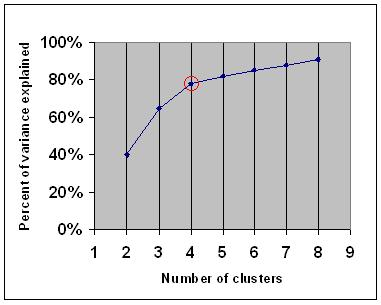

layout: true
background-image: url("img/video_placeholder.jpg")
background-size: 240px
background-position: 100% 0%

```{r, include = FALSE}
knitr::opts_chunk$set(tidy = FALSE, tidy.opts=list(width.cutoff=80), fig.retina=3)
ggplot2::theme_set(ggplot2::theme_bw(base_size = 20))
ggplot2::update_geom_defaults("point", list(size = 3))
```

```{css, echo = FALSE}
.remark-code, .remark-inline-code {
  background: #f0f0f0;
}
.remark-code {
  font-size: 24px;
}
.huge .remark-code { /*Change made here*/
  font-size: 200% !important;
}
.tiny .remark-code { /*Change made here*/
  font-size: 60% !important;
}
.smaller .remark-code { /*Change made here*/
  font-size: 90% !important;
}
.smaller2 .remark-code { /*Change made here*/
  font-size: 80% !important;
}
.smaller3 .remark-code { /*Change made here*/
  font-size: 70% !important;
}
```


```{r wrap-hook, include=FALSE}
library(knitr)
hook_output = knit_hooks$get('output')
knit_hooks$set(output = function(x, options) {
  # this hook is used only when the linewidth option is not NULL
  if (!is.null(n <- options$linewidth)) {
    x = knitr:::split_lines(x)
    # any lines wider than n should be wrapped
    if (any(nchar(x) > n)) x = strwrap(x, width = n)
    x = paste(x, collapse = '\n')
  }
  
  lines <- options$output.lines
   if (is.null(lines)) {
     return(hook_output(x, options))  # pass to default hook
   }
   x <- unlist(strsplit(x, "\n"))
   if (length(lines)==1) {        # first n lines
     if (length(x) > lines) {
       # truncate the output
       x <- c(head(x, lines))
     }
   } else {
     x <- c(x[lines])
   }
   # paste these lines together
   x <- paste(c(x, ""), collapse = "\n")

  hook_output(x, options)
})

```

---

# Learning objectives 

<big>

* [continuing from last lecture] Explain the purpose of **unsupervised learning**
  * (and in future lectures) understand how it differs from **supervised learning** 

* Explain the goals of **clustering** with respect to high-dimensional biological data

* Understand the *objective functions* of two popular clustering algorithms:
  * **K-means** clustering
  * **Hierarchical** clustering

* Apply K-means and Hierarchical clustering to a high-dimensional genomic dataset

---

# Recall: Unsupervised learning

### A procedure or algorithm which aims to find patterns or structure in the data - *without using any outside knowledge (e.g. response variable, metadata, 'labels', etc)*

<big> The distinction between unsupervised and supervised learning will become more clear in future lectures

--

#### Recall: Two general frameworks:

1. **Dimension reduction** (last lecture)

2. **Clustering** (today)

---

```{r, include=FALSE, eval=TRUE}
library(GEOquery)
library(ggplot2)
library(ggrastr)
library(tidyverse)
library(gridExtra)
library(ComplexHeatmap)
library(pheatmap)

bcols<-colorRampPalette(c("#000000" ,"#800000" ,"#FF8000" ,"#FFFF00", "#FFFFFF"))(20)

eset <- getGEO("GSE4051", getGPL= FALSE)[[1]]

# recode time points
pData(eset) <- pData(eset) %>%
  mutate(sample_id = geo_accession) %>%
  mutate(dev_stage =  case_when(
    grepl("E16", title) ~ "E16",
    grepl("P2", title) ~ "P2",
    grepl("P6", title) ~ "P6",
    grepl("P10", title) ~ "P10",
    grepl("4 weeks", title) ~ "4W"
  )) %>%
  mutate(genotype = case_when(
    grepl("Nrl-ko", title) ~ "NrlKO",
    grepl("wt", title) ~ "WT"
  ))

pData(eset) <- pData(eset) %>%
  mutate(dev_stage = fct_relevel(dev_stage, "E16", "P2", "P6", "P10", "4W")) %>%
  mutate(genotype = as.factor(genotype)) %>%
  mutate(genotype = fct_relevel(genotype, "WT", "NrlKO")) %>%
  mutate(age = ifelse(dev_stage == "E16", -4,
                        ifelse(dev_stage == "P2", 2, 
                                ifelse(dev_stage == "P6", 6, 
                                      ifelse(dev_stage == "P10", 10, 28))))) %>%
  select(sample_id, dev_stage, genotype, age)
```


# Clustering analysis in Microarrays

.left-column[
```{r, echo = FALSE, fig.align='center', out.width = 170}
knitr::include_graphics("https://www.pnas.org/content/pnas/95/25/14863/F1.large.jpg")
```
]

.right-column[
<big> 

Figure 1 from [Eisen, et al. 1998, "Cluster analysis and display of genome-wide expression patterns"](https://www.pnas.org/content/95/25/14863): time course of serum stimulation of primary human fibroblasts

* Introduced cluster analysis on the microarray community

  * Clustering was used to "organize" genes into groups (clusters) and create dendrogram

* Almost 20K citations as of early 2021

* This precedent + explosion of array data + ease of application = widespread use of clustering

* Currently, clustering analysis is used similarly in many other omics studies

]

---

# Clustering analysis in Microarrays

.pull-left[
Key finding of [Eisen, et al. (1998)](https://www.pnas.org/content/95/25/14863):

### Clustering genes by co-expression patterns results in groups of genes that have commonalities in function

i.e. involved in similar cellular/biological processes

<small>
Right - Figure 2: Various time courses of gene expression in the yeast were combined; representative clusters containing functionally related genes are highlighted
]

.pull-right[
```{r, echo = FALSE, fig.align='center', out.width = 300}
knitr::include_graphics("https://www.pnas.org/content/pnas/95/25/14863/F2.large.jpg")
```
]

---

# Visualizing raw expression data is not informative

```{r, echo = FALSE, fig.align='center', fig.width = 4, fig.height = 6.5}
set.seed(345)
x <- exprs(eset)[sample(seq_len(nrow(eset)), 2000), ]
hm <- pheatmap(x,
         scale = "row",
         color = bcols,
         border_color = NA,
         cluster_cols = FALSE, cluster_rows = FALSE,
         show_rownames = FALSE,
         show_colnames = FALSE)
hm
```
<small>
.center[Photoreceptor dataset: ~45K genes (rows), 39 samples (columns); centered/scaled]

---

# After clustering rows and columns

.pull-left[
<br>
<br>
```{r, echo = FALSE, fig.align='center', fig.width = 4, fig.height = 6}
hm
```
<small>
.center[Photoreceptor dataset: centered/scaled]
]

.pull-right[
```{r, echo = FALSE, fig.align='center', fig.width = 4.5, fig.height = 6.7}
hmc <- pheatmap(x,
         scale = "row",
         color = bcols,
         border_color = NA,
         cluster_cols = TRUE, cluster_rows = TRUE,
         show_rownames = FALSE,
         show_colnames = FALSE)
hmc
```
.center[Same heatmap, but clustered rows and columns]
]

---

# Two predominant applications of clustering

<big>

1. Identify groups of samples that have similar feature measurements

  * column clustering in previous slide
  
  * e.g. identifying disease subtypes
  
--

2. Identify groups of features (e.g. genes) that have correlated measurements

  * row clustering in previous slide
  
  * e.g. co-expressed genes that have similar functionality
  
---

# What is clustering?

<big>

* Clustering colloquially means placing objects into groups such that they are more *similar* to one another than to objects in other groups

* Clustering is a formal problem in computer science and statistics, with formal definitions and "solutions"

* Clustering in bioinformatics is often used as a tool for visualization, hypothesis generation, selection of features for further analysis

--

* Keep in mind, with typical use of clustering in bioinformatics: there is no measure of *"strength of clustering structure/evidence"* available

* Rigorous application of clustering is very powerful but also hard to do (computational complexity, suitable definition of clustering objective, determining the number of clusters

---

# Clustering problem: definition

### **Goal**: place a set of objects into groups such that they are more *similar* to one another **within the group** than to objects in **other groups**

```{r, echo = FALSE, fig.align='center', out.width = 400}

```

--

Rocks were clustered according to their colour and texture

  * What other criteria might you cluster on?

---

# Similar how?

### **Goal**: place a set of objects into groups such that they are more *similar* to one another **within the group** than to objects in **other groups**

<big>

* How to define **similar**? 

  * Need to gather a set of **attributes** (or features) for each object
  
  * Compare similarity of objects to one another based on these attributes
  
--
  
* Clustering **objective function**: maximize within cluster similarity

  * For a precise definition of good/optimal clustering, we need to translate this criteria into an equation
  
---

# Defining attribute/feature vector for each object

<big>

* Numerically, we need to define a vector for each object that contains the feature/attribute information

* For a set of $n$ objects, we can represent each object $i$ $(i=1,...,n)$ as a numeric vector $\boldsymbol{x}_i$ of length $p$ (containing $p$ attributes)

* For example, for rock $i$ we have $\boldsymbol{x}_i = (x_{i1}, x_{i2}, ..., x_{ip})$

  * $x_{i1}:$ numerical value for colour/shade
  
  * $x_{i2}:$ numerical value representing texture
  
  * $x_{ip}:$ numerical value for attribute p

---

# Similarity measures

<big>

* Many clustering methods rely on a measure of similarity (or **distance**, which is just one minus similarity for a distance metric scaled to have values between 0 and 1)

* From the feature vectors $\boldsymbol{x}_i$, we need to compute a measure of similarity or distance between all pairs of objects

  * This gives us a *matrix* of similarity or distance values

--

* Some commonly used measures

    * **Distance**: Euclidean, Manhattan
    
    * **Similarity**: Correlation (Spearman rank, Pearson)

---

# Euclidean distance

Euclidean distance between two feature vectors $\boldsymbol{x}_1$ and $\boldsymbol{x}_2$: 

$$D_{euc}(\boldsymbol{x}_1, \boldsymbol{x}_2) = || \boldsymbol{x}_1 - \boldsymbol{x}_2 ||_2 = \sqrt{\sum_{j=1}^p (x_{1j} - x_{2j})^2}$$
In two dimensions: 
```{r, echo = FALSE, fig.align='center', out.width = 400}
knitr::include_graphics("https://www.tutorialexample.com/wp-content/uploads/2020/05/Euclidean-distance-in-tensorflow.png")
```

---

# Pearson correlation

Pearson correlation (similarity) between two feature vectors $\boldsymbol{x}_1$ and $\boldsymbol{x}_2$: 

$$r_{\boldsymbol{x}_1, \boldsymbol{x}_{2}} = Cor(\boldsymbol{x}_1, \boldsymbol{x}_{2}) = \frac{Cov(\boldsymbol{x}_1, \boldsymbol{x}_{2})}{\sqrt{Var(\boldsymbol{x}_1)Var(\boldsymbol{x}_{2})}}$$
Convert to a distance by taking $1-r_{\boldsymbol{x}_1, \boldsymbol{x}_{2}}$

If features are **standardized** (centered and scaled), then: 

$$r_{\boldsymbol{x}_1, \boldsymbol{x}_{2}} = \sum_{j=1}^p x_{1j}x_{2j}$$
--

Note the connection with Euclidean distance for standardized features:

$$D_{euc}^2 (\boldsymbol{x}_1, \boldsymbol{x}_{2}) = \sum_{j=1}^p (x_{1j} - x_{2j})^2 = \sum_{j=1}^p x_{1j}^2 + \sum_{j=1}^p x_{2j}^2 + 2\sum_{j=1}^p x_{1j}x_{2j} = 2(1-r)$$

---

# Example clustering algorithms

<br>
<br>

```{r, echo = FALSE, fig.align='center', out.width = 1000}

```

---

class: middle

# How many clusters?

### Almost all clustering algorithms that partition the objects require the user to specify the number of clusters

There are ways of 'automatically' determining the number of clusters, but they require us to specify additional criteria or objective function

---

class: middle

# What is an algorithm?

### An **algorithm** is a self-contained step-by-step set of operations to be performed in order to achieve a given task

### Through a set of steps, an algorithm transforms a given **input** data into the desired **output**

---

# Clustering algorithms: inputs and outputs

<big>

* **Input**: 
  
  * Data matrix, e.g. $X_{p \times n}$ (features in rows, objects in columns)
  
  * Number of clusters $K$

* **Output**:
  
  * Discrete: Assignment of cluster membership for each object $C_i$, where $C_i=k$ if object $i$ is assigned to cluster $k$ 
  
  * Probabilistic: $K$-length vector of probabilities for each object $\boldsymbol{C}_i$, were $C_{ik}\in [0,1]$ is the probability that object $i$ belongs to cluster $k$, and $\sum_{k=1}^K C_{ik} =1$
  
---

# K-means clustering 

<big>

* One of the most widely used partition-based clustering approaches

* Partition-based (flat), and discrete

* **Objective function**: minimize the average *squared Euclidean distance* of objects from their assigned cluster centers 

  * A *cluster center* (or centroid) is defined as the mean of objects in the given cluster
  
--

* Objective function formula to minimize for *n* objects, each with $p$ attributes $\{\boldsymbol{x}_1,\boldsymbol{x}_2,...,\boldsymbol{x}_n \}$:

$$\sum_{k=1}^K \sum_{i=1, i \in k}^n ||\boldsymbol{x}_i - \mu_k||^2 = \sum_{k=1}^K \sum_{i=1, i \in k}^n \sum_{j=1}^p (x_{ij} - \mu_k)^2$$

  where $\mu_k$ is the cluster center for cluster $k$
  
---

# More on the K-means objective function

### Note that the **total** distance (T) between pair all pairs of objects $i$ and $j$ can be broken down into the sum of **within** cluster distance (W) and **between** cluster distance (B)

$$\begin{align}
\sum_{i=1}^n \sum_{j=1}^n d(\boldsymbol{x}_i, \boldsymbol{x}_j) &= \sum_{k=1}^K \sum_{i=C_k} \sum_{j=1}^n d(\boldsymbol{x}_i, \boldsymbol{x}_j) \\
&= \sum_{k=1}^K \sum_{i=C_k} \Bigg[ \sum_{j\in C_k} d(\boldsymbol{x}_i, \boldsymbol{x}_j) + \sum_{j\not\in C_k}  d(\boldsymbol{x}_i, \boldsymbol{x}_j)\Bigg] \\
&= \sum_{k=1}^K \sum_{i,j\in C_k} d(\boldsymbol{x}_i, \boldsymbol{x}_j) + \sum_{k=1}^K \sum_{i\in C_k} \sum_{j\not\in C_k} d(\boldsymbol{x}_i, \boldsymbol{x}_j)\\
T \,\,\,\,\,\,\,\,\,\,\,\,\,\, &= \,\,\,\,\,\,\,\,\,\,\,\,\,\,\,\,\,\,\,\,\,\,\, W \,\,\,\,\,\,\,\,\,\,\,\,\,\,\,\, + \,\,\,\,\,\,\,\,\,\,\,\,\,\,B\\
\end{align}$$

---

# More on the K-means objective function

<big>

When $d(\boldsymbol{x}_i, \boldsymbol{x}_j) = || \boldsymbol{x}_i- \boldsymbol{x}_j ||^2$,

$$W =\sum_{k=1}^K \sum_{i,j\in C_k} || \boldsymbol{x}_i- \boldsymbol{x}_j ||^2 = \sum_{k=1}^K \sum_{i\in C_k} || \boldsymbol{x}_i- \boldsymbol{\bar{x}}_k ||^2$$
where $\boldsymbol{\bar{x}}_k = \{ \bar{x}_{1k},\bar{x}_{2k}, ..., \bar{x}_{pk} \}$ are the cluster vectors of feature means $\bar{x}_{jk} = \frac{1}{|C_k|}\sum_{i\in C_k} x_{ij}$

### Given cluster means $\boldsymbol{\bar{x}}_1, \boldsymbol{\bar{x}}_2, ..., \boldsymbol{\bar{x}}_K$, the minimum of $W$ is obtained by assigning $\boldsymbol{x}_i$ to the cluster $C_k$ with the closest mean $\boldsymbol{\bar{x}}_k$

---

# K-means algorithm

### **Initialize**: Pick $K$ random points as initial cluster centers 
### **Iterate**: steps 1-3 until there is no change from previous assignment
### 1. Measure distance (squared Euclidean) between all points and the cluster centers
### 2. Assign points to nearest cluster 
### 3. Update cluster means
  
---

# Example: K-means algorithm 

.pull-left[
```{r, fig.align='center', fig.height=5, fig.width=5, echo = FALSE}
set.seed(481)
df <- data.frame(x = c(rnorm(25), rnorm(25, 3.5)),
                 y = c(rnorm(25), rnorm(25, 3.5)))

p1 <- df %>% ggplot() +
  geom_point(aes(x = x, y = y)) +
  xlab("gene 1 expression") +
  ylab("gene 2 expression")
p1
```
]

.pull-right[
* Suppose we measure expression levels for 2 genes in 50 individuals

* Let's go through the K-means clustering algorithm step by step
]

---

# Example: K-means algorithm 

.pull-left[
```{r, fig.align='center', fig.height=5, fig.width=5, echo = FALSE}
set.seed(541)
centers <- sample(1:50, 2)

p1 +
  geom_point(data = df[centers,], aes(x = x, y = y), 
             colour = c("red", "blue"), size = 8, shape = 18) 
  
```
]

.pull-right[
### Initialize: Pick $K$ random points as initial cluster centers (We'll use $K$ = 2)
]

---

# Example: K-means algorithm 

.pull-left[
```{r, fig.align='center', fig.height=5, fig.width=5, echo = FALSE}
df <- df %>%
  mutate(dist1 = (x - df$x[centers[1]])^2 + (y - df$y[centers[1]])^2,
         dist2 = (x - df$x[centers[2]])^2 + (y - df$y[centers[2]])^2) %>%
  mutate(clust = ifelse(dist1 < dist2, "red", "blue"))

p1 +
  geom_point(data = df, aes(x = x, y = y, colour = clust)) +
  geom_point(data = df[centers,], aes(x = x, y = y), 
             colour = c("red", "blue"), size = 8, shape = 18) +
  theme(legend.position = "none") + 
  scale_color_identity(guide = "legend")
```
]

.pull-right[
### Initialize: Pick $K$ random points as initial cluster centers
### 1. Measure distance (squared Euclidean) between all points and the cluster centers 
### 2. Assign points to nearest cluster
]

---


# Example: K-means algorithm 

.pull-left[
```{r, fig.align='center', fig.height=5, fig.width=5, echo = FALSE}
centers <- df %>%
  group_by(clust) %>%
  summarize(x = mean(x),
            y = mean(y))

p1 +
  geom_point(data = df, aes(x = x, y = y, colour = clust)) +
  geom_point(data = centers, aes(x = x, y = y), 
             colour = c("blue", "red"), size = 8, shape = 18) +
  theme(legend.position = "none") + 
  scale_color_identity(guide = "legend")
```
]

.pull-right[
### Initialize: Pick $K$ random points as initial cluster centers
### 1. Measure distance (squared Euclidean) between all points and the cluster centers 
### 2. Assign points to nearest cluster
### 3. Update cluster means
]

---

# Example: K-means algorithm 

.pull-left[
```{r, fig.align='center', fig.height=5, fig.width=5, echo = FALSE}
df <- df %>%
  mutate(dist1 = (x - centers$x[2])^2 + (y - centers$y[2])^2,
         dist2 = (x - centers$x[1])^2 + (y - centers$y[1])^2) %>%
  mutate(clust = ifelse(dist1 < dist2, "red", "blue"))

p1 +
  geom_point(data = df, aes(x = x, y = y, colour = clust)) +
  geom_point(data = centers, aes(x = x, y = y), 
             colour = c("blue", "red"), size = 8, shape = 18) +
  theme(legend.position = "none") + 
  scale_color_identity(guide = "legend")
```
]

.pull-right[
### Initialize: Pick $K$ random points as initial cluster centers
### 1. Measure distance (squared Euclidean) between all points and the cluster centers 
### 2. Assign points to nearest cluster
### 3. Update cluster means
### 4. Go back to steps 1-2 (measure distance and reassign points)
]

---


# Example: K-means algorithm 

.pull-left[
```{r, fig.align='center', fig.height=5, fig.width=5, echo = FALSE}
centers <- df %>%
  group_by(clust) %>%
  summarize(x = mean(x),
            y = mean(y))

df <- df %>%
  mutate(dist1 = (x - centers$x[2])^2 + (y - centers$y[2])^2,
         dist2 = (x - centers$x[1])^2 + (y - centers$y[1])^2) %>%
  mutate(clust = ifelse(dist1 < dist2, "red", "blue"))

p1 +
  geom_point(data = df, aes(x = x, y = y, colour = clust)) +
  geom_point(data = centers, aes(x = x, y = y), 
             colour = c("blue", "red"), size = 8, shape = 18) +
  theme(legend.position = "none") + 
  scale_color_identity(guide = "legend")
```
]

.pull-right[
### Continue iterating until no change in point assignment
]

---

# Toy examples are easy

.pull-left[
```{r, fig.align='center', fig.height=5, fig.width=5, echo = FALSE}
set.seed(559)
df <- data.frame(x = c(rnorm(50, 0, 1), rnorm(50, 3, 1.5), rnorm(5, 2.5, 1.5)),
                 y = c(rnorm(50, 0, 0.8), rnorm(50, 2.5, 1.5), rnorm(5, -0.5, 0.8)))

p1 <- df %>% ggplot() +
  geom_point(aes(x = x, y = y)) +
  xlab("gene 1 expression") +
  ylab("gene 2 expression")
p1
```
]

.pull-right[

### How to decide howmany clusters are there?

* Your own judgement and prior knowledge
* Reliance on a *model selection* procedure
]

---

# K-means in practice

.pull-left[
Application of K-means to photoreceptor data (2K random genes) with $K$ = 4. We specify `nstarts` so that the algorithm is initialized with many different initial clusters.

```{r, echo = FALSE}
x <- t(scale(t(x)))
```

.smaller2[
```{r, linewidth = 60}
gene.km <- kmeans(x, centers = 4, nstart = 50)
sample.km <- kmeans(t(x), centers = 4, nstart = 50)
str(sample.km)
```
]

]

.pull-right[
```{r, echo = FALSE, fig.align='center', fig.width = 5, fig.height = 6.75}
x.reord <- x[order(gene.km$cluster), order(sample.km$cluster)]
pheatmap(x.reord,
         scale = "none",
         color = bcols,
         border_color = NA,
         cluster_cols = FALSE, cluster_rows = FALSE,
         show_rownames = FALSE,
         show_colnames = FALSE,
         annotation_col = data.frame(sKM = factor(sample.km$cluster)),
         annotation_row = data.frame(gKM = factor(gene.km$cluster)))
```
]

---

# Choosing $K$

.pull-left[

**Note**: maximizing the clustering objective will **not** be informative, as it leads to the solution that each object should be in its own cluster. Therefore, need an algorithm that takes into account the "cost" of adding additional clusters

* Prior knowledge

* "Elbow"/"Knee" method: point of diminishing returns

* Information Criteria (AIC or BIC): likelihood penalized for number of parameters

* Silhouette metric: how similar an object is to its own cluster compared to other clusters

* Gap Statistics: total intracluster variation compared to that expected under the null

]

.pull-right[

```{r, echo = FALSE, fig.align='center', out.width = 400}

```
.center[Elbow method]

]

---

# Hierarchical aggolomerative clustering

### A clustering approach for revealing **hierarchical** relationships between objects

**Agglomerative**: each observation starts in its own cluster; going up in hierarchy pairs of clusters are merged 


```{r, echo = FALSE, fig.align='center', out.width = 400}
knitr::include_graphics("https://ars.els-cdn.com/content/image/3-s2.0-B9780124157811000091-f09-04-9780124157811.jpg")
```

Note: vertical red bar 'cuts' the tree to define the clusters indicated by label colours

---

# Algorithm: Hierarchical agglomerative clustering

<big>

Given $n$ objects with $p$ attributes, and a distance metric:

### **Initialize**: Assign each object to its own cluster and compute pairwise distances between all clusters

### **Iterate**: Repeat steps 1 and 2 until all objects belong to a single cluster

### 1. Find the "closest" pair of clusters, and **merge** them into a single cluster

### 2. Compute new distances between clusters

---

# Cluster linkage

<big>

* Distance between clusters is computed based on cluster centers; these are common ways to define cluster centers:

  * **Single** linkage: distance between two clusters is the **minimum** distance between any pair of elements
  
  * **Average** linkage: distance between two clusters is the **average** distance between all pairs of elements
  
  * **Complete** linkage: distance between two clusters is the **maximum** distance between any pair of elements

--

* Default in `pheatmap` is complete linkage using Euclidean distance

---

# Example: Hierarchical agglomerative clustering

.pull-left[
```{r, fig.align='center', fig.height=6, fig.width=6, echo = FALSE}
set.seed(35)
df <- data.frame(x = rgamma(9, 2, 2), 
                 y = rgamma(9, 2, 2),
                 cluster = factor(1:9))

p1 <- df %>% ggplot() +
  geom_label(aes(x = x, y = y, colour = cluster, label = cluster), size = 6) +
  xlab("Attribute 1") +
  ylab("Attribute 2") +
  theme(legend.position = "none")
p1 

x <- df[,c("x", "y")]
```
]

.pull-right[
.smaller2[
```{r}
round(dist(x),2)
```
]

### Next: Merge cluster 3 and 6 

We'll use average linkage
]

---

# Example: Hierarchical agglomerative clustering

.pull-left[
```{r, fig.align='center',  fig.height=6, fig.width=6, echo = FALSE}
df <- df %>% 
  mutate(cluster = ifelse(cluster %in% c(3,6), "36", cluster))

df %>% ggplot() +
  geom_label(aes(x = x, y = y, colour = cluster, label = cluster), size = 6) +
  xlab("Attribute 1") +
  ylab("Attribute 2") +
  theme(legend.position = "none")

merg <- df[c(3,6),c("x", "y")] 
x <- df[,c("x", "y")]
rownames(x) <- 1:9
x <- x[-c(3,6),]
x <- rbind(x, colMeans(merg))
rownames(x)[nrow(x)] <- "36"
```
]

.pull-right[
.smaller2[
```{r}
round(dist(x),2)
```
]

### Next: Merge cluster 2 and 9
]

---

# Example: Hierarchical agglomerative clustering

.pull-left[
```{r, fig.align='center', fig.height=6, fig.width=6, echo = FALSE}
df <- df %>% 
  mutate(cluster = ifelse(cluster %in% c(2,9), "29", cluster))

df %>% ggplot() +
  geom_label(aes(x = x, y = y, colour = cluster, label = cluster), size = 6) +
  xlab("Attribute 1") +
  ylab("Attribute 2") +
  theme(legend.position = "none")

merg2 <- df[c(2,9), c("x", "y")] 
x <- x[-which(rownames(x) %in% c(2,9)),]
x <- rbind(x, colMeans(merg2))
rownames(x)[nrow(x)] <- "29"
```
]

.pull-right[
.smaller2[
```{r}
round(dist(x),2)
```
]

### Next: Merge cluster 36 and 7
]

---

# Example: Hierarchical agglomerative clustering

.pull-left[
```{r, fig.align='center', fig.height=6, fig.width=6, echo = FALSE}
df <- df %>% 
  mutate(cluster = ifelse(cluster %in% c("36", "7"), "367", cluster))

df %>% ggplot() +
  geom_label(aes(x = x, y = y, colour = cluster, label = cluster), size = 6) +
  xlab("Attribute 1") +
  ylab("Attribute 2") +
  theme(legend.position = "none")

merg3 <- df[c(3,6,7), c("x", "y")] 
x <- x[-which(rownames(x) %in% c("36", 7)),]
x <- rbind(x, colMeans(merg3))
rownames(x)[nrow(x)] <- "367"
```
]

.pull-right[
.smaller2[
```{r}
round(dist(x),2)
```
]

### Next: Merge cluster 29 and 4...
]

---

# Dendrogram of example

```{r, echo = FALSE}
set.seed(35)
df <- data.frame(x = rgamma(9, 2, 2), 
                 y = rgamma(9, 2, 2))
x <- df
```

```{r, fig.align='center', fig.height=6, fig.width=8}
plot(hclust(dist(x), method = "average"))
```

---

# Assessing uncertainty

<big> 

### Clustering **always gives you an answer**, even if there aren't really any underlying clusters 

There are many ways to address this

* e.g. [`pvclust`, an R package for assessing the uncertainty in hierarchical clustering](https://academic.oup.com/bioinformatics/article/22/12/1540/207339): uses bootstrap sampling to put uncertainty estimates on dendrogram partitions

* Explore in [Seminar 7](https://github.com/STAT540-UBC/STAT540-UBC.github.io/blob/master//seminars/seminars_winter_2021/seminar7/sm07_clustering-pca.md)


---

# Other types of clustering

```{r, echo = FALSE, fig.align='center', out.width = 1000}
knitr::include_graphics("img/density.png")
```

[image source](https://github.com/NSHipster/DBSCAN)


---

# Summary

<big><big>

* Many choices to make when you want to cluster a set of objects:
  
  * Objective, algorithm, attributes/features, distance metric, number of clusters

* Not possible to say which method is the best - it all depends on data and goal

* Clustering is very powerful, but reckless application leads to misguided conclusions


