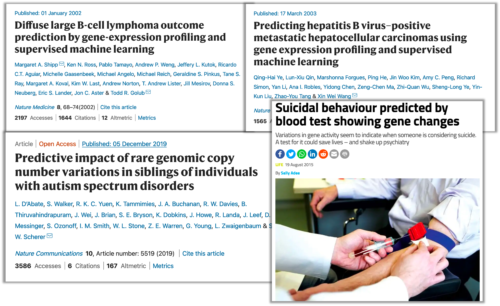
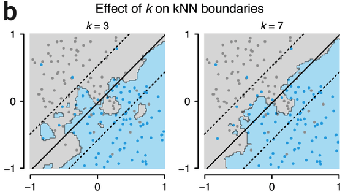

layout: true
background-image: url("img/video_placeholder.jpg")
background-size: 240px
background-position: 100% 0%

```{r, include = FALSE}
knitr::opts_chunk$set(tidy = FALSE, tidy.opts=list(width.cutoff=80), fig.retina=3)
ggplot2::theme_set(ggplot2::theme_bw(base_size = 20))
ggplot2::update_geom_defaults("point", list(size = 3))
```

```{css, echo = FALSE}
.remark-code, .remark-inline-code {
  background: #f0f0f0;
}
.remark-code {
  font-size: 24px;
}
.huge .remark-code { /*Change made here*/
  font-size: 200% !important;
}
.tiny .remark-code { /*Change made here*/
  font-size: 60% !important;
}
.smaller .remark-code { /*Change made here*/
  font-size: 90% !important;
}
.smaller2 .remark-code { /*Change made here*/
  font-size: 80% !important;
}
.smaller3 .remark-code { /*Change made here*/
  font-size: 70% !important;
}
```


```{r wrap-hook, include=FALSE}
library(knitr)
hook_output = knit_hooks$get('output')
knit_hooks$set(output = function(x, options) {
  # this hook is used only when the linewidth option is not NULL
  if (!is.null(n <- options$linewidth)) {
    x = knitr:::split_lines(x)
    # any lines wider than n should be wrapped
    if (any(nchar(x) > n)) x = strwrap(x, width = n)
    x = paste(x, collapse = '\n')
  }
  
  lines <- options$output.lines
   if (is.null(lines)) {
     return(hook_output(x, options))  # pass to default hook
   }
   x <- unlist(strsplit(x, "\n"))
   if (length(lines)==1) {        # first n lines
     if (length(x) > lines) {
       # truncate the output
       x <- c(head(x, lines))
     }
   } else {
     x <- c(x[lines])
   }
   # paste these lines together
   x <- paste(c(x, ""), collapse = "\n")

  hook_output(x, options)
})

```

```{r, echo = FALSE, warning = FALSE, message = FALSE}
library(tidyverse)
library(ggplot2)
library(GGally)
library(caret)
library(gridExtra)
library("MASS")

library(dslabs)
library("Hiiragi2013")
```

---

# Announcements

<big>

* Project presentation dates posted today

* Project progress reports due Friday 19 March

* Next week's lectures (15 and 17 March) will both be **synchronous**

  * Guest lecturer Paul Pavlidis will talk about two topics that will be very relevant for many projects: Gene set enrichment analysis, and Gene networks and function prediction

---

# Learning objectives 

<big>

* Explain the purpose of **supervised learning** and how it differs from **unsupervised learning** 

* Connect commonly used terms from statistics and machine learning

* Explain the goals of **classification**

* Understand the main ideas behind the mathematical frameworks such as **Naïve Bayes**, **Linear Discriminant Analysis**, and **K-Nearest Neighbors classification**

---

# Supervised learning

### A procedure or algorithm which uses a set of **inputs** (measured or preset variables) to predict the values of one or more **outputs** (variables which are influenced in some way by the inputs)

--

<big>
* This definition uses the language/terminology from the field of *machine learning*

* In statistical terminology:

  * we would say *predictor* or *independent* variables in place of **inputs**
  
  * we would say *response* or *dependent* variables in place of **outputs**

---

# Examples in genomics

```{r, echo = FALSE, fig.align='center', out.width = 900}

```

---

# Machine learning vs classical statistics

<big>

.pull-left[
### Machine Learning

* Large number of variables (have no idea which are useful)

* Model complex, non-linear relationships

* Flexibility about defining a classifier: “loss/error minimization view” vs “generative” view

* Invent scalable algorithms that can solve parameters for very large models

]

.pull-right[
### Classical Statistics

* Handful of variables
<br/><br/>

* Typically assume linear relationships
<br/><br/>

* Typically think in terms of a “generative” model; has theoretical justification

* Thorough analysis/theory for models with less than a dozen parameters

]

---

# ML vs Statistics terminology

<big>

.pull-left[
### Machine Learning

* Labels / 'class' labels

* Examples

* Features

* Learning

* Weights / feature importance

* Generalization

]

.pull-right[
### Classical Statistics

* Response / outcome

* Data points

* Covariates / variables

* Estimation / fitting

* Parameters

* Test set performance

]

---

# Example: Predict phenotype from gene expression

<big>

1. Measure gene expression data relevant for the outcome you would like to predict (e.g., disease status or severity): **training data**

2. Formulate (i.e., write down) a **model** that relates the gene expression measurements (i.e. features/attributes) to the outcome

3. Fit/estimate model **parameters** based on data to fully specify the model

4. Apply the model to new data, where you don’t have (or at least don't *use*) information about outcome/response to make a prediction

---

class: middle

# Galton's Height Data: predict the future (adult) height of a child

<big> 

[Data source](http://www.randomservices.org/random/data/Galton.html)

---

# 1. Gather training data

.left-column[
$$\{(\boldsymbol{x_1}, y_1), (\boldsymbol{x_2}, y_2), ..., (\boldsymbol{x_n}, y_n)\}$$
* **input**: $\boldsymbol{x_i}$, feature vector (Father height, mother height, sex) 

* **output**: ${y_i}$, response (child height)
]

.right-column[
```{r, message = FALSE, echo = FALSE, fig.align='right', fig.width=10, fig.height = 6.5}
height <- read.table(url("https://ytliu0.github.io/Stat390EF-R-Independent-Study-archive/RMarkdownExercises/Galton.txt"), 
                     header = TRUE) %>% 
  dplyr::rename(Sex = Gender)

dplyr::select(height, Father, Mother, Sex, Height) %>%
  ggpairs(aes(colour = Sex, alpha = 0.5), 
          lower = list(combo = wrap("facethist", bins = 25)))
```
]


---

# 2. Formulate model relating input and output

<big>

* Write down a model that links the output variable to some function of the input variable(s)

$$y_i = f(\boldsymbol{x}_i) + \epsilon$$
--

* For example, let's say child height is linearly related to the additive effects of parental mean height and sex

$$y_i = \alpha + \beta_1\Big(\frac{x_{father,i} + x_{mother,i}}{2}\Big) + \beta_2x_{male,i} + \epsilon$$
* $x_{father,i}$ and $x_{mother,i}$ are the heights of the father and mother of child $i$, and $x_{male,i}$ is an indicator variable that the $i^{th}$ child's sex is male

* $\alpha, \beta_1,$ and $\beta_2$ are model parameters

---

# 3. Fit the model to training data

<big>

* Let $\bar{x}_{parental,i}$ represent parental mean height

* How can we fit this model to minimize *error* on the training data?

$$y_i = \alpha + \beta_1\bar{x}_{parental,i} + \beta_2x_{male,i} + \epsilon_i, \, \, \text{where }\epsilon_i \sim N(0,\sigma^2)$$

* e.g. find $\alpha, \beta_1,$ and $\beta_2$ such that the objective function (sum of squared errors) is minimized 

$$\sum_{i=1}^n(y_i -\alpha - \beta_1\bar{x}_{parental,i} - \beta_2x_{male,i})^2$$
---

# 3. Fit the model to training data

<big>

* Let $\bar{x}_{parental,i}$ represent parental mean height

* How can we fit this model to minimize *error* on the training data?

$$y_i = \alpha + \beta_1\bar{x}_{parental,i} + \beta_2x_{male,i} + \epsilon_i, \, \, \text{where }\epsilon_i \sim N(0,\sigma^2)$$

* e.g. find $\alpha, \beta_1,$ and $\beta_2$ such that the objective function (sum of squared errors) is minimized 

$$\sum_{i=1}^n(y_i -\alpha - \beta_1\bar{x}_{parental,i} - \beta_2x_{male,i})^2$$

.center[## Linear regression!]

---

# Aside: generative model 

<big> 

(Mathematically equivalent) probabilistic formulation of linear regression:

$$y_i | \bar{x}_{parental,i}, x_{male,i} \, \sim \, N(\alpha + \beta_1\bar{x}_{parental,i} + \beta_2x_{male,i},\, \sigma^2)$$

<!-- So, parameter estimates $\hat{\alpha}, \hat{\beta_1},$ and $\hat{\beta}_2$ also maximize the likelihood/probability 'objective function': -->

$$p(y_1, y_2, ..., y_n | \boldsymbol{x_1}, \boldsymbol{x_2}, ..., \boldsymbol{x_n}) = \prod_{i=1}^n f_N(y_i | \alpha + \beta_1\bar{x}_{parental,i} + \beta_2x_{male,i},\, \sigma^2)$$

Where $f_N(y|\mu, \sigma) = \frac{1}{\sigma\sqrt{2\pi}}e^{-\frac{1}{2}\big(\frac{y - \mu}{\sigma}\big)^2}$ is the normal probability density function

---

# 4. Apply model to predict on new data

<big>

* Suppose we collect a new dataset of parental mean heights $\bar{x}^*_{parental,i}$ and child's sex $x^*_{male,i}$ for an independent set of $m$ children $i = 1,...,m$

* We would like to predict each child's eventual adult height $\hat{y}^*_i$ based their sex and their parents' mean height

--

* **How?** Use the model parameters estimated from the training data $(\hat{\alpha}, \hat{\beta_1}, \hat{\beta}_2)$ and plug in our predictor variables $(\bar{x}^*_{parental,i}, x^*_{male,i})$

$$\hat{y}^*_i = \hat{\alpha} + \hat{\beta}_1\bar{x}^*_{parental,i} + \hat{\beta}_2x^*_{male,i}$$
---

# Supervised learning

<big>

### Regression
 
 * continuous outcome

### Classification

 * binary outcome
 
 * categorical outcome

---

# The classification problem

<big>

### Training data:

$$\{(\boldsymbol{x_1}, c_1), (\boldsymbol{x_2}, c_2), ..., (\boldsymbol{x_n}, c_n)\}$$
Instead of a *continuous* outcome/response (e.g. height), we now have discrete **class labels** $c_i \in \{ 1, ..., K\}$

---

# Classifiers

<big>

A **classifier** is a function $f$ that maps input feature vectors $\boldsymbol{x_i} = \{x_{i1}, x_{i2}, ..., x_{ip} \}$ to output class labels $c_i \in \{ 1, ..., K\}$

  * we assume that class $i$ labels are *unordered* and *mutually exclusive*

--

* Let $\mathcal{X}$ be the feature space of all possible values of $\boldsymbol{x_i}$

  * this space could consist of continuous, discrete values or a mixture of the two (e.g. $\mathcal{X} = \{0,1\}^p$ or $\mathcal{X} =\mathbb{R}^p$)
  
* **Goal**: to learn a function $f$ that maps feature vectors to labels, based on labeled training set: $\{(\boldsymbol{x_1}, c_1), (\boldsymbol{x_2}, c_2), ..., (\boldsymbol{x_n}, c_n)\}$

$$f(\boldsymbol{x_i}) = {c}_i$$

---

# Example classification task

.left-column[
### Partition the space of input data so that we minimize the number of “miss-classified” objects/points

]

.right-column[

```{r, echo = FALSE, fig.align='center', fig.width=9.5, fig.height=6}
set.seed(35)
df <- data.frame(g1 = runif(40, 0, 5)) %>%
  mutate(group = c(rep("benign", 20), rep("malignant", 20)),
         g2 = sort(runif(40, 0, 6)) - 0.5*g1 + runif(40,-2,2))

p1 <- df %>% ggplot() +
  geom_point(aes(x = g1, y = g2, colour = group)) +
  xlab("Gene 1 expression") +
  ylab("Gene 2 expression") +
  labs(colour = "")
p1
```
]

---

# Example classification task

.left-column[
### Partition the space of input data so that we minimize the number of “miss-classified” objects/points

Our classification boundary might be more or less complex (e.g. nonlinear vs linear)
]

.right-column[

```{r, echo = FALSE, fig.align='center', fig.width=9.5, fig.height=6}
p1 + geom_abline(intercept = 2.5, slope = -0.2, 
                 colour = "blue", size = 1.5, alpha = 0.5)
```
]
---

# Example classification task

.left-column[
### Partition the space of input data so that we minimize the number of “miss-classified” objects/points

Our classification boundary might be more or less complex (e.g. nonlinear vs linear)
]

.right-column[

```{r, echo = FALSE, fig.align='center', fig.width=9.5, fig.height=6}
p1 + geom_abline(intercept = 2.5, slope = -0.2, 
                 colour = "blue", size = 1.5, alpha = 0.5) +
  geom_point(aes(x = 3.4, y = 4.87), 
             colour = "black", size = 3, shape = 8)
```
]

---

# More than 2 groups

```{r, echo = FALSE, fig.align='center', fig.width=9.5, fig.height=6}
set.seed(35)
df <- data.frame(g1 = runif(60, 0, 5)) %>%
  mutate(group0 = c(rep("stage 1", 20), rep("stage 2", 20), 
                   rep("stage 3", 20)),
         g2 = sort(runif(60, 0, 6)) - (0.5*g1) + runif(60,-2,2)) %>%
  mutate(group = ifelse(group0 == "stage 3", "stage 3", 
                        ifelse((g1 + runif(60,-1,1)) < 2.5, 
                               "stage 1", "stage 2")))
  
p1 <- df %>% ggplot() +
  geom_point(aes(x = g1, y = g2, colour = group)) +
  xlab("Gene 1 expression") +
  ylab("Gene 2 expression") +
  labs(colour = "")
p1
```

---

# Defining the cost of misclassification

### To train a model, we need a **loss / error** function

<big>
The **cost** of a misclassification can be specified with a loss (or error) function

For example, if all misclassification errors are equally bad, the loss function for predicted class labels $\hat{c}_i$ given true class labels $c_i$ would be

$$L(c_i, \hat{c}_i)=\left\{
                \begin{array}{ll}
                  0 \,\,\, \text{if } c_i = \hat{c}_i\\
                  1 \,\,\, \text{otherwise }
                \end{array}
              \right.$$

---

# Minimizing the expected loss

<big>

### **Goal**: predict the class that minimizes the *conditional expected loss*

* Expected conditional loss: $\rho(\hat{c}(\boldsymbol{x_i})) = \sum_{k=1}^K L(k, \hat{c}(\boldsymbol{x}_i))P(C=k | \boldsymbol{x_i})$

--

* Simplest case of two classes:

  * Expected loss of predicting class 1 when label was 2: $L(2,1)p(2|\boldsymbol{x_i})$
  
  * Expected loss of predicting class 2 when label was 1: $L(1,2)p(1|\boldsymbol{x_i})$
  
  * Predict class 1 if: $L(2,1)p(2|\boldsymbol{x_i}) < L(1,2)p(1|\boldsymbol{x_i})$

--

* But how to get $P(C=k | \boldsymbol{x_i})$?

---

# Three main ways to solve classification problem

<big>

1. Learn a **generative model** (function) for the probability distribution of inputs for each class: $p(\boldsymbol{x_i}|C=k)$

  * Then use **Bayes rule** and the marginal distribution $p(C=k)$ (overall class prevalence) to predict $p(C=k|\boldsymbol{x_i})$
  
  * Recall Bayes rule: $P(A|B) = \frac{P(B|A)P(A)}{P(B)}$

--

2. Learn a **discriminative model** for conditional probability distribution of each class $p(C=k|\boldsymbol{x_i})$

  * Do not consider the distribution of the predictors $\boldsymbol{x_i}$
--

3. Learn a **non-parametric model** 

  * e.g. a function that directly maps $\boldsymbol{x_i}$ to its predicted class $c$

---

# Example classification methods

<big>

1. Generative
  * **Naïve Bayes**
  * **Linear/Quadratic discriminant analysis**

2. Discriminative

  * **Logistic regression**
  * Support vector machines 
  * Decision trees (and Random Forest)
  * Neural networks

3. Non-parametric
  * **K-nearest neighbors**

---

# Generative model solution

<big>

Learn the following for each value of $k \in \{1,...,K \}$:

* **class-conditional density** $p(\boldsymbol{x_i}|C=k)$ 

* **class priors** (overall class prevalence) $p(C=k)$

--

Then apply Bayes rule to compute most likely class for each object/entity (*posterior*)

$$\begin{align}
p(C=k|\boldsymbol{x_i}) &= \frac{p(\boldsymbol{x_i}|C=k)p(C=k)}{p(\boldsymbol{x_i})} \\
 &= \frac{p(\boldsymbol{x_i}|C=k)p(C=k)}{\sum_{j=1}^K p(\boldsymbol{x_i}|C=j)p(C=j)}
\end{align}$$
---

# Naïve Bayes

<big>

* Most general of the **generative model** techniques

* Assumes features $\{x_{i1}, x_{i2}, ..., x_{ip}\}$ are **independent**

--

* Since features are independent, the conditional density of features given class can be written as the product of the individual feature conditional densities: $p(\boldsymbol{x_i}|C=k) = \prod_{m=1}^p p(x_{im}|C=k)$

--

* Useful only when the number of predictors is small (otherwise, hard to estimate all conditional distributions of features given class $p(x_{im}|C=k))$

---

# Gaussian Naïve Bayes

### Assume features within each class are *independently* normally (or Guassian) distributed

$$\begin{align}
p(\boldsymbol{x_i}|C=k) &= \prod_{m=1}^p p(x_{im}|C=k) \\
&= \prod_{m=1}^p f_N(x_{im}| \mu_{mk}, \sigma_{mk})
\end{align}$$

where $f_N(x| \mu, \sigma)$ is the Normal probability density function with mean $\mu$ and sd $\sigma$

--

Estimate $\boldsymbol{\mu_{k}} = \{\mu_{1k}, ..., \mu_{pk} \}$, and  $\boldsymbol{\sigma_{k}} = \{\sigma_{1k}, ..., \sigma_{pk} \}$ using maximum likelihood estimation (MLE) on training data

---

# Example: Height data

Data/Example modified from: [Intro to Data Science by Irizarry](https://rafalab.github.io/dsbook/examples-of-algorithms.html#generative-models)


```{r, echo = FALSE, fig.align='center', fig.width = 8, fig.height= 6}
data("heights")
heights <- heights %>%
  mutate(rf = rnorm(n(), 0, 10),
         rm = rnorm(n(), 0, 14)) %>%
  mutate(weight = ifelse(sex == "Female", 
                         2.1*height + rf,
                         2.5*height + rm)) %>%
  dplyr::select(-rm, -rf)

heights %>% ggplot() +
  geom_point(aes(x = height, y = weight, colour = sex), alpha = 0.4)
```

---

# Class-conditional densities of features


```{r, echo = FALSE, fig.align='center', fig.width = 11, fig.height= 7}
p1 <- heights %>% 
  filter(sex == "Female") %>%
  ggplot(aes(x = height)) +
  geom_histogram(aes(y=..density..), fill = "#F8766D", bins = 35) + 
  stat_function(fun = dnorm, size=2,
                args = list(mean = mean(heights$height[heights$sex == "Female"]), 
                            sd = sd(heights$height[heights$sex == "Female"]))) 


p2 <- heights %>% 
  filter(sex == "Male") %>%
  ggplot(aes(x = height)) +
  geom_histogram(aes(y=..density..), fill = "#00BFC4", bins = 35) + 
  stat_function(fun = dnorm, size=2, 
                args = list(mean = mean(heights$height[heights$sex == "Male"]), 
                            sd = sd(heights$height[heights$sex == "Male"]))) 


p3 <- heights %>% 
  filter(sex == "Female") %>%
  ggplot(aes(x = weight)) +
  geom_histogram(aes(y=..density..), fill = "#F8766D", bins = 35) + 
  stat_function(fun = dnorm, size=2, 
                args = list(mean = mean(heights$weight[heights$sex == "Female"]), 
                            sd = sd(heights$weight[heights$sex == "Female"]))) 


p4 <- heights %>% 
  filter(sex == "Male") %>%
  ggplot(aes(x = weight)) +
  geom_histogram(aes(y=..density..), fill = "#00BFC4", bins = 35) + 
  stat_function(fun = dnorm, size=2,
                args = list(mean = mean(heights$weight[heights$sex == "Male"]), 
                            sd = sd(heights$weight[heights$sex == "Male"]))) 

grid.arrange(p1,p2,p3,p4, nrow = 2)
```

---

# Class-conditional densities of features

```{r}
(mles <- heights %>% 
  group_by(sex) %>%
  summarize(mean_height = mean(height),
            sd_height = sd(height),
            mean_weight = mean(weight),
            sd_weight = sd(weight)))
```

<big>
e.g. $x_{i,weight} |C=Female \sim N(137, 12.5)$

---

# Prediction using Gaussian Naïve Bayes

<big>

### Goal: compute the **posterior probability** of class assignment for some new observation $\boldsymbol{x^*}$

$$\begin{align}
p(C=k|\boldsymbol{x_i}) &= \frac{p(\boldsymbol{x_i}|C=k)p(C=k)}{\sum_{j=1}^K p(\boldsymbol{x_i}|C=j)p(C=j)} \\
&= \frac{p(C=k)\prod_{m=1}^p p(x_{im}|C=k)}{\sum_{j=1}^k p(C=j) \prod_{m=1}^p p(x_{im}|C=j)} \\
&= \frac{p(C=k)\prod_{m=1}^p f_N(x_{im}| \mu_{mk}, \sigma_{mk})}{\sum_{j=1}^K p(C=j) \prod_{m=1}^p f_N(x_{im}| \mu_{mj}, \sigma_{mj})}
\end{align}$$
---

# Prediction using Gaussian Naïve Bayes 

<big>

In our two-class example with heights,

$$\begin{align}
p(C=k|\boldsymbol{x_i}) &= \frac{p(C=k)\prod_{m=1}^p f_N(x_{im}| \mu_{mk}, \sigma_{mk})}{p(C=1) \prod_{m=1}^p f_N(x_{im}| \mu_{m1}, \sigma_{m1}) + p(C=2) \prod_{m=1}^p f_N(x_{im}| \mu_{m2}, \sigma_{m2})}
\end{align}$$

* $p(C=1) =$ overall proportion in class "Female" in training data (`r signif(sum(heights == "Female")/nrow(heights),3)`)

* $p(C=2) =$ overall proportion in class "Male" in training data (`r signif(sum(heights == "Male")/nrow(heights),3)`)

* Male class height distribution: $x_{i, height}| \mu_{height,2}, \sigma_{height,2} \sim N(69.3, 3.61)$ 

* Likewise we also have the female class height distribution, and the male and female class weight distributions (all Gaussian)

---

# Prediction using Gaussian Naïve Bayes

<big>

For example, let's say we have a new observation: $\boldsymbol{x^*}= (x^*_{height} = 68, x^*_{weight} = 160)$ 

```{r, echo = FALSE, fig.align='center', fig.width = 8, fig.height= 6}
heights %>% ggplot() +
  geom_point(aes(x = height, y = weight, colour = sex), alpha = 0.4) + 
  geom_point(aes(x = 68, y = 160), size = 4)
```

---

# Prediction using Gaussian Naïve Bayes

<big>

For example, if $\boldsymbol{x^*}= (x^*_{height} = 68, x^*_{weight} = 160)$ we can compute $p(C=2|\boldsymbol{x^*})$ (predicted probability that this sample is male):

.smaller2[
```{r}
new_height <- 68
new_weight <- 160
pM <- sum(heights == "Male")/nrow(heights)
mle_male <- mles %>% filter(sex == "Male")
mle_female <- mles %>% filter(sex == "Female")
num <- pM * (dnorm(new_height, mle_male$mean_height, mle_male$sd_height)* 
             dnorm(new_weight, mle_male$mean_weight, mle_male$sd_weight))
den <- num +
  (1-pM) * (dnorm(new_height, mle_female$mean_height, mle_female$sd_height)* 
            dnorm(new_weight, mle_female$mean_weight, mle_female$sd_weight))

num/den
```
]

---

# Prediction using Gaussian Naïve Bayes

<big>

Prediction/fitting on entire training dataset (classification rule assigns each observation to the class with posterior probability > 0.5)

.smaller2[
```{r}
num <- pM * (dnorm(heights$height, mle_male$mean_height, mle_male$sd_height)* 
             dnorm(heights$weight, mle_male$mean_weight, mle_male$sd_weight))
den <- num +
  (1-pM) * (dnorm(heights$height, mle_female$mean_height, mle_female$sd_height)* 
            dnorm(heights$weight, mle_female$mean_weight, mle_female$sd_weight))
predict <- ifelse(num/den > 0.5, "Male", "Female")

# confusion matrix
table(predict, heights$sex)
```
]

---

# Linear Discriminant Analysis (LDA)

<big>

* Naïve Bayes is pretty naïve 

  * assumes independence of features
  
* LDA relaxes this assumption

--

* LDA still assumes that features are normally distributed

  * In particular, that they are **Multivariate normal**: $\boldsymbol{x}_i | C = k \sim N(\boldsymbol{\mu}_k, \boldsymbol{\Sigma})$
  
  * $\boldsymbol{\Sigma}$ is the covariance matrix (defines relationship among features; in Naïve Bayes, can write as a diagonal matrix)
  
  * LDA assumes $\boldsymbol{\Sigma}$ is the *same for each class*
  
---

# LDA classifier

<big>

* $p(C=k)$ and $\mu_k$ estimated from MLE as in Naïve Bayes

* Pooled Sample covariance estimate $\hat{\boldsymbol{\Sigma}} = \frac{1}{n} \sum_{k=1}^K \sum_{i:c_i=k} (\boldsymbol{x}_i - \mu_k)(\boldsymbol{x}_i - \mu_k)^T$

--

* Predict class $k$ for observation $i$ that maximizes 

$$p(C=k) f_{MVN}(\boldsymbol{x}_i | \hat{\boldsymbol{\mu}}_k, \hat{\boldsymbol{\Sigma}})$$
where $f_{MVN}(\boldsymbol{x} | \boldsymbol{\mu}, \boldsymbol{\Sigma})$ is the probability density function of the Multivariate Normal distribution

* Turns out that the decision rules for classifying into class $k$ versus $k'$ are **linear** combinations of the predictors

* If we instead let $\boldsymbol{\Sigma}$ be different for each class $k$, this is **Quadratic discriminant analysis**: decision boundaries are quadratic curves

---

# LDA vs QDA

```{r, echo = FALSE, fig.align='center', out.width= 680}
knitr::include_graphics("http://scikit-learn.sourceforge.net/0.6/_images/plot_lda_vs_qda.png")
```

---

# LDA in height/weight example

.pull-left[
.smaller2[
```{r}
height_lda = lda(sex ~ weight + height, 
                 data = heights)
height_lda
```
]]
.pull-right[
.smaller[
```{r}
# confusion matrix
table(predict(height_lda)$class, 
      heights$sex)
```
]]

---

# Visualization of decision boundary

```{r, echo = FALSE, fig.align = 'center', fig.width = 9}
# Set up the points for prediction, a 500×500 grid that covers the data range.
make1Dgrid = function(x) {
  rg = grDevices::extendrange(x)
  seq(from = rg[1], to = rg[2], length.out = 500)
}

heights_grid = with(heights,
  expand.grid(height = make1Dgrid(height),
              weight = make1Dgrid(weight)))

# add the predictions.
heights_grid$pred =
  predict(height_lda, newdata = heights_grid)$class

# add the group centers
centers = height_lda$means

ggplot(mapping = aes(x = height, y = weight)) +
  geom_point(aes(colour = sex), data = heights) + 
  geom_raster(aes(fill = pred),
              data = heights_grid, alpha = 0.25, interpolate = TRUE) +
  geom_point(data = as_tibble(centers), pch = "+", size = 8) 
```

---

# Generalizing LDA to more than 2 classes

<big> 
.pull-left[
```{r, echo = FALSE, message = FALSE, fig.align='center'}
library("mouse4302.db")
data("x")
probes = c("1426642_at", "1418765_at", "1418864_at", "1416564_at")
embryoCells = t(Biobase::exprs(x)[probes, ]) %>% as_tibble %>%
  mutate(Embryonic.day = x$Embryonic.day) %>%
  dplyr::filter(x$genotype == "WT")
anno = AnnotationDbi::select(mouse4302.db, keys = probes,
         columns = c("SYMBOL", "GENENAME"))
mt = match(anno$PROBEID, colnames(embryoCells))
colnames(embryoCells)[mt] = anno$SYMBOL

ggpairs(embryoCells, mapping = aes(col = Embryonic.day),
  columns = anno$SYMBOL, upper = list(continuous = "points"))
```
]

.pull-right[
* We'd like to build a classifier that predicts the embryonic cell state from gene expression

* Specifically, we'd like to classify observations into one of three developmental time points (embryonic days: E3.25, E3.5, E4.5, shown in colour)

* Suppose that we already know that four particular genes (Fn1, Timd2, Gata4 and Sox7) are relevant to the task 

Data/example source: [Modern Statistics for Modern Biology by Holmes and Huber](https://www.huber.embl.de/msmb/Chap-Supervised.html)
]

---

# Generalizing LDA to more than 2 classes

```{r, echo = FALSE, message = FALSE, fig.align='center', fig.height = 7, fig.width = 9}
ec_lda = lda(Embryonic.day ~ Fn1 + Timd2 + Gata4 + Sox7,
             data = embryoCells)
ec_rot = predict(ec_lda)$x %>% as_tibble %>%
           mutate(ed = embryoCells$Embryonic.day)
ec_lda2 = lda(ec_rot[, 1:2], predict(ec_lda)$class)
ec_grid = with(ec_rot, expand.grid(
  LD1 = make1Dgrid(LD1),
  LD2 = make1Dgrid(LD2)))
ec_grid$edhat = predict(ec_lda2, newdata = ec_grid)$class
ggplot() +
  geom_point(aes(x = LD1, y = LD2, colour = ed), data = ec_rot) +
  geom_raster(aes(x = LD1, y = LD2, fill = edhat),
            data = ec_grid, alpha = 0.4, interpolate = TRUE) +
  scale_x_continuous(expand = c(0, 0)) +
  scale_y_continuous(expand = c(0, 0)) +
  coord_fixed()
```

---

# Logistic regression

<big>

* Logistic regression can be used as a binary (two-class) classifier

* Logistic regression vs two-class LDA

  * Both logistic regression and LDA use MLE to estimate $p(C=k | \boldsymbol{x}_i)$
  
  * LDA assumes a parametric distribution for $p(\boldsymbol{x}_i|C=k )$; if assumption is reasonable, can be more powerful
  
  * Logistic more resistant to outliers, model mispecifications 
  
---

# Non-parametric

<big>

### Why should we bother thinking about a model for $p(C=k | \boldsymbol{x}_i)$ if our goal is just to partition the input space?

For example, if we want to assign a class to observation $\boldsymbol{x}_i$, why don't we just look at the class assigned to the point(s) **closest** to $\boldsymbol{x}_i$?

---

# K-Nearest neighbour classifier

<big>

.pull-left[
* One way to define "closest" is to use a fixed number of neighbours $(K)$

* Then count how many points of each class there are among these closest $K$ neighbours to $\boldsymbol{x}_i$

* Use the majority class as the predicted class 
]

.pull-right[

```{r, echo = FALSE, fig.align='center', out.width= 400}
knitr::include_graphics("http://res.cloudinary.com/dyd911kmh/image/upload/f_auto,q_auto:best/v1531424125/KNN_final_a1mrv9.png")
```

]
---

# Visualization of KNN classifier boundary

```{r, echo = FALSE, fig.align='center', out.width= 800}

```

Fig 3b: [Bzdok et al. (2018)](https://www.nature.com/articles/nmeth.4551)

---

# Additional Resources

<big>

* Conceptual overview: [Chapter 12 of Modern Statistics for Modern Biology by Holmes and Huber](https://www.huber.embl.de/msmb/Chap-Supervised.html)

* More detailed overview + R implementation: [Chapter 31 of Intro to Data Science by Irizarry](https://rafalab.github.io/dsbook/examples-of-algorithms.html)

* Mathematical framework: [Chapters 4 and 13 (plus other chapters that expand on methods we didn't cover: 12 and 15) in Elements of Statistical Learning by Hastie, Tibshirani and Friedman](https://web.stanford.edu/~hastie/Papers/ESLII.pdf)