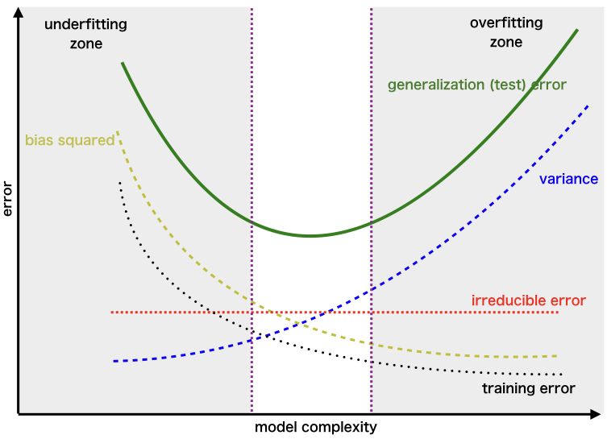
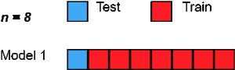
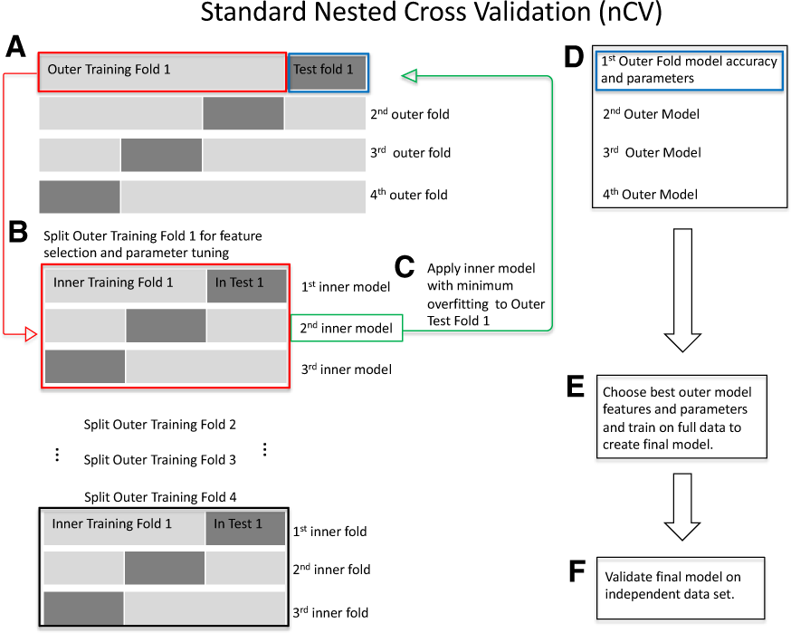

layout: true
background-image: url("img/video_placeholder.jpg")
background-size: 240px
background-position: 100% 0%

```{r, include = FALSE}
knitr::opts_chunk$set(tidy = FALSE, tidy.opts=list(width.cutoff=80), fig.retina=3)
ggplot2::theme_set(ggplot2::theme_bw(base_size = 20))
ggplot2::update_geom_defaults("point", list(size = 3))
# place "chakra: libs/remark.js" after output in YAML header if get an error about downloading js file
```

```{css, echo = FALSE}
.remark-code, .remark-inline-code {
  background: #f0f0f0;
}
.remark-code {
  font-size: 24px;
}
.huge .remark-code { /*Change made here*/
  font-size: 200% !important;
}
.tiny .remark-code { /*Change made here*/
  font-size: 60% !important;
}
.smaller .remark-code { /*Change made here*/
  font-size: 90% !important;
}
.smaller2 .remark-code { /*Change made here*/
  font-size: 80% !important;
}
.smaller3 .remark-code { /*Change made here*/
  font-size: 70% !important;
}
```


```{r wrap-hook, include=FALSE}
library(knitr)
hook_output = knit_hooks$get('output')
knit_hooks$set(output = function(x, options) {
  # this hook is used only when the linewidth option is not NULL
  if (!is.null(n <- options$linewidth)) {
    x = knitr:::split_lines(x)
    # any lines wider than n should be wrapped
    if (any(nchar(x) > n)) x = strwrap(x, width = n)
    x = paste(x, collapse = '\n')
  }
  
  lines <- options$output.lines
   if (is.null(lines)) {
     return(hook_output(x, options))  # pass to default hook
   }
   x <- unlist(strsplit(x, "\n"))
   if (length(lines)==1) {        # first n lines
     if (length(x) > lines) {
       # truncate the output
       x <- c(head(x, lines))
     }
   } else {
     x <- c(x[lines])
   }
   # paste these lines together
   x <- paste(c(x, ""), collapse = "\n")

  hook_output(x, options)
})

```

```{r, echo = FALSE, warning = FALSE, message = FALSE}
library(tidyverse)
library(ggplot2)
library(GGally)
library(caret)
library(gridExtra)
library("MASS")
library(class)

library(dslabs)
library("Hiiragi2013")
```

---

# Announcements

<big>

* Analysis assignment is due one week from today (29 March)

* Wednesday's lecture (24 March) will be asynchronous - I'll be introducing GWAS

* Next week's lectures (29 and 31 March - our last! 😭) will both be **synchronous**

  * Guest lecturer **Dr. Yongjin Park** will be back with us to talk about causal inference in genomics on 29 March
  
  * Guest lecturer **Dr. Jessica Dennis** will be with us to talk about polygenic risk scores and phenome-wide association studies on 31 March


---

# Learning objectives 

<big>

* Explain the purpose of **supervised learning** and how it differs from **unsupervised learning** 

* Understand the importance of evaluating supervised learning models on **test and/or validation sets**

* Explain the procedure of **cross-validation** and what it is used for

* List several metrics for **evaluating binary classification procedures**, and describe advantages and disadvantages of each

* Explain why **regularization** is useful when building supervised learning models from high-dimensional datasets

* Understand the main mathematical ideas behind the **ridge, lasso, and elastic net** regularization procedures

---

# Recall: Supervised learning

### A procedure or algorithm which uses a set of **inputs** (measured or preset variables) to predict the values of one or more **outputs** (variables which are influenced in some way by the inputs)

--

<big>
* We have a training data set of $n$ examples in which we know both the inputs $(\boldsymbol{x}_i)$ and outputs $({y}_i)$, where $i = 1,...,n$

* Based on this training data, we will produce a model (function) to predict ${y_i}$ from $\boldsymbol{x}_i$

  * this model can be parametric or non-parametric
  
* Using the model, we can predict ${y}$ on *new samples* of a **test set** in which we only know $\boldsymbol{x}$

* When $y$ is continuous, this is **regression**; when $y$ is discrete/categorical, this is **classification**

---

# How do we find the **best** model?

## How do we compare models?

---

# Example classification task

.left-column[
### Train a classifier to predit tumor type from gene expression data

]

.right-column[

```{r, echo = FALSE, fig.align='center', fig.width=9.5, fig.height=6}
set.seed(35)
df <- data.frame(g1 = runif(40, 0, 5)) %>%
  mutate(group = c(rep("benign", 20), rep("malignant", 20)),
         g2 = sort(runif(40, 0, 6)) - 0.5*g1 + runif(40,-2,2))

p1 <- df %>% ggplot() +
  geom_point(aes(x = g1, y = g2, colour = group)) +
  xlab("Gene 1 expression") +
  ylab("Gene 2 expression") +
  labs(colour = "")
p1
```
]

---

# Which classifier is better?

```{r, lda, echo = FALSE}
mal_lda = lda(group ~ g1 + g2, 
                 data = df)


# Set up the points for prediction, a 500×500 grid that covers the data range.
make1Dgrid = function(x) {
  rg = grDevices::extendrange(x)
  seq(from = rg[1], to = rg[2], length.out = 500)
}

df_grid = with(df,
  expand.grid(g1 = make1Dgrid(g1),
              g2 = make1Dgrid(g2)))

# add the predictions.
df_grid$pred =
  predict(mal_lda, newdata = df_grid)$class

p_lda <- ggplot(mapping = aes(x = g1, y = g2)) +
  geom_raster(aes(fill = pred),
              data = df_grid, alpha = 0.25, interpolate = TRUE) +
  geom_point(aes(colour = group), data = df) + 
  xlab("Gene 1") +
  ylab("Gene 2") +
  ggtitle("LDA")

```


```{r, 1NN, echo = FALSE}
df_grid_1 = with(df,
  expand.grid(g1 = make1Dgrid(g1),
              g2 = make1Dgrid(g2)))

df_grid_1$pred <- knn(train = dplyr::select(df, g1, g2), 
              test = df_grid_1,
              cl = as.factor(df$group), k = 1)

p_1nn <- ggplot(mapping = aes(x = g1, y = g2)) +
  geom_raster(aes(fill = pred),
              data = df_grid_1, alpha = 0.25, interpolate = TRUE) +
  geom_point(aes(colour = group), data = df) + 
  xlab("Gene 1") +
  ylab("Gene 2") +
  ggtitle("KNN with K=1")
```


```{r, 5NN, echo = FALSE}
df_grid_5 = with(df,
  expand.grid(g1 = make1Dgrid(g1),
              g2 = make1Dgrid(g2)))

df_grid_5$pred <- knn(train = dplyr::select(df, g1, g2), 
              test = df_grid_5,
              cl = as.factor(df$group), k = 5)

p_5nn <- ggplot(mapping = aes(x = g1, y = g2)) +
  geom_raster(aes(fill = pred),
              data = df_grid_5, alpha = 0.25, interpolate = TRUE) +
  geom_point(aes(colour = group), data = df) +
  xlab("Gene 1") +
  ylab("Gene 2") +
  ggtitle("KNN with K=5")
```

```{r, plotall, echo = FALSE, fig.align='center', fig.width = 20, fig.height=7}
get_legend<-function(myggplot){
  tmp <- ggplot_gtable(ggplot_build(myggplot))
  leg <- which(sapply(tmp$grobs, function(x) x$name) == "guide-box")
  legend <- tmp$grobs[[leg]]
  return(legend)
}

leg <- get_legend(p_lda + 
                    labs(colour = "",
                         fill = "prediction"))
grid.arrange(p_lda + theme(legend.position = "none"), 
             p_1nn + theme(legend.position = "none"), 
             p_5nn + theme(legend.position = "none"), 
             leg, nrow = 1, widths = c(1,1,1,0.25))
```

---

# What makes a good classifer?

## A good prediction model should predict the class labels of the samples in the **test set** accurately

### In other words, the model should **generalize**

---

# Overfitting

If we allow very complicated predictors, we could **overfit** training data

```{r, echo = FALSE, fig.align='center', out.width= 650}

```

<small>
[image source](https://www.kaggle.com/getting-started/166897)

---

# Bias vs variance tradeoff in supervised learning

.pull-left[
<big>
* **Bias**: error in assumptions of the learning algorithm
  * results in missing the relevant relations between features and target outputs (underfitting)

* **Variance**: error from sensitivity to small fluctuations in the training set
  * results in modeling the random noise in the training data, rather than the intended outputs (overfitting)
]

.pull-right[
```{r, echo = FALSE, fig.align='center', out.width= 400}
knitr::include_graphics("https://www.oreilly.com/library/view/hands-on-transfer-learning/9781788831307/assets/bfa1f85c-82ab-4340-bbd0-8ca16ea2286a.png")
```
<small>
image source: [Hands-On Transfer Learning with Python by Sarkar et al.](https://towardsdatascience.com/the-bias-variance-tradeoff-8818f41e39e9)
]

---

# Bias-variance connection to prediction error

<big> 

One metric for prediction error in regression is **Mean Squared Error (MSE)**: 
$$MSE(\hat{\boldsymbol{y}}) =  \frac{1}{n}\sum_{i=1}^n (y_i-\hat{y}_i)^2$$

It can be shown that 

$$MSE(\hat{\boldsymbol{y}}) = Var(\hat{\boldsymbol{y}}) + (Bias(\hat{\boldsymbol{y}}))^2 $$


---

# Error and model complexity 

.left-column[
<small>
[image source](https://towardsdatascience.com/the-bias-variance-tradeoff-8818f41e39e9)
]
.right-column[
```{r, echo = FALSE, out.width= 680}

```
]

---

class: middle

# Model evaluation

## What to use for our test set?

## How do we know what the truth is in our test set samples?

---

# **Golden rule**: the model does not touch the test set <br> data *in any way*

<big>

* Train the model on one set of samples (**training set**) and use a completely separate of samples (**test set**) to evaluate

--

* If we evaluate *more than one model* on the test set, then ideally we have yet another completely separate and independent set of samples (**validation set**) for final evaluation

--

* If an independent dataset for testing is not available, we need to create one using part of our training data - how?

---

# Cross-validation

<big><big>

* Split the training data into subsets/partitions, and use some to train the model and others to test the model's prediction

* This is a general approach for estimating the error of the model in an unbiased way

* **K-fold cross-validation**: multiple rounds of cross-validation are performed using different partitions, and the evaluation results are combined to give an estimate of the model's predictive performance and its variability

---

# K-fold cross-validation

<big>

1. Divide input data into $K$ approximately equal-sized partitions (folds, $F_i$), indexed by $i = 1, ..., K$, each with $n_i$ samples

2. Set aside one of the partitions (folds) for the test set

3. Train the model on all input data *except* the held-out fold

4. Measure cross-validation (CV) error using data from the held-out (test set) fold $i$: $Error_i = \frac{1}{n_i} \sum_{j \in F_i} L(y_j, \hat{y}_{j}^{(-i)})$

5. Repeat, holding out a different fold each time until CV error is computed for all folds $i=1,...,K$, and average: $Mean\, Error = \frac{1}{k}\sum_{i=1}^k Error_i$

---

# Example: 3-fold cross-validation


<big>
* Randomly divide $n=12$ samples into $K=3$ equally sized folds

* Train 3 different models
  * Model 1: train on folds 2 + 3, test on fold 1 (get CV error for fold 1)
  * Model 2: train on folds 1 + 3, test on fold 2 (get CV error for fold 2)
  * Model 3: train on folds 1 + 2, test on fold 3 (get CV error for fold 3)
  
* Average the CV error across the three models

```{r, echo = FALSE, fig.align='center', out.width= 450}

```

<small>
[image source][1]

[1]: https://en.wikipedia.org/wiki/Cross-validation_(statistics)

---

# Choice of $K$

<big> 

Assume we have $n$ samples:

* What is the *smallest* $K$ we can choose?

--

* What is the *largest* $K$ we can choose?

--

**Larger** $K$: 

* variance of CV error smaller

* computational time larger

**Smaller** $K$:

* variance of CV error larger

* computational time lower


---

# Extreme case: $K=n$

<big>

If we perform $K$-fold cross-validation with $K=n$, this is a special case called **leave-one-out cross-validation**

```{r, echo = FALSE, fig.align='center', out.width= 400}

```


<small>
[image source][1]

[1]: https://en.wikipedia.org/wiki/Cross-validation_(statistics)


<big>
In general, smaller values of $K$ are usually used, unless the sample size $n$ is relatively small

---

# How to measure error on test/validation set?

<big>

Examples for a continuous response

* Squared error loss 

$$L(\boldsymbol{y}, \boldsymbol{\hat{y}}) =  \sum_{i=1}^n (y_i-\hat{y}_i)^2$$

* Mean Squared Error (MSE)

$$MSE =  \frac{1}{n}\sum_{i=1}^n (y_i-\hat{y}_i)^2$$

* Absolute error loss

$$L(\boldsymbol{y}, \boldsymbol{\hat{y}}) =  \sum_{i=1}^n |y_i-\hat{y}_i|$$
---

# Evaluating classifier performance on test set


**Categorical** response:

* Misclassification rate: $\frac{1}{n} \sum_{i=1}^n \boldsymbol{1}_{\{c_i \ne \hat{c}_i\}}$

A *buffet* of metrics for a **binary** response:

|  | Actual Positive | Actual Negative |  
|---|---|---|
| **Test Positive** | True Positive (TP) | False Positive (FP) |
| **Test Negative** | False Negative (FN) | True Negative (TN) |   

* Accuracy (1-error rate): $\frac{1}{n}(\text{TP}+\text{TN})$

* Sensitivity / True Positive Rate (TPR) / Power / Recall: $\frac{\text{TP}}{\text{TP}+\text{FN}}$

* Specificity / True Negative Rate (TNR): $\frac{\text{TN}}{\text{TN}+\text{FP}}$

* Precision (1-FDR): $\frac{\text{TP}}{\text{TP}+\text{FP}}$


---

# Evaluating classifier performance on test set

<big>

Chef's tasting menu (combine buffet items)

* $F_1$ score: harmonic mean of precision and recall:

$$F_1 = 2\frac{Precision * Recall}{Precision + Recall} = \frac{2TP}{2TP + FP + FN}$$

* Matthew's correlation coefficient:

$$MCC = \frac{TP*TN - FP*FN}{\sqrt{(TP+FP)(TP + FN)(TN+ FP)(TN + FN)}}$$

---

# Evaluating classifier performance on test set

<big>

Chef's tasting menu (combine buffet items)

* **AUC/AUROC**: Area under the Receiver Operating Characteristic (ROC) curve

```{r, echo = FALSE, fig.align='center', out.width= 370}

```

.center[FPR and TPR computed over a range of decision boundaries]

<small>
[image source](https://en.wikipedia.org/wiki/Receiver_operating_characteristic)


---

# Note on unbalanced data 

<big>

* Several metrics can be misleading for highly **unbalanced** data (i.e. where the vast majority of samples are from one class)

* For example, consider the case where 95% of samples in the training and test sets are positives. If we pick a classifier that only predicts positive, then the accuracy $(\frac{1}{n}(\text{TP}+\text{TN}))$ of our classifier in the test set is 0.95 

--

* AUROC has the same problem

* MCC and $F_1$ are more balanced metrics in terms of considering the precision in both classes even when data is unbalanced 

---

# Summary so far

### Supervised learning
1. Gather/measure data (features & response)
2. Formulate a model
3. Fit/estimate model parameters to minimize expected loss
4. Apply model to held out test set & evaluate

--

### Beware of overfitting!

If error on training set << error on test set

--

### Cross-validation
* Good first-pass solution for tuning model parameters
* Assumes training and test sets are independent (this might not be true, especially due to systematic artifacts in genomics, which could lead to inflated accuracy estimates)

---

class: middle

# What if we have a high-dimensional feature set?

---

# Enter: regularization

<big>

* In high-dimensional biology, we are typically faced with thousands to millions of features / covariates $(p >> n$ problem)

* **Problem**: it usually won't work very well (or at all) to input all ~20K genes in a gene expression experiment (or ~1M SNPs in a genotyping array dataset) to build a classifier of the response (e.g. phenotypic trait, disease, or other outcome)

--

* A main analysis goal is to **identify** features / covariates that are **important** in predicting the response (feature selection)

* **A Solution**: we can use **regularization** as a tool to perform feature selection

---

# Feature selection options

* **The "filter" approach**: 

  * without considering the labels/response: filter features based on variation (for example, only consider the top X genes with the highest variance or coefficient of variation)
  
  * considering the labels/response: only keep genes significantly correlated with the response (*must be careful here to do this step after holding out test set!*)
  
* **The "wrapper" approach**:

  * identify features that lead to good performance by the specific classifier, e.g. forward/backward selection  using cross-validation
  
  * computationally intensive for many features
  
* **The "embedded" approach**:

  * Modify objective function to include a penalty to favor models with fewer features
  
  * main idea: weights/coefficients of less important features are 'shrunk' to zero
  
---

# Feature selection in regression

<big>

* **Best subset regression**: 

  * find subset of size $k$ with smallest error (e.g. mean squared error)
  
  * unfeasible for omics studies, because ${p \choose k}$ is *huge*
  
* **Forward stepwise regression**:

  * sequentially add the feature that most improves the fit (e.g. minimizes prediction error)
  
* **Regularization methods (shrinkage/penalization)**:

  * modify objective function to explicitly penalize magnitude of coefficients

---

# Regularized regression framework

<big>

Minimize the following objective function:

$$argmin_\boldsymbol{\beta} \, (\boldsymbol{y - X\beta})^T(\boldsymbol{y - X\beta}) + \lambda f_p(\beta) $$

* $(\boldsymbol{y - X\beta})^T(\boldsymbol{y - X\beta})$ is the sum of squared errors

* $f_p(\beta)$ is a penalization function

* $\lambda \ge 0$ is a tuning parameter to balance squared error vs penalty

--

  * what happens if $\lambda = 0$?
  
--
  
  * what happens if $\lambda \rightarrow \infty$?

---

# Ridge regression

<big>

Minimize the following objective function:

$$argmin_\boldsymbol{\beta} \, (\boldsymbol{y - X\beta})^T(\boldsymbol{y - X\beta}) + \lambda f_p(\boldsymbol{\beta}) $$

  where the penalty function is the **L2 norm**:

$$f_p(\beta) = ||\boldsymbol{\beta}||_2^2 = \sum_{j=1}^p \beta_j^2$$
This leads to coefficient estimates

$$\hat{\beta}^{ridge}_\lambda = (\boldsymbol{X}^T\boldsymbol{X} + \lambda \boldsymbol{I})^{-1}\boldsymbol{X}^T\boldsymbol{y}$$
---

# Important details

<big> 


* Features/covariates should be **standardized** so they are on the same *scale*

  * if not, then they will have different contributions to the penalty (undesirable)
  
  * since features have mean 0, no intercept is needed in the model
  
* Coefficient estimates depend on the value of the tuning parameter $\lambda$

  * can use **nested cross-validation** to find (tune) a value of $\lambda$ that yields coefficient estimates that minimize the test error/loss function

---

# Nested cross-validation

.left-column[
Fig 1, [Parvandeh et al., 2020](http://dx.doi.org/10.1093/bioinformatics/btaa046)
]

.right-column[
```{r, echo = FALSE, fig.align='center', out.width= 590}

```
]

---

# Probabilistic (Bayesian) interpretation of <br> ridge regression

Recall our objective function:

$$argmin_\boldsymbol{\beta} \, \sum_{i=1}^n (y_i - \boldsymbol{x_i^T\beta})^2 + \lambda \sum_{j=1}^p \beta_j^2$$
The probabilistic (Bayesian) formulation places a prior distribution on the parameters $\boldsymbol{\beta}$:

$$p(\boldsymbol{\beta}) \sim MVN(0, \, \nu \boldsymbol{I_p})$$

Where $\nu$ governs the spread of the distribution on higher magnitude coefficient weights - akin to the $\lambda$ tuning parameter (i.e. if $\nu$ is small, coefficients will be more concentrated around zero)

Then the parameter estimates $\hat{\boldsymbol{\theta}} = (\hat{\boldsymbol{\beta}}, \hat{{\sigma}}, \hat{{\nu}})$ are obtained via the mean of the posterior:

$$p(\boldsymbol{\theta}|\boldsymbol{X, y}) \propto p(\boldsymbol{y}|\boldsymbol{X}, \boldsymbol{\theta})p(\boldsymbol{\theta}) = N(\boldsymbol{y} | \boldsymbol{X\beta,\sigma})N( \boldsymbol{\beta}|0,\nu)$$

---

# Another flavour of regularization: lasso

<big> 

* **Lasso: least absolute selection and shrinkage operator**

* Proposed by [Tibshirani (1996)](https://www.jstor.org/stable/2346178?seq=1)

* Minimize the following objective function:

$$argmin_\boldsymbol{\beta} \, (\boldsymbol{y - X\beta})^T(\boldsymbol{y - X\beta}) + \lambda f_p(\boldsymbol{\beta}) $$

  where the penalty function is the **L1 norm**:

$$f_p(\beta) = ||\boldsymbol{\beta}||_1 = \sum_{j=1}^p |\beta_j|$$
* The only difference between ridge and lasso regularization is L2 vs L1 norm penalty - but solutions behave *very* differently

---

# Another flavour of regularization: lasso

$$argmin_\boldsymbol{\beta} \, \sum_{i=1}^n (y_i - \boldsymbol{x_i^T\beta})^2 + \lambda \sum_{j=1}^p |\beta_j|$$
<big>

* As before, tuning parameter $\lambda$ controls the strength of the penalty and is selected with nested CV
  * What happens at $\lambda = 0$ and $\lambda \rightarrow \infty$?

--

* For $0 < \lambda < \infty$, we are balancing two ideas: (1) minimize the squared error, and (2) penalize the magnitude of the coefficients

--
  
* Unlike with ridge, the L1 penalty causes some coefficients to be set to **zero exactly**
  * this means lasso is performing *feature selection*

* No closed form solution; requires numerical optimization (e.g. LARS algorithm)

---

# Lasso: limitations and considerations

<big>

* If $p>n$, lasso can select at most $n$ features (rest of the coefficients will be set to zero)

* If multiple features are highly correlated, lasso will choose only one among them (arbitrarily) -- **interpret feature selection with caution**

---

# Lasso vs ridge

<big> 

* Both lead to shrinkage of coefficient estimates, but ridge shrinks magnitude whereas lasso shrinks some to zero

* **Predictive performance**: typically comparable

* **Interpretation**: lasso leads to variable selection

---

# Regularization in action

.left-column[
<big>

Let's revisit the photoreceptor dataset

Here's a heatmap of the top 50 most variable genes

Let's try to predict age from gene expression (of these 50 genes)
]

.right-column[
```{r, eval=TRUE, echo = FALSE, fig.align='center', fig.width=8, fig.height=6, message = FALSE, warning = FALSE}
library(GEOquery)
library(tidyverse)
library(gridExtra)
library(pheatmap)
library(glmnet)

bcols<-colorRampPalette(c("#000000" ,"#800000" ,"#FF8000" ,"#FFFF00", "#FFFFFF"))(20)

eset <- getGEO("GSE4051", getGPL= FALSE)[[1]]

# recode time points
pData(eset) <- pData(eset) %>%
  mutate(sample_id = geo_accession) %>%
  mutate(dev_stage =  case_when(
    grepl("E16", title) ~ "E16",
    grepl("P2", title) ~ "P2",
    grepl("P6", title) ~ "P6",
    grepl("P10", title) ~ "P10",
    grepl("4 weeks", title) ~ "4W"
  )) %>%
  mutate(genotype = case_when(
    grepl("Nrl-ko", title) ~ "NrlKO",
    grepl("wt", title) ~ "WT"
  ))

pData(eset) <- pData(eset) %>%
  mutate(dev_stage = fct_relevel(dev_stage, "E16", "P2", "P6", "P10", "4W")) %>%
  mutate(genotype = as.factor(genotype)) %>%
  mutate(genotype = fct_relevel(genotype, "WT", "NrlKO")) %>%
  mutate(age = ifelse(dev_stage == "E16", -4,
                        ifelse(dev_stage == "P2", 2, 
                                ifelse(dev_stage == "P6", 6, 
                                      ifelse(dev_stage == "P10", 10, 28))))) %>%
  dplyr::select(sample_id, dev_stage, genotype, age)

set.seed(345)
genevar <- rowVars(exprs(eset))
x <- exprs(eset)[which(nrow(eset) - rank(genevar)<=50), ]
x <- t(scale(t(x)))

pheatmap(x,
         scale = "none",
         color = bcols,
         border_color = NA,
         cluster_cols = TRUE, cluster_rows = TRUE,
         show_rownames = FALSE,
         show_colnames = FALSE,
         annotation_col = dplyr::select(pData(eset), -sample_id, -dev_stage))
```
]

---

# Ridge vs Lasso: $\lambda$ trace plots

```{r, echo = FALSE, fig.align='center', fig.width=19, fig.height=8}
par(mfrow=c(1,2))
ridge_fit = glmnet(t(x), pData(eset)$age, alpha = 0)
plot(ridge_fit, xvar="lambda", main = "Ridge regression")

lasso_fit = glmnet(t(x), pData(eset)$age, alpha = 1)
plot(lasso_fit, xvar="lambda", main = "Lasso regression")
```

---

## Ridge vs Lasso: coefficient estimates at the "best" $\lambda$

.tiny[
.pull-left[
Ridge
```{r, echo = FALSE}
coef(ridge_fit, s = cv.glmnet(t(x), pData(eset)$age, alpha = 0)$lambda.1se)
````
]

.pull-right[
Lasso
```{r, echo = FALSE}
coef(lasso_fit, s = cv.glmnet(t(x), pData(eset)$age, alpha = 1)$lambda.1se)
````
]
]

---

# Hybrid approach: elastic net

<big> 

$$argmin_\boldsymbol{\beta} \, \sum_{i=1}^n (y_i - \boldsymbol{x_i^T\beta})^2 + \lambda \Big( \alpha \sum_{j=1}^p \beta_j^2 + (1-\alpha) \sum_{j=1}^p |\beta_j| \Big)$$

* A compromise between ridge and lasso regression: penalty is a convex combination of the L1 and L2 norm

* Addresses the shortcoming of the lasso in the presence of correlated features

* Additional 'tuning' parameter $\alpha \in [0,1]$ which weights L1 vs L2 penalties - need to set upfront, or perform additional CV to tune

  * what happens if $\alpha=0$? 
  
  * what happens if $\alpha=1$? 
  
---

# Regularized models in R

<big>

* Highly recommend the [`glmnet` package](https://cran.r-project.org/web/packages/glmnet/index.html)

* Implements regularized linear regression (lasso, ridge, elastic net)

* Also includes extensions to generalized linear models (e.g. logistic, poisson, multinomial, etc) and survival analysis (Cox regression)

* Includes functions for performing nested CV to select 'best' $\lambda$

  * `lambda.min`: $\lambda$ that minimizes error
  
  * `lambda.1se`: largest $\lambda$ that is still within 1 standard error of `lambda.min`

---

# `glmnet` in practice

.pull-left[
<big>

5-fold nested CV for elastic net regression $(\alpha =0.5)$:

* Change `alpha` to 1 for lasso (default), and 0 for ridge

* Default loss is MSE for linear models (change with `type.measure` parameter)

* For other types of regression, change `family` parameter (e.g. `binomial` for logistic regression)

]

.pull-right[
.smaller2[
```{r, fig.align='center', fig.width=4.5, fig.height=3.5}
en_fit = cv.glmnet(t(x), pData(eset)$age, 
                   alpha = 0.5, nfolds = 5)
en_fit$lambda.1se

plot(en_fit)
```
]]

---

# Discussion

<big>

Designing variable penalization functions is an active area of research (e.g. fused lasso, group lasso, etc)


### Remember the golden rule: the test set should not influence the model/classifier *in any way*

---

# Additional Resources

<big>

* Conceptual overview + R implementation: [Chapter 12.4-12.6 of Modern Statistics for Modern Biology by Holmes and Huber](https://www.huber.embl.de/msmb/Chap-Supervised.html#machine-learning-vs-rote-learning)

* More detailed conceptual overview: [Chapters 29](https://rafalab.github.io/dsbook/cross-validation.html) and [33.9](https://rafalab.github.io/dsbook/large-datasets.html#regularization) of Intro to Data Science by Irizarry

* Mathematical framework: [Chapters 3.4, 7.2-7.4, and 7.10 in Elements of Statistical Learning by Hastie, Tibshirani and Friedman](https://web.stanford.edu/~hastie/Papers/ESLII.pdf)