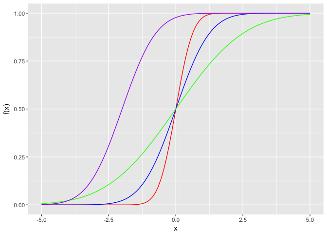
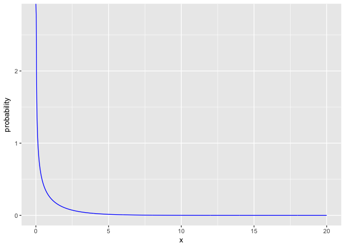
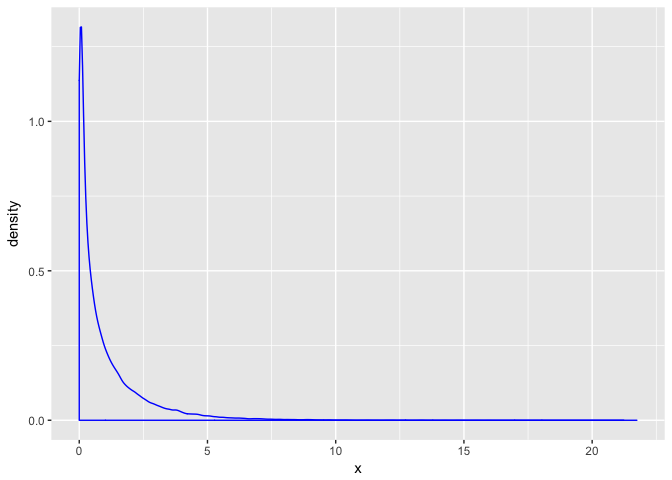

STAT 540 - Seminar 2c: Getting your hands dirty with R, probability and simulations
===================================================================================

Learning Objectives
-------------------

By the end of this seminar, you should

-   have a clear understanding of what a normal distribution, its associated parameters (mean & standard deviation), as well as the consequential probability density and cumulative distribution functions
-   have a clear understanding of the Central Limit Theorem (CLT)
-   have practical experience exploring the aforementioned concepts in statistics by simulating data and building visualizations

Part 1: The normal distribution
-------------------------------

The normal (or Gaussian) distribution is one of the most useful distributions in statistics. Turns out, many things in the world naturally follow a normal distribution. With this simple and (for the most part) reasonable assumption, we can go quite far!

In this section, we will explore the properties of the normal distribution using R. Along with the normal distribution, you will also gain important skills and experience working with probability distributions in general in the R environment.

First, we introduce the normal distribution. Next, we look its corresponding probability density and cumulative distribution functions. Lastly, we use the random number generator to simulate data from the normal distribution. Along the way, we will showcase many of commonly used features of R.

### What is the normal distribution?

A probability distribution describes the probabilities of all possible values in a given scenario. For example, if you randomly select a person from the UBC student database, what is the probability that this person's height is ~300cm? Quite unlikely. Maybe impossible? How about ~150 cm? That's probably more likely than ~300 cm. But *how much* more likely? What if we want to know the probability of the person's height being between 160 to 170 cm? These are the types of questions that a probability distribution can help answer. Specifically, we may assume that people's heights follow the normal distribution.

For this scenario, your best guess may be the average height of all UBC students? Surely, that would be the number with the largest probability, if height follow the normal distribution. Suppose we assume that it does follow the normal distribution and that the average height of all UBC student is 170 cm. But how "distributed" are these heights? In other words, do most students cluster around the 170 cm mean value? Or are they more spread out?

The *mean* and the *standard deviation* are the two parameters used to describe a normal distribution. Respectively, these two numbers describe the average value, one with the highest probability (average height, in this case) and the spread of the data. If the standard deviation is small, it means that heights among students are less variable and generally cluster around the mean. As a consequence, the probability estimate would change more dramatically with a small change in height. On the other hand, if the standard deviation is large, it means that heights are more spread out.

To illustrate this, here is a visualization showing two normal distributions. The blue line plots the probability distribution of a normal distribution with a larger standard deviation (more spread) whereas the red line plots one with a smaller standard deviation (less spread). Both distributions have a mean of 150.

Ignore the details of the code for now.

``` r
all_possible_heights <- seq(from = 140, to = 160, length = 100)
probability_values_less_spread <- dnorm(all_possible_heights, mean = 150, sd = 2)
probability_values_more_spread <- dnorm(all_possible_heights, mean = 150, sd = 3)

tibble(height = all_possible_heights, 
       probability_less_spread = probability_values_less_spread,
       probability_more_spread = probability_values_more_spread) %>% 
  ggplot() +
  geom_line(aes(x = height, y = probability_less_spread), color = "red") +
  geom_line(aes(x = height, y = probability_more_spread), color = "blue") +
  xlab("height (cm)")
```


### The probability density function

These plots are visualizations of the normal distribution's probability density function. It is a function that maps the values x (possible heights in our example) to its associated probability described by the distribution. So in the red line chart above, we can see that the probability of the person we picked at random having a height of 150 cm is ~0.2. The probability decreases as values devate from the mean; in the normal distribution, the mean value has the highest probability and the probability desnity function is symmetrical.

Here are a few more probability density plots for the normal distribution with different means and standard deviations. We recommend that you try running the code line by line so that you understand exactly what happens every step of the way!

From the code, can you figure out which color corresponds to which set of paramters? (mean & standard deviation)

``` r
xValues <- seq(from = -5, to = 5, length = 100)
plotA <- dnorm(xValues, mean = 0, sd = 0.5) #
plotB <-  dnorm(xValues, mean = 0, sd = 1)
plotC <-  dnorm(xValues, mean = 0, sd = 2)
plotD <-  dnorm(xValues, mean = -2, sd = 1)

normalDistributionsTibble <- tibble(x_value = xValues, 
                                    red_value = plotA,
                                    blue_value = plotB,
                                    green_value = plotC,
                                    purple_value = plotD)

p <- normalDistributionsTibble %>% ggplot()
p + 
  geom_line(aes(x = xValues, y = red_value), color = "red") +
  geom_line(aes(x = xValues, y = blue_value), color = "blue") +
  geom_line(aes(x = xValues, y = green_value), color = "green") +
  geom_line(aes(x = xValues, y = purple_value), color = "purple") +
  xlab("x") +
  ylab("f(x)")
```


Notice that in R, we can very easily plot the probability density function, simply by using the dnorm() functions. Similar functions are available for other distributions. For example, dunif() for the uniform distribution and dchisq() for the chi-square distribution.

### The Cumulative Distribution Function (CDF)

The cumulative distribution function is an alternative way of describing the distribution. We will not go into a lot of details on how it can be used. Just briefly, it describes the cumulative probability of all values smaller than x. This is why it starts at 0 and goes up to 1, as the probability of all values smaller than x grows with x. The slope corresponds to the spread. Lower standard deviations would correspond to more rapid growth in the CDF.

Note that the values of CDF for the normal distribution can also be very easily generated in R using the pnorm() function. Similarly, this function exists for many other distributions: punif() for the uniform distribution and pchisq() for the chi-square distribution.

Here we show the visualization of CDFs for the normal distribution with different means and standard deviations.

``` r
xValues <- seq(from = -5, to = 5, length = 100)
plotA <- pnorm(xValues, mean = 0, sd = 0.5)
plotB <-  pnorm(xValues, mean = 0, sd = 1)
plotC <-  pnorm(xValues, mean = 0, sd = 2)
plotD <-  pnorm(xValues, mean = -2, sd = 1)

normalDistributionsTibble <- tibble(x_value = xValues, 
                                    red_value = plotA,
                                    blue_value = plotB,
                                    green_value = plotC,
                                    purple_value = plotD)

p <- normalDistributionsTibble %>% ggplot()
p + 
  geom_line(aes(x = xValues, y = red_value), color = "red") +
  geom_line(aes(x = xValues, y = blue_value), color = "blue") +
  geom_line(aes(x = xValues, y = green_value), color = "green") +
  geom_line(aes(x = xValues, y = purple_value), color = "purple") +
  xlab("x") +
  ylab("f(x)")
```



### Simulation vs. perfect distribution

Finally, here we introduce R's random number generator. In R, we can sample values from the normal distribution easy using the rnorm() function.

Here we demonstrate usage of this function. We overlap the resulting density plot with true distribution. Notice how they line up :)!

``` r
meanValue <- 0
standardDeviation <- 1
numVals <- 100

xValues <- seq(from = -5, to = 5, length = numVals)
trueDistribution <- dnorm(xValues, mean = meanValue, sd = standardDeviation)

dataFrame <- tibble(x_value = xValues, true_value = trueDistribution)

set.seed(1)
randomVals <- rnorm(numVals, mean = meanValue, sd = standardDeviation)

dataFrame %>% ggplot() +
    geom_line(aes(x = x_value, y = true_value), color = "blue") +
    geom_line(aes(x = randomVals), color = "red", stat = "density") +
    geom_point(aes(x = randomVals, y = 0), color = "red", shape = 1, size = 3) +
    ylab("")
```


You guessed it, we can sample from other distributions using similar functions. For example, runif() is the random number function used to sample from a uniform distribution and rchisq() can be used to sample from the chi-square distribution.

Part 2: The Central Limit Theorem (CLT)
---------------------------------------

### What is the central limit theorem?

The Central Limit Theorem (CLT) is one of the most exciting concepts in statistics. It states that the distribution of the sum or means of random samples generated independently (IID) by any distribution will converge to the normal distribution. Note that the independent and identically distributed (IID) assumption simply means that each random value is sampled *with replacement* from the same distribution.

Below, we demonstrate the Central Limit Theorem by generating random samples from the chi-square distribution and show that the sample means are normally distributed.

A sample is defined as a collection of random values generated from a distribution. For example, we can generate 100 samples of size n = 5 from the chi-square distribution. This would essentially be the same as sampling 500 independently and identically distributed values and separating them into 100 groups. Sample means are the average values corresponding to each sample of size n = 5. In this case, we would have 100 sample means.

The Central Limit Theorem states that these 100 sample means would follow a normal distribution regardless of the underlying distribution from which the original random values were sampled.

### The chi-square distribution

To demonstrate the CLT, we will generate the original sample values from the chi-square distribution. But first, let's see what the chi-square distribution look like.

``` r
degreeFreedom <- 1

xValues <- seq(from = 0, to = 20, length = 1000)
probabilityValues <- dchisq(xValues, df = degreeFreedom)

dataFrame <- tibble(x = xValues, 
                    probability = probabilityValues)

dataFrame %>% ggplot() +
  geom_line(aes(x = x, y = probability), color = "blue")
```



Note that it looks absolutely nowhere like the normal distribution. That's what makes the CTL so exciting!

### Simulating many samples

Similar to what we did in Part 1 for the normal distribution, random values can be generated from the chi-square distribution using the function rchisq().

We will now generate 1000 sample, each sample will consist of 100 random values. We then calculate the sample means for each of the 1000 sample generated. We then look at the distribution of the 1000 means values.

``` r
# this is a trick to make the random values reproducible - note that computers are unable to produce truly random values. They can only generate pseudorandom values by using a seed, usually the current time, as it varies from moment to moment. By setting the seed ourselves, we make the random values repetable. 
set.seed(1)

sampleSize <- 100
numSamples <- 1000

degreeFreedom <- 1

randomChiSqValues <- rchisq(n = numSamples * sampleSize, df = degreeFreedom)
```

First let's take a look at the distribution of all randomly generated values. This is 100 \* 1000 = 100000 values sampled from the chi-square distribution.

``` r
tibble(x = randomChiSqValues) %>% 
  ggplot() + 
  geom_density(aes(x = x), color = "blue")
```



So, yes, of course it resembles the chi-square distribution. The values were sampled from it! Nothing too exciting yet...

### Convergence to the normal distribution - what an amazing property!

Ok, now let's separate all these values into 1000 samples, and then work out the sample means and look at the distribution of that.

``` r
# organize the random values into 1000 sample rows of size n = 5 columns
samples <- matrix(randomChiSqValues, nrow = numSamples, ncol = sampleSize)
sampleMeans <- rowMeans(samples) # work out the sample means 

head(sampleMeans)
```

    ## [1] 1.0797031 1.1752284 0.9261440 0.9416424 0.9380011 1.1191603

Great, now we have the sample means. Let's check their distribution.

``` r
tibble(x = sampleMeans) %>% 
  ggplot() + 
  geom_line(aes(x = x), stat = "density", color = "blue") +
  geom_point(aes(x = x, y = 0), color = "blue", shape = 1, size = 3)
```


... and TADA. Sample means of random samples generated from the chi-square distribution converges to the normal distribution. How amazing is that?!

Part 3: Deliverables
--------------------

-   How well does the CTL hold for smaller sample sizes? Try it with sample sizes of n = 5, keep the number of samples the same at 1000. Make a visual and show it to the TA to get checked off for completion.

Important takeaway
------------------

Every distribution in R comes with three different functions, p-function, d-function, and r-function. The p-function is the probability density function, the d-function is the cumulative distribution function, and r-function is the random number generator that can be used to sample IID values from the given distribution.

For the normal distribution, the three functions correspond to pnorm(), dnorm(), and rnorm(). We have used all three for the normal distribution in this seminar. We have also seen pchisq() and rchisq() for the chi-square distribution. When you get a chance, feel free to explore these functions for different distributions for yourself.

Attributions
------------

This seminar was developed by [Eric Chu](https://github.com/echu113) with seminar [materials](https://stat540-ubc.github.io/seminars/sm02c_playing-with-probability.html) previously designed by Dr. Jenny Bryan and Alice Zhu.
