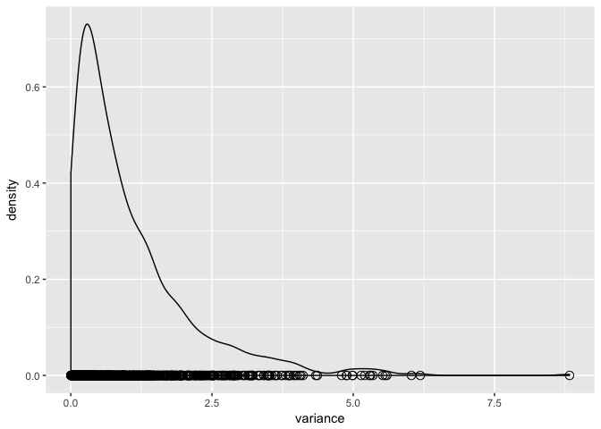
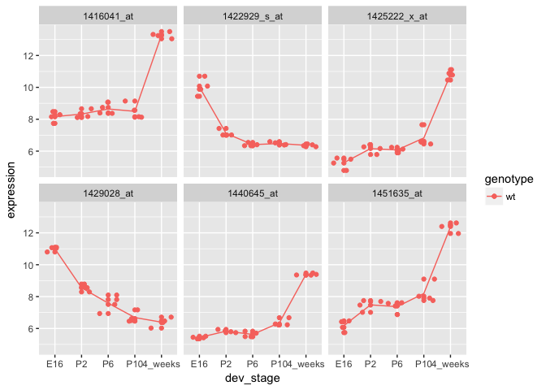
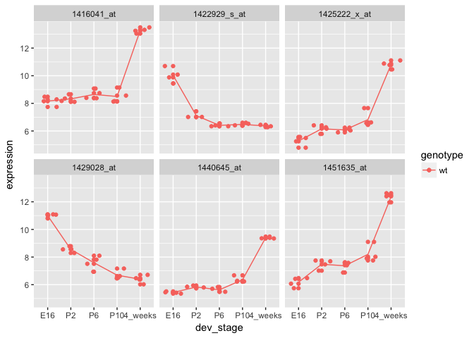
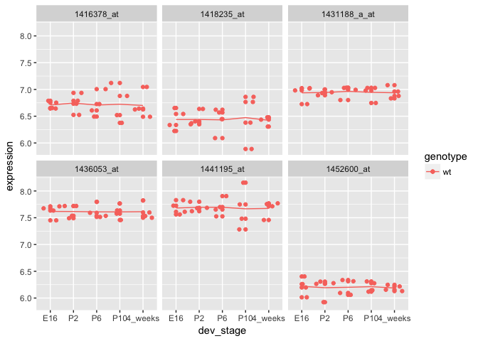
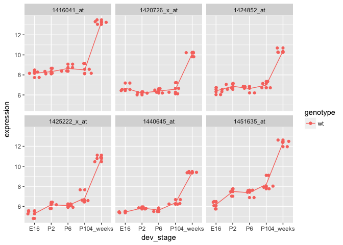
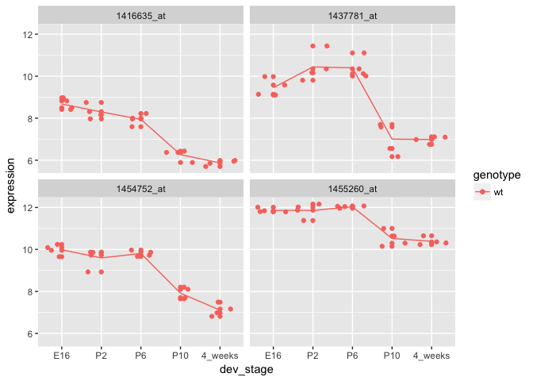
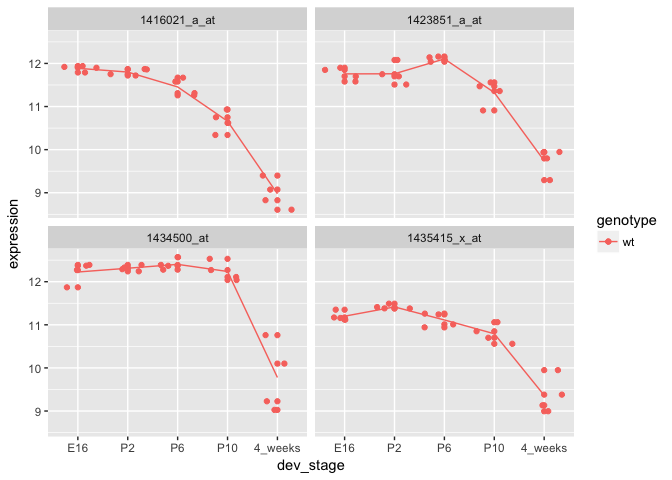
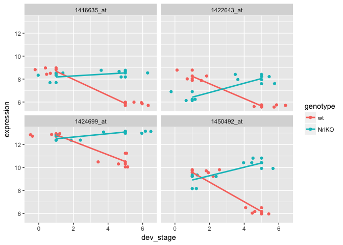

STAT 540 - Seminar 4: Differential Expression Analysis
======================================================

Learning Objectives
-------------------

By the end of this seminar, you should

-   have a clear understanding of what differential expression is and how it can be tested
-   have practical experience browsing and manipulating real gene expression data
-   have practical experience plotting expression changes as a trajectory using ggplot2
-   have practical experience testing for differential expression in a single gene using lm()
-   have practical experience finding differential expressions in a large number of genes and across multiple covariates using limma()
-   have an intuition of how limma works in the context of “moderated” t-values
-   be able to perform genome wide differential expression analysis given expression data and covariates and interpret the resulting statistics

Packages required
-----------------

-   [tidyverse](http://tidyverse.tidyverse.org/) (includes [ggplot2](http://ggplot2.tidyverse.org/), [dplyr](http://dplyr.tidyverse.org/), [tidyr](http://tidyr.tidyverse.org/), [readr](http://readr.tidyverse.org/), [purrr](http://purrr.tidyverse.org/), [tibble](http://tibble.tidyverse.org/))
    -   Install by running 'install.packages("tidyverse", dependencies = TRUE)'
-   [reshape2](https://www.rdocumentation.org/packages/reshape2/versions/1.4.3)
    -   Install by running 'install.packages("reshape2", dependencies = TRUE)'
-   [limma](http://bioconductor.org/packages/release/bioc/html/limma.html)
    -   Install by running 'source("<https://bioconductor.org/biocLite.R>")' and then 'biocLite("limma")'

Functions used
--------------

-   **utils::read.table()** - Reads a file in table format and creates a dataframe from it.
-   **base::c()** - Combine arguments into a single data strucutre; for example, c(1,2,3) -&gt; a vector containing \[1, 2, 3\].
-   **base::names()** - Functions to get or set the names of an object (vector, tibble, data frame, etc).
-   **base::factor()** - The function factor is used to encode a vector as a factor.
-   **base::ncol()** - Get the number of columns in a dataframe.
-   **base::nrow()** - Get the number of rows in a dataframe.
-   **base::sort()** - Sort a vector into ascending or descending order.
-   **tibble::rownames\_to\_column()** - Opposite to column\_to\_rownames(); convert row names to a column inside a dataframe.
-   **tibble::column\_to\_rownames()** - Opposite to rownames\_to\_column(); convert a column into a dataframe's row names.
-   **tibble::as\_tibble()** - Convert a dataframe to a tibble.
-   **reshape2::melt()** - Melt a data frame, i.e. reduce the number of columns by increasing the number of rows.
-   **dplyr::filter()** - Use filter() find rows/cases where conditions are true.
-   **dplyr::select()** - Keep only the columns/variables you mention.
-   **base::t()** - Transpose a matrix or dataframe.
-   **base::as.data.frame()** - Coerce object into a dataframe, e.g. convert a tibble into a dataframe so that rownames can be set.
-   **dplyr::left\_join()** - Join two tibbles together.
-   **ggplot2::ggplot()** - Base function for using ggplot2. Lays out the invisible 'canvas' for graphing.
-   **ggplot2::geom\_boxplot()** - Geom function for drawing box plots.
-   **ggplot2::theme()** - Modify components of a theme/appearance, e.g. rotate the x-axis by 90 degrees.
-   **ggplot2::facet\_wrap()** - ggplot2 function for separating factor levels into multiple graphs.
-   **stats::t.test()** - Performs one and two sample t-tests on vectors of data.
-   **stats::lm()** - Fit linear models.
-   **base::summary()** - Generic function used to produce result summaries of the results of various model fitting functions.
-   **stats::aov()** - Fit an analysis of variance model by a call to lm for each stratum.
-   **knitr::kable()** - Table generator for R-Markdown.
-   **base::all()** - Given a set of logical vectors, are all of the values true?
-   **stats::model.matrix()** - Creates a design (or model) matrix, e.g., by expanding factors to a set of dummary variables.
-   **limma::lmFit()** - Fit linear model for each gene given a series of arrays.
-   **limma::eBayes()** - Empirical Bayes Statistics for Differential Expression.
-   **limma::topTable()** - Extract a table of the top-ranked genes from a linear model fit.
-   **ggplot2::geom\_jitter()** - Adds a small amount of random variation to the location of each point, and is a useful way of handling overplotting caused by discreteness in smaller datasets.
-   **limma::makeContrasts()** - Construct the contrast matrix corresponding to specified contrasts of a set of parameters.
-   **limma::contrast.fit()** - Given a linear model fit to microarray data, compute estimated coefficients and standard errors for a given set of contrasts.
-   **limma::decideTests()** - Identify which genes are significantly differentially expressed for each contrast from a fit object containing p-values and test statistics.
-   **base::intersect()** - Set intersection.
-   **base::as.character()** - Coerce object to character type, e.g. convert a factor into character.
-   **utils::head()** - Return first part of a object (a vector or dataframe).

Part 1: Introduction
--------------------

### What is differential gene expression, anyway? And why statistic?

If the idea of differential gene expression sounds completely strange, make sure to review the relevant lecture notes and slides before you start. But, just briefly, for our purpose, the expression of a gene is simply the amount of its mRNA molecule that has been detected; the higher the abundance of mRNA detected, the higher the expression. And as with most other scientists, bioinformaticians are also interested in measuring differences between conditions. So, we'd like to know if genes are differentially expressed across conditions: healthy vs. disease, young vs. old, treatment vs. control, etc. And we have an elaborate statistical framework that helps us make this assessment.

Specifically, we may take a single gene and assess whether it is differentially expressed across some conditions. Or we may perform differential expression analysis on a large set of genes (sometimes all ~20,000 genes in the human genome) and do a high throughput screen to detect differentially expressed genes across some conditions. In this seminar, we will work through both scenarios. The approaches are fundamentally the same, but are also quite different, as you will soon see.

First, we introduce the gene expression dataset: its usual format & organization. We will import a sample dataset and render a few plots and tables to get you oriented. Next, we perform differential expression analysis on a single gene. This will be important for understanding the fundamental approach for assessing differential expression. Finally, we perform a genome wide differential expression screen using limma (a popular R package).

Part 2: Gene expression data
----------------------------

So, what does gene expression data look like?

In this seminar, we will use the GSE4051 dataset. See [here](https://www.ncbi.nlm.nih.gov/geo/query/acc.cgi?acc=GSE4051) for more details about the dataset. This is the same data set we've been exploring in class!

### Import data

First we import the dataset. The file is located [here](https://github.com/STAT540-UBC/STAT540-UBC.github.io/tree/master/seminars/seminars_winter_2017/seminar4/expression_data). With most gene expression datasets, there will be two components that generally come in two different files.

The first is the **expression matrix**, containing the sample IDs and their corresponding gene expression profiles. Essentially, each column is a different sample (a tissue, under some treatment, during some developmental stage, etc) and each row is a gene (or a probe). The expression values for all of the genes in a single column collectively constitute the gene expression profile of the sample represented by that column.

Here, we load the expression matrix. We've printed out a small subset of the dataset so you have an idea what it looks like.

``` r
expressionMatrix <- read.table("expression_data/GSE4051_data.tsv", stringsAsFactors = FALSE, sep = "\t", 
                                                             quote = "")
expressionMatrix <- expressionMatrix %>% rownames_to_column("gene") # rownames deprecated in tibbles and are hard to work with in ggplot
expressionMatrix <- expressionMatrix %>% as_tibble() # turn into tibble for pretty printing

expressionMatrix
```

    ## # A tibble: 29,949 x 40
    ##            gene Sample_20 Sample_21 Sample_22 Sample_23 Sample_16
    ##           <chr>     <dbl>     <dbl>     <dbl>     <dbl>     <dbl>
    ##  1   1415670_at     7.236     7.414     7.169     7.070     7.383
    ##  2   1415671_at     9.478    10.020     9.854    10.130     7.637
    ##  3   1415672_at    10.010    10.040     9.913     9.907     8.423
    ##  4   1415673_at     8.362     8.374     8.404     8.487     8.363
    ##  5 1415674_a_at     8.585     8.615     8.520     8.641     8.509
    ##  6   1415675_at     9.591     9.719     9.709     9.700     9.656
    ##  7 1415676_a_at     9.684    10.420     9.866    10.190     8.045
    ##  8   1415677_at     7.236     7.901     7.478     7.492     7.338
    ##  9   1415678_at    11.710    11.510    11.530    11.570    10.460
    ## 10   1415679_at     9.214    10.100     9.819     9.918     8.216
    ## # ... with 29,939 more rows, and 34 more variables: Sample_17 <dbl>,
    ## #   Sample_6 <dbl>, Sample_24 <dbl>, Sample_25 <dbl>, Sample_26 <dbl>,
    ## #   Sample_27 <dbl>, Sample_14 <dbl>, Sample_3 <dbl>, Sample_5 <dbl>,
    ## #   Sample_8 <dbl>, Sample_28 <dbl>, Sample_29 <dbl>, Sample_30 <dbl>,
    ## #   Sample_31 <dbl>, Sample_1 <dbl>, Sample_10 <dbl>, Sample_4 <dbl>,
    ## #   Sample_7 <dbl>, Sample_32 <dbl>, Sample_33 <dbl>, Sample_34 <dbl>,
    ## #   Sample_35 <dbl>, Sample_13 <dbl>, Sample_15 <dbl>, Sample_18 <dbl>,
    ## #   Sample_19 <dbl>, Sample_36 <dbl>, Sample_37 <dbl>, Sample_38 <dbl>,
    ## #   Sample_39 <dbl>, Sample_11 <dbl>, Sample_12 <dbl>, Sample_2 <dbl>,
    ## #   Sample_9 <dbl>

Great, now, the expression matrix has been imported. But we still don't know the properties associated with each sample. For example, does Sample\_20 belong to treatment or control? What developmental stage is it in? What tissue is it? How about Sample\_22? Sample\_23?

Without this information, the expression matrix is pretty much useless, at least for our purpose of assessing differential expression across conditions.

So, the second component that comes with the data is the **samples metadata**. We now import it.

``` r
samplesMetadata <- read.table("expression_data/GSE4051_design.tsv", 
                              header = TRUE, # set header = TRUE to use the first row of the data as column names
                              stringsAsFactors = FALSE) # set stringAsFactors to avoid setting everything as factors, we can control that ourselves

samplesMetadata <- samplesMetadata %>% as_tibble() # turn into tibble for pretty printing

# define our own column names for samples metadata for clarity
names(samplesMetadata) <- c("sample_id", "sample_number", "dev_stage", "genotype")

samplesMetadata
```

    ## # A tibble: 39 x 4
    ##    sample_id sample_number dev_stage genotype
    ##        <chr>         <int>     <chr>    <chr>
    ##  1 Sample_20            20       E16       wt
    ##  2 Sample_21            21       E16       wt
    ##  3 Sample_22            22       E16       wt
    ##  4 Sample_23            23       E16       wt
    ##  5 Sample_16            16       E16    NrlKO
    ##  6 Sample_17            17       E16    NrlKO
    ##  7  Sample_6             6       E16    NrlKO
    ##  8 Sample_24            24        P2       wt
    ##  9 Sample_25            25        P2       wt
    ## 10 Sample_26            26        P2       wt
    ## # ... with 29 more rows

From the data, it looks like dev\_stage and genotype could be made into factors. You can read more about factors [here](http://r4ds.had.co.nz/factors.html). Basically, factors are categorical variables. By declaring a variable as a factor, many operations on the categorical data becomes easier, such as making separate graphs for each categorical grouping. Generally, it is recommended to use factors where appropriate.

Now, let's turn devStage and gType into factors. These variables have a finite set of categories. sidChar and sidNum are not categorical variables because every row is different.

``` r
samplesMetadata$dev_stage <- samplesMetadata$dev_stage %>% factor(levels = c("E16", "P2", "P6", "P10", "4_weeks"))
samplesMetadata$dev_stage # note that Levels contain all possible categories of the variable
```

    ##  [1] E16     E16     E16     E16     E16     E16     E16     P2     
    ##  [9] P2      P2      P2      P2      P2      P2      P2      P6     
    ## [17] P6      P6      P6      P6      P6      P6      P6      P10    
    ## [25] P10     P10     P10     P10     P10     P10     P10     4_weeks
    ## [33] 4_weeks 4_weeks 4_weeks 4_weeks 4_weeks 4_weeks 4_weeks
    ## Levels: E16 P2 P6 P10 4_weeks

``` r
samplesMetadata$genotype <- samplesMetadata$genotype %>% factor(levels = c("wt", "NrlKO"))
samplesMetadata$genotype # note that Levels contain all possible categories of the variable
```

    ##  [1] wt    wt    wt    wt    NrlKO NrlKO NrlKO wt    wt    wt    wt   
    ## [12] NrlKO NrlKO NrlKO NrlKO wt    wt    wt    wt    NrlKO NrlKO NrlKO
    ## [23] NrlKO wt    wt    wt    wt    NrlKO NrlKO NrlKO NrlKO wt    wt   
    ## [34] wt    wt    NrlKO NrlKO NrlKO NrlKO
    ## Levels: wt NrlKO

``` r
samplesMetadata # columns dev_stage and genotype are now type factor
```

    ## # A tibble: 39 x 4
    ##    sample_id sample_number dev_stage genotype
    ##        <chr>         <int>    <fctr>   <fctr>
    ##  1 Sample_20            20       E16       wt
    ##  2 Sample_21            21       E16       wt
    ##  3 Sample_22            22       E16       wt
    ##  4 Sample_23            23       E16       wt
    ##  5 Sample_16            16       E16    NrlKO
    ##  6 Sample_17            17       E16    NrlKO
    ##  7  Sample_6             6       E16    NrlKO
    ##  8 Sample_24            24        P2       wt
    ##  9 Sample_25            25        P2       wt
    ## 10 Sample_26            26        P2       wt
    ## # ... with 29 more rows

Notice that the samples metadata dataset contains the properties of each sample. Yes, the sample IDs don't match. That's because we're only printing out a subset of the entire dataset to avoid filling up the entire page. Let's now do a quick sanity check make sure the samples match between the two data frames.

``` r
expressionMatrix %>% ncol() - 1 # number of samples in the expression matrix (- column for genes)
```

    ## [1] 39

``` r
samplesMetadata %>% nrow() # number of samples in the samples metadata 
```

    ## [1] 39

``` r
# do these numbers match? Let's also print them out

expressionMatrix %>% names() %>% sort()
```

    ##  [1] "gene"      "Sample_1"  "Sample_10" "Sample_11" "Sample_12"
    ##  [6] "Sample_13" "Sample_14" "Sample_15" "Sample_16" "Sample_17"
    ## [11] "Sample_18" "Sample_19" "Sample_2"  "Sample_20" "Sample_21"
    ## [16] "Sample_22" "Sample_23" "Sample_24" "Sample_25" "Sample_26"
    ## [21] "Sample_27" "Sample_28" "Sample_29" "Sample_3"  "Sample_30"
    ## [26] "Sample_31" "Sample_32" "Sample_33" "Sample_34" "Sample_35"
    ## [31] "Sample_36" "Sample_37" "Sample_38" "Sample_39" "Sample_4" 
    ## [36] "Sample_5"  "Sample_6"  "Sample_7"  "Sample_8"  "Sample_9"

``` r
samplesMetadata$sample_id %>% sort()
```

    ##  [1] "Sample_1"  "Sample_10" "Sample_11" "Sample_12" "Sample_13"
    ##  [6] "Sample_14" "Sample_15" "Sample_16" "Sample_17" "Sample_18"
    ## [11] "Sample_19" "Sample_2"  "Sample_20" "Sample_21" "Sample_22"
    ## [16] "Sample_23" "Sample_24" "Sample_25" "Sample_26" "Sample_27"
    ## [21] "Sample_28" "Sample_29" "Sample_3"  "Sample_30" "Sample_31"
    ## [26] "Sample_32" "Sample_33" "Sample_34" "Sample_35" "Sample_36"
    ## [31] "Sample_37" "Sample_38" "Sample_39" "Sample_4"  "Sample_5" 
    ## [36] "Sample_6"  "Sample_7"  "Sample_8"  "Sample_9"

``` r
# do the samples match? 
```

Yes, the samples in both data frames match! We have metadata for every sample in the expression matrix. Now we're ready to make some plots :).

### What are genes? What are probes?

One last note just before we get the party started. Notice that the row IDs in the expression matrix don't look much like genes. They looke like this: 1415670\_at, 1415671\_at, 1415672\_at. What are these random gibberish? Actualy these are probe IDs. Probes are segments of sequences used in microarray to bind to segments of cDNA molecules (stretches of mRNA). This means that there may be multiple probes that map to different sections of the same gene and there may be multiple genes that map to the same probe.

For the purpose of our seminar, we will ignore the difference between genes and probes, thereby avoiding the whole mapping problem. Instead, we will simply use these terms interchangeably. When we say "this gene is differentially expressed", feel free to substitute that for "this probe is differentially expressed" and vice versa.

### Plotting gene expression

Ok, now that we've loaded the data, let's do some quick exploration.

Two of the quickest visualizations to screen for problems with the dataset are boxplots and density plots.

Yes, we expect certain genes to be differentially expressed across some conditions. But we do not expect all the genes in a few particular samples to differ from all other samples. If we compare the expression value for all genes from one sample to another, we expect their distributions to line up. This is the rationale for doing such sanity checks.

Note that melt() is one of the most useful tricks you can do with your data frame to convert it into a form that is easily workable by ggplot. The opposite to melt() is spread(). We recommend that you play around with these functions to get an idea of how they work.

``` r
# melt into a format ggplot can easily work with
meltedExpressionMatrix <- expressionMatrix %>% melt(id = "gene") 

meltedExpressionMatrix %>% 
  ggplot(aes(x = variable, y = value)) +
  geom_boxplot() +
  theme(axis.text.x = element_text(angle = 90, hjust = 1))
```


``` r
meltedExpressionMatrix %>% 
  ggplot(aes(x = value, color = variable)) +
  geom_density() +
  theme(axis.text.x = element_text(angle = 90, hjust = 1))
```


The distribution of gene expression for all genes across all samples look quite consistent. Let's move on!

Part 3: Single gene analysis
----------------------------

In this section, we will look at differential expression at the single gene level. But first - what does differential expression look like?? More plots!

### What does differential expression look like?

As an example, let's first take a look at gene 1429226\_at. We will plot the expression of this gene for every sample, grouped by genotype (wt vs. NrlKO).

``` r
geneIds <- c("1416119_at", "1431708_a_at")

# use dplyr::filter() to get the expression data for the gene
expressionDataForGene <- expressionMatrix %>% filter(gene %in% geneIds)
```

    ## Warning: package 'bindrcpp' was built under R version 3.3.2

``` r
# transform the data frame into the format that matches the sample metadata
expressionDataForGene <- expressionDataForGene %>%
  as.data.frame() %>% 
  column_to_rownames("gene") %>%
  t() %>% as.data.frame() %>% 
  rownames_to_column("sample_id") %>% 
  melt(id = "sample_id") %>% 
  as_tibble() %>% 
  select(sample_id,
         gene = variable, 
         expression = value)

expressionDataForGene
```

    ## # A tibble: 78 x 3
    ##    sample_id       gene expression
    ##        <chr>     <fctr>      <dbl>
    ##  1 Sample_20 1416119_at     10.580
    ##  2 Sample_21 1416119_at     11.000
    ##  3 Sample_22 1416119_at     10.850
    ##  4 Sample_23 1416119_at     10.920
    ##  5 Sample_16 1416119_at      9.203
    ##  6 Sample_17 1416119_at     11.010
    ##  7  Sample_6 1416119_at     10.900
    ##  8 Sample_24 1416119_at     10.380
    ##  9 Sample_25 1416119_at     10.610
    ## 10 Sample_26 1416119_at     10.250
    ## # ... with 68 more rows

Actually, let's put this data transformation code into a function so that it can be reused; we will routinely need the dataset to be in this format as we perform analyses.

``` r
transformGeneExpressionMatrix <- function(expressionMatrix) {
  expressionMatrix <- expressionMatrix %>%
    as.data.frame() %>% 
    column_to_rownames("gene") %>%
    t() %>% as.data.frame() %>% 
    rownames_to_column("sample_id") %>% 
    melt(id = "sample_id") %>% 
    as_tibble() %>% 
    select(sample_id,
           gene = variable, 
           expression = value)
  return(expressionMatrix)
}
```

Note that knowing how to use functions will go a long way in helping you reduce the amount of code you need to write. It also greatly simplifies your code base. Very much recommended!

Okay, now, let's try using this function.

``` r
# use dplyr::filter() to get the expression data for the gene
expressionDataForGene <- expressionMatrix %>% filter(gene %in% geneIds)

# this is the original expression matrix, consisting of only the one gene we filtered for
expressionDataForGene
```

    ## # A tibble: 2 x 40
    ##           gene Sample_20 Sample_21 Sample_22 Sample_23 Sample_16 Sample_17
    ##          <chr>     <dbl>     <dbl>     <dbl>     <dbl>     <dbl>     <dbl>
    ## 1   1416119_at    10.580      11.0    10.850    10.920     9.203    11.010
    ## 2 1431708_a_at     9.946      10.1     9.828     9.984     7.732     6.846
    ## # ... with 33 more variables: Sample_6 <dbl>, Sample_24 <dbl>,
    ## #   Sample_25 <dbl>, Sample_26 <dbl>, Sample_27 <dbl>, Sample_14 <dbl>,
    ## #   Sample_3 <dbl>, Sample_5 <dbl>, Sample_8 <dbl>, Sample_28 <dbl>,
    ## #   Sample_29 <dbl>, Sample_30 <dbl>, Sample_31 <dbl>, Sample_1 <dbl>,
    ## #   Sample_10 <dbl>, Sample_4 <dbl>, Sample_7 <dbl>, Sample_32 <dbl>,
    ## #   Sample_33 <dbl>, Sample_34 <dbl>, Sample_35 <dbl>, Sample_13 <dbl>,
    ## #   Sample_15 <dbl>, Sample_18 <dbl>, Sample_19 <dbl>, Sample_36 <dbl>,
    ## #   Sample_37 <dbl>, Sample_38 <dbl>, Sample_39 <dbl>, Sample_11 <dbl>,
    ## #   Sample_12 <dbl>, Sample_2 <dbl>, Sample_9 <dbl>

``` r
# now transformed
expressionDataForGene <- transformGeneExpressionMatrix(expressionDataForGene)
expressionDataForGene
```

    ## # A tibble: 78 x 3
    ##    sample_id       gene expression
    ##        <chr>     <fctr>      <dbl>
    ##  1 Sample_20 1416119_at     10.580
    ##  2 Sample_21 1416119_at     11.000
    ##  3 Sample_22 1416119_at     10.850
    ##  4 Sample_23 1416119_at     10.920
    ##  5 Sample_16 1416119_at      9.203
    ##  6 Sample_17 1416119_at     11.010
    ##  7  Sample_6 1416119_at     10.900
    ##  8 Sample_24 1416119_at     10.380
    ##  9 Sample_25 1416119_at     10.610
    ## 10 Sample_26 1416119_at     10.250
    ## # ... with 68 more rows

Yay! Now, we integrate the samples metadata by doing a join.

The left\_join() function ensures that all rows in the first data frame are retained while unmatched rows in the second data frame are dropped. Feel free to run ?join() in the R-Studio console to learn more as well as other variations of the function such as right\_join(), inner\_join(), full\_join(), etc.

``` r
expressionDataForGene <- expressionDataForGene %>% left_join(samplesMetadata, by = "sample_id")

expressionDataForGene
```

    ## # A tibble: 78 x 6
    ##    sample_id       gene expression sample_number dev_stage genotype
    ##        <chr>     <fctr>      <dbl>         <int>    <fctr>   <fctr>
    ##  1 Sample_20 1416119_at     10.580            20       E16       wt
    ##  2 Sample_21 1416119_at     11.000            21       E16       wt
    ##  3 Sample_22 1416119_at     10.850            22       E16       wt
    ##  4 Sample_23 1416119_at     10.920            23       E16       wt
    ##  5 Sample_16 1416119_at      9.203            16       E16    NrlKO
    ##  6 Sample_17 1416119_at     11.010            17       E16    NrlKO
    ##  7  Sample_6 1416119_at     10.900             6       E16    NrlKO
    ##  8 Sample_24 1416119_at     10.380            24        P2       wt
    ##  9 Sample_25 1416119_at     10.610            25        P2       wt
    ## 10 Sample_26 1416119_at     10.250            26        P2       wt
    ## # ... with 68 more rows

Beautiful! Now, what we have is one data frame that contains all the metadata for all samples as well as the gene expression for the genes that we're interested in.

Finally time for more plots. Not lying, promise.

First, let's look at a couple of genes

``` r
expressionDataForGene %>% 
  ggplot(aes(x = expression, y = genotype, color = genotype)) + 
  geom_point(size = 3, shape = 1) +
  facet_wrap(~gene)
```


Take a moment to look at these plots. Do you think one of these genes is differentially expressed across wt and NrlKO conditions?

If you think that **1431708\_a\_at** on the right is a hit while **1416119\_at** on the left is pretty boring, you'd be right. But why do you think that? Hint: mean and variance.

### The two-group t-test

Of course, eyeballing the data isn't always the best. We need a formal statistical test to tell us how much confidence we should have in the hit, and whether the boring gene is actually boring.

And what's the statistical test is best suited for the scenario where we want to test whether two samples differ in their means? The t-test, of course, it's in the title, not that you needed this bit of help :P.

Let's first do a t-test to compare the expression values across the two genotypes for the boring gene.

``` r
boringGene <- expressionDataForGene %>% filter(gene == "1416119_at")
t.test(expression ~ genotype, boringGene)
```

    ## 
    ##  Welch Two Sample t-test
    ## 
    ## data:  expression by genotype
    ## t = -0.18395, df = 36.534, p-value = 0.8551
    ## alternative hypothesis: true difference in means is not equal to 0
    ## 95 percent confidence interval:
    ##  -0.5079125  0.4233967
    ## sample estimates:
    ##    mean in group wt mean in group NrlKO 
    ##            9.892900            9.935158

As expected, we obtain a p-value of &gt;0.8. Not so significant. This gene is probably not differentially expressed across the two genotypes, as you suspected based on the plots above.

Now let's run the t-test on the interesting gene.

``` r
interestingGene <- expressionDataForGene %>% filter(gene == "1431708_a_at")
t.test(expression ~ genotype, interestingGene)
```

    ## 
    ##  Welch Two Sample t-test
    ## 
    ## data:  expression by genotype
    ## t = 9.838, df = 36.89, p-value = 7.381e-12
    ## alternative hypothesis: true difference in means is not equal to 0
    ## 95 percent confidence interval:
    ##  1.569556 2.383870
    ## sample estimates:
    ##    mean in group wt mean in group NrlKO 
    ##            9.554450            7.577737

And, we get a p-value &lt; 7.381e-12. An extremely tiny p-value!... Suppose, we set the significance threshold at 0.001, this p-value is statistically significant. We can also see that the mean expression value between the two conditions of this gene ~=2.

### The mighty linear regression

What does the linear regression have to do with this? Turns out, everything. If you're not sure what I'm talking about, make sure to go back to the lectures slides! I would also recommend reading chapter 3 of [An Introduction to Statistical Learning](http://www-bcf.usc.edu/~gareth/ISL/index.html) by Gareth et al. The PDF is freely available [here](http://www-bcf.usc.edu/~gareth/ISL/ISLR%20Seventh%20Printing.pdf). Be especially mindful of using linear models for

But essentially, the t-statistics is simply a formulation for testing the relationship between variables based on a linear fit.

To drive the point home, see that we can perform the "t-test" using the linear model in R.

First for the boring gene...

``` r
boringGene <- expressionDataForGene %>% filter(gene == "1416119_at")
summary(lm(expression ~ genotype, boringGene))
```

    ## 
    ## Call:
    ## lm(formula = expression ~ genotype, data = boringGene)
    ## 
    ## Residuals:
    ##     Min      1Q  Median      3Q     Max 
    ## -1.4559 -0.5257  0.1448  0.6460  1.1071 
    ## 
    ## Coefficients:
    ##               Estimate Std. Error t value Pr(>|t|)    
    ## (Intercept)    9.89290    0.16104  61.432   <2e-16 ***
    ## genotypeNrlKO  0.04226    0.23072   0.183    0.856    
    ## ---
    ## Signif. codes:  0 '***' 0.001 '**' 0.01 '*' 0.05 '.' 0.1 ' ' 1
    ## 
    ## Residual standard error: 0.7202 on 37 degrees of freedom
    ## Multiple R-squared:  0.0009058,  Adjusted R-squared:  -0.0261 
    ## F-statistic: 0.03355 on 1 and 37 DF,  p-value: 0.8557

We get a p-value of &gt;0.85, which is what we got with the t-test.

Let's try it with the interesting gene.

``` r
interestingGene <- expressionDataForGene %>% filter(gene == "1431708_a_at")
summary(lm(expression ~ genotype, interestingGene))
```

    ## 
    ## Call:
    ## lm(formula = expression ~ genotype, data = interestingGene)
    ## 
    ## Residuals:
    ##      Min       1Q   Median       3Q      Max 
    ## -1.02445 -0.45124 -0.03874  0.29605  2.00126 
    ## 
    ## Coefficients:
    ##               Estimate Std. Error t value Pr(>|t|)    
    ## (Intercept)     9.5545     0.1406   67.94  < 2e-16 ***
    ## genotypeNrlKO  -1.9767     0.2015   -9.81 7.71e-12 ***
    ## ---
    ## Signif. codes:  0 '***' 0.001 '**' 0.01 '*' 0.05 '.' 0.1 ' ' 1
    ## 
    ## Residual standard error: 0.629 on 37 degrees of freedom
    ## Multiple R-squared:  0.7223, Adjusted R-squared:  0.7148 
    ## F-statistic: 96.24 on 1 and 37 DF,  p-value: 7.713e-12

Again, as expected, we get a p-value of ~7.71e-12, similar to the t-test. This is not a coincidence!

By using the linear model instead of the t-test, we free ourselves from making only two-group comparisons. We can now tackle much more complicated sitautions where there are multiple covariates, each with multiple groups, etc.

As you might realize that to test for differences in multiple groups, we can use ANOVA. Turns that, that's also just a formulation of linear regression.

This is ANOVA. We use it to test if at least one developmental stage is different among all developmental stages (multiple groups) for 1431708\_a\_at.

``` r
interestingGene <- expressionDataForGene %>% filter(gene == "1431708_a_at")
summary(aov(expression ~ dev_stage, interestingGene))
```

    ##             Df Sum Sq Mean Sq F value Pr(>F)
    ## dev_stage    4   2.75  0.6868   0.467  0.759
    ## Residuals   34  49.96  1.4695

We obtain a p-value that is qutie big. Let's see what we get with the linear model.

``` r
interestingGene <- expressionDataForGene %>% filter(gene == "1431708_a_at")
summary(lm(expression ~ dev_stage, interestingGene))
```

    ## 
    ## Call:
    ## lm(formula = expression ~ dev_stage, data = interestingGene)
    ## 
    ## Residuals:
    ##     Min      1Q  Median      3Q     Max 
    ## -1.9236 -0.8776  0.2208  0.9687  2.2898 
    ## 
    ## Coefficients:
    ##                  Estimate Std. Error t value Pr(>|t|)    
    ## (Intercept)        8.7613     0.4582  19.122   <2e-16 ***
    ## dev_stageP2       -0.4024     0.6274  -0.641    0.526    
    ## dev_stageP6       -0.4110     0.6274  -0.655    0.517    
    ## dev_stageP10      -0.2839     0.6274  -0.453    0.654    
    ## dev_stage4_weeks   0.2693     0.6274   0.429    0.670    
    ## ---
    ## Signif. codes:  0 '***' 0.001 '**' 0.01 '*' 0.05 '.' 0.1 ' ' 1
    ## 
    ## Residual standard error: 1.212 on 34 degrees of freedom
    ## Multiple R-squared:  0.05212,    Adjusted R-squared:  -0.0594 
    ## F-statistic: 0.4674 on 4 and 34 DF,  p-value: 0.7592

And we get exactly the same p-value for the F-statistics. Again, not a coincidence!

Look like there isn't much differential expression going on for this gene between the developmental stages :D.

Part 4: Lots of genes (the high-throughput approach)
----------------------------------------------------

Part 3 is about assessing whether there is differential expression for a single gene across some conditions. You also saw that we can use the linear model for this task, regardless of how mnay covariates and groups we have.

So how is assessing one gene any different from assessing 20,000 genes? You ask.

Great question! The intuitive approach is, of course, simply fit a linear model for every gene. Make your comparison between the groups, and then obtain a p-value for each gene. The genes with the p-values that pass the significant threshold are then hits!

Sounds like a great approach! Except there are two problems. First, gene expression data is usually very high dimensional. This means a lot of variables are measured using very few samples. This leads to some biased estimates of variance, leading to bad estimates of p-values. Second, there is the multiple testing problem. It helps to think about what the p-value actually means: the probability of obtaining the test-statistics you obtained by chance. So what's the probability of obtaining a p-value of 0.05 by chance? %5 of course. And this is a problem when you're doing a separate t-test for all 20,000 genes!

We address each of these problems in more detail below.

### Bad variance estimates

Here we provide a data simulation to illustrate why gene variance estimates are bad in gene expression data. We simulate data for 3 samples, each with expression for 1000 genes. We then calculate the variance for each gene give the three samples. Finally, we look at the distribution of these variance estimates.

``` r
numberOfGenes <- 1000
numberOfSamples <- 3

# each row is a gene, each column is a sample
simulatedGeneExpressionMatrix <- matrix(rnorm(numberOfGenes * numberOfSamples), nrow = numberOfGenes) 
simulatedGeneExpressionMatrix %>% head()
```

    ##            [,1]       [,2]         [,3]
    ## [1,]  0.3652621 -0.4898400  0.324958390
    ## [2,] -1.7176540  0.3261726  0.489372624
    ## [3,]  1.0700617  0.3438700 -1.101629779
    ## [4,]  0.1890152 -0.2988744  0.008968923
    ## [5,] -1.8159556  1.0520086 -1.099587764
    ## [6,]  1.2171167  0.2051624  0.813084345

``` r
geneVars <- simulatedGeneExpressionMatrix %>% apply(1, var) # work out the variance for each gene

tibble(variance = geneVars) %>% 
  ggplot(aes(x = variance)) + 
  geom_density() +
  geom_point(aes(y = 0), shape = 1, size = 3)
```



Notice how many of the observed variances are freakishly small (and freakishly large!), even though they are indeed equal to 1 “on average”. For example, we see that at least a quarter of the genes appear to exhibit a sample variance that is less than one-third the true variance. This can wreak havoc with statistical inference, such as t-statistics. This is what limma – or the statistical methods it embodies, actually – is designed to combat.

Basically, low variance leads to high t-statistics, which in turn leads to low p-values. This means we can end up with a lot of false-positives if we mindlessly use the statistical tools for this kind of high dimensional data.

limma fixes this by using moderated t-values where the "typical variance" is used to weight gene-specific variance estimates. Otherwise, limma is the same as plain old linear regression method.

### Multiple testing: what are the chances of obtaining statistical significance value by random chance?

Multiple testing is another problem that we need to account for. Think about what the p-value actually measures. By definition, the p-value is the **probability of making the observation you made by chance**. Therefore, the p-value of 0.05 suggests that you would get the observation simply by chance 0.05 of the time. Interestingly, 0.05 of 20,000 genes is 1000 genes! If statistical significance was taken at face value, then you would end up with 1000 differentially expressed genes, when none really exist.

The capability to handle multiple testing is also built directly into limma. By using the function topTable(), we can make multiple testing adjustments to the significance measures. Limma also provides multiple methods for doing these adjustments. Make sure to go back to the lecture slides if you're feeling fuzzy the concept of multiple testing.

### Limma in action

Now we demonstrate how to use limma for performing large-scale differential expression analysis.

Here, we look for genes differentially expressed across different developmental stages. We first constrain our search to the wildtype samples, excluding any effect that the alternative genotype may have. Using this as an example, we showcase the overall workflow of limma and its various features. Subsequently, we include the alternative genotype samples to show interaction effects.

As usual, to get the most out of this seminar, you should reproduce the step-by-step procedure on your own machine!

``` r
# filter for wildtype data
wildTypeSamples <- samplesMetadata %>% filter(genotype == "wt")

wildTypeSamples # reminder of what the samples metadata data frame looks like
```

    ## # A tibble: 20 x 4
    ##    sample_id sample_number dev_stage genotype
    ##        <chr>         <int>    <fctr>   <fctr>
    ##  1 Sample_20            20       E16       wt
    ##  2 Sample_21            21       E16       wt
    ##  3 Sample_22            22       E16       wt
    ##  4 Sample_23            23       E16       wt
    ##  5 Sample_24            24        P2       wt
    ##  6 Sample_25            25        P2       wt
    ##  7 Sample_26            26        P2       wt
    ##  8 Sample_27            27        P2       wt
    ##  9 Sample_28            28        P6       wt
    ## 10 Sample_29            29        P6       wt
    ## 11 Sample_30            30        P6       wt
    ## 12 Sample_31            31        P6       wt
    ## 13 Sample_32            32       P10       wt
    ## 14 Sample_33            33       P10       wt
    ## 15 Sample_34            34       P10       wt
    ## 16 Sample_35            35       P10       wt
    ## 17 Sample_36            36   4_weeks       wt
    ## 18 Sample_37            37   4_weeks       wt
    ## 19 Sample_38            38   4_weeks       wt
    ## 20 Sample_39            39   4_weeks       wt

``` r
# reusable function for pulling expression data for given samples
getExpressionForSamples <- function(sampleIds, expressionMatrix) {
  # use gene column as row name
  dataFrame <- expressionMatrix %>% 
    as.data.frame() %>% 
    column_to_rownames("gene")
  # use give sampleIds to pull out the subset of interest (ORDERING OF SAMPLES IS VERY IMPORTANT)
  return(dataFrame[sampleIds])
}

# use the wildTypeSamples to pull out the wildtype expression data from the expression matrix
wildTypeExpressionMatrix <- getExpressionForSamples(wildTypeSamples$sample_id, expressionMatrix)

wildTypeExpressionMatrix %>% as_tibble() # reminder of what the expression matrix looks like
```

    ## # A tibble: 29,949 x 20
    ##    Sample_20 Sample_21 Sample_22 Sample_23 Sample_24 Sample_25 Sample_26
    ##  *     <dbl>     <dbl>     <dbl>     <dbl>     <dbl>     <dbl>     <dbl>
    ##  1     7.236     7.414     7.169     7.070     7.109     7.190     7.182
    ##  2     9.478    10.020     9.854    10.130     9.747     9.159     9.488
    ##  3    10.010    10.040     9.913     9.907     9.393    10.110     9.412
    ##  4     8.362     8.374     8.404     8.487     8.366     8.199     8.734
    ##  5     8.585     8.615     8.520     8.641     8.361     8.502     8.393
    ##  6     9.591     9.719     9.709     9.700     9.638     9.654     9.868
    ##  7     9.684    10.420     9.866    10.190     9.155     8.182     9.101
    ##  8     7.236     7.901     7.478     7.492     7.186     7.231     7.064
    ##  9    11.710    11.510    11.530    11.570    11.370    11.310    11.800
    ## 10     9.214    10.100     9.819     9.918     9.303     9.945     8.766
    ## # ... with 29,939 more rows, and 13 more variables: Sample_27 <dbl>,
    ## #   Sample_28 <dbl>, Sample_29 <dbl>, Sample_30 <dbl>, Sample_31 <dbl>,
    ## #   Sample_32 <dbl>, Sample_33 <dbl>, Sample_34 <dbl>, Sample_35 <dbl>,
    ## #   Sample_36 <dbl>, Sample_37 <dbl>, Sample_38 <dbl>, Sample_39 <dbl>

Now we have filtered for only wildtype samples in both the samples metadata and the expression matrix.

Next we want to construct the design matrix. The design matrix dictates how the categorical covariates are parametized in the linear model. If you're not sure what this means, make sure to get help. This is an important concept! We also recommend reading chapter 3 of [An Introduction to Statistical Learning](http://www-bcf.usc.edu/~gareth/ISL/index.html) by Gareth et al.

Before we actually construct the design matrix, there is one thing we need to check. That is, the samples are ordered identically in the samples metadata data frame as well as the expression matrix. The design matrix is constructed based on the order of the samples metadata data frame and is used to conduct differential expression analysis on the expression matrix. This consistency is **absolutely critical**. As soon as the two data frame go out of sync, the comparisons is no longer accurate.

``` r
# Ordering of samples in the samples metadata
wildTypeSamples$sample_id
```

    ##  [1] "Sample_20" "Sample_21" "Sample_22" "Sample_23" "Sample_24"
    ##  [6] "Sample_25" "Sample_26" "Sample_27" "Sample_28" "Sample_29"
    ## [11] "Sample_30" "Sample_31" "Sample_32" "Sample_33" "Sample_34"
    ## [16] "Sample_35" "Sample_36" "Sample_37" "Sample_38" "Sample_39"

``` r
# Ordering of samples in the expression matrix
names(wildTypeExpressionMatrix)
```

    ##  [1] "Sample_20" "Sample_21" "Sample_22" "Sample_23" "Sample_24"
    ##  [6] "Sample_25" "Sample_26" "Sample_27" "Sample_28" "Sample_29"
    ## [11] "Sample_30" "Sample_31" "Sample_32" "Sample_33" "Sample_34"
    ## [16] "Sample_35" "Sample_36" "Sample_37" "Sample_38" "Sample_39"

``` r
# check equivalence
(wildTypeSamples$sample_id == names(wildTypeExpressionMatrix)) %>% all()
```

    ## [1] TRUE

Very good! Now, we construct the design matrix.

It is recommended that you at least eyeball the design matrix to see if you can spot any problems. We print out the first ten rows of the design matrix and the samples metadata here.

``` r
designMatrix <- model.matrix(~dev_stage, wildTypeSamples)
head(designMatrix, 10) %>% kable()
```

|  (Intercept)|  dev\_stageP2|  dev\_stageP6|  dev\_stageP10|  dev\_stage4\_weeks|
|------------:|-------------:|-------------:|--------------:|-------------------:|
|            1|             0|             0|              0|                   0|
|            1|             0|             0|              0|                   0|
|            1|             0|             0|              0|                   0|
|            1|             0|             0|              0|                   0|
|            1|             1|             0|              0|                   0|
|            1|             1|             0|              0|                   0|
|            1|             1|             0|              0|                   0|
|            1|             1|             0|              0|                   0|
|            1|             0|             1|              0|                   0|
|            1|             0|             1|              0|                   0|

``` r
head(wildTypeSamples, 10) %>% kable()
```

| sample\_id |  sample\_number| dev\_stage | genotype |
|:-----------|---------------:|:-----------|:---------|
| Sample\_20 |              20| E16        | wt       |
| Sample\_21 |              21| E16        | wt       |
| Sample\_22 |              22| E16        | wt       |
| Sample\_23 |              23| E16        | wt       |
| Sample\_24 |              24| P2         | wt       |
| Sample\_25 |              25| P2         | wt       |
| Sample\_26 |              26| P2         | wt       |
| Sample\_27 |              27| P2         | wt       |
| Sample\_28 |              28| P6         | wt       |
| Sample\_29 |              29| P6         | wt       |

Notice that E16 is taken to be the baseline and everything else is defined relative to it.

Looks good? Let's move on. We now fit the model.

``` r
# keep the fit around as we will need to it for looking at other contrasts later 
wildTypeDevStageFit <- lmFit(wildTypeExpressionMatrix, designMatrix)

# run ebayes to calculate moderated t-statistics
wildTypeDevStageFitEb <- eBayes(wildTypeDevStageFit)
```

### topTable() is your best friend

Now we've fit the models. We can start going through the differentially expressed genes list. We do this using the topTable() function.

``` r
topTenGenes <- topTable(wildTypeDevStageFitEb)
```

    ## Removing intercept from test coefficients

``` r
topTenGenes
```

    ##              dev_stageP2 dev_stageP6 dev_stageP10 dev_stage4_weeks AveExpr
    ## 1440645_at       0.39900     0.19525      0.92000          3.96125 6.52835
    ## 1416041_at       0.15800     0.47975      0.33275          5.11450 9.38250
    ## 1425222_x_at     0.88200     0.79950      1.54875          5.53175 7.02815
    ## 1451635_at       1.30250     1.19000      2.01600          6.18825 8.31860
    ## 1429028_at      -2.44325    -3.40725     -4.31050         -4.60175 8.04495
    ## 1422929_s_at    -2.91175    -3.61825     -3.54725         -3.66125 7.27830
    ## 1424852_at       0.45750     0.22975      0.57400          3.97900 7.45405
    ## 1425171_at       0.99800     3.05300      5.27875          6.07875 9.62045
    ## 1451617_at       0.72550     2.51275      4.98375          6.68475 8.81660
    ## 1451618_at       0.60275     2.89025      5.05075          6.28825 9.43065
    ##                     F      P.Value    adj.P.Val
    ## 1440645_at   425.4464 1.587779e-17 4.755241e-13
    ## 1416041_at   195.4574 1.522363e-14 2.279662e-10
    ## 1425222_x_at 173.3572 4.348283e-14 4.340891e-10
    ## 1451635_at   157.3341 1.013031e-13 7.584816e-10
    ## 1429028_at   148.7971 1.645967e-13 9.202951e-10
    ## 1422929_s_at 146.8672 1.843725e-13 9.202951e-10
    ## 1424852_at   143.2443 2.290408e-13 9.799345e-10
    ## 1425171_at   138.8483 3.001762e-13 1.123747e-09
    ## 1451617_at   136.4774 3.485203e-13 1.159759e-09
    ## 1451618_at   134.2025 4.031647e-13 1.207438e-09

By default, topTable() returns the top 10 most statistically significant genes. Let's make a few plots to see how these genes were differentially expressed.

Let's plot the top 6 genes in our list. We will plot the expression of each gene for all the wildtype samples across all the developmental stages.

Remember the transformGeneExpressionMatrix() that we wrote? Scroll up if you forgot. We can reuse it here.

``` r
topGenes <- rownames(topTenGenes)[1:6]
topGenesExpressionData <- wildTypeExpressionMatrix %>% 
  rownames_to_column("gene") %>% 
  filter(gene %in% topGenes) %>%
  transformGeneExpressionMatrix() %>% 
  left_join(wildTypeSamples, id = "sample_id")
```

    ## Joining, by = "sample_id"

``` r
topGenesExpressionData # reminder of formatted expression data looks like - for easy graphing
```

    ## # A tibble: 120 x 6
    ##    sample_id       gene expression sample_number dev_stage genotype
    ##        <chr>     <fctr>      <dbl>         <int>    <fctr>   <fctr>
    ##  1 Sample_20 1416041_at      8.478            20       E16       wt
    ##  2 Sample_21 1416041_at      7.742            21       E16       wt
    ##  3 Sample_22 1416041_at      8.287            22       E16       wt
    ##  4 Sample_23 1416041_at      8.155            23       E16       wt
    ##  5 Sample_24 1416041_at      8.174            24        P2       wt
    ##  6 Sample_25 1416041_at      8.659            25        P2       wt
    ##  7 Sample_26 1416041_at      8.110            26        P2       wt
    ##  8 Sample_27 1416041_at      8.351            27        P2       wt
    ##  9 Sample_28 1416041_at      8.395            28        P6       wt
    ## 10 Sample_29 1416041_at      8.371            29        P6       wt
    ## # ... with 110 more rows

``` r
topGenesExpressionData %>% 
  ggplot(aes(x = dev_stage, y = expression, color = genotype)) +
  geom_point() +
  geom_jitter() +
  stat_summary(aes(y = expression, group=1), fun.y = mean, geom="line") +
  facet_wrap(~gene)
```



What do you think? Does it look plausible to you that these genes are differentially expressed across developmental stages?

Let's look at the least significant genes.

Actaully, before we do that, let's put the graphing code into a reusable function.

``` r
plotGenes <- function(genes, expressionMatrix, samplesMetadata) {
  
  expressionDataForGenes <- expressionMatrix %>% 
    rownames_to_column("gene") %>% 
    filter(gene %in% genes) %>%
    transformGeneExpressionMatrix() %>% 
    left_join(samplesMetadata, id = "sample_id")
  
  expressionDataForGenes %>% 
    ggplot(aes(x = dev_stage, y = expression, color = genotype)) +
    geom_point() +
    geom_jitter() +
    stat_summary(aes(y = expression, group=1), fun.y = mean, geom="line") +
    facet_wrap(~gene)
}

# verify that the function works
plotGenes(topGenes, wildTypeExpressionMatrix, wildTypeSamples)
```

    ## Joining, by = "sample_id"



OK, now let's use topTable() again to find some boring(insignificant) genes.

``` r
allGenes <- topTable(wildTypeDevStageFitEb, number = Inf) # show all genes in the list, rather than just the top 10
```

    ## Removing intercept from test coefficients

``` r
nrow(allGenes) # number of genes
```

    ## [1] 29949

``` r
# Let's look at the bottom 6 genes
boringGeneIndices <- seq(from = nrow(allGenes), to = nrow(allGenes) - 5)

boringGenes <- allGenes[boringGeneIndices,] 

# print out the boring genes and their p-values
boringGenes
```

    ##              dev_stageP2 dev_stageP6 dev_stageP10 dev_stage4_weeks AveExpr
    ## 1436053_at      -0.00175    -0.00850     -0.00925         -0.00500 7.61335
    ## 1441195_at       0.01450     0.01400     -0.01475         -0.00750 7.68300
    ## 1431188_a_at     0.00575     0.02725      0.00875          0.00125 6.94585
    ## 1418235_at       0.00075    -0.00700      0.03500         -0.01500 6.44150
    ## 1416378_at       0.03650    -0.00075      0.01500         -0.00825 6.71775
    ## 1452600_at      -0.02575    -0.01750     -0.00575         -0.03150 6.20265
    ##                        F   P.Value adj.P.Val
    ## 1436053_at   0.002772688 0.9999830 0.9999830
    ## 1441195_at   0.015007091 0.9995115 0.9995449
    ## 1431188_a_at 0.023344402 0.9988338 0.9989005
    ## 1418235_at   0.023367662 0.9988315 0.9989005
    ## 1416378_at   0.024051269 0.9987635 0.9988969
    ## 1452600_at   0.027650520 0.9983752 0.9985419

Notice that the genes on the bottom of our list have very large p-values. Also look at the differences for each group relative to baseline. They're all quite minor. Let's plot them out and see for ourselves.

``` r
plotGenes(rownames(boringGenes), wildTypeExpressionMatrix, wildTypeSamples)
```

    ## Joining, by = "sample_id"



Are you convinced?? I hope so!

Explore more with topTable(). Run ?topTable() in your R-Studio Console. Make sure you're familiar with the options to use alternative multiple testing methods, sort by different metrics, apply p-value cutoffs, etc.

### Constructing and using the contrast matrix

Now, remember that everything was assessed relative to the baseline (E16). What if we're particularly interested in finding the genes that are differentially expressed from developmental stages P6 to P10? Or from P10 to 4\_weeks? Or both?

This is where the contrast matrix comes in. Again, review the lecture slides or get help from TAs if you're not sure what contrasts are. Essentially, they help you make comparisons between groups, rather than only with the baseline.

In order to make these comparisons, you first have to construct the appropriate contrast matrix using makeContrasts(), then fit the contrast using contrast.fit(), apply ebayes() to calculate moderated statistics again, and then use topTable() to get the results.

Let’s try to distinguish genes that have stable expression at the last three developmental stages (P6, P10, and 4\_weeks) from those that do not. If expression doesn’t change from P6 to P10 to 4\_weeks, then the effects for all 3 of those developmental stages should be the same. That means that the difference between the P10 and P6 effects is zero and ditto for the difference between 4\_weeks effect and P10 (or P6, for that matter). Let’s form these contrasts.

``` r
# construct the contrast matrix
contrastMatrix <- makeContrasts(
  p10vsp6 = dev_stageP10 - dev_stageP6,
  fourweeksVsP10 = dev_stage4_weeks - dev_stageP10,
  levels = designMatrix
)
```

    ## Warning in makeContrasts(p10vsp6 = dev_stageP10 - dev_stageP6,
    ## fourweeksVsP10 = dev_stage4_weeks - : Renaming (Intercept) to Intercept

``` r
contrastMatrix # take a look
```

    ##                   Contrasts
    ## Levels             p10vsp6 fourweeksVsP10
    ##   Intercept              0              0
    ##   dev_stageP2            0              0
    ##   dev_stageP6           -1              0
    ##   dev_stageP10           1             -1
    ##   dev_stage4_weeks       0              1

``` r
# fit the contrast using the original fitted model
contrastFit <- contrasts.fit(wildTypeDevStageFit, contrastMatrix)
```

    ## Warning in contrasts.fit(wildTypeDevStageFit, contrastMatrix): row names of
    ## contrasts don't match col names of coefficients

``` r
# apply eBayes() for moderated statistics
contrastFitEb <- eBayes(contrastFit)
```

Now, you can use topTable() again to get the results.

``` r
contrastGenes <- topTable(contrastFitEb)

contrastGenes
```

    ##               p10vsp6 fourweeksVsP10 AveExpr        F      P.Value
    ## 1440645_at    0.72475        3.04125 6.52835 632.7410 2.224325e-17
    ## 1416041_at   -0.14700        4.78175 9.38250 302.3940 1.472973e-14
    ## 1425222_x_at  0.74925        3.98300 7.02815 235.3682 1.299509e-13
    ## 1424852_at    0.34425        3.40500 7.45405 225.1087 1.910320e-13
    ## 1420726_x_at  0.17325        3.55125 7.19000 203.5215 4.555385e-13
    ## 1451635_at    0.82600        4.17225 8.31860 200.0177 5.289072e-13
    ## 1429394_at   -0.09800        2.40975 7.84825 167.4991 2.416043e-12
    ## 1455447_at   -0.97650       -1.79975 9.97295 153.5444 5.063369e-12
    ## 1429791_at    0.24800        1.65825 8.02555 145.7407 7.877494e-12
    ## 1422612_at    0.48375        3.42600 8.83255 142.2388 9.676005e-12
    ##                 adj.P.Val
    ## 1440645_at   6.661631e-13
    ## 1416041_at   2.205703e-10
    ## 1425222_x_at 1.297300e-09
    ## 1424852_at   1.430304e-09
    ## 1420726_x_at 2.640040e-09
    ## 1451635_at   2.640040e-09
    ## 1429394_at   1.033687e-08
    ## 1455447_at   1.895536e-08
    ## 1429791_at   2.621367e-08
    ## 1422612_at   2.840295e-08

``` r
# again plot the top 6 genes
plotGenes(rownames(contrastGenes)[1:6], wildTypeExpressionMatrix, wildTypeSamples)
```

    ## Joining, by = "sample_id"



So far, so good. These 6 probes show little expression change from P6 to P10 and a strong increase from P10 to 4\_weeks. I would like to find some where there’s a change in each case but perhaps in opposite direction. Let’s press on.

Let’s use decideTests() to adjust the p-values for both contrasts globally, i.e. all together and then threshhold them at a cutoff of 1e-04.

``` r
cutoff <- 1e-04
wtResCont <- decideTests(contrastFitEb, p.value = cutoff, method = "global")
summary(wtResCont)
```

    ##    p10vsp6 fourweeksVsP10
    ## -1       4              8
    ## 0    29945          29895
    ## 1        0             46

We see there are 4 probes that go down from P6 to P10 and no hits going the other way. There are 8 probes that go down from P10 to 4\_weeks and 46 going the other way. Let’s try to pull out various hits and plot their data.

Here are the 4 that decline from P6 to P10.

``` r
hits1 <- wtResCont %>% 
  as.data.frame() %>% 
  rownames_to_column("gene") %>% 
  filter(p10vsp6 < 0)

# these are the genes that declined from P6 to P10
hits1
```

    ##         gene p10vsp6 fourweeksVsP10
    ## 1 1416635_at      -1              0
    ## 2 1437781_at      -1              0
    ## 3 1454752_at      -1              0
    ## 4 1455260_at      -1              0

``` r
# lets plot them
plotGenes(hits1$gene, wildTypeExpressionMatrix, wildTypeSamples)
```

    ## Joining, by = "sample_id"



Here are 4 of the 8 that decline from P10 to 4\_weeks.

``` r
hits2 <- wtResCont %>% 
  as.data.frame() %>% 
  rownames_to_column("gene") %>% 
  filter(fourweeksVsP10 < 0)

# these are the genes that declined from P10 to 4_weeks
hits2
```

    ##           gene p10vsp6 fourweeksVsP10
    ## 1 1416021_a_at       0             -1
    ## 2 1423851_a_at       0             -1
    ## 3   1434500_at       0             -1
    ## 4 1435415_x_at       0             -1
    ## 5 1437502_x_at       0             -1
    ## 6 1448182_a_at       0             -1
    ## 7   1452679_at       0             -1
    ## 8   1455447_at       0             -1

``` r
# lets plot them
plotGenes(hits2$gene[1:4], wildTypeExpressionMatrix, wildTypeSamples)
```

    ## Joining, by = "sample_id"



Is there any overlap between these probes?

``` r
hits1$gene %>% intersect(hits2$gene)
```

    ## character(0)

Doesn't seem so. If there is enough time, repeat this analysis with a less stringent p-value. See if you can get any overlaps. You get the idea. We've demonstrated how to use contrasts to compare between different groups. We've also demonstrated the decideTests() function to find significant genes for each contrast.

### Assessing interaction

So far, we've only done analysis on the wildtype samples and pretended that the alternative genotype doesn't exist. What if the genotype information at least partially determines (I don't mean to imply causality here) the effect of developmental stages. In that, the effect of developmental stages is different for the two genotypes.

This is called interaction. And to assess this phenomenon, we must analyze all samples together.

``` r
# for simplification, let's look at only a two-by-two design, we'll filter for developmental stages E16 and 4_weeks
interactionSamples <- samplesMetadata %>% filter(dev_stage %in% c("E16", "4_weeks"))

# IMPORTANT - you want to adjust factor levels here to eliminate stages P2, P6, and P10 from your design matrix
interactionSamples$dev_stage <- interactionSamples$dev_stage %>% 
  as.character() %>% 
  factor(levels = c("E16", "4_weeks"))

# reminder of what samples metadata look like - all samples
interactionSamples
```

    ## # A tibble: 15 x 4
    ##    sample_id sample_number dev_stage genotype
    ##        <chr>         <int>    <fctr>   <fctr>
    ##  1 Sample_20            20       E16       wt
    ##  2 Sample_21            21       E16       wt
    ##  3 Sample_22            22       E16       wt
    ##  4 Sample_23            23       E16       wt
    ##  5 Sample_16            16       E16    NrlKO
    ##  6 Sample_17            17       E16    NrlKO
    ##  7  Sample_6             6       E16    NrlKO
    ##  8 Sample_36            36   4_weeks       wt
    ##  9 Sample_37            37   4_weeks       wt
    ## 10 Sample_38            38   4_weeks       wt
    ## 11 Sample_39            39   4_weeks       wt
    ## 12 Sample_11            11   4_weeks    NrlKO
    ## 13 Sample_12            12   4_weeks    NrlKO
    ## 14  Sample_2             2   4_weeks    NrlKO
    ## 15  Sample_9             9   4_weeks    NrlKO

``` r
# reminder of what expression matrix looks like
expressionMatrix
```

    ## # A tibble: 29,949 x 40
    ##            gene Sample_20 Sample_21 Sample_22 Sample_23 Sample_16
    ##           <chr>     <dbl>     <dbl>     <dbl>     <dbl>     <dbl>
    ##  1   1415670_at     7.236     7.414     7.169     7.070     7.383
    ##  2   1415671_at     9.478    10.020     9.854    10.130     7.637
    ##  3   1415672_at    10.010    10.040     9.913     9.907     8.423
    ##  4   1415673_at     8.362     8.374     8.404     8.487     8.363
    ##  5 1415674_a_at     8.585     8.615     8.520     8.641     8.509
    ##  6   1415675_at     9.591     9.719     9.709     9.700     9.656
    ##  7 1415676_a_at     9.684    10.420     9.866    10.190     8.045
    ##  8   1415677_at     7.236     7.901     7.478     7.492     7.338
    ##  9   1415678_at    11.710    11.510    11.530    11.570    10.460
    ## 10   1415679_at     9.214    10.100     9.819     9.918     8.216
    ## # ... with 29,939 more rows, and 34 more variables: Sample_17 <dbl>,
    ## #   Sample_6 <dbl>, Sample_24 <dbl>, Sample_25 <dbl>, Sample_26 <dbl>,
    ## #   Sample_27 <dbl>, Sample_14 <dbl>, Sample_3 <dbl>, Sample_5 <dbl>,
    ## #   Sample_8 <dbl>, Sample_28 <dbl>, Sample_29 <dbl>, Sample_30 <dbl>,
    ## #   Sample_31 <dbl>, Sample_1 <dbl>, Sample_10 <dbl>, Sample_4 <dbl>,
    ## #   Sample_7 <dbl>, Sample_32 <dbl>, Sample_33 <dbl>, Sample_34 <dbl>,
    ## #   Sample_35 <dbl>, Sample_13 <dbl>, Sample_15 <dbl>, Sample_18 <dbl>,
    ## #   Sample_19 <dbl>, Sample_36 <dbl>, Sample_37 <dbl>, Sample_38 <dbl>,
    ## #   Sample_39 <dbl>, Sample_11 <dbl>, Sample_12 <dbl>, Sample_2 <dbl>,
    ## #   Sample_9 <dbl>

``` r
# reuse getExpressionForSamples() to get expression data for the samples that we want
expressionDataForInteractionSamples <- getExpressionForSamples(interactionSamples$sample_id, expressionMatrix)
head(expressionDataForInteractionSamples)
```

    ##              Sample_20 Sample_21 Sample_22 Sample_23 Sample_16 Sample_17
    ## 1415670_at       7.236     7.414     7.169     7.070     7.383     7.337
    ## 1415671_at       9.478    10.020     9.854    10.130     7.637    10.030
    ## 1415672_at      10.010    10.040     9.913     9.907     8.423    10.240
    ## 1415673_at       8.362     8.374     8.404     8.487     8.363     8.371
    ## 1415674_a_at     8.585     8.615     8.520     8.641     8.509     8.893
    ## 1415675_at       9.591     9.719     9.709     9.700     9.656     9.614
    ##              Sample_6 Sample_36 Sample_37 Sample_38 Sample_39 Sample_11
    ## 1415670_at      7.240     7.250     7.035     7.374     7.131     7.421
    ## 1415671_at      9.709     9.664     8.381     9.436     8.730     9.831
    ## 1415672_at     10.170     9.514     9.206     9.485     9.526    10.000
    ## 1415673_at      8.835     8.491     8.754     8.495     8.647     8.595
    ## 1415674_a_at    8.542     8.419     8.257     8.339     8.283     8.427
    ## 1415675_at      9.672     9.669     9.547     9.327     9.454     9.598
    ##              Sample_12 Sample_2 Sample_9
    ## 1415670_at       7.109    7.351    7.322
    ## 1415671_at       9.714    9.658    9.798
    ## 1415672_at       9.429    9.914    9.847
    ## 1415673_at       8.427    8.404    8.404
    ## 1415674_a_at     8.498    8.373    8.458
    ## 1415675_at       9.740    9.455    9.508

``` r
# construct the design matrix to include all groups for genotype and developmental stages plus the interaction terms
interactionDesign <- model.matrix(~genotype*dev_stage, interactionSamples)

interactionDesign
```

    ##    (Intercept) genotypeNrlKO dev_stage4_weeks
    ## 1            1             0                0
    ## 2            1             0                0
    ## 3            1             0                0
    ## 4            1             0                0
    ## 5            1             1                0
    ## 6            1             1                0
    ## 7            1             1                0
    ## 8            1             0                1
    ## 9            1             0                1
    ## 10           1             0                1
    ## 11           1             0                1
    ## 12           1             1                1
    ## 13           1             1                1
    ## 14           1             1                1
    ## 15           1             1                1
    ##    genotypeNrlKO:dev_stage4_weeks
    ## 1                               0
    ## 2                               0
    ## 3                               0
    ## 4                               0
    ## 5                               0
    ## 6                               0
    ## 7                               0
    ## 8                               0
    ## 9                               0
    ## 10                              0
    ## 11                              0
    ## 12                              1
    ## 13                              1
    ## 14                              1
    ## 15                              1
    ## attr(,"assign")
    ## [1] 0 1 2 3
    ## attr(,"contrasts")
    ## attr(,"contrasts")$genotype
    ## [1] "contr.treatment"
    ## 
    ## attr(,"contrasts")$dev_stage
    ## [1] "contr.treatment"

Now you have a design that allows you to compare the effect development stage for the two genotypes. The baseline is wildtype at the E16 developmental stage.

If genotype and developmental stage are interactive, then we should see some genes which are upregulated over development for one genotype but down regulated for the other. Specifically, these gens would have a differential expression of in the dev\_stage4\_weeks term in one direction and a differential expression in the genotypeNrlKO:dev\_stage4\_weeks term in the opposite direction.

Let's try and find these genes!

``` r
# first fit the model
interactionFit <- lmFit(expressionDataForInteractionSamples, interactionDesign) %>% eBayes()

cutoff <- 1e-06
changeDirections <- decideTests(interactionFit, p.value = cutoff, method = "global") %>% 
  as.data.frame() %>% 
  rownames_to_column("gene") %>% 
  as_tibble()

# look for down regulation across developmental stages in wt but up regulation in genotypeNrlKO 
hits <- changeDirections %>% filter(dev_stage4_weeks < 0, `genotypeNrlKO:dev_stage4_weeks` > 0)

# lets try plotting 5 on this list

expressionDataForHits <- expressionDataForInteractionSamples %>% 
  rownames_to_column("gene") %>% 
  filter(gene %in% hits$gene[1:4]) %>%
  transformGeneExpressionMatrix() %>% 
  left_join(samplesMetadata, id = "sample_id")
```

    ## Joining, by = "sample_id"

``` r
expressionDataForHits$dev_stage <- expressionDataForHits$dev_stage %>% as.numeric()

expressionDataForHits %>%
  ggplot(aes(x = dev_stage, y = expression, color = genotype)) +
  geom_point() +
  geom_jitter() +
  geom_smooth(method = "lm", se = FALSE) +
  facet_wrap(~gene)
```



Part 5: Deliverables
--------------------

-   Make a similar plot but this time for 4 genes where there are no interaction between genotype and developmental stages.

Attributions
------------

This seminar was developed by [Eric Chu](https://github.com/echu113) with seminar [materials](https://stat540-ubc.github.io/seminars/sm06_highVolumeLinearModelling.html) previously designed by Dr. Jenny Bryan and Alice Zhu.
