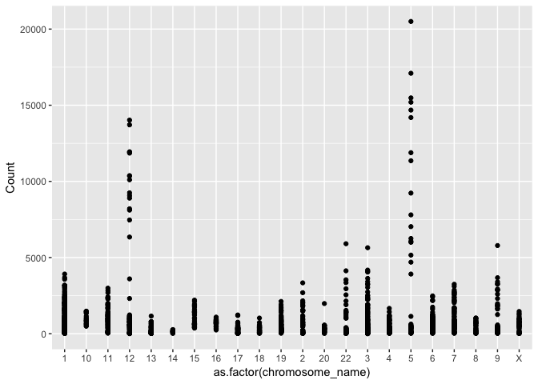

Seminar 3 - Data aggregation with dplyr
================

The objectives for this lecture will be to

-   Understand that some freely available genomic, transcriptomic and proteomic data can be accessed through the Gene Expression Omnibus server (GEO)
-   Download gene expression datasets using GEOquery and explore the data using dplyr verbs
-   Use dplyr verbs in conjunction with ggplot2
-   Run a t-test and isolate the results in a table

Part 1 - Accessing data using GEOquery
======================================

All of the packages you will need are listed below. If you have never used them before, you will need to install them using the commented lines above the library() command.

``` r
#source("https://bioconductor.org/biocLite.R")
#biocLite("GEOquery", "biomaRt")
library(GEOquery)
library(biomaRt)
#install.packages("tidyverse")
library(tidyverse)
#install.packages("data.table")
library(data.table)
#install.packages("reshape2")
library(reshape2)
```

A variety of freely available gene expression data is available through the Gene Expression Omnibus (GEO) server. Most of these datasets have associated papers in which they detail data acquisition and analysis methods.

To simplify things for its users, GEO has four basic entitys that act as containers for different types of data. The four main types are:

**GSM** - stores data associated with a single sample, and additional info about how the data was collected

**GSE** - stores information about each sample, as well as overall experiment info

**GPL** - stores platform info (i.e the machine used to collect the data)

**GDS** - stores curated matrices that are GSM objects in an "analysis-ready" format

The first thing we are going to do is download a dataset from the Gene Expression Omnibus (GEO) repository using the GEOquery package. This experiment is exploring gene expression differences between renal cell carcinoma cells (RCC) and adjacent normal cells using an Affymetric array. We are going to download data in the GDS format, as it is already in a nice table for us. Note: you can download any type of GEO data you want using the getGEO function.

``` r
gds <- getGEO("GDS507")
```

    ## File stored at:

    ## /var/folders/b2/8cn96b9x6qz0b7b79dn_n_1h0000gn/T//RtmpD0izMc/GDS507.soft.gz

``` r
#we can use str() to peak at the structure of a data object. 
str(gds)
```

    ## Formal class 'GDS' [package "GEOquery"] with 3 slots
    ##   ..@ gpl      :Formal class 'GPL' [package "GEOquery"] with 2 slots
    ##   .. .. ..@ dataTable:Formal class 'GEODataTable' [package "GEOquery"] with 2 slots
    ##   .. .. .. .. ..@ columns:'data.frame':  0 obs. of  0 variables
    ##   .. .. .. .. ..@ table  :'data.frame':  0 obs. of  0 variables
    ##   .. .. ..@ header   : list()
    ##   ..@ dataTable:Formal class 'GEODataTable' [package "GEOquery"] with 2 slots
    ##   .. .. ..@ columns:'data.frame':    17 obs. of  4 variables:
    ##   .. .. .. ..$ sample       : Factor w/ 17 levels "GSM11810","GSM11815",..: 2 4 5 7 9 10 12 14 16 1 ...
    ##   .. .. .. ..$ disease.state: Factor w/ 2 levels "normal","RCC": 2 2 2 2 2 2 2 2 2 1 ...
    ##   .. .. .. ..$ individual   : Factor w/ 10 levels "001","005","011",..: 6 4 1 2 3 5 8 9 10 6 ...
    ##   .. .. .. ..$ description  : chr [1:17] "Value for GSM11815: C035 Renal Clear Cell Carcinoma U133B; src: Trizol isolation of total RNA from Renal Clear Cell Carcinoma t"| __truncated__ "Value for GSM11832: C023 Renal Clear Cell Carcinoma U133B; src: Trizol isolation of total RNA from Renal Clear Cell Carcinoma t"| __truncated__ "Value for GSM12069: C001 Renal Clear Cell Carcinoma U133B; src: Trizol isolation of total RNA from Renal Clear Cell Carcinoma t"| __truncated__ "Value for GSM12083: C005 Renal Clear Cell Carcinoma U133B; src: Trizol isolation of total RNA from Renal Clear Cell Carcinoma t"| __truncated__ ...
    ##   .. .. ..@ table  :'data.frame':    22645 obs. of  19 variables:
    ##   .. .. .. ..$ ID_REF    : Factor w/ 22646 levels "200000_s_at",..: 1 2 3 4 5 6 7 8 9 10 ...
    ##   .. .. .. ..$ IDENTIFIER: Factor w/ 16466 levels "ABCF1","ANAPC5",..: 53 10 68 46 20 18 52 90 25 25 ...
    ##   .. .. .. ..$ GSM11815  : num [1:22645] 4254 17996 41679 65391 19030 ...
    ##   .. .. .. ..$ GSM11832  : num [1:22645] 5298 12011 39117 34806 15814 ...
    ##   .. .. .. ..$ GSM12069  : num [1:22645] 4026 10284 38759 31257 16356 ...
    ##   .. .. .. ..$ GSM12083  : num [1:22645] 3498 2535 32848 28308 9580 ...
    ##   .. .. .. ..$ GSM12101  : num [1:22645] 3566 11048 39634 67448 14274 ...
    ##   .. .. .. ..$ GSM12106  : num [1:22645] 4903 13354 43511 56990 17217 ...
    ##   .. .. .. ..$ GSM12274  : num [1:22645] 6373 8564 46857 57972 19117 ...
    ##   .. .. .. ..$ GSM12299  : num [1:22645] 4829 17248 47032 57570 17488 ...
    ##   .. .. .. ..$ GSM12412  : num [1:22645] 5206 16018 22152 29062 14672 ...
    ##   .. .. .. ..$ GSM11810  : num [1:22645] 2757 6077 26661 35141 17733 ...
    ##   .. .. .. ..$ GSM11827  : num [1:22645] 3932 15704 26374 23629 18022 ...
    ##   .. .. .. ..$ GSM12078  : num [1:22645] 3730 10138 23810 22100 17957 ...
    ##   .. .. .. ..$ GSM12099  : num [1:22645] 3223 11614 24749 21651 15958 ...
    ##   .. .. .. ..$ GSM12269  : num [1:22645] 3640 8460 21937 18551 15800 ...
    ##   .. .. .. ..$ GSM12287  : num [1:22645] 4886 10283 31463 23496 16686 ...
    ##   .. .. .. ..$ GSM12301  : num [1:22645] 4070 11844 22734 21315 18817 ...
    ##   .. .. .. ..$ GSM12448  : num [1:22645] 3482 9742 25396 28631 17421 ...
    ##   ..@ header   :List of 23
    ##   .. ..$ channel_count           : chr "1"
    ##   .. ..$ dataset_id              : chr [1:12] "GDS507" "GDS507" "GDS507" "GDS507" ...
    ##   .. ..$ description             : chr [1:13] "Investigation into mechanisms of renal clear cell carcinogenesis (RCC). Comparison of renal clear cell tumor tissue and adjacen"| __truncated__ "RCC" "normal" "035" ...
    ##   .. ..$ email                   : chr "geo@ncbi.nlm.nih.gov"
    ##   .. ..$ feature_count           : chr "22645"
    ##   .. ..$ institute               : chr "NCBI NLM NIH"
    ##   .. ..$ name                    : chr "Gene Expression Omnibus (GEO)"
    ##   .. ..$ order                   : chr "none"
    ##   .. ..$ platform                : chr "GPL97"
    ##   .. ..$ platform_organism       : chr "Homo sapiens"
    ##   .. ..$ platform_technology_type: chr "in situ oligonucleotide"
    ##   .. ..$ pubmed_id               : chr "14641932"
    ##   .. ..$ ref                     : chr "Nucleic Acids Res. 2005 Jan 1;33 Database Issue:D562-6"
    ##   .. ..$ reference_series        : chr "GSE781"
    ##   .. ..$ sample_count            : chr "17"
    ##   .. ..$ sample_id               : chr [1:12] "GSM11815,GSM11832,GSM12069,GSM12083,GSM12101,GSM12106,GSM12274,GSM12299,GSM12412" "GSM11810,GSM11827,GSM12078,GSM12099,GSM12269,GSM12287,GSM12301,GSM12448" "GSM11810,GSM11815" "GSM11827,GSM11832" ...
    ##   .. ..$ sample_organism         : chr "Homo sapiens"
    ##   .. ..$ sample_type             : chr "RNA"
    ##   .. ..$ title                   : chr "Renal clear cell carcinoma (HG-U133B)"
    ##   .. ..$ type                    : chr [1:13] "Expression profiling by array" "disease state" "disease state" "individual" ...
    ##   .. ..$ update_date             : chr "Mar 04 2004"
    ##   .. ..$ value_type              : chr "count"
    ##   .. ..$ web_link                : chr "http://www.ncbi.nlm.nih.gov/geo"

You can see that the GDS object has many different slots in which to put data. For example, our GDS file has a slot for information about the machine (@GPL), meta data and actual gene expression (@data.table) and information about the experiment and its authors (@header).

The first thing we want to do is extract a meta data table, and a gene expression table.

``` r
meta_data <- data.frame(Sample = gds@dataTable@columns$sample, disease = gds@dataTable@columns$disease.state)
#we grab this info from the appropriate slots above. 

data <- gds@dataTable@table
```

Sometimes doesn't work. If this happens, you can download the expression and meta data files [here](https://github.com/STAT540-UBC/STAT540-UBC.github.io/tree/master/seminars/seminars_winter_2017/Seminar3), and continue with the rest of the assignment.

Part 2 - Exploring a gene expression dataset
============================================

Let's peak at the data to see its structure using head(). This gives us the first few rows of the dataset.

``` r
head(data)
```

    ##        ID_REF IDENTIFIER GSM11815 GSM11832 GSM12069 GSM12083 GSM12101
    ## 1 200000_s_at      PRPF8   4254.0   5298.2   4026.5   3498.4   3566.4
    ## 2   200001_at     CAPNS1  17996.2  12010.7  10283.5   2534.7  11048.4
    ## 3   200002_at      RPL35  41678.8  39116.9  38758.9  32847.7  39633.9
    ## 4 200003_s_at    MIR6805  65390.9  34806.2  31257.2  28308.5  67447.5
    ## 5   200004_at     EIF4G2  19030.1  15813.6  16355.7   9579.7  14273.5
    ## 6   200005_at      EIF3D   8824.5   9706.2  10590.0   6986.7   9400.4
    ##   GSM12106 GSM12274 GSM12299 GSM12412 GSM11810 GSM11827 GSM12078 GSM12099
    ## 1   4903.1   6372.6   4829.1   5205.8   2756.8   3932.0   3729.9   3223.4
    ## 2  13354.0   8563.8  17247.6  16018.5   6077.0  15703.8  10138.5  11614.4
    ## 3  43511.2  46856.7  47032.4  22152.2  26660.7  26373.6  23809.6  24749.3
    ## 4  56989.9  57972.5  57570.5  29062.2  35140.9  23629.3  22100.5  21651.0
    ## 5  17217.0  19116.9  17487.6  14671.6  17733.1  18022.4  17957.4  15958.0
    ## 6  12835.2  10299.0  12375.2   7645.4   8661.5   7355.7   6973.4   6855.9
    ##   GSM12269 GSM12287 GSM12301 GSM12448
    ## 1   3640.5   4886.3   4070.2   3482.1
    ## 2   8460.5  10282.6  11844.3   9741.6
    ## 3  21936.8  31462.8  22733.7  25395.5
    ## 4  18550.7  23496.5  21315.4  28631.4
    ## 5  15799.8  16685.8  18817.3  17421.1
    ## 6   7949.2   9486.5   7494.5   7252.1

``` r
nrow(data)
```

    ## [1] 22645

``` r
ncol(data)
```

    ## [1] 19

In our data frame, the first two columns correspond to gene names. ID\_REF refers to the probe name. IDENTIFIER refers to the gene name to which this probe maps. The remaining columns contain expression values for the 17 samples. In summary, we have an array with dimensions 22645 x 19 (row x column).

Notice that some gene names are duplicated, because there are multiple probes that map to the same gene. We will deal with this later!

Now we can start exploring the dataset a bit. Just for fun - let's compute the average count in each sample.

We will do this using a function called apply() in base R.

``` r
#We exclude the first and second columns because they hold the probe and gene names, respectively. 
apply(data[,-c(1, 2)], 2, median)
```

    ## GSM11815 GSM11832 GSM12069 GSM12083 GSM12101 GSM12106 GSM12274 GSM12299 
    ##    265.6    250.3    218.5    309.7    281.9    240.1    280.2    217.0 
    ## GSM12412 GSM11810 GSM11827 GSM12078 GSM12099 GSM12269 GSM12287 GSM12301 
    ##    264.4    273.8    264.6    266.5    269.3    288.6    238.7    244.5 
    ## GSM12448 
    ##    264.3

apply() is useful, but it can really only compute statistics along rows or columns.

A much more versatile set of tools are the **dplyr verbs**. These are a set of functions designed for easy manipulation of data.

They are: **filter** - extract rows that meet certain criteria from data frame

**select** - extract columns that meet certain criteria from data frame

**mutate** - add a new column

**arange** - arrange the data in descending or ascending order

**group\_by** - group rows by descriptors (e.g. group all "control" patients together)

**summarize** - summarize certain statistics from the data (i.e mean, median, mode, number of samples)

An important thing to know about the dplyr verbs is that they will only work on data frames that meet certain structural criteria. Namely, each variable must be in its own column. In data science, we call this "tidy" data.

Let's look at a small dataset that's "tidy".

``` r
head(iris)
```

    ##   Sepal.Length Sepal.Width Petal.Length Petal.Width Species
    ## 1          5.1         3.5          1.4         0.2  setosa
    ## 2          4.9         3.0          1.4         0.2  setosa
    ## 3          4.7         3.2          1.3         0.2  setosa
    ## 4          4.6         3.1          1.5         0.2  setosa
    ## 5          5.0         3.6          1.4         0.2  setosa
    ## 6          5.4         3.9          1.7         0.4  setosa

The iris dataset contains information about certain species of flowers.

As you can see, each variable has its own column, and each row is an instance of that variable. There are no rownames. We can now use dplyr verbs to manipulate the data.

These verbs can be used together in a sequence of functions with the "pipe" operator. R will interpret the output of the previous function as the input to the subsequent function when you put the "pipe" operator ( %&gt;% ) inbetween the functions.

``` r
#select all rows with sepal length greater than 5. 
iris %>% 
    filter(Sepal.Length > 5) %>% 
    head()
```

    ## Warning: package 'bindrcpp' was built under R version 3.3.2

    ##   Sepal.Length Sepal.Width Petal.Length Petal.Width Species
    ## 1          5.1         3.5          1.4         0.2  setosa
    ## 2          5.4         3.9          1.7         0.4  setosa
    ## 3          5.4         3.7          1.5         0.2  setosa
    ## 4          5.8         4.0          1.2         0.2  setosa
    ## 5          5.7         4.4          1.5         0.4  setosa
    ## 6          5.4         3.9          1.3         0.4  setosa

``` r
#group all rows of the same species together.
iris %>% 
    group_by(Species) %>% 
    head()
```

    ## # A tibble: 6 x 5
    ## # Groups:   Species [1]
    ##   Sepal.Length Sepal.Width Petal.Length Petal.Width Species
    ##          <dbl>       <dbl>        <dbl>       <dbl>  <fctr>
    ## 1          5.1         3.5          1.4         0.2  setosa
    ## 2          4.9         3.0          1.4         0.2  setosa
    ## 3          4.7         3.2          1.3         0.2  setosa
    ## 4          4.6         3.1          1.5         0.2  setosa
    ## 5          5.0         3.6          1.4         0.2  setosa
    ## 6          5.4         3.9          1.7         0.4  setosa

``` r
#select the column called "Sepal.Width"
iris %>% 
    dplyr::select(Sepal.Width) %>% 
    head()
```

    ##   Sepal.Width
    ## 1         3.5
    ## 2         3.0
    ## 3         3.2
    ## 4         3.1
    ## 5         3.6
    ## 6         3.9

``` r
#create another column with the species name capitalized. 
iris %>%
    group_by(Species) %>% 
    mutate(Capitalized_names = toupper(Species)) %>% 
    head()
```

    ## # A tibble: 6 x 6
    ## # Groups:   Species [1]
    ##   Sepal.Length Sepal.Width Petal.Length Petal.Width Species
    ##          <dbl>       <dbl>        <dbl>       <dbl>  <fctr>
    ## 1          5.1         3.5          1.4         0.2  setosa
    ## 2          4.9         3.0          1.4         0.2  setosa
    ## 3          4.7         3.2          1.3         0.2  setosa
    ## 4          4.6         3.1          1.5         0.2  setosa
    ## 5          5.0         3.6          1.4         0.2  setosa
    ## 6          5.4         3.9          1.7         0.4  setosa
    ## # ... with 1 more variables: Capitalized_names <chr>

``` r
#summarize the average sepal length and number of rows belonging to each species.
iris %>% 
    group_by(Species) %>% 
    summarize(average_sepal_length = mean(Sepal.Length), n = n()) %>% 
    head()
```

    ## # A tibble: 3 x 3
    ##      Species average_sepal_length     n
    ##       <fctr>                <dbl> <int>
    ## 1     setosa                5.006    50
    ## 2 versicolor                5.936    50
    ## 3  virginica                6.588    50

``` r
#arrange the species in alphabetical order
iris %>% 
    arrange(desc(Species)) %>% 
    head()
```

    ##   Sepal.Length Sepal.Width Petal.Length Petal.Width   Species
    ## 1          6.3         3.3          6.0         2.5 virginica
    ## 2          5.8         2.7          5.1         1.9 virginica
    ## 3          7.1         3.0          5.9         2.1 virginica
    ## 4          6.3         2.9          5.6         1.8 virginica
    ## 5          6.5         3.0          5.8         2.2 virginica
    ## 6          7.6         3.0          6.6         2.1 virginica

Now let's apply these functions to our gene expression dataset!

One problem: our dataset is not "tidy". Rather, it's arranged like an excel spreadsheet. While intuitive for us to read, dplyr does not like this very much. So, we have to change it. Luckily, the melt() function from the reshape2 package helps out with that.

``` r
melted_data <- melt(data, id.vars = c("ID_REF", "IDENTIFIER"), var = "Sample")
head(melted_data)
```

    ##        ID_REF IDENTIFIER   Sample   value
    ## 1 200000_s_at      PRPF8 GSM11815  4254.0
    ## 2   200001_at     CAPNS1 GSM11815 17996.2
    ## 3   200002_at      RPL35 GSM11815 41678.8
    ## 4 200003_s_at    MIR6805 GSM11815 65390.9
    ## 5   200004_at     EIF4G2 GSM11815 19030.1
    ## 6   200005_at      EIF3D GSM11815  8824.5

It's hard to describe what this function does. You can see that the first ~20,000 rows will correspond to data frome the first column that's not listed in id.vars (GSM11815), and the next group of rows will correspond to data frome the second column. You can think of this function as "melting down" a dataset into its simplest form. I would suggest reading [this](http://seananderson.ca/2013/10/19/reshape.html) for more information about what the melt function does.

Now we have four columns, each one corresponding to a variable: the probe name, the gene name, the sample name and the count.

We can do a lot of stuff with this setup! Let's calculate the mean gene expression per sample.

``` r
melted_data %>% 
    group_by(Sample) %>% 
    summarize(mean = mean(value))
```

    ## # A tibble: 17 x 2
    ##      Sample     mean
    ##      <fctr>    <dbl>
    ##  1 GSM11815 750.7509
    ##  2 GSM11832 742.4145
    ##  3 GSM12069 747.8430
    ##  4 GSM12083 735.2105
    ##  5 GSM12101 803.1214
    ##  6 GSM12106 744.1075
    ##  7 GSM12274 760.8317
    ##  8 GSM12299 801.8423
    ##  9 GSM12412 685.3858
    ## 10 GSM11810 765.1143
    ## 11 GSM11827 780.1470
    ## 12 GSM12078 774.4252
    ## 13 GSM12099 765.9055
    ## 14 GSM12269 710.3428
    ## 15 GSM12287 791.4746
    ## 16 GSM12301 769.9315
    ## 17 GSM12448 757.1167

Another thing we note is that there are multiple probes that map to a specific gene. In a real life analysis workflow, there are multiple ways to deal with this. Some popular options include picking the probe with the highest expression, or taking the mean/median of all probes' expression. For simplicity, we will use summarize() to take the mean of each probe's expression.

``` r
new_melted_data <- melted_data %>% 
    group_by(Sample, IDENTIFIER) %>% 
    summarize(Count = mean(value))
```

Now, every gene will only have one value per sample.

Now that we are more familiar with dplyr verbs, we can explore how to access information about genes we are interested in.

The biomaRt package is very useful in this regard. It accesses the ensembl database of gene names and annotations (ensembl.org). biomaRt can help us convert ensemble ids (eg. ENSGXXXXX) into HGNC symbols (i.e BRCA1), for example, along with a host of other things.

Say we want to learn more about the gene expression on a particular chromosome, across all samples. We can use biomaRt to look up the chromosomal location of each gene. Read the biomaRt manual for more detailed explanation of the following bit of code.

``` r
#open connection between biomaRt and R. 
human = useMart("ensembl", dataset = "hsapiens_gene_ensembl")
#function that takes in data frame, and outputs same data frame with associated chromosome annotations.
identify_gene_names <- function(df){
    names(df) <- c("Sample", "hgnc_symbol", "Count")
    names <- getBM( attributes=c("hgnc_symbol", "chromosome_name") , filters= "hgnc_symbol", values = df$hgnc_symbol, mart = human)
    left_join(df, names, by = "hgnc_symbol")
}

#There's a lot of variation in how the chromosomal location is annotated. To simplify things, let's filter out all genes with annotations that are not numeric numbers between 1 and 23, X or Y. 
data_with_chromosome <- identify_gene_names(new_melted_data) %>% 
    filter(chromosome_name %in% c(1:23, "X", "Y"))
```

    ## Warning: Column `hgnc_symbol` joining factor and character vector, coercing
    ## into character vector

Sometimes bioMart's website is down, so if the above function does not work for some reason, please download the resulting data frame (biomart\_output.csv) [here](https://github.com/STAT540-UBC/STAT540-UBC.github.io/tree/master/seminars/seminars_winter_2017/Seminar3). Use read.csv() to read it back into R and continue with the seminar.

Part 2 Exercise
---------------

*Modify the function "identify\_gene\_names" to also identify the length of each gene captured in the dataset we have been working with in the above exercises. This can be done by adding "transcript\_length" as attribute in getBM function. You should end up with an extra column for "transcript length". We will use this number later. If the website is down, skip this question*

Let's say we're interested in how the average expression of genes on the X chromosome changes between RCC and normal cells.

The first thing we will do is combine information from the meta data file (meta\_data) with our expression table (data\_with\_chromosome). Then we will use dplyr verbs to first group all samples by disease status, filter out all non-X-chromosome genes, and then calcualte the mean using summarize().

``` r
full_data <- left_join(data_with_chromosome, meta_data, by = "Sample")
```

    ## Warning: Column `Sample` joining factors with different levels, coercing to
    ## character vector

``` r
full_data %>% 
    group_by(disease) %>% 
    filter(chromosome_name == "X") %>% 
    summarize(mean = mean(Count))
```

    ## # A tibble: 2 x 2
    ##   disease     mean
    ##    <fctr>    <dbl>
    ## 1  normal 729.0331
    ## 2     RCC 673.7620

Part 3: Graphing expression data
================================

What if we want to graph our count data? Time for ggplot!

Because we can't graph all of the probes, let's choose a random sampling of 100.

``` r
#choose random number between 1 and however many genes we have. 
sample_to_choose <- sample(1:length(unique(full_data$hgnc_symbol)), size = 100)
#choose genes that correspond to those numbers in a list of genes. 
names_to_choose <- as.character(unique(full_data$hgnc_symbol)[sample_to_choose])

full_data %>% 
    filter(hgnc_symbol %in% names_to_choose) %>% 
    group_by(Sample) %>% 
    ggplot(aes(x = as.factor(chromosome_name), y = Count)) + geom_point()
```



Part 3 Exercise
---------------

*By adding one additional function to the code above, calculate the sum of all counts in each sample and divide each expression value by that sum (hint: use mutate before piping to ggplot). Remember, you can add multiple new columns using mutate by separating each column with a comma (e.g mutate(x = c("a", "b"), y = c("d", "c"))).*

Part 4 - Analyzing the results of statistical tests
===================================================

Being able to graph these results is useful, but what we really want to do run statistical tests on the data. There are a variety of ways to do that which will be explored in subsequent lectures. But in this seminar we will focus on doing this using dplyr.

In this case, we want to identify the genes that are differentially expressed between the normal and RCC samples. We will use summarize() to perform a t-test for each gene.

``` r
full_data %>% 
    group_by(hgnc_symbol) %>% 
    summarize( pvalue = t.test(Count ~ disease)$p.value)
```

    ## # A tibble: 9,471 x 2
    ##    hgnc_symbol     pvalue
    ##          <chr>      <dbl>
    ##  1        A1BG 0.70829707
    ##  2    A1BG-AS1 0.03655069
    ##  3        A1CF 0.13165302
    ##  4       A2MP1 0.02449191
    ##  5     AADACL2 0.14311907
    ##  6       AADAT 0.03038926
    ##  7       AAED1 0.03665928
    ##  8       AAGAB 0.46913615
    ##  9        AAK1 0.02289984
    ## 10       AARS2 0.04160953
    ## # ... with 9,461 more rows

Part 4 Exercise - Take home
---------------------------

*Make a density plot using geom\_density() of the p-value distributions of the above t-test. It should look like this:*

 *Also, extract a data frame of all genes with p-values lower than 0.05. Finally, extract the name of the gene with the lowest p-value.*
