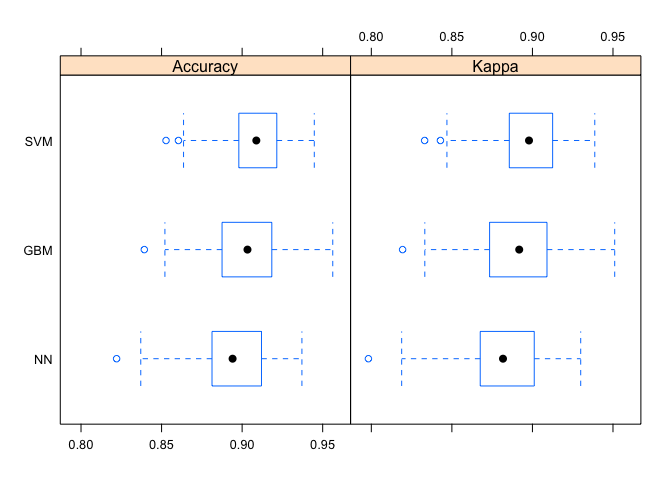

Supervised learning, classification, cross validation, variable selection
=========================================================================

Contributors: Gabriela Cohen Freue, W. Evan Durno, Jasleen Grewal  

## Learning objectives   
By the end of this tutorial, you should be able to    
- Filter gene expression data to remove uninformative features.  
- Further subselect a set of variables using a fixed information criteria, and know when it may not be required/possible to do so.  
- Understand the concept of held-out test set, training set, and validation set.  
- Select a suitable classifier (based on size of training dataset) and train a model with the input training data.   
- Get predicted labels for a validation set, from the trained classifier model.  
- Understand the utility of cross validation in selecting an optimal model  
  - Be able to identify at what part of the supervised learning process CV should be used. 
  - Explain how cross validation is different from bootstrapping.   
- Assess the best selected model's performance on the held out test set.  
  - Recognize why we can't go back and reselect models after assessment on the held out test set.  
- Be able to distinguish between the following scenarios for using supervised machine learning, and enumerate metrics for assessing performance in each case:  
  - 2 class classification problem  
  - Multi-clas classification problem  
- Be able to define accuracy, precision, sensitivity, specificity, F1-score, Kappa score.  
- Replicate analysis in either MLInterface, GLMnet, CMA, or Caret (take home exercise, optional).   

# Introduction

In this Seminar we go over packages and codes for performing supervised learning and evaluation in R. In supervised learning, one is given a training data set with known response and covariates and our goal is to predict the response in a new test set for which we only know the covariates. A supervised learning process can be decomposed into the following steps:

*Step 1*: Data preprocessing. Before getting started with feature selection and training, we must make sure we have adjusted the data to account for any batch effects or biases from outliers.  

*Step 2*: Select Features. Before training a model, in many applications, it is usually important to perform a pre-filtering step in which one retains only the most informative features (e.g., genes) as candidate "biomarkers". The amount of features retained to select and train a model is up to the analyst and the methods used in the next steps. For example, some methods may be unfeasible or too slow to run with a large number of features.

*Step 3*: Select and train a classifier. Once the set of candidate markers have been selected, the next step is to select and train a model to predict the labels of a test data. We will also tune the parameters for each classifier using cross-validation.  

*Step 4*: Test. Finally, a model is chosen and used to predict labels of a test data.

## R packages

There are many packages for performing supervised learning in R, each of which may implement one or more algorithms. There have also been at least two major efforts to unify these libraries under a common framework to make them easier to use: `MLInterfaces` and `CMA`. Although these may be useful and save you a lot of time in your analysis, it is important that you understand what these packages are doing and what they are *not* doing. Thus, I will not use these packages in this Seminar but I encourage you to reproduce the analysis using at least one of them! (I recommend `CMA`).

Install the following packages from Bioconductor: `CMA` and `GEOquery`, and from CRAN: `ROCR`, `car`, `e1071` (for SVM), and `glmnet`.


```r
source('http://bioconductor.org/biocLite.R')
biocLite('GEOquery')
biocLite('CMA')

install.packages("ROCR")
```


```r
library(MASS)
library(reshape)
library(car)
library(limma)
library(e1071)
library(glmnet)
library(ROCR)
library(CMA)
library(lattice)
library(class)
library(RCurl)
options('download.file.method'='curl')
library(GEOquery)
```

## Data Set

This seminar is based on a dataset that comes from a paper by [Smeets et al. 2010](http://www.ncbi.nlm.nih.gov/geo/query/acc.cgi?acc=GSE23177), who studied Affymetrix expression profiles from primary breast tumors. Smeets group was interested in whether tumors which had spread to lymph nodes (LN positive, generally a bad sign) have different gene expression profiles than LN negative tumors. If so, a gene expression signature can be use to predict tumor class. 

Their data set contains 24236 genes on 116 samples. The status of the lymph node is known for each sample, with 59 LN positive and 57 LN negative. Samples were divided into two parts: 96 samples (48 LN positive and 48 LN negative) were used as a "training" set and 20 samples (11 LN positive and 9 LN negative) were used as a "test" set.  There is also a quantitative measure, "LnRatio", the fraction of affected lymph nodes, presumably reflecting "how bad" the LnStatus is. Thus, we can use this dataset to illustrate classification and regularization methods! This seminar will focus on the first task, i.e., classification. In the past, Paul selected this dataset to illustrate the challenges of supervised learning tasks!

In the paper, the authors trained a support vector machine classifier to distinguish between LN positive and LN negative tumors (i.e., classification), and evaluated the results using ROC curves. After some optimization, they got an area under the ROC curve (AUC) of 0.66 on the training set and 0.65 on the test data. This is better than chance, but still not very convincing results about the relevance of the derived molecular signature (random chance would give an AUC of 0.5; perfect classification would give an AUC of 1.0).

### Data Preparation

First, let's retrieve our datasets from GEO with `getGEO` from `GEOquery` package. Warning: this may take several minutes! So to avoid re-downloading in the future, save the data once you get it into a good shape.    

```r
if(file.exists("class_LNstatus.Rdata")) { # if previously downloaded
  load("class_LNstatus.Rdata")
} else { # if downloading for the first time
  # takes a several mins!; returns a list
  datgeo <- getGEO('GSE23177', GSEMatrix = TRUE) 
  dat <- datgeo[[1]]   #Note that dat is an ExpressionSets
  
  str(pData(dat), max.level = 0)
  
  # extract only those variables of interest 
  pData(dat) <-
    subset(pData(dat),
           select = c("characteristics_ch1.2",
                      "characteristics_ch1.3","characteristics_ch1"))
  names(pData(dat))<-c("LnStatus", "LnRatio", "Set")

  #Note: LNRatio will not be used in this Seminar. However, you can use it to try some of the regularization techniques learned in class
  
  # split the ExpressionSet into training and test sets. 
  train.es <- dat[, dat$Set == "patient type: training set"]
  test.es <- dat[ , dat$Set != "patient type: training set"]

  #Re-label factor
  pData(train.es)$LnStatus <-
      recode(pData(train.es)$LnStatus, "levels(pData(train.es)$LnStatus)[1]='neg'; else='pos'", levels = c('neg', 'pos'))

  pData(test.es)$LnStatus <-
      recode(pData(test.es)$LnStatus, "levels(pData(test.es)$LnStatus)[1]='neg'; else='pos'",
             levels = c('neg', 'pos'))

  # create data matrices with expression values (probesets in rows). Some of the functions we will use do not take ExpressionSets as objects
  trainDat <- exprs(train.es)
  testDat <- exprs(test.es)

  # Redefine the quantitative variable LnRatio to make it a numeric variable.
  ntrain <- dim(pData(train.es))[1]
  ntest <- dim(pData(test.es))[1]
  
  pData(train.es)$LnRatio <- as.numeric(unlist(strsplit(as.vector(unlist(pData(train.es)$LnRatio)), ":", fixed = TRUE))[(1:ntrain)*2])
  pData(test.es)$LnRatio <- as.numeric(unlist(strsplit(as.vector(unlist(pData(test.es)$LnRatio)), ":", fixed = TRUE))[(1:ntest)*2])

  # save the data to avoid future re-downloading
  save(dat,trainDat,testDat,train.es,test.es, file = "class_LNstatus.Rdata")
}
```

Now, we can do some exploratory analysis of the data before trying some classification methods.


```r
# undestand your data for classification
table(pData(train.es)$LnStatus)
```

```
## 
## neg pos 
##  48  48
```

```r
table(pData(test.es)$LnStatus)
```

```
## 
## neg pos 
##   9  11
```

```r
# understand the continuous response
tapply(pData(train.es)$LnRatio,pData(train.es)$LnStatus,summary)
```

```
## $neg
##    Min. 1st Qu.  Median    Mean 3rd Qu.    Max. 
##       0       0       0       0       0       0 
## 
## $pos
##    Min. 1st Qu.  Median    Mean 3rd Qu.    Max. 
##  0.0400  0.0700  0.1100  0.1935  0.2275  0.9600
```

```r
tapply(pData(test.es)$LnRatio,pData(test.es)$LnStatus,summary)
```

```
## $neg
##    Min. 1st Qu.  Median    Mean 3rd Qu.    Max. 
##       0       0       0       0       0       0 
## 
## $pos
##    Min. 1st Qu.  Median    Mean 3rd Qu.    Max. 
##  0.0500  0.1800  0.5000  0.4573  0.6100  0.9400
```

```r
# look at the expression of 3 randomly picked genes in both training and test sets
set.seed(1234)
(getMe <- sample(1:nrow(train.es), size = 3)) ## [1]   2756 15082 14766
```

```
## [1]  2756 15082 14766
```

```r
# training data
trDat <- trainDat[getMe, ]
str(trDat)
```

```
##  num [1:3, 1:96] 7.19 9.17 8.38 7.13 9.38 ...
##  - attr(*, "dimnames")=List of 2
##   ..$ : chr [1:3] "201513_at" "223139_s_at" "222698_s_at"
##   ..$ : chr [1:96] "GSM570518" "GSM570519" "GSM570520" "GSM570521" ...
```

```r
trDat <- data.frame(LnStatus=pData(train.es)$LnStatus, Set=rep("train",nrow(pData(train.es))),t(trDat))
str(trDat)
```

```
## 'data.frame':	96 obs. of  5 variables:
##  $ LnStatus    : Factor w/ 2 levels "neg","pos": 1 1 2 1 1 2 1 1 2 1 ...
##  $ Set         : Factor w/ 1 level "train": 1 1 1 1 1 1 1 1 1 1 ...
##  $ X201513_at  : num  7.19 7.13 7.39 6.86 6.96 ...
##  $ X223139_s_at: num  9.17 9.38 9.03 9.55 9.5 ...
##  $ X222698_s_at: num  8.38 8.24 7.23 7.87 8.45 ...
```

```r
plotDat.train <- melt(trDat, id=c("LnStatus","Set"),variable_name="gene")
colnames(plotDat.train)[colnames(plotDat.train)=="value"]="gExp"

# test data
tDat <- testDat[getMe, ]
str(tDat)
```

```
##  num [1:3, 1:20] 6.05 9.15 7.55 6.87 8.95 ...
##  - attr(*, "dimnames")=List of 2
##   ..$ : chr [1:3] "201513_at" "223139_s_at" "222698_s_at"
##   ..$ : chr [1:20] "GSM570498" "GSM570499" "GSM570500" "GSM570501" ...
```

```r
tDat <- data.frame(LnStatus=pData(test.es)$LnStatus,Set=rep("test",nrow(pData(test.es))), t(tDat))
str(tDat)
```

```
## 'data.frame':	20 obs. of  5 variables:
##  $ LnStatus    : Factor w/ 2 levels "neg","pos": 1 1 1 1 1 1 1 1 1 2 ...
##  $ Set         : Factor w/ 1 level "test": 1 1 1 1 1 1 1 1 1 1 ...
##  $ X201513_at  : num  6.05 6.87 6.71 8 6.54 ...
##  $ X223139_s_at: num  9.15 8.95 9.09 9.81 9.2 ...
##  $ X222698_s_at: num  7.55 8.34 8.32 7.33 8.14 ...
```

```r
plotDat.test <- melt(tDat, id=c("LnStatus","Set"),variable_name="gene")
colnames(plotDat.test)[colnames(plotDat.test)=="value"]="gExp"

plotDat <- rbind(plotDat.train,plotDat.test)

# plot 3 randomly picked genes in both training and test sets
stripplot(gExp ~ LnStatus | gene+Set, plotDat,
                       grid = TRUE,
                       group = LnStatus, auto.key = TRUE,
                       jitter.data = TRUE)
```

<!-- -->

# Classification

The prediction of a discrete response is usually refer to as *classification*. A response taking values over a finite set of labels is essentially the same thing as a factor. We will use the dataset from Smeets et al. to find the *best-trained* classifier and use it to predict the `LnStatus` of the 20 samples in the test set, i.e., classify those as "lymph node positive" or "negative".

## Data preprocessing  
We should check to ensure there are no missing values in our data.  


```r
sum(is.na(trainDat))
```

```
## [1] 0
```

```r
sum(is.na(testDat))
```

```
## [1] 0
```
Here we see there are no missing values in our dataset, so we don't have to worry about that.  

Other pre-processing operations that can be done are:  
- centering, scaling, normalizing    
- imputing missing data  
- transforming individual features (like boolean measurements)  

When you are working with expression data, you may also need to use some normalization methods to ensure your variables are comparable across all your samples. For example, when working with count data, it is advised to log transformed and quantile-normalize your data, so that your samples have similar distributions.    

## Feature and Model Selection

We will now identify the best set of features that we will use to train the model using a cross-validation. Thus, I will divide the training set into 6 folds (the authors used 10 folds). We also want the proportion of positive and negative examples in each split to be approximately the same as for the full data set (i.e., stratified 6-fold CV with 8 positive and 8 negative samples within each fold). For each round of cross-validation, we use one fold as the test data and the rest of the data as training to select features and train different classifier.

### Cross-validation

Although it makes sense to proceed as described above, many methods are available and many constants within methods need to be selected in these steps. Thus, a *cross-validation* is usually required to *evaluate* how well different trained models work and select the *best* model to proceed. Note that although you may only want to select among different choices available in Step 2, the cross-validation needs to start in Step 1. Why? The results of the cross-validation will be over-optimistic and biased if the samples in the test sets of the cross-validation (i.e., left-out folds) were used to *select* the most promising features in Step 1!! For example, if the performance of a complex model is (artificially) good, you may not penalize regression coefficients enough in Step 2, and may yield to a poor performance in Step 3. 

In many studies, in the absence of a test set, cross-validation is used to estimate performance. In those cases, a *nested cross-validation* is required! The inner cross-validation will be used to select features and tune parameters, the outer cross-validation will be used to a selected test model.  

In this seminar, we will work with a dataset that has both a training and a test set. Thus, we will not do a nested cross-validation. However, keep it in mind for your project or future work!  

#### Making cross validation splits

This is not the only way to create splits of the training data to run a cross-validation. Note that if the samples can not be evenly divided into the nfolds you specified, then you need to complete the matrices below with NAs and call for entries different from NA at those folds.


```r
nfold <- 6

tabTrain <- table(train.es$LnStatus)

indlist <- sapply(names(tabTrain), function(z) which(train.es$LnStatus == z), simplify = FALSE)

set.seed(1234)

#Each row contains 8 pos and 8 negative samples. 

fold.pos <- matrix(sample(indlist[["pos"]]),nrow=nfold)
fold.neg <- matrix(sample(indlist[["neg"]]),nrow=nfold)
```

*Note*: with `CMA` you can use the command `GenerateLearningsets` to split the training data into folds. However, it does not show you how the data was split. Thus, you either use CMA for all or you write your own script. 


```r
splits <- GenerateLearningsets(y = train.es$LnStatus, method="CV", fold=6, strat= TRUE)
```

### Loop for feature selection and modeling

To illustrate how to select a model, I will use the top-50 genes selected by `limma` (within each fold). Note that this number is very arbitrary and other options may make more sense like using a p-value threshold or testing different options with this CV. For this example, I'm using only the top-50 genes as methods like LDA and Logit can not be run on more features than samples. However, other methods like kNN or SVM will do well with more features. 

In this example, I will compare 7 different models: kNN for k={1,5,10,15}, LDA, Logit, SVM. Feel free to add other methods to the list!


```r
#Define here the constants that you will not evaluate. For example, I will use the top-50 limma genes

ngenes <- 50
nmethod <- 7 #number of methods you plan to compare. 

#Define here an output objects to store results
pr.err <- matrix(-1, nfold,nmethod, dimnames=list(paste0("Fold",1:nfold),c("1NN","5NN","10NN", "15NN","LDA","Logit","SVM")))

for(i in 1:nfold){

  #Test Fold for the i-th step
  testdat.fold<-trainDat[,c(fold.pos[i,],fold.neg[i,])]
  #I will create a factor of classes for the test set of the i_th fold
  testclass.fold<-train.es$LnStatus[c(fold.pos[i,],fold.neg[i,])]
  
    
  #The rest of the samples are the training set for the i-th step
  traindat.fold<-trainDat[,-c(fold.pos[i,],fold.neg[i,])]
  trainclass.fold<-train.es$LnStatus[-c(fold.pos[i,],fold.neg[i,])]

  #Step 1: feature selection (do you remember limma?). 

  # Note that a different set of genes will be selected for each fold! you can then compare how consistent these sets were.

  limma.dat<-as.data.frame(traindat.fold)
  desMat <- model.matrix(~ trainclass.fold, limma.dat) #design matrix
  trainFit <- lmFit(limma.dat, desMat)
  eBtrainFit <- eBayes(trainFit)
  
  # top-50 limma genes
  top.fold <- topTable(eBtrainFit, coef = which(colnames(coef(trainFit)) != "(Intercept)"),
                       n = ngenes,sort.by="P")
  
  #Retain the top-50 limma genes from the train and test sets
  traindat.fold <- traindat.fold[rownames(top.fold),]
  testdat.fold <-  testdat.fold[rownames(top.fold),]

  
  #STEP 2: select a classifier
  #Set a counter for the method tested
  l <- 0

  #kNN classifiers
  for(kk in c(1,5,10,15)) {
    #every time you get inside this loop, the l counter gets redefined (i.e., 1, 2, etc for         method 1, method 2, etc)
    l <- l+1

    #knn needs samples in rows
    yhat.knn <- knn(train=t(traindat.fold), test=t(testdat.fold), cl=trainclass.fold,
                    k = kk)
    #Store the prediction error for each kk within this fold
    pr.err[i,l]<- mean(testclass.fold != yhat.knn)
                          } #end of kNN loop

  #LDA method. Note that you can change the prior parameter to reflect a different proportion of case and control samples. The default is to use the class proportions from the training set.
  
  m.lda <- lda(x=t(traindat.fold), group=trainclass.fold, prior=c(.5, .5))
  yhat.lda <- predict(m.lda, newdata=t(testdat.fold))$class
  pr.err[i,"LDA"] <-mean(testclass.fold != yhat.lda)
   
  #Logit
  glm.dat <- data.frame(t(traindat.fold), group=trainclass.fold)
  
  # 50 factors still will cause optimization warnings  
  # Try without warning suppression to see 
  # To further reduce parameters, regularized regression can be used 
  # To use regularized regression uncomment lines followed by "uncomment for regularized regression" 
  suppressWarnings( m.log <- glm(group ~ ., data=glm.dat,family=binomial) ) 
  
  # uncomment for regularized regression 
  # m.log <- glmnet( t(traindat.fold) , trainclass.fold ,family="binomial") 

  pr.log <- predict(m.log,newdata=data.frame(t(testdat.fold)),type="response")
  
  # uncomment for regularized regression 
  # pr.log <- predict(m.log,newdata=data.frame(t(testdat.fold)),type="response",newx=t(testdat.fold)) 
  
  pr.cl <- rep(0,length(testclass.fold))
  pr.cl[pr.log > 1/2] <- "pos"
  pr.cl[pr.log <= 1/2] <- "neg"

  pr.cl <- factor(pr.cl)
  pr.err[i,"Logit"] <- mean( pr.cl != testclass.fold )

  #SVM
  m.svm <- svm(x=t(traindat.fold), y=trainclass.fold, cost=1, type="C-classification", 
               kernel="linear")
  pr.svm <- predict(m.svm,newdata=t(testdat.fold)) 
   
  pr.err[i,"SVM"] <- mean( pr.svm != testclass.fold )
  } #end of CV loop
```

### Error Rates
Now you can get the average prediction error for all methods. Note that the prediction errors are high! not too much hope for the real test run!


```r
cv.err <- colMeans(pr.err)

# mean - 1 sd (sd of the 6 error rates)
ls <- cv.err - apply(pr.err, 2, sd)

# mean + 1 sd (sd of the 6 error rates)
us <- cv.err + apply(pr.err, 2, sd)

# plot the results
plot(1:nmethod, cv.err, ylim=c(0, 1), xlim=c(1, (nmethod+.5)),type='n', 
axes=FALSE, xlab='Classifier', ylab='Error rate',main="6-fold CV Error")

for(j in 1:ncol(pr.err)) 
   points(jitter(rep(j, 6), factor=2), jitter(pr.err[,j]), cex=0.8, pch='X', col='gray')

for(i in 1:nmethod)
   lines(c(i, i), c(ls[i], us[i]), lwd=2, col='gray')
points(1:nmethod, ls, pch=19, col='red')
points(1:nmethod, us, pch=19, col='green')
points(1:nmethod, cv.err, pch=19, cex=1.5, col='black')
axis(2, ylab='Error rate')
axis(1, 1:nmethod, colnames(pr.err))

box()
```

<!-- -->

### Results of the CV
According to these results, LDA and 10NN may be the better classifier to try in the test data. However, remember that this CV results depend on the first split of the data we did. Thus, we need to repeat this CV

**Exercise 1**: perform 100 runs of this CV before selecting a model to test! Add at least one rule to select the list of models, e.g., use genes with a p-val threshold < cutoff.

**Exercise 2**: Use AUC as a criteria to select a model based on the training data! Tip: extract the predicted probabilities from each method and use the roc function in ROCR.

## Testing the selected model

Now that we decided on which method we are going to use to classify samples in the test set, we need to train the model using the *FULL* training set and then classify samples of the test set. I will use the 10NN model.


```r
yhat.knn <- knn(train=t(trainDat), test=t(testDat), cl=train.es$LnStatus,
                     k = 10)
#Store the prediction error for each kk within this fold
pr.errTest<- mean(test.es$LnStatus != yhat.knn)
pr.errTest
```

```
## [1] 0.45
```

What does the prediction error mean?  
In this instance, we have evaluated how often the prediction matched the actual lymph node status, against the total number of cases. This is the **accuracy** metric.  

Not good! In real practice, you should not keep trying until we get a good result! In fact, you must use cross-validation on the training dataset to evaluate different parameters and classifiers, and only evaluate the generalizability of the *best* model on the test set.  
However, in this seminar, I encourage you to try different options **as an exercise** and to see how much the results can change.  

## CMA
Many steps of the CV defined above can be easily done with CMA. For example, Step 1 in the loop above can also be done using 'CMA' with the function 'GeneSelection', which selects the most informative features (e.g., gene) to build a classifier within each of the splits generated by 'GenerateLearningsets'. Some learning algorithms do better if you only give them "useful" features. 


```r
featureScores<-GeneSelection(X=t(trainDat), y=train.es$LnStatus, learningsets=splits, method="limma")
```

```
## GeneSelection: iteration 1 
## GeneSelection: iteration 2 
## GeneSelection: iteration 3 
## GeneSelection: iteration 4 
## GeneSelection: iteration 5 
## GeneSelection: iteration 6
```

```r
#Compare list of selected genes using:
toplist(featureScores)
```

```
## top  10  genes for iteration  1 
##  
##    index importance
## 1   9265   25.37579
## 2   6936   24.85400
## 3  21592   24.55555
## 4   1702   23.99424
## 5  21919   23.98643
## 6  19932   21.29348
## 7   6938   20.60153
## 8  22524   20.18380
## 9  17847   18.77700
## 10  6937   18.74738
```

```r
#We can aggregate the results across the 6 splits.

seliter<-numeric()
for(i in 1:nfold) seliter<-c(seliter, toplist(featureScores, iter=i, top = 10, show=FALSE)$index)
(sort(table(seliter), dec=T)) # summarize
```

```
## seliter
##  1702  9265  6936 21919   808  6938 18958 19932 20571 21592 23206 23567 
##     6     5     3     3     2     2     2     2     2     2     2     2 
##    18   377   767  2690  3386  6937  7182  7183  8447 10254 10292 13581 
##     1     1     1     1     1     1     1     1     1     1     1     1 
## 13620 13802 15997 16094 16165 17847 18668 19152 19265 19402 19526 19577 
##     1     1     1     1     1     1     1     1     1     1     1     1 
## 21533 22524 22943 
##     1     1     1
```

```r
# Choose the 20 probes which are chosen most commonly in the 6 splits
bestprobes<-as.numeric(names(sort(table(seliter), dec=T)))[1:20]

# examine the annotations. I just selected a few columns from the fData of the eSet.
(fData(dat)[bestprobes,c("Gene Symbol", "Gene Title", "ENTREZ_GENE_ID", "Representative Public ID" )])
```

```
##                                         Gene Symbol
## 1569472_s_at                        TTC3 /// TTC3P1
## 212384_at    ATP6V1G2-DDX39B /// DDX39B /// SNORD84
## 208661_s_at                         TTC3 /// TTC3P1
## 237746_at                                          
## 1556088_at                                    RPAIN
## 208663_s_at                         TTC3 /// TTC3P1
## 228510_at                                     ATAT1
## 230609_at                                    CLINT1
## 232740_at                                MCM3AP-AS1
## 236196_at                                    ZNF326
## 242562_at                                          
## 243751_at                                      CHD2
## 1552283_s_at                   ZDHHC11 /// ZDHHC11B
## 1554182_at                        TRIM73 /// TRIM74
## 1555920_at                                     CBX3
## 201440_at                                     DDX23
## 202182_at                                     KAT2A
## 208662_s_at                         TTC3 /// TTC3P1
## 208920_at                                       SRI
## 208921_s_at                                     SRI
##                                                                                                                                  Gene Title
## 1569472_s_at                                           tetratricopeptide repeat domain 3 /// tetratricopeptide repeat domain 3 pseudogene 1
## 212384_at    ATP6V1G2-DDX39B readthrough (NMD candidate) /// DEAD (Asp-Glu-Ala-Asp) box polypeptide 39B /// small nucleolar RNA, C/D box 84
## 208661_s_at                                            tetratricopeptide repeat domain 3 /// tetratricopeptide repeat domain 3 pseudogene 1
## 237746_at                                                                                                                                  
## 1556088_at                                                                                                          RPA interacting protein
## 208663_s_at                                            tetratricopeptide repeat domain 3 /// tetratricopeptide repeat domain 3 pseudogene 1
## 228510_at                                                                                                 alpha tubulin acetyltransferase 1
## 230609_at                                                                                                             clathrin interactor 1
## 232740_at                                                                                                            MCM3AP antisense RNA 1
## 236196_at                                                                                                           zinc finger protein 326
## 242562_at                                                                                                                                  
## 243751_at                                                                                       chromodomain helicase DNA binding protein 2
## 1552283_s_at                                                 zinc finger, DHHC-type containing 11 /// zinc finger, DHHC-type containing 11B
## 1554182_at                                                                tripartite motif containing 73 /// tripartite motif containing 74
## 1555920_at                                                                                                              chromobox homolog 3
## 201440_at                                                                                         DEAD (Asp-Glu-Ala-Asp) box polypeptide 23
## 202182_at                                                                                                    K(lysine) acetyltransferase 2A
## 208662_s_at                                            tetratricopeptide repeat domain 3 /// tetratricopeptide repeat domain 3 pseudogene 1
## 208920_at                                                                                                                            sorcin
## 208921_s_at                                                                                                                          sorcin
##                             ENTREZ_GENE_ID Representative Public ID
## 1569472_s_at               7267 /// 286495                 BC026260
## 212384_at    7919 /// 692199 /// 100532737                 AI282485
## 208661_s_at                7267 /// 286495                 AW510696
## 237746_at                                                  AI168187
## 1556088_at                           84268                 AK098491
## 208663_s_at                7267 /// 286495                 AI652848
## 228510_at                            79969                 AL566825
## 230609_at                             9685                 BF510429
## 232740_at                           114044                 BC002458
## 236196_at                           284695                 BF939032
## 242562_at                                                  AW772288
## 243751_at                             1106                 AA709148
## 1552283_s_at              79844 /// 653082                NM_024786
## 1554182_at               375593 /// 378108                 BC033871
## 1555920_at                           11335                 BU683892
## 201440_at                             9416                NM_004818
## 202182_at                             2648                NM_021078
## 208662_s_at                7267 /// 286495                 AI885338
## 208920_at                             6717                 AV752215
## 208921_s_at                           6717                   L12387
```

This looks promising since I get TTC3 and at least a couple of other genes that show up on Table 3 of the paper.

Similarly, you can use CMA to train and test a classifier within each CV fold (learningsets). However, there are things you can not do within CMA or that CMA is not doing right. For example, CMA can not do a full nested cross-validation. Additionally, it is not trivial to train the selected in the full dataset and then test it in the test set. CMA is more designed for CV. Thus, it is good to know how to do this things by hand as well.

Paul solved this problem in the following way: he made a `learningsets` object that has just one "split" defined by the samples in the training set. 


```r
m<-matrix(which(dat$Set=="patient type: training set"), 1)

full.learningset<-new("learningsets", learnmatrix=m, method="my own", ntrain=96, iter=1)

fullFeatureScores<-GeneSelection(X=t(exprs(dat)), learningsets= full.learningset, y=dat$LnStatus, method="t.test")
```

```
## GeneSelection: iteration 1
```

```r
testclassif<-classification(X=t(exprs(dat)), y=dat$LnStatus, learningsets= full.learningset, genesel=fullFeatureScores, nbgene = 100, classifier =pknnCMA, k=5)
```

```
## iteration 1
```

```r
#Evaluation:
tres<-testclassif[[1]]
ftable(tres)
```

```
## number of missclassifications:  11 
## missclassification rate:  0.55 
## sensitivity: 0.545 
## specificity: 0.333 
##     predicted
## true 0 1
##    0 3 6
##    1 5 6
```

```r
roc(tres)
```

<!-- -->

Note: his optimized classifier did terribly as well.


## Multiclass learning   
You won't always have a binary learning problem, where you are classifying a sample into 1 of 2 classes. Sometimes we might want to train a classifier a classifier with more than two classes.  
Here we will use the *caret* and *mlbench* packages for classification on a multi-class problem.  

```r
library(caret)
```

```
## Loading required package: ggplot2
```

```
## 
## Attaching package: 'caret'
```

```
## The following objects are masked from 'package:CMA':
## 
##     best, rfe
```

```r
library(mlbench)
```

We will be using the Soybean dataset, where our prediction is for the different problems associated with soybean crops. Our dataset has 683 samples, and 35 features being measured for each sample.  
Our categories are 19.  

```r
cv_folds <- trainControl(method="cv", number=5)
data(Soybean)
unique(Soybean$Class)
```

```
##  [1] diaporthe-stem-canker       charcoal-rot               
##  [3] rhizoctonia-root-rot        phytophthora-rot           
##  [5] brown-stem-rot              powdery-mildew             
##  [7] downy-mildew                brown-spot                 
##  [9] bacterial-blight            bacterial-pustule          
## [11] purple-seed-stain           anthracnose                
## [13] phyllosticta-leaf-spot      alternarialeaf-spot        
## [15] frog-eye-leaf-spot          diaporthe-pod-&-stem-blight
## [17] cyst-nematode               2-4-d-injury               
## [19] herbicide-injury           
## 19 Levels: 2-4-d-injury alternarialeaf-spot ... rhizoctonia-root-rot
```

```r
summary(Soybean)
```

```
##                  Class          date     plant.stand  precip      temp    
##  brown-spot         : 92   5      :149   0   :354    0   : 74   0   : 80  
##  alternarialeaf-spot: 91   4      :131   1   :293    1   :112   1   :374  
##  frog-eye-leaf-spot : 91   3      :118   NA's: 36    2   :459   2   :199  
##  phytophthora-rot   : 88   2      : 93               NA's: 38   NA's: 30  
##  anthracnose        : 44   6      : 90                                    
##  brown-stem-rot     : 44   (Other):101                                    
##  (Other)            :233   NA's   :  1                                    
##    hail     crop.hist  area.dam    sever     seed.tmt     germ    
##  0   :435   0   : 65   0   :123   0   :195   0   :305   0   :165  
##  1   :127   1   :165   1   :227   1   :322   1   :222   1   :213  
##  NA's:121   2   :219   2   :145   2   : 45   2   : 35   2   :193  
##             3   :218   3   :187   NA's:121   NA's:121   NA's:112  
##             NA's: 16   NA's:  1                                   
##                                                                   
##                                                                   
##  plant.growth leaves  leaf.halo  leaf.marg  leaf.size  leaf.shread
##  0   :441     0: 77   0   :221   0   :357   0   : 51   0   :487   
##  1   :226     1:606   1   : 36   1   : 21   1   :327   1   : 96   
##  NA's: 16             2   :342   2   :221   2   :221   NA's:100   
##                       NA's: 84   NA's: 84   NA's: 84              
##                                                                   
##                                                                   
##                                                                   
##  leaf.malf  leaf.mild    stem     lodging    stem.cankers canker.lesion
##  0   :554   0   :535   0   :296   0   :520   0   :379     0   :320     
##  1   : 45   1   : 20   1   :371   1   : 42   1   : 39     1   : 83     
##  NA's: 84   2   : 20   NA's: 16   NA's:121   2   : 36     2   :177     
##             NA's:108                         3   :191     3   : 65     
##                                              NA's: 38     NA's: 38     
##                                                                        
##                                                                        
##  fruiting.bodies ext.decay  mycelium   int.discolor sclerotia  fruit.pods
##  0   :473        0   :497   0   :639   0   :581     0   :625   0   :407  
##  1   :104        1   :135   1   :  6   1   : 44     1   : 20   1   :130  
##  NA's:106        2   : 13   NA's: 38   2   : 20     NA's: 38   2   : 14  
##                  NA's: 38              NA's: 38                3   : 48  
##                                                                NA's: 84  
##                                                                          
##                                                                          
##  fruit.spots   seed     mold.growth seed.discolor seed.size  shriveling
##  0   :345    0   :476   0   :524    0   :513      0   :532   0   :539  
##  1   : 75    1   :115   1   : 67    1   : 64      1   : 59   1   : 38  
##  2   : 57    NA's: 92   NA's: 92    NA's:106      NA's: 92   NA's:106  
##  4   :100                                                              
##  NA's:106                                                              
##                                                                        
##                                                                        
##   roots    
##  0   :551  
##  1   : 86  
##  2   : 15  
##  NA's: 31  
##            
##            
## 
```

Let us pre-process our data.  

```r
#Remove rows (samples) with missing values  
soybean_x = Soybean[rowSums(is.na(Soybean)) == 0,]
#Then remove columns (features) with missing values  
soybean_x = soybean_x[,colSums(is.na(soybean_x)) == 0]
dim(soybean_x)
```

```
## [1] 562  36
```

We are left with 562 samples and 35 attributes. The first column, `Class`, describes the categories. We will refactor this column since we have removed certain columns (and possibly some of the 19 classes)  


```r
soybean_x$Class = (as.factor(as.character(soybean_x$Class)))
unique(soybean_x$Class)
```

```
##  [1] diaporthe-stem-canker  charcoal-rot           rhizoctonia-root-rot  
##  [4] phytophthora-rot       brown-stem-rot         powdery-mildew        
##  [7] downy-mildew           brown-spot             bacterial-blight      
## [10] bacterial-pustule      purple-seed-stain      anthracnose           
## [13] phyllosticta-leaf-spot alternarialeaf-spot    frog-eye-leaf-spot    
## 15 Levels: alternarialeaf-spot anthracnose ... rhizoctonia-root-rot
```
Now we have 15 classes!  

In this instance, we don't have an external test set for evaluation, so we will be assessing the performance on a held-out test set. First, we create the held-out test set.  
*Note* that we are holding out this test set from our training data, and then performing data-splitting for validation within our training subset. In practise, like we did earlier, you would want to loop this multiple times with holding out a test set and training on the remainder dataset (using cross validation or bootstrapping to estimate your model accuracy on the test set).  


```r
trainIndex <- createDataPartition(soybean_x$Class, p = .8,  list = FALSE,  times = 1)
soyTrain <- soybean_x[ trainIndex,]
soyTest  <- soybean_x[-trainIndex,]
```

**Cross validation results**  
We set up our cross-validation folds. Note we can also choose the option 'cv' or 'LOOCV' instead of 'repeatedcv'.    
With 'repeatedcv', we don't have to manually set up the multiple loops we did when we were using CMA.  

```r
#Prepare resamling method for Cross-Validation folds  
set.seed(7)
cv_control = trainControl(method="repeatedcv", number=5, repeats=10, classProbs=FALSE) #summaryFunction=mnLogLoss)
modelSvm_cv <- train(Class~., data=soyTrain, method="svmRadial", metric="accuracy", trControl=cv_control, verbose=FALSE)
```

```
## Loading required package: kernlab
```

```
## 
## Attaching package: 'kernlab'
```

```
## The following object is masked from 'package:ggplot2':
## 
##     alpha
```

```
## Warning in .local(x, ...): Variable(s) `' constant. Cannot scale data.
```

```
## Warning in train.default(x, y, weights = w, ...): The metric "accuracy" was
## not in the result set. Accuracy will be used instead.
```

```
## Warning in .local(x, ...): Variable(s) `' constant. Cannot scale data.

## Warning in .local(x, ...): Variable(s) `' constant. Cannot scale data.

## Warning in .local(x, ...): Variable(s) `' constant. Cannot scale data.

## Warning in .local(x, ...): Variable(s) `' constant. Cannot scale data.

## Warning in .local(x, ...): Variable(s) `' constant. Cannot scale data.

## Warning in .local(x, ...): Variable(s) `' constant. Cannot scale data.

## Warning in .local(x, ...): Variable(s) `' constant. Cannot scale data.

## Warning in .local(x, ...): Variable(s) `' constant. Cannot scale data.

## Warning in .local(x, ...): Variable(s) `' constant. Cannot scale data.

## Warning in .local(x, ...): Variable(s) `' constant. Cannot scale data.

## Warning in .local(x, ...): Variable(s) `' constant. Cannot scale data.

## Warning in .local(x, ...): Variable(s) `' constant. Cannot scale data.

## Warning in .local(x, ...): Variable(s) `' constant. Cannot scale data.

## Warning in .local(x, ...): Variable(s) `' constant. Cannot scale data.

## Warning in .local(x, ...): Variable(s) `' constant. Cannot scale data.

## Warning in .local(x, ...): Variable(s) `' constant. Cannot scale data.

## Warning in .local(x, ...): Variable(s) `' constant. Cannot scale data.

## Warning in .local(x, ...): Variable(s) `' constant. Cannot scale data.

## Warning in .local(x, ...): Variable(s) `' constant. Cannot scale data.

## Warning in .local(x, ...): Variable(s) `' constant. Cannot scale data.

## Warning in .local(x, ...): Variable(s) `' constant. Cannot scale data.

## Warning in .local(x, ...): Variable(s) `' constant. Cannot scale data.

## Warning in .local(x, ...): Variable(s) `' constant. Cannot scale data.

## Warning in .local(x, ...): Variable(s) `' constant. Cannot scale data.

## Warning in .local(x, ...): Variable(s) `' constant. Cannot scale data.

## Warning in .local(x, ...): Variable(s) `' constant. Cannot scale data.

## Warning in .local(x, ...): Variable(s) `' constant. Cannot scale data.

## Warning in .local(x, ...): Variable(s) `' constant. Cannot scale data.

## Warning in .local(x, ...): Variable(s) `' constant. Cannot scale data.

## Warning in .local(x, ...): Variable(s) `' constant. Cannot scale data.

## Warning in .local(x, ...): Variable(s) `' constant. Cannot scale data.

## Warning in .local(x, ...): Variable(s) `' constant. Cannot scale data.

## Warning in .local(x, ...): Variable(s) `' constant. Cannot scale data.

## Warning in .local(x, ...): Variable(s) `' constant. Cannot scale data.

## Warning in .local(x, ...): Variable(s) `' constant. Cannot scale data.

## Warning in .local(x, ...): Variable(s) `' constant. Cannot scale data.

## Warning in .local(x, ...): Variable(s) `' constant. Cannot scale data.

## Warning in .local(x, ...): Variable(s) `' constant. Cannot scale data.

## Warning in .local(x, ...): Variable(s) `' constant. Cannot scale data.

## Warning in .local(x, ...): Variable(s) `' constant. Cannot scale data.

## Warning in .local(x, ...): Variable(s) `' constant. Cannot scale data.

## Warning in .local(x, ...): Variable(s) `' constant. Cannot scale data.

## Warning in .local(x, ...): Variable(s) `' constant. Cannot scale data.

## Warning in .local(x, ...): Variable(s) `' constant. Cannot scale data.

## Warning in .local(x, ...): Variable(s) `' constant. Cannot scale data.

## Warning in .local(x, ...): Variable(s) `' constant. Cannot scale data.

## Warning in .local(x, ...): Variable(s) `' constant. Cannot scale data.

## Warning in .local(x, ...): Variable(s) `' constant. Cannot scale data.

## Warning in .local(x, ...): Variable(s) `' constant. Cannot scale data.

## Warning in .local(x, ...): Variable(s) `' constant. Cannot scale data.

## Warning in .local(x, ...): Variable(s) `' constant. Cannot scale data.

## Warning in .local(x, ...): Variable(s) `' constant. Cannot scale data.

## Warning in .local(x, ...): Variable(s) `' constant. Cannot scale data.

## Warning in .local(x, ...): Variable(s) `' constant. Cannot scale data.

## Warning in .local(x, ...): Variable(s) `' constant. Cannot scale data.

## Warning in .local(x, ...): Variable(s) `' constant. Cannot scale data.

## Warning in .local(x, ...): Variable(s) `' constant. Cannot scale data.

## Warning in .local(x, ...): Variable(s) `' constant. Cannot scale data.

## Warning in .local(x, ...): Variable(s) `' constant. Cannot scale data.

## Warning in .local(x, ...): Variable(s) `' constant. Cannot scale data.

## Warning in .local(x, ...): Variable(s) `' constant. Cannot scale data.

## Warning in .local(x, ...): Variable(s) `' constant. Cannot scale data.

## Warning in .local(x, ...): Variable(s) `' constant. Cannot scale data.

## Warning in .local(x, ...): Variable(s) `' constant. Cannot scale data.

## Warning in .local(x, ...): Variable(s) `' constant. Cannot scale data.

## Warning in .local(x, ...): Variable(s) `' constant. Cannot scale data.

## Warning in .local(x, ...): Variable(s) `' constant. Cannot scale data.

## Warning in .local(x, ...): Variable(s) `' constant. Cannot scale data.

## Warning in .local(x, ...): Variable(s) `' constant. Cannot scale data.

## Warning in .local(x, ...): Variable(s) `' constant. Cannot scale data.

## Warning in .local(x, ...): Variable(s) `' constant. Cannot scale data.

## Warning in .local(x, ...): Variable(s) `' constant. Cannot scale data.

## Warning in .local(x, ...): Variable(s) `' constant. Cannot scale data.

## Warning in .local(x, ...): Variable(s) `' constant. Cannot scale data.

## Warning in .local(x, ...): Variable(s) `' constant. Cannot scale data.

## Warning in .local(x, ...): Variable(s) `' constant. Cannot scale data.

## Warning in .local(x, ...): Variable(s) `' constant. Cannot scale data.

## Warning in .local(x, ...): Variable(s) `' constant. Cannot scale data.

## Warning in .local(x, ...): Variable(s) `' constant. Cannot scale data.

## Warning in .local(x, ...): Variable(s) `' constant. Cannot scale data.

## Warning in .local(x, ...): Variable(s) `' constant. Cannot scale data.

## Warning in .local(x, ...): Variable(s) `' constant. Cannot scale data.

## Warning in .local(x, ...): Variable(s) `' constant. Cannot scale data.

## Warning in .local(x, ...): Variable(s) `' constant. Cannot scale data.

## Warning in .local(x, ...): Variable(s) `' constant. Cannot scale data.

## Warning in .local(x, ...): Variable(s) `' constant. Cannot scale data.

## Warning in .local(x, ...): Variable(s) `' constant. Cannot scale data.

## Warning in .local(x, ...): Variable(s) `' constant. Cannot scale data.

## Warning in .local(x, ...): Variable(s) `' constant. Cannot scale data.

## Warning in .local(x, ...): Variable(s) `' constant. Cannot scale data.

## Warning in .local(x, ...): Variable(s) `' constant. Cannot scale data.

## Warning in .local(x, ...): Variable(s) `' constant. Cannot scale data.

## Warning in .local(x, ...): Variable(s) `' constant. Cannot scale data.

## Warning in .local(x, ...): Variable(s) `' constant. Cannot scale data.

## Warning in .local(x, ...): Variable(s) `' constant. Cannot scale data.

## Warning in .local(x, ...): Variable(s) `' constant. Cannot scale data.

## Warning in .local(x, ...): Variable(s) `' constant. Cannot scale data.

## Warning in .local(x, ...): Variable(s) `' constant. Cannot scale data.

## Warning in .local(x, ...): Variable(s) `' constant. Cannot scale data.

## Warning in .local(x, ...): Variable(s) `' constant. Cannot scale data.

## Warning in .local(x, ...): Variable(s) `' constant. Cannot scale data.

## Warning in .local(x, ...): Variable(s) `' constant. Cannot scale data.

## Warning in .local(x, ...): Variable(s) `' constant. Cannot scale data.

## Warning in .local(x, ...): Variable(s) `' constant. Cannot scale data.

## Warning in .local(x, ...): Variable(s) `' constant. Cannot scale data.

## Warning in .local(x, ...): Variable(s) `' constant. Cannot scale data.

## Warning in .local(x, ...): Variable(s) `' constant. Cannot scale data.

## Warning in .local(x, ...): Variable(s) `' constant. Cannot scale data.

## Warning in .local(x, ...): Variable(s) `' constant. Cannot scale data.

## Warning in .local(x, ...): Variable(s) `' constant. Cannot scale data.

## Warning in .local(x, ...): Variable(s) `' constant. Cannot scale data.

## Warning in .local(x, ...): Variable(s) `' constant. Cannot scale data.

## Warning in .local(x, ...): Variable(s) `' constant. Cannot scale data.

## Warning in .local(x, ...): Variable(s) `' constant. Cannot scale data.

## Warning in .local(x, ...): Variable(s) `' constant. Cannot scale data.

## Warning in .local(x, ...): Variable(s) `' constant. Cannot scale data.

## Warning in .local(x, ...): Variable(s) `' constant. Cannot scale data.

## Warning in .local(x, ...): Variable(s) `' constant. Cannot scale data.

## Warning in .local(x, ...): Variable(s) `' constant. Cannot scale data.

## Warning in .local(x, ...): Variable(s) `' constant. Cannot scale data.

## Warning in .local(x, ...): Variable(s) `' constant. Cannot scale data.

## Warning in .local(x, ...): Variable(s) `' constant. Cannot scale data.

## Warning in .local(x, ...): Variable(s) `' constant. Cannot scale data.

## Warning in .local(x, ...): Variable(s) `' constant. Cannot scale data.

## Warning in .local(x, ...): Variable(s) `' constant. Cannot scale data.

## Warning in .local(x, ...): Variable(s) `' constant. Cannot scale data.

## Warning in .local(x, ...): Variable(s) `' constant. Cannot scale data.

## Warning in .local(x, ...): Variable(s) `' constant. Cannot scale data.

## Warning in .local(x, ...): Variable(s) `' constant. Cannot scale data.

## Warning in .local(x, ...): Variable(s) `' constant. Cannot scale data.

## Warning in .local(x, ...): Variable(s) `' constant. Cannot scale data.

## Warning in .local(x, ...): Variable(s) `' constant. Cannot scale data.

## Warning in .local(x, ...): Variable(s) `' constant. Cannot scale data.

## Warning in .local(x, ...): Variable(s) `' constant. Cannot scale data.

## Warning in .local(x, ...): Variable(s) `' constant. Cannot scale data.

## Warning in .local(x, ...): Variable(s) `' constant. Cannot scale data.

## Warning in .local(x, ...): Variable(s) `' constant. Cannot scale data.

## Warning in .local(x, ...): Variable(s) `' constant. Cannot scale data.

## Warning in .local(x, ...): Variable(s) `' constant. Cannot scale data.

## Warning in .local(x, ...): Variable(s) `' constant. Cannot scale data.

## Warning in .local(x, ...): Variable(s) `' constant. Cannot scale data.

## Warning in .local(x, ...): Variable(s) `' constant. Cannot scale data.

## Warning in .local(x, ...): Variable(s) `' constant. Cannot scale data.

## Warning in .local(x, ...): Variable(s) `' constant. Cannot scale data.

## Warning in .local(x, ...): Variable(s) `' constant. Cannot scale data.

## Warning in .local(x, ...): Variable(s) `' constant. Cannot scale data.

## Warning in .local(x, ...): Variable(s) `' constant. Cannot scale data.

## Warning in .local(x, ...): Variable(s) `' constant. Cannot scale data.

## Warning in .local(x, ...): Variable(s) `' constant. Cannot scale data.

## Warning in .local(x, ...): Variable(s) `' constant. Cannot scale data.

## Warning in .local(x, ...): Variable(s) `' constant. Cannot scale data.
```

```r
# display results
print(modelSvm_cv)
```

```
## Support Vector Machines with Radial Basis Function Kernel 
## 
## 452 samples
##  35 predictor
##  15 classes: 'alternarialeaf-spot', 'anthracnose', 'bacterial-blight', 'bacterial-pustule', 'brown-spot', 'brown-stem-rot', 'charcoal-rot', 'diaporthe-stem-canker', 'downy-mildew', 'frog-eye-leaf-spot', 'phyllosticta-leaf-spot', 'phytophthora-rot', 'powdery-mildew', 'purple-seed-stain', 'rhizoctonia-root-rot' 
## 
## No pre-processing
## Resampling: Cross-Validated (5 fold, repeated 10 times) 
## Summary of sample sizes: 363, 363, 362, 359, 361, 361, ... 
## Resampling results across tuning parameters:
## 
##   C     Accuracy   Kappa    
##   0.25  0.7115090  0.6699955
##   0.50  0.8835917  0.8692267
##   1.00  0.9215239  0.9121989
## 
## Tuning parameter 'sigma' was held constant at a value of 0.06545455
## Accuracy was used to select the optimal model using  the largest value.
## The final values used for the model were sigma = 0.06545455 and C = 1.
```

```r
y_pred_cv = predict(modelSvm_cv, soyTest[,2:36])
```

When fitting this model with SVM, you might get the following request: '1 package is needed for this model and is not installed. (kernlab). Would you like to try to install it now?'. Enter *yes*.

We can also use bootstrap re-sampling instead of cross-validation folds. This means we take random samples from the dataset (with re-selection), against which to evaluate our model. This gives us an idea about hte variance of the model itself.  

Bootstrapping is different from cross validation in that the latter splits the entire dataset into folds *without re-selection*.It is a robust method to estimate the accuracy of our model.  

**Bootstrapped results**  

```r
#Prepare resamling method for Bootstrapping
set.seed(7)
cv_control = trainControl(method="boot", number=100, classProbs=FALSE) 
modelSvm_boot <- train(Class~., data=soyTrain, method="svmRadial", metric="accuracy", trControl=cv_control, verbose=FALSE)
```

```
## Warning in .local(x, ...): Variable(s) `' constant. Cannot scale data.
```

```
## Warning in train.default(x, y, weights = w, ...): The metric "accuracy" was
## not in the result set. Accuracy will be used instead.
```

```
## Warning in .local(x, ...): Variable(s) `' constant. Cannot scale data.

## Warning in .local(x, ...): Variable(s) `' constant. Cannot scale data.

## Warning in .local(x, ...): Variable(s) `' constant. Cannot scale data.

## Warning in .local(x, ...): Variable(s) `' constant. Cannot scale data.

## Warning in .local(x, ...): Variable(s) `' constant. Cannot scale data.

## Warning in .local(x, ...): Variable(s) `' constant. Cannot scale data.

## Warning in .local(x, ...): Variable(s) `' constant. Cannot scale data.

## Warning in .local(x, ...): Variable(s) `' constant. Cannot scale data.

## Warning in .local(x, ...): Variable(s) `' constant. Cannot scale data.

## Warning in .local(x, ...): Variable(s) `' constant. Cannot scale data.

## Warning in .local(x, ...): Variable(s) `' constant. Cannot scale data.

## Warning in .local(x, ...): Variable(s) `' constant. Cannot scale data.

## Warning in .local(x, ...): Variable(s) `' constant. Cannot scale data.

## Warning in .local(x, ...): Variable(s) `' constant. Cannot scale data.

## Warning in .local(x, ...): Variable(s) `' constant. Cannot scale data.

## Warning in .local(x, ...): Variable(s) `' constant. Cannot scale data.

## Warning in .local(x, ...): Variable(s) `' constant. Cannot scale data.

## Warning in .local(x, ...): Variable(s) `' constant. Cannot scale data.

## Warning in .local(x, ...): Variable(s) `' constant. Cannot scale data.

## Warning in .local(x, ...): Variable(s) `' constant. Cannot scale data.

## Warning in .local(x, ...): Variable(s) `' constant. Cannot scale data.

## Warning in .local(x, ...): Variable(s) `' constant. Cannot scale data.

## Warning in .local(x, ...): Variable(s) `' constant. Cannot scale data.

## Warning in .local(x, ...): Variable(s) `' constant. Cannot scale data.

## Warning in .local(x, ...): Variable(s) `' constant. Cannot scale data.

## Warning in .local(x, ...): Variable(s) `' constant. Cannot scale data.

## Warning in .local(x, ...): Variable(s) `' constant. Cannot scale data.

## Warning in .local(x, ...): Variable(s) `' constant. Cannot scale data.

## Warning in .local(x, ...): Variable(s) `' constant. Cannot scale data.

## Warning in .local(x, ...): Variable(s) `' constant. Cannot scale data.

## Warning in .local(x, ...): Variable(s) `' constant. Cannot scale data.

## Warning in .local(x, ...): Variable(s) `' constant. Cannot scale data.

## Warning in .local(x, ...): Variable(s) `' constant. Cannot scale data.

## Warning in .local(x, ...): Variable(s) `' constant. Cannot scale data.

## Warning in .local(x, ...): Variable(s) `' constant. Cannot scale data.

## Warning in .local(x, ...): Variable(s) `' constant. Cannot scale data.

## Warning in .local(x, ...): Variable(s) `' constant. Cannot scale data.

## Warning in .local(x, ...): Variable(s) `' constant. Cannot scale data.

## Warning in .local(x, ...): Variable(s) `' constant. Cannot scale data.

## Warning in .local(x, ...): Variable(s) `' constant. Cannot scale data.

## Warning in .local(x, ...): Variable(s) `' constant. Cannot scale data.

## Warning in .local(x, ...): Variable(s) `' constant. Cannot scale data.

## Warning in .local(x, ...): Variable(s) `' constant. Cannot scale data.

## Warning in .local(x, ...): Variable(s) `' constant. Cannot scale data.

## Warning in .local(x, ...): Variable(s) `' constant. Cannot scale data.

## Warning in .local(x, ...): Variable(s) `' constant. Cannot scale data.

## Warning in .local(x, ...): Variable(s) `' constant. Cannot scale data.

## Warning in .local(x, ...): Variable(s) `' constant. Cannot scale data.

## Warning in .local(x, ...): Variable(s) `' constant. Cannot scale data.

## Warning in .local(x, ...): Variable(s) `' constant. Cannot scale data.

## Warning in .local(x, ...): Variable(s) `' constant. Cannot scale data.

## Warning in .local(x, ...): Variable(s) `' constant. Cannot scale data.

## Warning in .local(x, ...): Variable(s) `' constant. Cannot scale data.

## Warning in .local(x, ...): Variable(s) `' constant. Cannot scale data.

## Warning in .local(x, ...): Variable(s) `' constant. Cannot scale data.

## Warning in .local(x, ...): Variable(s) `' constant. Cannot scale data.

## Warning in .local(x, ...): Variable(s) `' constant. Cannot scale data.

## Warning in .local(x, ...): Variable(s) `' constant. Cannot scale data.

## Warning in .local(x, ...): Variable(s) `' constant. Cannot scale data.

## Warning in .local(x, ...): Variable(s) `' constant. Cannot scale data.

## Warning in .local(x, ...): Variable(s) `' constant. Cannot scale data.

## Warning in .local(x, ...): Variable(s) `' constant. Cannot scale data.

## Warning in .local(x, ...): Variable(s) `' constant. Cannot scale data.

## Warning in .local(x, ...): Variable(s) `' constant. Cannot scale data.

## Warning in .local(x, ...): Variable(s) `' constant. Cannot scale data.

## Warning in .local(x, ...): Variable(s) `' constant. Cannot scale data.

## Warning in .local(x, ...): Variable(s) `' constant. Cannot scale data.

## Warning in .local(x, ...): Variable(s) `' constant. Cannot scale data.

## Warning in .local(x, ...): Variable(s) `' constant. Cannot scale data.

## Warning in .local(x, ...): Variable(s) `' constant. Cannot scale data.

## Warning in .local(x, ...): Variable(s) `' constant. Cannot scale data.

## Warning in .local(x, ...): Variable(s) `' constant. Cannot scale data.

## Warning in .local(x, ...): Variable(s) `' constant. Cannot scale data.

## Warning in .local(x, ...): Variable(s) `' constant. Cannot scale data.

## Warning in .local(x, ...): Variable(s) `' constant. Cannot scale data.

## Warning in .local(x, ...): Variable(s) `' constant. Cannot scale data.

## Warning in .local(x, ...): Variable(s) `' constant. Cannot scale data.

## Warning in .local(x, ...): Variable(s) `' constant. Cannot scale data.

## Warning in .local(x, ...): Variable(s) `' constant. Cannot scale data.

## Warning in .local(x, ...): Variable(s) `' constant. Cannot scale data.

## Warning in .local(x, ...): Variable(s) `' constant. Cannot scale data.

## Warning in .local(x, ...): Variable(s) `' constant. Cannot scale data.

## Warning in .local(x, ...): Variable(s) `' constant. Cannot scale data.

## Warning in .local(x, ...): Variable(s) `' constant. Cannot scale data.

## Warning in .local(x, ...): Variable(s) `' constant. Cannot scale data.

## Warning in .local(x, ...): Variable(s) `' constant. Cannot scale data.

## Warning in .local(x, ...): Variable(s) `' constant. Cannot scale data.

## Warning in .local(x, ...): Variable(s) `' constant. Cannot scale data.

## Warning in .local(x, ...): Variable(s) `' constant. Cannot scale data.

## Warning in .local(x, ...): Variable(s) `' constant. Cannot scale data.

## Warning in .local(x, ...): Variable(s) `' constant. Cannot scale data.

## Warning in .local(x, ...): Variable(s) `' constant. Cannot scale data.

## Warning in .local(x, ...): Variable(s) `' constant. Cannot scale data.

## Warning in .local(x, ...): Variable(s) `' constant. Cannot scale data.

## Warning in .local(x, ...): Variable(s) `' constant. Cannot scale data.

## Warning in .local(x, ...): Variable(s) `' constant. Cannot scale data.

## Warning in .local(x, ...): Variable(s) `' constant. Cannot scale data.

## Warning in .local(x, ...): Variable(s) `' constant. Cannot scale data.

## Warning in .local(x, ...): Variable(s) `' constant. Cannot scale data.

## Warning in .local(x, ...): Variable(s) `' constant. Cannot scale data.

## Warning in .local(x, ...): Variable(s) `' constant. Cannot scale data.

## Warning in .local(x, ...): Variable(s) `' constant. Cannot scale data.

## Warning in .local(x, ...): Variable(s) `' constant. Cannot scale data.

## Warning in .local(x, ...): Variable(s) `' constant. Cannot scale data.

## Warning in .local(x, ...): Variable(s) `' constant. Cannot scale data.

## Warning in .local(x, ...): Variable(s) `' constant. Cannot scale data.

## Warning in .local(x, ...): Variable(s) `' constant. Cannot scale data.

## Warning in .local(x, ...): Variable(s) `' constant. Cannot scale data.

## Warning in .local(x, ...): Variable(s) `' constant. Cannot scale data.

## Warning in .local(x, ...): Variable(s) `' constant. Cannot scale data.

## Warning in .local(x, ...): Variable(s) `' constant. Cannot scale data.

## Warning in .local(x, ...): Variable(s) `' constant. Cannot scale data.

## Warning in .local(x, ...): Variable(s) `' constant. Cannot scale data.

## Warning in .local(x, ...): Variable(s) `' constant. Cannot scale data.

## Warning in .local(x, ...): Variable(s) `' constant. Cannot scale data.

## Warning in .local(x, ...): Variable(s) `' constant. Cannot scale data.

## Warning in .local(x, ...): Variable(s) `' constant. Cannot scale data.

## Warning in .local(x, ...): Variable(s) `' constant. Cannot scale data.

## Warning in .local(x, ...): Variable(s) `' constant. Cannot scale data.

## Warning in .local(x, ...): Variable(s) `' constant. Cannot scale data.

## Warning in .local(x, ...): Variable(s) `' constant. Cannot scale data.

## Warning in .local(x, ...): Variable(s) `' constant. Cannot scale data.

## Warning in .local(x, ...): Variable(s) `' constant. Cannot scale data.

## Warning in .local(x, ...): Variable(s) `' constant. Cannot scale data.

## Warning in .local(x, ...): Variable(s) `' constant. Cannot scale data.

## Warning in .local(x, ...): Variable(s) `' constant. Cannot scale data.

## Warning in .local(x, ...): Variable(s) `' constant. Cannot scale data.

## Warning in .local(x, ...): Variable(s) `' constant. Cannot scale data.

## Warning in .local(x, ...): Variable(s) `' constant. Cannot scale data.

## Warning in .local(x, ...): Variable(s) `' constant. Cannot scale data.

## Warning in .local(x, ...): Variable(s) `' constant. Cannot scale data.

## Warning in .local(x, ...): Variable(s) `' constant. Cannot scale data.

## Warning in .local(x, ...): Variable(s) `' constant. Cannot scale data.

## Warning in .local(x, ...): Variable(s) `' constant. Cannot scale data.

## Warning in .local(x, ...): Variable(s) `' constant. Cannot scale data.

## Warning in .local(x, ...): Variable(s) `' constant. Cannot scale data.

## Warning in .local(x, ...): Variable(s) `' constant. Cannot scale data.

## Warning in .local(x, ...): Variable(s) `' constant. Cannot scale data.

## Warning in .local(x, ...): Variable(s) `' constant. Cannot scale data.

## Warning in .local(x, ...): Variable(s) `' constant. Cannot scale data.

## Warning in .local(x, ...): Variable(s) `' constant. Cannot scale data.

## Warning in .local(x, ...): Variable(s) `' constant. Cannot scale data.

## Warning in .local(x, ...): Variable(s) `' constant. Cannot scale data.

## Warning in .local(x, ...): Variable(s) `' constant. Cannot scale data.

## Warning in .local(x, ...): Variable(s) `' constant. Cannot scale data.

## Warning in .local(x, ...): Variable(s) `' constant. Cannot scale data.

## Warning in .local(x, ...): Variable(s) `' constant. Cannot scale data.

## Warning in .local(x, ...): Variable(s) `' constant. Cannot scale data.

## Warning in .local(x, ...): Variable(s) `' constant. Cannot scale data.

## Warning in .local(x, ...): Variable(s) `' constant. Cannot scale data.

## Warning in .local(x, ...): Variable(s) `' constant. Cannot scale data.

## Warning in .local(x, ...): Variable(s) `' constant. Cannot scale data.

## Warning in .local(x, ...): Variable(s) `' constant. Cannot scale data.

## Warning in .local(x, ...): Variable(s) `' constant. Cannot scale data.

## Warning in .local(x, ...): Variable(s) `' constant. Cannot scale data.

## Warning in .local(x, ...): Variable(s) `' constant. Cannot scale data.

## Warning in .local(x, ...): Variable(s) `' constant. Cannot scale data.

## Warning in .local(x, ...): Variable(s) `' constant. Cannot scale data.

## Warning in .local(x, ...): Variable(s) `' constant. Cannot scale data.

## Warning in .local(x, ...): Variable(s) `' constant. Cannot scale data.

## Warning in .local(x, ...): Variable(s) `' constant. Cannot scale data.

## Warning in .local(x, ...): Variable(s) `' constant. Cannot scale data.

## Warning in .local(x, ...): Variable(s) `' constant. Cannot scale data.

## Warning in .local(x, ...): Variable(s) `' constant. Cannot scale data.

## Warning in .local(x, ...): Variable(s) `' constant. Cannot scale data.

## Warning in .local(x, ...): Variable(s) `' constant. Cannot scale data.

## Warning in .local(x, ...): Variable(s) `' constant. Cannot scale data.

## Warning in .local(x, ...): Variable(s) `' constant. Cannot scale data.

## Warning in .local(x, ...): Variable(s) `' constant. Cannot scale data.

## Warning in .local(x, ...): Variable(s) `' constant. Cannot scale data.

## Warning in .local(x, ...): Variable(s) `' constant. Cannot scale data.

## Warning in .local(x, ...): Variable(s) `' constant. Cannot scale data.

## Warning in .local(x, ...): Variable(s) `' constant. Cannot scale data.

## Warning in .local(x, ...): Variable(s) `' constant. Cannot scale data.

## Warning in .local(x, ...): Variable(s) `' constant. Cannot scale data.

## Warning in .local(x, ...): Variable(s) `' constant. Cannot scale data.

## Warning in .local(x, ...): Variable(s) `' constant. Cannot scale data.

## Warning in .local(x, ...): Variable(s) `' constant. Cannot scale data.

## Warning in .local(x, ...): Variable(s) `' constant. Cannot scale data.

## Warning in .local(x, ...): Variable(s) `' constant. Cannot scale data.

## Warning in .local(x, ...): Variable(s) `' constant. Cannot scale data.

## Warning in .local(x, ...): Variable(s) `' constant. Cannot scale data.

## Warning in .local(x, ...): Variable(s) `' constant. Cannot scale data.

## Warning in .local(x, ...): Variable(s) `' constant. Cannot scale data.

## Warning in .local(x, ...): Variable(s) `' constant. Cannot scale data.

## Warning in .local(x, ...): Variable(s) `' constant. Cannot scale data.

## Warning in .local(x, ...): Variable(s) `' constant. Cannot scale data.

## Warning in .local(x, ...): Variable(s) `' constant. Cannot scale data.

## Warning in .local(x, ...): Variable(s) `' constant. Cannot scale data.

## Warning in .local(x, ...): Variable(s) `' constant. Cannot scale data.

## Warning in .local(x, ...): Variable(s) `' constant. Cannot scale data.

## Warning in .local(x, ...): Variable(s) `' constant. Cannot scale data.

## Warning in .local(x, ...): Variable(s) `' constant. Cannot scale data.

## Warning in .local(x, ...): Variable(s) `' constant. Cannot scale data.

## Warning in .local(x, ...): Variable(s) `' constant. Cannot scale data.

## Warning in .local(x, ...): Variable(s) `' constant. Cannot scale data.

## Warning in .local(x, ...): Variable(s) `' constant. Cannot scale data.

## Warning in .local(x, ...): Variable(s) `' constant. Cannot scale data.

## Warning in .local(x, ...): Variable(s) `' constant. Cannot scale data.

## Warning in .local(x, ...): Variable(s) `' constant. Cannot scale data.

## Warning in .local(x, ...): Variable(s) `' constant. Cannot scale data.

## Warning in .local(x, ...): Variable(s) `' constant. Cannot scale data.

## Warning in .local(x, ...): Variable(s) `' constant. Cannot scale data.

## Warning in .local(x, ...): Variable(s) `' constant. Cannot scale data.

## Warning in .local(x, ...): Variable(s) `' constant. Cannot scale data.

## Warning in .local(x, ...): Variable(s) `' constant. Cannot scale data.

## Warning in .local(x, ...): Variable(s) `' constant. Cannot scale data.

## Warning in .local(x, ...): Variable(s) `' constant. Cannot scale data.

## Warning in .local(x, ...): Variable(s) `' constant. Cannot scale data.

## Warning in .local(x, ...): Variable(s) `' constant. Cannot scale data.

## Warning in .local(x, ...): Variable(s) `' constant. Cannot scale data.

## Warning in .local(x, ...): Variable(s) `' constant. Cannot scale data.

## Warning in .local(x, ...): Variable(s) `' constant. Cannot scale data.

## Warning in .local(x, ...): Variable(s) `' constant. Cannot scale data.

## Warning in .local(x, ...): Variable(s) `' constant. Cannot scale data.

## Warning in .local(x, ...): Variable(s) `' constant. Cannot scale data.

## Warning in .local(x, ...): Variable(s) `' constant. Cannot scale data.

## Warning in .local(x, ...): Variable(s) `' constant. Cannot scale data.

## Warning in .local(x, ...): Variable(s) `' constant. Cannot scale data.

## Warning in .local(x, ...): Variable(s) `' constant. Cannot scale data.

## Warning in .local(x, ...): Variable(s) `' constant. Cannot scale data.

## Warning in .local(x, ...): Variable(s) `' constant. Cannot scale data.

## Warning in .local(x, ...): Variable(s) `' constant. Cannot scale data.

## Warning in .local(x, ...): Variable(s) `' constant. Cannot scale data.

## Warning in .local(x, ...): Variable(s) `' constant. Cannot scale data.

## Warning in .local(x, ...): Variable(s) `' constant. Cannot scale data.

## Warning in .local(x, ...): Variable(s) `' constant. Cannot scale data.

## Warning in .local(x, ...): Variable(s) `' constant. Cannot scale data.

## Warning in .local(x, ...): Variable(s) `' constant. Cannot scale data.

## Warning in .local(x, ...): Variable(s) `' constant. Cannot scale data.

## Warning in .local(x, ...): Variable(s) `' constant. Cannot scale data.

## Warning in .local(x, ...): Variable(s) `' constant. Cannot scale data.

## Warning in .local(x, ...): Variable(s) `' constant. Cannot scale data.

## Warning in .local(x, ...): Variable(s) `' constant. Cannot scale data.

## Warning in .local(x, ...): Variable(s) `' constant. Cannot scale data.

## Warning in .local(x, ...): Variable(s) `' constant. Cannot scale data.

## Warning in .local(x, ...): Variable(s) `' constant. Cannot scale data.

## Warning in .local(x, ...): Variable(s) `' constant. Cannot scale data.

## Warning in .local(x, ...): Variable(s) `' constant. Cannot scale data.

## Warning in .local(x, ...): Variable(s) `' constant. Cannot scale data.

## Warning in .local(x, ...): Variable(s) `' constant. Cannot scale data.

## Warning in .local(x, ...): Variable(s) `' constant. Cannot scale data.

## Warning in .local(x, ...): Variable(s) `' constant. Cannot scale data.

## Warning in .local(x, ...): Variable(s) `' constant. Cannot scale data.

## Warning in .local(x, ...): Variable(s) `' constant. Cannot scale data.

## Warning in .local(x, ...): Variable(s) `' constant. Cannot scale data.

## Warning in .local(x, ...): Variable(s) `' constant. Cannot scale data.

## Warning in .local(x, ...): Variable(s) `' constant. Cannot scale data.

## Warning in .local(x, ...): Variable(s) `' constant. Cannot scale data.

## Warning in .local(x, ...): Variable(s) `' constant. Cannot scale data.

## Warning in .local(x, ...): Variable(s) `' constant. Cannot scale data.

## Warning in .local(x, ...): Variable(s) `' constant. Cannot scale data.

## Warning in .local(x, ...): Variable(s) `' constant. Cannot scale data.

## Warning in .local(x, ...): Variable(s) `' constant. Cannot scale data.

## Warning in .local(x, ...): Variable(s) `' constant. Cannot scale data.

## Warning in .local(x, ...): Variable(s) `' constant. Cannot scale data.

## Warning in .local(x, ...): Variable(s) `' constant. Cannot scale data.

## Warning in .local(x, ...): Variable(s) `' constant. Cannot scale data.

## Warning in .local(x, ...): Variable(s) `' constant. Cannot scale data.

## Warning in .local(x, ...): Variable(s) `' constant. Cannot scale data.

## Warning in .local(x, ...): Variable(s) `' constant. Cannot scale data.

## Warning in .local(x, ...): Variable(s) `' constant. Cannot scale data.

## Warning in .local(x, ...): Variable(s) `' constant. Cannot scale data.

## Warning in .local(x, ...): Variable(s) `' constant. Cannot scale data.

## Warning in .local(x, ...): Variable(s) `' constant. Cannot scale data.

## Warning in .local(x, ...): Variable(s) `' constant. Cannot scale data.

## Warning in .local(x, ...): Variable(s) `' constant. Cannot scale data.

## Warning in .local(x, ...): Variable(s) `' constant. Cannot scale data.

## Warning in .local(x, ...): Variable(s) `' constant. Cannot scale data.

## Warning in .local(x, ...): Variable(s) `' constant. Cannot scale data.

## Warning in .local(x, ...): Variable(s) `' constant. Cannot scale data.

## Warning in .local(x, ...): Variable(s) `' constant. Cannot scale data.

## Warning in .local(x, ...): Variable(s) `' constant. Cannot scale data.

## Warning in .local(x, ...): Variable(s) `' constant. Cannot scale data.

## Warning in .local(x, ...): Variable(s) `' constant. Cannot scale data.

## Warning in .local(x, ...): Variable(s) `' constant. Cannot scale data.

## Warning in .local(x, ...): Variable(s) `' constant. Cannot scale data.

## Warning in .local(x, ...): Variable(s) `' constant. Cannot scale data.

## Warning in .local(x, ...): Variable(s) `' constant. Cannot scale data.

## Warning in .local(x, ...): Variable(s) `' constant. Cannot scale data.

## Warning in .local(x, ...): Variable(s) `' constant. Cannot scale data.

## Warning in .local(x, ...): Variable(s) `' constant. Cannot scale data.

## Warning in .local(x, ...): Variable(s) `' constant. Cannot scale data.

## Warning in .local(x, ...): Variable(s) `' constant. Cannot scale data.

## Warning in .local(x, ...): Variable(s) `' constant. Cannot scale data.

## Warning in .local(x, ...): Variable(s) `' constant. Cannot scale data.

## Warning in .local(x, ...): Variable(s) `' constant. Cannot scale data.

## Warning in .local(x, ...): Variable(s) `' constant. Cannot scale data.

## Warning in .local(x, ...): Variable(s) `' constant. Cannot scale data.

## Warning in .local(x, ...): Variable(s) `' constant. Cannot scale data.

## Warning in .local(x, ...): Variable(s) `' constant. Cannot scale data.

## Warning in .local(x, ...): Variable(s) `' constant. Cannot scale data.

## Warning in .local(x, ...): Variable(s) `' constant. Cannot scale data.

## Warning in .local(x, ...): Variable(s) `' constant. Cannot scale data.

## Warning in .local(x, ...): Variable(s) `' constant. Cannot scale data.

## Warning in .local(x, ...): Variable(s) `' constant. Cannot scale data.

## Warning in .local(x, ...): Variable(s) `' constant. Cannot scale data.

## Warning in .local(x, ...): Variable(s) `' constant. Cannot scale data.

## Warning in .local(x, ...): Variable(s) `' constant. Cannot scale data.

## Warning in .local(x, ...): Variable(s) `' constant. Cannot scale data.

## Warning in .local(x, ...): Variable(s) `' constant. Cannot scale data.
```

```r
# display results
print(modelSvm_boot)
```

```
## Support Vector Machines with Radial Basis Function Kernel 
## 
## 452 samples
##  35 predictor
##  15 classes: 'alternarialeaf-spot', 'anthracnose', 'bacterial-blight', 'bacterial-pustule', 'brown-spot', 'brown-stem-rot', 'charcoal-rot', 'diaporthe-stem-canker', 'downy-mildew', 'frog-eye-leaf-spot', 'phyllosticta-leaf-spot', 'phytophthora-rot', 'powdery-mildew', 'purple-seed-stain', 'rhizoctonia-root-rot' 
## 
## No pre-processing
## Resampling: Bootstrapped (100 reps) 
## Summary of sample sizes: 452, 452, 452, 452, 452, 452, ... 
## Resampling results across tuning parameters:
## 
##   C     Accuracy   Kappa    
##   0.25  0.7563090  0.7233943
##   0.50  0.8784943  0.8634693
##   1.00  0.9081084  0.8969882
## 
## Tuning parameter 'sigma' was held constant at a value of 0.07319149
## Accuracy was used to select the optimal model using  the largest value.
## The final values used for the model were sigma = 0.07319149 and C = 1.
```

```r
y_pred_boot = predict(modelSvm_boot, soyTest[,2:36])
```

*Fitting other models*  
We can consider other algorithmic approaches for classifiers too, as follows:  

```r
# train the GLM model
set.seed(7)
modelNN <- train(Class~., data=soyTrain, method="nnet", metric="accuracy", trControl=cv_control, verbose=FALSE)
```

```
## Loading required package: nnet
```

```
## Warning in train.default(x, y, weights = w, ...): The metric "accuracy" was
## not in the result set. Accuracy will be used instead.
```

```
## # weights:  95
## initial  value 1295.669603 
## iter  10 value 935.842212
## iter  20 value 800.459977
## iter  30 value 743.650005
## iter  40 value 694.354358
## iter  50 value 645.659515
## iter  60 value 610.950021
## iter  70 value 574.470417
## iter  80 value 562.042108
## iter  90 value 556.691424
## iter 100 value 552.798397
## final  value 552.798397 
## stopped after 100 iterations
## # weights:  255
## initial  value 1195.828102 
## iter  10 value 598.180986
## iter  20 value 408.636819
## iter  30 value 367.883809
## iter  40 value 336.161617
## iter  50 value 306.445425
## iter  60 value 293.337227
## iter  70 value 287.899047
## iter  80 value 285.117668
## iter  90 value 284.771728
## iter 100 value 284.746363
## final  value 284.746363 
## stopped after 100 iterations
## # weights:  415
## initial  value 1227.157478 
## iter  10 value 357.216379
## iter  20 value 154.187886
## iter  30 value 99.371920
## iter  40 value 73.059461
## iter  50 value 61.864169
## iter  60 value 43.190545
## iter  70 value 16.782085
## iter  80 value 10.958371
## iter  90 value 9.498911
## iter 100 value 9.268178
## final  value 9.268178 
## stopped after 100 iterations
## # weights:  95
## initial  value 1279.437366 
## iter  10 value 1033.763281
## iter  20 value 863.975309
## iter  30 value 785.105189
## iter  40 value 749.831994
## iter  50 value 737.114709
## iter  60 value 734.160328
## iter  70 value 728.517768
## iter  80 value 726.881548
## iter  90 value 726.778097
## iter 100 value 726.082619
## final  value 726.082619 
## stopped after 100 iterations
## # weights:  255
## initial  value 1392.081165 
## iter  10 value 639.285324
## iter  20 value 529.252066
## iter  30 value 479.570878
## iter  40 value 384.094594
## iter  50 value 333.622628
## iter  60 value 310.608559
## iter  70 value 297.494854
## iter  80 value 287.779884
## iter  90 value 283.061936
## iter 100 value 280.730040
## final  value 280.730040 
## stopped after 100 iterations
## # weights:  415
## initial  value 1254.859127 
## iter  10 value 461.259105
## iter  20 value 304.284826
## iter  30 value 238.530625
## iter  40 value 196.960957
## iter  50 value 177.800714
## iter  60 value 164.024953
## iter  70 value 155.308317
## iter  80 value 152.801104
## iter  90 value 151.640187
## iter 100 value 150.987291
## final  value 150.987291 
## stopped after 100 iterations
## # weights:  95
## initial  value 1337.402071 
## iter  10 value 864.190386
## iter  20 value 708.403633
## iter  30 value 647.710355
## iter  40 value 591.931347
## iter  50 value 541.849494
## iter  60 value 528.976414
## iter  70 value 527.982717
## iter  80 value 527.764470
## iter  90 value 527.409110
## iter 100 value 527.222956
## final  value 527.222956 
## stopped after 100 iterations
## # weights:  255
## initial  value 1180.737995 
## iter  10 value 649.605490
## iter  20 value 421.938959
## iter  30 value 335.361579
## iter  40 value 283.395163
## iter  50 value 263.100000
## iter  60 value 244.363289
## iter  70 value 236.168379
## iter  80 value 230.646386
## iter  90 value 228.596126
## iter 100 value 222.537656
## final  value 222.537656 
## stopped after 100 iterations
## # weights:  415
## initial  value 1349.895029 
## iter  10 value 699.166199
## iter  20 value 474.674670
## iter  30 value 410.145346
## iter  40 value 381.052431
## iter  50 value 324.482732
## iter  60 value 287.892818
## iter  70 value 256.535669
## iter  80 value 237.471481
## iter  90 value 227.010549
## iter 100 value 224.564181
## final  value 224.564181 
## stopped after 100 iterations
## # weights:  95
## initial  value 1262.907041 
## iter  10 value 1048.653406
## iter  20 value 895.561802
## iter  30 value 833.634016
## iter  40 value 781.416905
## iter  50 value 753.414331
## iter  60 value 736.475013
## iter  70 value 733.201070
## iter  80 value 732.547259
## iter  90 value 732.238727
## iter 100 value 732.148792
## final  value 732.148792 
## stopped after 100 iterations
## # weights:  255
## initial  value 1250.039202 
## iter  10 value 648.837291
## iter  20 value 448.899658
## iter  30 value 340.470048
## iter  40 value 267.428592
## iter  50 value 207.394458
## iter  60 value 175.553815
## iter  70 value 145.808782
## iter  80 value 132.320130
## iter  90 value 117.577020
## iter 100 value 110.743100
## final  value 110.743100 
## stopped after 100 iterations
## # weights:  415
## initial  value 1303.160600 
## iter  10 value 484.534151
## iter  20 value 155.555337
## iter  30 value 93.767689
## iter  40 value 57.656966
## iter  50 value 35.591344
## iter  60 value 29.100772
## iter  70 value 27.233596
## iter  80 value 24.979106
## iter  90 value 23.357549
## iter 100 value 19.055380
## final  value 19.055380 
## stopped after 100 iterations
## # weights:  95
## initial  value 1254.481183 
## iter  10 value 1016.718657
## iter  20 value 887.198982
## iter  30 value 852.174890
## iter  40 value 828.906585
## iter  50 value 812.969127
## iter  60 value 808.803255
## iter  70 value 804.942592
## iter  80 value 800.911699
## iter  90 value 799.444892
## iter 100 value 799.179206
## final  value 799.179206 
## stopped after 100 iterations
## # weights:  255
## initial  value 1330.396992 
## iter  10 value 958.429588
## iter  20 value 590.781475
## iter  30 value 497.070848
## iter  40 value 436.780274
## iter  50 value 401.115846
## iter  60 value 376.459049
## iter  70 value 364.496745
## iter  80 value 349.981597
## iter  90 value 328.956216
## iter 100 value 319.510268
## final  value 319.510268 
## stopped after 100 iterations
## # weights:  415
## initial  value 1254.710752 
## iter  10 value 453.552449
## iter  20 value 251.223456
## iter  30 value 187.753551
## iter  40 value 171.401793
## iter  50 value 164.471037
## iter  60 value 158.148145
## iter  70 value 153.958643
## iter  80 value 151.152607
## iter  90 value 150.021545
## iter 100 value 149.541046
## final  value 149.541046 
## stopped after 100 iterations
## # weights:  95
## initial  value 1342.863862 
## iter  10 value 1122.052663
## iter  20 value 980.111617
## iter  30 value 926.581398
## iter  40 value 901.477952
## iter  50 value 888.803812
## iter  60 value 881.529423
## iter  70 value 868.611281
## iter  80 value 837.043838
## iter  90 value 797.923965
## iter 100 value 779.075629
## final  value 779.075629 
## stopped after 100 iterations
## # weights:  255
## initial  value 1392.715059 
## iter  10 value 900.362573
## iter  20 value 624.566571
## iter  30 value 597.666932
## iter  40 value 571.154465
## iter  50 value 483.333172
## iter  60 value 419.663485
## iter  70 value 378.320622
## iter  80 value 333.843666
## iter  90 value 293.199379
## iter 100 value 264.612205
## final  value 264.612205 
## stopped after 100 iterations
## # weights:  415
## initial  value 1244.373023 
## iter  10 value 323.798208
## iter  20 value 153.618274
## iter  30 value 98.466526
## iter  40 value 57.821663
## iter  50 value 29.466284
## iter  60 value 15.242094
## iter  70 value 12.233792
## iter  80 value 11.629999
## iter  90 value 11.251184
## iter 100 value 10.943740
## final  value 10.943740 
## stopped after 100 iterations
## # weights:  95
## initial  value 1253.360431 
## iter  10 value 955.597855
## iter  20 value 799.105365
## iter  30 value 759.480778
## iter  40 value 718.514496
## iter  50 value 696.535547
## iter  60 value 683.644403
## iter  70 value 677.083269
## iter  80 value 674.214684
## iter  90 value 672.057350
## iter 100 value 670.881023
## final  value 670.881023 
## stopped after 100 iterations
## # weights:  255
## initial  value 1383.397867 
## iter  10 value 1123.314918
## iter  20 value 858.510218
## iter  30 value 794.461148
## iter  40 value 745.222270
## iter  50 value 672.756927
## iter  60 value 538.991778
## iter  70 value 420.253885
## iter  80 value 338.344169
## iter  90 value 300.050124
## iter 100 value 255.106487
## final  value 255.106487 
## stopped after 100 iterations
## # weights:  415
## initial  value 1293.737151 
## iter  10 value 434.255270
## iter  20 value 213.430195
## iter  30 value 123.420093
## iter  40 value 63.102856
## iter  50 value 39.231937
## iter  60 value 27.551411
## iter  70 value 22.910551
## iter  80 value 19.215655
## iter  90 value 15.891906
## iter 100 value 7.670159
## final  value 7.670159 
## stopped after 100 iterations
## # weights:  95
## initial  value 1224.743943 
## iter  10 value 980.518345
## iter  20 value 902.403677
## iter  30 value 844.401839
## iter  40 value 826.317594
## iter  50 value 817.307269
## iter  60 value 810.948382
## iter  70 value 806.228425
## iter  80 value 805.540530
## iter  90 value 805.496659
## iter 100 value 805.494544
## final  value 805.494544 
## stopped after 100 iterations
## # weights:  255
## initial  value 1250.077285 
## iter  10 value 686.641316
## iter  20 value 483.502105
## iter  30 value 394.967249
## iter  40 value 370.359632
## iter  50 value 358.564108
## iter  60 value 350.537304
## iter  70 value 334.238437
## iter  80 value 327.396548
## iter  90 value 324.499250
## iter 100 value 321.842650
## final  value 321.842650 
## stopped after 100 iterations
## # weights:  415
## initial  value 1384.782203 
## iter  10 value 560.626877
## iter  20 value 322.991137
## iter  30 value 217.584202
## iter  40 value 184.653504
## iter  50 value 168.807833
## iter  60 value 163.447757
## iter  70 value 161.460131
## iter  80 value 159.201616
## iter  90 value 158.255300
## iter 100 value 157.979825
## final  value 157.979825 
## stopped after 100 iterations
## # weights:  95
## initial  value 1269.124362 
## iter  10 value 943.842391
## iter  20 value 831.846802
## iter  30 value 775.320607
## iter  40 value 738.545548
## iter  50 value 719.687740
## iter  60 value 708.746874
## iter  70 value 706.845466
## iter  80 value 706.581950
## iter  90 value 706.393411
## iter 100 value 706.243134
## final  value 706.243134 
## stopped after 100 iterations
## # weights:  255
## initial  value 1288.259491 
## iter  10 value 758.549538
## iter  20 value 617.076836
## iter  30 value 516.607391
## iter  40 value 433.798940
## iter  50 value 372.352115
## iter  60 value 342.838768
## iter  70 value 335.285525
## iter  80 value 334.161594
## iter  90 value 332.780036
## iter 100 value 331.996813
## final  value 331.996813 
## stopped after 100 iterations
## # weights:  415
## initial  value 1431.106184 
## iter  10 value 341.259619
## iter  20 value 128.491916
## iter  30 value 74.377743
## iter  40 value 43.761275
## iter  50 value 26.248091
## iter  60 value 10.398357
## iter  70 value 8.466241
## iter  80 value 7.923322
## iter  90 value 6.570462
## iter 100 value 4.947659
## final  value 4.947659 
## stopped after 100 iterations
## # weights:  95
## initial  value 1309.500722 
## iter  10 value 1112.746369
## iter  20 value 907.768366
## iter  30 value 797.335953
## iter  40 value 728.865867
## iter  50 value 692.274191
## iter  60 value 679.693751
## iter  70 value 669.294233
## iter  80 value 664.280236
## iter  90 value 660.961006
## iter 100 value 659.850801
## final  value 659.850801 
## stopped after 100 iterations
## # weights:  255
## initial  value 1301.234034 
## iter  10 value 768.334291
## iter  20 value 502.706290
## iter  30 value 380.246023
## iter  40 value 265.553248
## iter  50 value 213.558922
## iter  60 value 183.720197
## iter  70 value 162.864587
## iter  80 value 149.600871
## iter  90 value 142.482549
## iter 100 value 138.901173
## final  value 138.901173 
## stopped after 100 iterations
## # weights:  415
## initial  value 1276.909767 
## iter  10 value 410.218991
## iter  20 value 118.456897
## iter  30 value 52.669699
## iter  40 value 34.696180
## iter  50 value 26.529401
## iter  60 value 20.819500
## iter  70 value 16.122236
## iter  80 value 13.650755
## iter  90 value 12.400579
## iter 100 value 11.693816
## final  value 11.693816 
## stopped after 100 iterations
## # weights:  95
## initial  value 1254.696621 
## iter  10 value 935.116294
## iter  20 value 862.935020
## iter  30 value 840.788992
## iter  40 value 828.669152
## iter  50 value 812.979859
## iter  60 value 791.665580
## iter  70 value 776.088782
## iter  80 value 773.929225
## iter  90 value 772.109749
## iter 100 value 771.600724
## final  value 771.600724 
## stopped after 100 iterations
## # weights:  255
## initial  value 1309.765017 
## iter  10 value 656.632998
## iter  20 value 481.901787
## iter  30 value 424.923418
## iter  40 value 400.791273
## iter  50 value 378.414980
## iter  60 value 362.091846
## iter  70 value 349.378166
## iter  80 value 342.363439
## iter  90 value 337.758678
## iter 100 value 332.926537
## final  value 332.926537 
## stopped after 100 iterations
## # weights:  415
## initial  value 1362.679082 
## iter  10 value 739.511317
## iter  20 value 417.303345
## iter  30 value 306.222914
## iter  40 value 218.873704
## iter  50 value 185.691940
## iter  60 value 174.657513
## iter  70 value 167.621547
## iter  80 value 164.098327
## iter  90 value 160.712476
## iter 100 value 159.250029
## final  value 159.250029 
## stopped after 100 iterations
## # weights:  95
## initial  value 1209.848079 
## iter  10 value 990.907119
## iter  20 value 905.144156
## iter  30 value 811.536311
## iter  40 value 761.612315
## iter  50 value 711.134232
## iter  60 value 646.511754
## iter  70 value 627.222452
## iter  80 value 624.184654
## iter  90 value 616.594363
## iter 100 value 615.053545
## final  value 615.053545 
## stopped after 100 iterations
## # weights:  255
## initial  value 1291.212962 
## iter  10 value 642.239319
## iter  20 value 425.921235
## iter  30 value 373.249998
## iter  40 value 328.104960
## iter  50 value 286.747086
## iter  60 value 253.294974
## iter  70 value 223.233488
## iter  80 value 201.819372
## iter  90 value 176.139898
## iter 100 value 159.644044
## final  value 159.644044 
## stopped after 100 iterations
## # weights:  415
## initial  value 1255.333146 
## iter  10 value 379.707895
## iter  20 value 118.195733
## iter  30 value 55.576584
## iter  40 value 40.582388
## iter  50 value 32.968554
## iter  60 value 25.610335
## iter  70 value 22.694954
## iter  80 value 20.671273
## iter  90 value 18.920656
## iter 100 value 16.449173
## final  value 16.449173 
## stopped after 100 iterations
## # weights:  95
## initial  value 1323.036191 
## iter  10 value 1109.101221
## iter  20 value 1050.516508
## iter  30 value 878.303850
## iter  40 value 825.406200
## iter  50 value 808.547208
## iter  60 value 799.076118
## iter  70 value 791.522514
## iter  80 value 789.930888
## iter  90 value 788.750204
## iter 100 value 787.585132
## final  value 787.585132 
## stopped after 100 iterations
## # weights:  255
## initial  value 1344.706327 
## iter  10 value 675.113307
## iter  20 value 435.385606
## iter  30 value 345.491288
## iter  40 value 288.862788
## iter  50 value 235.090788
## iter  60 value 215.081311
## iter  70 value 197.855922
## iter  80 value 183.864449
## iter  90 value 176.397532
## iter 100 value 162.988559
## final  value 162.988559 
## stopped after 100 iterations
## # weights:  415
## initial  value 1295.150386 
## iter  10 value 457.170478
## iter  20 value 146.872477
## iter  30 value 78.838038
## iter  40 value 51.031051
## iter  50 value 28.204467
## iter  60 value 20.179729
## iter  70 value 18.132610
## iter  80 value 17.645901
## iter  90 value 17.576760
## iter 100 value 17.565626
## final  value 17.565626 
## stopped after 100 iterations
## # weights:  95
## initial  value 1282.746049 
## iter  10 value 992.750024
## iter  20 value 830.504230
## iter  30 value 812.999094
## iter  40 value 796.130493
## iter  50 value 782.679626
## iter  60 value 777.150003
## iter  70 value 775.600446
## iter  80 value 766.622251
## iter  90 value 755.767149
## iter 100 value 751.907149
## final  value 751.907149 
## stopped after 100 iterations
## # weights:  255
## initial  value 1268.640300 
## iter  10 value 711.857797
## iter  20 value 512.410080
## iter  30 value 431.240181
## iter  40 value 375.267621
## iter  50 value 350.153107
## iter  60 value 335.004308
## iter  70 value 321.901954
## iter  80 value 312.825138
## iter  90 value 308.416397
## iter 100 value 306.014149
## final  value 306.014149 
## stopped after 100 iterations
## # weights:  415
## initial  value 1296.205131 
## iter  10 value 523.505001
## iter  20 value 312.285471
## iter  30 value 239.518112
## iter  40 value 206.549812
## iter  50 value 190.390696
## iter  60 value 173.519350
## iter  70 value 166.849218
## iter  80 value 164.538246
## iter  90 value 162.977426
## iter 100 value 160.624982
## final  value 160.624982 
## stopped after 100 iterations
## # weights:  95
## initial  value 1257.118772 
## iter  10 value 1039.617792
## iter  20 value 830.131294
## iter  30 value 810.423866
## iter  40 value 787.935425
## iter  50 value 773.983291
## iter  60 value 770.404779
## iter  70 value 769.801611
## iter  80 value 769.594572
## iter  90 value 769.256808
## iter 100 value 768.821865
## final  value 768.821865 
## stopped after 100 iterations
## # weights:  255
## initial  value 1257.801013 
## iter  10 value 609.764086
## iter  20 value 294.019141
## iter  30 value 212.244810
## iter  40 value 176.144950
## iter  50 value 160.235453
## iter  60 value 147.787834
## iter  70 value 144.212711
## iter  80 value 141.102250
## iter  90 value 135.770730
## iter 100 value 133.920542
## final  value 133.920542 
## stopped after 100 iterations
## # weights:  415
## initial  value 1171.007558 
## iter  10 value 381.277577
## iter  20 value 172.096724
## iter  30 value 96.062066
## iter  40 value 66.322676
## iter  50 value 42.103870
## iter  60 value 32.461090
## iter  70 value 25.479926
## iter  80 value 18.273613
## iter  90 value 16.101574
## iter 100 value 15.439619
## final  value 15.439619 
## stopped after 100 iterations
## # weights:  95
## initial  value 1278.429380 
## iter  10 value 935.018563
## iter  20 value 806.908441
## iter  30 value 782.283062
## iter  40 value 761.139455
## iter  50 value 742.548572
## iter  60 value 730.644128
## iter  70 value 725.895751
## iter  80 value 723.926671
## iter  90 value 722.725786
## iter 100 value 722.396604
## final  value 722.396604 
## stopped after 100 iterations
## # weights:  255
## initial  value 1271.068695 
## iter  10 value 580.411729
## iter  20 value 384.656150
## iter  30 value 308.391380
## iter  40 value 226.174442
## iter  50 value 185.854636
## iter  60 value 158.929801
## iter  70 value 127.520370
## iter  80 value 101.138424
## iter  90 value 75.173988
## iter 100 value 56.361620
## final  value 56.361620 
## stopped after 100 iterations
## # weights:  415
## initial  value 1301.825428 
## iter  10 value 521.753485
## iter  20 value 140.676636
## iter  30 value 69.730226
## iter  40 value 45.098744
## iter  50 value 31.285608
## iter  60 value 22.748778
## iter  70 value 12.179493
## iter  80 value 8.802308
## iter  90 value 7.061580
## iter 100 value 6.291520
## final  value 6.291520 
## stopped after 100 iterations
## # weights:  95
## initial  value 1276.560455 
## iter  10 value 1144.233450
## iter  20 value 1089.199576
## iter  30 value 898.738567
## iter  40 value 844.964791
## iter  50 value 814.276610
## iter  60 value 796.356282
## iter  70 value 783.464990
## iter  80 value 768.150278
## iter  90 value 763.318490
## iter 100 value 757.687143
## final  value 757.687143 
## stopped after 100 iterations
## # weights:  255
## initial  value 1204.765061 
## iter  10 value 687.844754
## iter  20 value 510.320174
## iter  30 value 425.546676
## iter  40 value 373.702420
## iter  50 value 345.197822
## iter  60 value 335.639249
## iter  70 value 329.612238
## iter  80 value 324.792590
## iter  90 value 321.091036
## iter 100 value 319.620691
## final  value 319.620691 
## stopped after 100 iterations
## # weights:  415
## initial  value 1284.724358 
## iter  10 value 470.156486
## iter  20 value 242.254126
## iter  30 value 178.898595
## iter  40 value 159.074886
## iter  50 value 152.911769
## iter  60 value 150.378607
## iter  70 value 149.763578
## iter  80 value 149.400878
## iter  90 value 148.732032
## iter 100 value 147.541972
## final  value 147.541972 
## stopped after 100 iterations
## # weights:  95
## initial  value 1259.775509 
## iter  10 value 1068.035604
## iter  20 value 884.029671
## iter  30 value 838.659326
## iter  40 value 820.957576
## iter  50 value 811.592858
## iter  60 value 805.806901
## iter  70 value 803.075557
## iter  80 value 802.868060
## iter  90 value 802.164309
## iter 100 value 801.764907
## final  value 801.764907 
## stopped after 100 iterations
## # weights:  255
## initial  value 1199.166413 
## iter  10 value 552.962954
## iter  20 value 306.373333
## iter  30 value 231.347733
## iter  40 value 173.425803
## iter  50 value 146.348779
## iter  60 value 119.526135
## iter  70 value 96.440591
## iter  80 value 78.903528
## iter  90 value 69.298159
## iter 100 value 61.974192
## final  value 61.974192 
## stopped after 100 iterations
## # weights:  415
## initial  value 1308.859066 
## iter  10 value 366.124890
## iter  20 value 112.928680
## iter  30 value 45.631700
## iter  40 value 19.154777
## iter  50 value 9.098815
## iter  60 value 4.869189
## iter  70 value 4.521189
## iter  80 value 4.275985
## iter  90 value 4.106566
## iter 100 value 3.984309
## final  value 3.984309 
## stopped after 100 iterations
## # weights:  95
## initial  value 1275.066069 
## iter  10 value 864.793591
## iter  20 value 798.171186
## iter  30 value 766.335169
## iter  40 value 710.660407
## iter  50 value 643.244309
## iter  60 value 614.997838
## iter  70 value 596.473975
## iter  80 value 592.333375
## iter  90 value 585.298036
## iter 100 value 579.515761
## final  value 579.515761 
## stopped after 100 iterations
## # weights:  255
## initial  value 1244.551315 
## iter  10 value 752.186761
## iter  20 value 394.880400
## iter  30 value 285.815011
## iter  40 value 217.123146
## iter  50 value 167.358691
## iter  60 value 146.796296
## iter  70 value 137.997169
## iter  80 value 128.969134
## iter  90 value 123.462955
## iter 100 value 122.054651
## final  value 122.054651 
## stopped after 100 iterations
## # weights:  415
## initial  value 1283.917694 
## iter  10 value 475.768408
## iter  20 value 110.680090
## iter  30 value 28.618716
## iter  40 value 5.175683
## iter  50 value 0.230358
## iter  60 value 0.027069
## iter  70 value 0.003612
## iter  80 value 0.001018
## iter  90 value 0.000480
## iter 100 value 0.000233
## final  value 0.000233 
## stopped after 100 iterations
## # weights:  95
## initial  value 1250.855119 
## iter  10 value 948.223189
## iter  20 value 845.737216
## iter  30 value 823.088826
## iter  40 value 804.062534
## iter  50 value 779.946383
## iter  60 value 770.851261
## iter  70 value 768.695779
## iter  80 value 768.223579
## iter  90 value 766.770801
## iter 100 value 765.090784
## final  value 765.090784 
## stopped after 100 iterations
## # weights:  255
## initial  value 1265.492918 
## iter  10 value 695.006580
## iter  20 value 487.388254
## iter  30 value 436.621878
## iter  40 value 385.660303
## iter  50 value 353.543854
## iter  60 value 331.040494
## iter  70 value 320.844887
## iter  80 value 310.837970
## iter  90 value 305.532165
## iter 100 value 300.688262
## final  value 300.688262 
## stopped after 100 iterations
## # weights:  415
## initial  value 1432.881015 
## iter  10 value 590.382640
## iter  20 value 318.686452
## iter  30 value 225.827041
## iter  40 value 190.625746
## iter  50 value 173.314873
## iter  60 value 163.342212
## iter  70 value 158.229606
## iter  80 value 156.186083
## iter  90 value 155.252355
## iter 100 value 153.455701
## final  value 153.455701 
## stopped after 100 iterations
## # weights:  95
## initial  value 1251.552254 
## iter  10 value 909.316002
## iter  20 value 798.827911
## iter  30 value 766.700210
## iter  40 value 727.775646
## iter  50 value 700.045677
## iter  60 value 678.024226
## iter  70 value 672.501048
## iter  80 value 670.527166
## iter  90 value 669.507911
## iter 100 value 668.183438
## final  value 668.183438 
## stopped after 100 iterations
## # weights:  255
## initial  value 1253.141641 
## iter  10 value 629.761483
## iter  20 value 393.540265
## iter  30 value 331.781857
## iter  40 value 289.127415
## iter  50 value 259.698923
## iter  60 value 247.121407
## iter  70 value 230.243088
## iter  80 value 213.394514
## iter  90 value 199.781873
## iter 100 value 195.965629
## final  value 195.965629 
## stopped after 100 iterations
## # weights:  415
## initial  value 1348.811300 
## iter  10 value 491.289343
## iter  20 value 187.439994
## iter  30 value 88.902182
## iter  40 value 56.708294
## iter  50 value 42.661647
## iter  60 value 35.630497
## iter  70 value 33.287204
## iter  80 value 28.433840
## iter  90 value 27.472281
## iter 100 value 26.362952
## final  value 26.362952 
## stopped after 100 iterations
## # weights:  95
## initial  value 1253.649564 
## iter  10 value 1121.721374
## iter  20 value 1115.733064
## iter  30 value 1115.730105
## final  value 1115.729745 
## converged
## # weights:  255
## initial  value 1257.472632 
## iter  10 value 623.765695
## iter  20 value 360.631241
## iter  30 value 283.537125
## iter  40 value 234.992021
## iter  50 value 207.251781
## iter  60 value 186.314432
## iter  70 value 178.222842
## iter  80 value 176.028089
## iter  90 value 175.732420
## iter 100 value 175.654359
## final  value 175.654359 
## stopped after 100 iterations
## # weights:  415
## initial  value 1266.019896 
## iter  10 value 349.093154
## iter  20 value 76.148502
## iter  30 value 33.086526
## iter  40 value 17.972578
## iter  50 value 11.529218
## iter  60 value 10.455519
## iter  70 value 2.348002
## iter  80 value 1.923364
## iter  90 value 1.913304
## iter 100 value 1.911415
## final  value 1.911415 
## stopped after 100 iterations
## # weights:  95
## initial  value 1294.447022 
## iter  10 value 917.651221
## iter  20 value 816.949292
## iter  30 value 789.834696
## iter  40 value 782.511809
## iter  50 value 777.502897
## iter  60 value 774.409555
## iter  70 value 772.980942
## iter  80 value 772.456075
## iter  90 value 769.632788
## iter 100 value 766.817745
## final  value 766.817745 
## stopped after 100 iterations
## # weights:  255
## initial  value 1306.940975 
## iter  10 value 923.284196
## iter  20 value 782.621440
## iter  30 value 686.878245
## iter  40 value 654.416634
## iter  50 value 622.360119
## iter  60 value 521.899038
## iter  70 value 410.426316
## iter  80 value 362.837309
## iter  90 value 336.529961
## iter 100 value 325.312403
## final  value 325.312403 
## stopped after 100 iterations
## # weights:  415
## initial  value 1330.119608 
## iter  10 value 559.363118
## iter  20 value 334.318231
## iter  30 value 232.644423
## iter  40 value 183.504382
## iter  50 value 160.104335
## iter  60 value 152.376006
## iter  70 value 149.357802
## iter  80 value 147.275680
## iter  90 value 146.621894
## iter 100 value 145.058436
## final  value 145.058436 
## stopped after 100 iterations
## # weights:  95
## initial  value 1340.532139 
## iter  10 value 1049.463562
## iter  20 value 896.341947
## iter  30 value 817.628197
## iter  40 value 733.812563
## iter  50 value 682.672274
## iter  60 value 630.358868
## iter  70 value 586.649233
## iter  80 value 561.394910
## iter  90 value 558.483534
## iter 100 value 549.671046
## final  value 549.671046 
## stopped after 100 iterations
## # weights:  255
## initial  value 1353.471457 
## iter  10 value 772.869786
## iter  20 value 478.245388
## iter  30 value 403.109359
## iter  40 value 378.993234
## iter  50 value 364.578573
## iter  60 value 354.490259
## iter  70 value 332.915728
## iter  80 value 318.034606
## iter  90 value 305.417783
## iter 100 value 281.811172
## final  value 281.811172 
## stopped after 100 iterations
## # weights:  415
## initial  value 1433.020109 
## iter  10 value 912.260421
## iter  20 value 455.567718
## iter  30 value 259.342635
## iter  40 value 226.448080
## iter  50 value 193.211044
## iter  60 value 171.605430
## iter  70 value 152.826896
## iter  80 value 133.345945
## iter  90 value 113.686048
## iter 100 value 100.223029
## final  value 100.223029 
## stopped after 100 iterations
## # weights:  95
## initial  value 1341.004658 
## iter  10 value 945.696843
## iter  20 value 798.875670
## iter  30 value 726.373681
## iter  40 value 685.681484
## iter  50 value 644.613184
## iter  60 value 592.626768
## iter  70 value 564.489420
## iter  80 value 555.733412
## iter  90 value 544.135842
## iter 100 value 535.432569
## final  value 535.432569 
## stopped after 100 iterations
## # weights:  255
## initial  value 1286.711498 
## iter  10 value 751.196182
## iter  20 value 558.518270
## iter  30 value 526.073584
## iter  40 value 491.338115
## iter  50 value 463.775294
## iter  60 value 449.776563
## iter  70 value 440.062066
## iter  80 value 434.805889
## iter  90 value 431.902061
## iter 100 value 430.492081
## final  value 430.492081 
## stopped after 100 iterations
## # weights:  415
## initial  value 1321.037162 
## iter  10 value 383.428053
## iter  20 value 184.528731
## iter  30 value 108.902604
## iter  40 value 80.402507
## iter  50 value 37.556086
## iter  60 value 29.576907
## iter  70 value 26.157168
## iter  80 value 24.978434
## iter  90 value 21.446705
## iter 100 value 19.132482
## final  value 19.132482 
## stopped after 100 iterations
## # weights:  95
## initial  value 1260.608644 
## iter  10 value 985.449320
## iter  20 value 837.369164
## iter  30 value 791.305879
## iter  40 value 772.400459
## iter  50 value 767.015992
## iter  60 value 760.281587
## iter  70 value 751.012301
## iter  80 value 743.875934
## iter  90 value 741.972307
## iter 100 value 741.089103
## final  value 741.089103 
## stopped after 100 iterations
## # weights:  255
## initial  value 1221.686652 
## iter  10 value 682.027912
## iter  20 value 586.696831
## iter  30 value 536.138125
## iter  40 value 515.788188
## iter  50 value 497.380918
## iter  60 value 424.392926
## iter  70 value 350.174238
## iter  80 value 326.745778
## iter  90 value 314.586627
## iter 100 value 305.623527
## final  value 305.623527 
## stopped after 100 iterations
## # weights:  415
## initial  value 1225.880454 
## iter  10 value 479.490996
## iter  20 value 284.538979
## iter  30 value 212.189416
## iter  40 value 174.000823
## iter  50 value 163.967984
## iter  60 value 156.018909
## iter  70 value 153.123815
## iter  80 value 152.034758
## iter  90 value 151.468743
## iter 100 value 151.348496
## final  value 151.348496 
## stopped after 100 iterations
## # weights:  95
## initial  value 1260.103635 
## iter  10 value 829.190702
## iter  20 value 786.881260
## iter  30 value 746.040529
## iter  40 value 704.322591
## iter  50 value 664.239889
## iter  60 value 640.731891
## iter  70 value 632.077459
## iter  80 value 625.563360
## iter  90 value 620.426644
## iter 100 value 618.392909
## final  value 618.392909 
## stopped after 100 iterations
## # weights:  255
## initial  value 1279.988977 
## iter  10 value 643.484991
## iter  20 value 338.222214
## iter  30 value 251.133651
## iter  40 value 179.633982
## iter  50 value 126.805691
## iter  60 value 85.931903
## iter  70 value 66.721613
## iter  80 value 48.517741
## iter  90 value 38.458652
## iter 100 value 34.644135
## final  value 34.644135 
## stopped after 100 iterations
## # weights:  415
## initial  value 1332.030510 
## iter  10 value 411.818112
## iter  20 value 123.339516
## iter  30 value 60.695076
## iter  40 value 30.645988
## iter  50 value 21.625330
## iter  60 value 19.023911
## iter  70 value 18.116821
## iter  80 value 17.188489
## iter  90 value 16.458087
## iter 100 value 15.711359
## final  value 15.711359 
## stopped after 100 iterations
## # weights:  95
## initial  value 1248.378498 
## iter  10 value 921.012506
## iter  20 value 803.551161
## iter  30 value 760.138174
## iter  40 value 719.858252
## iter  50 value 684.631789
## iter  60 value 682.018262
## iter  70 value 681.891701
## iter  80 value 681.869739
## iter  90 value 681.790828
## iter 100 value 681.690647
## final  value 681.690647 
## stopped after 100 iterations
## # weights:  255
## initial  value 1233.536974 
## iter  10 value 617.977945
## iter  20 value 355.648919
## iter  30 value 209.206761
## iter  40 value 143.965808
## iter  50 value 103.252640
## iter  60 value 72.108959
## iter  70 value 57.234103
## iter  80 value 46.117620
## iter  90 value 39.314197
## iter 100 value 36.434382
## final  value 36.434382 
## stopped after 100 iterations
## # weights:  415
## initial  value 1335.806083 
## iter  10 value 437.958539
## iter  20 value 127.638147
## iter  30 value 50.393276
## iter  40 value 18.828224
## iter  50 value 9.080253
## iter  60 value 4.435035
## iter  70 value 3.947655
## iter  80 value 3.506082
## iter  90 value 0.103060
## iter 100 value 0.011692
## final  value 0.011692 
## stopped after 100 iterations
## # weights:  95
## initial  value 1356.635534 
## iter  10 value 1139.798691
## iter  20 value 1082.242898
## iter  30 value 967.847292
## iter  40 value 900.434220
## iter  50 value 855.369940
## iter  60 value 813.485223
## iter  70 value 801.189805
## iter  80 value 796.308619
## iter  90 value 790.145127
## iter 100 value 786.382081
## final  value 786.382081 
## stopped after 100 iterations
## # weights:  255
## initial  value 1304.825121 
## iter  10 value 902.543957
## iter  20 value 864.106933
## iter  30 value 739.696866
## iter  40 value 566.754913
## iter  50 value 448.671618
## iter  60 value 394.209412
## iter  70 value 375.462901
## iter  80 value 353.213067
## iter  90 value 344.864874
## iter 100 value 338.628717
## final  value 338.628717 
## stopped after 100 iterations
## # weights:  415
## initial  value 1363.843823 
## iter  10 value 455.147457
## iter  20 value 270.551104
## iter  30 value 226.480529
## iter  40 value 188.261591
## iter  50 value 171.797356
## iter  60 value 166.747818
## iter  70 value 160.583148
## iter  80 value 156.157956
## iter  90 value 154.933571
## iter 100 value 154.370420
## final  value 154.370420 
## stopped after 100 iterations
## # weights:  95
## initial  value 1290.753049 
## iter  10 value 962.564198
## iter  20 value 810.955967
## iter  30 value 769.251752
## iter  40 value 743.053015
## iter  50 value 725.013943
## iter  60 value 721.180665
## iter  70 value 720.932313
## iter  80 value 720.039727
## iter  90 value 716.469634
## iter 100 value 715.549002
## final  value 715.549002 
## stopped after 100 iterations
## # weights:  255
## initial  value 1350.840696 
## iter  10 value 742.431421
## iter  20 value 505.842838
## iter  30 value 417.730500
## iter  40 value 362.208251
## iter  50 value 323.088751
## iter  60 value 299.950635
## iter  70 value 288.621352
## iter  80 value 268.130011
## iter  90 value 247.613639
## iter 100 value 215.261058
## final  value 215.261058 
## stopped after 100 iterations
## # weights:  415
## initial  value 1325.246058 
## iter  10 value 408.518760
## iter  20 value 114.882227
## iter  30 value 49.983177
## iter  40 value 13.056650
## iter  50 value 3.894632
## iter  60 value 2.550570
## iter  70 value 2.255352
## iter  80 value 2.032623
## iter  90 value 1.866995
## iter 100 value 1.702445
## final  value 1.702445 
## stopped after 100 iterations
## # weights:  95
## initial  value 1219.421568 
## iter  10 value 853.558745
## iter  20 value 748.127013
## iter  30 value 702.826972
## iter  40 value 672.718703
## iter  50 value 652.325828
## iter  60 value 635.567944
## iter  70 value 620.482768
## iter  80 value 610.211362
## iter  90 value 607.338335
## iter 100 value 606.950211
## final  value 606.950211 
## stopped after 100 iterations
## # weights:  255
## initial  value 1331.766676 
## iter  10 value 953.789147
## iter  20 value 566.522000
## iter  30 value 487.370881
## iter  40 value 444.284048
## iter  50 value 384.751560
## iter  60 value 281.476951
## iter  70 value 256.577746
## iter  80 value 238.518739
## iter  90 value 221.356018
## iter 100 value 213.001785
## final  value 213.001785 
## stopped after 100 iterations
## # weights:  415
## initial  value 1330.045972 
## iter  10 value 674.313011
## iter  20 value 195.681313
## iter  30 value 138.019222
## iter  40 value 114.292827
## iter  50 value 74.577134
## iter  60 value 48.465478
## iter  70 value 44.565003
## iter  80 value 39.206142
## iter  90 value 34.149487
## iter 100 value 30.310640
## final  value 30.310640 
## stopped after 100 iterations
## # weights:  95
## initial  value 1342.839718 
## iter  10 value 868.800508
## iter  20 value 825.630236
## iter  30 value 801.619961
## iter  40 value 787.755192
## iter  50 value 775.435216
## iter  60 value 768.889550
## iter  70 value 765.199513
## iter  80 value 764.964253
## iter  90 value 764.937657
## final  value 764.937566 
## converged
## # weights:  255
## initial  value 1248.945096 
## iter  10 value 816.542943
## iter  20 value 532.607286
## iter  30 value 428.540687
## iter  40 value 399.816259
## iter  50 value 385.684090
## iter  60 value 374.654898
## iter  70 value 350.556661
## iter  80 value 325.828254
## iter  90 value 320.873754
## iter 100 value 318.051963
## final  value 318.051963 
## stopped after 100 iterations
## # weights:  415
## initial  value 1363.217576 
## iter  10 value 987.468434
## iter  20 value 654.368006
## iter  30 value 483.632668
## iter  40 value 367.606271
## iter  50 value 285.596683
## iter  60 value 246.788660
## iter  70 value 196.800137
## iter  80 value 175.541680
## iter  90 value 165.160961
## iter 100 value 158.511242
## final  value 158.511242 
## stopped after 100 iterations
## # weights:  95
## initial  value 1269.353552 
## iter  10 value 943.292868
## iter  20 value 829.719206
## iter  30 value 810.434070
## iter  40 value 796.111168
## iter  50 value 790.614871
## iter  60 value 789.223544
## iter  70 value 787.206448
## iter  80 value 783.274235
## iter  90 value 775.691190
## iter 100 value 762.363267
## final  value 762.363267 
## stopped after 100 iterations
## # weights:  255
## initial  value 1245.156182 
## iter  10 value 626.200442
## iter  20 value 320.721222
## iter  30 value 237.266621
## iter  40 value 195.354996
## iter  50 value 160.125774
## iter  60 value 135.516852
## iter  70 value 108.771274
## iter  80 value 96.964747
## iter  90 value 91.441843
## iter 100 value 86.574592
## final  value 86.574592 
## stopped after 100 iterations
## # weights:  415
## initial  value 1172.696162 
## iter  10 value 370.707465
## iter  20 value 117.268401
## iter  30 value 64.495340
## iter  40 value 36.935859
## iter  50 value 25.181713
## iter  60 value 15.341866
## iter  70 value 10.023932
## iter  80 value 5.278483
## iter  90 value 3.780607
## iter 100 value 3.075296
## final  value 3.075296 
## stopped after 100 iterations
## # weights:  95
## initial  value 1269.052990 
## iter  10 value 858.600151
## iter  20 value 780.846093
## iter  30 value 741.024927
## iter  40 value 677.168958
## iter  50 value 636.157591
## iter  60 value 615.612034
## iter  70 value 610.370027
## iter  80 value 609.298985
## iter  90 value 608.552034
## iter 100 value 607.936132
## final  value 607.936132 
## stopped after 100 iterations
## # weights:  255
## initial  value 1311.614510 
## iter  10 value 509.390566
## iter  20 value 345.360826
## iter  30 value 258.025177
## iter  40 value 207.788786
## iter  50 value 187.992293
## iter  60 value 174.448695
## iter  70 value 158.673566
## iter  80 value 134.990376
## iter  90 value 113.629533
## iter 100 value 104.388561
## final  value 104.388561 
## stopped after 100 iterations
## # weights:  415
## initial  value 1415.510555 
## iter  10 value 413.206109
## iter  20 value 172.580993
## iter  30 value 80.343078
## iter  40 value 55.006785
## iter  50 value 48.943097
## iter  60 value 47.563308
## iter  70 value 46.889092
## iter  80 value 46.417815
## iter  90 value 45.972804
## iter 100 value 45.510909
## final  value 45.510909 
## stopped after 100 iterations
## # weights:  95
## initial  value 1303.149668 
## iter  10 value 1092.069996
## iter  20 value 962.466721
## iter  30 value 897.277727
## iter  40 value 849.998722
## iter  50 value 820.546931
## iter  60 value 801.046895
## iter  70 value 785.571627
## iter  80 value 778.273120
## iter  90 value 775.498922
## iter 100 value 773.858260
## final  value 773.858260 
## stopped after 100 iterations
## # weights:  255
## initial  value 1304.799138 
## iter  10 value 810.153728
## iter  20 value 510.981311
## iter  30 value 417.106032
## iter  40 value 368.535214
## iter  50 value 337.396398
## iter  60 value 327.311558
## iter  70 value 316.543964
## iter  80 value 311.723078
## iter  90 value 307.751128
## iter 100 value 304.368606
## final  value 304.368606 
## stopped after 100 iterations
## # weights:  415
## initial  value 1326.962097 
## iter  10 value 526.236414
## iter  20 value 303.641973
## iter  30 value 238.982200
## iter  40 value 196.425843
## iter  50 value 170.756903
## iter  60 value 161.123591
## iter  70 value 157.913840
## iter  80 value 156.291596
## iter  90 value 152.344754
## iter 100 value 150.607063
## final  value 150.607063 
## stopped after 100 iterations
## # weights:  95
## initial  value 1239.157478 
## iter  10 value 866.317127
## iter  20 value 774.529759
## iter  30 value 708.568378
## iter  40 value 682.225324
## iter  50 value 642.778403
## iter  60 value 631.644208
## iter  70 value 626.445848
## iter  80 value 624.667654
## iter  90 value 622.787373
## iter 100 value 622.453946
## final  value 622.453946 
## stopped after 100 iterations
## # weights:  255
## initial  value 1232.618324 
## iter  10 value 480.045206
## iter  20 value 286.288025
## iter  30 value 211.384660
## iter  40 value 170.467581
## iter  50 value 145.539830
## iter  60 value 129.588486
## iter  70 value 117.553340
## iter  80 value 115.204436
## iter  90 value 113.936810
## iter 100 value 111.412361
## final  value 111.412361 
## stopped after 100 iterations
## # weights:  415
## initial  value 1401.706378 
## iter  10 value 465.136024
## iter  20 value 200.647923
## iter  30 value 105.866008
## iter  40 value 61.832191
## iter  50 value 39.452316
## iter  60 value 30.979084
## iter  70 value 29.908658
## iter  80 value 29.294531
## iter  90 value 27.746439
## iter 100 value 27.138573
## final  value 27.138573 
## stopped after 100 iterations
## # weights:  95
## initial  value 1261.735133 
## iter  10 value 826.635793
## iter  20 value 734.856724
## iter  30 value 671.516501
## iter  40 value 616.600768
## iter  50 value 577.701851
## iter  60 value 541.179695
## iter  70 value 518.163419
## iter  80 value 492.994698
## iter  90 value 482.278612
## iter 100 value 476.116655
## final  value 476.116655 
## stopped after 100 iterations
## # weights:  255
## initial  value 1328.883789 
## iter  10 value 776.922201
## iter  20 value 441.455840
## iter  30 value 383.523033
## iter  40 value 338.984209
## iter  50 value 310.575472
## iter  60 value 275.065017
## iter  70 value 238.468404
## iter  80 value 226.436055
## iter  90 value 221.454446
## iter 100 value 220.558549
## final  value 220.558549 
## stopped after 100 iterations
## # weights:  415
## initial  value 1322.969505 
## iter  10 value 328.778119
## iter  20 value 121.124392
## iter  30 value 53.698300
## iter  40 value 35.348260
## iter  50 value 28.462029
## iter  60 value 26.633303
## iter  70 value 25.549470
## iter  80 value 24.763403
## iter  90 value 23.464737
## iter 100 value 21.386438
## final  value 21.386438 
## stopped after 100 iterations
## # weights:  95
## initial  value 1262.346320 
## iter  10 value 1111.928185
## iter  20 value 864.598982
## iter  30 value 806.734974
## iter  40 value 781.163996
## iter  50 value 770.562946
## iter  60 value 767.216684
## iter  70 value 762.419743
## iter  80 value 761.167872
## iter  90 value 750.637312
## iter 100 value 743.834859
## final  value 743.834859 
## stopped after 100 iterations
## # weights:  255
## initial  value 1254.713355 
## iter  10 value 736.816707
## iter  20 value 522.275557
## iter  30 value 441.147298
## iter  40 value 401.648071
## iter  50 value 387.256305
## iter  60 value 364.931813
## iter  70 value 341.828612
## iter  80 value 324.066719
## iter  90 value 316.330307
## iter 100 value 307.453854
## final  value 307.453854 
## stopped after 100 iterations
## # weights:  415
## initial  value 1385.734638 
## iter  10 value 742.801684
## iter  20 value 542.120872
## iter  30 value 423.590192
## iter  40 value 356.348221
## iter  50 value 263.630388
## iter  60 value 191.059226
## iter  70 value 165.575153
## iter  80 value 156.775202
## iter  90 value 151.168712
## iter 100 value 147.230920
## final  value 147.230920 
## stopped after 100 iterations
## # weights:  95
## initial  value 1173.928715 
## iter  10 value 922.637835
## iter  20 value 833.281211
## iter  30 value 813.621369
## iter  40 value 794.869933
## iter  50 value 769.605174
## iter  60 value 744.712152
## iter  70 value 735.802760
## iter  80 value 733.716326
## iter  90 value 730.745836
## iter 100 value 723.315689
## final  value 723.315689 
## stopped after 100 iterations
## # weights:  255
## initial  value 1226.082257 
## iter  10 value 603.487803
## iter  20 value 387.424911
## iter  30 value 256.469984
## iter  40 value 182.051027
## iter  50 value 158.477220
## iter  60 value 146.946447
## iter  70 value 138.144379
## iter  80 value 132.573096
## iter  90 value 117.943966
## iter 100 value 107.428891
## final  value 107.428891 
## stopped after 100 iterations
## # weights:  415
## initial  value 1362.120985 
## iter  10 value 612.493531
## iter  20 value 349.222785
## iter  30 value 240.728349
## iter  40 value 180.703021
## iter  50 value 132.030620
## iter  60 value 118.482226
## iter  70 value 107.740549
## iter  80 value 95.589722
## iter  90 value 84.710057
## iter 100 value 81.082714
## final  value 81.082714 
## stopped after 100 iterations
## # weights:  95
## initial  value 1201.569335 
## iter  10 value 1093.801391
## iter  20 value 979.649919
## iter  30 value 873.400061
## iter  40 value 803.731373
## iter  50 value 738.562642
## iter  60 value 705.910116
## iter  70 value 678.595590
## iter  80 value 654.928394
## iter  90 value 638.515750
## iter 100 value 632.299864
## final  value 632.299864 
## stopped after 100 iterations
## # weights:  255
## initial  value 1266.717031 
## iter  10 value 613.582183
## iter  20 value 448.935218
## iter  30 value 388.618410
## iter  40 value 341.149939
## iter  50 value 321.304723
## iter  60 value 301.833476
## iter  70 value 289.770010
## iter  80 value 282.550853
## iter  90 value 275.574631
## iter 100 value 274.442101
## final  value 274.442101 
## stopped after 100 iterations
## # weights:  415
## initial  value 1274.885806 
## iter  10 value 401.361568
## iter  20 value 108.781375
## iter  30 value 44.285572
## iter  40 value 22.395141
## iter  50 value 12.239458
## iter  60 value 10.660222
## iter  70 value 10.576614
## iter  80 value 10.556466
## iter  90 value 10.554008
## iter 100 value 10.553051
## final  value 10.553051 
## stopped after 100 iterations
## # weights:  95
## initial  value 1277.706161 
## iter  10 value 958.378947
## iter  20 value 874.490727
## iter  30 value 844.236197
## iter  40 value 831.239544
## iter  50 value 824.989647
## iter  60 value 823.035343
## iter  70 value 818.092353
## iter  80 value 802.189616
## iter  90 value 794.513155
## iter 100 value 792.837355
## final  value 792.837355 
## stopped after 100 iterations
## # weights:  255
## initial  value 1296.477141 
## iter  10 value 766.027550
## iter  20 value 539.463020
## iter  30 value 463.008487
## iter  40 value 418.224189
## iter  50 value 376.322054
## iter  60 value 346.159625
## iter  70 value 329.791833
## iter  80 value 323.618841
## iter  90 value 320.390659
## iter 100 value 319.572214
## final  value 319.572214 
## stopped after 100 iterations
## # weights:  415
## initial  value 1261.648205 
## iter  10 value 620.846928
## iter  20 value 351.109937
## iter  30 value 237.750839
## iter  40 value 199.478144
## iter  50 value 173.190951
## iter  60 value 166.512197
## iter  70 value 160.750959
## iter  80 value 158.776615
## iter  90 value 158.084009
## iter 100 value 157.814408
## final  value 157.814408 
## stopped after 100 iterations
## # weights:  95
## initial  value 1320.992686 
## iter  10 value 1127.493485
## iter  20 value 1120.479201
## iter  30 value 948.079530
## iter  40 value 822.626643
## iter  50 value 764.993396
## iter  60 value 710.311021
## iter  70 value 668.339920
## iter  80 value 646.204930
## iter  90 value 643.718683
## iter 100 value 642.843020
## final  value 642.843020 
## stopped after 100 iterations
## # weights:  255
## initial  value 1211.398862 
## iter  10 value 694.525549
## iter  20 value 365.205866
## iter  30 value 306.904773
## iter  40 value 244.590610
## iter  50 value 190.354974
## iter  60 value 155.005104
## iter  70 value 145.738197
## iter  80 value 137.864805
## iter  90 value 130.203642
## iter 100 value 126.794847
## final  value 126.794847 
## stopped after 100 iterations
## # weights:  415
## initial  value 1424.289208 
## iter  10 value 443.247966
## iter  20 value 146.332663
## iter  30 value 76.269889
## iter  40 value 43.440277
## iter  50 value 30.293780
## iter  60 value 26.243215
## iter  70 value 24.256374
## iter  80 value 20.965346
## iter  90 value 19.938226
## iter 100 value 18.328990
## final  value 18.328990 
## stopped after 100 iterations
## # weights:  95
## initial  value 1258.871835 
## iter  10 value 985.154502
## iter  20 value 803.949129
## iter  30 value 776.665791
## iter  40 value 730.904355
## iter  50 value 711.172823
## iter  60 value 702.493267
## iter  70 value 699.176612
## iter  80 value 695.540558
## iter  90 value 694.511548
## iter 100 value 694.349796
## final  value 694.349796 
## stopped after 100 iterations
## # weights:  255
## initial  value 1259.381829 
## iter  10 value 569.166946
## iter  20 value 337.583574
## iter  30 value 260.662895
## iter  40 value 207.093930
## iter  50 value 169.825240
## iter  60 value 150.849266
## iter  70 value 131.472668
## iter  80 value 107.479505
## iter  90 value 96.766420
## iter 100 value 92.295710
## final  value 92.295710 
## stopped after 100 iterations
## # weights:  415
## initial  value 1204.172225 
## iter  10 value 464.965675
## iter  20 value 169.785626
## iter  30 value 86.618503
## iter  40 value 51.651961
## iter  50 value 30.343933
## iter  60 value 21.677099
## iter  70 value 20.620506
## iter  80 value 20.424501
## iter  90 value 19.581094
## iter 100 value 18.476682
## final  value 18.476682 
## stopped after 100 iterations
## # weights:  95
## initial  value 1271.294527 
## iter  10 value 921.378245
## iter  20 value 832.597674
## iter  30 value 806.808219
## iter  40 value 789.947116
## iter  50 value 762.246696
## iter  60 value 751.376505
## iter  70 value 747.151359
## iter  80 value 746.271618
## iter  90 value 746.057475
## iter 100 value 745.984525
## final  value 745.984525 
## stopped after 100 iterations
## # weights:  255
## initial  value 1287.204662 
## iter  10 value 609.940545
## iter  20 value 452.168743
## iter  30 value 367.718340
## iter  40 value 342.197866
## iter  50 value 330.370685
## iter  60 value 314.809764
## iter  70 value 308.751723
## iter  80 value 306.712783
## iter  90 value 304.825000
## iter 100 value 300.207336
## final  value 300.207336 
## stopped after 100 iterations
## # weights:  415
## initial  value 1308.928613 
## iter  10 value 585.256434
## iter  20 value 340.740690
## iter  30 value 233.253439
## iter  40 value 191.309198
## iter  50 value 175.185859
## iter  60 value 166.710775
## iter  70 value 164.688090
## iter  80 value 164.255588
## iter  90 value 164.053279
## iter 100 value 163.498780
## final  value 163.498780 
## stopped after 100 iterations
## # weights:  95
## initial  value 1310.623971 
## iter  10 value 1096.146906
## iter  20 value 1080.024964
## iter  30 value 975.122552
## iter  40 value 855.799068
## iter  50 value 798.067784
## iter  60 value 734.039543
## iter  70 value 698.101083
## iter  80 value 657.342491
## iter  90 value 647.470849
## iter 100 value 640.226190
## final  value 640.226190 
## stopped after 100 iterations
## # weights:  255
## initial  value 1231.732662 
## iter  10 value 544.617391
## iter  20 value 274.051002
## iter  30 value 202.524467
## iter  40 value 166.093645
## iter  50 value 132.113937
## iter  60 value 104.182367
## iter  70 value 94.819232
## iter  80 value 89.211284
## iter  90 value 86.584576
## iter 100 value 84.920799
## final  value 84.920799 
## stopped after 100 iterations
## # weights:  415
## initial  value 1192.453523 
## iter  10 value 309.237944
## iter  20 value 132.359417
## iter  30 value 49.395877
## iter  40 value 18.521258
## iter  50 value 9.072038
## iter  60 value 8.321219
## iter  70 value 8.079156
## iter  80 value 7.855947
## iter  90 value 7.669753
## iter 100 value 7.557156
## final  value 7.557156 
## stopped after 100 iterations
## # weights:  95
## initial  value 1329.604953 
## iter  10 value 889.024953
## iter  20 value 755.009540
## iter  30 value 721.806999
## iter  40 value 701.819899
## iter  50 value 683.842936
## iter  60 value 675.202072
## iter  70 value 667.566238
## iter  80 value 662.624350
## iter  90 value 660.320577
## iter 100 value 659.412150
## final  value 659.412150 
## stopped after 100 iterations
## # weights:  255
## initial  value 1258.803761 
## iter  10 value 753.140665
## iter  20 value 410.344914
## iter  30 value 293.970088
## iter  40 value 252.347081
## iter  50 value 212.953026
## iter  60 value 164.662645
## iter  70 value 146.084692
## iter  80 value 124.463330
## iter  90 value 109.962641
## iter 100 value 102.527582
## final  value 102.527582 
## stopped after 100 iterations
## # weights:  415
## initial  value 1311.773522 
## iter  10 value 428.533885
## iter  20 value 145.596439
## iter  30 value 79.550941
## iter  40 value 33.346337
## iter  50 value 16.742602
## iter  60 value 9.941296
## iter  70 value 8.664306
## iter  80 value 8.551347
## iter  90 value 8.182007
## iter 100 value 7.903084
## final  value 7.903084 
## stopped after 100 iterations
## # weights:  95
## initial  value 1244.100089 
## iter  10 value 976.887611
## iter  20 value 892.006660
## iter  30 value 822.354032
## iter  40 value 802.456386
## iter  50 value 795.437355
## iter  60 value 793.759588
## iter  70 value 793.186669
## iter  80 value 792.931265
## iter  90 value 792.834113
## final  value 792.831978 
## converged
## # weights:  255
## initial  value 1351.957883 
## iter  10 value 655.831671
## iter  20 value 499.230688
## iter  30 value 392.768885
## iter  40 value 338.944185
## iter  50 value 317.145349
## iter  60 value 308.295939
## iter  70 value 305.294714
## iter  80 value 303.818919
## iter  90 value 302.831084
## iter 100 value 302.430029
## final  value 302.430029 
## stopped after 100 iterations
## # weights:  415
## initial  value 1566.761186 
## iter  10 value 882.761900
## iter  20 value 847.032111
## iter  30 value 695.012056
## iter  40 value 522.443531
## iter  50 value 341.966179
## iter  60 value 224.907063
## iter  70 value 182.476980
## iter  80 value 167.363881
## iter  90 value 161.878143
## iter 100 value 161.133905
## final  value 161.133905 
## stopped after 100 iterations
## # weights:  95
## initial  value 1244.309192 
## iter  10 value 888.546149
## iter  20 value 797.139738
## iter  30 value 763.864050
## iter  40 value 716.313249
## iter  50 value 661.219483
## iter  60 value 637.999785
## iter  70 value 613.137301
## iter  80 value 607.567855
## iter  90 value 606.023129
## iter 100 value 605.326006
## final  value 605.326006 
## stopped after 100 iterations
## # weights:  255
## initial  value 1350.721255 
## iter  10 value 710.405325
## iter  20 value 349.902977
## iter  30 value 263.392088
## iter  40 value 198.051856
## iter  50 value 158.793436
## iter  60 value 117.871605
## iter  70 value 104.034592
## iter  80 value 89.513821
## iter  90 value 79.339342
## iter 100 value 75.882375
## final  value 75.882375 
## stopped after 100 iterations
## # weights:  415
## initial  value 1274.534974 
## iter  10 value 515.564491
## iter  20 value 161.480864
## iter  30 value 88.144551
## iter  40 value 58.008369
## iter  50 value 36.171817
## iter  60 value 24.553934
## iter  70 value 15.779710
## iter  80 value 13.617313
## iter  90 value 11.892998
## iter 100 value 11.305405
## final  value 11.305405 
## stopped after 100 iterations
## # weights:  95
## initial  value 1230.698253 
## iter  10 value 1003.019850
## iter  20 value 860.114531
## iter  30 value 773.442346
## iter  40 value 721.160471
## iter  50 value 666.950898
## iter  60 value 611.889516
## iter  70 value 568.074824
## iter  80 value 542.834969
## iter  90 value 526.056136
## iter 100 value 522.050867
## final  value 522.050867 
## stopped after 100 iterations
## # weights:  255
## initial  value 1215.697161 
## iter  10 value 519.445890
## iter  20 value 344.423970
## iter  30 value 249.571006
## iter  40 value 201.189276
## iter  50 value 171.919788
## iter  60 value 153.672769
## iter  70 value 131.549628
## iter  80 value 120.348024
## iter  90 value 116.210584
## iter 100 value 113.087058
## final  value 113.087058 
## stopped after 100 iterations
## # weights:  415
## initial  value 1288.609251 
## iter  10 value 501.293969
## iter  20 value 130.773747
## iter  30 value 66.163446
## iter  40 value 33.679990
## iter  50 value 20.809176
## iter  60 value 11.434426
## iter  70 value 6.571418
## iter  80 value 5.963493
## iter  90 value 5.784337
## iter 100 value 5.705462
## final  value 5.705462 
## stopped after 100 iterations
## # weights:  95
## initial  value 1357.367348 
## iter  10 value 1010.290528
## iter  20 value 844.081946
## iter  30 value 820.150075
## iter  40 value 800.160227
## iter  50 value 786.486074
## iter  60 value 782.435506
## iter  70 value 781.744489
## iter  80 value 781.665959
## iter  90 value 781.635278
## iter 100 value 781.368582
## final  value 781.368582 
## stopped after 100 iterations
## # weights:  255
## initial  value 1253.389362 
## iter  10 value 719.945642
## iter  20 value 537.749691
## iter  30 value 447.659813
## iter  40 value 407.420086
## iter  50 value 390.823870
## iter  60 value 373.208878
## iter  70 value 356.706306
## iter  80 value 344.069446
## iter  90 value 334.094043
## iter 100 value 325.814509
## final  value 325.814509 
## stopped after 100 iterations
## # weights:  415
## initial  value 1451.290374 
## iter  10 value 427.662330
## iter  20 value 251.830604
## iter  30 value 206.370960
## iter  40 value 187.563807
## iter  50 value 177.189170
## iter  60 value 168.060085
## iter  70 value 165.508134
## iter  80 value 164.316656
## iter  90 value 163.159850
## iter 100 value 162.048879
## final  value 162.048879 
## stopped after 100 iterations
## # weights:  95
## initial  value 1268.805559 
## iter  10 value 1012.975161
## iter  20 value 834.641995
## iter  30 value 809.597134
## iter  40 value 788.176717
## iter  50 value 777.549583
## iter  60 value 770.256504
## iter  70 value 747.918833
## iter  80 value 742.121498
## iter  90 value 740.119138
## iter 100 value 736.156902
## final  value 736.156902 
## stopped after 100 iterations
## # weights:  255
## initial  value 1272.222872 
## iter  10 value 646.115293
## iter  20 value 466.024558
## iter  30 value 363.255099
## iter  40 value 311.589696
## iter  50 value 276.634260
## iter  60 value 226.844141
## iter  70 value 195.049358
## iter  80 value 172.206543
## iter  90 value 152.409829
## iter 100 value 146.084819
## final  value 146.084819 
## stopped after 100 iterations
## # weights:  415
## initial  value 1252.022656 
## iter  10 value 473.982762
## iter  20 value 201.802551
## iter  30 value 109.591426
## iter  40 value 76.152937
## iter  50 value 48.450197
## iter  60 value 22.140765
## iter  70 value 12.007534
## iter  80 value 9.418392
## iter  90 value 8.460839
## iter 100 value 5.686483
## final  value 5.686483 
## stopped after 100 iterations
## # weights:  95
## initial  value 1255.331638 
## iter  10 value 976.367277
## iter  20 value 796.014712
## iter  30 value 759.563442
## iter  40 value 699.581367
## iter  50 value 658.720575
## iter  60 value 644.165347
## iter  70 value 621.236350
## iter  80 value 615.565126
## iter  90 value 613.474764
## iter 100 value 612.877961
## final  value 612.877961 
## stopped after 100 iterations
## # weights:  255
## initial  value 1303.817801 
## iter  10 value 548.111621
## iter  20 value 298.971547
## iter  30 value 216.957833
## iter  40 value 186.493076
## iter  50 value 149.819871
## iter  60 value 124.434088
## iter  70 value 115.043426
## iter  80 value 105.593953
## iter  90 value 102.271286
## iter 100 value 100.933722
## final  value 100.933722 
## stopped after 100 iterations
## # weights:  415
## initial  value 1354.708693 
## iter  10 value 462.375168
## iter  20 value 191.271651
## iter  30 value 150.666352
## iter  40 value 113.177136
## iter  50 value 87.322346
## iter  60 value 71.766855
## iter  70 value 68.383709
## iter  80 value 67.922311
## iter  90 value 67.613953
## iter 100 value 67.426275
## final  value 67.426275 
## stopped after 100 iterations
## # weights:  95
## initial  value 1262.864700 
## iter  10 value 1003.006968
## iter  20 value 866.734122
## iter  30 value 821.468689
## iter  40 value 791.567624
## iter  50 value 778.713732
## iter  60 value 770.868876
## iter  70 value 767.042604
## iter  80 value 763.501275
## iter  90 value 761.282826
## iter 100 value 761.234503
## final  value 761.234503 
## stopped after 100 iterations
## # weights:  255
## initial  value 1313.509764 
## iter  10 value 703.354605
## iter  20 value 583.762357
## iter  30 value 545.318406
## iter  40 value 531.684233
## iter  50 value 508.441203
## iter  60 value 432.497977
## iter  70 value 368.136150
## iter  80 value 334.436074
## iter  90 value 322.183184
## iter 100 value 317.568608
## final  value 317.568608 
## stopped after 100 iterations
## # weights:  415
## initial  value 1329.414276 
## iter  10 value 465.245473
## iter  20 value 281.712328
## iter  30 value 218.440491
## iter  40 value 186.809826
## iter  50 value 174.507083
## iter  60 value 168.748590
## iter  70 value 163.576771
## iter  80 value 158.650051
## iter  90 value 157.170689
## iter 100 value 154.873236
## final  value 154.873236 
## stopped after 100 iterations
## # weights:  95
## initial  value 1194.132773 
## iter  10 value 860.344555
## iter  20 value 764.089032
## iter  30 value 698.865625
## iter  40 value 653.661931
## iter  50 value 615.933517
## iter  60 value 590.939443
## iter  70 value 581.143740
## iter  80 value 578.658444
## iter  90 value 577.807022
## iter 100 value 577.064870
## final  value 577.064870 
## stopped after 100 iterations
## # weights:  255
## initial  value 1282.234074 
## iter  10 value 662.141062
## iter  20 value 367.272180
## iter  30 value 279.750079
## iter  40 value 232.677481
## iter  50 value 195.098308
## iter  60 value 178.873316
## iter  70 value 159.342881
## iter  80 value 138.609029
## iter  90 value 128.478885
## iter 100 value 116.285872
## final  value 116.285872 
## stopped after 100 iterations
## # weights:  415
## initial  value 1336.075407 
## iter  10 value 607.131391
## iter  20 value 467.949579
## iter  30 value 392.364580
## iter  40 value 326.186953
## iter  50 value 250.833926
## iter  60 value 189.318323
## iter  70 value 155.933995
## iter  80 value 130.330543
## iter  90 value 110.451663
## iter 100 value 96.665262
## final  value 96.665262 
## stopped after 100 iterations
## # weights:  95
## initial  value 1241.720817 
## iter  10 value 922.998799
## iter  20 value 842.410163
## iter  30 value 750.122108
## iter  40 value 689.776563
## iter  50 value 653.645537
## iter  60 value 608.790049
## iter  70 value 588.093713
## iter  80 value 579.594453
## iter  90 value 574.925776
## iter 100 value 571.985880
## final  value 571.985880 
## stopped after 100 iterations
## # weights:  255
## initial  value 1312.026422 
## iter  10 value 652.549463
## iter  20 value 366.984758
## iter  30 value 303.082458
## iter  40 value 250.638995
## iter  50 value 198.362853
## iter  60 value 174.984416
## iter  70 value 157.037727
## iter  80 value 142.249724
## iter  90 value 137.018653
## iter 100 value 132.154434
## final  value 132.154434 
## stopped after 100 iterations
## # weights:  415
## initial  value 1414.390681 
## iter  10 value 465.746540
## iter  20 value 117.429841
## iter  30 value 55.399478
## iter  40 value 19.137520
## iter  50 value 10.951468
## iter  60 value 8.891826
## iter  70 value 6.943971
## iter  80 value 5.732349
## iter  90 value 3.451360
## iter 100 value 3.412136
## final  value 3.412136 
## stopped after 100 iterations
## # weights:  95
## initial  value 1177.002469 
## iter  10 value 942.245499
## iter  20 value 870.832259
## iter  30 value 840.023492
## iter  40 value 802.942629
## iter  50 value 781.275110
## iter  60 value 769.730255
## iter  70 value 760.031007
## iter  80 value 754.094303
## iter  90 value 750.479270
## iter 100 value 748.953948
## final  value 748.953948 
## stopped after 100 iterations
## # weights:  255
## initial  value 1353.137389 
## iter  10 value 755.223456
## iter  20 value 629.769870
## iter  30 value 573.390239
## iter  40 value 537.845640
## iter  50 value 516.329883
## iter  60 value 503.224050
## iter  70 value 434.713545
## iter  80 value 363.123674
## iter  90 value 327.733671
## iter 100 value 314.793620
## final  value 314.793620 
## stopped after 100 iterations
## # weights:  415
## initial  value 1250.248493 
## iter  10 value 430.884761
## iter  20 value 262.269154
## iter  30 value 197.241269
## iter  40 value 163.050291
## iter  50 value 155.725391
## iter  60 value 152.218917
## iter  70 value 150.438441
## iter  80 value 149.302493
## iter  90 value 149.069519
## iter 100 value 148.520465
## final  value 148.520465 
## stopped after 100 iterations
## # weights:  95
## initial  value 1271.591219 
## iter  10 value 1047.506584
## iter  20 value 801.692907
## iter  30 value 738.634415
## iter  40 value 688.288906
## iter  50 value 660.831347
## iter  60 value 637.832434
## iter  70 value 630.076003
## iter  80 value 625.721024
## iter  90 value 621.806491
## iter 100 value 610.615780
## final  value 610.615780 
## stopped after 100 iterations
## # weights:  255
## initial  value 1290.072174 
## iter  10 value 615.698778
## iter  20 value 437.063144
## iter  30 value 370.724476
## iter  40 value 312.610658
## iter  50 value 262.156519
## iter  60 value 225.711734
## iter  70 value 204.759601
## iter  80 value 188.828432
## iter  90 value 158.732724
## iter 100 value 128.770578
## final  value 128.770578 
## stopped after 100 iterations
## # weights:  415
## initial  value 1349.467666 
## iter  10 value 502.006965
## iter  20 value 172.397852
## iter  30 value 83.178648
## iter  40 value 53.632911
## iter  50 value 33.816401
## iter  60 value 23.821637
## iter  70 value 18.168974
## iter  80 value 15.974844
## iter  90 value 15.448515
## iter 100 value 15.102427
## final  value 15.102427 
## stopped after 100 iterations
## # weights:  95
## initial  value 1243.162849 
## iter  10 value 884.957359
## iter  20 value 784.436611
## iter  30 value 731.677936
## iter  40 value 692.054963
## iter  50 value 663.396650
## iter  60 value 646.907882
## iter  70 value 643.640765
## iter  80 value 642.924653
## iter  90 value 642.284630
## iter 100 value 640.319421
## final  value 640.319421 
## stopped after 100 iterations
## # weights:  255
## initial  value 1386.195376 
## iter  10 value 975.465870
## iter  20 value 747.583252
## iter  30 value 623.451084
## iter  40 value 543.820107
## iter  50 value 503.001599
## iter  60 value 469.887999
## iter  70 value 446.699104
## iter  80 value 420.793567
## iter  90 value 405.898135
## iter 100 value 395.110115
## final  value 395.110115 
## stopped after 100 iterations
## # weights:  415
## initial  value 1224.761864 
## iter  10 value 473.307575
## iter  20 value 207.567853
## iter  30 value 141.655833
## iter  40 value 95.286466
## iter  50 value 57.180324
## iter  60 value 42.841408
## iter  70 value 35.026677
## iter  80 value 33.081086
## iter  90 value 32.179805
## iter 100 value 31.759203
## final  value 31.759203 
## stopped after 100 iterations
## # weights:  95
## initial  value 1245.297075 
## iter  10 value 1116.035473
## iter  20 value 992.874639
## iter  30 value 859.757712
## iter  40 value 838.279900
## iter  50 value 825.957063
## iter  60 value 806.783262
## iter  70 value 798.490827
## iter  80 value 784.588507
## iter  90 value 767.234187
## iter 100 value 756.412222
## final  value 756.412222 
## stopped after 100 iterations
## # weights:  255
## initial  value 1394.177026 
## iter  10 value 632.608256
## iter  20 value 459.133823
## iter  30 value 387.989147
## iter  40 value 356.599885
## iter  50 value 333.787010
## iter  60 value 324.310041
## iter  70 value 317.781034
## iter  80 value 313.494718
## iter  90 value 311.976003
## iter 100 value 311.470022
## final  value 311.470022 
## stopped after 100 iterations
## # weights:  415
## initial  value 1297.613542 
## iter  10 value 657.692467
## iter  20 value 355.451600
## iter  30 value 244.244522
## iter  40 value 179.384260
## iter  50 value 166.571715
## iter  60 value 160.054611
## iter  70 value 156.884769
## iter  80 value 154.967619
## iter  90 value 153.911795
## iter 100 value 152.419955
## final  value 152.419955 
## stopped after 100 iterations
## # weights:  95
## initial  value 1197.927028 
## iter  10 value 825.367255
## iter  20 value 745.077123
## iter  30 value 671.119175
## iter  40 value 626.017301
## iter  50 value 604.260612
## iter  60 value 594.590326
## iter  70 value 589.130177
## iter  80 value 585.119028
## iter  90 value 584.587030
## iter 100 value 583.968028
## final  value 583.968028 
## stopped after 100 iterations
## # weights:  255
## initial  value 1286.876240 
## iter  10 value 707.766000
## iter  20 value 577.409736
## iter  30 value 521.537553
## iter  40 value 488.840555
## iter  50 value 470.072161
## iter  60 value 460.122338
## iter  70 value 456.508643
## iter  80 value 455.488754
## iter  90 value 454.998879
## iter 100 value 454.325492
## final  value 454.325492 
## stopped after 100 iterations
## # weights:  415
## initial  value 1273.869912 
## iter  10 value 427.802016
## iter  20 value 138.033786
## iter  30 value 89.738939
## iter  40 value 51.430329
## iter  50 value 22.385156
## iter  60 value 15.234058
## iter  70 value 13.474965
## iter  80 value 11.210055
## iter  90 value 10.863619
## iter 100 value 10.319966
## final  value 10.319966 
## stopped after 100 iterations
## # weights:  95
## initial  value 1267.037407 
## iter  10 value 964.082057
## iter  20 value 886.676446
## iter  30 value 845.051826
## iter  40 value 824.386491
## iter  50 value 804.235975
## iter  60 value 791.701762
## iter  70 value 788.357752
## iter  80 value 786.822371
## iter  90 value 785.976431
## iter 100 value 785.773289
## final  value 785.773289 
## stopped after 100 iterations
## # weights:  255
## initial  value 1262.485354 
## iter  10 value 561.364533
## iter  20 value 362.440271
## iter  30 value 297.114214
## iter  40 value 252.833878
## iter  50 value 202.843371
## iter  60 value 183.795163
## iter  70 value 173.599075
## iter  80 value 166.835081
## iter  90 value 164.947251
## iter 100 value 159.810941
## final  value 159.810941 
## stopped after 100 iterations
## # weights:  415
## initial  value 1342.329933 
## iter  10 value 365.608149
## iter  20 value 69.367889
## iter  30 value 29.812776
## iter  40 value 3.076808
## iter  50 value 0.099247
## iter  60 value 0.018346
## iter  70 value 0.001420
## iter  80 value 0.000916
## iter  90 value 0.000145
## iter 100 value 0.000101
## final  value 0.000101 
## stopped after 100 iterations
## # weights:  95
## initial  value 1292.224281 
## iter  10 value 1013.633551
## iter  20 value 894.733026
## iter  30 value 854.781716
## iter  40 value 832.061984
## iter  50 value 822.400666
## iter  60 value 813.145150
## iter  70 value 805.397650
## iter  80 value 802.571534
## iter  90 value 800.892393
## iter 100 value 800.529933
## final  value 800.529933 
## stopped after 100 iterations
## # weights:  255
## initial  value 1392.882331 
## iter  10 value 620.032757
## iter  20 value 491.896959
## iter  30 value 417.717104
## iter  40 value 369.381787
## iter  50 value 349.636400
## iter  60 value 334.149982
## iter  70 value 323.633816
## iter  80 value 321.837774
## iter  90 value 320.700974
## iter 100 value 318.831686
## final  value 318.831686 
## stopped after 100 iterations
## # weights:  415
## initial  value 1368.871205 
## iter  10 value 579.006922
## iter  20 value 315.611945
## iter  30 value 203.794460
## iter  40 value 174.116355
## iter  50 value 165.334555
## iter  60 value 160.926253
## iter  70 value 156.817153
## iter  80 value 152.839449
## iter  90 value 150.884428
## iter 100 value 149.813960
## final  value 149.813960 
## stopped after 100 iterations
## # weights:  95
## initial  value 1257.094539 
## iter  10 value 1121.237736
## iter  20 value 985.752435
## iter  30 value 805.176809
## iter  40 value 731.303982
## iter  50 value 671.325908
## iter  60 value 630.779316
## iter  70 value 604.584233
## iter  80 value 597.241809
## iter  90 value 597.010798
## iter 100 value 595.892494
## final  value 595.892494 
## stopped after 100 iterations
## # weights:  255
## initial  value 1348.691134 
## iter  10 value 898.163537
## iter  20 value 703.527816
## iter  30 value 633.584856
## iter  40 value 555.805139
## iter  50 value 487.750020
## iter  60 value 390.256831
## iter  70 value 344.009663
## iter  80 value 320.578821
## iter  90 value 313.543994
## iter 100 value 310.813319
## final  value 310.813319 
## stopped after 100 iterations
## # weights:  415
## initial  value 1367.301590 
## iter  10 value 474.679499
## iter  20 value 144.253546
## iter  30 value 80.760069
## iter  40 value 34.986080
## iter  50 value 15.286911
## iter  60 value 11.144418
## iter  70 value 10.733298
## iter  80 value 8.920740
## iter  90 value 8.505324
## iter 100 value 8.268745
## final  value 8.268745 
## stopped after 100 iterations
## # weights:  95
## initial  value 1204.720969 
## iter  10 value 944.067166
## iter  20 value 812.515036
## iter  30 value 789.435662
## iter  40 value 761.527148
## iter  50 value 750.788779
## iter  60 value 748.916291
## iter  70 value 747.620732
## iter  80 value 746.262518
## iter  90 value 744.711842
## iter 100 value 744.119443
## final  value 744.119443 
## stopped after 100 iterations
## # weights:  255
## initial  value 1230.925149 
## iter  10 value 868.506912
## iter  20 value 745.293555
## iter  30 value 627.186662
## iter  40 value 567.474769
## iter  50 value 515.423712
## iter  60 value 487.923976
## iter  70 value 459.378527
## iter  80 value 446.538699
## iter  90 value 440.838422
## iter 100 value 439.233150
## final  value 439.233150 
## stopped after 100 iterations
## # weights:  415
## initial  value 1383.849420 
## iter  10 value 905.606661
## iter  20 value 605.841315
## iter  30 value 509.044001
## iter  40 value 305.359736
## iter  50 value 184.025169
## iter  60 value 121.082782
## iter  70 value 51.592465
## iter  80 value 30.811468
## iter  90 value 18.616270
## iter 100 value 16.541010
## final  value 16.541010 
## stopped after 100 iterations
## # weights:  95
## initial  value 1280.123669 
## iter  10 value 919.975441
## iter  20 value 844.511120
## iter  30 value 815.785302
## iter  40 value 802.989772
## iter  50 value 792.746793
## iter  60 value 786.389060
## iter  70 value 784.373522
## iter  80 value 783.996118
## iter  90 value 782.653756
## iter 100 value 780.865449
## final  value 780.865449 
## stopped after 100 iterations
## # weights:  255
## initial  value 1330.830705 
## iter  10 value 1037.601854
## iter  20 value 803.580261
## iter  30 value 683.302248
## iter  40 value 570.814190
## iter  50 value 522.644972
## iter  60 value 475.351332
## iter  70 value 420.485137
## iter  80 value 372.886450
## iter  90 value 341.688785
## iter 100 value 324.413024
## final  value 324.413024 
## stopped after 100 iterations
## # weights:  415
## initial  value 1300.036576 
## iter  10 value 577.219565
## iter  20 value 317.650575
## iter  30 value 206.455139
## iter  40 value 171.223878
## iter  50 value 161.720339
## iter  60 value 158.439541
## iter  70 value 156.022529
## iter  80 value 155.053820
## iter  90 value 154.890377
## iter 100 value 154.792756
## final  value 154.792756 
## stopped after 100 iterations
## # weights:  95
## initial  value 1285.924428 
## iter  10 value 909.219386
## iter  20 value 813.560499
## iter  30 value 780.400322
## iter  40 value 750.839296
## iter  50 value 728.440346
## iter  60 value 722.446875
## iter  70 value 721.659520
## iter  80 value 721.111546
## iter  90 value 720.632733
## iter 100 value 720.358791
## final  value 720.358791 
## stopped after 100 iterations
## # weights:  255
## initial  value 1232.840619 
## iter  10 value 679.732645
## iter  20 value 441.874195
## iter  30 value 312.714075
## iter  40 value 256.572791
## iter  50 value 227.220748
## iter  60 value 199.655069
## iter  70 value 174.653967
## iter  80 value 157.449281
## iter  90 value 151.953772
## iter 100 value 149.564665
## final  value 149.564665 
## stopped after 100 iterations
## # weights:  415
## initial  value 1275.018206 
## iter  10 value 412.355944
## iter  20 value 165.008858
## iter  30 value 107.143695
## iter  40 value 84.827037
## iter  50 value 67.415319
## iter  60 value 60.549145
## iter  70 value 54.632357
## iter  80 value 52.473370
## iter  90 value 51.224847
## iter 100 value 49.464902
## final  value 49.464902 
## stopped after 100 iterations
## # weights:  95
## initial  value 1245.000078 
## iter  10 value 972.599068
## iter  20 value 873.446352
## iter  30 value 798.239718
## iter  40 value 747.344039
## iter  50 value 713.711854
## iter  60 value 679.169984
## iter  70 value 651.494013
## iter  80 value 624.479150
## iter  90 value 612.738141
## iter 100 value 606.897976
## final  value 606.897976 
## stopped after 100 iterations
## # weights:  255
## initial  value 1322.651424 
## iter  10 value 573.447471
## iter  20 value 294.849232
## iter  30 value 209.740064
## iter  40 value 165.537312
## iter  50 value 146.008464
## iter  60 value 135.734400
## iter  70 value 124.243665
## iter  80 value 116.783322
## iter  90 value 111.089813
## iter 100 value 108.047743
## final  value 108.047743 
## stopped after 100 iterations
## # weights:  415
## initial  value 1307.815444 
## iter  10 value 391.605275
## iter  20 value 138.651363
## iter  30 value 59.020996
## iter  40 value 26.929617
## iter  50 value 11.787857
## iter  60 value 3.116945
## iter  70 value 0.161425
## iter  80 value 0.022895
## iter  90 value 0.004253
## iter 100 value 0.001607
## final  value 0.001607 
## stopped after 100 iterations
## # weights:  95
## initial  value 1353.939819 
## iter  10 value 901.356723
## iter  20 value 814.335510
## iter  30 value 786.239458
## iter  40 value 769.978309
## iter  50 value 762.375600
## iter  60 value 758.641045
## iter  70 value 757.796443
## iter  80 value 757.745881
## final  value 757.744833 
## converged
## # weights:  255
## initial  value 1231.418902 
## iter  10 value 574.731552
## iter  20 value 474.065950
## iter  30 value 436.244943
## iter  40 value 402.960386
## iter  50 value 381.809404
## iter  60 value 358.790067
## iter  70 value 331.934573
## iter  80 value 318.255924
## iter  90 value 314.704372
## iter 100 value 313.147073
## final  value 313.147073 
## stopped after 100 iterations
## # weights:  415
## initial  value 1345.089550 
## iter  10 value 567.564541
## iter  20 value 331.061169
## iter  30 value 243.289608
## iter  40 value 208.920121
## iter  50 value 169.723903
## iter  60 value 159.022121
## iter  70 value 155.645184
## iter  80 value 153.654953
## iter  90 value 152.213091
## iter 100 value 151.262899
## final  value 151.262899 
## stopped after 100 iterations
## # weights:  95
## initial  value 1287.378533 
## iter  10 value 1041.300281
## iter  20 value 843.162666
## iter  30 value 754.838316
## iter  40 value 684.230257
## iter  50 value 663.796746
## iter  60 value 655.673436
## iter  70 value 647.858307
## iter  80 value 637.452911
## iter  90 value 636.031633
## iter 100 value 635.295091
## final  value 635.295091 
## stopped after 100 iterations
## # weights:  255
## initial  value 1247.692905 
## iter  10 value 788.165769
## iter  20 value 531.624671
## iter  30 value 471.259872
## iter  40 value 431.686224
## iter  50 value 404.701829
## iter  60 value 298.760007
## iter  70 value 249.919957
## iter  80 value 231.590934
## iter  90 value 219.681648
## iter 100 value 214.894031
## final  value 214.894031 
## stopped after 100 iterations
## # weights:  415
## initial  value 1410.433192 
## iter  10 value 357.902125
## iter  20 value 94.817342
## iter  30 value 38.974995
## iter  40 value 22.632587
## iter  50 value 16.142756
## iter  60 value 7.116336
## iter  70 value 4.037958
## iter  80 value 3.424677
## iter  90 value 3.150526
## iter 100 value 3.035513
## final  value 3.035513 
## stopped after 100 iterations
## # weights:  95
## initial  value 1265.687909 
## iter  10 value 996.185677
## iter  20 value 864.387947
## iter  30 value 781.115768
## iter  40 value 713.015682
## iter  50 value 640.342780
## iter  60 value 590.932316
## iter  70 value 558.200895
## iter  80 value 538.477736
## iter  90 value 528.689701
## iter 100 value 527.653789
## final  value 527.653789 
## stopped after 100 iterations
## # weights:  255
## initial  value 1207.193976 
## iter  10 value 681.105363
## iter  20 value 418.082993
## iter  30 value 360.572149
## iter  40 value 314.353915
## iter  50 value 268.889543
## iter  60 value 244.836602
## iter  70 value 222.237732
## iter  80 value 209.311976
## iter  90 value 204.060782
## iter 100 value 198.922251
## final  value 198.922251 
## stopped after 100 iterations
## # weights:  415
## initial  value 1284.276451 
## iter  10 value 417.334977
## iter  20 value 121.304120
## iter  30 value 42.516930
## iter  40 value 29.652970
## iter  50 value 17.230616
## iter  60 value 10.620948
## iter  70 value 7.393682
## iter  80 value 2.828038
## iter  90 value 0.440522
## iter 100 value 0.207448
## final  value 0.207448 
## stopped after 100 iterations
## # weights:  95
## initial  value 1301.372407 
## iter  10 value 1122.885816
## iter  20 value 951.444682
## iter  30 value 865.031283
## iter  40 value 826.437547
## iter  50 value 792.002053
## iter  60 value 777.551900
## iter  70 value 770.773361
## iter  80 value 767.807230
## iter  90 value 763.958371
## iter 100 value 763.707720
## final  value 763.707720 
## stopped after 100 iterations
## # weights:  255
## initial  value 1248.785736 
## iter  10 value 797.677072
## iter  20 value 568.066911
## iter  30 value 450.584209
## iter  40 value 375.348964
## iter  50 value 349.485637
## iter  60 value 328.350780
## iter  70 value 322.075789
## iter  80 value 319.681231
## iter  90 value 316.493063
## iter 100 value 314.909260
## final  value 314.909260 
## stopped after 100 iterations
## # weights:  415
## initial  value 1356.521176 
## iter  10 value 697.166976
## iter  20 value 474.315767
## iter  30 value 364.920920
## iter  40 value 332.899290
## iter  50 value 283.083026
## iter  60 value 242.316000
## iter  70 value 205.239228
## iter  80 value 169.458514
## iter  90 value 159.771980
## iter 100 value 157.091659
## final  value 157.091659 
## stopped after 100 iterations
## # weights:  95
## initial  value 1252.901045 
## iter  10 value 978.816291
## iter  20 value 940.105506
## iter  30 value 921.662350
## iter  40 value 912.459556
## iter  50 value 902.371780
## iter  60 value 899.200645
## iter  70 value 898.843580
## iter  80 value 897.443730
## iter  90 value 895.526049
## iter 100 value 894.526008
## final  value 894.526008 
## stopped after 100 iterations
## # weights:  255
## initial  value 1227.596723 
## iter  10 value 688.045234
## iter  20 value 502.096366
## iter  30 value 440.528002
## iter  40 value 365.670067
## iter  50 value 334.383841
## iter  60 value 315.291560
## iter  70 value 307.452466
## iter  80 value 301.044793
## iter  90 value 292.429652
## iter 100 value 288.724601
## final  value 288.724601 
## stopped after 100 iterations
## # weights:  415
## initial  value 1265.803948 
## iter  10 value 473.269514
## iter  20 value 227.002201
## iter  30 value 141.179298
## iter  40 value 107.167510
## iter  50 value 92.502406
## iter  60 value 83.623031
## iter  70 value 80.102775
## iter  80 value 78.020718
## iter  90 value 76.229314
## iter 100 value 75.007268
## final  value 75.007268 
## stopped after 100 iterations
## # weights:  95
## initial  value 1255.864004 
## iter  10 value 1111.040839
## iter  20 value 1044.648389
## iter  30 value 911.869512
## iter  40 value 887.374986
## iter  50 value 880.416925
## iter  60 value 878.087963
## iter  70 value 877.811330
## iter  80 value 877.751335
## iter  90 value 877.733287
## iter 100 value 877.728954
## final  value 877.728954 
## stopped after 100 iterations
## # weights:  255
## initial  value 1367.144199 
## iter  10 value 1008.104924
## iter  20 value 693.752094
## iter  30 value 523.346846
## iter  40 value 433.817527
## iter  50 value 368.986316
## iter  60 value 296.253014
## iter  70 value 264.902983
## iter  80 value 197.908709
## iter  90 value 146.138238
## iter 100 value 122.142254
## final  value 122.142254 
## stopped after 100 iterations
## # weights:  415
## initial  value 1394.813462 
## iter  10 value 552.525611
## iter  20 value 170.643769
## iter  30 value 101.046615
## iter  40 value 62.443546
## iter  50 value 48.847688
## iter  60 value 28.999072
## iter  70 value 18.496605
## iter  80 value 17.064041
## iter  90 value 16.602618
## iter 100 value 16.036322
## final  value 16.036322 
## stopped after 100 iterations
## # weights:  95
## initial  value 1202.230183 
## iter  10 value 940.810158
## iter  20 value 827.761044
## iter  30 value 791.852878
## iter  40 value 774.753420
## iter  50 value 768.122171
## iter  60 value 764.991281
## iter  70 value 759.508385
## iter  80 value 758.681388
## iter  90 value 755.950235
## iter 100 value 755.584072
## final  value 755.584072 
## stopped after 100 iterations
## # weights:  255
## initial  value 1390.766094 
## iter  10 value 723.588992
## iter  20 value 603.382142
## iter  30 value 546.534851
## iter  40 value 514.584471
## iter  50 value 504.658600
## iter  60 value 480.774976
## iter  70 value 422.356904
## iter  80 value 365.767551
## iter  90 value 332.464260
## iter 100 value 314.328568
## final  value 314.328568 
## stopped after 100 iterations
## # weights:  415
## initial  value 1334.696422 
## iter  10 value 602.706263
## iter  20 value 307.413644
## iter  30 value 193.991831
## iter  40 value 168.973159
## iter  50 value 157.358437
## iter  60 value 153.779568
## iter  70 value 149.716308
## iter  80 value 146.502287
## iter  90 value 144.690461
## iter 100 value 144.204348
## final  value 144.204348 
## stopped after 100 iterations
## # weights:  95
## initial  value 1267.325598 
## iter  10 value 867.678310
## iter  20 value 829.681814
## iter  30 value 795.549797
## iter  40 value 730.402621
## iter  50 value 666.481535
## iter  60 value 617.260378
## iter  70 value 601.123086
## iter  80 value 599.968867
## iter  90 value 596.350002
## iter 100 value 590.030634
## final  value 590.030634 
## stopped after 100 iterations
## # weights:  255
## initial  value 1242.501787 
## iter  10 value 603.703963
## iter  20 value 372.093667
## iter  30 value 317.747489
## iter  40 value 270.870725
## iter  50 value 241.223628
## iter  60 value 187.136912
## iter  70 value 140.657802
## iter  80 value 100.477675
## iter  90 value 90.130915
## iter 100 value 87.106565
## final  value 87.106565 
## stopped after 100 iterations
## # weights:  415
## initial  value 1426.488546 
## iter  10 value 660.609820
## iter  20 value 274.549801
## iter  30 value 166.150735
## iter  40 value 137.131103
## iter  50 value 93.356162
## iter  60 value 49.212610
## iter  70 value 44.139603
## iter  80 value 39.743221
## iter  90 value 36.978151
## iter 100 value 35.451976
## final  value 35.451976 
## stopped after 100 iterations
## # weights:  95
## initial  value 1250.544578 
## iter  10 value 920.196681
## iter  20 value 823.475192
## iter  30 value 758.730559
## iter  40 value 715.599450
## iter  50 value 678.544107
## iter  60 value 663.578638
## iter  70 value 658.575607
## iter  80 value 658.217597
## iter  90 value 657.627318
## iter 100 value 656.568940
## final  value 656.568940 
## stopped after 100 iterations
## # weights:  255
## initial  value 1199.264694 
## iter  10 value 565.823973
## iter  20 value 340.862734
## iter  30 value 268.807398
## iter  40 value 234.527304
## iter  50 value 200.724400
## iter  60 value 183.521064
## iter  70 value 168.243338
## iter  80 value 163.733909
## iter  90 value 162.901268
## iter 100 value 161.217134
## final  value 161.217134 
## stopped after 100 iterations
## # weights:  415
## initial  value 1217.943536 
## iter  10 value 405.428100
## iter  20 value 176.440772
## iter  30 value 73.325790
## iter  40 value 35.881311
## iter  50 value 24.065782
## iter  60 value 18.671352
## iter  70 value 15.564073
## iter  80 value 14.008022
## iter  90 value 11.940164
## iter 100 value 11.089095
## final  value 11.089095 
## stopped after 100 iterations
## # weights:  95
## initial  value 1250.841558 
## iter  10 value 934.294882
## iter  20 value 842.544050
## iter  30 value 812.015278
## iter  40 value 788.375287
## iter  50 value 774.260063
## iter  60 value 763.056939
## iter  70 value 756.627984
## iter  80 value 753.458393
## iter  90 value 749.695525
## iter 100 value 748.211991
## final  value 748.211991 
## stopped after 100 iterations
## # weights:  255
## initial  value 1224.202260 
## iter  10 value 673.229197
## iter  20 value 483.037350
## iter  30 value 403.662689
## iter  40 value 352.771746
## iter  50 value 336.821721
## iter  60 value 329.947358
## iter  70 value 324.442957
## iter  80 value 319.655777
## iter  90 value 318.097796
## iter 100 value 317.060336
## final  value 317.060336 
## stopped after 100 iterations
## # weights:  415
## initial  value 1302.468164 
## iter  10 value 851.530876
## iter  20 value 599.473289
## iter  30 value 450.774074
## iter  40 value 388.526163
## iter  50 value 311.295193
## iter  60 value 228.601196
## iter  70 value 175.351710
## iter  80 value 164.918233
## iter  90 value 160.148185
## iter 100 value 158.948863
## final  value 158.948863 
## stopped after 100 iterations
## # weights:  95
## initial  value 1242.507487 
## iter  10 value 961.399815
## iter  20 value 838.569744
## iter  30 value 799.780331
## iter  40 value 758.131641
## iter  50 value 695.769770
## iter  60 value 656.766259
## iter  70 value 615.912752
## iter  80 value 593.637752
## iter  90 value 590.642040
## iter 100 value 589.896001
## final  value 589.896001 
## stopped after 100 iterations
## # weights:  255
## initial  value 1259.875507 
## iter  10 value 617.280189
## iter  20 value 393.601591
## iter  30 value 353.063977
## iter  40 value 288.075345
## iter  50 value 259.531013
## iter  60 value 238.418005
## iter  70 value 227.078495
## iter  80 value 224.335310
## iter  90 value 216.181072
## iter 100 value 203.192881
## final  value 203.192881 
## stopped after 100 iterations
## # weights:  415
## initial  value 1350.268952 
## iter  10 value 533.990097
## iter  20 value 187.785487
## iter  30 value 118.502090
## iter  40 value 66.254041
## iter  50 value 50.386765
## iter  60 value 32.993428
## iter  70 value 17.629264
## iter  80 value 14.846609
## iter  90 value 12.753198
## iter 100 value 12.308551
## final  value 12.308551 
## stopped after 100 iterations
## # weights:  95
## initial  value 1252.219056 
## iter  10 value 893.829967
## iter  20 value 789.708661
## iter  30 value 724.130820
## iter  40 value 669.763213
## iter  50 value 626.094437
## iter  60 value 581.381050
## iter  70 value 554.251329
## iter  80 value 537.306499
## iter  90 value 529.303867
## iter 100 value 522.905263
## final  value 522.905263 
## stopped after 100 iterations
## # weights:  255
## initial  value 1245.309257 
## iter  10 value 603.754324
## iter  20 value 308.747191
## iter  30 value 222.215846
## iter  40 value 178.715188
## iter  50 value 144.359501
## iter  60 value 116.588277
## iter  70 value 109.692340
## iter  80 value 100.646836
## iter  90 value 94.456698
## iter 100 value 85.808927
## final  value 85.808927 
## stopped after 100 iterations
## # weights:  415
## initial  value 1529.430955 
## iter  10 value 1018.168616
## iter  20 value 691.672272
## iter  30 value 526.014015
## iter  40 value 394.043521
## iter  50 value 312.997427
## iter  60 value 253.416021
## iter  70 value 197.058853
## iter  80 value 169.003594
## iter  90 value 134.833741
## iter 100 value 115.317964
## final  value 115.317964 
## stopped after 100 iterations
## # weights:  95
## initial  value 1234.475688 
## iter  10 value 1043.207332
## iter  20 value 871.883189
## iter  30 value 837.728685
## iter  40 value 815.771810
## iter  50 value 805.463023
## iter  60 value 800.860457
## iter  70 value 799.735102
## iter  80 value 799.200008
## iter  90 value 798.457047
## iter 100 value 798.405062
## final  value 798.405062 
## stopped after 100 iterations
## # weights:  255
## initial  value 1279.708645 
## iter  10 value 736.230360
## iter  20 value 526.039747
## iter  30 value 445.582065
## iter  40 value 413.724202
## iter  50 value 395.005359
## iter  60 value 380.726429
## iter  70 value 350.155092
## iter  80 value 329.064016
## iter  90 value 313.947576
## iter 100 value 302.866159
## final  value 302.866159 
## stopped after 100 iterations
## # weights:  415
## initial  value 1255.546085 
## iter  10 value 473.281278
## iter  20 value 275.587694
## iter  30 value 211.103655
## iter  40 value 170.351959
## iter  50 value 161.357881
## iter  60 value 155.405339
## iter  70 value 152.364421
## iter  80 value 151.385035
## iter  90 value 151.126579
## iter 100 value 150.885545
## final  value 150.885545 
## stopped after 100 iterations
## # weights:  95
## initial  value 1278.938005 
## iter  10 value 970.610106
## iter  20 value 817.321685
## iter  30 value 779.626297
## iter  40 value 752.343690
## iter  50 value 742.312377
## iter  60 value 741.656203
## iter  70 value 741.365219
## iter  80 value 738.052520
## iter  90 value 736.814085
## iter 100 value 736.393646
## final  value 736.393646 
## stopped after 100 iterations
## # weights:  255
## initial  value 1324.697577 
## iter  10 value 1060.462023
## iter  20 value 824.159315
## iter  30 value 777.594937
## iter  40 value 710.235570
## iter  50 value 622.224731
## iter  60 value 543.341833
## iter  70 value 463.322103
## iter  80 value 426.496920
## iter  90 value 399.861518
## iter 100 value 385.146411
## final  value 385.146411 
## stopped after 100 iterations
## # weights:  415
## initial  value 1264.960492 
## iter  10 value 448.913232
## iter  20 value 132.179045
## iter  30 value 40.172640
## iter  40 value 13.639989
## iter  50 value 5.845304
## iter  60 value 3.449877
## iter  70 value 2.857514
## iter  80 value 2.496939
## iter  90 value 2.287290
## iter 100 value 2.041723
## final  value 2.041723 
## stopped after 100 iterations
## # weights:  95
## initial  value 1304.724211 
## iter  10 value 1026.221672
## iter  20 value 941.324156
## iter  30 value 878.418368
## iter  40 value 855.917230
## iter  50 value 836.101912
## iter  60 value 819.711353
## iter  70 value 797.878524
## iter  80 value 780.945574
## iter  90 value 768.035529
## iter 100 value 761.060581
## final  value 761.060581 
## stopped after 100 iterations
## # weights:  255
## initial  value 1269.980534 
## iter  10 value 593.149043
## iter  20 value 316.284883
## iter  30 value 219.020333
## iter  40 value 168.045175
## iter  50 value 135.379539
## iter  60 value 114.617501
## iter  70 value 101.215972
## iter  80 value 86.454621
## iter  90 value 78.160403
## iter 100 value 72.273525
## final  value 72.273525 
## stopped after 100 iterations
## # weights:  415
## initial  value 1257.763655 
## iter  10 value 335.368563
## iter  20 value 130.154096
## iter  30 value 52.574666
## iter  40 value 15.609403
## iter  50 value 3.779537
## iter  60 value 0.451482
## iter  70 value 0.061180
## iter  80 value 0.009267
## iter  90 value 0.001676
## iter 100 value 0.000184
## final  value 0.000184 
## stopped after 100 iterations
## # weights:  95
## initial  value 1284.627927 
## iter  10 value 1086.900641
## iter  20 value 954.328640
## iter  30 value 892.273313
## iter  40 value 864.923289
## iter  50 value 841.104623
## iter  60 value 836.555792
## iter  70 value 835.620297
## iter  80 value 834.209927
## iter  90 value 832.887636
## iter 100 value 832.674955
## final  value 832.674955 
## stopped after 100 iterations
## # weights:  255
## initial  value 1350.079410 
## iter  10 value 686.309271
## iter  20 value 488.989273
## iter  30 value 404.224467
## iter  40 value 371.733311
## iter  50 value 351.345067
## iter  60 value 339.420075
## iter  70 value 332.185808
## iter  80 value 320.393386
## iter  90 value 311.609423
## iter 100 value 310.042881
## final  value 310.042881 
## stopped after 100 iterations
## # weights:  415
## initial  value 1263.213553 
## iter  10 value 493.246572
## iter  20 value 273.995012
## iter  30 value 215.131596
## iter  40 value 183.793393
## iter  50 value 169.488490
## iter  60 value 162.028301
## iter  70 value 160.042423
## iter  80 value 157.139903
## iter  90 value 155.235247
## iter 100 value 154.868518
## final  value 154.868518 
## stopped after 100 iterations
## # weights:  95
## initial  value 1219.655560 
## iter  10 value 1010.888259
## iter  20 value 904.450713
## iter  30 value 821.911285
## iter  40 value 773.622045
## iter  50 value 709.479540
## iter  60 value 672.195420
## iter  70 value 660.229718
## iter  80 value 652.585332
## iter  90 value 649.258529
## iter 100 value 648.015847
## final  value 648.015847 
## stopped after 100 iterations
## # weights:  255
## initial  value 1362.251897 
## iter  10 value 577.719685
## iter  20 value 416.072287
## iter  30 value 350.362737
## iter  40 value 273.323943
## iter  50 value 220.896907
## iter  60 value 177.710370
## iter  70 value 160.324797
## iter  80 value 140.519402
## iter  90 value 131.782411
## iter 100 value 126.121800
## final  value 126.121800 
## stopped after 100 iterations
## # weights:  415
## initial  value 1402.000003 
## iter  10 value 518.929743
## iter  20 value 128.985910
## iter  30 value 55.509937
## iter  40 value 38.821437
## iter  50 value 31.615775
## iter  60 value 30.366777
## iter  70 value 29.662409
## iter  80 value 26.367559
## iter  90 value 24.694357
## iter 100 value 23.966672
## final  value 23.966672 
## stopped after 100 iterations
## # weights:  95
## initial  value 1308.679844 
## iter  10 value 908.727072
## iter  20 value 833.663586
## iter  30 value 808.146807
## iter  40 value 776.272841
## iter  50 value 766.448858
## iter  60 value 757.508464
## iter  70 value 755.621383
## iter  80 value 754.556968
## iter  90 value 754.299262
## iter 100 value 754.128217
## final  value 754.128217 
## stopped after 100 iterations
## # weights:  255
## initial  value 1217.873914 
## iter  10 value 673.920254
## iter  20 value 399.995904
## iter  30 value 314.343978
## iter  40 value 266.876973
## iter  50 value 234.242231
## iter  60 value 206.405972
## iter  70 value 180.432382
## iter  80 value 146.060250
## iter  90 value 130.751335
## iter 100 value 125.360894
## final  value 125.360894 
## stopped after 100 iterations
## # weights:  415
## initial  value 1187.867820 
## iter  10 value 418.784307
## iter  20 value 145.153192
## iter  30 value 78.125551
## iter  40 value 59.530936
## iter  50 value 40.766503
## iter  60 value 24.324274
## iter  70 value 19.213327
## iter  80 value 15.860212
## iter  90 value 11.688633
## iter 100 value 9.637281
## final  value 9.637281 
## stopped after 100 iterations
## # weights:  95
## initial  value 1255.952038 
## iter  10 value 1096.180245
## iter  20 value 971.708442
## iter  30 value 895.110119
## iter  40 value 853.747860
## iter  50 value 827.428370
## iter  60 value 814.696459
## iter  70 value 809.649202
## iter  80 value 801.424668
## iter  90 value 798.727932
## iter 100 value 798.186385
## final  value 798.186385 
## stopped after 100 iterations
## # weights:  255
## initial  value 1293.158776 
## iter  10 value 802.043247
## iter  20 value 634.037070
## iter  30 value 529.364904
## iter  40 value 461.940504
## iter  50 value 386.277951
## iter  60 value 350.351163
## iter  70 value 336.377668
## iter  80 value 322.926183
## iter  90 value 318.096692
## iter 100 value 315.968026
## final  value 315.968026 
## stopped after 100 iterations
## # weights:  415
## initial  value 1281.030273 
## iter  10 value 598.304784
## iter  20 value 319.451343
## iter  30 value 215.735246
## iter  40 value 171.965066
## iter  50 value 161.830482
## iter  60 value 153.375417
## iter  70 value 151.063870
## iter  80 value 150.231911
## iter  90 value 149.853205
## iter 100 value 149.648563
## final  value 149.648563 
## stopped after 100 iterations
## # weights:  95
## initial  value 1371.867697 
## iter  10 value 977.224726
## iter  20 value 838.051380
## iter  30 value 740.452328
## iter  40 value 678.759576
## iter  50 value 623.816130
## iter  60 value 579.058845
## iter  70 value 557.653386
## iter  80 value 553.778610
## iter  90 value 550.777984
## iter 100 value 546.743933
## final  value 546.743933 
## stopped after 100 iterations
## # weights:  255
## initial  value 1215.910641 
## iter  10 value 630.855514
## iter  20 value 501.947489
## iter  30 value 445.597043
## iter  40 value 410.889947
## iter  50 value 359.903763
## iter  60 value 339.025739
## iter  70 value 322.547762
## iter  80 value 307.515731
## iter  90 value 296.715579
## iter 100 value 293.433796
## final  value 293.433796 
## stopped after 100 iterations
## # weights:  415
## initial  value 1250.436126 
## iter  10 value 308.499062
## iter  20 value 105.994360
## iter  30 value 57.969057
## iter  40 value 44.958811
## iter  50 value 39.619115
## iter  60 value 32.828571
## iter  70 value 31.709527
## iter  80 value 30.599532
## iter  90 value 22.446535
## iter 100 value 9.582604
## final  value 9.582604 
## stopped after 100 iterations
## # weights:  95
## initial  value 1248.392249 
## iter  10 value 820.636888
## iter  20 value 784.237454
## iter  30 value 764.841978
## iter  40 value 739.164484
## iter  50 value 721.301779
## iter  60 value 707.143986
## iter  70 value 702.173069
## iter  80 value 696.697826
## iter  90 value 695.774367
## iter 100 value 695.605607
## final  value 695.605607 
## stopped after 100 iterations
## # weights:  255
## initial  value 1280.018745 
## iter  10 value 580.559938
## iter  20 value 316.624064
## iter  30 value 194.571912
## iter  40 value 142.203272
## iter  50 value 114.150747
## iter  60 value 96.530968
## iter  70 value 75.391318
## iter  80 value 64.165457
## iter  90 value 59.329456
## iter 100 value 55.809433
## final  value 55.809433 
## stopped after 100 iterations
## # weights:  415
## initial  value 1315.801546 
## iter  10 value 537.283586
## iter  20 value 165.632020
## iter  30 value 99.253235
## iter  40 value 60.125740
## iter  50 value 42.470591
## iter  60 value 29.940110
## iter  70 value 22.129236
## iter  80 value 19.473308
## iter  90 value 18.389260
## iter 100 value 17.780276
## final  value 17.780276 
## stopped after 100 iterations
## # weights:  95
## initial  value 1273.022301 
## iter  10 value 889.996576
## iter  20 value 832.260697
## iter  30 value 804.918414
## iter  40 value 788.516424
## iter  50 value 776.956062
## iter  60 value 761.744348
## iter  70 value 757.709957
## iter  80 value 754.374531
## iter  90 value 752.598362
## iter 100 value 752.406711
## final  value 752.406711 
## stopped after 100 iterations
## # weights:  255
## initial  value 1284.934548 
## iter  10 value 722.938931
## iter  20 value 524.716573
## iter  30 value 436.472072
## iter  40 value 374.382970
## iter  50 value 347.346469
## iter  60 value 324.870888
## iter  70 value 315.320225
## iter  80 value 308.693204
## iter  90 value 302.875782
## iter 100 value 299.183884
## final  value 299.183884 
## stopped after 100 iterations
## # weights:  415
## initial  value 1438.358725 
## iter  10 value 542.639599
## iter  20 value 318.634517
## iter  30 value 246.162341
## iter  40 value 214.643395
## iter  50 value 171.401001
## iter  60 value 162.225804
## iter  70 value 158.604376
## iter  80 value 156.583514
## iter  90 value 154.899746
## iter 100 value 153.342398
## final  value 153.342398 
## stopped after 100 iterations
## # weights:  95
## initial  value 1292.323817 
## iter  10 value 1110.562467
## iter  20 value 1103.958594
## iter  30 value 1076.673554
## iter  40 value 853.150592
## iter  50 value 797.406496
## iter  60 value 778.812058
## iter  70 value 767.268897
## iter  80 value 763.150169
## iter  90 value 759.668206
## iter 100 value 756.650759
## final  value 756.650759 
## stopped after 100 iterations
## # weights:  255
## initial  value 1363.784551 
## iter  10 value 594.924880
## iter  20 value 402.622032
## iter  30 value 339.131475
## iter  40 value 292.682086
## iter  50 value 265.962375
## iter  60 value 257.187268
## iter  70 value 251.295619
## iter  80 value 248.700112
## iter  90 value 248.196913
## iter 100 value 247.892684
## final  value 247.892684 
## stopped after 100 iterations
## # weights:  415
## initial  value 1305.929910 
## iter  10 value 434.420954
## iter  20 value 134.441512
## iter  30 value 61.067619
## iter  40 value 49.278822
## iter  50 value 38.125578
## iter  60 value 30.062905
## iter  70 value 26.067229
## iter  80 value 25.358472
## iter  90 value 22.197666
## iter 100 value 13.732633
## final  value 13.732633 
## stopped after 100 iterations
## # weights:  95
## initial  value 1264.778521 
## iter  10 value 849.949371
## iter  20 value 798.199159
## iter  30 value 767.907557
## iter  40 value 748.405414
## iter  50 value 742.168928
## iter  60 value 739.723231
## iter  70 value 738.892225
## iter  80 value 738.707962
## iter  90 value 738.666615
## iter 100 value 738.644486
## final  value 738.644486 
## stopped after 100 iterations
## # weights:  255
## initial  value 1253.927735 
## iter  10 value 722.154467
## iter  20 value 418.758190
## iter  30 value 330.989294
## iter  40 value 256.209508
## iter  50 value 197.921036
## iter  60 value 147.132001
## iter  70 value 115.358152
## iter  80 value 97.485693
## iter  90 value 83.091072
## iter 100 value 75.442228
## final  value 75.442228 
## stopped after 100 iterations
## # weights:  415
## initial  value 1358.377339 
## iter  10 value 396.315040
## iter  20 value 94.097221
## iter  30 value 25.952602
## iter  40 value 9.532604
## iter  50 value 3.543309
## iter  60 value 0.309212
## iter  70 value 0.031358
## iter  80 value 0.019260
## iter  90 value 0.014717
## iter 100 value 0.011486
## final  value 0.011486 
## stopped after 100 iterations
## # weights:  95
## initial  value 1198.611609 
## iter  10 value 899.377100
## iter  20 value 839.627360
## iter  30 value 807.516496
## iter  40 value 784.721190
## iter  50 value 778.777451
## iter  60 value 773.963958
## iter  70 value 763.535462
## iter  80 value 761.592748
## iter  90 value 761.268459
## iter 100 value 761.243182
## final  value 761.243182 
## stopped after 100 iterations
## # weights:  255
## initial  value 1349.712287 
## iter  10 value 708.521740
## iter  20 value 505.187121
## iter  30 value 453.623004
## iter  40 value 391.799019
## iter  50 value 356.672859
## iter  60 value 334.480416
## iter  70 value 323.626668
## iter  80 value 317.716898
## iter  90 value 316.542497
## iter 100 value 315.499912
## final  value 315.499912 
## stopped after 100 iterations
## # weights:  415
## initial  value 1216.570744 
## iter  10 value 454.078955
## iter  20 value 284.974370
## iter  30 value 218.320603
## iter  40 value 187.242290
## iter  50 value 175.679174
## iter  60 value 168.889685
## iter  70 value 161.165216
## iter  80 value 158.279456
## iter  90 value 155.395761
## iter 100 value 153.703607
## final  value 153.703607 
## stopped after 100 iterations
## # weights:  95
## initial  value 1195.690934 
## iter  10 value 894.441048
## iter  20 value 760.933993
## iter  30 value 725.380548
## iter  40 value 704.586775
## iter  50 value 681.326058
## iter  60 value 676.879136
## iter  70 value 676.379281
## iter  80 value 675.123486
## iter  90 value 674.346202
## iter 100 value 672.294145
## final  value 672.294145 
## stopped after 100 iterations
## # weights:  255
## initial  value 1407.529613 
## iter  10 value 1180.234649
## iter  20 value 1109.634475
## iter  30 value 1007.579567
## iter  40 value 949.763417
## iter  50 value 622.029547
## iter  60 value 512.876151
## iter  70 value 437.907223
## iter  80 value 380.543756
## iter  90 value 348.861955
## iter 100 value 326.660207
## final  value 326.660207 
## stopped after 100 iterations
## # weights:  415
## initial  value 1275.742887 
## iter  10 value 475.861053
## iter  20 value 160.058886
## iter  30 value 58.477795
## iter  40 value 23.197556
## iter  50 value 3.603214
## iter  60 value 1.777715
## iter  70 value 1.547199
## iter  80 value 1.401479
## iter  90 value 1.281357
## iter 100 value 1.199476
## final  value 1.199476 
## stopped after 100 iterations
## # weights:  95
## initial  value 1284.649674 
## iter  10 value 1084.741839
## iter  20 value 978.285070
## iter  30 value 942.852621
## iter  40 value 930.504093
## iter  50 value 915.325461
## iter  60 value 907.684697
## iter  70 value 904.583888
## iter  80 value 903.740931
## iter  90 value 903.494756
## iter 100 value 903.354716
## final  value 903.354716 
## stopped after 100 iterations
## # weights:  255
## initial  value 1307.733788 
## iter  10 value 986.629775
## iter  20 value 825.516167
## iter  30 value 777.594607
## iter  40 value 663.722564
## iter  50 value 517.812182
## iter  60 value 437.052580
## iter  70 value 398.800240
## iter  80 value 381.471426
## iter  90 value 372.361053
## iter 100 value 355.779864
## final  value 355.779864 
## stopped after 100 iterations
## # weights:  415
## initial  value 1315.267883 
## iter  10 value 475.561789
## iter  20 value 148.686274
## iter  30 value 69.017478
## iter  40 value 35.359052
## iter  50 value 22.745867
## iter  60 value 17.354625
## iter  70 value 17.067751
## iter  80 value 9.169915
## iter  90 value 7.815594
## iter 100 value 7.679783
## final  value 7.679783 
## stopped after 100 iterations
## # weights:  95
## initial  value 1294.656394 
## iter  10 value 1145.204029
## iter  20 value 1104.248390
## iter  30 value 927.560432
## iter  40 value 863.187641
## iter  50 value 836.792519
## iter  60 value 829.640996
## iter  70 value 821.053884
## iter  80 value 806.255189
## iter  90 value 793.643856
## iter 100 value 785.306145
## final  value 785.306145 
## stopped after 100 iterations
## # weights:  255
## initial  value 1243.469301 
## iter  10 value 791.594221
## iter  20 value 536.822187
## iter  30 value 400.303530
## iter  40 value 364.214586
## iter  50 value 347.640921
## iter  60 value 339.462970
## iter  70 value 331.091124
## iter  80 value 320.233912
## iter  90 value 311.412319
## iter 100 value 306.733016
## final  value 306.733016 
## stopped after 100 iterations
## # weights:  415
## initial  value 1399.583544 
## iter  10 value 444.513253
## iter  20 value 268.675349
## iter  30 value 183.404903
## iter  40 value 154.822609
## iter  50 value 150.150878
## iter  60 value 148.148128
## iter  70 value 145.582606
## iter  80 value 144.662760
## iter  90 value 143.773585
## iter 100 value 142.143210
## final  value 142.143210 
## stopped after 100 iterations
## # weights:  95
## initial  value 1270.056171 
## iter  10 value 1028.514863
## iter  20 value 850.252345
## iter  30 value 809.671940
## iter  40 value 794.190535
## iter  50 value 780.394432
## iter  60 value 773.273549
## iter  70 value 771.282369
## iter  80 value 770.771765
## iter  90 value 770.678114
## iter 100 value 770.264353
## final  value 770.264353 
## stopped after 100 iterations
## # weights:  255
## initial  value 1256.015705 
## iter  10 value 729.850454
## iter  20 value 380.589079
## iter  30 value 292.582767
## iter  40 value 250.946720
## iter  50 value 225.838568
## iter  60 value 210.641458
## iter  70 value 199.142434
## iter  80 value 194.539526
## iter  90 value 193.103694
## iter 100 value 192.066003
## final  value 192.066003 
## stopped after 100 iterations
## # weights:  415
## initial  value 1383.679348 
## iter  10 value 599.577183
## iter  20 value 158.893312
## iter  30 value 67.441945
## iter  40 value 28.375302
## iter  50 value 12.541588
## iter  60 value 9.290776
## iter  70 value 9.057647
## iter  80 value 8.840113
## iter  90 value 8.669677
## iter 100 value 8.348431
## final  value 8.348431 
## stopped after 100 iterations
## # weights:  95
## initial  value 1320.081447 
## iter  10 value 995.130103
## iter  20 value 829.631355
## iter  30 value 807.921736
## iter  40 value 790.714884
## iter  50 value 779.413838
## iter  60 value 758.002469
## iter  70 value 732.364561
## iter  80 value 704.362710
## iter  90 value 658.712095
## iter 100 value 624.647333
## final  value 624.647333 
## stopped after 100 iterations
## # weights:  255
## initial  value 1343.769806 
## iter  10 value 621.018141
## iter  20 value 350.162625
## iter  30 value 279.862695
## iter  40 value 247.270698
## iter  50 value 218.068229
## iter  60 value 199.479903
## iter  70 value 179.599476
## iter  80 value 147.976184
## iter  90 value 135.487722
## iter 100 value 123.934040
## final  value 123.934040 
## stopped after 100 iterations
## # weights:  415
## initial  value 1263.016602 
## iter  10 value 336.529518
## iter  20 value 71.736586
## iter  30 value 20.371030
## iter  40 value 6.282527
## iter  50 value 3.517230
## iter  60 value 3.374491
## iter  70 value 3.368737
## iter  80 value 3.366272
## iter  90 value 3.365528
## iter 100 value 3.365313
## final  value 3.365313 
## stopped after 100 iterations
## # weights:  95
## initial  value 1281.329199 
## iter  10 value 917.617859
## iter  20 value 845.524913
## iter  30 value 823.816279
## iter  40 value 812.341950
## iter  50 value 801.458750
## iter  60 value 790.325883
## iter  70 value 784.371781
## iter  80 value 780.117423
## iter  90 value 773.148029
## iter 100 value 772.173971
## final  value 772.173971 
## stopped after 100 iterations
## # weights:  255
## initial  value 1299.276126 
## iter  10 value 689.097575
## iter  20 value 483.612417
## iter  30 value 384.597515
## iter  40 value 354.173758
## iter  50 value 330.872825
## iter  60 value 319.567156
## iter  70 value 312.717801
## iter  80 value 308.427183
## iter  90 value 305.450557
## iter 100 value 304.097777
## final  value 304.097777 
## stopped after 100 iterations
## # weights:  415
## initial  value 1324.474108 
## iter  10 value 771.677998
## iter  20 value 427.498697
## iter  30 value 280.737895
## iter  40 value 224.167380
## iter  50 value 193.532283
## iter  60 value 174.864620
## iter  70 value 168.238200
## iter  80 value 156.841528
## iter  90 value 151.856062
## iter 100 value 146.618161
## final  value 146.618161 
## stopped after 100 iterations
## # weights:  95
## initial  value 1215.620768 
## iter  10 value 947.089865
## iter  20 value 879.183345
## iter  30 value 781.769109
## iter  40 value 720.416861
## iter  50 value 670.580594
## iter  60 value 641.937957
## iter  70 value 638.771926
## iter  80 value 637.405564
## iter  90 value 635.872201
## iter 100 value 635.298214
## final  value 635.298214 
## stopped after 100 iterations
## # weights:  255
## initial  value 1274.728347 
## iter  10 value 754.316004
## iter  20 value 637.844903
## iter  30 value 574.962362
## iter  40 value 540.619625
## iter  50 value 515.781878
## iter  60 value 483.296817
## iter  70 value 468.615318
## iter  80 value 416.537875
## iter  90 value 372.198099
## iter 100 value 331.091558
## final  value 331.091558 
## stopped after 100 iterations
## # weights:  415
## initial  value 1449.728351 
## iter  10 value 497.511289
## iter  20 value 162.641712
## iter  30 value 89.798885
## iter  40 value 59.348244
## iter  50 value 34.261699
## iter  60 value 25.582350
## iter  70 value 15.556353
## iter  80 value 9.901255
## iter  90 value 8.469856
## iter 100 value 7.464401
## final  value 7.464401 
## stopped after 100 iterations
## # weights:  95
## initial  value 1250.947229 
## iter  10 value 874.794683
## iter  20 value 773.824952
## iter  30 value 735.757025
## iter  40 value 709.324954
## iter  50 value 696.350431
## iter  60 value 679.522501
## iter  70 value 675.763398
## iter  80 value 674.357484
## iter  90 value 674.137181
## iter 100 value 673.935720
## final  value 673.935720 
## stopped after 100 iterations
## # weights:  255
## initial  value 1246.884055 
## iter  10 value 624.491414
## iter  20 value 449.519092
## iter  30 value 365.354952
## iter  40 value 327.249848
## iter  50 value 292.695754
## iter  60 value 253.373275
## iter  70 value 229.034713
## iter  80 value 187.903985
## iter  90 value 133.519659
## iter 100 value 110.255826
## final  value 110.255826 
## stopped after 100 iterations
## # weights:  415
## initial  value 1354.829989 
## iter  10 value 476.883256
## iter  20 value 192.709313
## iter  30 value 110.992593
## iter  40 value 71.911861
## iter  50 value 52.473942
## iter  60 value 43.827572
## iter  70 value 40.826791
## iter  80 value 39.377444
## iter  90 value 36.823835
## iter 100 value 33.349989
## final  value 33.349989 
## stopped after 100 iterations
## # weights:  95
## initial  value 1256.901767 
## iter  10 value 1013.008573
## iter  20 value 878.678176
## iter  30 value 816.474056
## iter  40 value 785.717151
## iter  50 value 765.909006
## iter  60 value 762.825458
## iter  70 value 754.076891
## iter  80 value 731.348276
## iter  90 value 723.520537
## iter 100 value 716.806711
## final  value 716.806711 
## stopped after 100 iterations
## # weights:  255
## initial  value 1297.878792 
## iter  10 value 755.370656
## iter  20 value 646.495407
## iter  30 value 586.961072
## iter  40 value 500.175180
## iter  50 value 416.583868
## iter  60 value 350.642343
## iter  70 value 319.670448
## iter  80 value 308.212384
## iter  90 value 302.336229
## iter 100 value 296.600187
## final  value 296.600187 
## stopped after 100 iterations
## # weights:  415
## initial  value 1186.262014 
## iter  10 value 461.400801
## iter  20 value 294.908059
## iter  30 value 236.592837
## iter  40 value 194.918013
## iter  50 value 175.399988
## iter  60 value 169.961426
## iter  70 value 156.206231
## iter  80 value 152.954043
## iter  90 value 147.345764
## iter 100 value 143.232634
## final  value 143.232634 
## stopped after 100 iterations
## # weights:  95
## initial  value 1276.360405 
## iter  10 value 877.164192
## iter  20 value 733.167585
## iter  30 value 685.539682
## iter  40 value 649.081706
## iter  50 value 634.095816
## iter  60 value 627.003017
## iter  70 value 621.998592
## iter  80 value 616.726047
## iter  90 value 614.883958
## iter 100 value 612.574818
## final  value 612.574818 
## stopped after 100 iterations
## # weights:  255
## initial  value 1240.021962 
## iter  10 value 553.256095
## iter  20 value 390.855914
## iter  30 value 343.024312
## iter  40 value 330.557513
## iter  50 value 312.064211
## iter  60 value 282.812912
## iter  70 value 251.203131
## iter  80 value 223.268705
## iter  90 value 203.549546
## iter 100 value 196.051361
## final  value 196.051361 
## stopped after 100 iterations
## # weights:  415
## initial  value 1334.658607 
## iter  10 value 342.541681
## iter  20 value 101.720389
## iter  30 value 52.991019
## iter  40 value 37.478517
## iter  50 value 26.763153
## iter  60 value 22.910210
## iter  70 value 20.846947
## iter  80 value 18.074184
## iter  90 value 7.826250
## iter 100 value 2.286527
## final  value 2.286527 
## stopped after 100 iterations
## # weights:  95
## initial  value 1295.630726 
## iter  10 value 1107.697677
## iter  20 value 1105.399932
## iter  30 value 1105.367341
## iter  40 value 1027.125766
## iter  50 value 817.171356
## iter  60 value 722.914439
## iter  70 value 662.936833
## iter  80 value 615.108768
## iter  90 value 595.364852
## iter 100 value 586.577137
## final  value 586.577137 
## stopped after 100 iterations
## # weights:  255
## initial  value 1350.531204 
## iter  10 value 627.535201
## iter  20 value 471.464129
## iter  30 value 373.049726
## iter  40 value 324.901651
## iter  50 value 289.344945
## iter  60 value 272.926800
## iter  70 value 231.197004
## iter  80 value 210.529856
## iter  90 value 182.088692
## iter 100 value 162.444175
## final  value 162.444175 
## stopped after 100 iterations
## # weights:  415
## initial  value 1355.640854 
## iter  10 value 388.814863
## iter  20 value 180.668121
## iter  30 value 103.017586
## iter  40 value 70.978814
## iter  50 value 52.299339
## iter  60 value 42.878375
## iter  70 value 31.277487
## iter  80 value 24.980031
## iter  90 value 21.394264
## iter 100 value 21.026837
## final  value 21.026837 
## stopped after 100 iterations
## # weights:  95
## initial  value 1180.863111 
## iter  10 value 963.679341
## iter  20 value 901.858552
## iter  30 value 834.934388
## iter  40 value 799.681583
## iter  50 value 767.003389
## iter  60 value 755.387782
## iter  70 value 752.539065
## iter  80 value 752.113877
## iter  90 value 752.040414
## iter 100 value 752.035018
## final  value 752.035018 
## stopped after 100 iterations
## # weights:  255
## initial  value 1269.933393 
## iter  10 value 795.588787
## iter  20 value 605.131367
## iter  30 value 510.830064
## iter  40 value 459.836518
## iter  50 value 434.585393
## iter  60 value 413.924433
## iter  70 value 389.066146
## iter  80 value 370.727834
## iter  90 value 327.716600
## iter 100 value 316.800841
## final  value 316.800841 
## stopped after 100 iterations
## # weights:  415
## initial  value 1298.713911 
## iter  10 value 619.246246
## iter  20 value 370.293031
## iter  30 value 241.974035
## iter  40 value 175.439657
## iter  50 value 161.582589
## iter  60 value 157.025353
## iter  70 value 152.610206
## iter  80 value 150.117856
## iter  90 value 149.467457
## iter 100 value 149.119744
## final  value 149.119744 
## stopped after 100 iterations
## # weights:  95
## initial  value 1261.021359 
## iter  10 value 911.547288
## iter  20 value 790.660878
## iter  30 value 748.566909
## iter  40 value 718.162451
## iter  50 value 700.818596
## iter  60 value 697.533971
## iter  70 value 696.211074
## iter  80 value 695.635545
## iter  90 value 695.570102
## iter 100 value 695.255083
## final  value 695.255083 
## stopped after 100 iterations
## # weights:  255
## initial  value 1285.278109 
## iter  10 value 698.439487
## iter  20 value 477.684164
## iter  30 value 362.579837
## iter  40 value 297.937874
## iter  50 value 257.117711
## iter  60 value 237.855330
## iter  70 value 226.853298
## iter  80 value 223.019040
## iter  90 value 207.835088
## iter 100 value 198.071513
## final  value 198.071513 
## stopped after 100 iterations
## # weights:  415
## initial  value 1270.364053 
## iter  10 value 525.960425
## iter  20 value 119.804310
## iter  30 value 67.512040
## iter  40 value 52.053078
## iter  50 value 32.906575
## iter  60 value 19.511673
## iter  70 value 18.206316
## iter  80 value 17.483278
## iter  90 value 14.537211
## iter 100 value 13.663658
## final  value 13.663658 
## stopped after 100 iterations
## # weights:  95
## initial  value 1260.917418 
## iter  10 value 968.658888
## iter  20 value 926.639352
## iter  30 value 837.001225
## iter  40 value 739.169587
## iter  50 value 665.759422
## iter  60 value 631.677620
## iter  70 value 615.259152
## iter  80 value 609.592175
## iter  90 value 606.038257
## iter 100 value 605.200222
## final  value 605.200222 
## stopped after 100 iterations
## # weights:  255
## initial  value 1297.849432 
## iter  10 value 604.944370
## iter  20 value 420.998295
## iter  30 value 356.908073
## iter  40 value 319.911179
## iter  50 value 296.682012
## iter  60 value 274.326583
## iter  70 value 263.882653
## iter  80 value 259.060396
## iter  90 value 258.000529
## iter 100 value 257.588721
## final  value 257.588721 
## stopped after 100 iterations
## # weights:  415
## initial  value 1350.001047 
## iter  10 value 530.019421
## iter  20 value 172.019874
## iter  30 value 93.250776
## iter  40 value 68.022306
## iter  50 value 51.583422
## iter  60 value 36.059208
## iter  70 value 27.513317
## iter  80 value 23.019946
## iter  90 value 22.200140
## iter 100 value 22.115025
## final  value 22.115025 
## stopped after 100 iterations
## # weights:  95
## initial  value 1264.470826 
## iter  10 value 1054.278734
## iter  20 value 893.393680
## iter  30 value 848.818269
## iter  40 value 817.875675
## iter  50 value 800.927333
## iter  60 value 786.950164
## iter  70 value 779.160527
## iter  80 value 775.620571
## iter  90 value 775.316742
## iter 100 value 775.247989
## final  value 775.247989 
## stopped after 100 iterations
## # weights:  255
## initial  value 1306.234330 
## iter  10 value 793.223891
## iter  20 value 613.748012
## iter  30 value 510.883378
## iter  40 value 442.949943
## iter  50 value 385.038531
## iter  60 value 361.906357
## iter  70 value 344.416295
## iter  80 value 332.400049
## iter  90 value 324.563717
## iter 100 value 321.951830
## final  value 321.951830 
## stopped after 100 iterations
## # weights:  415
## initial  value 1360.981635 
## iter  10 value 678.653949
## iter  20 value 341.497736
## iter  30 value 225.664000
## iter  40 value 176.837764
## iter  50 value 167.202367
## iter  60 value 163.002034
## iter  70 value 160.456683
## iter  80 value 155.048584
## iter  90 value 152.677321
## iter 100 value 151.670455
## final  value 151.670455 
## stopped after 100 iterations
## # weights:  95
## initial  value 1365.590591 
## iter  10 value 1126.379592
## iter  20 value 1119.254409
## iter  30 value 1057.670895
## iter  40 value 1036.114828
## iter  50 value 980.686041
## iter  60 value 966.947149
## iter  70 value 957.325651
## iter  80 value 954.836638
## iter  90 value 954.566283
## iter 100 value 954.312230
## final  value 954.312230 
## stopped after 100 iterations
## # weights:  255
## initial  value 1290.371391 
## iter  10 value 639.307911
## iter  20 value 367.803732
## iter  30 value 284.766091
## iter  40 value 217.148609
## iter  50 value 165.822027
## iter  60 value 144.696075
## iter  70 value 131.189337
## iter  80 value 127.513892
## iter  90 value 125.242448
## iter 100 value 123.676891
## final  value 123.676891 
## stopped after 100 iterations
## # weights:  415
## initial  value 1279.468030 
## iter  10 value 546.825703
## iter  20 value 239.144788
## iter  30 value 101.044310
## iter  40 value 51.973487
## iter  50 value 35.675480
## iter  60 value 28.784021
## iter  70 value 24.091694
## iter  80 value 20.374684
## iter  90 value 17.397110
## iter 100 value 16.045267
## final  value 16.045267 
## stopped after 100 iterations
## # weights:  95
## initial  value 1202.380125 
## iter  10 value 907.591031
## iter  20 value 806.384265
## iter  30 value 710.624477
## iter  40 value 655.703217
## iter  50 value 607.583996
## iter  60 value 555.962116
## iter  70 value 535.776437
## iter  80 value 530.081855
## iter  90 value 529.409365
## iter 100 value 529.349701
## final  value 529.349701 
## stopped after 100 iterations
## # weights:  255
## initial  value 1250.421032 
## iter  10 value 613.117281
## iter  20 value 390.531324
## iter  30 value 283.468540
## iter  40 value 210.621291
## iter  50 value 166.574317
## iter  60 value 144.937915
## iter  70 value 134.940499
## iter  80 value 128.300901
## iter  90 value 120.661944
## iter 100 value 113.805677
## final  value 113.805677 
## stopped after 100 iterations
## # weights:  415
## initial  value 1348.210065 
## iter  10 value 437.849757
## iter  20 value 148.640296
## iter  30 value 80.476652
## iter  40 value 51.474230
## iter  50 value 29.816379
## iter  60 value 24.032647
## iter  70 value 21.827463
## iter  80 value 21.409679
## iter  90 value 21.213296
## iter 100 value 21.128072
## final  value 21.128072 
## stopped after 100 iterations
## # weights:  95
## initial  value 1267.908372 
## iter  10 value 1118.866685
## iter  20 value 1110.833556
## iter  30 value 914.775107
## iter  40 value 863.549366
## iter  50 value 844.851182
## iter  60 value 807.246953
## iter  70 value 787.772625
## iter  80 value 769.107904
## iter  90 value 761.773648
## iter 100 value 759.753098
## final  value 759.753098 
## stopped after 100 iterations
## # weights:  255
## initial  value 1289.442763 
## iter  10 value 754.846617
## iter  20 value 485.288553
## iter  30 value 382.194798
## iter  40 value 355.337518
## iter  50 value 330.757451
## iter  60 value 318.279528
## iter  70 value 312.397586
## iter  80 value 311.527447
## iter  90 value 311.225362
## iter 100 value 309.862587
## final  value 309.862587 
## stopped after 100 iterations
## # weights:  415
## initial  value 1288.563479 
## iter  10 value 539.769708
## iter  20 value 318.602721
## iter  30 value 232.348005
## iter  40 value 190.721125
## iter  50 value 181.737070
## iter  60 value 176.520001
## iter  70 value 168.875748
## iter  80 value 164.409891
## iter  90 value 162.853060
## iter 100 value 161.707546
## final  value 161.707546 
## stopped after 100 iterations
## # weights:  95
## initial  value 1327.477499 
## iter  10 value 1112.732796
## iter  20 value 1111.068393
## iter  30 value 1083.304131
## iter  40 value 1081.823026
## iter  50 value 1054.131808
## iter  60 value 1016.909995
## iter  70 value 984.594081
## iter  80 value 948.453839
## iter  90 value 890.541513
## iter 100 value 848.441438
## final  value 848.441438 
## stopped after 100 iterations
## # weights:  255
## initial  value 1263.079787 
## iter  10 value 738.692707
## iter  20 value 437.307471
## iter  30 value 362.711377
## iter  40 value 331.416542
## iter  50 value 317.419488
## iter  60 value 303.410214
## iter  70 value 299.135420
## iter  80 value 297.450690
## iter  90 value 293.686535
## iter 100 value 290.427704
## final  value 290.427704 
## stopped after 100 iterations
## # weights:  415
## initial  value 1356.841365 
## iter  10 value 442.513510
## iter  20 value 191.753919
## iter  30 value 75.886555
## iter  40 value 39.047305
## iter  50 value 25.785096
## iter  60 value 17.923245
## iter  70 value 13.312287
## iter  80 value 12.004031
## iter  90 value 11.767261
## iter 100 value 11.345261
## final  value 11.345261 
## stopped after 100 iterations
## # weights:  95
## initial  value 1254.041251 
## iter  10 value 843.038885
## iter  20 value 788.878602
## iter  30 value 744.021021
## iter  40 value 703.720131
## iter  50 value 671.341115
## iter  60 value 659.421215
## iter  70 value 653.197843
## iter  80 value 642.272129
## iter  90 value 633.979139
## iter 100 value 566.169711
## final  value 566.169711 
## stopped after 100 iterations
## # weights:  255
## initial  value 1387.148931 
## iter  10 value 977.138711
## iter  20 value 641.314283
## iter  30 value 456.547958
## iter  40 value 362.409741
## iter  50 value 299.960037
## iter  60 value 238.579871
## iter  70 value 158.974968
## iter  80 value 101.109732
## iter  90 value 82.105767
## iter 100 value 65.314561
## final  value 65.314561 
## stopped after 100 iterations
## # weights:  415
## initial  value 1251.461035 
## iter  10 value 413.928046
## iter  20 value 201.120608
## iter  30 value 107.929537
## iter  40 value 59.486697
## iter  50 value 38.694706
## iter  60 value 25.258567
## iter  70 value 21.810964
## iter  80 value 21.486864
## iter  90 value 21.437632
## iter 100 value 21.429983
## final  value 21.429983 
## stopped after 100 iterations
## # weights:  95
## initial  value 1264.911325 
## iter  10 value 999.624401
## iter  20 value 934.042272
## iter  30 value 851.699716
## iter  40 value 805.205634
## iter  50 value 793.953203
## iter  60 value 787.985538
## iter  70 value 782.231116
## iter  80 value 779.970884
## iter  90 value 779.327978
## iter 100 value 778.602368
## final  value 778.602368 
## stopped after 100 iterations
## # weights:  255
## initial  value 1345.914439 
## iter  10 value 906.688474
## iter  20 value 840.461238
## iter  30 value 820.286851
## iter  40 value 745.846924
## iter  50 value 558.793352
## iter  60 value 432.545265
## iter  70 value 379.541616
## iter  80 value 348.429196
## iter  90 value 325.766372
## iter 100 value 311.546087
## final  value 311.546087 
## stopped after 100 iterations
## # weights:  415
## initial  value 1396.705439 
## iter  10 value 700.456200
## iter  20 value 386.033453
## iter  30 value 248.524548
## iter  40 value 185.453557
## iter  50 value 166.017418
## iter  60 value 151.005388
## iter  70 value 145.277305
## iter  80 value 142.642909
## iter  90 value 141.714359
## iter 100 value 140.810860
## final  value 140.810860 
## stopped after 100 iterations
## # weights:  95
## initial  value 1276.823200 
## iter  10 value 954.258453
## iter  20 value 813.633945
## iter  30 value 766.554633
## iter  40 value 723.611183
## iter  50 value 693.798114
## iter  60 value 681.051648
## iter  70 value 678.427967
## iter  80 value 674.489938
## iter  90 value 671.829724
## iter 100 value 670.862237
## final  value 670.862237 
## stopped after 100 iterations
## # weights:  255
## initial  value 1347.629167 
## iter  10 value 649.372046
## iter  20 value 356.855300
## iter  30 value 277.837255
## iter  40 value 244.261507
## iter  50 value 214.868185
## iter  60 value 196.049941
## iter  70 value 181.833386
## iter  80 value 169.523664
## iter  90 value 156.017348
## iter 100 value 149.335164
## final  value 149.335164 
## stopped after 100 iterations
## # weights:  415
## initial  value 1466.822166 
## iter  10 value 400.666261
## iter  20 value 115.160678
## iter  30 value 35.248645
## iter  40 value 10.920249
## iter  50 value 2.358192
## iter  60 value 1.690195
## iter  70 value 1.518916
## iter  80 value 1.374037
## iter  90 value 1.257194
## iter 100 value 1.183069
## final  value 1.183069 
## stopped after 100 iterations
## # weights:  95
## initial  value 1341.272678 
## iter  10 value 1115.965897
## iter  20 value 1104.392542
## iter  30 value 1006.744998
## iter  40 value 797.878071
## iter  50 value 742.078712
## iter  60 value 682.332431
## iter  70 value 634.445855
## iter  80 value 581.277776
## iter  90 value 535.223077
## iter 100 value 485.843059
## final  value 485.843059 
## stopped after 100 iterations
## # weights:  255
## initial  value 1300.601139 
## iter  10 value 611.292478
## iter  20 value 437.738270
## iter  30 value 375.846336
## iter  40 value 350.442881
## iter  50 value 329.911628
## iter  60 value 321.973943
## iter  70 value 316.522764
## iter  80 value 310.010294
## iter  90 value 308.055390
## iter 100 value 307.130422
## final  value 307.130422 
## stopped after 100 iterations
## # weights:  415
## initial  value 1138.011355 
## iter  10 value 557.007384
## iter  20 value 227.630010
## iter  30 value 84.772241
## iter  40 value 26.541262
## iter  50 value 11.566401
## iter  60 value 8.913146
## iter  70 value 8.770988
## iter  80 value 8.746694
## iter  90 value 8.737238
## iter 100 value 8.735562
## final  value 8.735562 
## stopped after 100 iterations
## # weights:  95
## initial  value 1221.261972 
## iter  10 value 1056.246267
## iter  20 value 904.262441
## iter  30 value 824.685141
## iter  40 value 800.346712
## iter  50 value 770.459405
## iter  60 value 764.109426
## iter  70 value 756.711350
## iter  80 value 752.829919
## iter  90 value 751.684996
## iter 100 value 751.667205
## final  value 751.667205 
## stopped after 100 iterations
## # weights:  255
## initial  value 1251.513884 
## iter  10 value 613.800654
## iter  20 value 490.973621
## iter  30 value 422.592205
## iter  40 value 364.755264
## iter  50 value 338.036740
## iter  60 value 325.255106
## iter  70 value 313.896369
## iter  80 value 309.136456
## iter  90 value 306.549777
## iter 100 value 302.832043
## final  value 302.832043 
## stopped after 100 iterations
## # weights:  415
## initial  value 1391.470602 
## iter  10 value 638.651333
## iter  20 value 353.202975
## iter  30 value 235.854723
## iter  40 value 183.330852
## iter  50 value 171.107683
## iter  60 value 161.531413
## iter  70 value 156.891771
## iter  80 value 154.896714
## iter  90 value 153.107782
## iter 100 value 152.160761
## final  value 152.160761 
## stopped after 100 iterations
## # weights:  95
## initial  value 1231.158627 
## iter  10 value 890.005469
## iter  20 value 820.244580
## iter  30 value 790.404094
## iter  40 value 773.734005
## iter  50 value 753.898313
## iter  60 value 750.072064
## iter  70 value 749.423935
## iter  80 value 749.021091
## iter  90 value 748.806843
## iter 100 value 748.525292
## final  value 748.525292 
## stopped after 100 iterations
## # weights:  255
## initial  value 1405.369959 
## iter  10 value 1081.892537
## iter  20 value 815.984997
## iter  30 value 792.226432
## iter  40 value 746.879468
## iter  50 value 716.214076
## iter  60 value 681.843529
## iter  70 value 583.962145
## iter  80 value 474.625357
## iter  90 value 425.463019
## iter 100 value 383.700453
## final  value 383.700453 
## stopped after 100 iterations
## # weights:  415
## initial  value 1302.535572 
## iter  10 value 592.607732
## iter  20 value 203.207554
## iter  30 value 104.399233
## iter  40 value 57.145294
## iter  50 value 41.263132
## iter  60 value 18.684765
## iter  70 value 12.034189
## iter  80 value 11.156027
## iter  90 value 9.054669
## iter 100 value 6.786194
## final  value 6.786194 
## stopped after 100 iterations
## # weights:  95
## initial  value 1214.724986 
## iter  10 value 929.850724
## iter  20 value 819.156219
## iter  30 value 777.611958
## iter  40 value 742.208954
## iter  50 value 718.560946
## iter  60 value 704.636784
## iter  70 value 699.145746
## iter  80 value 691.001927
## iter  90 value 685.606503
## iter 100 value 684.923933
## final  value 684.923933 
## stopped after 100 iterations
## # weights:  255
## initial  value 1349.732813 
## iter  10 value 714.550809
## iter  20 value 439.964488
## iter  30 value 402.596727
## iter  40 value 374.475281
## iter  50 value 334.432431
## iter  60 value 308.870582
## iter  70 value 300.539744
## iter  80 value 276.215440
## iter  90 value 217.962241
## iter 100 value 188.364456
## final  value 188.364456 
## stopped after 100 iterations
## # weights:  415
## initial  value 1267.933725 
## iter  10 value 444.776403
## iter  20 value 175.988117
## iter  30 value 114.197409
## iter  40 value 69.930306
## iter  50 value 42.355721
## iter  60 value 33.275264
## iter  70 value 31.300249
## iter  80 value 30.274366
## iter  90 value 29.146029
## iter 100 value 28.302317
## final  value 28.302317 
## stopped after 100 iterations
## # weights:  95
## initial  value 1321.736799 
## iter  10 value 1004.444363
## iter  20 value 904.319229
## iter  30 value 836.760207
## iter  40 value 803.942663
## iter  50 value 787.401981
## iter  60 value 778.999414
## iter  70 value 776.571716
## iter  80 value 776.084044
## iter  90 value 775.233711
## iter 100 value 773.912173
## final  value 773.912173 
## stopped after 100 iterations
## # weights:  255
## initial  value 1212.018192 
## iter  10 value 680.188462
## iter  20 value 505.477331
## iter  30 value 416.241818
## iter  40 value 375.211460
## iter  50 value 339.310718
## iter  60 value 323.946960
## iter  70 value 311.936854
## iter  80 value 306.854995
## iter  90 value 302.987326
## iter 100 value 298.810930
## final  value 298.810930 
## stopped after 100 iterations
## # weights:  415
## initial  value 1203.833488 
## iter  10 value 482.931031
## iter  20 value 282.410463
## iter  30 value 205.598114
## iter  40 value 175.002049
## iter  50 value 163.399710
## iter  60 value 156.591800
## iter  70 value 151.034626
## iter  80 value 149.740862
## iter  90 value 149.424507
## iter 100 value 147.342990
## final  value 147.342990 
## stopped after 100 iterations
## # weights:  95
## initial  value 1318.321737 
## iter  10 value 920.140500
## iter  20 value 788.963351
## iter  30 value 744.335453
## iter  40 value 708.965595
## iter  50 value 691.870354
## iter  60 value 687.268079
## iter  70 value 685.992840
## iter  80 value 684.824792
## iter  90 value 684.656047
## iter 100 value 684.355872
## final  value 684.355872 
## stopped after 100 iterations
## # weights:  255
## initial  value 1280.947868 
## iter  10 value 666.226608
## iter  20 value 470.311698
## iter  30 value 342.310137
## iter  40 value 317.290298
## iter  50 value 292.834514
## iter  60 value 279.016422
## iter  70 value 275.907601
## iter  80 value 272.939516
## iter  90 value 266.549470
## iter 100 value 246.043581
## final  value 246.043581 
## stopped after 100 iterations
## # weights:  415
## initial  value 1281.474155 
## iter  10 value 359.917545
## iter  20 value 101.224125
## iter  30 value 35.819408
## iter  40 value 20.665550
## iter  50 value 16.022598
## iter  60 value 11.584670
## iter  70 value 9.238825
## iter  80 value 8.636361
## iter  90 value 8.059962
## iter 100 value 6.966375
## final  value 6.966375 
## stopped after 100 iterations
## # weights:  95
## initial  value 1244.896480 
## iter  10 value 1118.742795
## iter  20 value 1017.535908
## iter  30 value 872.226195
## iter  40 value 827.275168
## iter  50 value 804.093679
## iter  60 value 781.212427
## iter  70 value 758.652965
## iter  80 value 747.700979
## iter  90 value 741.187906
## iter 100 value 737.537425
## final  value 737.537425 
## stopped after 100 iterations
## # weights:  255
## initial  value 1189.149649 
## iter  10 value 539.051730
## iter  20 value 341.779932
## iter  30 value 277.263018
## iter  40 value 237.655404
## iter  50 value 215.936586
## iter  60 value 195.393334
## iter  70 value 177.266033
## iter  80 value 164.305269
## iter  90 value 156.465035
## iter 100 value 153.382572
## final  value 153.382572 
## stopped after 100 iterations
## # weights:  415
## initial  value 1222.622304 
## iter  10 value 472.148816
## iter  20 value 168.187874
## iter  30 value 97.956011
## iter  40 value 53.822320
## iter  50 value 28.595989
## iter  60 value 17.637599
## iter  70 value 13.521499
## iter  80 value 11.387598
## iter  90 value 10.148846
## iter 100 value 9.271964
## final  value 9.271964 
## stopped after 100 iterations
## # weights:  95
## initial  value 1230.610558 
## iter  10 value 941.488012
## iter  20 value 870.456414
## iter  30 value 837.071236
## iter  40 value 814.857651
## iter  50 value 798.640884
## iter  60 value 780.275573
## iter  70 value 770.221849
## iter  80 value 765.466424
## iter  90 value 764.706473
## iter 100 value 764.684127
## final  value 764.684127 
## stopped after 100 iterations
## # weights:  255
## initial  value 1250.290696 
## iter  10 value 728.137731
## iter  20 value 537.724129
## iter  30 value 425.722001
## iter  40 value 389.135359
## iter  50 value 363.464780
## iter  60 value 351.253431
## iter  70 value 340.336974
## iter  80 value 337.007596
## iter  90 value 335.210364
## iter 100 value 324.634197
## final  value 324.634197 
## stopped after 100 iterations
## # weights:  415
## initial  value 1309.586853 
## iter  10 value 533.519504
## iter  20 value 289.406185
## iter  30 value 208.926438
## iter  40 value 177.547269
## iter  50 value 164.539833
## iter  60 value 159.192655
## iter  70 value 156.233988
## iter  80 value 155.957793
## iter  90 value 155.789511
## iter 100 value 155.709381
## final  value 155.709381 
## stopped after 100 iterations
## # weights:  95
## initial  value 1229.242445 
## iter  10 value 1088.690222
## iter  20 value 994.632248
## iter  30 value 877.811053
## iter  40 value 827.064128
## iter  50 value 789.183838
## iter  60 value 767.323038
## iter  70 value 752.773199
## iter  80 value 743.430023
## iter  90 value 739.698355
## iter 100 value 735.504544
## final  value 735.504544 
## stopped after 100 iterations
## # weights:  255
## initial  value 1211.799464 
## iter  10 value 652.647426
## iter  20 value 426.612771
## iter  30 value 356.449115
## iter  40 value 306.910872
## iter  50 value 278.197045
## iter  60 value 256.454898
## iter  70 value 248.413694
## iter  80 value 244.916266
## iter  90 value 242.912792
## iter 100 value 241.957058
## final  value 241.957058 
## stopped after 100 iterations
## # weights:  415
## initial  value 1284.091184 
## iter  10 value 593.530571
## iter  20 value 213.777537
## iter  30 value 84.236504
## iter  40 value 57.036737
## iter  50 value 39.252704
## iter  60 value 31.451384
## iter  70 value 29.155477
## iter  80 value 26.729956
## iter  90 value 23.043265
## iter 100 value 22.494348
## final  value 22.494348 
## stopped after 100 iterations
## # weights:  95
## initial  value 1404.314686 
## iter  10 value 1112.275934
## iter  20 value 925.570734
## iter  30 value 815.781088
## iter  40 value 755.873638
## iter  50 value 672.794847
## iter  60 value 610.943295
## iter  70 value 562.434828
## iter  80 value 514.204726
## iter  90 value 467.312791
## iter 100 value 448.356951
## final  value 448.356951 
## stopped after 100 iterations
## # weights:  255
## initial  value 1286.491086 
## iter  10 value 682.477062
## iter  20 value 441.277915
## iter  30 value 369.149107
## iter  40 value 325.709880
## iter  50 value 293.661137
## iter  60 value 260.752930
## iter  70 value 227.050927
## iter  80 value 190.967887
## iter  90 value 169.985292
## iter 100 value 161.609529
## final  value 161.609529 
## stopped after 100 iterations
## # weights:  415
## initial  value 1317.980536 
## iter  10 value 488.040924
## iter  20 value 134.062851
## iter  30 value 66.357342
## iter  40 value 36.501753
## iter  50 value 21.019583
## iter  60 value 10.013875
## iter  70 value 5.342409
## iter  80 value 4.855936
## iter  90 value 4.571879
## iter 100 value 4.480242
## final  value 4.480242 
## stopped after 100 iterations
## # weights:  95
## initial  value 1247.040727 
## iter  10 value 881.585070
## iter  20 value 824.052474
## iter  30 value 798.394455
## iter  40 value 789.915966
## iter  50 value 780.748901
## iter  60 value 777.693422
## iter  70 value 777.212870
## iter  80 value 774.404339
## iter  90 value 770.865616
## iter 100 value 770.622299
## final  value 770.622299 
## stopped after 100 iterations
## # weights:  255
## initial  value 1262.699444 
## iter  10 value 739.231745
## iter  20 value 543.385008
## iter  30 value 453.711187
## iter  40 value 400.696866
## iter  50 value 371.322236
## iter  60 value 358.557585
## iter  70 value 349.158701
## iter  80 value 334.280288
## iter  90 value 318.209949
## iter 100 value 309.775409
## final  value 309.775409 
## stopped after 100 iterations
## # weights:  415
## initial  value 1252.821529 
## iter  10 value 553.635666
## iter  20 value 366.110437
## iter  30 value 261.229807
## iter  40 value 193.995737
## iter  50 value 175.129859
## iter  60 value 163.635929
## iter  70 value 158.550964
## iter  80 value 156.142507
## iter  90 value 155.590547
## iter 100 value 155.044042
## final  value 155.044042 
## stopped after 100 iterations
## # weights:  95
## initial  value 1238.385537 
## iter  10 value 1007.745925
## iter  20 value 804.212151
## iter  30 value 757.360891
## iter  40 value 710.317204
## iter  50 value 678.121338
## iter  60 value 654.789130
## iter  70 value 648.947087
## iter  80 value 643.981342
## iter  90 value 641.011750
## iter 100 value 640.208875
## final  value 640.208875 
## stopped after 100 iterations
## # weights:  255
## initial  value 1410.922418 
## iter  10 value 747.016005
## iter  20 value 412.665841
## iter  30 value 313.710038
## iter  40 value 270.273830
## iter  50 value 241.235500
## iter  60 value 218.391001
## iter  70 value 194.822532
## iter  80 value 160.589836
## iter  90 value 145.213287
## iter 100 value 135.984984
## final  value 135.984984 
## stopped after 100 iterations
## # weights:  415
## initial  value 1276.094258 
## iter  10 value 372.358258
## iter  20 value 181.705686
## iter  30 value 120.818524
## iter  40 value 60.275025
## iter  50 value 32.275904
## iter  60 value 14.225022
## iter  70 value 8.829126
## iter  80 value 8.505424
## iter  90 value 8.070665
## iter 100 value 7.773094
## final  value 7.773094 
## stopped after 100 iterations
## # weights:  95
## initial  value 1217.576191 
## iter  10 value 928.716411
## iter  20 value 821.141811
## iter  30 value 792.865482
## iter  40 value 766.493793
## iter  50 value 740.965707
## iter  60 value 721.006974
## iter  70 value 716.606482
## iter  80 value 715.068600
## iter  90 value 714.456362
## iter 100 value 714.088327
## final  value 714.088327 
## stopped after 100 iterations
## # weights:  255
## initial  value 1298.904211 
## iter  10 value 757.193980
## iter  20 value 478.682200
## iter  30 value 412.914223
## iter  40 value 343.187852
## iter  50 value 321.824292
## iter  60 value 301.818246
## iter  70 value 291.808188
## iter  80 value 283.622360
## iter  90 value 274.843028
## iter 100 value 255.880125
## final  value 255.880125 
## stopped after 100 iterations
## # weights:  415
## initial  value 1366.149368 
## iter  10 value 515.555842
## iter  20 value 106.019924
## iter  30 value 42.622756
## iter  40 value 19.831477
## iter  50 value 10.019051
## iter  60 value 8.609265
## iter  70 value 8.302276
## iter  80 value 8.198509
## iter  90 value 8.163137
## iter 100 value 8.147439
## final  value 8.147439 
## stopped after 100 iterations
## # weights:  95
## initial  value 1304.699436 
## iter  10 value 1049.104462
## iter  20 value 906.762828
## iter  30 value 861.043874
## iter  40 value 837.323088
## iter  50 value 820.349509
## iter  60 value 813.546451
## iter  70 value 811.388533
## iter  80 value 806.351842
## iter  90 value 805.802414
## iter 100 value 805.047468
## final  value 805.047468 
## stopped after 100 iterations
## # weights:  255
## initial  value 1285.025984 
## iter  10 value 789.688610
## iter  20 value 575.684071
## iter  30 value 453.289364
## iter  40 value 399.667319
## iter  50 value 359.734659
## iter  60 value 339.819049
## iter  70 value 325.558142
## iter  80 value 321.696151
## iter  90 value 320.419881
## iter 100 value 317.721733
## final  value 317.721733 
## stopped after 100 iterations
## # weights:  415
## initial  value 1419.833171 
## iter  10 value 749.935041
## iter  20 value 488.545498
## iter  30 value 330.797332
## iter  40 value 282.809843
## iter  50 value 264.644431
## iter  60 value 230.895989
## iter  70 value 203.778289
## iter  80 value 178.396517
## iter  90 value 164.999750
## iter 100 value 162.207529
## final  value 162.207529 
## stopped after 100 iterations
## # weights:  95
## initial  value 1204.904880 
## iter  10 value 1012.276567
## iter  20 value 842.313542
## iter  30 value 826.532870
## iter  40 value 815.350618
## iter  50 value 802.323798
## iter  60 value 799.814284
## iter  70 value 798.552952
## iter  80 value 798.315731
## iter  90 value 797.296238
## iter 100 value 796.356181
## final  value 796.356181 
## stopped after 100 iterations
## # weights:  255
## initial  value 1285.558113 
## iter  10 value 741.841642
## iter  20 value 461.904038
## iter  30 value 375.434182
## iter  40 value 302.504656
## iter  50 value 250.133053
## iter  60 value 220.327782
## iter  70 value 199.932990
## iter  80 value 181.857686
## iter  90 value 162.868885
## iter 100 value 147.907104
## final  value 147.907104 
## stopped after 100 iterations
## # weights:  415
## initial  value 1236.806935 
## iter  10 value 420.935341
## iter  20 value 210.133813
## iter  30 value 155.811399
## iter  40 value 140.775312
## iter  50 value 132.070826
## iter  60 value 118.961528
## iter  70 value 100.275746
## iter  80 value 88.707512
## iter  90 value 87.048879
## iter 100 value 83.634727
## final  value 83.634727 
## stopped after 100 iterations
## # weights:  95
## initial  value 1232.674780 
## iter  10 value 913.387507
## iter  20 value 829.659282
## iter  30 value 809.033897
## iter  40 value 784.027372
## iter  50 value 773.697920
## iter  60 value 771.979989
## iter  70 value 771.726761
## iter  80 value 771.649612
## iter  90 value 771.610231
## iter 100 value 771.591744
## final  value 771.591744 
## stopped after 100 iterations
## # weights:  255
## initial  value 1267.493776 
## iter  10 value 646.743379
## iter  20 value 326.916831
## iter  30 value 253.144325
## iter  40 value 218.817955
## iter  50 value 185.325244
## iter  60 value 159.595618
## iter  70 value 148.640602
## iter  80 value 142.398940
## iter  90 value 139.206104
## iter 100 value 138.331157
## final  value 138.331157 
## stopped after 100 iterations
## # weights:  415
## initial  value 1320.319413 
## iter  10 value 434.415238
## iter  20 value 136.151180
## iter  30 value 81.519449
## iter  40 value 54.807716
## iter  50 value 45.025873
## iter  60 value 38.058617
## iter  70 value 36.636274
## iter  80 value 36.086314
## iter  90 value 35.124822
## iter 100 value 33.398472
## final  value 33.398472 
## stopped after 100 iterations
## # weights:  95
## initial  value 1257.921055 
## iter  10 value 984.934763
## iter  20 value 914.220389
## iter  30 value 870.849436
## iter  40 value 842.268180
## iter  50 value 825.815759
## iter  60 value 810.101407
## iter  70 value 808.204347
## iter  80 value 807.712465
## iter  90 value 806.416146
## iter 100 value 806.371641
## final  value 806.371641 
## stopped after 100 iterations
## # weights:  255
## initial  value 1384.207759 
## iter  10 value 950.719824
## iter  20 value 891.258022
## iter  30 value 845.244953
## iter  40 value 769.402368
## iter  50 value 544.415980
## iter  60 value 405.180500
## iter  70 value 358.935444
## iter  80 value 334.732160
## iter  90 value 325.402643
## iter 100 value 320.267951
## final  value 320.267951 
## stopped after 100 iterations
## # weights:  415
## initial  value 1235.194137 
## iter  10 value 720.248802
## iter  20 value 420.285111
## iter  30 value 278.879185
## iter  40 value 204.485130
## iter  50 value 174.848734
## iter  60 value 160.622882
## iter  70 value 156.214969
## iter  80 value 152.108485
## iter  90 value 150.747258
## iter 100 value 149.200896
## final  value 149.200896 
## stopped after 100 iterations
## # weights:  95
## initial  value 1294.631381 
## iter  10 value 1100.025405
## iter  20 value 892.061703
## iter  30 value 808.059653
## iter  40 value 774.968910
## iter  50 value 755.185826
## iter  60 value 747.551320
## iter  70 value 745.955129
## iter  80 value 742.865546
## iter  90 value 739.333320
## iter 100 value 737.693820
## final  value 737.693820 
## stopped after 100 iterations
## # weights:  255
## initial  value 1277.440577 
## iter  10 value 502.358124
## iter  20 value 300.298569
## iter  30 value 216.960417
## iter  40 value 171.235220
## iter  50 value 140.702379
## iter  60 value 117.748527
## iter  70 value 109.371911
## iter  80 value 107.803162
## iter  90 value 107.179096
## iter 100 value 106.703268
## final  value 106.703268 
## stopped after 100 iterations
## # weights:  415
## initial  value 1365.517588 
## iter  10 value 709.010964
## iter  20 value 398.400312
## iter  30 value 311.129370
## iter  40 value 265.452267
## iter  50 value 222.108494
## iter  60 value 179.286470
## iter  70 value 158.285309
## iter  80 value 147.362887
## iter  90 value 140.042058
## iter 100 value 131.667537
## final  value 131.667537 
## stopped after 100 iterations
## # weights:  95
## initial  value 1235.900172 
## iter  10 value 850.630476
## iter  20 value 772.449893
## iter  30 value 739.619149
## iter  40 value 700.665279
## iter  50 value 658.561116
## iter  60 value 609.044940
## iter  70 value 594.565402
## iter  80 value 572.243986
## iter  90 value 562.935199
## iter 100 value 559.175985
## final  value 559.175985 
## stopped after 100 iterations
## # weights:  255
## initial  value 1224.591971 
## iter  10 value 750.180566
## iter  20 value 464.254329
## iter  30 value 366.630844
## iter  40 value 313.122931
## iter  50 value 276.009066
## iter  60 value 245.428151
## iter  70 value 220.181219
## iter  80 value 214.114663
## iter  90 value 213.580723
## iter 100 value 213.448029
## final  value 213.448029 
## stopped after 100 iterations
## # weights:  415
## initial  value 1325.474021 
## iter  10 value 512.291169
## iter  20 value 175.808099
## iter  30 value 128.688300
## iter  40 value 95.452407
## iter  50 value 77.407320
## iter  60 value 66.347424
## iter  70 value 52.109402
## iter  80 value 43.185757
## iter  90 value 39.289182
## iter 100 value 38.421535
## final  value 38.421535 
## stopped after 100 iterations
## # weights:  95
## initial  value 1259.295516 
## iter  10 value 896.631215
## iter  20 value 824.469090
## iter  30 value 782.963621
## iter  40 value 761.355797
## iter  50 value 752.794008
## iter  60 value 751.796043
## iter  70 value 750.567578
## iter  80 value 750.244221
## iter  90 value 750.239947
## final  value 750.239796 
## converged
## # weights:  255
## initial  value 1274.348031 
## iter  10 value 678.686785
## iter  20 value 534.037802
## iter  30 value 484.756744
## iter  40 value 422.706403
## iter  50 value 362.836116
## iter  60 value 339.047292
## iter  70 value 324.681469
## iter  80 value 319.369891
## iter  90 value 315.864969
## iter 100 value 311.404459
## final  value 311.404459 
## stopped after 100 iterations
## # weights:  415
## initial  value 1463.085121 
## iter  10 value 534.302784
## iter  20 value 313.164060
## iter  30 value 206.039782
## iter  40 value 173.801628
## iter  50 value 164.930706
## iter  60 value 160.201179
## iter  70 value 158.046494
## iter  80 value 157.689666
## iter  90 value 157.326879
## iter 100 value 155.737072
## final  value 155.737072 
## stopped after 100 iterations
## # weights:  95
## initial  value 1260.218667 
## iter  10 value 915.269290
## iter  20 value 800.198503
## iter  30 value 759.804104
## iter  40 value 702.150042
## iter  50 value 663.593950
## iter  60 value 641.919954
## iter  70 value 630.888645
## iter  80 value 628.389952
## iter  90 value 627.828371
## iter 100 value 626.688686
## final  value 626.688686 
## stopped after 100 iterations
## # weights:  255
## initial  value 1257.755323 
## iter  10 value 497.580572
## iter  20 value 260.653882
## iter  30 value 195.047096
## iter  40 value 151.942158
## iter  50 value 130.875313
## iter  60 value 119.586770
## iter  70 value 113.615872
## iter  80 value 111.782763
## iter  90 value 110.302470
## iter 100 value 109.599161
## final  value 109.599161 
## stopped after 100 iterations
## # weights:  415
## initial  value 1279.454777 
## iter  10 value 339.056299
## iter  20 value 108.533927
## iter  30 value 55.791144
## iter  40 value 35.761116
## iter  50 value 18.433996
## iter  60 value 12.709282
## iter  70 value 11.060362
## iter  80 value 10.563196
## iter  90 value 9.542215
## iter 100 value 7.841316
## final  value 7.841316 
## stopped after 100 iterations
## # weights:  95
## initial  value 1250.679919 
## iter  10 value 838.912423
## iter  20 value 726.358856
## iter  30 value 670.622388
## iter  40 value 622.170628
## iter  50 value 593.512034
## iter  60 value 582.737771
## iter  70 value 579.910300
## iter  80 value 577.473200
## iter  90 value 570.817291
## iter 100 value 566.393712
## final  value 566.393712 
## stopped after 100 iterations
## # weights:  255
## initial  value 1348.995490 
## iter  10 value 625.334340
## iter  20 value 405.777104
## iter  30 value 357.889976
## iter  40 value 326.616520
## iter  50 value 282.425003
## iter  60 value 256.768036
## iter  70 value 228.611327
## iter  80 value 205.178663
## iter  90 value 192.776308
## iter 100 value 187.438038
## final  value 187.438038 
## stopped after 100 iterations
## # weights:  415
## initial  value 1286.507707 
## iter  10 value 323.230560
## iter  20 value 97.296108
## iter  30 value 53.772770
## iter  40 value 38.227549
## iter  50 value 32.656542
## iter  60 value 30.326772
## iter  70 value 27.044983
## iter  80 value 22.849044
## iter  90 value 20.704463
## iter 100 value 18.172843
## final  value 18.172843 
## stopped after 100 iterations
## # weights:  95
## initial  value 1240.248813 
## iter  10 value 909.295157
## iter  20 value 851.117484
## iter  30 value 812.841525
## iter  40 value 792.509087
## iter  50 value 774.240697
## iter  60 value 746.412072
## iter  70 value 738.394591
## iter  80 value 736.459453
## iter  90 value 736.110535
## iter 100 value 736.082371
## final  value 736.082371 
## stopped after 100 iterations
## # weights:  255
## initial  value 1283.862570 
## iter  10 value 783.832959
## iter  20 value 522.357670
## iter  30 value 445.087171
## iter  40 value 384.004342
## iter  50 value 346.014830
## iter  60 value 327.220642
## iter  70 value 308.873021
## iter  80 value 297.531545
## iter  90 value 291.087094
## iter 100 value 287.881993
## final  value 287.881993 
## stopped after 100 iterations
## # weights:  415
## initial  value 1290.947460 
## iter  10 value 626.738077
## iter  20 value 361.193820
## iter  30 value 249.844259
## iter  40 value 193.808657
## iter  50 value 169.858388
## iter  60 value 161.898042
## iter  70 value 158.983872
## iter  80 value 155.605424
## iter  90 value 153.809364
## iter 100 value 151.393293
## final  value 151.393293 
## stopped after 100 iterations
## # weights:  95
## initial  value 1217.520346 
## iter  10 value 874.552297
## iter  20 value 799.940118
## iter  30 value 778.093182
## iter  40 value 756.055007
## iter  50 value 746.345319
## iter  60 value 744.782031
## iter  70 value 743.893720
## iter  80 value 742.262488
## iter  90 value 740.635158
## iter 100 value 738.188244
## final  value 738.188244 
## stopped after 100 iterations
## # weights:  255
## initial  value 1330.073426 
## iter  10 value 659.080161
## iter  20 value 449.125984
## iter  30 value 390.625243
## iter  40 value 356.474452
## iter  50 value 332.683992
## iter  60 value 319.381193
## iter  70 value 304.120437
## iter  80 value 292.128498
## iter  90 value 291.088766
## iter 100 value 290.496414
## final  value 290.496414 
## stopped after 100 iterations
## # weights:  415
## initial  value 1426.139845 
## iter  10 value 654.815204
## iter  20 value 260.482750
## iter  30 value 175.012162
## iter  40 value 121.835097
## iter  50 value 100.456218
## iter  60 value 85.150308
## iter  70 value 66.150022
## iter  80 value 54.066319
## iter  90 value 48.088774
## iter 100 value 45.471794
## final  value 45.471794 
## stopped after 100 iterations
## # weights:  95
## initial  value 1247.087108 
## iter  10 value 988.160185
## iter  20 value 783.468864
## iter  30 value 755.435530
## iter  40 value 720.619184
## iter  50 value 688.804207
## iter  60 value 666.391778
## iter  70 value 652.739258
## iter  80 value 646.863814
## iter  90 value 644.166323
## iter 100 value 641.993022
## final  value 641.993022 
## stopped after 100 iterations
## # weights:  255
## initial  value 1287.682638 
## iter  10 value 697.896007
## iter  20 value 416.328517
## iter  30 value 331.591800
## iter  40 value 261.665350
## iter  50 value 229.464299
## iter  60 value 201.223845
## iter  70 value 176.726603
## iter  80 value 162.215553
## iter  90 value 156.001767
## iter 100 value 153.490124
## final  value 153.490124 
## stopped after 100 iterations
## # weights:  415
## initial  value 1326.198155 
## iter  10 value 422.424458
## iter  20 value 201.219506
## iter  30 value 131.507240
## iter  40 value 93.906006
## iter  50 value 73.326465
## iter  60 value 71.273547
## iter  70 value 63.949222
## iter  80 value 54.457432
## iter  90 value 45.808878
## iter 100 value 32.321060
## final  value 32.321060 
## stopped after 100 iterations
## # weights:  95
## initial  value 1204.368824 
## iter  10 value 930.833560
## iter  20 value 851.503573
## iter  30 value 806.561067
## iter  40 value 781.400074
## iter  50 value 767.373584
## iter  60 value 762.161223
## iter  70 value 760.122954
## iter  80 value 756.882226
## iter  90 value 754.045927
## iter 100 value 753.300066
## final  value 753.300066 
## stopped after 100 iterations
## # weights:  255
## initial  value 1257.381133 
## iter  10 value 618.960361
## iter  20 value 474.189386
## iter  30 value 407.002615
## iter  40 value 359.695027
## iter  50 value 328.400934
## iter  60 value 312.320847
## iter  70 value 306.589886
## iter  80 value 297.513774
## iter  90 value 294.844683
## iter 100 value 292.157062
## final  value 292.157062 
## stopped after 100 iterations
## # weights:  415
## initial  value 1284.782002 
## iter  10 value 635.632521
## iter  20 value 358.742787
## iter  30 value 262.506105
## iter  40 value 196.008714
## iter  50 value 171.513213
## iter  60 value 165.918018
## iter  70 value 161.099949
## iter  80 value 157.197972
## iter  90 value 152.711792
## iter 100 value 151.302304
## final  value 151.302304 
## stopped after 100 iterations
## # weights:  95
## initial  value 1307.953583 
## iter  10 value 939.408628
## iter  20 value 755.420924
## iter  30 value 701.183962
## iter  40 value 655.047907
## iter  50 value 617.348641
## iter  60 value 601.920220
## iter  70 value 593.800399
## iter  80 value 590.289661
## iter  90 value 579.456761
## iter 100 value 568.073145
## final  value 568.073145 
## stopped after 100 iterations
## # weights:  255
## initial  value 1304.227042 
## iter  10 value 728.123185
## iter  20 value 427.227613
## iter  30 value 370.604008
## iter  40 value 336.847945
## iter  50 value 300.183145
## iter  60 value 268.564822
## iter  70 value 255.133025
## iter  80 value 248.688545
## iter  90 value 236.089920
## iter 100 value 233.147759
## final  value 233.147759 
## stopped after 100 iterations
## # weights:  415
## initial  value 1375.953159 
## iter  10 value 379.434463
## iter  20 value 99.807426
## iter  30 value 56.324382
## iter  40 value 26.882880
## iter  50 value 8.132926
## iter  60 value 4.653001
## iter  70 value 4.091115
## iter  80 value 2.811359
## iter  90 value 2.329706
## iter 100 value 2.066249
## final  value 2.066249 
## stopped after 100 iterations
## # weights:  95
## initial  value 1276.064785 
## iter  10 value 1079.042410
## iter  20 value 948.448265
## iter  30 value 822.845243
## iter  40 value 764.392627
## iter  50 value 741.244133
## iter  60 value 728.177190
## iter  70 value 712.614228
## iter  80 value 702.476952
## iter  90 value 700.832828
## iter 100 value 700.426874
## final  value 700.426874 
## stopped after 100 iterations
## # weights:  255
## initial  value 1329.761015 
## iter  10 value 659.460072
## iter  20 value 381.091392
## iter  30 value 341.511159
## iter  40 value 314.749446
## iter  50 value 296.649039
## iter  60 value 289.198050
## iter  70 value 284.275814
## iter  80 value 280.248983
## iter  90 value 276.638077
## iter 100 value 275.717616
## final  value 275.717616 
## stopped after 100 iterations
## # weights:  415
## initial  value 1242.064883 
## iter  10 value 522.840783
## iter  20 value 270.894630
## iter  30 value 192.068076
## iter  40 value 129.625463
## iter  50 value 73.400330
## iter  60 value 47.872296
## iter  70 value 34.729740
## iter  80 value 28.501630
## iter  90 value 24.069415
## iter 100 value 22.395517
## final  value 22.395517 
## stopped after 100 iterations
## # weights:  95
## initial  value 1288.178502 
## iter  10 value 1128.539009
## iter  20 value 1125.060455
## iter  30 value 886.341362
## iter  40 value 809.056600
## iter  50 value 793.711896
## iter  60 value 785.667738
## iter  70 value 780.843830
## iter  80 value 775.182201
## iter  90 value 773.342544
## iter 100 value 770.563521
## final  value 770.563521 
## stopped after 100 iterations
## # weights:  255
## initial  value 1262.703738 
## iter  10 value 659.480772
## iter  20 value 508.000864
## iter  30 value 459.671613
## iter  40 value 433.450028
## iter  50 value 408.784919
## iter  60 value 372.035482
## iter  70 value 345.603093
## iter  80 value 323.601185
## iter  90 value 312.867283
## iter 100 value 308.360424
## final  value 308.360424 
## stopped after 100 iterations
## # weights:  415
## initial  value 1321.603107 
## iter  10 value 532.992619
## iter  20 value 232.953092
## iter  30 value 179.496682
## iter  40 value 158.542334
## iter  50 value 155.212268
## iter  60 value 152.684165
## iter  70 value 150.692285
## iter  80 value 149.651153
## iter  90 value 149.203650
## iter 100 value 149.066247
## final  value 149.066247 
## stopped after 100 iterations
## # weights:  95
## initial  value 1257.766389 
## iter  10 value 941.656180
## iter  20 value 812.220857
## iter  30 value 744.542741
## iter  40 value 653.113824
## iter  50 value 592.039404
## iter  60 value 555.133219
## iter  70 value 536.731684
## iter  80 value 526.285647
## iter  90 value 505.004932
## iter 100 value 498.265752
## final  value 498.265752 
## stopped after 100 iterations
## # weights:  255
## initial  value 1264.571124 
## iter  10 value 594.403596
## iter  20 value 447.727430
## iter  30 value 366.665958
## iter  40 value 315.743094
## iter  50 value 278.469720
## iter  60 value 254.280761
## iter  70 value 243.795182
## iter  80 value 233.040824
## iter  90 value 229.121702
## iter 100 value 226.626687
## final  value 226.626687 
## stopped after 100 iterations
## # weights:  415
## initial  value 1390.066398 
## iter  10 value 376.754203
## iter  20 value 111.245343
## iter  30 value 24.167778
## iter  40 value 12.773297
## iter  50 value 8.022078
## iter  60 value 6.556146
## iter  70 value 6.364459
## iter  80 value 6.186751
## iter  90 value 5.803029
## iter 100 value 3.903394
## final  value 3.903394 
## stopped after 100 iterations
## # weights:  95
## initial  value 1166.031497 
## iter  10 value 889.876046
## iter  20 value 730.623948
## iter  30 value 657.257013
## iter  40 value 611.711082
## iter  50 value 587.122801
## iter  60 value 580.343369
## iter  70 value 575.455098
## iter  80 value 571.330733
## iter  90 value 569.014883
## iter 100 value 567.098288
## final  value 567.098288 
## stopped after 100 iterations
## # weights:  255
## initial  value 1183.601366 
## iter  10 value 569.617477
## iter  20 value 315.457643
## iter  30 value 229.272218
## iter  40 value 142.596591
## iter  50 value 107.784931
## iter  60 value 78.701460
## iter  70 value 59.458552
## iter  80 value 42.631816
## iter  90 value 35.058953
## iter 100 value 33.908031
## final  value 33.908031 
## stopped after 100 iterations
## # weights:  415
## initial  value 1333.290314 
## iter  10 value 462.982294
## iter  20 value 114.172959
## iter  30 value 47.378490
## iter  40 value 23.273412
## iter  50 value 10.938154
## iter  60 value 8.502187
## iter  70 value 8.294817
## iter  80 value 8.272253
## iter  90 value 8.270993
## iter 100 value 8.270822
## final  value 8.270822 
## stopped after 100 iterations
## # weights:  95
## initial  value 1274.497113 
## iter  10 value 1075.897362
## iter  20 value 886.263142
## iter  30 value 822.556431
## iter  40 value 802.634221
## iter  50 value 790.899304
## iter  60 value 784.892564
## iter  70 value 776.863053
## iter  80 value 767.993980
## iter  90 value 761.755440
## iter 100 value 758.923402
## final  value 758.923402 
## stopped after 100 iterations
## # weights:  255
## initial  value 1348.228634 
## iter  10 value 730.785126
## iter  20 value 529.346503
## iter  30 value 416.258644
## iter  40 value 363.073436
## iter  50 value 336.448576
## iter  60 value 322.878399
## iter  70 value 316.883854
## iter  80 value 311.524997
## iter  90 value 309.755995
## iter 100 value 306.846322
## final  value 306.846322 
## stopped after 100 iterations
## # weights:  415
## initial  value 1322.395326 
## iter  10 value 501.949535
## iter  20 value 295.140258
## iter  30 value 205.915739
## iter  40 value 170.883520
## iter  50 value 159.650356
## iter  60 value 156.721467
## iter  70 value 155.519278
## iter  80 value 155.083289
## iter  90 value 153.494080
## iter 100 value 150.859579
## final  value 150.859579 
## stopped after 100 iterations
## # weights:  95
## initial  value 1276.218331 
## iter  10 value 863.087731
## iter  20 value 808.262436
## iter  30 value 762.391182
## iter  40 value 721.197721
## iter  50 value 703.335160
## iter  60 value 694.508857
## iter  70 value 689.892560
## iter  80 value 688.677084
## iter  90 value 688.487270
## iter 100 value 688.331929
## final  value 688.331929 
## stopped after 100 iterations
## # weights:  255
## initial  value 1315.976268 
## iter  10 value 589.786997
## iter  20 value 413.386978
## iter  30 value 355.111871
## iter  40 value 277.430407
## iter  50 value 221.158677
## iter  60 value 177.453185
## iter  70 value 157.943876
## iter  80 value 150.977610
## iter  90 value 147.973232
## iter 100 value 141.216282
## final  value 141.216282 
## stopped after 100 iterations
## # weights:  415
## initial  value 1468.755046 
## iter  10 value 458.350958
## iter  20 value 114.837255
## iter  30 value 55.306976
## iter  40 value 24.906329
## iter  50 value 8.324528
## iter  60 value 3.858933
## iter  70 value 3.570604
## iter  80 value 3.384855
## iter  90 value 3.251668
## iter 100 value 3.140317
## final  value 3.140317 
## stopped after 100 iterations
## # weights:  95
## initial  value 1295.219320 
## iter  10 value 1102.966157
## iter  20 value 1100.070980
## iter  30 value 1069.760099
## iter  40 value 811.977918
## iter  50 value 770.533095
## iter  60 value 750.526998
## iter  70 value 719.976459
## iter  80 value 697.697485
## iter  90 value 686.198003
## iter 100 value 680.198442
## final  value 680.198442 
## stopped after 100 iterations
## # weights:  255
## initial  value 1329.431498 
## iter  10 value 697.291199
## iter  20 value 424.237837
## iter  30 value 357.322342
## iter  40 value 320.285967
## iter  50 value 275.386599
## iter  60 value 233.683921
## iter  70 value 210.912033
## iter  80 value 190.372670
## iter  90 value 179.211076
## iter 100 value 173.985186
## final  value 173.985186 
## stopped after 100 iterations
## # weights:  415
## initial  value 1375.980189 
## iter  10 value 413.635174
## iter  20 value 213.824561
## iter  30 value 94.437002
## iter  40 value 54.793906
## iter  50 value 42.054852
## iter  60 value 29.990022
## iter  70 value 22.654189
## iter  80 value 16.288495
## iter  90 value 9.713899
## iter 100 value 6.923577
## final  value 6.923577 
## stopped after 100 iterations
## # weights:  95
## initial  value 1218.223851 
## iter  10 value 865.298920
## iter  20 value 832.962798
## iter  30 value 806.813774
## iter  40 value 785.389376
## iter  50 value 768.064857
## iter  60 value 755.532124
## iter  70 value 751.875862
## iter  80 value 749.974525
## iter  90 value 749.552107
## iter 100 value 749.482165
## final  value 749.482165 
## stopped after 100 iterations
## # weights:  255
## initial  value 1263.702609 
## iter  10 value 773.799564
## iter  20 value 547.435319
## iter  30 value 452.699655
## iter  40 value 392.946163
## iter  50 value 347.783642
## iter  60 value 324.543046
## iter  70 value 310.689038
## iter  80 value 307.137209
## iter  90 value 303.476525
## iter 100 value 300.404794
## final  value 300.404794 
## stopped after 100 iterations
## # weights:  415
## initial  value 1179.460528 
## iter  10 value 440.698823
## iter  20 value 276.275557
## iter  30 value 225.940024
## iter  40 value 170.637580
## iter  50 value 160.390970
## iter  60 value 158.628736
## iter  70 value 157.124884
## iter  80 value 156.840940
## iter  90 value 156.776296
## iter 100 value 156.699447
## final  value 156.699447 
## stopped after 100 iterations
## # weights:  95
## initial  value 1228.125751 
## iter  10 value 865.601797
## iter  20 value 736.989155
## iter  30 value 694.223106
## iter  40 value 644.839442
## iter  50 value 613.494112
## iter  60 value 591.096026
## iter  70 value 584.990625
## iter  80 value 584.252544
## iter  90 value 583.998185
## iter 100 value 582.988719
## final  value 582.988719 
## stopped after 100 iterations
## # weights:  255
## initial  value 1330.800541 
## iter  10 value 684.008965
## iter  20 value 525.426804
## iter  30 value 460.807473
## iter  40 value 408.043789
## iter  50 value 340.034183
## iter  60 value 280.974081
## iter  70 value 251.140182
## iter  80 value 206.988800
## iter  90 value 180.925208
## iter 100 value 166.911236
## final  value 166.911236 
## stopped after 100 iterations
## # weights:  415
## initial  value 1294.337671 
## iter  10 value 484.992796
## iter  20 value 229.785724
## iter  30 value 133.484736
## iter  40 value 65.528533
## iter  50 value 28.146284
## iter  60 value 10.272918
## iter  70 value 6.372071
## iter  80 value 5.761134
## iter  90 value 4.309985
## iter 100 value 3.964182
## final  value 3.964182 
## stopped after 100 iterations
## # weights:  95
## initial  value 1347.663069 
## iter  10 value 977.950831
## iter  20 value 856.595612
## iter  30 value 822.750395
## iter  40 value 795.578626
## iter  50 value 777.016913
## iter  60 value 770.933234
## iter  70 value 768.209746
## iter  80 value 766.511910
## iter  90 value 764.706579
## iter 100 value 763.214547
## final  value 763.214547 
## stopped after 100 iterations
## # weights:  255
## initial  value 1334.486762 
## iter  10 value 597.906859
## iter  20 value 375.499608
## iter  30 value 271.549252
## iter  40 value 190.896145
## iter  50 value 149.716420
## iter  60 value 131.640501
## iter  70 value 115.771549
## iter  80 value 105.671640
## iter  90 value 95.891137
## iter 100 value 85.997570
## final  value 85.997570 
## stopped after 100 iterations
## # weights:  415
## initial  value 1309.683723 
## iter  10 value 386.636507
## iter  20 value 116.418102
## iter  30 value 55.805162
## iter  40 value 23.121171
## iter  50 value 15.366816
## iter  60 value 11.471999
## iter  70 value 10.341341
## iter  80 value 9.881653
## iter  90 value 9.798333
## iter 100 value 9.784120
## final  value 9.784120 
## stopped after 100 iterations
## # weights:  95
## initial  value 1297.997506 
## iter  10 value 983.099389
## iter  20 value 846.059744
## iter  30 value 796.068048
## iter  40 value 776.939146
## iter  50 value 767.477038
## iter  60 value 762.453986
## iter  70 value 761.023145
## iter  80 value 760.775138
## iter  90 value 760.751532
## final  value 760.749695 
## converged
## # weights:  255
## initial  value 1238.387341 
## iter  10 value 669.423642
## iter  20 value 485.411836
## iter  30 value 409.263669
## iter  40 value 371.909253
## iter  50 value 353.172610
## iter  60 value 337.109835
## iter  70 value 328.189620
## iter  80 value 321.092494
## iter  90 value 319.163758
## iter 100 value 316.648267
## final  value 316.648267 
## stopped after 100 iterations
## # weights:  415
## initial  value 1277.929244 
## iter  10 value 514.813475
## iter  20 value 311.019431
## iter  30 value 249.317757
## iter  40 value 218.575413
## iter  50 value 194.826097
## iter  60 value 173.088722
## iter  70 value 168.550390
## iter  80 value 166.721460
## iter  90 value 165.857290
## iter 100 value 163.795116
## final  value 163.795116 
## stopped after 100 iterations
## # weights:  95
## initial  value 1265.974334 
## iter  10 value 850.440593
## iter  20 value 774.676291
## iter  30 value 742.925473
## iter  40 value 703.130992
## iter  50 value 681.980792
## iter  60 value 656.656138
## iter  70 value 643.076481
## iter  80 value 636.556169
## iter  90 value 612.056249
## iter 100 value 572.663048
## final  value 572.663048 
## stopped after 100 iterations
## # weights:  255
## initial  value 1417.870570 
## iter  10 value 1104.394824
## iter  20 value 1059.929197
## iter  30 value 895.430344
## iter  40 value 823.426438
## iter  50 value 777.688681
## iter  60 value 750.505111
## iter  70 value 717.165123
## iter  80 value 657.406220
## iter  90 value 545.169946
## iter 100 value 522.658576
## final  value 522.658576 
## stopped after 100 iterations
## # weights:  415
## initial  value 1401.009374 
## iter  10 value 397.297221
## iter  20 value 113.208053
## iter  30 value 56.245242
## iter  40 value 33.138850
## iter  50 value 14.185734
## iter  60 value 9.912961
## iter  70 value 7.376686
## iter  80 value 6.108466
## iter  90 value 4.208863
## iter 100 value 3.744838
## final  value 3.744838 
## stopped after 100 iterations
## # weights:  95
## initial  value 1272.625867 
## iter  10 value 1060.633901
## iter  20 value 934.574446
## iter  30 value 882.037872
## iter  40 value 820.621190
## iter  50 value 755.643959
## iter  60 value 708.631174
## iter  70 value 665.524899
## iter  80 value 634.033459
## iter  90 value 623.885505
## iter 100 value 617.399779
## final  value 617.399779 
## stopped after 100 iterations
## # weights:  255
## initial  value 1294.053889 
## iter  10 value 887.069196
## iter  20 value 602.764974
## iter  30 value 437.223900
## iter  40 value 395.412409
## iter  50 value 343.526878
## iter  60 value 317.678681
## iter  70 value 293.915398
## iter  80 value 288.560280
## iter  90 value 278.051531
## iter 100 value 269.704138
## final  value 269.704138 
## stopped after 100 iterations
## # weights:  415
## initial  value 1444.138723 
## iter  10 value 541.814484
## iter  20 value 167.839635
## iter  30 value 82.279849
## iter  40 value 52.587237
## iter  50 value 34.749403
## iter  60 value 18.164662
## iter  70 value 15.028215
## iter  80 value 14.340492
## iter  90 value 14.099836
## iter 100 value 14.017506
## final  value 14.017506 
## stopped after 100 iterations
## # weights:  95
## initial  value 1267.452292 
## iter  10 value 1071.756238
## iter  20 value 957.551523
## iter  30 value 845.594446
## iter  40 value 812.911053
## iter  50 value 801.548318
## iter  60 value 794.044003
## iter  70 value 784.464436
## iter  80 value 781.036220
## iter  90 value 780.181181
## iter 100 value 780.016516
## final  value 780.016516 
## stopped after 100 iterations
## # weights:  255
## initial  value 1372.989678 
## iter  10 value 944.784036
## iter  20 value 656.601047
## iter  30 value 579.582728
## iter  40 value 449.056452
## iter  50 value 372.151897
## iter  60 value 338.089623
## iter  70 value 323.346553
## iter  80 value 316.816381
## iter  90 value 309.656069
## iter 100 value 307.022950
## final  value 307.022950 
## stopped after 100 iterations
## # weights:  415
## initial  value 1202.306838 
## iter  10 value 517.895998
## iter  20 value 300.305308
## iter  30 value 222.739278
## iter  40 value 180.144223
## iter  50 value 162.300047
## iter  60 value 156.061011
## iter  70 value 154.885233
## iter  80 value 154.504564
## iter  90 value 153.768819
## iter 100 value 150.434483
## final  value 150.434483 
## stopped after 100 iterations
## # weights:  95
## initial  value 1264.369988 
## iter  10 value 939.399541
## iter  20 value 762.416804
## iter  30 value 704.793452
## iter  40 value 670.079143
## iter  50 value 641.399598
## iter  60 value 589.124427
## iter  70 value 553.238665
## iter  80 value 530.677469
## iter  90 value 524.590286
## iter 100 value 520.118782
## final  value 520.118782 
## stopped after 100 iterations
## # weights:  255
## initial  value 1264.500723 
## iter  10 value 582.313389
## iter  20 value 382.077860
## iter  30 value 317.920941
## iter  40 value 282.756581
## iter  50 value 262.437508
## iter  60 value 245.800325
## iter  70 value 236.231392
## iter  80 value 229.228085
## iter  90 value 227.984567
## iter 100 value 227.310761
## final  value 227.310761 
## stopped after 100 iterations
## # weights:  415
## initial  value 1338.281470 
## iter  10 value 380.111395
## iter  20 value 106.143084
## iter  30 value 41.467972
## iter  40 value 20.223171
## iter  50 value 6.420265
## iter  60 value 4.936486
## iter  70 value 4.613646
## iter  80 value 4.442724
## iter  90 value 4.337098
## iter 100 value 4.230234
## final  value 4.230234 
## stopped after 100 iterations
## # weights:  95
## initial  value 1278.823095 
## iter  10 value 971.738886
## iter  20 value 870.261572
## iter  30 value 804.800509
## iter  40 value 761.946499
## iter  50 value 740.562101
## iter  60 value 727.248914
## iter  70 value 717.434373
## iter  80 value 714.227019
## iter  90 value 712.515914
## iter 100 value 711.993505
## final  value 711.993505 
## stopped after 100 iterations
## # weights:  255
## initial  value 1315.326418 
## iter  10 value 581.361275
## iter  20 value 456.950737
## iter  30 value 374.749763
## iter  40 value 315.757826
## iter  50 value 255.959308
## iter  60 value 227.577820
## iter  70 value 204.315773
## iter  80 value 188.755749
## iter  90 value 179.448238
## iter 100 value 174.810814
## final  value 174.810814 
## stopped after 100 iterations
## # weights:  415
## initial  value 1427.596953 
## iter  10 value 1027.745093
## iter  20 value 719.796480
## iter  30 value 458.063946
## iter  40 value 320.226785
## iter  50 value 199.535053
## iter  60 value 163.213444
## iter  70 value 124.719198
## iter  80 value 93.753007
## iter  90 value 82.298132
## iter 100 value 75.822889
## final  value 75.822889 
## stopped after 100 iterations
## # weights:  95
## initial  value 1312.027780 
## iter  10 value 1116.135359
## iter  20 value 1031.567224
## iter  30 value 881.955433
## iter  40 value 832.233436
## iter  50 value 790.906922
## iter  60 value 777.487412
## iter  70 value 767.906568
## iter  80 value 763.345057
## iter  90 value 759.025351
## iter 100 value 756.286983
## final  value 756.286983 
## stopped after 100 iterations
## # weights:  255
## initial  value 1250.507645 
## iter  10 value 655.950565
## iter  20 value 459.083280
## iter  30 value 383.757857
## iter  40 value 349.933418
## iter  50 value 330.930505
## iter  60 value 322.349102
## iter  70 value 314.364378
## iter  80 value 309.164105
## iter  90 value 306.862399
## iter 100 value 304.000093
## final  value 304.000093 
## stopped after 100 iterations
## # weights:  415
## initial  value 1337.704901 
## iter  10 value 568.451336
## iter  20 value 312.920674
## iter  30 value 219.983809
## iter  40 value 179.589832
## iter  50 value 166.421937
## iter  60 value 163.602634
## iter  70 value 159.155935
## iter  80 value 152.417716
## iter  90 value 149.638960
## iter 100 value 148.649712
## final  value 148.649712 
## stopped after 100 iterations
## # weights:  95
## initial  value 1249.840315 
## iter  10 value 972.563512
## iter  20 value 827.709466
## iter  30 value 792.637165
## iter  40 value 764.732373
## iter  50 value 751.176927
## iter  60 value 748.210588
## iter  70 value 747.704815
## iter  80 value 747.549932
## iter  90 value 741.265107
## iter 100 value 739.260402
## final  value 739.260402 
## stopped after 100 iterations
## # weights:  255
## initial  value 1235.459699 
## iter  10 value 545.472597
## iter  20 value 355.171984
## iter  30 value 289.817597
## iter  40 value 226.584363
## iter  50 value 188.205351
## iter  60 value 160.322481
## iter  70 value 138.666758
## iter  80 value 130.309224
## iter  90 value 126.393008
## iter 100 value 124.731885
## final  value 124.731885 
## stopped after 100 iterations
## # weights:  415
## initial  value 1285.346578 
## iter  10 value 666.260818
## iter  20 value 236.820499
## iter  30 value 156.176684
## iter  40 value 122.749286
## iter  50 value 107.813279
## iter  60 value 99.327656
## iter  70 value 93.095235
## iter  80 value 83.355906
## iter  90 value 81.090572
## iter 100 value 76.983031
## final  value 76.983031 
## stopped after 100 iterations
## # weights:  95
## initial  value 1231.275809 
## iter  10 value 925.050002
## iter  20 value 780.755546
## iter  30 value 732.285259
## iter  40 value 676.233907
## iter  50 value 619.083548
## iter  60 value 584.051952
## iter  70 value 575.740057
## iter  80 value 572.109679
## iter  90 value 563.358091
## iter 100 value 557.988152
## final  value 557.988152 
## stopped after 100 iterations
## # weights:  255
## initial  value 1313.227264 
## iter  10 value 832.559500
## iter  20 value 761.537152
## iter  30 value 733.266850
## iter  40 value 697.332793
## iter  50 value 670.182459
## iter  60 value 639.833376
## iter  70 value 611.601423
## iter  80 value 600.208544
## iter  90 value 589.798670
## iter 100 value 581.908931
## final  value 581.908931 
## stopped after 100 iterations
## # weights:  415
## initial  value 1396.079328 
## iter  10 value 545.657719
## iter  20 value 219.485000
## iter  30 value 136.735573
## iter  40 value 74.461921
## iter  50 value 36.936124
## iter  60 value 13.173245
## iter  70 value 4.777503
## iter  80 value 2.276221
## iter  90 value 1.959187
## iter 100 value 1.914439
## final  value 1.914439 
## stopped after 100 iterations
## # weights:  95
## initial  value 1295.092309 
## iter  10 value 920.402510
## iter  20 value 853.604546
## iter  30 value 797.925699
## iter  40 value 762.053470
## iter  50 value 754.972755
## iter  60 value 753.552775
## iter  70 value 752.769549
## iter  80 value 752.706193
## final  value 752.704752 
## converged
## # weights:  255
## initial  value 1274.711663 
## iter  10 value 709.773367
## iter  20 value 626.505237
## iter  30 value 594.927538
## iter  40 value 567.211733
## iter  50 value 540.074176
## iter  60 value 494.299669
## iter  70 value 390.598975
## iter  80 value 339.661706
## iter  90 value 321.673110
## iter 100 value 312.121296
## final  value 312.121296 
## stopped after 100 iterations
## # weights:  415
## initial  value 1270.081519 
## iter  10 value 561.646494
## iter  20 value 308.027600
## iter  30 value 228.047797
## iter  40 value 186.648265
## iter  50 value 169.242625
## iter  60 value 164.401574
## iter  70 value 160.005895
## iter  80 value 157.468473
## iter  90 value 154.346098
## iter 100 value 152.380789
## final  value 152.380789 
## stopped after 100 iterations
## # weights:  95
## initial  value 1274.001829 
## iter  10 value 1016.157508
## iter  20 value 860.635987
## iter  30 value 743.361014
## iter  40 value 682.392613
## iter  50 value 609.974466
## iter  60 value 567.990602
## iter  70 value 531.579825
## iter  80 value 525.202422
## iter  90 value 519.564847
## iter 100 value 509.920615
## final  value 509.920615 
## stopped after 100 iterations
## # weights:  255
## initial  value 1359.011314 
## iter  10 value 708.665708
## iter  20 value 381.548336
## iter  30 value 272.503606
## iter  40 value 213.859617
## iter  50 value 172.093547
## iter  60 value 146.923551
## iter  70 value 130.511326
## iter  80 value 116.990957
## iter  90 value 107.275554
## iter 100 value 104.756802
## final  value 104.756802 
## stopped after 100 iterations
## # weights:  415
## initial  value 1305.290647 
## iter  10 value 396.643505
## iter  20 value 130.854742
## iter  30 value 70.630363
## iter  40 value 43.511195
## iter  50 value 25.849944
## iter  60 value 16.913842
## iter  70 value 10.672371
## iter  80 value 8.006961
## iter  90 value 6.177483
## iter 100 value 5.583353
## final  value 5.583353 
## stopped after 100 iterations
## # weights:  95
## initial  value 1237.239929 
## iter  10 value 1020.266891
## iter  20 value 905.121250
## iter  30 value 850.484505
## iter  40 value 763.953678
## iter  50 value 694.516052
## iter  60 value 630.803390
## iter  70 value 592.719218
## iter  80 value 553.872845
## iter  90 value 534.296778
## iter 100 value 533.181303
## final  value 533.181303 
## stopped after 100 iterations
## # weights:  255
## initial  value 1323.709630 
## iter  10 value 573.059875
## iter  20 value 328.556904
## iter  30 value 244.965934
## iter  40 value 192.055181
## iter  50 value 157.797638
## iter  60 value 135.138148
## iter  70 value 118.506999
## iter  80 value 107.366910
## iter  90 value 101.489655
## iter 100 value 95.790602
## final  value 95.790602 
## stopped after 100 iterations
## # weights:  415
## initial  value 1440.171959 
## iter  10 value 1083.880998
## iter  20 value 638.153551
## iter  30 value 285.861008
## iter  40 value 185.008359
## iter  50 value 125.194160
## iter  60 value 85.203596
## iter  70 value 59.897801
## iter  80 value 45.793481
## iter  90 value 25.594023
## iter 100 value 15.787659
## final  value 15.787659 
## stopped after 100 iterations
## # weights:  95
## initial  value 1241.693968 
## iter  10 value 894.913820
## iter  20 value 840.563179
## iter  30 value 802.050244
## iter  40 value 776.454064
## iter  50 value 767.930614
## iter  60 value 760.831607
## iter  70 value 754.441902
## iter  80 value 753.162984
## iter  90 value 752.633007
## iter 100 value 752.613199
## final  value 752.613199 
## stopped after 100 iterations
## # weights:  255
## initial  value 1251.005438 
## iter  10 value 676.399488
## iter  20 value 508.825979
## iter  30 value 443.999043
## iter  40 value 382.484062
## iter  50 value 350.511750
## iter  60 value 332.616416
## iter  70 value 322.321657
## iter  80 value 315.196788
## iter  90 value 308.689286
## iter 100 value 305.336399
## final  value 305.336399 
## stopped after 100 iterations
## # weights:  415
## initial  value 1567.944064 
## iter  10 value 882.097363
## iter  20 value 592.964735
## iter  30 value 441.831506
## iter  40 value 368.445521
## iter  50 value 343.147012
## iter  60 value 331.565037
## iter  70 value 316.983551
## iter  80 value 288.241579
## iter  90 value 205.932946
## iter 100 value 165.781128
## final  value 165.781128 
## stopped after 100 iterations
## # weights:  95
## initial  value 1208.565205 
## iter  10 value 867.107913
## iter  20 value 796.440209
## iter  30 value 746.821836
## iter  40 value 697.013756
## iter  50 value 647.523279
## iter  60 value 604.380039
## iter  70 value 575.176018
## iter  80 value 559.032851
## iter  90 value 554.393205
## iter 100 value 550.208583
## final  value 550.208583 
## stopped after 100 iterations
## # weights:  255
## initial  value 1184.096187 
## iter  10 value 643.403796
## iter  20 value 334.307846
## iter  30 value 281.035002
## iter  40 value 251.068718
## iter  50 value 225.000832
## iter  60 value 199.572010
## iter  70 value 179.400768
## iter  80 value 162.412375
## iter  90 value 142.767045
## iter 100 value 135.137990
## final  value 135.137990 
## stopped after 100 iterations
## # weights:  415
## initial  value 1257.029440 
## iter  10 value 357.165045
## iter  20 value 147.329419
## iter  30 value 72.402964
## iter  40 value 48.397745
## iter  50 value 27.239210
## iter  60 value 18.599655
## iter  70 value 9.470156
## iter  80 value 6.387188
## iter  90 value 5.744884
## iter 100 value 5.453848
## final  value 5.453848 
## stopped after 100 iterations
## # weights:  95
## initial  value 1215.703127 
## iter  10 value 844.483918
## iter  20 value 793.893736
## iter  30 value 761.078339
## iter  40 value 744.075820
## iter  50 value 737.365860
## iter  60 value 735.974231
## iter  70 value 735.448825
## iter  80 value 734.062125
## iter  90 value 732.700090
## iter 100 value 731.588002
## final  value 731.588002 
## stopped after 100 iterations
## # weights:  255
## initial  value 1249.439145 
## iter  10 value 564.087135
## iter  20 value 441.436285
## iter  30 value 339.222436
## iter  40 value 286.570687
## iter  50 value 266.217570
## iter  60 value 244.819229
## iter  70 value 229.649444
## iter  80 value 219.798632
## iter  90 value 219.484265
## iter 100 value 219.416438
## final  value 219.416438 
## stopped after 100 iterations
## # weights:  415
## initial  value 1305.613554 
## iter  10 value 546.667797
## iter  20 value 248.288647
## iter  30 value 180.803427
## iter  40 value 131.252264
## iter  50 value 92.793964
## iter  60 value 81.628490
## iter  70 value 72.661870
## iter  80 value 71.078652
## iter  90 value 70.200397
## iter 100 value 68.672954
## final  value 68.672954 
## stopped after 100 iterations
## # weights:  95
## initial  value 1251.822593 
## iter  10 value 899.053252
## iter  20 value 810.735569
## iter  30 value 799.148803
## iter  40 value 784.473128
## iter  50 value 775.491406
## iter  60 value 768.195797
## iter  70 value 763.224470
## iter  80 value 762.903237
## iter  90 value 762.893368
## final  value 762.893352 
## converged
## # weights:  255
## initial  value 1286.643867 
## iter  10 value 732.398621
## iter  20 value 521.601080
## iter  30 value 404.229394
## iter  40 value 356.634598
## iter  50 value 341.421327
## iter  60 value 327.576034
## iter  70 value 309.190305
## iter  80 value 303.364093
## iter  90 value 300.707009
## iter 100 value 299.705155
## final  value 299.705155 
## stopped after 100 iterations
## # weights:  415
## initial  value 1343.544748 
## iter  10 value 591.053051
## iter  20 value 360.544086
## iter  30 value 270.115906
## iter  40 value 221.423939
## iter  50 value 175.963169
## iter  60 value 163.188057
## iter  70 value 158.224952
## iter  80 value 156.740802
## iter  90 value 154.583655
## iter 100 value 153.321052
## final  value 153.321052 
## stopped after 100 iterations
## # weights:  95
## initial  value 1297.554891 
## iter  10 value 882.816984
## iter  20 value 787.092951
## iter  30 value 713.803454
## iter  40 value 667.727622
## iter  50 value 625.613953
## iter  60 value 584.327605
## iter  70 value 571.723932
## iter  80 value 567.461198
## iter  90 value 566.562291
## iter 100 value 565.854400
## final  value 565.854400 
## stopped after 100 iterations
## # weights:  255
## initial  value 1372.972205 
## iter  10 value 932.681052
## iter  20 value 660.232529
## iter  30 value 494.351269
## iter  40 value 441.402670
## iter  50 value 352.008033
## iter  60 value 272.732602
## iter  70 value 248.804692
## iter  80 value 235.545788
## iter  90 value 223.958015
## iter 100 value 201.398238
## final  value 201.398238 
## stopped after 100 iterations
## # weights:  415
## initial  value 1352.470327 
## iter  10 value 429.829910
## iter  20 value 119.093076
## iter  30 value 71.286260
## iter  40 value 44.945025
## iter  50 value 18.580372
## iter  60 value 8.680089
## iter  70 value 3.265765
## iter  80 value 2.536310
## iter  90 value 2.213507
## iter 100 value 1.939490
## final  value 1.939490 
## stopped after 100 iterations
## # weights:  95
## initial  value 1252.007711 
## iter  10 value 1026.326960
## iter  20 value 867.294922
## iter  30 value 791.891068
## iter  40 value 761.963378
## iter  50 value 741.002262
## iter  60 value 724.957510
## iter  70 value 718.117277
## iter  80 value 713.768669
## iter  90 value 711.051378
## iter 100 value 709.515446
## final  value 709.515446 
## stopped after 100 iterations
## # weights:  255
## initial  value 1341.907205 
## iter  10 value 840.233320
## iter  20 value 639.149063
## iter  30 value 593.569252
## iter  40 value 540.537890
## iter  50 value 490.945346
## iter  60 value 461.118762
## iter  70 value 434.907726
## iter  80 value 315.970483
## iter  90 value 290.883012
## iter 100 value 271.523798
## final  value 271.523798 
## stopped after 100 iterations
## # weights:  415
## initial  value 1266.829964 
## iter  10 value 488.382091
## iter  20 value 200.588210
## iter  30 value 121.400063
## iter  40 value 98.383095
## iter  50 value 75.417824
## iter  60 value 56.153294
## iter  70 value 39.289600
## iter  80 value 33.071687
## iter  90 value 29.536497
## iter 100 value 27.952509
## final  value 27.952509 
## stopped after 100 iterations
## # weights:  95
## initial  value 1292.333193 
## iter  10 value 1003.325029
## iter  20 value 892.143135
## iter  30 value 845.535623
## iter  40 value 814.273660
## iter  50 value 794.172675
## iter  60 value 784.452572
## iter  70 value 777.449984
## iter  80 value 772.975836
## iter  90 value 772.658900
## iter 100 value 772.285046
## final  value 772.285046 
## stopped after 100 iterations
## # weights:  255
## initial  value 1305.553589 
## iter  10 value 715.450407
## iter  20 value 515.333614
## iter  30 value 431.056605
## iter  40 value 380.799120
## iter  50 value 360.309769
## iter  60 value 343.632800
## iter  70 value 330.820968
## iter  80 value 319.776282
## iter  90 value 313.844652
## iter 100 value 310.144666
## final  value 310.144666 
## stopped after 100 iterations
## # weights:  415
## initial  value 1354.568559 
## iter  10 value 583.981855
## iter  20 value 333.357381
## iter  30 value 243.249342
## iter  40 value 200.911239
## iter  50 value 175.717099
## iter  60 value 158.139291
## iter  70 value 155.639524
## iter  80 value 154.797977
## iter  90 value 154.492419
## iter 100 value 153.713587
## final  value 153.713587 
## stopped after 100 iterations
## # weights:  95
## initial  value 1219.700686 
## iter  10 value 1035.245539
## iter  20 value 951.543316
## iter  30 value 905.681954
## iter  40 value 881.093468
## iter  50 value 874.204309
## iter  60 value 870.160957
## iter  70 value 869.762720
## iter  80 value 869.322209
## iter  90 value 868.879110
## iter 100 value 867.971583
## final  value 867.971583 
## stopped after 100 iterations
## # weights:  255
## initial  value 1333.417698 
## iter  10 value 1006.620989
## iter  20 value 675.556679
## iter  30 value 478.406561
## iter  40 value 405.748270
## iter  50 value 350.752107
## iter  60 value 304.251514
## iter  70 value 270.630694
## iter  80 value 258.037627
## iter  90 value 249.433787
## iter 100 value 246.435033
## final  value 246.435033 
## stopped after 100 iterations
## # weights:  415
## initial  value 1414.282093 
## iter  10 value 473.299006
## iter  20 value 84.438321
## iter  30 value 21.286489
## iter  40 value 8.471368
## iter  50 value 4.525892
## iter  60 value 3.950444
## iter  70 value 3.738633
## iter  80 value 3.542983
## iter  90 value 3.371035
## iter 100 value 3.257895
## final  value 3.257895 
## stopped after 100 iterations
## # weights:  95
## initial  value 1317.518207 
## iter  10 value 1108.588648
## iter  20 value 1104.435455
## final  value 1104.421600 
## converged
## # weights:  255
## initial  value 1238.679566 
## iter  10 value 709.171502
## iter  20 value 560.142391
## iter  30 value 500.197948
## iter  40 value 464.919915
## iter  50 value 416.380641
## iter  60 value 386.235539
## iter  70 value 375.193228
## iter  80 value 368.626658
## iter  90 value 362.347085
## iter 100 value 356.480383
## final  value 356.480383 
## stopped after 100 iterations
## # weights:  415
## initial  value 1368.013135 
## iter  10 value 475.445640
## iter  20 value 188.263565
## iter  30 value 67.542107
## iter  40 value 50.509755
## iter  50 value 43.237324
## iter  60 value 37.927414
## iter  70 value 34.020992
## iter  80 value 28.840327
## iter  90 value 27.053848
## iter 100 value 23.894374
## final  value 23.894374 
## stopped after 100 iterations
## # weights:  95
## initial  value 1231.433535 
## iter  10 value 914.489868
## iter  20 value 846.317557
## iter  30 value 814.843061
## iter  40 value 798.396557
## iter  50 value 783.597060
## iter  60 value 769.715108
## iter  70 value 758.903218
## iter  80 value 755.007566
## iter  90 value 753.870096
## iter 100 value 753.724502
## final  value 753.724502 
## stopped after 100 iterations
## # weights:  255
## initial  value 1318.677822 
## iter  10 value 630.121899
## iter  20 value 429.323056
## iter  30 value 379.269535
## iter  40 value 358.007738
## iter  50 value 341.800837
## iter  60 value 332.538353
## iter  70 value 323.893680
## iter  80 value 321.124430
## iter  90 value 319.995986
## iter 100 value 318.373533
## final  value 318.373533 
## stopped after 100 iterations
## # weights:  415
## initial  value 1242.216275 
## iter  10 value 463.940888
## iter  20 value 285.379890
## iter  30 value 214.749089
## iter  40 value 186.716387
## iter  50 value 168.561588
## iter  60 value 161.210285
## iter  70 value 157.033286
## iter  80 value 154.937479
## iter  90 value 151.868406
## iter 100 value 149.454394
## final  value 149.454394 
## stopped after 100 iterations
## # weights:  95
## initial  value 1275.898067 
## iter  10 value 843.669246
## iter  20 value 789.034757
## iter  30 value 747.289122
## iter  40 value 702.063669
## iter  50 value 679.381313
## iter  60 value 674.615535
## iter  70 value 674.005538
## iter  80 value 673.553856
## iter  90 value 673.143931
## iter 100 value 672.890127
## final  value 672.890127 
## stopped after 100 iterations
## # weights:  255
## initial  value 1246.774023 
## iter  10 value 531.092501
## iter  20 value 351.172843
## iter  30 value 287.752866
## iter  40 value 248.657071
## iter  50 value 225.197771
## iter  60 value 198.652720
## iter  70 value 186.098187
## iter  80 value 182.887058
## iter  90 value 180.010432
## iter 100 value 178.066169
## final  value 178.066169 
## stopped after 100 iterations
## # weights:  415
## initial  value 1326.745002 
## iter  10 value 860.911826
## iter  20 value 585.615799
## iter  30 value 308.504305
## iter  40 value 195.541595
## iter  50 value 118.151301
## iter  60 value 68.014119
## iter  70 value 42.007311
## iter  80 value 29.314622
## iter  90 value 21.981090
## iter 100 value 17.533031
## final  value 17.533031 
## stopped after 100 iterations
## # weights:  95
## initial  value 1328.183350 
## iter  10 value 1093.261669
## iter  20 value 1026.244601
## iter  30 value 806.863789
## iter  40 value 740.724092
## iter  50 value 708.716735
## iter  60 value 674.926613
## iter  70 value 645.895522
## iter  80 value 618.024665
## iter  90 value 602.538386
## iter 100 value 581.449256
## final  value 581.449256 
## stopped after 100 iterations
## # weights:  255
## initial  value 1271.030014 
## iter  10 value 674.108963
## iter  20 value 423.117135
## iter  30 value 349.864221
## iter  40 value 286.408981
## iter  50 value 247.197789
## iter  60 value 220.012921
## iter  70 value 200.087050
## iter  80 value 186.506397
## iter  90 value 175.326628
## iter 100 value 165.765325
## final  value 165.765325 
## stopped after 100 iterations
## # weights:  415
## initial  value 1321.067658 
## iter  10 value 471.295698
## iter  20 value 149.925077
## iter  30 value 76.786394
## iter  40 value 52.851205
## iter  50 value 44.548862
## iter  60 value 33.369859
## iter  70 value 29.150704
## iter  80 value 25.959009
## iter  90 value 23.043201
## iter 100 value 20.570104
## final  value 20.570104 
## stopped after 100 iterations
## # weights:  95
## initial  value 1246.217599 
## iter  10 value 927.769450
## iter  20 value 824.466681
## iter  30 value 782.574714
## iter  40 value 767.731897
## iter  50 value 756.990011
## iter  60 value 746.408112
## iter  70 value 741.005238
## iter  80 value 734.766345
## iter  90 value 733.502253
## iter 100 value 733.170242
## final  value 733.170242 
## stopped after 100 iterations
## # weights:  255
## initial  value 1198.303208 
## iter  10 value 531.501304
## iter  20 value 379.538777
## iter  30 value 342.973559
## iter  40 value 325.360422
## iter  50 value 315.823692
## iter  60 value 307.404952
## iter  70 value 302.325101
## iter  80 value 299.582787
## iter  90 value 299.081663
## iter 100 value 298.911040
## final  value 298.911040 
## stopped after 100 iterations
## # weights:  415
## initial  value 1350.806858 
## iter  10 value 482.440405
## iter  20 value 254.850275
## iter  30 value 188.767674
## iter  40 value 170.499976
## iter  50 value 164.490727
## iter  60 value 162.545616
## iter  70 value 161.844843
## iter  80 value 160.990863
## iter  90 value 158.635501
## iter 100 value 157.930875
## final  value 157.930875 
## stopped after 100 iterations
## # weights:  95
## initial  value 1193.613644 
## iter  10 value 895.866088
## iter  20 value 791.031383
## iter  30 value 781.028245
## iter  40 value 765.818905
## iter  50 value 758.309649
## iter  60 value 754.381120
## iter  70 value 753.613093
## iter  80 value 750.692262
## iter  90 value 745.409095
## iter 100 value 744.059210
## final  value 744.059210 
## stopped after 100 iterations
## # weights:  255
## initial  value 1321.271171 
## iter  10 value 655.832480
## iter  20 value 416.487656
## iter  30 value 349.818231
## iter  40 value 310.903360
## iter  50 value 271.784464
## iter  60 value 242.531444
## iter  70 value 233.690881
## iter  80 value 224.908552
## iter  90 value 217.603283
## iter 100 value 205.256270
## final  value 205.256270 
## stopped after 100 iterations
## # weights:  415
## initial  value 1387.110163 
## iter  10 value 359.356333
## iter  20 value 116.765455
## iter  30 value 65.321258
## iter  40 value 30.208876
## iter  50 value 19.058565
## iter  60 value 17.440554
## iter  70 value 17.098905
## iter  80 value 15.224265
## iter  90 value 14.344782
## iter 100 value 13.899769
## final  value 13.899769 
## stopped after 100 iterations
## # weights:  95
## initial  value 1210.206921 
## iter  10 value 1125.205169
## iter  20 value 1123.983038
## iter  30 value 1123.854122
## iter  40 value 858.015854
## iter  50 value 788.986099
## iter  60 value 737.261926
## iter  70 value 704.505123
## iter  80 value 677.174691
## iter  90 value 663.314974
## iter 100 value 658.010527
## final  value 658.010527 
## stopped after 100 iterations
## # weights:  255
## initial  value 1245.247677 
## iter  10 value 587.234014
## iter  20 value 425.990468
## iter  30 value 349.666008
## iter  40 value 312.644251
## iter  50 value 262.719067
## iter  60 value 211.703921
## iter  70 value 182.965251
## iter  80 value 169.800202
## iter  90 value 164.125673
## iter 100 value 159.596618
## final  value 159.596618 
## stopped after 100 iterations
## # weights:  415
## initial  value 1263.989557 
## iter  10 value 616.254674
## iter  20 value 239.164926
## iter  30 value 162.909968
## iter  40 value 120.386524
## iter  50 value 97.033442
## iter  60 value 82.274668
## iter  70 value 67.672958
## iter  80 value 43.746448
## iter  90 value 37.016406
## iter 100 value 33.078390
## final  value 33.078390 
## stopped after 100 iterations
## # weights:  95
## initial  value 1252.379815 
## iter  10 value 923.562315
## iter  20 value 843.032999
## iter  30 value 808.978934
## iter  40 value 786.779601
## iter  50 value 778.634497
## iter  60 value 775.881110
## iter  70 value 770.989318
## iter  80 value 768.232273
## iter  90 value 768.020931
## final  value 768.013411 
## converged
## # weights:  255
## initial  value 1300.293551 
## iter  10 value 734.908224
## iter  20 value 569.043593
## iter  30 value 471.939078
## iter  40 value 419.844009
## iter  50 value 375.962818
## iter  60 value 354.921192
## iter  70 value 345.174724
## iter  80 value 337.408195
## iter  90 value 334.580195
## iter 100 value 327.381993
## final  value 327.381993 
## stopped after 100 iterations
## # weights:  415
## initial  value 1363.057123 
## iter  10 value 575.635640
## iter  20 value 297.450909
## iter  30 value 223.579466
## iter  40 value 192.694782
## iter  50 value 176.001370
## iter  60 value 169.949771
## iter  70 value 161.950169
## iter  80 value 155.856731
## iter  90 value 153.229904
## iter 100 value 151.108838
## final  value 151.108838 
## stopped after 100 iterations
## # weights:  95
## initial  value 1263.216678 
## iter  10 value 1041.307486
## iter  20 value 949.104410
## iter  30 value 887.860187
## iter  40 value 848.821065
## iter  50 value 831.716703
## iter  60 value 825.022729
## iter  70 value 821.842683
## iter  80 value 818.989020
## iter  90 value 818.732396
## iter 100 value 818.512684
## final  value 818.512684 
## stopped after 100 iterations
## # weights:  255
## initial  value 1306.986150 
## iter  10 value 612.808329
## iter  20 value 336.252225
## iter  30 value 246.326191
## iter  40 value 177.986257
## iter  50 value 143.311144
## iter  60 value 120.729110
## iter  70 value 101.326170
## iter  80 value 93.377992
## iter  90 value 90.739860
## iter 100 value 89.547977
## final  value 89.547977 
## stopped after 100 iterations
## # weights:  415
## initial  value 1401.253389 
## iter  10 value 317.372753
## iter  20 value 71.560443
## iter  30 value 9.753135
## iter  40 value 2.383142
## iter  50 value 1.751817
## iter  60 value 1.536217
## iter  70 value 1.374088
## iter  80 value 1.272934
## iter  90 value 1.199181
## iter 100 value 1.124875
## final  value 1.124875 
## stopped after 100 iterations
## # weights:  95
## initial  value 1262.591768 
## iter  10 value 919.297805
## iter  20 value 790.388326
## iter  30 value 710.438775
## iter  40 value 660.562193
## iter  50 value 609.810440
## iter  60 value 580.825836
## iter  70 value 552.870097
## iter  80 value 529.596901
## iter  90 value 513.279688
## iter 100 value 510.972680
## final  value 510.972680 
## stopped after 100 iterations
## # weights:  255
## initial  value 1278.473652 
## iter  10 value 570.210274
## iter  20 value 346.682537
## iter  30 value 301.205156
## iter  40 value 270.125653
## iter  50 value 244.973324
## iter  60 value 219.830319
## iter  70 value 210.850195
## iter  80 value 207.196488
## iter  90 value 205.631466
## iter 100 value 204.758000
## final  value 204.758000 
## stopped after 100 iterations
## # weights:  415
## initial  value 1271.272199 
## iter  10 value 482.438243
## iter  20 value 133.395405
## iter  30 value 80.613662
## iter  40 value 45.890935
## iter  50 value 32.188424
## iter  60 value 28.719500
## iter  70 value 27.996460
## iter  80 value 27.871068
## iter  90 value 27.863330
## iter 100 value 27.861198
## final  value 27.861198 
## stopped after 100 iterations
## # weights:  95
## initial  value 1261.817452 
## iter  10 value 989.075267
## iter  20 value 874.822284
## iter  30 value 826.661995
## iter  40 value 808.427656
## iter  50 value 797.651446
## iter  60 value 782.340616
## iter  70 value 773.629557
## iter  80 value 770.399675
## iter  90 value 768.896069
## iter 100 value 768.631733
## final  value 768.631733 
## stopped after 100 iterations
## # weights:  255
## initial  value 1284.471246 
## iter  10 value 713.324395
## iter  20 value 535.876037
## iter  30 value 412.782889
## iter  40 value 367.996214
## iter  50 value 350.351275
## iter  60 value 336.263968
## iter  70 value 325.327476
## iter  80 value 319.343331
## iter  90 value 316.644194
## iter 100 value 311.425282
## final  value 311.425282 
## stopped after 100 iterations
## # weights:  415
## initial  value 1455.359384 
## iter  10 value 612.055236
## iter  20 value 341.377158
## iter  30 value 238.169986
## iter  40 value 193.318199
## iter  50 value 167.326253
## iter  60 value 158.206917
## iter  70 value 155.023585
## iter  80 value 153.529750
## iter  90 value 152.899779
## iter 100 value 151.924547
## final  value 151.924547 
## stopped after 100 iterations
## # weights:  95
## initial  value 1307.725050 
## iter  10 value 945.423086
## iter  20 value 835.276180
## iter  30 value 757.677157
## iter  40 value 706.687582
## iter  50 value 660.615940
## iter  60 value 635.663774
## iter  70 value 616.350611
## iter  80 value 613.673973
## iter  90 value 612.471126
## iter 100 value 612.076446
## final  value 612.076446 
## stopped after 100 iterations
## # weights:  255
## initial  value 1243.265322 
## iter  10 value 591.724362
## iter  20 value 339.681874
## iter  30 value 280.113806
## iter  40 value 248.471469
## iter  50 value 203.973430
## iter  60 value 186.110470
## iter  70 value 162.130308
## iter  80 value 156.630933
## iter  90 value 155.472270
## iter 100 value 154.520445
## final  value 154.520445 
## stopped after 100 iterations
## # weights:  415
## initial  value 1333.453128 
## iter  10 value 435.932370
## iter  20 value 74.205664
## iter  30 value 28.563027
## iter  40 value 16.936847
## iter  50 value 13.644671
## iter  60 value 10.732605
## iter  70 value 8.615548
## iter  80 value 6.179910
## iter  90 value 2.992529
## iter 100 value 2.036748
## final  value 2.036748 
## stopped after 100 iterations
## # weights:  95
## initial  value 1231.013652 
## iter  10 value 802.948210
## iter  20 value 732.080977
## iter  30 value 687.540123
## iter  40 value 638.423467
## iter  50 value 598.409081
## iter  60 value 563.276423
## iter  70 value 541.150733
## iter  80 value 528.574542
## iter  90 value 517.559676
## iter 100 value 507.683559
## final  value 507.683559 
## stopped after 100 iterations
## # weights:  255
## initial  value 1296.862686 
## iter  10 value 668.465146
## iter  20 value 436.169208
## iter  30 value 365.258571
## iter  40 value 316.235161
## iter  50 value 286.671636
## iter  60 value 259.800655
## iter  70 value 245.774046
## iter  80 value 239.746370
## iter  90 value 235.370296
## iter 100 value 227.643316
## final  value 227.643316 
## stopped after 100 iterations
## # weights:  415
## initial  value 1263.524833 
## iter  10 value 333.729618
## iter  20 value 85.612441
## iter  30 value 28.677228
## iter  40 value 10.915859
## iter  50 value 3.073375
## iter  60 value 2.285839
## iter  70 value 2.252690
## iter  80 value 2.250692
## iter  90 value 2.249899
## iter 100 value 2.249570
## final  value 2.249570 
## stopped after 100 iterations
## # weights:  95
## initial  value 1357.471011 
## iter  10 value 1063.220582
## iter  20 value 822.020713
## iter  30 value 796.891149
## iter  40 value 783.111449
## iter  50 value 773.222377
## iter  60 value 764.369601
## iter  70 value 757.135187
## iter  80 value 749.108929
## iter  90 value 735.141164
## iter 100 value 733.160328
## final  value 733.160328 
## stopped after 100 iterations
## # weights:  255
## initial  value 1270.340760 
## iter  10 value 654.338702
## iter  20 value 461.732008
## iter  30 value 391.912136
## iter  40 value 361.138236
## iter  50 value 329.958905
## iter  60 value 314.549898
## iter  70 value 305.429801
## iter  80 value 302.140591
## iter  90 value 299.110018
## iter 100 value 297.834584
## final  value 297.834584 
## stopped after 100 iterations
## # weights:  415
## initial  value 1344.852472 
## iter  10 value 584.083742
## iter  20 value 347.366504
## iter  30 value 273.635185
## iter  40 value 208.537788
## iter  50 value 183.947061
## iter  60 value 170.419034
## iter  70 value 166.170612
## iter  80 value 162.291117
## iter  90 value 159.487972
## iter 100 value 158.439228
## final  value 158.439228 
## stopped after 100 iterations
## # weights:  95
## initial  value 1291.464797 
## iter  10 value 1087.451151
## iter  20 value 835.860833
## iter  30 value 770.523667
## iter  40 value 726.782933
## iter  50 value 703.138695
## iter  60 value 689.077977
## iter  70 value 685.176095
## iter  80 value 680.959045
## iter  90 value 678.352121
## iter 100 value 677.485917
## final  value 677.485917 
## stopped after 100 iterations
## # weights:  255
## initial  value 1248.923310 
## iter  10 value 655.198543
## iter  20 value 352.691562
## iter  30 value 287.283805
## iter  40 value 243.863597
## iter  50 value 198.573846
## iter  60 value 177.685556
## iter  70 value 167.976638
## iter  80 value 158.071951
## iter  90 value 143.728119
## iter 100 value 140.164082
## final  value 140.164082 
## stopped after 100 iterations
## # weights:  415
## initial  value 1321.910632 
## iter  10 value 434.440502
## iter  20 value 229.830666
## iter  30 value 158.156450
## iter  40 value 112.238248
## iter  50 value 87.961912
## iter  60 value 79.140570
## iter  70 value 75.680119
## iter  80 value 69.186170
## iter  90 value 63.576852
## iter 100 value 59.699963
## final  value 59.699963 
## stopped after 100 iterations
## # weights:  95
## initial  value 1310.708892 
## iter  10 value 999.288156
## iter  20 value 790.661718
## iter  30 value 719.874536
## iter  40 value 672.891304
## iter  50 value 640.058787
## iter  60 value 609.355571
## iter  70 value 587.135389
## iter  80 value 575.441057
## iter  90 value 570.460811
## iter 100 value 566.119523
## final  value 566.119523 
## stopped after 100 iterations
## # weights:  255
## initial  value 1340.404454 
## iter  10 value 795.961597
## iter  20 value 601.958044
## iter  30 value 513.139796
## iter  40 value 419.051404
## iter  50 value 341.618813
## iter  60 value 253.603158
## iter  70 value 226.945805
## iter  80 value 209.159265
## iter  90 value 191.908319
## iter 100 value 182.117544
## final  value 182.117544 
## stopped after 100 iterations
## # weights:  415
## initial  value 1244.238719 
## iter  10 value 447.111737
## iter  20 value 139.283071
## iter  30 value 58.629838
## iter  40 value 45.608413
## iter  50 value 41.402755
## iter  60 value 35.852022
## iter  70 value 34.439671
## iter  80 value 33.929519
## iter  90 value 32.655868
## iter 100 value 31.396836
## final  value 31.396836 
## stopped after 100 iterations
## # weights:  95
## initial  value 1283.105904 
## iter  10 value 1068.065661
## iter  20 value 1029.813900
## iter  30 value 925.842303
## iter  40 value 853.451915
## iter  50 value 816.681756
## iter  60 value 791.271266
## iter  70 value 776.501474
## iter  80 value 766.348505
## iter  90 value 762.640685
## iter 100 value 761.444621
## final  value 761.444621 
## stopped after 100 iterations
## # weights:  255
## initial  value 1275.595600 
## iter  10 value 749.698781
## iter  20 value 566.624573
## iter  30 value 458.990847
## iter  40 value 395.771313
## iter  50 value 366.503686
## iter  60 value 338.659711
## iter  70 value 329.095005
## iter  80 value 321.145017
## iter  90 value 314.275585
## iter 100 value 312.433482
## final  value 312.433482 
## stopped after 100 iterations
## # weights:  415
## initial  value 1281.730505 
## iter  10 value 555.183620
## iter  20 value 324.861408
## iter  30 value 235.187880
## iter  40 value 190.230935
## iter  50 value 169.095358
## iter  60 value 162.271664
## iter  70 value 158.341656
## iter  80 value 156.968785
## iter  90 value 155.879187
## iter 100 value 155.491010
## final  value 155.491010 
## stopped after 100 iterations
## # weights:  95
## initial  value 1229.541619 
## iter  10 value 890.298870
## iter  20 value 811.711332
## iter  30 value 785.134699
## iter  40 value 759.532541
## iter  50 value 741.065250
## iter  60 value 730.865639
## iter  70 value 729.015796
## iter  80 value 728.712600
## iter  90 value 728.562408
## iter 100 value 728.323593
## final  value 728.323593 
## stopped after 100 iterations
## # weights:  255
## initial  value 1227.006754 
## iter  10 value 648.695647
## iter  20 value 424.100224
## iter  30 value 351.272324
## iter  40 value 282.875443
## iter  50 value 246.093475
## iter  60 value 219.956378
## iter  70 value 202.562447
## iter  80 value 190.421923
## iter  90 value 184.863192
## iter 100 value 181.500831
## final  value 181.500831 
## stopped after 100 iterations
## # weights:  415
## initial  value 1297.251825 
## iter  10 value 504.149230
## iter  20 value 157.782021
## iter  30 value 97.754617
## iter  40 value 54.604102
## iter  50 value 36.058422
## iter  60 value 25.996615
## iter  70 value 17.349764
## iter  80 value 14.398050
## iter  90 value 13.479331
## iter 100 value 12.866183
## final  value 12.866183 
## stopped after 100 iterations
## # weights:  95
## initial  value 1240.080568 
## iter  10 value 974.668233
## iter  20 value 865.292060
## iter  30 value 788.945765
## iter  40 value 724.005798
## iter  50 value 662.224980
## iter  60 value 605.601293
## iter  70 value 565.128496
## iter  80 value 546.883599
## iter  90 value 531.485965
## iter 100 value 521.386998
## final  value 521.386998 
## stopped after 100 iterations
## # weights:  255
## initial  value 1356.819378 
## iter  10 value 821.022188
## iter  20 value 624.187425
## iter  30 value 518.090028
## iter  40 value 447.785817
## iter  50 value 408.625146
## iter  60 value 379.477896
## iter  70 value 348.346874
## iter  80 value 335.523796
## iter  90 value 323.249324
## iter 100 value 314.588582
## final  value 314.588582 
## stopped after 100 iterations
## # weights:  415
## initial  value 1323.496717 
## iter  10 value 508.117805
## iter  20 value 141.179177
## iter  30 value 51.737488
## iter  40 value 25.187312
## iter  50 value 17.104435
## iter  60 value 10.066576
## iter  70 value 6.072289
## iter  80 value 4.585292
## iter  90 value 4.234693
## iter 100 value 3.825692
## final  value 3.825692 
## stopped after 100 iterations
## # weights:  95
## initial  value 1312.649867 
## iter  10 value 1145.738132
## iter  20 value 1116.116785
## iter  30 value 950.938767
## iter  40 value 877.154663
## iter  50 value 827.918428
## iter  60 value 807.186468
## iter  70 value 785.497631
## iter  80 value 770.081305
## iter  90 value 758.021313
## iter 100 value 755.221416
## final  value 755.221416 
## stopped after 100 iterations
## # weights:  255
## initial  value 1296.270039 
## iter  10 value 902.746265
## iter  20 value 782.776668
## iter  30 value 632.364476
## iter  40 value 479.944799
## iter  50 value 407.179554
## iter  60 value 376.938732
## iter  70 value 351.640220
## iter  80 value 316.144654
## iter  90 value 294.317825
## iter 100 value 285.131245
## final  value 285.131245 
## stopped after 100 iterations
## # weights:  415
## initial  value 1374.243999 
## iter  10 value 577.670054
## iter  20 value 282.692650
## iter  30 value 176.307984
## iter  40 value 159.877366
## iter  50 value 152.388415
## iter  60 value 149.846026
## iter  70 value 148.189556
## iter  80 value 146.993092
## iter  90 value 146.732731
## iter 100 value 146.638474
## final  value 146.638474 
## stopped after 100 iterations
## # weights:  95
## initial  value 1336.034580 
## iter  10 value 1108.093017
## iter  20 value 1010.661295
## iter  30 value 873.326256
## iter  40 value 794.480349
## iter  50 value 755.542334
## iter  60 value 730.611364
## iter  70 value 715.040271
## iter  80 value 707.402606
## iter  90 value 697.366249
## iter 100 value 693.604475
## final  value 693.604475 
## stopped after 100 iterations
## # weights:  255
## initial  value 1321.461915 
## iter  10 value 593.057692
## iter  20 value 348.126034
## iter  30 value 279.421394
## iter  40 value 226.222892
## iter  50 value 172.433388
## iter  60 value 153.281018
## iter  70 value 142.000629
## iter  80 value 125.441733
## iter  90 value 111.817591
## iter 100 value 100.015538
## final  value 100.015538 
## stopped after 100 iterations
## # weights:  415
## initial  value 1213.148701 
## iter  10 value 437.383644
## iter  20 value 93.967693
## iter  30 value 21.282842
## iter  40 value 4.061228
## iter  50 value 1.707489
## iter  60 value 1.421791
## iter  70 value 1.259656
## iter  80 value 1.143053
## iter  90 value 1.076252
## iter 100 value 1.017663
## final  value 1.017663 
## stopped after 100 iterations
## # weights:  95
## initial  value 1219.584717 
## iter  10 value 869.208464
## iter  20 value 701.892987
## iter  30 value 628.070599
## iter  40 value 538.647455
## iter  50 value 465.373292
## iter  60 value 420.157721
## iter  70 value 387.704431
## iter  80 value 348.084594
## iter  90 value 326.091920
## iter 100 value 305.973191
## final  value 305.973191 
## stopped after 100 iterations
## # weights:  255
## initial  value 1211.525048 
## iter  10 value 520.750054
## iter  20 value 316.564263
## iter  30 value 213.460901
## iter  40 value 169.433532
## iter  50 value 131.707228
## iter  60 value 106.924415
## iter  70 value 92.957392
## iter  80 value 84.513963
## iter  90 value 80.438252
## iter 100 value 73.448408
## final  value 73.448408 
## stopped after 100 iterations
## # weights:  415
## initial  value 1252.791352 
## iter  10 value 396.147372
## iter  20 value 200.549842
## iter  30 value 102.326988
## iter  40 value 56.394779
## iter  50 value 36.102715
## iter  60 value 19.669601
## iter  70 value 16.036936
## iter  80 value 13.422635
## iter  90 value 10.183243
## iter 100 value 5.884575
## final  value 5.884575 
## stopped after 100 iterations
## # weights:  95
## initial  value 1232.386203 
## iter  10 value 1008.994554
## iter  20 value 888.324900
## iter  30 value 844.981825
## iter  40 value 791.598988
## iter  50 value 772.895239
## iter  60 value 761.737426
## iter  70 value 755.814749
## iter  80 value 752.680301
## iter  90 value 751.605530
## iter 100 value 750.852001
## final  value 750.852001 
## stopped after 100 iterations
## # weights:  255
## initial  value 1381.221701 
## iter  10 value 784.396002
## iter  20 value 541.757740
## iter  30 value 459.819761
## iter  40 value 411.651249
## iter  50 value 384.472686
## iter  60 value 366.413833
## iter  70 value 353.802008
## iter  80 value 344.389345
## iter  90 value 339.395887
## iter 100 value 335.160394
## final  value 335.160394 
## stopped after 100 iterations
## # weights:  415
## initial  value 1257.261033 
## iter  10 value 541.586103
## iter  20 value 305.935416
## iter  30 value 229.254214
## iter  40 value 194.320272
## iter  50 value 177.431629
## iter  60 value 169.151326
## iter  70 value 167.561104
## iter  80 value 166.857078
## iter  90 value 166.694226
## iter 100 value 166.455204
## final  value 166.455204 
## stopped after 100 iterations
## # weights:  95
## initial  value 1350.427059 
## iter  10 value 1026.681118
## iter  20 value 855.988756
## iter  30 value 735.959247
## iter  40 value 693.431683
## iter  50 value 654.627134
## iter  60 value 620.787160
## iter  70 value 607.628178
## iter  80 value 601.903175
## iter  90 value 596.700235
## iter 100 value 592.982963
## final  value 592.982963 
## stopped after 100 iterations
## # weights:  255
## initial  value 1338.520131 
## iter  10 value 575.883440
## iter  20 value 374.820435
## iter  30 value 314.943104
## iter  40 value 266.855649
## iter  50 value 239.727369
## iter  60 value 225.003941
## iter  70 value 217.164662
## iter  80 value 215.580377
## iter  90 value 214.971395
## iter 100 value 214.585243
## final  value 214.585243 
## stopped after 100 iterations
## # weights:  415
## initial  value 1356.199155 
## iter  10 value 485.931379
## iter  20 value 138.595773
## iter  30 value 50.776804
## iter  40 value 24.536714
## iter  50 value 16.273130
## iter  60 value 14.383361
## iter  70 value 13.636612
## iter  80 value 13.150166
## iter  90 value 11.972037
## iter 100 value 11.804960
## final  value 11.804960 
## stopped after 100 iterations
## # weights:  95
## initial  value 1353.051851 
## iter  10 value 814.991050
## iter  20 value 757.816677
## iter  30 value 697.311874
## iter  40 value 655.263966
## iter  50 value 609.512994
## iter  60 value 578.673597
## iter  70 value 546.522722
## iter  80 value 534.954080
## iter  90 value 529.875848
## iter 100 value 527.244027
## final  value 527.244027 
## stopped after 100 iterations
## # weights:  255
## initial  value 1314.637550 
## iter  10 value 807.643130
## iter  20 value 596.697052
## iter  30 value 497.762260
## iter  40 value 454.225830
## iter  50 value 390.639753
## iter  60 value 362.181595
## iter  70 value 333.079300
## iter  80 value 319.157281
## iter  90 value 313.018404
## iter 100 value 301.606594
## final  value 301.606594 
## stopped after 100 iterations
## # weights:  415
## initial  value 1294.116811 
## iter  10 value 351.464334
## iter  20 value 121.421812
## iter  30 value 63.220313
## iter  40 value 31.264304
## iter  50 value 21.306337
## iter  60 value 17.072833
## iter  70 value 12.018533
## iter  80 value 11.706654
## iter  90 value 11.700988
## iter 100 value 11.699166
## final  value 11.699166 
## stopped after 100 iterations
## # weights:  95
## initial  value 1282.996101 
## iter  10 value 1104.033773
## iter  20 value 1101.195595
## iter  30 value 926.543894
## iter  40 value 867.541991
## iter  50 value 841.038846
## iter  60 value 798.669498
## iter  70 value 774.126748
## iter  80 value 767.059826
## iter  90 value 750.661637
## iter 100 value 745.234602
## final  value 745.234602 
## stopped after 100 iterations
## # weights:  255
## initial  value 1338.577307 
## iter  10 value 959.556205
## iter  20 value 820.883906
## iter  30 value 658.733564
## iter  40 value 532.030877
## iter  50 value 433.204917
## iter  60 value 385.543568
## iter  70 value 354.407736
## iter  80 value 342.178451
## iter  90 value 324.377280
## iter 100 value 314.412697
## final  value 314.412697 
## stopped after 100 iterations
## # weights:  415
## initial  value 1454.300287 
## iter  10 value 471.588646
## iter  20 value 259.228677
## iter  30 value 193.302148
## iter  40 value 174.462586
## iter  50 value 162.324681
## iter  60 value 159.560041
## iter  70 value 157.695189
## iter  80 value 155.976059
## iter  90 value 155.035492
## iter 100 value 154.356283
## final  value 154.356283 
## stopped after 100 iterations
## # weights:  95
## initial  value 1372.836936 
## iter  10 value 1102.749445
## iter  20 value 852.780117
## iter  30 value 770.734047
## iter  40 value 728.889802
## iter  50 value 693.131005
## iter  60 value 662.343734
## iter  70 value 648.262530
## iter  80 value 642.993621
## iter  90 value 642.609228
## iter 100 value 642.546309
## final  value 642.546309 
## stopped after 100 iterations
## # weights:  255
## initial  value 1269.297223 
## iter  10 value 678.319972
## iter  20 value 343.354850
## iter  30 value 228.531073
## iter  40 value 162.649368
## iter  50 value 127.803519
## iter  60 value 97.466245
## iter  70 value 80.696928
## iter  80 value 75.988396
## iter  90 value 74.772054
## iter 100 value 74.083344
## final  value 74.083344 
## stopped after 100 iterations
## # weights:  415
## initial  value 1278.858977 
## iter  10 value 502.550028
## iter  20 value 166.051798
## iter  30 value 99.476056
## iter  40 value 59.024070
## iter  50 value 41.749875
## iter  60 value 31.047811
## iter  70 value 15.680569
## iter  80 value 10.355540
## iter  90 value 9.575279
## iter 100 value 9.184059
## final  value 9.184059 
## stopped after 100 iterations
## # weights:  95
## initial  value 1231.974029 
## iter  10 value 841.037709
## iter  20 value 764.321980
## iter  30 value 733.600596
## iter  40 value 686.124959
## iter  50 value 626.512620
## iter  60 value 572.112027
## iter  70 value 538.662936
## iter  80 value 516.553586
## iter  90 value 509.198699
## iter 100 value 493.226249
## final  value 493.226249 
## stopped after 100 iterations
## # weights:  255
## initial  value 1339.520942 
## iter  10 value 554.377491
## iter  20 value 311.862021
## iter  30 value 193.305199
## iter  40 value 121.833257
## iter  50 value 79.485691
## iter  60 value 66.422894
## iter  70 value 57.878778
## iter  80 value 47.693611
## iter  90 value 41.462199
## iter 100 value 35.443943
## final  value 35.443943 
## stopped after 100 iterations
## # weights:  415
## initial  value 1213.797488 
## iter  10 value 406.947689
## iter  20 value 161.277777
## iter  30 value 77.276948
## iter  40 value 32.663346
## iter  50 value 12.853042
## iter  60 value 7.479349
## iter  70 value 7.212783
## iter  80 value 7.187921
## iter  90 value 7.182962
## iter 100 value 7.181045
## final  value 7.181045 
## stopped after 100 iterations
## # weights:  95
## initial  value 1261.836683 
## iter  10 value 1111.443133
## iter  20 value 1105.197657
## iter  30 value 971.856595
## iter  40 value 870.622950
## iter  50 value 838.197652
## iter  60 value 806.594066
## iter  70 value 795.457534
## iter  80 value 777.216824
## iter  90 value 765.050951
## iter 100 value 760.844674
## final  value 760.844674 
## stopped after 100 iterations
## # weights:  255
## initial  value 1276.274878 
## iter  10 value 672.666625
## iter  20 value 506.813389
## iter  30 value 436.168349
## iter  40 value 405.535517
## iter  50 value 372.964299
## iter  60 value 343.952176
## iter  70 value 318.505810
## iter  80 value 306.184454
## iter  90 value 300.511099
## iter 100 value 296.321829
## final  value 296.321829 
## stopped after 100 iterations
## # weights:  415
## initial  value 1319.939793 
## iter  10 value 481.735863
## iter  20 value 288.230067
## iter  30 value 191.297918
## iter  40 value 167.189029
## iter  50 value 156.891878
## iter  60 value 152.090889
## iter  70 value 147.845736
## iter  80 value 146.364873
## iter  90 value 146.077876
## iter 100 value 145.902095
## final  value 145.902095 
## stopped after 100 iterations
## # weights:  95
## initial  value 1252.827608 
## iter  10 value 957.642727
## iter  20 value 877.126731
## iter  30 value 789.535055
## iter  40 value 692.581866
## iter  50 value 616.787924
## iter  60 value 568.118697
## iter  70 value 517.024108
## iter  80 value 497.892114
## iter  90 value 489.952947
## iter 100 value 482.369108
## final  value 482.369108 
## stopped after 100 iterations
## # weights:  255
## initial  value 1238.104141 
## iter  10 value 677.998087
## iter  20 value 352.040258
## iter  30 value 275.066041
## iter  40 value 230.252222
## iter  50 value 204.044385
## iter  60 value 196.806300
## iter  70 value 192.449881
## iter  80 value 180.908789
## iter  90 value 173.422203
## iter 100 value 163.031583
## final  value 163.031583 
## stopped after 100 iterations
## # weights:  415
## initial  value 1276.509132 
## iter  10 value 465.998668
## iter  20 value 140.309385
## iter  30 value 48.141593
## iter  40 value 17.518210
## iter  50 value 8.921703
## iter  60 value 7.535237
## iter  70 value 7.168571
## iter  80 value 6.801080
## iter  90 value 6.091124
## iter 100 value 5.880340
## final  value 5.880340 
## stopped after 100 iterations
## # weights:  95
## initial  value 1227.742274 
## iter  10 value 903.557902
## iter  20 value 804.466268
## iter  30 value 773.500838
## iter  40 value 759.394177
## iter  50 value 751.029980
## iter  60 value 747.555382
## iter  70 value 746.200796
## iter  80 value 745.725637
## iter  90 value 745.615785
## iter 100 value 745.538634
## final  value 745.538634 
## stopped after 100 iterations
## # weights:  255
## initial  value 1355.391936 
## iter  10 value 962.614935
## iter  20 value 717.588906
## iter  30 value 443.717760
## iter  40 value 250.999464
## iter  50 value 170.285821
## iter  60 value 130.623215
## iter  70 value 113.380020
## iter  80 value 108.293945
## iter  90 value 106.236689
## iter 100 value 103.992211
## final  value 103.992211 
## stopped after 100 iterations
## # weights:  415
## initial  value 1352.475094 
## iter  10 value 544.611688
## iter  20 value 220.049772
## iter  30 value 108.082372
## iter  40 value 44.920187
## iter  50 value 24.320222
## iter  60 value 13.061062
## iter  70 value 10.416534
## iter  80 value 5.698513
## iter  90 value 3.054058
## iter 100 value 1.295685
## final  value 1.295685 
## stopped after 100 iterations
## # weights:  95
## initial  value 1263.129297 
## iter  10 value 929.360402
## iter  20 value 877.699863
## iter  30 value 850.264101
## iter  40 value 829.482527
## iter  50 value 810.089726
## iter  60 value 777.416715
## iter  70 value 756.383655
## iter  80 value 751.891240
## iter  90 value 751.585569
## iter 100 value 751.576406
## final  value 751.576406 
## stopped after 100 iterations
## # weights:  255
## initial  value 1284.322273 
## iter  10 value 902.408692
## iter  20 value 776.473470
## iter  30 value 709.601577
## iter  40 value 627.518311
## iter  50 value 562.872602
## iter  60 value 498.047746
## iter  70 value 373.428834
## iter  80 value 337.032682
## iter  90 value 315.874878
## iter 100 value 304.472929
## final  value 304.472929 
## stopped after 100 iterations
## # weights:  415
## initial  value 1318.237257 
## iter  10 value 532.525323
## iter  20 value 354.431315
## iter  30 value 260.114765
## iter  40 value 213.579572
## iter  50 value 182.694101
## iter  60 value 167.869753
## iter  70 value 157.771857
## iter  80 value 152.912281
## iter  90 value 150.118779
## iter 100 value 149.370554
## final  value 149.370554 
## stopped after 100 iterations
## # weights:  95
## initial  value 1217.065643 
## iter  10 value 972.759661
## iter  20 value 841.480665
## iter  30 value 796.064934
## iter  40 value 775.062630
## iter  50 value 750.690284
## iter  60 value 742.645127
## iter  70 value 740.803174
## iter  80 value 740.507947
## iter  90 value 739.832161
## iter 100 value 738.927892
## final  value 738.927892 
## stopped after 100 iterations
## # weights:  255
## initial  value 1332.050414 
## iter  10 value 557.430654
## iter  20 value 257.663231
## iter  30 value 167.782766
## iter  40 value 122.865230
## iter  50 value 89.437208
## iter  60 value 65.211494
## iter  70 value 55.304815
## iter  80 value 53.453736
## iter  90 value 51.247309
## iter 100 value 49.975181
## final  value 49.975181 
## stopped after 100 iterations
## # weights:  415
## initial  value 1291.174514 
## iter  10 value 379.115175
## iter  20 value 137.399622
## iter  30 value 54.578750
## iter  40 value 37.753191
## iter  50 value 28.645424
## iter  60 value 22.913960
## iter  70 value 21.830012
## iter  80 value 18.951140
## iter  90 value 14.647476
## iter 100 value 12.115898
## final  value 12.115898 
## stopped after 100 iterations
## # weights:  95
## initial  value 1299.465084 
## iter  10 value 945.070098
## iter  20 value 815.750219
## iter  30 value 802.963791
## iter  40 value 775.476604
## iter  50 value 752.409666
## iter  60 value 734.511815
## iter  70 value 725.608947
## iter  80 value 723.115742
## iter  90 value 722.017035
## iter 100 value 721.221102
## final  value 721.221102 
## stopped after 100 iterations
## # weights:  255
## initial  value 1268.711199 
## iter  10 value 641.036290
## iter  20 value 334.435144
## iter  30 value 212.765652
## iter  40 value 164.380210
## iter  50 value 134.175552
## iter  60 value 117.221305
## iter  70 value 109.671257
## iter  80 value 103.782690
## iter  90 value 91.670181
## iter 100 value 81.844082
## final  value 81.844082 
## stopped after 100 iterations
## # weights:  415
## initial  value 1192.664104 
## iter  10 value 672.181939
## iter  20 value 220.415556
## iter  30 value 103.866760
## iter  40 value 61.461607
## iter  50 value 42.795656
## iter  60 value 30.313262
## iter  70 value 26.635330
## iter  80 value 24.689353
## iter  90 value 20.238915
## iter 100 value 19.820196
## final  value 19.820196 
## stopped after 100 iterations
## # weights:  95
## initial  value 1232.010806 
## iter  10 value 950.717788
## iter  20 value 877.766090
## iter  30 value 816.847065
## iter  40 value 790.333147
## iter  50 value 778.208406
## iter  60 value 772.950147
## iter  70 value 767.599788
## iter  80 value 762.879133
## iter  90 value 762.495223
## iter 100 value 762.459560
## final  value 762.459560 
## stopped after 100 iterations
## # weights:  255
## initial  value 1330.267119 
## iter  10 value 837.910677
## iter  20 value 663.800714
## iter  30 value 578.703684
## iter  40 value 501.198119
## iter  50 value 433.081299
## iter  60 value 391.680450
## iter  70 value 374.988405
## iter  80 value 348.338535
## iter  90 value 336.293366
## iter 100 value 325.525723
## final  value 325.525723 
## stopped after 100 iterations
## # weights:  415
## initial  value 1278.360699 
## iter  10 value 560.271571
## iter  20 value 336.272005
## iter  30 value 244.996793
## iter  40 value 196.546230
## iter  50 value 187.355859
## iter  60 value 182.625368
## iter  70 value 167.700562
## iter  80 value 158.949182
## iter  90 value 155.525725
## iter 100 value 152.838058
## final  value 152.838058 
## stopped after 100 iterations
## # weights:  95
## initial  value 1272.803179 
## iter  10 value 953.046454
## iter  20 value 827.832145
## iter  30 value 811.695318
## iter  40 value 796.108006
## iter  50 value 788.512228
## iter  60 value 785.084201
## iter  70 value 784.122290
## iter  80 value 783.502070
## iter  90 value 782.910948
## iter 100 value 782.722562
## final  value 782.722562 
## stopped after 100 iterations
## # weights:  255
## initial  value 1293.390175 
## iter  10 value 792.032170
## iter  20 value 381.251087
## iter  30 value 308.839763
## iter  40 value 256.189375
## iter  50 value 218.888525
## iter  60 value 193.063078
## iter  70 value 172.530284
## iter  80 value 160.752680
## iter  90 value 156.055498
## iter 100 value 151.916629
## final  value 151.916629 
## stopped after 100 iterations
## # weights:  415
## initial  value 1313.581909 
## iter  10 value 343.968874
## iter  20 value 99.781730
## iter  30 value 39.154499
## iter  40 value 21.174401
## iter  50 value 12.539437
## iter  60 value 4.494439
## iter  70 value 1.604636
## iter  80 value 1.325562
## iter  90 value 1.221312
## iter 100 value 1.171515
## final  value 1.171515 
## stopped after 100 iterations
## # weights:  95
## initial  value 1270.541540 
## iter  10 value 1121.055525
## iter  20 value 1115.328271
## iter  30 value 1010.388110
## iter  40 value 855.405315
## iter  50 value 837.822083
## iter  60 value 825.697203
## iter  70 value 816.989909
## iter  80 value 808.535230
## iter  90 value 806.964293
## iter 100 value 806.647150
## final  value 806.647150 
## stopped after 100 iterations
## # weights:  255
## initial  value 1326.356607 
## iter  10 value 1041.089268
## iter  20 value 802.558975
## iter  30 value 628.190521
## iter  40 value 569.853041
## iter  50 value 544.451250
## iter  60 value 511.173293
## iter  70 value 422.452060
## iter  80 value 365.454823
## iter  90 value 325.444680
## iter 100 value 305.483161
## final  value 305.483161 
## stopped after 100 iterations
## # weights:  415
## initial  value 1289.986919 
## iter  10 value 425.190779
## iter  20 value 142.575192
## iter  30 value 53.516108
## iter  40 value 17.431358
## iter  50 value 7.961955
## iter  60 value 6.844358
## iter  70 value 6.737188
## iter  80 value 6.626603
## iter  90 value 6.607818
## iter 100 value 6.606890
## final  value 6.606890 
## stopped after 100 iterations
## # weights:  95
## initial  value 1310.141302 
## iter  10 value 964.480093
## iter  20 value 862.761932
## iter  30 value 824.521785
## iter  40 value 797.249979
## iter  50 value 784.984829
## iter  60 value 781.402901
## iter  70 value 778.708899
## iter  80 value 768.870498
## iter  90 value 762.232753
## iter 100 value 761.292296
## final  value 761.292296 
## stopped after 100 iterations
## # weights:  255
## initial  value 1324.000636 
## iter  10 value 593.491895
## iter  20 value 472.262483
## iter  30 value 425.715752
## iter  40 value 360.247794
## iter  50 value 333.027408
## iter  60 value 320.497161
## iter  70 value 311.113865
## iter  80 value 308.524929
## iter  90 value 307.591500
## iter 100 value 306.945257
## final  value 306.945257 
## stopped after 100 iterations
## # weights:  415
## initial  value 1284.935923 
## iter  10 value 493.348168
## iter  20 value 286.518316
## iter  30 value 211.630880
## iter  40 value 168.730957
## iter  50 value 159.481928
## iter  60 value 155.418862
## iter  70 value 154.104357
## iter  80 value 152.910197
## iter  90 value 151.308618
## iter 100 value 147.870344
## final  value 147.870344 
## stopped after 100 iterations
## # weights:  95
## initial  value 1298.332407 
## iter  10 value 969.171065
## iter  20 value 949.505279
## iter  30 value 942.795828
## iter  40 value 927.521877
## iter  50 value 910.970493
## iter  60 value 897.410368
## iter  70 value 880.890324
## iter  80 value 867.434391
## iter  90 value 862.861141
## iter 100 value 862.273081
## final  value 862.273081 
## stopped after 100 iterations
## # weights:  255
## initial  value 1274.591529 
## iter  10 value 605.599138
## iter  20 value 331.048670
## iter  30 value 263.862995
## iter  40 value 224.964376
## iter  50 value 197.462236
## iter  60 value 178.830356
## iter  70 value 164.939818
## iter  80 value 162.175914
## iter  90 value 159.765570
## iter 100 value 156.777646
## final  value 156.777646 
## stopped after 100 iterations
## # weights:  415
## initial  value 1296.358156 
## iter  10 value 431.639747
## iter  20 value 186.154130
## iter  30 value 93.261653
## iter  40 value 54.531448
## iter  50 value 30.644112
## iter  60 value 16.222770
## iter  70 value 8.885666
## iter  80 value 5.140232
## iter  90 value 4.379023
## iter 100 value 3.877350
## final  value 3.877350 
## stopped after 100 iterations
## # weights:  95
## initial  value 1253.355940 
## iter  10 value 933.662781
## iter  20 value 801.156815
## iter  30 value 730.180655
## iter  40 value 681.001334
## iter  50 value 644.153617
## iter  60 value 565.300790
## iter  70 value 546.940303
## iter  80 value 535.370038
## iter  90 value 530.910302
## iter 100 value 529.609769
## final  value 529.609769 
## stopped after 100 iterations
## # weights:  255
## initial  value 1295.379981 
## iter  10 value 656.911231
## iter  20 value 497.617413
## iter  30 value 435.363283
## iter  40 value 353.625554
## iter  50 value 327.522519
## iter  60 value 310.226839
## iter  70 value 301.224098
## iter  80 value 296.039581
## iter  90 value 291.915913
## iter 100 value 291.051006
## final  value 291.051006 
## stopped after 100 iterations
## # weights:  415
## initial  value 1329.880998 
## iter  10 value 420.434677
## iter  20 value 88.575395
## iter  30 value 29.949587
## iter  40 value 13.739156
## iter  50 value 6.262601
## iter  60 value 2.452770
## iter  70 value 1.918371
## iter  80 value 1.910848
## iter  90 value 1.909853
## iter 100 value 1.909700
## final  value 1.909700 
## stopped after 100 iterations
## # weights:  95
## initial  value 1260.427502 
## iter  10 value 906.768869
## iter  20 value 800.339937
## iter  30 value 767.151169
## iter  40 value 744.031781
## iter  50 value 738.259062
## iter  60 value 737.293358
## iter  70 value 735.134911
## iter  80 value 734.964164
## final  value 734.963007 
## converged
## # weights:  255
## initial  value 1291.456067 
## iter  10 value 702.347179
## iter  20 value 500.744233
## iter  30 value 452.805675
## iter  40 value 420.668733
## iter  50 value 389.248448
## iter  60 value 353.190375
## iter  70 value 327.127121
## iter  80 value 317.585873
## iter  90 value 312.108215
## iter 100 value 308.738949
## final  value 308.738949 
## stopped after 100 iterations
## # weights:  415
## initial  value 1333.624564 
## iter  10 value 368.478362
## iter  20 value 231.054703
## iter  30 value 184.925830
## iter  40 value 168.478639
## iter  50 value 164.684505
## iter  60 value 163.661994
## iter  70 value 163.270691
## iter  80 value 162.300273
## iter  90 value 161.116190
## iter 100 value 160.603463
## final  value 160.603463 
## stopped after 100 iterations
## # weights:  95
## initial  value 1296.124877 
## iter  10 value 1090.818181
## iter  20 value 1088.500581
## iter  30 value 1088.475529
## iter  40 value 949.798014
## iter  50 value 808.360125
## iter  60 value 784.745888
## iter  70 value 768.315170
## iter  80 value 756.186322
## iter  90 value 753.369912
## iter 100 value 753.042060
## final  value 753.042060 
## stopped after 100 iterations
## # weights:  255
## initial  value 1451.809162 
## iter  10 value 856.064001
## iter  20 value 774.297143
## iter  30 value 702.636381
## iter  40 value 671.596265
## iter  50 value 652.443549
## iter  60 value 645.367596
## iter  70 value 641.132036
## iter  80 value 640.671915
## iter  90 value 639.872572
## iter 100 value 638.548833
## final  value 638.548833 
## stopped after 100 iterations
## # weights:  415
## initial  value 1443.569662 
## iter  10 value 1027.605005
## iter  20 value 801.848554
## iter  30 value 747.088331
## iter  40 value 615.745761
## iter  50 value 469.210685
## iter  60 value 398.980301
## iter  70 value 378.827069
## iter  80 value 367.641084
## iter  90 value 343.553229
## iter 100 value 317.739091
## final  value 317.739091 
## stopped after 100 iterations
## # weights:  95
## initial  value 1229.732616 
## iter  10 value 958.873754
## iter  20 value 844.264936
## iter  30 value 768.115190
## iter  40 value 699.518582
## iter  50 value 665.909306
## iter  60 value 652.167942
## iter  70 value 646.961091
## iter  80 value 642.887581
## iter  90 value 636.411504
## iter 100 value 632.061499
## final  value 632.061499 
## stopped after 100 iterations
## # weights:  255
## initial  value 1363.173202 
## iter  10 value 591.308585
## iter  20 value 317.634300
## iter  30 value 236.435528
## iter  40 value 194.348666
## iter  50 value 150.354452
## iter  60 value 117.565087
## iter  70 value 98.371208
## iter  80 value 78.926647
## iter  90 value 73.024483
## iter 100 value 70.295085
## final  value 70.295085 
## stopped after 100 iterations
## # weights:  415
## initial  value 1303.874337 
## iter  10 value 295.472302
## iter  20 value 92.480235
## iter  30 value 57.164054
## iter  40 value 33.866398
## iter  50 value 30.833858
## iter  60 value 28.367829
## iter  70 value 25.347178
## iter  80 value 24.081740
## iter  90 value 22.580181
## iter 100 value 12.412849
## final  value 12.412849 
## stopped after 100 iterations
## # weights:  95
## initial  value 1284.265374 
## iter  10 value 923.611325
## iter  20 value 816.227292
## iter  30 value 785.988510
## iter  40 value 761.740212
## iter  50 value 741.281245
## iter  60 value 731.614392
## iter  70 value 727.790031
## iter  80 value 727.248231
## iter  90 value 727.021381
## iter 100 value 726.792259
## final  value 726.792259 
## stopped after 100 iterations
## # weights:  255
## initial  value 1388.332990 
## iter  10 value 906.230604
## iter  20 value 844.299996
## iter  30 value 798.711672
## iter  40 value 775.863543
## iter  50 value 740.584416
## iter  60 value 566.887718
## iter  70 value 378.371634
## iter  80 value 331.565205
## iter  90 value 308.756546
## iter 100 value 295.081262
## final  value 295.081262 
## stopped after 100 iterations
## # weights:  415
## initial  value 1294.912555 
## iter  10 value 564.808398
## iter  20 value 348.373309
## iter  30 value 243.454603
## iter  40 value 207.870184
## iter  50 value 180.638107
## iter  60 value 167.560414
## iter  70 value 160.645645
## iter  80 value 157.029767
## iter  90 value 155.264675
## iter 100 value 154.780649
## final  value 154.780649 
## stopped after 100 iterations
## # weights:  95
## initial  value 1239.742495 
## iter  10 value 964.579465
## iter  20 value 810.909924
## iter  30 value 728.475606
## iter  40 value 651.539951
## iter  50 value 588.077993
## iter  60 value 542.655339
## iter  70 value 516.287276
## iter  80 value 511.732507
## iter  90 value 508.813186
## iter 100 value 507.061364
## final  value 507.061364 
## stopped after 100 iterations
## # weights:  255
## initial  value 1275.232003 
## iter  10 value 633.873175
## iter  20 value 303.673753
## iter  30 value 203.385534
## iter  40 value 139.421329
## iter  50 value 105.648399
## iter  60 value 92.604463
## iter  70 value 78.983862
## iter  80 value 74.349782
## iter  90 value 71.784023
## iter 100 value 60.845355
## final  value 60.845355 
## stopped after 100 iterations
## # weights:  415
## initial  value 1284.864460 
## iter  10 value 489.765866
## iter  20 value 264.779634
## iter  30 value 195.938474
## iter  40 value 145.050759
## iter  50 value 106.109438
## iter  60 value 81.963843
## iter  70 value 65.114361
## iter  80 value 50.091955
## iter  90 value 39.364867
## iter 100 value 30.117482
## final  value 30.117482 
## stopped after 100 iterations
## # weights:  95
## initial  value 1291.168738 
## iter  10 value 1099.661342
## iter  20 value 852.433386
## iter  30 value 800.382331
## iter  40 value 777.712607
## iter  50 value 767.293236
## iter  60 value 757.693364
## iter  70 value 753.862151
## iter  80 value 753.158981
## iter  90 value 752.857623
## iter 100 value 752.692154
## final  value 752.692154 
## stopped after 100 iterations
## # weights:  255
## initial  value 1256.065911 
## iter  10 value 591.467671
## iter  20 value 357.278241
## iter  30 value 288.867022
## iter  40 value 239.870942
## iter  50 value 202.717541
## iter  60 value 178.740440
## iter  70 value 160.313525
## iter  80 value 151.014055
## iter  90 value 146.509933
## iter 100 value 144.224082
## final  value 144.224082 
## stopped after 100 iterations
## # weights:  415
## initial  value 1316.352696 
## iter  10 value 488.735420
## iter  20 value 178.352585
## iter  30 value 99.952134
## iter  40 value 66.967631
## iter  50 value 39.562235
## iter  60 value 25.643462
## iter  70 value 16.249770
## iter  80 value 14.366052
## iter  90 value 14.099759
## iter 100 value 14.059707
## final  value 14.059707 
## stopped after 100 iterations
## # weights:  95
## initial  value 1282.508363 
## iter  10 value 1106.046497
## iter  20 value 1099.025220
## iter  30 value 881.066519
## iter  40 value 820.828204
## iter  50 value 797.486562
## iter  60 value 768.677006
## iter  70 value 755.726656
## iter  80 value 746.148328
## iter  90 value 744.039986
## iter 100 value 743.872945
## final  value 743.872945 
## stopped after 100 iterations
## # weights:  255
## initial  value 1300.162130 
## iter  10 value 672.622699
## iter  20 value 459.169145
## iter  30 value 390.929093
## iter  40 value 355.942205
## iter  50 value 337.378535
## iter  60 value 326.026284
## iter  70 value 320.009898
## iter  80 value 315.483903
## iter  90 value 311.658855
## iter 100 value 310.191892
## final  value 310.191892 
## stopped after 100 iterations
## # weights:  415
## initial  value 1272.477448 
## iter  10 value 586.529851
## iter  20 value 362.709340
## iter  30 value 242.987493
## iter  40 value 186.174609
## iter  50 value 165.442289
## iter  60 value 159.985429
## iter  70 value 150.548504
## iter  80 value 147.223522
## iter  90 value 145.573467
## iter 100 value 145.167309
## final  value 145.167309 
## stopped after 100 iterations
## # weights:  95
## initial  value 1286.276784 
## iter  10 value 1098.769372
## iter  20 value 1094.860529
## iter  30 value 1094.854322
## final  value 1094.854231 
## converged
## # weights:  255
## initial  value 1270.906379 
## iter  10 value 674.977026
## iter  20 value 437.161194
## iter  30 value 358.561807
## iter  40 value 282.389008
## iter  50 value 224.567650
## iter  60 value 185.203439
## iter  70 value 165.009321
## iter  80 value 145.263050
## iter  90 value 125.420349
## iter 100 value 106.874885
## final  value 106.874885 
## stopped after 100 iterations
## # weights:  415
## initial  value 1315.799313 
## iter  10 value 520.617029
## iter  20 value 204.394184
## iter  30 value 149.032198
## iter  40 value 115.780277
## iter  50 value 93.264261
## iter  60 value 66.370775
## iter  70 value 57.246047
## iter  80 value 54.430699
## iter  90 value 53.887616
## iter 100 value 53.530153
## final  value 53.530153 
## stopped after 100 iterations
## # weights:  95
## initial  value 1208.788331 
## iter  10 value 919.088960
## iter  20 value 851.652661
## iter  30 value 814.921711
## iter  40 value 780.216429
## iter  50 value 763.801602
## iter  60 value 760.372826
## iter  70 value 759.003211
## iter  80 value 758.397129
## iter  90 value 758.197241
## iter 100 value 758.181508
## final  value 758.181508 
## stopped after 100 iterations
## # weights:  255
## initial  value 1422.426833 
## iter  10 value 1115.427003
## iter  20 value 875.982841
## iter  30 value 561.541392
## iter  40 value 387.856502
## iter  50 value 297.975959
## iter  60 value 244.716473
## iter  70 value 201.082018
## iter  80 value 137.889940
## iter  90 value 114.292127
## iter 100 value 94.192549
## final  value 94.192549 
## stopped after 100 iterations
## # weights:  415
## initial  value 1458.303516 
## iter  10 value 466.004334
## iter  20 value 119.505031
## iter  30 value 32.706662
## iter  40 value 9.865270
## iter  50 value 8.062797
## iter  60 value 7.906508
## iter  70 value 7.891196
## iter  80 value 7.889035
## iter  90 value 7.888347
## iter 100 value 7.888242
## final  value 7.888242 
## stopped after 100 iterations
## # weights:  95
## initial  value 1304.171311 
## iter  10 value 982.828679
## iter  20 value 914.582819
## iter  30 value 854.065076
## iter  40 value 833.040417
## iter  50 value 822.347850
## iter  60 value 818.498995
## iter  70 value 816.017260
## iter  80 value 806.523412
## iter  90 value 787.456040
## iter 100 value 776.328015
## final  value 776.328015 
## stopped after 100 iterations
## # weights:  255
## initial  value 1191.827812 
## iter  10 value 693.703607
## iter  20 value 532.819153
## iter  30 value 454.277468
## iter  40 value 413.051572
## iter  50 value 394.138376
## iter  60 value 378.690141
## iter  70 value 367.560410
## iter  80 value 358.871826
## iter  90 value 353.377128
## iter 100 value 349.097546
## final  value 349.097546 
## stopped after 100 iterations
## # weights:  415
## initial  value 1369.182421 
## iter  10 value 489.682364
## iter  20 value 328.419702
## iter  30 value 245.403051
## iter  40 value 185.057462
## iter  50 value 162.468765
## iter  60 value 154.426265
## iter  70 value 151.417102
## iter  80 value 149.907861
## iter  90 value 148.330839
## iter 100 value 147.472793
## final  value 147.472793 
## stopped after 100 iterations
## # weights:  95
## initial  value 1294.440690 
## iter  10 value 925.011687
## iter  20 value 843.285926
## iter  30 value 775.868426
## iter  40 value 739.351979
## iter  50 value 731.213535
## iter  60 value 728.485396
## iter  70 value 723.944482
## iter  80 value 722.722050
## iter  90 value 721.561942
## iter 100 value 719.520830
## final  value 719.520830 
## stopped after 100 iterations
## # weights:  255
## initial  value 1341.796410 
## iter  10 value 705.417391
## iter  20 value 464.007788
## iter  30 value 396.152188
## iter  40 value 352.909959
## iter  50 value 327.542092
## iter  60 value 313.687662
## iter  70 value 303.952105
## iter  80 value 299.067287
## iter  90 value 294.324638
## iter 100 value 290.320518
## final  value 290.320518 
## stopped after 100 iterations
## # weights:  415
## initial  value 1551.896345 
## iter  10 value 848.278550
## iter  20 value 324.571516
## iter  30 value 171.018407
## iter  40 value 102.168302
## iter  50 value 61.798338
## iter  60 value 45.150732
## iter  70 value 38.100775
## iter  80 value 32.830109
## iter  90 value 32.073091
## iter 100 value 31.023463
## final  value 31.023463 
## stopped after 100 iterations
## # weights:  95
## initial  value 1219.526127 
## iter  10 value 1005.213741
## iter  20 value 873.924708
## iter  30 value 826.572073
## iter  40 value 798.650563
## iter  50 value 783.186659
## iter  60 value 781.108190
## iter  70 value 780.723100
## iter  80 value 780.103512
## iter  90 value 779.775591
## iter 100 value 779.436325
## final  value 779.436325 
## stopped after 100 iterations
## # weights:  255
## initial  value 1330.222955 
## iter  10 value 1092.488481
## iter  20 value 873.798366
## iter  30 value 572.112977
## iter  40 value 451.141223
## iter  50 value 393.478515
## iter  60 value 354.734224
## iter  70 value 325.021424
## iter  80 value 293.280768
## iter  90 value 274.842208
## iter 100 value 262.618377
## final  value 262.618377 
## stopped after 100 iterations
## # weights:  415
## initial  value 1307.161492 
## iter  10 value 521.835123
## iter  20 value 167.149879
## iter  30 value 81.462022
## iter  40 value 40.708004
## iter  50 value 26.788796
## iter  60 value 10.940524
## iter  70 value 5.998216
## iter  80 value 5.338052
## iter  90 value 5.113503
## iter 100 value 5.075827
## final  value 5.075827 
## stopped after 100 iterations
## # weights:  95
## initial  value 1277.577232 
## iter  10 value 888.765724
## iter  20 value 846.555435
## iter  30 value 816.698133
## iter  40 value 782.855028
## iter  50 value 763.824011
## iter  60 value 754.103070
## iter  70 value 749.611875
## iter  80 value 747.944600
## iter  90 value 747.818355
## iter 100 value 747.808196
## final  value 747.808196 
## stopped after 100 iterations
## # weights:  255
## initial  value 1248.064605 
## iter  10 value 725.816639
## iter  20 value 499.091888
## iter  30 value 401.650641
## iter  40 value 378.471814
## iter  50 value 354.616350
## iter  60 value 337.684636
## iter  70 value 325.119575
## iter  80 value 315.510366
## iter  90 value 310.027151
## iter 100 value 308.616500
## final  value 308.616500 
## stopped after 100 iterations
## # weights:  415
## initial  value 1326.252875 
## iter  10 value 485.082879
## iter  20 value 274.607573
## iter  30 value 219.757475
## iter  40 value 179.801425
## iter  50 value 163.467209
## iter  60 value 154.778681
## iter  70 value 150.805044
## iter  80 value 150.216877
## iter  90 value 150.033589
## iter 100 value 149.990343
## final  value 149.990343 
## stopped after 100 iterations
## # weights:  95
## initial  value 1225.094262 
## iter  10 value 931.475999
## iter  20 value 830.311964
## iter  30 value 783.264858
## iter  40 value 756.666274
## iter  50 value 734.425250
## iter  60 value 715.059042
## iter  70 value 711.740380
## iter  80 value 711.027241
## iter  90 value 710.687152
## iter 100 value 710.284919
## final  value 710.284919 
## stopped after 100 iterations
## # weights:  255
## initial  value 1298.600069 
## iter  10 value 583.815560
## iter  20 value 381.105330
## iter  30 value 326.460326
## iter  40 value 268.868542
## iter  50 value 246.097805
## iter  60 value 230.622446
## iter  70 value 223.317186
## iter  80 value 210.298414
## iter  90 value 204.606907
## iter 100 value 203.010523
## final  value 203.010523 
## stopped after 100 iterations
## # weights:  415
## initial  value 1296.410490 
## iter  10 value 507.713976
## iter  20 value 169.534557
## iter  30 value 87.673006
## iter  40 value 57.880804
## iter  50 value 44.754420
## iter  60 value 38.850278
## iter  70 value 36.534567
## iter  80 value 34.581915
## iter  90 value 33.848939
## iter 100 value 33.144624
## final  value 33.144624 
## stopped after 100 iterations
## # weights:  95
## initial  value 1332.245326 
## iter  10 value 1057.324910
## iter  20 value 890.784716
## iter  30 value 778.197632
## iter  40 value 733.285236
## iter  50 value 708.260333
## iter  60 value 700.381934
## iter  70 value 691.520318
## iter  80 value 688.532498
## iter  90 value 686.497304
## iter 100 value 685.286870
## final  value 685.286870 
## stopped after 100 iterations
## # weights:  255
## initial  value 1295.101415 
## iter  10 value 619.432141
## iter  20 value 413.946674
## iter  30 value 318.729886
## iter  40 value 248.619718
## iter  50 value 229.031344
## iter  60 value 215.946413
## iter  70 value 211.513753
## iter  80 value 208.887498
## iter  90 value 204.049492
## iter 100 value 201.311185
## final  value 201.311185 
## stopped after 100 iterations
## # weights:  415
## initial  value 1260.246161 
## iter  10 value 555.201351
## iter  20 value 272.523908
## iter  30 value 182.070074
## iter  40 value 142.260638
## iter  50 value 112.025038
## iter  60 value 90.667222
## iter  70 value 68.355792
## iter  80 value 56.557191
## iter  90 value 49.824244
## iter 100 value 45.174744
## final  value 45.174744 
## stopped after 100 iterations
## # weights:  95
## initial  value 1243.278686 
## iter  10 value 1001.560515
## iter  20 value 932.163206
## iter  30 value 869.927625
## iter  40 value 838.340462
## iter  50 value 802.864326
## iter  60 value 782.129297
## iter  70 value 777.297235
## iter  80 value 776.370603
## iter  90 value 774.913989
## iter 100 value 769.147695
## final  value 769.147695 
## stopped after 100 iterations
## # weights:  255
## initial  value 1279.726217 
## iter  10 value 928.582631
## iter  20 value 619.560054
## iter  30 value 518.331533
## iter  40 value 441.673134
## iter  50 value 358.899466
## iter  60 value 327.150777
## iter  70 value 315.370941
## iter  80 value 308.009846
## iter  90 value 304.713515
## iter 100 value 301.737439
## final  value 301.737439 
## stopped after 100 iterations
## # weights:  415
## initial  value 1384.373709 
## iter  10 value 611.317365
## iter  20 value 355.274808
## iter  30 value 226.628625
## iter  40 value 172.000985
## iter  50 value 158.838464
## iter  60 value 155.832611
## iter  70 value 154.784021
## iter  80 value 153.121248
## iter  90 value 151.564717
## iter 100 value 150.344016
## final  value 150.344016 
## stopped after 100 iterations
## # weights:  95
## initial  value 1201.991127 
## iter  10 value 955.051610
## iter  20 value 844.302104
## iter  30 value 771.354884
## iter  40 value 736.291463
## iter  50 value 691.181069
## iter  60 value 649.295118
## iter  70 value 617.876240
## iter  80 value 602.048566
## iter  90 value 585.891072
## iter 100 value 579.096372
## final  value 579.096372 
## stopped after 100 iterations
## # weights:  255
## initial  value 1318.160864 
## iter  10 value 792.915598
## iter  20 value 405.666167
## iter  30 value 337.712775
## iter  40 value 283.050115
## iter  50 value 249.763408
## iter  60 value 223.742311
## iter  70 value 204.481541
## iter  80 value 195.789253
## iter  90 value 186.577734
## iter 100 value 182.468812
## final  value 182.468812 
## stopped after 100 iterations
## # weights:  415
## initial  value 1224.601697 
## iter  10 value 381.626244
## iter  20 value 109.382813
## iter  30 value 43.996036
## iter  40 value 26.774108
## iter  50 value 17.700527
## iter  60 value 14.268344
## iter  70 value 9.116280
## iter  80 value 7.720098
## iter  90 value 6.169309
## iter 100 value 4.506755
## final  value 4.506755 
## stopped after 100 iterations
## # weights:  95
## initial  value 1213.844554 
## iter  10 value 1057.017600
## iter  20 value 914.956976
## iter  30 value 829.442249
## iter  40 value 784.027023
## iter  50 value 740.497123
## iter  60 value 677.300327
## iter  70 value 626.060789
## iter  80 value 589.401881
## iter  90 value 564.867590
## iter 100 value 497.431062
## final  value 497.431062 
## stopped after 100 iterations
## # weights:  255
## initial  value 1222.967597 
## iter  10 value 596.598656
## iter  20 value 315.104822
## iter  30 value 213.590084
## iter  40 value 156.693071
## iter  50 value 134.254869
## iter  60 value 124.522889
## iter  70 value 115.017945
## iter  80 value 111.097632
## iter  90 value 109.423109
## iter 100 value 108.611909
## final  value 108.611909 
## stopped after 100 iterations
## # weights:  415
## initial  value 1353.331591 
## iter  10 value 467.978010
## iter  20 value 223.332310
## iter  30 value 135.816186
## iter  40 value 80.827170
## iter  50 value 53.853664
## iter  60 value 35.627811
## iter  70 value 20.493018
## iter  80 value 15.841843
## iter  90 value 14.937007
## iter 100 value 14.872140
## final  value 14.872140 
## stopped after 100 iterations
## # weights:  95
## initial  value 1256.624962 
## iter  10 value 1025.520038
## iter  20 value 907.911496
## iter  30 value 844.334357
## iter  40 value 802.976762
## iter  50 value 787.430820
## iter  60 value 781.511054
## iter  70 value 780.049672
## iter  80 value 772.874097
## iter  90 value 768.049300
## iter 100 value 766.663237
## final  value 766.663237 
## stopped after 100 iterations
## # weights:  255
## initial  value 1251.290748 
## iter  10 value 790.928947
## iter  20 value 480.225720
## iter  30 value 378.440592
## iter  40 value 355.871818
## iter  50 value 339.438422
## iter  60 value 324.500988
## iter  70 value 320.159607
## iter  80 value 315.975262
## iter  90 value 312.484463
## iter 100 value 310.573170
## final  value 310.573170 
## stopped after 100 iterations
## # weights:  415
## initial  value 1268.838839 
## iter  10 value 545.363097
## iter  20 value 310.708264
## iter  30 value 215.164315
## iter  40 value 176.401225
## iter  50 value 163.174025
## iter  60 value 157.391908
## iter  70 value 154.830780
## iter  80 value 153.884601
## iter  90 value 153.682653
## iter 100 value 153.618435
## final  value 153.618435 
## stopped after 100 iterations
## # weights:  95
## initial  value 1355.495920 
## iter  10 value 965.560448
## iter  20 value 898.763704
## iter  30 value 859.808676
## iter  40 value 830.941331
## iter  50 value 802.360977
## iter  60 value 774.565151
## iter  70 value 723.869649
## iter  80 value 689.683017
## iter  90 value 684.559865
## iter 100 value 681.897953
## final  value 681.897953 
## stopped after 100 iterations
## # weights:  255
## initial  value 1251.699746 
## iter  10 value 734.056576
## iter  20 value 420.786993
## iter  30 value 328.299823
## iter  40 value 268.754939
## iter  50 value 249.072111
## iter  60 value 225.451314
## iter  70 value 214.055211
## iter  80 value 200.022708
## iter  90 value 190.792364
## iter 100 value 187.601598
## final  value 187.601598 
## stopped after 100 iterations
## # weights:  415
## initial  value 1218.450793 
## iter  10 value 445.988814
## iter  20 value 199.921553
## iter  30 value 130.556264
## iter  40 value 85.435499
## iter  50 value 65.670762
## iter  60 value 49.535871
## iter  70 value 32.434312
## iter  80 value 21.791605
## iter  90 value 19.858107
## iter 100 value 18.886073
## final  value 18.886073 
## stopped after 100 iterations
## # weights:  95
## initial  value 1290.659382 
## iter  10 value 881.410601
## iter  20 value 801.569456
## iter  30 value 762.661109
## iter  40 value 737.402659
## iter  50 value 724.441008
## iter  60 value 716.646737
## iter  70 value 713.990773
## iter  80 value 713.112707
## iter  90 value 711.580401
## iter 100 value 710.716239
## final  value 710.716239 
## stopped after 100 iterations
## # weights:  255
## initial  value 1352.152791 
## iter  10 value 839.112778
## iter  20 value 553.622613
## iter  30 value 452.712582
## iter  40 value 369.832087
## iter  50 value 324.351976
## iter  60 value 305.977327
## iter  70 value 292.334049
## iter  80 value 285.636752
## iter  90 value 283.864160
## iter 100 value 283.116648
## final  value 283.116648 
## stopped after 100 iterations
## # weights:  415
## initial  value 1389.349589 
## iter  10 value 834.585235
## iter  20 value 625.558402
## iter  30 value 511.701050
## iter  40 value 403.108481
## iter  50 value 336.094477
## iter  60 value 302.008660
## iter  70 value 268.498574
## iter  80 value 248.079882
## iter  90 value 185.586242
## iter 100 value 134.299873
## final  value 134.299873 
## stopped after 100 iterations
## # weights:  95
## initial  value 1285.358695 
## iter  10 value 1060.979123
## iter  20 value 949.201981
## iter  30 value 885.890869
## iter  40 value 831.096046
## iter  50 value 815.522161
## iter  60 value 806.045539
## iter  70 value 798.842090
## iter  80 value 793.984362
## iter  90 value 791.287076
## iter 100 value 790.259380
## final  value 790.259380 
## stopped after 100 iterations
## # weights:  255
## initial  value 1319.633226 
## iter  10 value 732.941410
## iter  20 value 485.585375
## iter  30 value 395.721850
## iter  40 value 359.056354
## iter  50 value 339.043556
## iter  60 value 323.282705
## iter  70 value 314.507119
## iter  80 value 308.642740
## iter  90 value 305.001354
## iter 100 value 303.476987
## final  value 303.476987 
## stopped after 100 iterations
## # weights:  415
## initial  value 1212.353750 
## iter  10 value 495.520536
## iter  20 value 296.508289
## iter  30 value 226.647092
## iter  40 value 205.412242
## iter  50 value 187.193060
## iter  60 value 165.067284
## iter  70 value 161.548439
## iter  80 value 160.140080
## iter  90 value 159.686835
## iter 100 value 159.567362
## final  value 159.567362 
## stopped after 100 iterations
## # weights:  95
## initial  value 1298.039526 
## iter  10 value 979.126063
## iter  20 value 840.550011
## iter  30 value 787.349538
## iter  40 value 749.580544
## iter  50 value 703.782071
## iter  60 value 672.859853
## iter  70 value 648.654190
## iter  80 value 642.868619
## iter  90 value 633.618795
## iter 100 value 632.276476
## final  value 632.276476 
## stopped after 100 iterations
## # weights:  255
## initial  value 1238.777609 
## iter  10 value 567.245335
## iter  20 value 384.788280
## iter  30 value 291.068399
## iter  40 value 198.327814
## iter  50 value 140.201576
## iter  60 value 116.888098
## iter  70 value 99.073852
## iter  80 value 92.446926
## iter  90 value 85.558315
## iter 100 value 74.031088
## final  value 74.031088 
## stopped after 100 iterations
## # weights:  415
## initial  value 1356.320860 
## iter  10 value 1012.560172
## iter  20 value 530.120112
## iter  30 value 302.904210
## iter  40 value 192.428785
## iter  50 value 122.858855
## iter  60 value 96.162929
## iter  70 value 80.670843
## iter  80 value 75.020006
## iter  90 value 69.859684
## iter 100 value 66.732489
## final  value 66.732489 
## stopped after 100 iterations
## # weights:  95
## initial  value 1328.082757 
## iter  10 value 902.231498
## iter  20 value 809.685046
## iter  30 value 777.122431
## iter  40 value 758.552822
## iter  50 value 746.758522
## iter  60 value 741.398860
## iter  70 value 740.460875
## iter  80 value 740.304571
## iter  90 value 740.270792
## iter 100 value 740.247465
## final  value 740.247465 
## stopped after 100 iterations
## # weights:  255
## initial  value 1225.191097 
## iter  10 value 686.161962
## iter  20 value 395.411342
## iter  30 value 277.851522
## iter  40 value 223.045367
## iter  50 value 181.649782
## iter  60 value 164.939445
## iter  70 value 154.569842
## iter  80 value 145.641920
## iter  90 value 136.976508
## iter 100 value 132.462311
## final  value 132.462311 
## stopped after 100 iterations
## # weights:  415
## initial  value 1253.567133 
## iter  10 value 396.572966
## iter  20 value 135.555360
## iter  30 value 78.777723
## iter  40 value 52.382313
## iter  50 value 40.912039
## iter  60 value 38.894704
## iter  70 value 38.736876
## iter  80 value 38.719476
## iter  90 value 38.717895
## iter 100 value 38.717191
## final  value 38.717191 
## stopped after 100 iterations
## # weights:  95
## initial  value 1247.671356 
## iter  10 value 882.862435
## iter  20 value 834.321791
## iter  30 value 804.258352
## iter  40 value 785.257400
## iter  50 value 782.786771
## iter  60 value 782.561743
## iter  70 value 779.687581
## iter  80 value 769.870149
## iter  90 value 762.129721
## iter 100 value 756.648314
## final  value 756.648314 
## stopped after 100 iterations
## # weights:  255
## initial  value 1330.118115 
## iter  10 value 729.962580
## iter  20 value 586.940209
## iter  30 value 488.212816
## iter  40 value 412.407063
## iter  50 value 340.756301
## iter  60 value 320.883781
## iter  70 value 309.113212
## iter  80 value 298.906559
## iter  90 value 294.541238
## iter 100 value 292.928967
## final  value 292.928967 
## stopped after 100 iterations
## # weights:  415
## initial  value 1301.858837 
## iter  10 value 544.631034
## iter  20 value 294.015847
## iter  30 value 204.241762
## iter  40 value 169.275362
## iter  50 value 160.194907
## iter  60 value 157.266933
## iter  70 value 154.753138
## iter  80 value 151.778908
## iter  90 value 151.164080
## iter 100 value 150.692327
## final  value 150.692327 
## stopped after 100 iterations
## # weights:  95
## initial  value 1293.203200 
## iter  10 value 1068.083554
## iter  20 value 854.607961
## iter  30 value 783.513171
## iter  40 value 751.745566
## iter  50 value 728.832133
## iter  60 value 723.799410
## iter  70 value 722.808977
## iter  80 value 721.958554
## iter  90 value 715.798098
## iter 100 value 713.344763
## final  value 713.344763 
## stopped after 100 iterations
## # weights:  255
## initial  value 1354.019491 
## iter  10 value 1004.835991
## iter  20 value 815.277889
## iter  30 value 685.276326
## iter  40 value 542.485739
## iter  50 value 455.039517
## iter  60 value 337.363964
## iter  70 value 260.843381
## iter  80 value 208.811918
## iter  90 value 157.758078
## iter 100 value 128.190551
## final  value 128.190551 
## stopped after 100 iterations
## # weights:  415
## initial  value 1265.920095 
## iter  10 value 366.768237
## iter  20 value 117.841864
## iter  30 value 71.962746
## iter  40 value 49.624419
## iter  50 value 27.721743
## iter  60 value 16.491256
## iter  70 value 14.645052
## iter  80 value 13.388515
## iter  90 value 12.868710
## iter 100 value 11.838904
## final  value 11.838904 
## stopped after 100 iterations
## # weights:  95
## initial  value 1233.936583 
## iter  10 value 937.452974
## iter  20 value 792.071398
## iter  30 value 715.689848
## iter  40 value 649.246122
## iter  50 value 620.821021
## iter  60 value 599.367852
## iter  70 value 586.550295
## iter  80 value 582.224613
## iter  90 value 580.137892
## iter 100 value 575.061533
## final  value 575.061533 
## stopped after 100 iterations
## # weights:  255
## initial  value 1343.343836 
## iter  10 value 496.431511
## iter  20 value 361.367319
## iter  30 value 302.999379
## iter  40 value 269.364213
## iter  50 value 237.095797
## iter  60 value 218.511121
## iter  70 value 207.512612
## iter  80 value 203.115174
## iter  90 value 201.268605
## iter 100 value 200.678281
## final  value 200.678281 
## stopped after 100 iterations
## # weights:  415
## initial  value 1300.929158 
## iter  10 value 385.373638
## iter  20 value 146.688287
## iter  30 value 97.918920
## iter  40 value 53.910584
## iter  50 value 43.706459
## iter  60 value 38.189073
## iter  70 value 37.173137
## iter  80 value 35.362288
## iter  90 value 35.283227
## iter 100 value 35.277240
## final  value 35.277240 
## stopped after 100 iterations
## # weights:  95
## initial  value 1297.597211 
## iter  10 value 1105.656925
## iter  20 value 944.835581
## iter  30 value 833.575027
## iter  40 value 794.637628
## iter  50 value 782.336507
## iter  60 value 773.573839
## iter  70 value 762.531768
## iter  80 value 751.659415
## iter  90 value 742.863124
## iter 100 value 737.119634
## final  value 737.119634 
## stopped after 100 iterations
## # weights:  255
## initial  value 1308.454481 
## iter  10 value 793.961534
## iter  20 value 512.924998
## iter  30 value 421.114071
## iter  40 value 380.209030
## iter  50 value 359.321839
## iter  60 value 339.603066
## iter  70 value 325.165503
## iter  80 value 318.005890
## iter  90 value 309.036937
## iter 100 value 304.895862
## final  value 304.895862 
## stopped after 100 iterations
## # weights:  415
## initial  value 1253.469633 
## iter  10 value 450.935284
## iter  20 value 301.542161
## iter  30 value 218.255676
## iter  40 value 185.256901
## iter  50 value 172.327315
## iter  60 value 156.929749
## iter  70 value 150.161714
## iter  80 value 148.981966
## iter  90 value 148.680511
## iter 100 value 148.635955
## final  value 148.635955 
## stopped after 100 iterations
## # weights:  95
## initial  value 1291.194622 
## iter  10 value 1092.277942
## iter  20 value 1087.594256
## iter  30 value 1087.548083
## iter  40 value 1087.545905
## final  value 1087.545826 
## converged
## # weights:  255
## initial  value 1234.712291 
## iter  10 value 605.367666
## iter  20 value 385.484356
## iter  30 value 311.288407
## iter  40 value 284.526669
## iter  50 value 260.823974
## iter  60 value 244.551250
## iter  70 value 233.379032
## iter  80 value 226.113022
## iter  90 value 220.885098
## iter 100 value 209.552663
## final  value 209.552663 
## stopped after 100 iterations
## # weights:  415
## initial  value 1361.403329 
## iter  10 value 536.524589
## iter  20 value 221.905412
## iter  30 value 132.685666
## iter  40 value 54.827277
## iter  50 value 21.601677
## iter  60 value 8.561886
## iter  70 value 4.295470
## iter  80 value 3.597040
## iter  90 value 3.154116
## iter 100 value 2.874260
## final  value 2.874260 
## stopped after 100 iterations
## # weights:  95
## initial  value 1270.629607 
## iter  10 value 963.728391
## iter  20 value 899.910766
## iter  30 value 875.405128
## iter  40 value 859.478382
## iter  50 value 847.150024
## iter  60 value 844.876026
## iter  70 value 844.326574
## iter  80 value 843.929106
## iter  90 value 843.865489
## iter 100 value 843.815782
## final  value 843.815782 
## stopped after 100 iterations
## # weights:  255
## initial  value 1275.576081 
## iter  10 value 578.591407
## iter  20 value 282.321167
## iter  30 value 205.573556
## iter  40 value 154.286560
## iter  50 value 127.204585
## iter  60 value 104.166889
## iter  70 value 86.722972
## iter  80 value 74.327863
## iter  90 value 70.192825
## iter 100 value 69.202042
## final  value 69.202042 
## stopped after 100 iterations
## # weights:  415
## initial  value 1261.286004 
## iter  10 value 422.030017
## iter  20 value 113.868687
## iter  30 value 67.238370
## iter  40 value 37.645215
## iter  50 value 22.626217
## iter  60 value 15.649977
## iter  70 value 14.077520
## iter  80 value 10.550296
## iter  90 value 8.366994
## iter 100 value 8.176258
## final  value 8.176258 
## stopped after 100 iterations
## # weights:  95
## initial  value 1354.896056 
## iter  10 value 1115.960777
## iter  20 value 1112.447939
## iter  30 value 975.857531
## iter  40 value 870.898926
## iter  50 value 820.308012
## iter  60 value 787.396560
## iter  70 value 765.177459
## iter  80 value 756.104175
## iter  90 value 753.806621
## iter 100 value 753.176090
## final  value 753.176090 
## stopped after 100 iterations
## # weights:  255
## initial  value 1280.030573 
## iter  10 value 690.917027
## iter  20 value 514.724534
## iter  30 value 433.129903
## iter  40 value 378.237721
## iter  50 value 348.307701
## iter  60 value 323.691250
## iter  70 value 313.174758
## iter  80 value 307.421529
## iter  90 value 303.104674
## iter 100 value 298.430661
## final  value 298.430661 
## stopped after 100 iterations
## # weights:  415
## initial  value 1284.470550 
## iter  10 value 566.496526
## iter  20 value 348.329484
## iter  30 value 223.270373
## iter  40 value 183.264115
## iter  50 value 167.179746
## iter  60 value 159.003682
## iter  70 value 155.785809
## iter  80 value 155.035658
## iter  90 value 154.594977
## iter 100 value 154.377057
## final  value 154.377057 
## stopped after 100 iterations
## # weights:  95
## initial  value 1271.688845 
## iter  10 value 1032.503470
## iter  20 value 876.903040
## iter  30 value 816.631879
## iter  40 value 786.763770
## iter  50 value 753.829056
## iter  60 value 731.204519
## iter  70 value 716.059264
## iter  80 value 710.954870
## iter  90 value 707.067921
## iter 100 value 704.033565
## final  value 704.033565 
## stopped after 100 iterations
## # weights:  255
## initial  value 1293.775283 
## iter  10 value 547.863688
## iter  20 value 325.147241
## iter  30 value 245.129083
## iter  40 value 198.946542
## iter  50 value 171.595082
## iter  60 value 145.410544
## iter  70 value 124.552789
## iter  80 value 115.129618
## iter  90 value 111.070237
## iter 100 value 109.648076
## final  value 109.648076 
## stopped after 100 iterations
## # weights:  415
## initial  value 1342.734838 
## iter  10 value 850.903759
## iter  20 value 477.626000
## iter  30 value 336.397714
## iter  40 value 280.255437
## iter  50 value 181.400177
## iter  60 value 86.390555
## iter  70 value 71.056286
## iter  80 value 64.885881
## iter  90 value 56.128747
## iter 100 value 43.262635
## final  value 43.262635 
## stopped after 100 iterations
## # weights:  95
## initial  value 1285.390444 
## iter  10 value 1127.034573
## iter  20 value 1114.892634
## final  value 1114.856215 
## converged
## # weights:  255
## initial  value 1340.517663 
## iter  10 value 777.668113
## iter  20 value 574.944319
## iter  30 value 508.026125
## iter  40 value 439.108690
## iter  50 value 352.083505
## iter  60 value 309.300825
## iter  70 value 262.566792
## iter  80 value 234.903532
## iter  90 value 218.631235
## iter 100 value 203.579552
## final  value 203.579552 
## stopped after 100 iterations
## # weights:  415
## initial  value 1230.830902 
## iter  10 value 415.197206
## iter  20 value 145.568720
## iter  30 value 83.480246
## iter  40 value 43.320348
## iter  50 value 22.796498
## iter  60 value 12.672309
## iter  70 value 5.508999
## iter  80 value 4.825336
## iter  90 value 4.779590
## iter 100 value 4.772256
## final  value 4.772256 
## stopped after 100 iterations
## # weights:  95
## initial  value 1253.244621 
## iter  10 value 1122.773037
## iter  20 value 1021.724738
## iter  30 value 877.472587
## iter  40 value 844.519620
## iter  50 value 826.391407
## iter  60 value 816.331575
## iter  70 value 799.674650
## iter  80 value 783.247625
## iter  90 value 772.270234
## iter 100 value 764.988362
## final  value 764.988362 
## stopped after 100 iterations
## # weights:  255
## initial  value 1274.192797 
## iter  10 value 674.022556
## iter  20 value 475.685311
## iter  30 value 395.327806
## iter  40 value 357.802188
## iter  50 value 333.203522
## iter  60 value 317.307609
## iter  70 value 311.098606
## iter  80 value 308.823741
## iter  90 value 302.824059
## iter 100 value 298.422292
## final  value 298.422292 
## stopped after 100 iterations
## # weights:  415
## initial  value 1308.138953 
## iter  10 value 636.641776
## iter  20 value 388.332793
## iter  30 value 271.839102
## iter  40 value 196.776426
## iter  50 value 179.286934
## iter  60 value 171.613132
## iter  70 value 168.402588
## iter  80 value 166.995203
## iter  90 value 166.646814
## iter 100 value 166.290778
## final  value 166.290778 
## stopped after 100 iterations
## # weights:  95
## initial  value 1212.443420 
## iter  10 value 986.490253
## iter  20 value 872.099629
## iter  30 value 795.351509
## iter  40 value 704.373026
## iter  50 value 644.905232
## iter  60 value 589.415934
## iter  70 value 534.573058
## iter  80 value 505.534880
## iter  90 value 496.388207
## iter 100 value 492.483853
## final  value 492.483853 
## stopped after 100 iterations
## # weights:  255
## initial  value 1334.340741 
## iter  10 value 666.787426
## iter  20 value 388.137904
## iter  30 value 299.493553
## iter  40 value 232.542954
## iter  50 value 189.572199
## iter  60 value 169.615898
## iter  70 value 140.590192
## iter  80 value 124.468446
## iter  90 value 114.038351
## iter 100 value 109.190011
## final  value 109.190011 
## stopped after 100 iterations
## # weights:  415
## initial  value 1228.909444 
## iter  10 value 605.608801
## iter  20 value 350.901038
## iter  30 value 253.830930
## iter  40 value 184.998095
## iter  50 value 156.654332
## iter  60 value 145.949695
## iter  70 value 141.137146
## iter  80 value 140.105823
## iter  90 value 138.816496
## iter 100 value 136.196726
## final  value 136.196726 
## stopped after 100 iterations
## # weights:  95
## initial  value 1239.925868 
## iter  10 value 896.867342
## iter  20 value 797.622184
## iter  30 value 759.943773
## iter  40 value 732.501449
## iter  50 value 704.123105
## iter  60 value 669.839458
## iter  70 value 635.619294
## iter  80 value 615.705328
## iter  90 value 611.692356
## iter 100 value 606.539916
## final  value 606.539916 
## stopped after 100 iterations
## # weights:  255
## initial  value 1270.643549 
## iter  10 value 615.370905
## iter  20 value 365.016741
## iter  30 value 288.989256
## iter  40 value 242.910776
## iter  50 value 216.427085
## iter  60 value 199.959464
## iter  70 value 184.379403
## iter  80 value 177.277232
## iter  90 value 172.633356
## iter 100 value 171.545924
## final  value 171.545924 
## stopped after 100 iterations
## # weights:  415
## initial  value 1296.662596 
## iter  10 value 373.513354
## iter  20 value 95.982488
## iter  30 value 52.268266
## iter  40 value 39.664181
## iter  50 value 31.140203
## iter  60 value 26.076944
## iter  70 value 17.092508
## iter  80 value 13.043886
## iter  90 value 10.968848
## iter 100 value 8.423580
## final  value 8.423580 
## stopped after 100 iterations
## # weights:  95
## initial  value 1285.994009 
## iter  10 value 1133.000103
## iter  20 value 1116.403959
## iter  30 value 920.427530
## iter  40 value 878.193354
## iter  50 value 835.274649
## iter  60 value 806.744205
## iter  70 value 793.872668
## iter  80 value 791.470473
## iter  90 value 791.233271
## iter 100 value 791.214390
## final  value 791.214390 
## stopped after 100 iterations
## # weights:  255
## initial  value 1258.658654 
## iter  10 value 629.277612
## iter  20 value 501.676062
## iter  30 value 451.681836
## iter  40 value 421.746366
## iter  50 value 399.584318
## iter  60 value 373.001866
## iter  70 value 352.706897
## iter  80 value 345.374602
## iter  90 value 335.140907
## iter 100 value 325.835360
## final  value 325.835360 
## stopped after 100 iterations
## # weights:  415
## initial  value 1358.704873 
## iter  10 value 499.192104
## iter  20 value 265.508254
## iter  30 value 201.124057
## iter  40 value 176.421280
## iter  50 value 167.542367
## iter  60 value 165.477253
## iter  70 value 164.050617
## iter  80 value 161.253777
## iter  90 value 159.467282
## iter 100 value 158.210997
## final  value 158.210997 
## stopped after 100 iterations
## # weights:  95
## initial  value 1240.881695 
## iter  10 value 931.137283
## iter  20 value 842.904741
## iter  30 value 774.750669
## iter  40 value 733.330779
## iter  50 value 716.642477
## iter  60 value 710.030098
## iter  70 value 707.042023
## iter  80 value 706.431451
## iter  90 value 704.021996
## iter 100 value 702.508317
## final  value 702.508317 
## stopped after 100 iterations
## # weights:  255
## initial  value 1251.539677 
## iter  10 value 694.246584
## iter  20 value 505.384899
## iter  30 value 418.842020
## iter  40 value 351.848201
## iter  50 value 317.370079
## iter  60 value 284.858377
## iter  70 value 272.212858
## iter  80 value 257.305076
## iter  90 value 252.359626
## iter 100 value 245.574053
## final  value 245.574053 
## stopped after 100 iterations
## # weights:  415
## initial  value 1339.526593 
## iter  10 value 361.777270
## iter  20 value 118.753231
## iter  30 value 27.063510
## iter  40 value 6.329442
## iter  50 value 3.935908
## iter  60 value 3.819650
## iter  70 value 3.696836
## iter  80 value 3.595506
## iter  90 value 3.512656
## iter 100 value 3.449004
## final  value 3.449004 
## stopped after 100 iterations
## # weights:  95
## initial  value 1211.270564 
## iter  10 value 833.688520
## iter  20 value 745.246454
## iter  30 value 689.401164
## iter  40 value 640.778394
## iter  50 value 575.242581
## iter  60 value 547.791677
## iter  70 value 533.575627
## iter  80 value 526.519930
## iter  90 value 524.023082
## iter 100 value 523.163207
## final  value 523.163207 
## stopped after 100 iterations
## # weights:  255
## initial  value 1295.151619 
## iter  10 value 630.453808
## iter  20 value 417.421311
## iter  30 value 362.485534
## iter  40 value 321.003519
## iter  50 value 291.941015
## iter  60 value 268.603533
## iter  70 value 260.076443
## iter  80 value 250.072432
## iter  90 value 244.755065
## iter 100 value 244.062719
## final  value 244.062719 
## stopped after 100 iterations
## # weights:  415
## initial  value 1256.727745 
## iter  10 value 332.651390
## iter  20 value 104.124846
## iter  30 value 34.080963
## iter  40 value 11.913859
## iter  50 value 5.899596
## iter  60 value 3.427837
## iter  70 value 1.069778
## iter  80 value 0.326996
## iter  90 value 0.110851
## iter 100 value 0.035706
## final  value 0.035706 
## stopped after 100 iterations
## # weights:  95
## initial  value 1239.556541 
## iter  10 value 911.678094
## iter  20 value 833.087498
## iter  30 value 802.897516
## iter  40 value 777.954953
## iter  50 value 758.363531
## iter  60 value 749.943949
## iter  70 value 747.925472
## iter  80 value 747.378162
## iter  90 value 747.251611
## iter 100 value 747.239051
## final  value 747.239051 
## stopped after 100 iterations
## # weights:  255
## initial  value 1215.182263 
## iter  10 value 719.808110
## iter  20 value 571.460800
## iter  30 value 497.846482
## iter  40 value 456.564536
## iter  50 value 418.908020
## iter  60 value 392.459359
## iter  70 value 375.348001
## iter  80 value 345.732691
## iter  90 value 327.442746
## iter 100 value 315.113736
## final  value 315.113736 
## stopped after 100 iterations
## # weights:  415
## initial  value 1293.655625 
## iter  10 value 508.195825
## iter  20 value 286.943379
## iter  30 value 203.959505
## iter  40 value 166.388171
## iter  50 value 156.459466
## iter  60 value 151.022486
## iter  70 value 146.429003
## iter  80 value 143.135479
## iter  90 value 142.242762
## iter 100 value 142.118278
## final  value 142.118278 
## stopped after 100 iterations
## # weights:  95
## initial  value 1258.833809 
## iter  10 value 1007.062724
## iter  20 value 791.315151
## iter  30 value 759.561713
## iter  40 value 733.339212
## iter  50 value 704.719510
## iter  60 value 686.718940
## iter  70 value 681.627969
## iter  80 value 680.637073
## iter  90 value 680.472432
## iter 100 value 680.190771
## final  value 680.190771 
## stopped after 100 iterations
## # weights:  255
## initial  value 1293.928012 
## iter  10 value 680.253984
## iter  20 value 486.464189
## iter  30 value 388.782498
## iter  40 value 336.426543
## iter  50 value 271.585377
## iter  60 value 215.115291
## iter  70 value 180.878916
## iter  80 value 154.261286
## iter  90 value 145.053049
## iter 100 value 143.551559
## final  value 143.551559 
## stopped after 100 iterations
## # weights:  415
## initial  value 1335.845247 
## iter  10 value 408.584450
## iter  20 value 153.592236
## iter  30 value 93.645933
## iter  40 value 64.012086
## iter  50 value 38.877936
## iter  60 value 25.287588
## iter  70 value 17.932339
## iter  80 value 14.458862
## iter  90 value 13.802449
## iter 100 value 11.983447
## final  value 11.983447 
## stopped after 100 iterations
## # weights:  95
## initial  value 1221.208893 
## iter  10 value 946.570247
## iter  20 value 851.394280
## iter  30 value 795.196832
## iter  40 value 750.020977
## iter  50 value 730.401387
## iter  60 value 724.400504
## iter  70 value 723.426547
## iter  80 value 721.631236
## iter  90 value 720.786040
## iter 100 value 720.068040
## final  value 720.068040 
## stopped after 100 iterations
## # weights:  255
## initial  value 1310.185788 
## iter  10 value 613.239321
## iter  20 value 329.092797
## iter  30 value 253.170296
## iter  40 value 175.375566
## iter  50 value 136.117620
## iter  60 value 116.126528
## iter  70 value 100.531855
## iter  80 value 84.661172
## iter  90 value 73.832793
## iter 100 value 70.185936
## final  value 70.185936 
## stopped after 100 iterations
## # weights:  415
## initial  value 1336.600719 
## iter  10 value 739.917170
## iter  20 value 366.256182
## iter  30 value 256.896037
## iter  40 value 203.620194
## iter  50 value 161.591555
## iter  60 value 143.491440
## iter  70 value 134.493493
## iter  80 value 128.561963
## iter  90 value 126.843406
## iter 100 value 125.995330
## final  value 125.995330 
## stopped after 100 iterations
## # weights:  95
## initial  value 1316.921839 
## iter  10 value 1059.995608
## iter  20 value 863.105784
## iter  30 value 824.616804
## iter  40 value 805.578777
## iter  50 value 797.657561
## iter  60 value 793.867517
## iter  70 value 790.540474
## iter  80 value 789.051808
## iter  90 value 788.583661
## iter 100 value 787.549050
## final  value 787.549050 
## stopped after 100 iterations
## # weights:  255
## initial  value 1245.401921 
## iter  10 value 743.483704
## iter  20 value 572.135840
## iter  30 value 500.613443
## iter  40 value 438.006711
## iter  50 value 414.322451
## iter  60 value 377.262253
## iter  70 value 341.789501
## iter  80 value 328.417651
## iter  90 value 323.557083
## iter 100 value 318.780441
## final  value 318.780441 
## stopped after 100 iterations
## # weights:  415
## initial  value 1257.862135 
## iter  10 value 531.733258
## iter  20 value 304.277623
## iter  30 value 207.420127
## iter  40 value 175.343339
## iter  50 value 165.623104
## iter  60 value 162.306240
## iter  70 value 160.044275
## iter  80 value 158.087946
## iter  90 value 155.754883
## iter 100 value 154.877947
## final  value 154.877947 
## stopped after 100 iterations
## # weights:  95
## initial  value 1276.712229 
## iter  10 value 880.700771
## iter  20 value 773.251722
## iter  30 value 718.347872
## iter  40 value 680.952300
## iter  50 value 645.437721
## iter  60 value 612.553516
## iter  70 value 600.690850
## iter  80 value 595.650652
## iter  90 value 588.156369
## iter 100 value 586.154602
## final  value 586.154602 
## stopped after 100 iterations
## # weights:  255
## initial  value 1332.788185 
## iter  10 value 781.697124
## iter  20 value 635.279433
## iter  30 value 567.334313
## iter  40 value 522.925798
## iter  50 value 469.702593
## iter  60 value 432.189897
## iter  70 value 404.783061
## iter  80 value 370.937228
## iter  90 value 344.783549
## iter 100 value 334.162606
## final  value 334.162606 
## stopped after 100 iterations
## # weights:  415
## initial  value 1298.020206 
## iter  10 value 332.327501
## iter  20 value 124.958223
## iter  30 value 48.901096
## iter  40 value 21.935378
## iter  50 value 15.629057
## iter  60 value 11.536878
## iter  70 value 10.526233
## iter  80 value 10.088710
## iter  90 value 9.687640
## iter 100 value 9.432826
## final  value 9.432826 
## stopped after 100 iterations
## # weights:  95
## initial  value 1259.937055 
## iter  10 value 1117.499701
## iter  20 value 1111.233708
## iter  30 value 1111.187168
## final  value 1111.187069 
## converged
## # weights:  255
## initial  value 1355.172483 
## iter  10 value 786.562055
## iter  20 value 629.127513
## iter  30 value 520.635100
## iter  40 value 442.800964
## iter  50 value 395.966653
## iter  60 value 345.079225
## iter  70 value 324.617388
## iter  80 value 309.173183
## iter  90 value 291.901905
## iter 100 value 274.638043
## final  value 274.638043 
## stopped after 100 iterations
## # weights:  415
## initial  value 1419.327467 
## iter  10 value 413.338071
## iter  20 value 135.423135
## iter  30 value 71.755658
## iter  40 value 45.249388
## iter  50 value 29.183910
## iter  60 value 26.637121
## iter  70 value 24.104266
## iter  80 value 20.818914
## iter  90 value 19.968864
## iter 100 value 16.298748
## final  value 16.298748 
## stopped after 100 iterations
## # weights:  95
## initial  value 1300.631307 
## iter  10 value 899.092475
## iter  20 value 845.556420
## iter  30 value 825.288580
## iter  40 value 804.009523
## iter  50 value 786.047648
## iter  60 value 776.538289
## iter  70 value 772.256596
## iter  80 value 769.062328
## iter  90 value 768.475146
## iter 100 value 768.354172
## final  value 768.354172 
## stopped after 100 iterations
## # weights:  255
## initial  value 1278.005798 
## iter  10 value 708.047726
## iter  20 value 520.683734
## iter  30 value 453.073830
## iter  40 value 368.952422
## iter  50 value 337.419759
## iter  60 value 324.702300
## iter  70 value 317.751139
## iter  80 value 311.842644
## iter  90 value 307.898546
## iter 100 value 307.039495
## final  value 307.039495 
## stopped after 100 iterations
## # weights:  415
## initial  value 1382.253906 
## iter  10 value 622.975174
## iter  20 value 314.607488
## iter  30 value 226.746946
## iter  40 value 185.266852
## iter  50 value 172.616106
## iter  60 value 166.713002
## iter  70 value 164.430551
## iter  80 value 163.042915
## iter  90 value 162.367505
## iter 100 value 160.977368
## final  value 160.977368 
## stopped after 100 iterations
## # weights:  95
## initial  value 1211.359948 
## iter  10 value 913.884102
## iter  20 value 800.472874
## iter  30 value 772.588386
## iter  40 value 756.082834
## iter  50 value 753.691641
## iter  60 value 753.070299
## iter  70 value 752.855768
## iter  80 value 752.612977
## iter  90 value 752.353027
## iter 100 value 752.212301
## final  value 752.212301 
## stopped after 100 iterations
## # weights:  255
## initial  value 1308.338844 
## iter  10 value 603.301603
## iter  20 value 437.060024
## iter  30 value 346.770036
## iter  40 value 298.349671
## iter  50 value 240.557598
## iter  60 value 203.288071
## iter  70 value 187.779487
## iter  80 value 171.629949
## iter  90 value 157.237826
## iter 100 value 153.246533
## final  value 153.246533 
## stopped after 100 iterations
## # weights:  415
## initial  value 1362.755876 
## iter  10 value 587.929499
## iter  20 value 170.468894
## iter  30 value 83.825771
## iter  40 value 43.446053
## iter  50 value 30.116225
## iter  60 value 23.496919
## iter  70 value 21.701433
## iter  80 value 21.204927
## iter  90 value 20.940146
## iter 100 value 20.645543
## final  value 20.645543 
## stopped after 100 iterations
## # weights:  95
## initial  value 1280.395185 
## iter  10 value 861.683513
## iter  20 value 779.742083
## iter  30 value 747.332156
## iter  40 value 723.811957
## iter  50 value 705.357392
## iter  60 value 702.229164
## iter  70 value 700.792760
## iter  80 value 700.056449
## iter  90 value 699.434174
## iter 100 value 699.161845
## final  value 699.161845 
## stopped after 100 iterations
## # weights:  255
## initial  value 1246.643151 
## iter  10 value 674.023912
## iter  20 value 410.279015
## iter  30 value 337.918715
## iter  40 value 273.147889
## iter  50 value 245.370285
## iter  60 value 227.914075
## iter  70 value 209.556900
## iter  80 value 202.338880
## iter  90 value 196.872879
## iter 100 value 194.062572
## final  value 194.062572 
## stopped after 100 iterations
## # weights:  415
## initial  value 1367.348140 
## iter  10 value 414.049678
## iter  20 value 154.796533
## iter  30 value 65.715072
## iter  40 value 35.218947
## iter  50 value 18.126226
## iter  60 value 6.477612
## iter  70 value 2.811209
## iter  80 value 1.958464
## iter  90 value 1.923961
## iter 100 value 1.914878
## final  value 1.914878 
## stopped after 100 iterations
## # weights:  95
## initial  value 1261.432093 
## iter  10 value 1125.817202
## iter  20 value 1064.879195
## iter  30 value 945.116682
## iter  40 value 862.500643
## iter  50 value 836.685740
## iter  60 value 826.509749
## iter  70 value 818.794793
## iter  80 value 810.391862
## iter  90 value 799.492164
## iter 100 value 792.310007
## final  value 792.310007 
## stopped after 100 iterations
## # weights:  255
## initial  value 1244.433494 
## iter  10 value 850.483528
## iter  20 value 552.373730
## iter  30 value 419.565534
## iter  40 value 375.791673
## iter  50 value 359.045176
## iter  60 value 347.837021
## iter  70 value 341.500606
## iter  80 value 334.382784
## iter  90 value 328.010416
## iter 100 value 322.155251
## final  value 322.155251 
## stopped after 100 iterations
## # weights:  415
## initial  value 1335.910303 
## iter  10 value 544.831677
## iter  20 value 315.669167
## iter  30 value 230.048539
## iter  40 value 196.892720
## iter  50 value 175.027285
## iter  60 value 160.115386
## iter  70 value 157.122027
## iter  80 value 155.924262
## iter  90 value 155.323625
## iter 100 value 155.096487
## final  value 155.096487 
## stopped after 100 iterations
## # weights:  95
## initial  value 1326.245675 
## iter  10 value 1068.458960
## iter  20 value 981.146076
## iter  30 value 901.076889
## iter  40 value 834.318585
## iter  50 value 774.451595
## iter  60 value 752.703155
## iter  70 value 746.990127
## iter  80 value 742.888274
## iter  90 value 735.804151
## iter 100 value 730.778156
## final  value 730.778156 
## stopped after 100 iterations
## # weights:  255
## initial  value 1388.063741 
## iter  10 value 639.434673
## iter  20 value 471.440921
## iter  30 value 399.188712
## iter  40 value 353.181238
## iter  50 value 324.276041
## iter  60 value 297.755453
## iter  70 value 284.424074
## iter  80 value 276.686478
## iter  90 value 271.025560
## iter 100 value 268.689953
## final  value 268.689953 
## stopped after 100 iterations
## # weights:  415
## initial  value 1437.741186 
## iter  10 value 1010.188847
## iter  20 value 603.172594
## iter  30 value 408.205684
## iter  40 value 273.647470
## iter  50 value 148.977679
## iter  60 value 121.780676
## iter  70 value 111.643565
## iter  80 value 105.935627
## iter  90 value 103.353055
## iter 100 value 100.359983
## final  value 100.359983 
## stopped after 100 iterations
## # weights:  95
## initial  value 1407.666896 
## iter  10 value 1104.154727
## iter  20 value 833.641471
## iter  30 value 765.521537
## iter  40 value 720.691760
## iter  50 value 673.803598
## iter  60 value 608.774354
## iter  70 value 572.267839
## iter  80 value 536.174549
## iter  90 value 482.850246
## iter 100 value 447.147745
## final  value 447.147745 
## stopped after 100 iterations
## # weights:  255
## initial  value 1337.990269 
## iter  10 value 990.151736
## iter  20 value 661.468776
## iter  30 value 413.227283
## iter  40 value 340.837362
## iter  50 value 296.292837
## iter  60 value 274.436497
## iter  70 value 252.865110
## iter  80 value 244.386427
## iter  90 value 242.047064
## iter 100 value 241.853773
## final  value 241.853773 
## stopped after 100 iterations
## # weights:  415
## initial  value 1374.144999 
## iter  10 value 455.858321
## iter  20 value 127.874599
## iter  30 value 36.215367
## iter  40 value 19.232906
## iter  50 value 14.782666
## iter  60 value 13.663936
## iter  70 value 11.452623
## iter  80 value 8.490755
## iter  90 value 4.991516
## iter 100 value 4.862144
## final  value 4.862144 
## stopped after 100 iterations
## # weights:  95
## initial  value 1208.718026 
## iter  10 value 969.948401
## iter  20 value 838.858729
## iter  30 value 791.014865
## iter  40 value 772.308656
## iter  50 value 755.553999
## iter  60 value 750.796321
## iter  70 value 747.791912
## iter  80 value 747.255557
## iter  90 value 747.223211
## final  value 747.223106 
## converged
## # weights:  255
## initial  value 1216.365412 
## iter  10 value 667.250008
## iter  20 value 489.900051
## iter  30 value 413.436787
## iter  40 value 356.923199
## iter  50 value 332.400438
## iter  60 value 317.114704
## iter  70 value 308.048298
## iter  80 value 304.433491
## iter  90 value 300.670218
## iter 100 value 296.944352
## final  value 296.944352 
## stopped after 100 iterations
## # weights:  415
## initial  value 1310.692816 
## iter  10 value 548.410194
## iter  20 value 277.339399
## iter  30 value 197.057701
## iter  40 value 165.839912
## iter  50 value 158.465715
## iter  60 value 153.934191
## iter  70 value 150.081342
## iter  80 value 147.927412
## iter  90 value 147.110365
## iter 100 value 146.726634
## final  value 146.726634 
## stopped after 100 iterations
## # weights:  95
## initial  value 1254.825063 
## iter  10 value 887.634305
## iter  20 value 796.821652
## iter  30 value 762.281856
## iter  40 value 720.580538
## iter  50 value 700.772226
## iter  60 value 699.905547
## iter  70 value 699.601784
## iter  80 value 699.309570
## iter  90 value 698.778135
## iter 100 value 698.671419
## final  value 698.671419 
## stopped after 100 iterations
## # weights:  255
## initial  value 1187.212387 
## iter  10 value 513.801488
## iter  20 value 356.256955
## iter  30 value 271.111651
## iter  40 value 225.686780
## iter  50 value 193.839460
## iter  60 value 165.478883
## iter  70 value 154.756809
## iter  80 value 149.187745
## iter  90 value 146.727407
## iter 100 value 144.129761
## final  value 144.129761 
## stopped after 100 iterations
## # weights:  415
## initial  value 1315.013019 
## iter  10 value 669.642867
## iter  20 value 483.170587
## iter  30 value 403.423196
## iter  40 value 336.307316
## iter  50 value 300.402291
## iter  60 value 259.708395
## iter  70 value 224.812427
## iter  80 value 207.300363
## iter  90 value 199.084192
## iter 100 value 195.066028
## final  value 195.066028 
## stopped after 100 iterations
## # weights:  95
## initial  value 1220.028710 
## iter  10 value 947.489874
## iter  20 value 821.605710
## iter  30 value 774.902203
## iter  40 value 725.079964
## iter  50 value 698.165513
## iter  60 value 686.846034
## iter  70 value 676.473775
## iter  80 value 669.994081
## iter  90 value 668.383594
## iter 100 value 667.813998
## final  value 667.813998 
## stopped after 100 iterations
## # weights:  255
## initial  value 1198.075064 
## iter  10 value 776.199617
## iter  20 value 534.909611
## iter  30 value 396.769084
## iter  40 value 281.904996
## iter  50 value 235.495567
## iter  60 value 196.804586
## iter  70 value 171.335903
## iter  80 value 146.968027
## iter  90 value 129.163258
## iter 100 value 117.534431
## final  value 117.534431 
## stopped after 100 iterations
## # weights:  415
## initial  value 1298.927700 
## iter  10 value 459.798456
## iter  20 value 205.730681
## iter  30 value 150.875357
## iter  40 value 123.403247
## iter  50 value 103.329401
## iter  60 value 87.561266
## iter  70 value 82.912575
## iter  80 value 82.147251
## iter  90 value 80.782455
## iter 100 value 80.002545
## final  value 80.002545 
## stopped after 100 iterations
## # weights:  95
## initial  value 1307.065095 
## iter  10 value 1096.491273
## iter  20 value 992.861989
## iter  30 value 893.217565
## iter  40 value 844.792680
## iter  50 value 815.217854
## iter  60 value 808.131077
## iter  70 value 804.265057
## iter  80 value 795.199010
## iter  90 value 786.965024
## iter 100 value 777.861559
## final  value 777.861559 
## stopped after 100 iterations
## # weights:  255
## initial  value 1331.685399 
## iter  10 value 859.107148
## iter  20 value 713.906798
## iter  30 value 576.663861
## iter  40 value 510.146319
## iter  50 value 476.123724
## iter  60 value 456.180844
## iter  70 value 399.325155
## iter  80 value 353.774853
## iter  90 value 341.646122
## iter 100 value 330.841518
## final  value 330.841518 
## stopped after 100 iterations
## # weights:  415
## initial  value 1326.772710 
## iter  10 value 458.295880
## iter  20 value 289.472420
## iter  30 value 219.044637
## iter  40 value 174.019023
## iter  50 value 164.856891
## iter  60 value 160.156800
## iter  70 value 158.874709
## iter  80 value 157.936903
## iter  90 value 154.181720
## iter 100 value 152.754160
## final  value 152.754160 
## stopped after 100 iterations
## # weights:  95
## initial  value 1224.419745 
## iter  10 value 987.247599
## iter  20 value 805.480932
## iter  30 value 749.182591
## iter  40 value 707.314722
## iter  50 value 684.737678
## iter  60 value 666.091319
## iter  70 value 652.573488
## iter  80 value 647.372354
## iter  90 value 636.914302
## iter 100 value 632.681700
## final  value 632.681700 
## stopped after 100 iterations
## # weights:  255
## initial  value 1327.368000 
## iter  10 value 615.358854
## iter  20 value 419.177917
## iter  30 value 345.517242
## iter  40 value 300.045874
## iter  50 value 263.791500
## iter  60 value 242.304392
## iter  70 value 235.324651
## iter  80 value 230.043641
## iter  90 value 228.728895
## iter 100 value 228.465411
## final  value 228.465411 
## stopped after 100 iterations
## # weights:  415
## initial  value 1253.636962 
## iter  10 value 502.622618
## iter  20 value 151.236867
## iter  30 value 70.725908
## iter  40 value 41.132064
## iter  50 value 29.684480
## iter  60 value 18.995919
## iter  70 value 14.177266
## iter  80 value 11.745268
## iter  90 value 10.844597
## iter 100 value 9.739514
## final  value 9.739514 
## stopped after 100 iterations
## # weights:  95
## initial  value 1274.338889 
## iter  10 value 1093.363489
## iter  20 value 1011.612442
## iter  30 value 910.273188
## iter  40 value 786.323714
## iter  50 value 713.506734
## iter  60 value 617.548571
## iter  70 value 558.216184
## iter  80 value 545.371728
## iter  90 value 538.464199
## iter 100 value 533.893603
## final  value 533.893603 
## stopped after 100 iterations
## # weights:  255
## initial  value 1229.410193 
## iter  10 value 774.045763
## iter  20 value 541.083442
## iter  30 value 458.105990
## iter  40 value 369.021417
## iter  50 value 337.865985
## iter  60 value 300.942859
## iter  70 value 265.829803
## iter  80 value 221.176846
## iter  90 value 209.435565
## iter 100 value 198.204866
## final  value 198.204866 
## stopped after 100 iterations
## # weights:  415
## initial  value 1290.950616 
## iter  10 value 548.827990
## iter  20 value 192.407034
## iter  30 value 129.311905
## iter  40 value 81.919146
## iter  50 value 57.009221
## iter  60 value 40.853290
## iter  70 value 27.682363
## iter  80 value 19.876784
## iter  90 value 15.167808
## iter 100 value 13.416073
## final  value 13.416073 
## stopped after 100 iterations
## # weights:  95
## initial  value 1220.723392 
## iter  10 value 973.099778
## iter  20 value 839.931588
## iter  30 value 798.466023
## iter  40 value 771.920051
## iter  50 value 759.311795
## iter  60 value 749.439053
## iter  70 value 742.125795
## iter  80 value 741.381493
## iter  90 value 741.194056
## iter 100 value 741.168125
## final  value 741.168125 
## stopped after 100 iterations
## # weights:  255
## initial  value 1347.143428 
## iter  10 value 839.204067
## iter  20 value 652.872825
## iter  30 value 588.926821
## iter  40 value 502.471815
## iter  50 value 427.171820
## iter  60 value 383.913969
## iter  70 value 366.775347
## iter  80 value 338.049605
## iter  90 value 321.694535
## iter 100 value 309.868021
## final  value 309.868021 
## stopped after 100 iterations
## # weights:  415
## initial  value 1351.037579 
## iter  10 value 662.696943
## iter  20 value 366.019421
## iter  30 value 232.039311
## iter  40 value 184.041939
## iter  50 value 169.985098
## iter  60 value 164.770508
## iter  70 value 162.433038
## iter  80 value 160.098789
## iter  90 value 159.180434
## iter 100 value 158.731015
## final  value 158.731015 
## stopped after 100 iterations
## # weights:  95
## initial  value 1301.948942 
## iter  10 value 900.487904
## iter  20 value 776.459037
## iter  30 value 757.475865
## iter  40 value 721.475261
## iter  50 value 691.286855
## iter  60 value 658.021097
## iter  70 value 612.672682
## iter  80 value 558.976245
## iter  90 value 531.967939
## iter 100 value 517.480008
## final  value 517.480008 
## stopped after 100 iterations
## # weights:  255
## initial  value 1213.275349 
## iter  10 value 666.111739
## iter  20 value 430.418582
## iter  30 value 369.388619
## iter  40 value 319.074850
## iter  50 value 302.522693
## iter  60 value 278.975351
## iter  70 value 248.330995
## iter  80 value 227.738519
## iter  90 value 209.371592
## iter 100 value 194.011493
## final  value 194.011493 
## stopped after 100 iterations
## # weights:  415
## initial  value 1286.839520 
## iter  10 value 398.398985
## iter  20 value 105.463564
## iter  30 value 37.254420
## iter  40 value 14.043175
## iter  50 value 5.565367
## iter  60 value 4.681226
## iter  70 value 4.410241
## iter  80 value 4.191898
## iter  90 value 4.036517
## iter 100 value 3.911020
## final  value 3.911020 
## stopped after 100 iterations
## # weights:  95
## initial  value 1322.976559 
## iter  10 value 1131.005331
## iter  20 value 1129.631376
## iter  30 value 1129.598611
## final  value 1129.597280 
## converged
## # weights:  255
## initial  value 1292.908483 
## iter  10 value 683.508636
## iter  20 value 479.687777
## iter  30 value 400.504368
## iter  40 value 356.011117
## iter  50 value 312.902579
## iter  60 value 269.116020
## iter  70 value 234.157202
## iter  80 value 209.217168
## iter  90 value 190.067965
## iter 100 value 179.030904
## final  value 179.030904 
## stopped after 100 iterations
## # weights:  415
## initial  value 1322.666632 
## iter  10 value 484.818004
## iter  20 value 181.930945
## iter  30 value 74.688416
## iter  40 value 31.649763
## iter  50 value 16.923453
## iter  60 value 8.546178
## iter  70 value 5.506040
## iter  80 value 4.716120
## iter  90 value 4.612582
## iter 100 value 4.571101
## final  value 4.571101 
## stopped after 100 iterations
## # weights:  95
## initial  value 1259.304687 
## iter  10 value 898.245832
## iter  20 value 856.866151
## iter  30 value 820.345865
## iter  40 value 790.680381
## iter  50 value 783.833814
## iter  60 value 782.448861
## iter  70 value 782.140000
## iter  80 value 782.091751
## final  value 782.088997 
## converged
## # weights:  255
## initial  value 1258.518042 
## iter  10 value 681.991183
## iter  20 value 447.399197
## iter  30 value 366.599512
## iter  40 value 335.808433
## iter  50 value 320.873680
## iter  60 value 316.033017
## iter  70 value 314.284559
## iter  80 value 313.249630
## iter  90 value 312.282914
## iter 100 value 311.299067
## final  value 311.299067 
## stopped after 100 iterations
## # weights:  415
## initial  value 1293.373284 
## iter  10 value 638.313745
## iter  20 value 345.296973
## iter  30 value 243.962721
## iter  40 value 189.062037
## iter  50 value 168.474363
## iter  60 value 160.304312
## iter  70 value 156.603842
## iter  80 value 153.314057
## iter  90 value 150.483339
## iter 100 value 149.851689
## final  value 149.851689 
## stopped after 100 iterations
## # weights:  95
## initial  value 1301.843550 
## iter  10 value 849.019363
## iter  20 value 738.716723
## iter  30 value 691.959689
## iter  40 value 655.834510
## iter  50 value 628.317564
## iter  60 value 617.414000
## iter  70 value 608.632220
## iter  80 value 602.671131
## iter  90 value 601.458978
## iter 100 value 601.321284
## final  value 601.321284 
## stopped after 100 iterations
## # weights:  255
## initial  value 1307.531918 
## iter  10 value 727.699801
## iter  20 value 419.928382
## iter  30 value 346.904214
## iter  40 value 287.811285
## iter  50 value 258.410950
## iter  60 value 248.388858
## iter  70 value 241.207855
## iter  80 value 238.231234
## iter  90 value 235.017402
## iter 100 value 234.389485
## final  value 234.389485 
## stopped after 100 iterations
## # weights:  415
## initial  value 1284.929598 
## iter  10 value 431.175679
## iter  20 value 159.325507
## iter  30 value 85.898758
## iter  40 value 41.275674
## iter  50 value 25.809101
## iter  60 value 17.686306
## iter  70 value 16.444442
## iter  80 value 15.891630
## iter  90 value 13.202350
## iter 100 value 12.201481
## final  value 12.201481 
## stopped after 100 iterations
## # weights:  95
## initial  value 1286.151864 
## iter  10 value 1109.316310
## iter  20 value 1107.621741
## iter  30 value 1107.597917
## iter  40 value 974.340406
## iter  50 value 807.848730
## iter  60 value 781.288762
## iter  70 value 751.120923
## iter  80 value 715.000864
## iter  90 value 664.420652
## iter 100 value 616.538236
## final  value 616.538236 
## stopped after 100 iterations
## # weights:  255
## initial  value 1256.208211 
## iter  10 value 619.466489
## iter  20 value 312.989650
## iter  30 value 254.419796
## iter  40 value 199.631270
## iter  50 value 162.175453
## iter  60 value 147.555128
## iter  70 value 137.438586
## iter  80 value 130.293277
## iter  90 value 125.823785
## iter 100 value 123.692662
## final  value 123.692662 
## stopped after 100 iterations
## # weights:  415
## initial  value 1339.298473 
## iter  10 value 389.508865
## iter  20 value 187.292113
## iter  30 value 126.678513
## iter  40 value 84.452597
## iter  50 value 64.369273
## iter  60 value 56.277587
## iter  70 value 48.943071
## iter  80 value 38.337228
## iter  90 value 36.603762
## iter 100 value 35.098862
## final  value 35.098862 
## stopped after 100 iterations
## # weights:  95
## initial  value 1281.490920 
## iter  10 value 1068.430940
## iter  20 value 966.077883
## iter  30 value 911.105152
## iter  40 value 867.445820
## iter  50 value 823.419684
## iter  60 value 804.814549
## iter  70 value 797.186005
## iter  80 value 794.762559
## iter  90 value 794.168195
## iter 100 value 794.100172
## final  value 794.100172 
## stopped after 100 iterations
## # weights:  255
## initial  value 1229.157357 
## iter  10 value 685.084287
## iter  20 value 514.738748
## iter  30 value 436.230946
## iter  40 value 385.803446
## iter  50 value 358.569552
## iter  60 value 345.937698
## iter  70 value 338.803110
## iter  80 value 334.907653
## iter  90 value 331.346066
## iter 100 value 325.848733
## final  value 325.848733 
## stopped after 100 iterations
## # weights:  415
## initial  value 1332.367600 
## iter  10 value 445.098628
## iter  20 value 267.729310
## iter  30 value 217.473894
## iter  40 value 183.748991
## iter  50 value 167.263288
## iter  60 value 160.143250
## iter  70 value 158.068434
## iter  80 value 157.385988
## iter  90 value 156.184994
## iter 100 value 155.326507
## final  value 155.326507 
## stopped after 100 iterations
## # weights:  95
## initial  value 1280.092855 
## iter  10 value 907.471293
## iter  20 value 785.377675
## iter  30 value 747.017932
## iter  40 value 708.006627
## iter  50 value 691.618386
## iter  60 value 688.128300
## iter  70 value 672.794805
## iter  80 value 665.468183
## iter  90 value 664.629784
## iter 100 value 664.470731
## final  value 664.470731 
## stopped after 100 iterations
## # weights:  255
## initial  value 1357.452507 
## iter  10 value 869.737030
## iter  20 value 802.194142
## iter  30 value 770.623462
## iter  40 value 735.627181
## iter  50 value 712.004547
## iter  60 value 702.391143
## iter  70 value 701.410882
## iter  80 value 701.142982
## iter  90 value 701.058616
## iter 100 value 700.539215
## final  value 700.539215 
## stopped after 100 iterations
## # weights:  415
## initial  value 1483.223982 
## iter  10 value 454.149239
## iter  20 value 143.445355
## iter  30 value 63.955663
## iter  40 value 40.086176
## iter  50 value 29.245851
## iter  60 value 21.342122
## iter  70 value 18.070490
## iter  80 value 16.120040
## iter  90 value 14.790666
## iter 100 value 10.652579
## final  value 10.652579 
## stopped after 100 iterations
## # weights:  95
## initial  value 1293.870936 
## iter  10 value 932.283640
## iter  20 value 782.475023
## iter  30 value 705.899657
## iter  40 value 679.120639
## iter  50 value 663.551946
## iter  60 value 657.346359
## iter  70 value 649.675014
## iter  80 value 637.723280
## iter  90 value 629.712398
## iter 100 value 622.216082
## final  value 622.216082 
## stopped after 100 iterations
## # weights:  255
## initial  value 1242.318906 
## iter  10 value 547.910865
## iter  20 value 387.707975
## iter  30 value 334.330040
## iter  40 value 303.624810
## iter  50 value 280.107248
## iter  60 value 268.960736
## iter  70 value 258.636731
## iter  80 value 249.330293
## iter  90 value 239.436191
## iter 100 value 232.920565
## final  value 232.920565 
## stopped after 100 iterations
## # weights:  415
## initial  value 1346.112083 
## iter  10 value 496.775525
## iter  20 value 148.143331
## iter  30 value 84.387321
## iter  40 value 55.802767
## iter  50 value 38.343288
## iter  60 value 23.192140
## iter  70 value 19.591231
## iter  80 value 17.230271
## iter  90 value 15.734232
## iter 100 value 7.452273
## final  value 7.452273 
## stopped after 100 iterations
## # weights:  95
## initial  value 1215.556817 
## iter  10 value 900.021791
## iter  20 value 858.451012
## iter  30 value 829.910491
## iter  40 value 810.761646
## iter  50 value 785.471356
## iter  60 value 770.237471
## iter  70 value 765.893099
## iter  80 value 764.714226
## iter  90 value 764.396448
## iter 100 value 764.373008
## final  value 764.373008 
## stopped after 100 iterations
## # weights:  255
## initial  value 1358.647035 
## iter  10 value 898.425533
## iter  20 value 819.434931
## iter  30 value 691.114893
## iter  40 value 556.369117
## iter  50 value 464.107901
## iter  60 value 423.045150
## iter  70 value 389.132954
## iter  80 value 377.648613
## iter  90 value 366.799279
## iter 100 value 354.122708
## final  value 354.122708 
## stopped after 100 iterations
## # weights:  415
## initial  value 1405.740897 
## iter  10 value 606.009300
## iter  20 value 299.964703
## iter  30 value 194.506824
## iter  40 value 158.434444
## iter  50 value 152.441769
## iter  60 value 150.415429
## iter  70 value 148.195699
## iter  80 value 147.140528
## iter  90 value 146.585316
## iter 100 value 146.363725
## final  value 146.363725 
## stopped after 100 iterations
## # weights:  95
## initial  value 1246.679417 
## iter  10 value 938.400375
## iter  20 value 861.772902
## iter  30 value 833.936593
## iter  40 value 761.210132
## iter  50 value 730.728807
## iter  60 value 710.215127
## iter  70 value 704.067927
## iter  80 value 702.777744
## iter  90 value 701.263296
## iter 100 value 699.938055
## final  value 699.938055 
## stopped after 100 iterations
## # weights:  255
## initial  value 1221.273980 
## iter  10 value 504.427043
## iter  20 value 379.724438
## iter  30 value 312.859510
## iter  40 value 263.203119
## iter  50 value 220.481021
## iter  60 value 185.992060
## iter  70 value 165.685318
## iter  80 value 152.837438
## iter  90 value 147.310573
## iter 100 value 144.716785
## final  value 144.716785 
## stopped after 100 iterations
## # weights:  415
## initial  value 1367.677496 
## iter  10 value 506.734446
## iter  20 value 93.265889
## iter  30 value 38.465888
## iter  40 value 31.511978
## iter  50 value 26.776685
## iter  60 value 21.888167
## iter  70 value 20.379555
## iter  80 value 18.096181
## iter  90 value 16.851489
## iter 100 value 15.050549
## final  value 15.050549 
## stopped after 100 iterations
## # weights:  95
## initial  value 1330.308970 
## iter  10 value 1042.616520
## iter  20 value 985.272193
## iter  30 value 894.908477
## iter  40 value 857.766792
## iter  50 value 826.745891
## iter  60 value 801.832206
## iter  70 value 792.844556
## iter  80 value 787.925032
## iter  90 value 784.937440
## iter 100 value 784.136123
## final  value 784.136123 
## stopped after 100 iterations
## # weights:  255
## initial  value 1369.026922 
## iter  10 value 628.598355
## iter  20 value 325.917539
## iter  30 value 230.101112
## iter  40 value 172.329426
## iter  50 value 130.626347
## iter  60 value 95.883878
## iter  70 value 75.560556
## iter  80 value 63.028848
## iter  90 value 49.042398
## iter 100 value 38.980789
## final  value 38.980789 
## stopped after 100 iterations
## # weights:  415
## initial  value 1280.967648 
## iter  10 value 416.889080
## iter  20 value 200.507904
## iter  30 value 133.101905
## iter  40 value 95.918818
## iter  50 value 71.393011
## iter  60 value 58.547093
## iter  70 value 53.023869
## iter  80 value 49.555154
## iter  90 value 43.774388
## iter 100 value 43.062922
## final  value 43.062922 
## stopped after 100 iterations
## # weights:  95
## initial  value 1257.831207 
## iter  10 value 947.864389
## iter  20 value 880.212784
## iter  30 value 856.791939
## iter  40 value 829.490731
## iter  50 value 791.834489
## iter  60 value 768.555066
## iter  70 value 763.108276
## iter  80 value 758.433906
## iter  90 value 756.625392
## iter 100 value 756.405645
## final  value 756.405645 
## stopped after 100 iterations
## # weights:  255
## initial  value 1330.483014 
## iter  10 value 689.992104
## iter  20 value 468.287723
## iter  30 value 391.754795
## iter  40 value 351.415179
## iter  50 value 335.164196
## iter  60 value 326.438028
## iter  70 value 322.831161
## iter  80 value 319.603039
## iter  90 value 314.566308
## iter 100 value 309.776834
## final  value 309.776834 
## stopped after 100 iterations
## # weights:  415
## initial  value 1251.590552 
## iter  10 value 474.988192
## iter  20 value 267.726711
## iter  30 value 204.141219
## iter  40 value 187.495017
## iter  50 value 174.592131
## iter  60 value 166.330932
## iter  70 value 163.828379
## iter  80 value 162.892485
## iter  90 value 162.263494
## iter 100 value 158.778697
## final  value 158.778697 
## stopped after 100 iterations
## # weights:  95
## initial  value 1225.806730 
## iter  10 value 829.297861
## iter  20 value 794.413327
## iter  30 value 778.073668
## iter  40 value 765.374400
## iter  50 value 730.220654
## iter  60 value 684.725568
## iter  70 value 641.109240
## iter  80 value 610.065745
## iter  90 value 585.555943
## iter 100 value 544.061124
## final  value 544.061124 
## stopped after 100 iterations
## # weights:  255
## initial  value 1262.446498 
## iter  10 value 639.785350
## iter  20 value 363.302232
## iter  30 value 290.405912
## iter  40 value 235.318972
## iter  50 value 174.712834
## iter  60 value 148.215635
## iter  70 value 132.979709
## iter  80 value 116.387453
## iter  90 value 106.615477
## iter 100 value 102.408458
## final  value 102.408458 
## stopped after 100 iterations
## # weights:  415
## initial  value 1281.339741 
## iter  10 value 422.174802
## iter  20 value 147.039992
## iter  30 value 60.969767
## iter  40 value 26.542034
## iter  50 value 13.239067
## iter  60 value 7.523123
## iter  70 value 6.514698
## iter  80 value 6.070919
## iter  90 value 5.804804
## iter 100 value 5.549851
## final  value 5.549851 
## stopped after 100 iterations
## # weights:  95
## initial  value 1308.892473 
## iter  10 value 934.317146
## iter  20 value 786.016554
## iter  30 value 757.396817
## iter  40 value 725.688522
## iter  50 value 691.123969
## iter  60 value 673.295583
## iter  70 value 660.655391
## iter  80 value 657.529183
## iter  90 value 656.332388
## iter 100 value 653.906610
## final  value 653.906610 
## stopped after 100 iterations
## # weights:  255
## initial  value 1164.964565 
## iter  10 value 584.578603
## iter  20 value 491.091656
## iter  30 value 418.295033
## iter  40 value 378.766389
## iter  50 value 360.967916
## iter  60 value 352.596119
## iter  70 value 345.876534
## iter  80 value 335.471678
## iter  90 value 326.023151
## iter 100 value 324.671077
## final  value 324.671077 
## stopped after 100 iterations
## # weights:  415
## initial  value 1474.183552 
## iter  10 value 528.685842
## iter  20 value 170.440164
## iter  30 value 96.620374
## iter  40 value 47.525511
## iter  50 value 39.904137
## iter  60 value 37.409556
## iter  70 value 34.006847
## iter  80 value 31.662066
## iter  90 value 30.210515
## iter 100 value 27.962209
## final  value 27.962209 
## stopped after 100 iterations
## # weights:  95
## initial  value 1207.798100 
## iter  10 value 1018.862593
## iter  20 value 854.634075
## iter  30 value 799.466447
## iter  40 value 780.094847
## iter  50 value 767.307632
## iter  60 value 755.349749
## iter  70 value 741.685264
## iter  80 value 732.514499
## iter  90 value 729.564649
## iter 100 value 728.630589
## final  value 728.630589 
## stopped after 100 iterations
## # weights:  255
## initial  value 1204.348428 
## iter  10 value 656.277106
## iter  20 value 430.123683
## iter  30 value 362.836762
## iter  40 value 340.336115
## iter  50 value 328.361369
## iter  60 value 316.462621
## iter  70 value 311.200630
## iter  80 value 300.908745
## iter  90 value 297.207484
## iter 100 value 296.309084
## final  value 296.309084 
## stopped after 100 iterations
## # weights:  415
## initial  value 1291.528492 
## iter  10 value 574.676507
## iter  20 value 284.097821
## iter  30 value 210.998961
## iter  40 value 170.883255
## iter  50 value 162.026012
## iter  60 value 158.376517
## iter  70 value 156.478803
## iter  80 value 154.536416
## iter  90 value 153.515182
## iter 100 value 153.231217
## final  value 153.231217 
## stopped after 100 iterations
## # weights:  95
## initial  value 1316.859039 
## iter  10 value 965.694870
## iter  20 value 826.483455
## iter  30 value 799.757710
## iter  40 value 781.192250
## iter  50 value 769.946943
## iter  60 value 767.576973
## iter  70 value 767.368636
## iter  80 value 767.144260
## iter  90 value 766.745841
## iter 100 value 766.401297
## final  value 766.401297 
## stopped after 100 iterations
## # weights:  255
## initial  value 1204.978673 
## iter  10 value 580.580406
## iter  20 value 365.866127
## iter  30 value 278.455383
## iter  40 value 229.280099
## iter  50 value 188.562481
## iter  60 value 160.359929
## iter  70 value 137.860692
## iter  80 value 121.159937
## iter  90 value 116.380824
## iter 100 value 115.481917
## final  value 115.481917 
## stopped after 100 iterations
## # weights:  415
## initial  value 1311.869688 
## iter  10 value 469.798767
## iter  20 value 224.700054
## iter  30 value 145.152122
## iter  40 value 122.462782
## iter  50 value 80.383808
## iter  60 value 52.875202
## iter  70 value 43.482450
## iter  80 value 35.787157
## iter  90 value 33.787026
## iter 100 value 29.916917
## final  value 29.916917 
## stopped after 100 iterations
## # weights:  95
## initial  value 1289.066038 
## iter  10 value 1100.567965
## iter  20 value 911.897613
## iter  30 value 840.741775
## iter  40 value 781.776937
## iter  50 value 735.246118
## iter  60 value 702.205670
## iter  70 value 678.818853
## iter  80 value 667.955322
## iter  90 value 655.236718
## iter 100 value 648.074820
## final  value 648.074820 
## stopped after 100 iterations
## # weights:  255
## initial  value 1203.383992 
## iter  10 value 614.034252
## iter  20 value 450.739212
## iter  30 value 364.522500
## iter  40 value 302.325271
## iter  50 value 248.113230
## iter  60 value 217.289161
## iter  70 value 198.879136
## iter  80 value 187.320951
## iter  90 value 176.446268
## iter 100 value 167.085249
## final  value 167.085249 
## stopped after 100 iterations
## # weights:  415
## initial  value 1298.727744 
## iter  10 value 406.519502
## iter  20 value 191.767328
## iter  30 value 103.385903
## iter  40 value 64.004317
## iter  50 value 45.946305
## iter  60 value 34.579626
## iter  70 value 28.586968
## iter  80 value 25.422228
## iter  90 value 24.897398
## iter 100 value 24.437406
## final  value 24.437406 
## stopped after 100 iterations
## # weights:  95
## initial  value 1295.247496 
## iter  10 value 1034.605084
## iter  20 value 876.460137
## iter  30 value 834.466142
## iter  40 value 815.489044
## iter  50 value 808.544374
## iter  60 value 805.006646
## iter  70 value 796.035658
## iter  80 value 791.052015
## iter  90 value 789.987824
## iter 100 value 789.518121
## final  value 789.518121 
## stopped after 100 iterations
## # weights:  255
## initial  value 1294.979406 
## iter  10 value 721.283620
## iter  20 value 490.356843
## iter  30 value 414.678325
## iter  40 value 373.965193
## iter  50 value 351.914540
## iter  60 value 340.678710
## iter  70 value 335.009080
## iter  80 value 332.389391
## iter  90 value 330.951583
## iter 100 value 327.240401
## final  value 327.240401 
## stopped after 100 iterations
## # weights:  415
## initial  value 1324.121737 
## iter  10 value 618.042907
## iter  20 value 357.553547
## iter  30 value 233.559368
## iter  40 value 187.235806
## iter  50 value 172.265006
## iter  60 value 164.945902
## iter  70 value 161.566313
## iter  80 value 159.668522
## iter  90 value 157.903362
## iter 100 value 156.873505
## final  value 156.873505 
## stopped after 100 iterations
## # weights:  95
## initial  value 1241.887103 
## iter  10 value 1010.372884
## iter  20 value 866.721573
## iter  30 value 826.326870
## iter  40 value 800.044880
## iter  50 value 774.025338
## iter  60 value 764.329825
## iter  70 value 754.444445
## iter  80 value 752.835805
## iter  90 value 752.453380
## iter 100 value 751.567770
## final  value 751.567770 
## stopped after 100 iterations
## # weights:  255
## initial  value 1383.329111 
## iter  10 value 745.534872
## iter  20 value 457.111276
## iter  30 value 372.360299
## iter  40 value 338.357868
## iter  50 value 308.795185
## iter  60 value 295.139455
## iter  70 value 279.833624
## iter  80 value 271.867504
## iter  90 value 267.421220
## iter 100 value 262.498310
## final  value 262.498310 
## stopped after 100 iterations
## # weights:  415
## initial  value 1259.699494 
## iter  10 value 419.386043
## iter  20 value 124.880453
## iter  30 value 54.296748
## iter  40 value 29.475079
## iter  50 value 6.455650
## iter  60 value 2.764848
## iter  70 value 1.694732
## iter  80 value 1.591241
## iter  90 value 1.520256
## iter 100 value 1.459208
## final  value 1.459208 
## stopped after 100 iterations
## # weights:  95
## initial  value 1261.552696 
## iter  10 value 1107.658809
## iter  20 value 971.310692
## iter  30 value 827.242524
## iter  40 value 768.604002
## iter  50 value 730.290843
## iter  60 value 698.291659
## iter  70 value 670.409603
## iter  80 value 655.260289
## iter  90 value 649.728324
## iter 100 value 647.926174
## final  value 647.926174 
## stopped after 100 iterations
## # weights:  255
## initial  value 1233.184813 
## iter  10 value 555.208372
## iter  20 value 311.968813
## iter  30 value 253.433210
## iter  40 value 205.902999
## iter  50 value 179.491475
## iter  60 value 168.871115
## iter  70 value 160.224138
## iter  80 value 149.138874
## iter  90 value 144.256772
## iter 100 value 142.013438
## final  value 142.013438 
## stopped after 100 iterations
## # weights:  415
## initial  value 1198.874675 
## iter  10 value 375.654635
## iter  20 value 81.635300
## iter  30 value 20.358784
## iter  40 value 3.365136
## iter  50 value 0.194647
## iter  60 value 0.008400
## iter  70 value 0.001685
## iter  80 value 0.000609
## iter  90 value 0.000318
## final  value 0.000097 
## converged
## # weights:  95
## initial  value 1276.529918 
## iter  10 value 1075.179484
## iter  20 value 929.325303
## iter  30 value 852.233775
## iter  40 value 808.630160
## iter  50 value 789.430403
## iter  60 value 778.772572
## iter  70 value 765.087930
## iter  80 value 762.687612
## iter  90 value 762.543745
## iter 100 value 762.526312
## final  value 762.526312 
## stopped after 100 iterations
## # weights:  255
## initial  value 1235.223077 
## iter  10 value 645.725971
## iter  20 value 475.190259
## iter  30 value 400.376734
## iter  40 value 362.542218
## iter  50 value 341.018632
## iter  60 value 329.665265
## iter  70 value 326.918656
## iter  80 value 325.189383
## iter  90 value 323.362626
## iter 100 value 319.635204
## final  value 319.635204 
## stopped after 100 iterations
## # weights:  415
## initial  value 1303.923904 
## iter  10 value 508.136273
## iter  20 value 326.670437
## iter  30 value 253.295467
## iter  40 value 210.078176
## iter  50 value 180.382058
## iter  60 value 161.493924
## iter  70 value 157.805132
## iter  80 value 156.035463
## iter  90 value 154.713530
## iter 100 value 152.585386
## final  value 152.585386 
## stopped after 100 iterations
## # weights:  95
## initial  value 1246.537785 
## iter  10 value 888.142585
## iter  20 value 793.878670
## iter  30 value 769.525417
## iter  40 value 744.452266
## iter  50 value 727.952257
## iter  60 value 727.211253
## iter  70 value 725.961695
## iter  80 value 725.303845
## iter  90 value 725.209211
## iter 100 value 724.547918
## final  value 724.547918 
## stopped after 100 iterations
## # weights:  255
## initial  value 1347.341857 
## iter  10 value 1026.842907
## iter  20 value 855.751610
## iter  30 value 800.477278
## iter  40 value 741.480935
## iter  50 value 618.304458
## iter  60 value 540.900369
## iter  70 value 514.612015
## iter  80 value 487.936242
## iter  90 value 476.122243
## iter 100 value 465.634391
## final  value 465.634391 
## stopped after 100 iterations
## # weights:  415
## initial  value 1317.846560 
## iter  10 value 649.734298
## iter  20 value 471.405973
## iter  30 value 222.560890
## iter  40 value 126.493160
## iter  50 value 71.580270
## iter  60 value 42.140482
## iter  70 value 30.277061
## iter  80 value 25.993756
## iter  90 value 22.330573
## iter 100 value 16.425134
## final  value 16.425134 
## stopped after 100 iterations
## # weights:  95
## initial  value 1270.925665 
## iter  10 value 921.469391
## iter  20 value 792.724726
## iter  30 value 756.750345
## iter  40 value 727.230034
## iter  50 value 697.791753
## iter  60 value 672.951192
## iter  70 value 642.598606
## iter  80 value 602.544485
## iter  90 value 586.929838
## iter 100 value 581.484816
## final  value 581.484816 
## stopped after 100 iterations
## # weights:  255
## initial  value 1295.883406 
## iter  10 value 804.108172
## iter  20 value 580.113915
## iter  30 value 527.653102
## iter  40 value 503.256584
## iter  50 value 467.178585
## iter  60 value 418.753638
## iter  70 value 386.316178
## iter  80 value 363.019844
## iter  90 value 325.681280
## iter 100 value 310.851632
## final  value 310.851632 
## stopped after 100 iterations
## # weights:  415
## initial  value 1345.628920 
## iter  10 value 536.982205
## iter  20 value 194.130496
## iter  30 value 132.268074
## iter  40 value 80.054765
## iter  50 value 44.908159
## iter  60 value 39.349024
## iter  70 value 32.991248
## iter  80 value 26.282115
## iter  90 value 22.980931
## iter 100 value 22.743761
## final  value 22.743761 
## stopped after 100 iterations
## # weights:  95
## initial  value 1284.920308 
## iter  10 value 956.464189
## iter  20 value 876.892196
## iter  30 value 821.052231
## iter  40 value 792.646674
## iter  50 value 782.144788
## iter  60 value 777.093074
## iter  70 value 773.883633
## iter  80 value 768.115415
## iter  90 value 766.766757
## iter 100 value 766.711147
## final  value 766.711147 
## stopped after 100 iterations
## # weights:  255
## initial  value 1225.824391 
## iter  10 value 736.646105
## iter  20 value 588.920959
## iter  30 value 476.160698
## iter  40 value 403.065447
## iter  50 value 372.874726
## iter  60 value 355.772926
## iter  70 value 342.787823
## iter  80 value 333.687725
## iter  90 value 327.287958
## iter 100 value 322.912577
## final  value 322.912577 
## stopped after 100 iterations
## # weights:  415
## initial  value 1328.054274 
## iter  10 value 530.527557
## iter  20 value 316.223141
## iter  30 value 237.177061
## iter  40 value 192.310197
## iter  50 value 179.983001
## iter  60 value 172.249639
## iter  70 value 165.246698
## iter  80 value 160.491841
## iter  90 value 157.904145
## iter 100 value 156.008571
## final  value 156.008571 
## stopped after 100 iterations
## # weights:  95
## initial  value 1275.536554 
## iter  10 value 1083.559953
## iter  20 value 852.503706
## iter  30 value 792.728822
## iter  40 value 760.267785
## iter  50 value 717.150596
## iter  60 value 680.274534
## iter  70 value 659.174890
## iter  80 value 633.592495
## iter  90 value 607.747034
## iter 100 value 589.182588
## final  value 589.182588 
## stopped after 100 iterations
## # weights:  255
## initial  value 1274.769988 
## iter  10 value 640.271468
## iter  20 value 358.726581
## iter  30 value 245.767727
## iter  40 value 192.887883
## iter  50 value 156.395682
## iter  60 value 132.216901
## iter  70 value 111.561380
## iter  80 value 94.550180
## iter  90 value 84.370797
## iter 100 value 78.295838
## final  value 78.295838 
## stopped after 100 iterations
## # weights:  415
## initial  value 1348.923053 
## iter  10 value 501.597443
## iter  20 value 213.722527
## iter  30 value 99.667152
## iter  40 value 63.965875
## iter  50 value 38.230770
## iter  60 value 27.719550
## iter  70 value 23.484380
## iter  80 value 15.631302
## iter  90 value 11.977289
## iter 100 value 10.553021
## final  value 10.553021 
## stopped after 100 iterations
## # weights:  95
## initial  value 1237.547929 
## iter  10 value 915.437136
## iter  20 value 791.521227
## iter  30 value 722.713618
## iter  40 value 689.662753
## iter  50 value 680.411883
## iter  60 value 674.353699
## iter  70 value 667.029019
## iter  80 value 653.514377
## iter  90 value 647.089086
## iter 100 value 643.532626
## final  value 643.532626 
## stopped after 100 iterations
## # weights:  255
## initial  value 1266.543159 
## iter  10 value 784.122583
## iter  20 value 612.280368
## iter  30 value 527.500792
## iter  40 value 455.513452
## iter  50 value 418.897361
## iter  60 value 381.996923
## iter  70 value 359.597233
## iter  80 value 354.549431
## iter  90 value 352.981202
## iter 100 value 352.406094
## final  value 352.406094 
## stopped after 100 iterations
## # weights:  415
## initial  value 1254.317118 
## iter  10 value 334.177949
## iter  20 value 94.865101
## iter  30 value 34.797105
## iter  40 value 13.688942
## iter  50 value 6.097513
## iter  60 value 5.347077
## iter  70 value 5.302840
## iter  80 value 5.296796
## iter  90 value 5.294081
## iter 100 value 5.293412
## final  value 5.293412 
## stopped after 100 iterations
## # weights:  95
## initial  value 1247.069384 
## iter  10 value 985.676907
## iter  20 value 856.525601
## iter  30 value 827.604567
## iter  40 value 808.941044
## iter  50 value 803.200758
## iter  60 value 787.017004
## iter  70 value 773.186419
## iter  80 value 770.606234
## iter  90 value 769.897058
## iter 100 value 769.830821
## final  value 769.830821 
## stopped after 100 iterations
## # weights:  255
## initial  value 1241.248683 
## iter  10 value 657.185068
## iter  20 value 467.937298
## iter  30 value 402.335533
## iter  40 value 356.252584
## iter  50 value 341.079660
## iter  60 value 330.126228
## iter  70 value 324.283232
## iter  80 value 322.419668
## iter  90 value 314.206105
## iter 100 value 309.306635
## final  value 309.306635 
## stopped after 100 iterations
## # weights:  415
## initial  value 1311.563703 
## iter  10 value 452.464306
## iter  20 value 247.802588
## iter  30 value 189.617954
## iter  40 value 170.267551
## iter  50 value 158.374533
## iter  60 value 156.303963
## iter  70 value 155.365580
## iter  80 value 154.391148
## iter  90 value 152.982939
## iter 100 value 151.735852
## final  value 151.735852 
## stopped after 100 iterations
## # weights:  95
## initial  value 1253.878478 
## iter  10 value 867.099304
## iter  20 value 812.247944
## iter  30 value 789.500570
## iter  40 value 757.135456
## iter  50 value 740.776321
## iter  60 value 740.127482
## iter  70 value 739.987335
## iter  80 value 738.152136
## iter  90 value 737.674056
## iter 100 value 737.503581
## final  value 737.503581 
## stopped after 100 iterations
## # weights:  255
## initial  value 1215.569787 
## iter  10 value 599.343947
## iter  20 value 403.894242
## iter  30 value 308.609350
## iter  40 value 264.110388
## iter  50 value 252.043833
## iter  60 value 242.572043
## iter  70 value 233.412549
## iter  80 value 230.176388
## iter  90 value 225.645544
## iter 100 value 219.969521
## final  value 219.969521 
## stopped after 100 iterations
## # weights:  415
## initial  value 1350.971691 
## iter  10 value 742.309922
## iter  20 value 494.369311
## iter  30 value 342.298097
## iter  40 value 274.608927
## iter  50 value 234.678034
## iter  60 value 205.615648
## iter  70 value 180.772464
## iter  80 value 171.656012
## iter  90 value 169.581482
## iter 100 value 168.936781
## final  value 168.936781 
## stopped after 100 iterations
## # weights:  95
## initial  value 1199.411190 
## iter  10 value 900.067908
## iter  20 value 810.091479
## iter  30 value 790.822422
## iter  40 value 765.124224
## iter  50 value 754.397483
## iter  60 value 748.498717
## iter  70 value 741.138144
## iter  80 value 736.349392
## iter  90 value 730.984925
## iter 100 value 724.177200
## final  value 724.177200 
## stopped after 100 iterations
## # weights:  255
## initial  value 1214.457970 
## iter  10 value 574.280025
## iter  20 value 339.430105
## iter  30 value 239.790782
## iter  40 value 190.667720
## iter  50 value 160.948475
## iter  60 value 144.908496
## iter  70 value 135.434340
## iter  80 value 134.014035
## iter  90 value 133.375061
## iter 100 value 132.758081
## final  value 132.758081 
## stopped after 100 iterations
## # weights:  415
## initial  value 1353.506599 
## iter  10 value 442.575861
## iter  20 value 139.467365
## iter  30 value 62.772483
## iter  40 value 26.649022
## iter  50 value 12.808075
## iter  60 value 8.143651
## iter  70 value 7.300114
## iter  80 value 7.220250
## iter  90 value 6.182699
## iter 100 value 3.195450
## final  value 3.195450 
## stopped after 100 iterations
## # weights:  95
## initial  value 1340.518402 
## iter  10 value 1103.526934
## iter  20 value 1099.717350
## iter  30 value 896.036482
## iter  40 value 856.684780
## iter  50 value 830.393758
## iter  60 value 800.401895
## iter  70 value 772.333612
## iter  80 value 752.679052
## iter  90 value 743.531786
## iter 100 value 739.446348
## final  value 739.446348 
## stopped after 100 iterations
## # weights:  255
## initial  value 1397.118724 
## iter  10 value 909.948107
## iter  20 value 721.676974
## iter  30 value 637.033123
## iter  40 value 560.920139
## iter  50 value 485.694741
## iter  60 value 392.443008
## iter  70 value 347.886401
## iter  80 value 324.617200
## iter  90 value 310.697986
## iter 100 value 299.767823
## final  value 299.767823 
## stopped after 100 iterations
## # weights:  415
## initial  value 1302.095223 
## iter  10 value 498.303215
## iter  20 value 263.960282
## iter  30 value 211.001779
## iter  40 value 184.026635
## iter  50 value 164.176728
## iter  60 value 155.758132
## iter  70 value 152.634294
## iter  80 value 151.312603
## iter  90 value 150.868952
## iter 100 value 150.586945
## final  value 150.586945 
## stopped after 100 iterations
## # weights:  95
## initial  value 1311.005360 
## iter  10 value 992.014304
## iter  20 value 931.311799
## iter  30 value 893.017354
## iter  40 value 876.934410
## iter  50 value 853.254174
## iter  60 value 825.090524
## iter  70 value 805.707369
## iter  80 value 780.830050
## iter  90 value 766.639911
## iter 100 value 761.349841
## final  value 761.349841 
## stopped after 100 iterations
## # weights:  255
## initial  value 1292.256505 
## iter  10 value 667.153049
## iter  20 value 384.139114
## iter  30 value 264.655167
## iter  40 value 202.748924
## iter  50 value 166.764257
## iter  60 value 147.203748
## iter  70 value 135.782878
## iter  80 value 132.732718
## iter  90 value 130.702321
## iter 100 value 129.029336
## final  value 129.029336 
## stopped after 100 iterations
## # weights:  415
## initial  value 1382.683133 
## iter  10 value 550.182614
## iter  20 value 134.051700
## iter  30 value 51.194661
## iter  40 value 18.552258
## iter  50 value 11.398844
## iter  60 value 9.978355
## iter  70 value 7.270152
## iter  80 value 6.347083
## iter  90 value 5.161571
## iter 100 value 4.101025
## final  value 4.101025 
## stopped after 100 iterations
## # weights:  415
## initial  value 1309.482283 
## iter  10 value 486.704499
## iter  20 value 299.754221
## iter  30 value 213.096871
## iter  40 value 190.471082
## iter  50 value 181.223299
## iter  60 value 170.094623
## iter  70 value 168.049144
## iter  80 value 166.997334
## iter  90 value 166.562385
## iter 100 value 166.407859
## final  value 166.407859 
## stopped after 100 iterations
```

```r
# train the GBM model
set.seed(7)
modelGbm <- train(Class~., data=soyTrain, method="gbm", metric="accuracy", trControl=cv_control, verbose=FALSE)
```

```
## Loading required package: gbm
```

```
## Loading required package: survival
```

```
## 
## Attaching package: 'survival'
```

```
## The following object is masked from 'package:caret':
## 
##     cluster
```

```
## Loading required package: splines
```

```
## Loaded gbm 2.1.3
```

```
## Loading required package: plyr
```

```
## 
## Attaching package: 'plyr'
```

```
## The following object is masked from 'package:CMA':
## 
##     join
```

```
## The following objects are masked from 'package:reshape':
## 
##     rename, round_any
```

```
## Warning in train.default(x, y, weights = w, ...): The metric "accuracy" was
## not in the result set. Accuracy will be used instead.
```

```
## Warning in gbm.fit(x = structure(c(0, 0, 0, 0, 0, 0, 0, 0, 0, 1, 1, 1, 1, :
## variable 47: ext.decay2 has no variation.
```

```
## Warning in gbm.fit(x = structure(c(0, 0, 0, 0, 0, 0, 0, 0, 0, 1, 1, 1, 1, :
## variable 53: fruit.pods2 has no variation.
```

```
## Warning in gbm.fit(x = structure(c(0, 0, 0, 0, 0, 0, 0, 0, 0, 1, 1, 1, 1, :
## variable 47: ext.decay2 has no variation.
```

```
## Warning in gbm.fit(x = structure(c(0, 0, 0, 0, 0, 0, 0, 0, 0, 1, 1, 1, 1, :
## variable 53: fruit.pods2 has no variation.
```

```
## Warning in gbm.fit(x = structure(c(0, 0, 0, 0, 0, 0, 0, 0, 0, 1, 1, 1, 1, :
## variable 47: ext.decay2 has no variation.
```

```
## Warning in gbm.fit(x = structure(c(0, 0, 0, 0, 0, 0, 0, 0, 0, 1, 1, 1, 1, :
## variable 53: fruit.pods2 has no variation.
```

```
## Warning in gbm.fit(x = structure(c(0, 0, 0, 0, 0, 0, 0, 0, 0, 0, 0, 0, 0, :
## variable 47: ext.decay2 has no variation.
```

```
## Warning in gbm.fit(x = structure(c(0, 0, 0, 0, 0, 0, 0, 0, 0, 0, 0, 0, 0, :
## variable 53: fruit.pods2 has no variation.
```

```
## Warning in gbm.fit(x = structure(c(0, 0, 0, 0, 0, 0, 0, 0, 0, 0, 0, 0, 0, :
## variable 47: ext.decay2 has no variation.
```

```
## Warning in gbm.fit(x = structure(c(0, 0, 0, 0, 0, 0, 0, 0, 0, 0, 0, 0, 0, :
## variable 53: fruit.pods2 has no variation.
```

```
## Warning in gbm.fit(x = structure(c(0, 0, 0, 0, 0, 0, 0, 0, 0, 0, 0, 0, 0, :
## variable 47: ext.decay2 has no variation.
```

```
## Warning in gbm.fit(x = structure(c(0, 0, 0, 0, 0, 0, 0, 0, 0, 0, 0, 0, 0, :
## variable 53: fruit.pods2 has no variation.
```

```
## Warning in gbm.fit(x = structure(c(0, 0, 0, 0, 0, 0, 0, 0, 0, 0, 0, 0, 0, :
## variable 47: ext.decay2 has no variation.
```

```
## Warning in gbm.fit(x = structure(c(0, 0, 0, 0, 0, 0, 0, 0, 0, 0, 0, 0, 0, :
## variable 53: fruit.pods2 has no variation.
```

```
## Warning in gbm.fit(x = structure(c(0, 0, 0, 0, 0, 0, 0, 0, 0, 0, 0, 0, 0, :
## variable 47: ext.decay2 has no variation.
```

```
## Warning in gbm.fit(x = structure(c(0, 0, 0, 0, 0, 0, 0, 0, 0, 0, 0, 0, 0, :
## variable 53: fruit.pods2 has no variation.
```

```
## Warning in gbm.fit(x = structure(c(0, 0, 0, 0, 0, 0, 0, 0, 0, 0, 0, 0, 0, :
## variable 47: ext.decay2 has no variation.
```

```
## Warning in gbm.fit(x = structure(c(0, 0, 0, 0, 0, 0, 0, 0, 0, 0, 0, 0, 0, :
## variable 53: fruit.pods2 has no variation.
```

```
## Warning in gbm.fit(x = structure(c(0, 0, 0, 0, 0, 0, 0, 0, 0, 0, 0, 0, 0, :
## variable 47: ext.decay2 has no variation.
```

```
## Warning in gbm.fit(x = structure(c(0, 0, 0, 0, 0, 0, 0, 0, 0, 0, 0, 0, 0, :
## variable 53: fruit.pods2 has no variation.
```

```
## Warning in gbm.fit(x = structure(c(0, 0, 0, 0, 0, 0, 0, 0, 0, 0, 0, 0, 0, :
## variable 64: roots2 has no variation.
```

```
## Warning in gbm.fit(x = structure(c(0, 0, 0, 0, 0, 0, 0, 0, 0, 0, 0, 0, 0, :
## variable 47: ext.decay2 has no variation.
```

```
## Warning in gbm.fit(x = structure(c(0, 0, 0, 0, 0, 0, 0, 0, 0, 0, 0, 0, 0, :
## variable 53: fruit.pods2 has no variation.
```

```
## Warning in gbm.fit(x = structure(c(0, 0, 0, 0, 0, 0, 0, 0, 0, 0, 0, 0, 0, :
## variable 64: roots2 has no variation.
```

```
## Warning in gbm.fit(x = structure(c(0, 0, 0, 0, 0, 0, 0, 0, 0, 0, 0, 0, 0, :
## variable 47: ext.decay2 has no variation.
```

```
## Warning in gbm.fit(x = structure(c(0, 0, 0, 0, 0, 0, 0, 0, 0, 0, 0, 0, 0, :
## variable 53: fruit.pods2 has no variation.
```

```
## Warning in gbm.fit(x = structure(c(0, 0, 0, 0, 0, 0, 0, 0, 0, 0, 0, 0, 0, :
## variable 64: roots2 has no variation.
```

```
## Warning in gbm.fit(x = structure(c(0, 0, 0, 0, 0, 0, 0, 0, 0, 0, 0, 0, 0, :
## variable 47: ext.decay2 has no variation.
```

```
## Warning in gbm.fit(x = structure(c(0, 0, 0, 0, 0, 0, 0, 0, 0, 0, 0, 0, 0, :
## variable 53: fruit.pods2 has no variation.
```

```
## Warning in gbm.fit(x = structure(c(0, 0, 0, 0, 0, 0, 0, 0, 0, 0, 0, 0, 0, :
## variable 47: ext.decay2 has no variation.
```

```
## Warning in gbm.fit(x = structure(c(0, 0, 0, 0, 0, 0, 0, 0, 0, 0, 0, 0, 0, :
## variable 53: fruit.pods2 has no variation.
```

```
## Warning in gbm.fit(x = structure(c(0, 0, 0, 0, 0, 0, 0, 0, 0, 0, 0, 0, 0, :
## variable 47: ext.decay2 has no variation.
```

```
## Warning in gbm.fit(x = structure(c(0, 0, 0, 0, 0, 0, 0, 0, 0, 0, 0, 0, 0, :
## variable 53: fruit.pods2 has no variation.
```

```
## Warning in gbm.fit(x = structure(c(0, 0, 0, 0, 0, 0, 0, 0, 0, 0, 0, 0, 0, :
## variable 47: ext.decay2 has no variation.
```

```
## Warning in gbm.fit(x = structure(c(0, 0, 0, 0, 0, 0, 0, 0, 0, 0, 0, 0, 0, :
## variable 53: fruit.pods2 has no variation.
```

```
## Warning in gbm.fit(x = structure(c(0, 0, 0, 0, 0, 0, 0, 0, 0, 0, 0, 0, 0, :
## variable 47: ext.decay2 has no variation.
```

```
## Warning in gbm.fit(x = structure(c(0, 0, 0, 0, 0, 0, 0, 0, 0, 0, 0, 0, 0, :
## variable 53: fruit.pods2 has no variation.
```

```
## Warning in gbm.fit(x = structure(c(0, 0, 0, 0, 0, 0, 0, 0, 0, 0, 0, 0, 0, :
## variable 47: ext.decay2 has no variation.
```

```
## Warning in gbm.fit(x = structure(c(0, 0, 0, 0, 0, 0, 0, 0, 0, 0, 0, 0, 0, :
## variable 53: fruit.pods2 has no variation.
```

```
## Warning in gbm.fit(x = structure(c(0, 0, 0, 0, 0, 0, 0, 0, 0, 0, 0, 0, 0, :
## variable 47: ext.decay2 has no variation.
```

```
## Warning in gbm.fit(x = structure(c(0, 0, 0, 0, 0, 0, 0, 0, 0, 0, 0, 0, 0, :
## variable 53: fruit.pods2 has no variation.
```

```
## Warning in gbm.fit(x = structure(c(0, 0, 0, 0, 0, 0, 0, 0, 0, 0, 0, 0, 0, :
## variable 47: ext.decay2 has no variation.
```

```
## Warning in gbm.fit(x = structure(c(0, 0, 0, 0, 0, 0, 0, 0, 0, 0, 0, 0, 0, :
## variable 53: fruit.pods2 has no variation.
```

```
## Warning in gbm.fit(x = structure(c(0, 0, 0, 0, 0, 0, 0, 0, 0, 0, 0, 0, 0, :
## variable 47: ext.decay2 has no variation.
```

```
## Warning in gbm.fit(x = structure(c(0, 0, 0, 0, 0, 0, 0, 0, 0, 0, 0, 0, 0, :
## variable 53: fruit.pods2 has no variation.
```

```
## Warning in gbm.fit(x = structure(c(0, 0, 0, 0, 0, 0, 0, 0, 0, 0, 0, 0, 0, :
## variable 47: ext.decay2 has no variation.
```

```
## Warning in gbm.fit(x = structure(c(0, 0, 0, 0, 0, 0, 0, 0, 0, 0, 0, 0, 0, :
## variable 53: fruit.pods2 has no variation.
```

```
## Warning in gbm.fit(x = structure(c(0, 0, 0, 0, 0, 0, 0, 0, 0, 0, 0, 0, 0, :
## variable 47: ext.decay2 has no variation.
```

```
## Warning in gbm.fit(x = structure(c(0, 0, 0, 0, 0, 0, 0, 0, 0, 0, 0, 0, 0, :
## variable 53: fruit.pods2 has no variation.
```

```
## Warning in gbm.fit(x = structure(c(0, 0, 0, 0, 0, 0, 0, 0, 0, 0, 0, 0, 0, :
## variable 47: ext.decay2 has no variation.
```

```
## Warning in gbm.fit(x = structure(c(0, 0, 0, 0, 0, 0, 0, 0, 0, 0, 0, 0, 0, :
## variable 53: fruit.pods2 has no variation.
```

```
## Warning in gbm.fit(x = structure(c(0, 0, 0, 0, 0, 0, 0, 0, 0, 0, 0, 0, 0, :
## variable 47: ext.decay2 has no variation.
```

```
## Warning in gbm.fit(x = structure(c(0, 0, 0, 0, 0, 0, 0, 0, 0, 0, 0, 0, 0, :
## variable 53: fruit.pods2 has no variation.
```

```
## Warning in gbm.fit(x = structure(c(0, 0, 0, 0, 0, 0, 0, 0, 0, 0, 0, 0, 0, :
## variable 47: ext.decay2 has no variation.
```

```
## Warning in gbm.fit(x = structure(c(0, 0, 0, 0, 0, 0, 0, 0, 0, 0, 0, 0, 0, :
## variable 53: fruit.pods2 has no variation.
```

```
## Warning in gbm.fit(x = structure(c(0, 0, 0, 0, 0, 0, 0, 0, 0, 0, 0, 0, 0, :
## variable 47: ext.decay2 has no variation.
```

```
## Warning in gbm.fit(x = structure(c(0, 0, 0, 0, 0, 0, 0, 0, 0, 0, 0, 0, 0, :
## variable 53: fruit.pods2 has no variation.
```

```
## Warning in gbm.fit(x = structure(c(0, 0, 0, 0, 0, 0, 0, 0, 0, 0, 0, 0, 0, :
## variable 47: ext.decay2 has no variation.
```

```
## Warning in gbm.fit(x = structure(c(0, 0, 0, 0, 0, 0, 0, 0, 0, 0, 0, 0, 0, :
## variable 53: fruit.pods2 has no variation.
```

```
## Warning in gbm.fit(x = structure(c(0, 0, 0, 0, 0, 0, 0, 0, 0, 0, 0, 0, 0, :
## variable 47: ext.decay2 has no variation.
```

```
## Warning in gbm.fit(x = structure(c(0, 0, 0, 0, 0, 0, 0, 0, 0, 0, 0, 0, 0, :
## variable 53: fruit.pods2 has no variation.
```

```
## Warning in gbm.fit(x = structure(c(0, 0, 0, 0, 0, 0, 0, 0, 0, 0, 0, 0, 0, :
## variable 47: ext.decay2 has no variation.
```

```
## Warning in gbm.fit(x = structure(c(0, 0, 0, 0, 0, 0, 0, 0, 0, 0, 0, 0, 0, :
## variable 53: fruit.pods2 has no variation.
```

```
## Warning in gbm.fit(x = structure(c(0, 0, 0, 0, 0, 0, 0, 0, 0, 0, 0, 0, 0, :
## variable 47: ext.decay2 has no variation.
```

```
## Warning in gbm.fit(x = structure(c(0, 0, 0, 0, 0, 0, 0, 0, 0, 0, 0, 0, 0, :
## variable 53: fruit.pods2 has no variation.
```

```
## Warning in gbm.fit(x = structure(c(0, 0, 0, 0, 0, 0, 0, 0, 0, 0, 0, 0, 0, :
## variable 47: ext.decay2 has no variation.
```

```
## Warning in gbm.fit(x = structure(c(0, 0, 0, 0, 0, 0, 0, 0, 0, 0, 0, 0, 0, :
## variable 53: fruit.pods2 has no variation.
```

```
## Warning in gbm.fit(x = structure(c(0, 0, 0, 0, 0, 0, 0, 0, 0, 0, 0, 0, 0, :
## variable 47: ext.decay2 has no variation.
```

```
## Warning in gbm.fit(x = structure(c(0, 0, 0, 0, 0, 0, 0, 0, 0, 0, 0, 0, 0, :
## variable 53: fruit.pods2 has no variation.
```

```
## Warning in gbm.fit(x = structure(c(0, 0, 0, 0, 0, 0, 0, 0, 0, 0, 0, 0, 0, :
## variable 47: ext.decay2 has no variation.
```

```
## Warning in gbm.fit(x = structure(c(0, 0, 0, 0, 0, 0, 0, 0, 0, 0, 0, 0, 0, :
## variable 53: fruit.pods2 has no variation.
```

```
## Warning in gbm.fit(x = structure(c(0, 0, 0, 0, 0, 0, 0, 0, 0, 0, 0, 0, 0, :
## variable 64: roots2 has no variation.
```

```
## Warning in gbm.fit(x = structure(c(0, 0, 0, 0, 0, 0, 0, 0, 0, 0, 0, 0, 0, :
## variable 47: ext.decay2 has no variation.
```

```
## Warning in gbm.fit(x = structure(c(0, 0, 0, 0, 0, 0, 0, 0, 0, 0, 0, 0, 0, :
## variable 53: fruit.pods2 has no variation.
```

```
## Warning in gbm.fit(x = structure(c(0, 0, 0, 0, 0, 0, 0, 0, 0, 0, 0, 0, 0, :
## variable 64: roots2 has no variation.
```

```
## Warning in gbm.fit(x = structure(c(0, 0, 0, 0, 0, 0, 0, 0, 0, 0, 0, 0, 0, :
## variable 47: ext.decay2 has no variation.
```

```
## Warning in gbm.fit(x = structure(c(0, 0, 0, 0, 0, 0, 0, 0, 0, 0, 0, 0, 0, :
## variable 53: fruit.pods2 has no variation.
```

```
## Warning in gbm.fit(x = structure(c(0, 0, 0, 0, 0, 0, 0, 0, 0, 0, 0, 0, 0, :
## variable 64: roots2 has no variation.
```

```
## Warning in gbm.fit(x = structure(c(0, 0, 0, 0, 0, 0, 0, 0, 0, 0, 0, 0, 0, :
## variable 47: ext.decay2 has no variation.
```

```
## Warning in gbm.fit(x = structure(c(0, 0, 0, 0, 0, 0, 0, 0, 0, 0, 0, 0, 0, :
## variable 53: fruit.pods2 has no variation.
```

```
## Warning in gbm.fit(x = structure(c(0, 0, 0, 0, 0, 0, 0, 0, 0, 0, 0, 0, 0, :
## variable 47: ext.decay2 has no variation.
```

```
## Warning in gbm.fit(x = structure(c(0, 0, 0, 0, 0, 0, 0, 0, 0, 0, 0, 0, 0, :
## variable 53: fruit.pods2 has no variation.
```

```
## Warning in gbm.fit(x = structure(c(0, 0, 0, 0, 0, 0, 0, 0, 0, 0, 0, 0, 0, :
## variable 47: ext.decay2 has no variation.
```

```
## Warning in gbm.fit(x = structure(c(0, 0, 0, 0, 0, 0, 0, 0, 0, 0, 0, 0, 0, :
## variable 53: fruit.pods2 has no variation.
```

```
## Warning in gbm.fit(x = structure(c(0, 0, 0, 0, 0, 0, 0, 0, 0, 0, 1, 1, 0, :
## variable 47: ext.decay2 has no variation.
```

```
## Warning in gbm.fit(x = structure(c(0, 0, 0, 0, 0, 0, 0, 0, 0, 0, 1, 1, 0, :
## variable 53: fruit.pods2 has no variation.
```

```
## Warning in gbm.fit(x = structure(c(0, 0, 0, 0, 0, 0, 0, 0, 0, 0, 1, 1, 0, :
## variable 47: ext.decay2 has no variation.
```

```
## Warning in gbm.fit(x = structure(c(0, 0, 0, 0, 0, 0, 0, 0, 0, 0, 1, 1, 0, :
## variable 53: fruit.pods2 has no variation.
```

```
## Warning in gbm.fit(x = structure(c(0, 0, 0, 0, 0, 0, 0, 0, 0, 0, 1, 1, 0, :
## variable 47: ext.decay2 has no variation.
```

```
## Warning in gbm.fit(x = structure(c(0, 0, 0, 0, 0, 0, 0, 0, 0, 0, 1, 1, 0, :
## variable 53: fruit.pods2 has no variation.
```

```
## Warning in gbm.fit(x = structure(c(0, 0, 0, 0, 0, 0, 0, 0, 0, 0, 0, 0, 0, :
## variable 47: ext.decay2 has no variation.
```

```
## Warning in gbm.fit(x = structure(c(0, 0, 0, 0, 0, 0, 0, 0, 0, 0, 0, 0, 0, :
## variable 53: fruit.pods2 has no variation.
```

```
## Warning in gbm.fit(x = structure(c(0, 0, 0, 0, 0, 0, 0, 0, 0, 0, 0, 0, 0, :
## variable 64: roots2 has no variation.
```

```
## Warning in gbm.fit(x = structure(c(0, 0, 0, 0, 0, 0, 0, 0, 0, 0, 0, 0, 0, :
## variable 47: ext.decay2 has no variation.
```

```
## Warning in gbm.fit(x = structure(c(0, 0, 0, 0, 0, 0, 0, 0, 0, 0, 0, 0, 0, :
## variable 53: fruit.pods2 has no variation.
```

```
## Warning in gbm.fit(x = structure(c(0, 0, 0, 0, 0, 0, 0, 0, 0, 0, 0, 0, 0, :
## variable 64: roots2 has no variation.
```

```
## Warning in gbm.fit(x = structure(c(0, 0, 0, 0, 0, 0, 0, 0, 0, 0, 0, 0, 0, :
## variable 47: ext.decay2 has no variation.
```

```
## Warning in gbm.fit(x = structure(c(0, 0, 0, 0, 0, 0, 0, 0, 0, 0, 0, 0, 0, :
## variable 53: fruit.pods2 has no variation.
```

```
## Warning in gbm.fit(x = structure(c(0, 0, 0, 0, 0, 0, 0, 0, 0, 0, 0, 0, 0, :
## variable 64: roots2 has no variation.
```

```
## Warning in gbm.fit(x = structure(c(0, 0, 0, 0, 0, 0, 0, 0, 0, 0, 0, 0, 0, :
## variable 47: ext.decay2 has no variation.
```

```
## Warning in gbm.fit(x = structure(c(0, 0, 0, 0, 0, 0, 0, 0, 0, 0, 0, 0, 0, :
## variable 53: fruit.pods2 has no variation.
```

```
## Warning in gbm.fit(x = structure(c(0, 0, 0, 0, 0, 0, 0, 0, 0, 0, 0, 0, 0, :
## variable 64: roots2 has no variation.
```

```
## Warning in gbm.fit(x = structure(c(0, 0, 0, 0, 0, 0, 0, 0, 0, 0, 0, 0, 0, :
## variable 47: ext.decay2 has no variation.
```

```
## Warning in gbm.fit(x = structure(c(0, 0, 0, 0, 0, 0, 0, 0, 0, 0, 0, 0, 0, :
## variable 53: fruit.pods2 has no variation.
```

```
## Warning in gbm.fit(x = structure(c(0, 0, 0, 0, 0, 0, 0, 0, 0, 0, 0, 0, 0, :
## variable 64: roots2 has no variation.
```

```
## Warning in gbm.fit(x = structure(c(0, 0, 0, 0, 0, 0, 0, 0, 0, 0, 0, 0, 0, :
## variable 47: ext.decay2 has no variation.
```

```
## Warning in gbm.fit(x = structure(c(0, 0, 0, 0, 0, 0, 0, 0, 0, 0, 0, 0, 0, :
## variable 53: fruit.pods2 has no variation.
```

```
## Warning in gbm.fit(x = structure(c(0, 0, 0, 0, 0, 0, 0, 0, 0, 0, 0, 0, 0, :
## variable 64: roots2 has no variation.
```

```
## Warning in gbm.fit(x = structure(c(0, 0, 0, 0, 0, 0, 0, 0, 0, 0, 1, 1, 1, :
## variable 47: ext.decay2 has no variation.
```

```
## Warning in gbm.fit(x = structure(c(0, 0, 0, 0, 0, 0, 0, 0, 0, 0, 1, 1, 1, :
## variable 53: fruit.pods2 has no variation.
```

```
## Warning in gbm.fit(x = structure(c(0, 0, 0, 0, 0, 0, 0, 0, 0, 0, 1, 1, 1, :
## variable 47: ext.decay2 has no variation.
```

```
## Warning in gbm.fit(x = structure(c(0, 0, 0, 0, 0, 0, 0, 0, 0, 0, 1, 1, 1, :
## variable 53: fruit.pods2 has no variation.
```

```
## Warning in gbm.fit(x = structure(c(0, 0, 0, 0, 0, 0, 0, 0, 0, 0, 1, 1, 1, :
## variable 47: ext.decay2 has no variation.
```

```
## Warning in gbm.fit(x = structure(c(0, 0, 0, 0, 0, 0, 0, 0, 0, 0, 1, 1, 1, :
## variable 53: fruit.pods2 has no variation.
```

```
## Warning in gbm.fit(x = structure(c(0, 0, 0, 0, 0, 0, 0, 0, 0, 0, 0, 0, 0, :
## variable 47: ext.decay2 has no variation.
```

```
## Warning in gbm.fit(x = structure(c(0, 0, 0, 0, 0, 0, 0, 0, 0, 0, 0, 0, 0, :
## variable 53: fruit.pods2 has no variation.
```

```
## Warning in gbm.fit(x = structure(c(0, 0, 0, 0, 0, 0, 0, 0, 0, 0, 0, 0, 0, :
## variable 47: ext.decay2 has no variation.
```

```
## Warning in gbm.fit(x = structure(c(0, 0, 0, 0, 0, 0, 0, 0, 0, 0, 0, 0, 0, :
## variable 53: fruit.pods2 has no variation.
```

```
## Warning in gbm.fit(x = structure(c(0, 0, 0, 0, 0, 0, 0, 0, 0, 0, 0, 0, 0, :
## variable 47: ext.decay2 has no variation.
```

```
## Warning in gbm.fit(x = structure(c(0, 0, 0, 0, 0, 0, 0, 0, 0, 0, 0, 0, 0, :
## variable 53: fruit.pods2 has no variation.
```

```
## Warning in gbm.fit(x = structure(c(0, 0, 0, 0, 0, 0, 0, 0, 0, 0, 0, 0, 0, :
## variable 47: ext.decay2 has no variation.
```

```
## Warning in gbm.fit(x = structure(c(0, 0, 0, 0, 0, 0, 0, 0, 0, 0, 0, 0, 0, :
## variable 53: fruit.pods2 has no variation.
```

```
## Warning in gbm.fit(x = structure(c(0, 0, 0, 0, 0, 0, 0, 0, 0, 0, 0, 0, 0, :
## variable 47: ext.decay2 has no variation.
```

```
## Warning in gbm.fit(x = structure(c(0, 0, 0, 0, 0, 0, 0, 0, 0, 0, 0, 0, 0, :
## variable 53: fruit.pods2 has no variation.
```

```
## Warning in gbm.fit(x = structure(c(0, 0, 0, 0, 0, 0, 0, 0, 0, 0, 0, 0, 0, :
## variable 47: ext.decay2 has no variation.
```

```
## Warning in gbm.fit(x = structure(c(0, 0, 0, 0, 0, 0, 0, 0, 0, 0, 0, 0, 0, :
## variable 53: fruit.pods2 has no variation.
```

```
## Warning in gbm.fit(x = structure(c(0, 0, 0, 0, 0, 0, 0, 0, 0, 0, 0, 0, 0, :
## variable 47: ext.decay2 has no variation.
```

```
## Warning in gbm.fit(x = structure(c(0, 0, 0, 0, 0, 0, 0, 0, 0, 0, 0, 0, 0, :
## variable 53: fruit.pods2 has no variation.
```

```
## Warning in gbm.fit(x = structure(c(0, 0, 0, 0, 0, 0, 0, 0, 0, 0, 0, 0, 0, :
## variable 47: ext.decay2 has no variation.
```

```
## Warning in gbm.fit(x = structure(c(0, 0, 0, 0, 0, 0, 0, 0, 0, 0, 0, 0, 0, :
## variable 53: fruit.pods2 has no variation.
```

```
## Warning in gbm.fit(x = structure(c(0, 0, 0, 0, 0, 0, 0, 0, 0, 0, 0, 0, 0, :
## variable 47: ext.decay2 has no variation.
```

```
## Warning in gbm.fit(x = structure(c(0, 0, 0, 0, 0, 0, 0, 0, 0, 0, 0, 0, 0, :
## variable 53: fruit.pods2 has no variation.
```

```
## Warning in gbm.fit(x = structure(c(0, 0, 0, 0, 0, 0, 0, 0, 0, 0, 0, 0, 0, :
## variable 47: ext.decay2 has no variation.
```

```
## Warning in gbm.fit(x = structure(c(0, 0, 0, 0, 0, 0, 0, 0, 0, 0, 0, 0, 0, :
## variable 53: fruit.pods2 has no variation.
```

```
## Warning in gbm.fit(x = structure(c(0, 0, 0, 0, 0, 0, 0, 0, 0, 0, 0, 0, 0, :
## variable 47: ext.decay2 has no variation.
```

```
## Warning in gbm.fit(x = structure(c(0, 0, 0, 0, 0, 0, 0, 0, 0, 0, 0, 0, 0, :
## variable 53: fruit.pods2 has no variation.
```

```
## Warning in gbm.fit(x = structure(c(0, 0, 0, 0, 0, 0, 0, 0, 0, 0, 0, 0, 0, :
## variable 47: ext.decay2 has no variation.
```

```
## Warning in gbm.fit(x = structure(c(0, 0, 0, 0, 0, 0, 0, 0, 0, 0, 0, 0, 0, :
## variable 53: fruit.pods2 has no variation.
```

```
## Warning in gbm.fit(x = structure(c(0, 0, 0, 0, 0, 0, 0, 0, 0, 0, 0, 0, 0, :
## variable 47: ext.decay2 has no variation.
```

```
## Warning in gbm.fit(x = structure(c(0, 0, 0, 0, 0, 0, 0, 0, 0, 0, 0, 0, 0, :
## variable 53: fruit.pods2 has no variation.
```

```
## Warning in gbm.fit(x = structure(c(0, 0, 0, 0, 0, 0, 0, 0, 0, 0, 0, 0, 0, :
## variable 47: ext.decay2 has no variation.
```

```
## Warning in gbm.fit(x = structure(c(0, 0, 0, 0, 0, 0, 0, 0, 0, 0, 0, 0, 0, :
## variable 53: fruit.pods2 has no variation.
```

```
## Warning in gbm.fit(x = structure(c(0, 0, 0, 0, 0, 0, 0, 0, 0, 0, 0, 0, 0, :
## variable 47: ext.decay2 has no variation.
```

```
## Warning in gbm.fit(x = structure(c(0, 0, 0, 0, 0, 0, 0, 0, 0, 0, 0, 0, 0, :
## variable 53: fruit.pods2 has no variation.
```

```
## Warning in gbm.fit(x = structure(c(0, 0, 0, 0, 0, 0, 0, 0, 0, 0, 0, 0, 0, :
## variable 47: ext.decay2 has no variation.
```

```
## Warning in gbm.fit(x = structure(c(0, 0, 0, 0, 0, 0, 0, 0, 0, 0, 0, 0, 0, :
## variable 53: fruit.pods2 has no variation.
```

```
## Warning in gbm.fit(x = structure(c(0, 0, 0, 0, 0, 0, 0, 0, 0, 0, 0, 0, 0, :
## variable 47: ext.decay2 has no variation.
```

```
## Warning in gbm.fit(x = structure(c(0, 0, 0, 0, 0, 0, 0, 0, 0, 0, 0, 0, 0, :
## variable 53: fruit.pods2 has no variation.
```

```
## Warning in gbm.fit(x = structure(c(0, 0, 0, 0, 0, 0, 0, 0, 0, 0, 0, 0, 0, :
## variable 47: ext.decay2 has no variation.
```

```
## Warning in gbm.fit(x = structure(c(0, 0, 0, 0, 0, 0, 0, 0, 0, 0, 0, 0, 0, :
## variable 53: fruit.pods2 has no variation.
```

```
## Warning in gbm.fit(x = structure(c(0, 0, 0, 0, 0, 0, 0, 0, 0, 0, 0, 0, 0, :
## variable 47: ext.decay2 has no variation.
```

```
## Warning in gbm.fit(x = structure(c(0, 0, 0, 0, 0, 0, 0, 0, 0, 0, 0, 0, 0, :
## variable 53: fruit.pods2 has no variation.
```

```
## Warning in gbm.fit(x = structure(c(0, 0, 0, 0, 0, 0, 0, 0, 0, 0, 0, 0, 0, :
## variable 47: ext.decay2 has no variation.
```

```
## Warning in gbm.fit(x = structure(c(0, 0, 0, 0, 0, 0, 0, 0, 0, 0, 0, 0, 0, :
## variable 53: fruit.pods2 has no variation.
```

```
## Warning in gbm.fit(x = structure(c(0, 0, 0, 0, 0, 0, 0, 0, 0, 0, 0, 0, 0, :
## variable 47: ext.decay2 has no variation.
```

```
## Warning in gbm.fit(x = structure(c(0, 0, 0, 0, 0, 0, 0, 0, 0, 0, 0, 0, 0, :
## variable 53: fruit.pods2 has no variation.
```

```
## Warning in gbm.fit(x = structure(c(0, 0, 0, 0, 0, 0, 0, 0, 0, 0, 0, 0, 0, :
## variable 47: ext.decay2 has no variation.
```

```
## Warning in gbm.fit(x = structure(c(0, 0, 0, 0, 0, 0, 0, 0, 0, 0, 0, 0, 0, :
## variable 53: fruit.pods2 has no variation.
```

```
## Warning in gbm.fit(x = structure(c(0, 0, 0, 0, 0, 0, 0, 0, 0, 0, 0, 0, 0, :
## variable 47: ext.decay2 has no variation.
```

```
## Warning in gbm.fit(x = structure(c(0, 0, 0, 0, 0, 0, 0, 0, 0, 0, 0, 0, 0, :
## variable 53: fruit.pods2 has no variation.
```

```
## Warning in gbm.fit(x = structure(c(0, 0, 0, 0, 0, 0, 0, 0, 0, 0, 0, 0, 0, :
## variable 47: ext.decay2 has no variation.
```

```
## Warning in gbm.fit(x = structure(c(0, 0, 0, 0, 0, 0, 0, 0, 0, 0, 0, 0, 0, :
## variable 53: fruit.pods2 has no variation.
```

```
## Warning in gbm.fit(x = structure(c(0, 0, 0, 0, 0, 0, 0, 0, 0, 0, 0, 0, 0, :
## variable 47: ext.decay2 has no variation.
```

```
## Warning in gbm.fit(x = structure(c(0, 0, 0, 0, 0, 0, 0, 0, 0, 0, 0, 0, 0, :
## variable 53: fruit.pods2 has no variation.
```

```
## Warning in gbm.fit(x = structure(c(0, 0, 0, 0, 0, 0, 0, 0, 0, 0, 0, 0, 0, :
## variable 47: ext.decay2 has no variation.
```

```
## Warning in gbm.fit(x = structure(c(0, 0, 0, 0, 0, 0, 0, 0, 0, 0, 0, 0, 0, :
## variable 53: fruit.pods2 has no variation.
```

```
## Warning in gbm.fit(x = structure(c(0, 0, 0, 0, 0, 0, 0, 0, 0, 0, 0, 0, 0, :
## variable 47: ext.decay2 has no variation.
```

```
## Warning in gbm.fit(x = structure(c(0, 0, 0, 0, 0, 0, 0, 0, 0, 0, 0, 0, 0, :
## variable 53: fruit.pods2 has no variation.
```

```
## Warning in gbm.fit(x = structure(c(0, 0, 0, 0, 0, 0, 0, 0, 0, 0, 0, 0, 0, :
## variable 47: ext.decay2 has no variation.
```

```
## Warning in gbm.fit(x = structure(c(0, 0, 0, 0, 0, 0, 0, 0, 0, 0, 0, 0, 0, :
## variable 53: fruit.pods2 has no variation.
```

```
## Warning in gbm.fit(x = structure(c(0, 0, 0, 0, 0, 0, 0, 0, 0, 0, 0, 0, 0, :
## variable 47: ext.decay2 has no variation.
```

```
## Warning in gbm.fit(x = structure(c(0, 0, 0, 0, 0, 0, 0, 0, 0, 0, 0, 0, 0, :
## variable 53: fruit.pods2 has no variation.
```

```
## Warning in gbm.fit(x = structure(c(0, 0, 0, 0, 0, 0, 0, 0, 0, 0, 0, 0, 0, :
## variable 47: ext.decay2 has no variation.
```

```
## Warning in gbm.fit(x = structure(c(0, 0, 0, 0, 0, 0, 0, 0, 0, 0, 0, 0, 0, :
## variable 53: fruit.pods2 has no variation.
```

```
## Warning in gbm.fit(x = structure(c(0, 0, 0, 0, 0, 0, 0, 0, 0, 0, 0, 0, 0, :
## variable 47: ext.decay2 has no variation.
```

```
## Warning in gbm.fit(x = structure(c(0, 0, 0, 0, 0, 0, 0, 0, 0, 0, 0, 0, 0, :
## variable 53: fruit.pods2 has no variation.
```

```
## Warning in gbm.fit(x = structure(c(0, 0, 0, 0, 0, 0, 0, 0, 0, 0, 0, 0, 0, :
## variable 47: ext.decay2 has no variation.
```

```
## Warning in gbm.fit(x = structure(c(0, 0, 0, 0, 0, 0, 0, 0, 0, 0, 0, 0, 0, :
## variable 53: fruit.pods2 has no variation.
```

```
## Warning in gbm.fit(x = structure(c(0, 0, 0, 0, 0, 0, 0, 0, 0, 0, 0, 0, 0, :
## variable 47: ext.decay2 has no variation.
```

```
## Warning in gbm.fit(x = structure(c(0, 0, 0, 0, 0, 0, 0, 0, 0, 0, 0, 0, 0, :
## variable 53: fruit.pods2 has no variation.
```

```
## Warning in gbm.fit(x = structure(c(0, 0, 0, 0, 0, 0, 0, 0, 0, 0, 0, 0, 0, :
## variable 47: ext.decay2 has no variation.
```

```
## Warning in gbm.fit(x = structure(c(0, 0, 0, 0, 0, 0, 0, 0, 0, 0, 0, 0, 0, :
## variable 53: fruit.pods2 has no variation.
```

```
## Warning in gbm.fit(x = structure(c(0, 0, 0, 0, 0, 0, 0, 0, 0, 0, 0, 0, 0, :
## variable 47: ext.decay2 has no variation.
```

```
## Warning in gbm.fit(x = structure(c(0, 0, 0, 0, 0, 0, 0, 0, 0, 0, 0, 0, 0, :
## variable 53: fruit.pods2 has no variation.
```

```
## Warning in gbm.fit(x = structure(c(0, 0, 0, 0, 0, 0, 0, 0, 0, 0, 0, 0, 0, :
## variable 47: ext.decay2 has no variation.
```

```
## Warning in gbm.fit(x = structure(c(0, 0, 0, 0, 0, 0, 0, 0, 0, 0, 0, 0, 0, :
## variable 53: fruit.pods2 has no variation.
```

```
## Warning in gbm.fit(x = structure(c(0, 0, 0, 0, 0, 0, 0, 0, 0, 0, 0, 0, 1, :
## variable 47: ext.decay2 has no variation.
```

```
## Warning in gbm.fit(x = structure(c(0, 0, 0, 0, 0, 0, 0, 0, 0, 0, 0, 0, 1, :
## variable 53: fruit.pods2 has no variation.
```

```
## Warning in gbm.fit(x = structure(c(0, 0, 0, 0, 0, 0, 0, 0, 0, 0, 0, 0, 1, :
## variable 47: ext.decay2 has no variation.
```

```
## Warning in gbm.fit(x = structure(c(0, 0, 0, 0, 0, 0, 0, 0, 0, 0, 0, 0, 1, :
## variable 53: fruit.pods2 has no variation.
```

```
## Warning in gbm.fit(x = structure(c(0, 0, 0, 0, 0, 0, 0, 0, 0, 0, 0, 0, 1, :
## variable 47: ext.decay2 has no variation.
```

```
## Warning in gbm.fit(x = structure(c(0, 0, 0, 0, 0, 0, 0, 0, 0, 0, 0, 0, 1, :
## variable 53: fruit.pods2 has no variation.
```

```
## Warning in gbm.fit(x = structure(c(0, 0, 0, 0, 0, 0, 0, 0, 0, 0, 0, 0, 0, :
## variable 47: ext.decay2 has no variation.
```

```
## Warning in gbm.fit(x = structure(c(0, 0, 0, 0, 0, 0, 0, 0, 0, 0, 0, 0, 0, :
## variable 53: fruit.pods2 has no variation.
```

```
## Warning in gbm.fit(x = structure(c(0, 0, 0, 0, 0, 0, 0, 0, 0, 0, 0, 0, 0, :
## variable 47: ext.decay2 has no variation.
```

```
## Warning in gbm.fit(x = structure(c(0, 0, 0, 0, 0, 0, 0, 0, 0, 0, 0, 0, 0, :
## variable 53: fruit.pods2 has no variation.
```

```
## Warning in gbm.fit(x = structure(c(0, 0, 0, 0, 0, 0, 0, 0, 0, 0, 0, 0, 0, :
## variable 47: ext.decay2 has no variation.
```

```
## Warning in gbm.fit(x = structure(c(0, 0, 0, 0, 0, 0, 0, 0, 0, 0, 0, 0, 0, :
## variable 53: fruit.pods2 has no variation.
```

```
## Warning in gbm.fit(x = structure(c(0, 0, 0, 0, 0, 0, 0, 0, 0, 0, 0, 0, 0, :
## variable 47: ext.decay2 has no variation.
```

```
## Warning in gbm.fit(x = structure(c(0, 0, 0, 0, 0, 0, 0, 0, 0, 0, 0, 0, 0, :
## variable 53: fruit.pods2 has no variation.
```

```
## Warning in gbm.fit(x = structure(c(0, 0, 0, 0, 0, 0, 0, 0, 0, 0, 0, 0, 0, :
## variable 64: roots2 has no variation.
```

```
## Warning in gbm.fit(x = structure(c(0, 0, 0, 0, 0, 0, 0, 0, 0, 0, 0, 0, 0, :
## variable 47: ext.decay2 has no variation.
```

```
## Warning in gbm.fit(x = structure(c(0, 0, 0, 0, 0, 0, 0, 0, 0, 0, 0, 0, 0, :
## variable 53: fruit.pods2 has no variation.
```

```
## Warning in gbm.fit(x = structure(c(0, 0, 0, 0, 0, 0, 0, 0, 0, 0, 0, 0, 0, :
## variable 64: roots2 has no variation.
```

```
## Warning in gbm.fit(x = structure(c(0, 0, 0, 0, 0, 0, 0, 0, 0, 0, 0, 0, 0, :
## variable 47: ext.decay2 has no variation.
```

```
## Warning in gbm.fit(x = structure(c(0, 0, 0, 0, 0, 0, 0, 0, 0, 0, 0, 0, 0, :
## variable 53: fruit.pods2 has no variation.
```

```
## Warning in gbm.fit(x = structure(c(0, 0, 0, 0, 0, 0, 0, 0, 0, 0, 0, 0, 0, :
## variable 64: roots2 has no variation.
```

```
## Warning in gbm.fit(x = structure(c(0, 0, 0, 0, 0, 0, 0, 0, 0, 0, 0, 0, 0, :
## variable 47: ext.decay2 has no variation.
```

```
## Warning in gbm.fit(x = structure(c(0, 0, 0, 0, 0, 0, 0, 0, 0, 0, 0, 0, 0, :
## variable 53: fruit.pods2 has no variation.
```

```
## Warning in gbm.fit(x = structure(c(0, 0, 0, 0, 0, 0, 0, 0, 0, 0, 0, 0, 0, :
## variable 47: ext.decay2 has no variation.
```

```
## Warning in gbm.fit(x = structure(c(0, 0, 0, 0, 0, 0, 0, 0, 0, 0, 0, 0, 0, :
## variable 53: fruit.pods2 has no variation.
```

```
## Warning in gbm.fit(x = structure(c(0, 0, 0, 0, 0, 0, 0, 0, 0, 0, 0, 0, 0, :
## variable 47: ext.decay2 has no variation.
```

```
## Warning in gbm.fit(x = structure(c(0, 0, 0, 0, 0, 0, 0, 0, 0, 0, 0, 0, 0, :
## variable 53: fruit.pods2 has no variation.
```

```
## Warning in gbm.fit(x = structure(c(0, 0, 0, 0, 0, 0, 1, 0, 1, 0, 0, 0, 0, :
## variable 47: ext.decay2 has no variation.
```

```
## Warning in gbm.fit(x = structure(c(0, 0, 0, 0, 0, 0, 1, 0, 1, 0, 0, 0, 0, :
## variable 53: fruit.pods2 has no variation.
```

```
## Warning in gbm.fit(x = structure(c(0, 0, 0, 0, 0, 0, 1, 0, 1, 0, 0, 0, 0, :
## variable 64: roots2 has no variation.
```

```
## Warning in gbm.fit(x = structure(c(0, 0, 0, 0, 0, 0, 1, 0, 1, 0, 0, 0, 0, :
## variable 47: ext.decay2 has no variation.
```

```
## Warning in gbm.fit(x = structure(c(0, 0, 0, 0, 0, 0, 1, 0, 1, 0, 0, 0, 0, :
## variable 53: fruit.pods2 has no variation.
```

```
## Warning in gbm.fit(x = structure(c(0, 0, 0, 0, 0, 0, 1, 0, 1, 0, 0, 0, 0, :
## variable 64: roots2 has no variation.
```

```
## Warning in gbm.fit(x = structure(c(0, 0, 0, 0, 0, 0, 1, 0, 1, 0, 0, 0, 0, :
## variable 47: ext.decay2 has no variation.
```

```
## Warning in gbm.fit(x = structure(c(0, 0, 0, 0, 0, 0, 1, 0, 1, 0, 0, 0, 0, :
## variable 53: fruit.pods2 has no variation.
```

```
## Warning in gbm.fit(x = structure(c(0, 0, 0, 0, 0, 0, 1, 0, 1, 0, 0, 0, 0, :
## variable 64: roots2 has no variation.
```

```
## Warning in gbm.fit(x = structure(c(0, 0, 0, 0, 0, 0, 0, 0, 0, 0, 0, 0, 0, :
## variable 47: ext.decay2 has no variation.
```

```
## Warning in gbm.fit(x = structure(c(0, 0, 0, 0, 0, 0, 0, 0, 0, 0, 0, 0, 0, :
## variable 53: fruit.pods2 has no variation.
```

```
## Warning in gbm.fit(x = structure(c(0, 0, 0, 0, 0, 0, 0, 0, 0, 0, 0, 0, 0, :
## variable 47: ext.decay2 has no variation.
```

```
## Warning in gbm.fit(x = structure(c(0, 0, 0, 0, 0, 0, 0, 0, 0, 0, 0, 0, 0, :
## variable 53: fruit.pods2 has no variation.
```

```
## Warning in gbm.fit(x = structure(c(0, 0, 0, 0, 0, 0, 0, 0, 0, 0, 0, 0, 0, :
## variable 47: ext.decay2 has no variation.
```

```
## Warning in gbm.fit(x = structure(c(0, 0, 0, 0, 0, 0, 0, 0, 0, 0, 0, 0, 0, :
## variable 53: fruit.pods2 has no variation.
```

```
## Warning in gbm.fit(x = structure(c(0, 0, 0, 0, 0, 0, 0, 0, 0, 0, 0, 0, 0, :
## variable 47: ext.decay2 has no variation.
```

```
## Warning in gbm.fit(x = structure(c(0, 0, 0, 0, 0, 0, 0, 0, 0, 0, 0, 0, 0, :
## variable 53: fruit.pods2 has no variation.
```

```
## Warning in gbm.fit(x = structure(c(0, 0, 0, 0, 0, 0, 0, 0, 0, 0, 0, 0, 0, :
## variable 64: roots2 has no variation.
```

```
## Warning in gbm.fit(x = structure(c(0, 0, 0, 0, 0, 0, 0, 0, 0, 0, 0, 0, 0, :
## variable 47: ext.decay2 has no variation.
```

```
## Warning in gbm.fit(x = structure(c(0, 0, 0, 0, 0, 0, 0, 0, 0, 0, 0, 0, 0, :
## variable 53: fruit.pods2 has no variation.
```

```
## Warning in gbm.fit(x = structure(c(0, 0, 0, 0, 0, 0, 0, 0, 0, 0, 0, 0, 0, :
## variable 64: roots2 has no variation.
```

```
## Warning in gbm.fit(x = structure(c(0, 0, 0, 0, 0, 0, 0, 0, 0, 0, 0, 0, 0, :
## variable 47: ext.decay2 has no variation.
```

```
## Warning in gbm.fit(x = structure(c(0, 0, 0, 0, 0, 0, 0, 0, 0, 0, 0, 0, 0, :
## variable 53: fruit.pods2 has no variation.
```

```
## Warning in gbm.fit(x = structure(c(0, 0, 0, 0, 0, 0, 0, 0, 0, 0, 0, 0, 0, :
## variable 64: roots2 has no variation.
```

```
## Warning in gbm.fit(x = structure(c(0, 0, 0, 0, 0, 0, 0, 0, 0, 0, 0, 0, 0, :
## variable 47: ext.decay2 has no variation.
```

```
## Warning in gbm.fit(x = structure(c(0, 0, 0, 0, 0, 0, 0, 0, 0, 0, 0, 0, 0, :
## variable 53: fruit.pods2 has no variation.
```

```
## Warning in gbm.fit(x = structure(c(0, 0, 0, 0, 0, 0, 0, 0, 0, 0, 0, 0, 0, :
## variable 64: roots2 has no variation.
```

```
## Warning in gbm.fit(x = structure(c(0, 0, 0, 0, 0, 0, 0, 0, 0, 0, 0, 0, 0, :
## variable 47: ext.decay2 has no variation.
```

```
## Warning in gbm.fit(x = structure(c(0, 0, 0, 0, 0, 0, 0, 0, 0, 0, 0, 0, 0, :
## variable 53: fruit.pods2 has no variation.
```

```
## Warning in gbm.fit(x = structure(c(0, 0, 0, 0, 0, 0, 0, 0, 0, 0, 0, 0, 0, :
## variable 64: roots2 has no variation.
```

```
## Warning in gbm.fit(x = structure(c(0, 0, 0, 0, 0, 0, 0, 0, 0, 0, 0, 0, 0, :
## variable 47: ext.decay2 has no variation.
```

```
## Warning in gbm.fit(x = structure(c(0, 0, 0, 0, 0, 0, 0, 0, 0, 0, 0, 0, 0, :
## variable 53: fruit.pods2 has no variation.
```

```
## Warning in gbm.fit(x = structure(c(0, 0, 0, 0, 0, 0, 0, 0, 0, 0, 0, 0, 0, :
## variable 64: roots2 has no variation.
```

```
## Warning in gbm.fit(x = structure(c(0, 0, 0, 0, 0, 0, 0, 0, 0, 0, 0, 0, 0, :
## variable 47: ext.decay2 has no variation.
```

```
## Warning in gbm.fit(x = structure(c(0, 0, 0, 0, 0, 0, 0, 0, 0, 0, 0, 0, 0, :
## variable 53: fruit.pods2 has no variation.
```

```
## Warning in gbm.fit(x = structure(c(0, 0, 0, 0, 0, 0, 0, 0, 0, 0, 0, 0, 0, :
## variable 47: ext.decay2 has no variation.
```

```
## Warning in gbm.fit(x = structure(c(0, 0, 0, 0, 0, 0, 0, 0, 0, 0, 0, 0, 0, :
## variable 53: fruit.pods2 has no variation.
```

```
## Warning in gbm.fit(x = structure(c(0, 0, 0, 0, 0, 0, 0, 0, 0, 0, 0, 0, 0, :
## variable 47: ext.decay2 has no variation.
```

```
## Warning in gbm.fit(x = structure(c(0, 0, 0, 0, 0, 0, 0, 0, 0, 0, 0, 0, 0, :
## variable 53: fruit.pods2 has no variation.
```

```
## Warning in gbm.fit(x = structure(c(0, 0, 0, 0, 0, 0, 0, 0, 0, 0, 0, 0, 0, :
## variable 47: ext.decay2 has no variation.
```

```
## Warning in gbm.fit(x = structure(c(0, 0, 0, 0, 0, 0, 0, 0, 0, 0, 0, 0, 0, :
## variable 53: fruit.pods2 has no variation.
```

```
## Warning in gbm.fit(x = structure(c(0, 0, 0, 0, 0, 0, 0, 0, 0, 0, 0, 0, 0, :
## variable 47: ext.decay2 has no variation.
```

```
## Warning in gbm.fit(x = structure(c(0, 0, 0, 0, 0, 0, 0, 0, 0, 0, 0, 0, 0, :
## variable 53: fruit.pods2 has no variation.
```

```
## Warning in gbm.fit(x = structure(c(0, 0, 0, 0, 0, 0, 0, 0, 0, 0, 0, 0, 0, :
## variable 47: ext.decay2 has no variation.
```

```
## Warning in gbm.fit(x = structure(c(0, 0, 0, 0, 0, 0, 0, 0, 0, 0, 0, 0, 0, :
## variable 53: fruit.pods2 has no variation.
```

```
## Warning in gbm.fit(x = structure(c(0, 0, 0, 0, 0, 0, 0, 0, 0, 0, 0, 0, 0, :
## variable 47: ext.decay2 has no variation.
```

```
## Warning in gbm.fit(x = structure(c(0, 0, 0, 0, 0, 0, 0, 0, 0, 0, 0, 0, 0, :
## variable 53: fruit.pods2 has no variation.
```

```
## Warning in gbm.fit(x = structure(c(0, 0, 0, 0, 0, 0, 0, 0, 0, 0, 0, 0, 0, :
## variable 64: roots2 has no variation.
```

```
## Warning in gbm.fit(x = structure(c(0, 0, 0, 0, 0, 0, 0, 0, 0, 0, 0, 0, 0, :
## variable 47: ext.decay2 has no variation.
```

```
## Warning in gbm.fit(x = structure(c(0, 0, 0, 0, 0, 0, 0, 0, 0, 0, 0, 0, 0, :
## variable 53: fruit.pods2 has no variation.
```

```
## Warning in gbm.fit(x = structure(c(0, 0, 0, 0, 0, 0, 0, 0, 0, 0, 0, 0, 0, :
## variable 64: roots2 has no variation.
```

```
## Warning in gbm.fit(x = structure(c(0, 0, 0, 0, 0, 0, 0, 0, 0, 0, 0, 0, 0, :
## variable 47: ext.decay2 has no variation.
```

```
## Warning in gbm.fit(x = structure(c(0, 0, 0, 0, 0, 0, 0, 0, 0, 0, 0, 0, 0, :
## variable 53: fruit.pods2 has no variation.
```

```
## Warning in gbm.fit(x = structure(c(0, 0, 0, 0, 0, 0, 0, 0, 0, 0, 0, 0, 0, :
## variable 64: roots2 has no variation.
```

```
## Warning in gbm.fit(x = structure(c(0, 0, 0, 0, 0, 0, 0, 0, 0, 0, 1, 1, 1, :
## variable 47: ext.decay2 has no variation.
```

```
## Warning in gbm.fit(x = structure(c(0, 0, 0, 0, 0, 0, 0, 0, 0, 0, 1, 1, 1, :
## variable 53: fruit.pods2 has no variation.
```

```
## Warning in gbm.fit(x = structure(c(0, 0, 0, 0, 0, 0, 0, 0, 0, 0, 1, 1, 1, :
## variable 47: ext.decay2 has no variation.
```

```
## Warning in gbm.fit(x = structure(c(0, 0, 0, 0, 0, 0, 0, 0, 0, 0, 1, 1, 1, :
## variable 53: fruit.pods2 has no variation.
```

```
## Warning in gbm.fit(x = structure(c(0, 0, 0, 0, 0, 0, 0, 0, 0, 0, 1, 1, 1, :
## variable 47: ext.decay2 has no variation.
```

```
## Warning in gbm.fit(x = structure(c(0, 0, 0, 0, 0, 0, 0, 0, 0, 0, 1, 1, 1, :
## variable 53: fruit.pods2 has no variation.
```

```
## Warning in gbm.fit(x = structure(c(0, 0, 0, 0, 0, 0, 0, 0, 0, 0, 0, 0, 0, :
## variable 47: ext.decay2 has no variation.
```

```
## Warning in gbm.fit(x = structure(c(0, 0, 0, 0, 0, 0, 0, 0, 0, 0, 0, 0, 0, :
## variable 53: fruit.pods2 has no variation.
```

```
## Warning in gbm.fit(x = structure(c(0, 0, 0, 0, 0, 0, 0, 0, 0, 0, 0, 0, 0, :
## variable 64: roots2 has no variation.
```

```
## Warning in gbm.fit(x = structure(c(0, 0, 0, 0, 0, 0, 0, 0, 0, 0, 0, 0, 0, :
## variable 47: ext.decay2 has no variation.
```

```
## Warning in gbm.fit(x = structure(c(0, 0, 0, 0, 0, 0, 0, 0, 0, 0, 0, 0, 0, :
## variable 53: fruit.pods2 has no variation.
```

```
## Warning in gbm.fit(x = structure(c(0, 0, 0, 0, 0, 0, 0, 0, 0, 0, 0, 0, 0, :
## variable 64: roots2 has no variation.
```

```
## Warning in gbm.fit(x = structure(c(0, 0, 0, 0, 0, 0, 0, 0, 0, 0, 0, 0, 0, :
## variable 47: ext.decay2 has no variation.
```

```
## Warning in gbm.fit(x = structure(c(0, 0, 0, 0, 0, 0, 0, 0, 0, 0, 0, 0, 0, :
## variable 53: fruit.pods2 has no variation.
```

```
## Warning in gbm.fit(x = structure(c(0, 0, 0, 0, 0, 0, 0, 0, 0, 0, 0, 0, 0, :
## variable 64: roots2 has no variation.
```

```
## Warning in gbm.fit(x = structure(c(0, 0, 0, 0, 0, 0, 0, 0, 0, 0, 0, 0, 0, :
## variable 47: ext.decay2 has no variation.
```

```
## Warning in gbm.fit(x = structure(c(0, 0, 0, 0, 0, 0, 0, 0, 0, 0, 0, 0, 0, :
## variable 53: fruit.pods2 has no variation.
```

```
## Warning in gbm.fit(x = structure(c(0, 0, 0, 0, 0, 0, 0, 0, 0, 0, 0, 0, 0, :
## variable 47: ext.decay2 has no variation.
```

```
## Warning in gbm.fit(x = structure(c(0, 0, 0, 0, 0, 0, 0, 0, 0, 0, 0, 0, 0, :
## variable 53: fruit.pods2 has no variation.
```

```
## Warning in gbm.fit(x = structure(c(0, 0, 0, 0, 0, 0, 0, 0, 0, 0, 0, 0, 0, :
## variable 47: ext.decay2 has no variation.
```

```
## Warning in gbm.fit(x = structure(c(0, 0, 0, 0, 0, 0, 0, 0, 0, 0, 0, 0, 0, :
## variable 53: fruit.pods2 has no variation.
```

```
## Warning in gbm.fit(x = structure(c(0, 0, 0, 0, 0, 0, 0, 0, 0, 0, 0, 0, 0, :
## variable 47: ext.decay2 has no variation.
```

```
## Warning in gbm.fit(x = structure(c(0, 0, 0, 0, 0, 0, 0, 0, 0, 0, 0, 0, 0, :
## variable 53: fruit.pods2 has no variation.
```

```
## Warning in gbm.fit(x = structure(c(0, 0, 0, 0, 0, 0, 0, 0, 0, 0, 0, 0, 0, :
## variable 64: roots2 has no variation.
```

```
## Warning in gbm.fit(x = structure(c(0, 0, 0, 0, 0, 0, 0, 0, 0, 0, 0, 0, 0, :
## variable 47: ext.decay2 has no variation.
```

```
## Warning in gbm.fit(x = structure(c(0, 0, 0, 0, 0, 0, 0, 0, 0, 0, 0, 0, 0, :
## variable 53: fruit.pods2 has no variation.
```

```
## Warning in gbm.fit(x = structure(c(0, 0, 0, 0, 0, 0, 0, 0, 0, 0, 0, 0, 0, :
## variable 64: roots2 has no variation.
```

```
## Warning in gbm.fit(x = structure(c(0, 0, 0, 0, 0, 0, 0, 0, 0, 0, 0, 0, 0, :
## variable 47: ext.decay2 has no variation.
```

```
## Warning in gbm.fit(x = structure(c(0, 0, 0, 0, 0, 0, 0, 0, 0, 0, 0, 0, 0, :
## variable 53: fruit.pods2 has no variation.
```

```
## Warning in gbm.fit(x = structure(c(0, 0, 0, 0, 0, 0, 0, 0, 0, 0, 0, 0, 0, :
## variable 64: roots2 has no variation.
```

```
## Warning in gbm.fit(x = structure(c(0, 0, 0, 0, 0, 0, 0, 0, 0, 0, 0, 0, 0, :
## variable 47: ext.decay2 has no variation.
```

```
## Warning in gbm.fit(x = structure(c(0, 0, 0, 0, 0, 0, 0, 0, 0, 0, 0, 0, 0, :
## variable 53: fruit.pods2 has no variation.
```

```
## Warning in gbm.fit(x = structure(c(0, 0, 0, 0, 0, 0, 0, 0, 0, 0, 0, 0, 0, :
## variable 47: ext.decay2 has no variation.
```

```
## Warning in gbm.fit(x = structure(c(0, 0, 0, 0, 0, 0, 0, 0, 0, 0, 0, 0, 0, :
## variable 53: fruit.pods2 has no variation.
```

```
## Warning in gbm.fit(x = structure(c(0, 0, 0, 0, 0, 0, 0, 0, 0, 0, 0, 0, 0, :
## variable 47: ext.decay2 has no variation.
```

```
## Warning in gbm.fit(x = structure(c(0, 0, 0, 0, 0, 0, 0, 0, 0, 0, 0, 0, 0, :
## variable 53: fruit.pods2 has no variation.
```

```
## Warning in gbm.fit(x = structure(c(0, 0, 0, 0, 0, 0, 0, 0, 0, 0, 0, 0, 0, :
## variable 47: ext.decay2 has no variation.
```

```
## Warning in gbm.fit(x = structure(c(0, 0, 0, 0, 0, 0, 0, 0, 0, 0, 0, 0, 0, :
## variable 53: fruit.pods2 has no variation.
```

```
## Warning in gbm.fit(x = structure(c(0, 0, 0, 0, 0, 0, 0, 0, 0, 0, 0, 0, 0, :
## variable 47: ext.decay2 has no variation.
```

```
## Warning in gbm.fit(x = structure(c(0, 0, 0, 0, 0, 0, 0, 0, 0, 0, 0, 0, 0, :
## variable 53: fruit.pods2 has no variation.
```

```
## Warning in gbm.fit(x = structure(c(0, 0, 0, 0, 0, 0, 0, 0, 0, 0, 0, 0, 0, :
## variable 47: ext.decay2 has no variation.
```

```
## Warning in gbm.fit(x = structure(c(0, 0, 0, 0, 0, 0, 0, 0, 0, 0, 0, 0, 0, :
## variable 53: fruit.pods2 has no variation.
```

```
## Warning in gbm.fit(x = structure(c(0, 0, 0, 0, 0, 0, 0, 0, 0, 0, 0, 0, 0, :
## variable 47: ext.decay2 has no variation.
```

```
## Warning in gbm.fit(x = structure(c(0, 0, 0, 0, 0, 0, 0, 0, 0, 0, 0, 0, 0, :
## variable 53: fruit.pods2 has no variation.
```

```
## Warning in gbm.fit(x = structure(c(0, 0, 0, 0, 0, 0, 0, 0, 0, 0, 0, 0, 0, :
## variable 47: ext.decay2 has no variation.
```

```
## Warning in gbm.fit(x = structure(c(0, 0, 0, 0, 0, 0, 0, 0, 0, 0, 0, 0, 0, :
## variable 53: fruit.pods2 has no variation.
```

```
## Warning in gbm.fit(x = structure(c(0, 0, 0, 0, 0, 0, 0, 0, 0, 0, 0, 0, 0, :
## variable 47: ext.decay2 has no variation.
```

```
## Warning in gbm.fit(x = structure(c(0, 0, 0, 0, 0, 0, 0, 0, 0, 0, 0, 0, 0, :
## variable 53: fruit.pods2 has no variation.
```

```
## Warning in gbm.fit(x = structure(c(0, 0, 0, 0, 0, 0, 0, 0, 0, 0, 0, 1, 0, :
## variable 47: ext.decay2 has no variation.
```

```
## Warning in gbm.fit(x = structure(c(0, 0, 0, 0, 0, 0, 0, 0, 0, 0, 0, 1, 0, :
## variable 53: fruit.pods2 has no variation.
```

```
## Warning in gbm.fit(x = structure(c(0, 0, 0, 0, 0, 0, 0, 0, 0, 0, 0, 1, 0, :
## variable 47: ext.decay2 has no variation.
```

```
## Warning in gbm.fit(x = structure(c(0, 0, 0, 0, 0, 0, 0, 0, 0, 0, 0, 1, 0, :
## variable 53: fruit.pods2 has no variation.
```

```
## Warning in gbm.fit(x = structure(c(0, 0, 0, 0, 0, 0, 0, 0, 0, 0, 0, 1, 0, :
## variable 47: ext.decay2 has no variation.
```

```
## Warning in gbm.fit(x = structure(c(0, 0, 0, 0, 0, 0, 0, 0, 0, 0, 0, 1, 0, :
## variable 53: fruit.pods2 has no variation.
```

```
## Warning in gbm.fit(x = structure(c(0, 0, 0, 0, 0, 0, 0, 0, 0, 0, 0, 0, 1, :
## variable 47: ext.decay2 has no variation.
```

```
## Warning in gbm.fit(x = structure(c(0, 0, 0, 0, 0, 0, 0, 0, 0, 0, 0, 0, 1, :
## variable 53: fruit.pods2 has no variation.
```

```
## Warning in gbm.fit(x = structure(c(0, 0, 0, 0, 0, 0, 0, 0, 0, 0, 0, 0, 1, :
## variable 47: ext.decay2 has no variation.
```

```
## Warning in gbm.fit(x = structure(c(0, 0, 0, 0, 0, 0, 0, 0, 0, 0, 0, 0, 1, :
## variable 53: fruit.pods2 has no variation.
```

```
## Warning in gbm.fit(x = structure(c(0, 0, 0, 0, 0, 0, 0, 0, 0, 0, 0, 0, 1, :
## variable 47: ext.decay2 has no variation.
```

```
## Warning in gbm.fit(x = structure(c(0, 0, 0, 0, 0, 0, 0, 0, 0, 0, 0, 0, 1, :
## variable 53: fruit.pods2 has no variation.
```

```
## Warning in gbm.fit(x = structure(c(0, 0, 0, 0, 0, 0, 0, 0, 0, 0, 0, 0, 0, :
## variable 47: ext.decay2 has no variation.
```

```
## Warning in gbm.fit(x = structure(c(0, 0, 0, 0, 0, 0, 0, 0, 0, 0, 0, 0, 0, :
## variable 53: fruit.pods2 has no variation.
```

```
## Warning in gbm.fit(x = structure(c(0, 0, 0, 0, 0, 0, 0, 0, 0, 0, 0, 0, 0, :
## variable 64: roots2 has no variation.
```

```
## Warning in gbm.fit(x = structure(c(0, 0, 0, 0, 0, 0, 0, 0, 0, 0, 0, 0, 0, :
## variable 47: ext.decay2 has no variation.
```

```
## Warning in gbm.fit(x = structure(c(0, 0, 0, 0, 0, 0, 0, 0, 0, 0, 0, 0, 0, :
## variable 53: fruit.pods2 has no variation.
```

```
## Warning in gbm.fit(x = structure(c(0, 0, 0, 0, 0, 0, 0, 0, 0, 0, 0, 0, 0, :
## variable 64: roots2 has no variation.
```

```
## Warning in gbm.fit(x = structure(c(0, 0, 0, 0, 0, 0, 0, 0, 0, 0, 0, 0, 0, :
## variable 47: ext.decay2 has no variation.
```

```
## Warning in gbm.fit(x = structure(c(0, 0, 0, 0, 0, 0, 0, 0, 0, 0, 0, 0, 0, :
## variable 53: fruit.pods2 has no variation.
```

```
## Warning in gbm.fit(x = structure(c(0, 0, 0, 0, 0, 0, 0, 0, 0, 0, 0, 0, 0, :
## variable 64: roots2 has no variation.
```

```
## Warning in gbm.fit(x = structure(c(0, 0, 0, 0, 0, 0, 0, 0, 0, 0, 0, 0, 0, :
## variable 47: ext.decay2 has no variation.
```

```
## Warning in gbm.fit(x = structure(c(0, 0, 0, 0, 0, 0, 0, 0, 0, 0, 0, 0, 0, :
## variable 53: fruit.pods2 has no variation.
```

```
## Warning in gbm.fit(x = structure(c(0, 0, 0, 0, 0, 0, 0, 0, 0, 0, 0, 0, 0, :
## variable 47: ext.decay2 has no variation.
```

```
## Warning in gbm.fit(x = structure(c(0, 0, 0, 0, 0, 0, 0, 0, 0, 0, 0, 0, 0, :
## variable 53: fruit.pods2 has no variation.
```

```
## Warning in gbm.fit(x = structure(c(0, 0, 0, 0, 0, 0, 0, 0, 0, 0, 0, 0, 0, :
## variable 47: ext.decay2 has no variation.
```

```
## Warning in gbm.fit(x = structure(c(0, 0, 0, 0, 0, 0, 0, 0, 0, 0, 0, 0, 0, :
## variable 53: fruit.pods2 has no variation.
```

```
## Warning in gbm.fit(x = structure(c(0, 0, 0, 0, 0, 0, 0, 0, 0, 0, 0, 0, 0, :
## variable 47: ext.decay2 has no variation.
```

```
## Warning in gbm.fit(x = structure(c(0, 0, 0, 0, 0, 0, 0, 0, 0, 0, 0, 0, 0, :
## variable 53: fruit.pods2 has no variation.
```

```
## Warning in gbm.fit(x = structure(c(0, 0, 0, 0, 0, 0, 0, 0, 0, 0, 0, 0, 0, :
## variable 64: roots2 has no variation.
```

```
## Warning in gbm.fit(x = structure(c(0, 0, 0, 0, 0, 0, 0, 0, 0, 0, 0, 0, 0, :
## variable 47: ext.decay2 has no variation.
```

```
## Warning in gbm.fit(x = structure(c(0, 0, 0, 0, 0, 0, 0, 0, 0, 0, 0, 0, 0, :
## variable 53: fruit.pods2 has no variation.
```

```
## Warning in gbm.fit(x = structure(c(0, 0, 0, 0, 0, 0, 0, 0, 0, 0, 0, 0, 0, :
## variable 64: roots2 has no variation.
```

```
## Warning in gbm.fit(x = structure(c(0, 0, 0, 0, 0, 0, 0, 0, 0, 0, 0, 0, 0, :
## variable 47: ext.decay2 has no variation.
```

```
## Warning in gbm.fit(x = structure(c(0, 0, 0, 0, 0, 0, 0, 0, 0, 0, 0, 0, 0, :
## variable 53: fruit.pods2 has no variation.
```

```
## Warning in gbm.fit(x = structure(c(0, 0, 0, 0, 0, 0, 0, 0, 0, 0, 0, 0, 0, :
## variable 64: roots2 has no variation.
```

```
## Warning in gbm.fit(x = structure(c(0, 0, 0, 0, 0, 0, 0, 0, 0, 0, 0, 0, 0, :
## variable 47: ext.decay2 has no variation.
```

```
## Warning in gbm.fit(x = structure(c(0, 0, 0, 0, 0, 0, 0, 0, 0, 0, 0, 0, 0, :
## variable 53: fruit.pods2 has no variation.
```

```
## Warning in gbm.fit(x = structure(c(0, 0, 0, 0, 0, 0, 0, 0, 0, 0, 0, 0, 0, :
## variable 47: ext.decay2 has no variation.
```

```
## Warning in gbm.fit(x = structure(c(0, 0, 0, 0, 0, 0, 0, 0, 0, 0, 0, 0, 0, :
## variable 53: fruit.pods2 has no variation.
```

```
## Warning in gbm.fit(x = structure(c(0, 0, 0, 0, 0, 0, 0, 0, 0, 0, 0, 0, 0, :
## variable 47: ext.decay2 has no variation.
```

```
## Warning in gbm.fit(x = structure(c(0, 0, 0, 0, 0, 0, 0, 0, 0, 0, 0, 0, 0, :
## variable 53: fruit.pods2 has no variation.
```

```
## Warning in gbm.fit(x = structure(c(0, 0, 0, 0, 0, 0, 0, 0, 0, 0, 0, 0, 0, :
## variable 47: ext.decay2 has no variation.
```

```
## Warning in gbm.fit(x = structure(c(0, 0, 0, 0, 0, 0, 0, 0, 0, 0, 0, 0, 0, :
## variable 53: fruit.pods2 has no variation.
```

```
## Warning in gbm.fit(x = structure(c(0, 0, 0, 0, 0, 0, 0, 0, 0, 0, 0, 0, 0, :
## variable 47: ext.decay2 has no variation.
```

```
## Warning in gbm.fit(x = structure(c(0, 0, 0, 0, 0, 0, 0, 0, 0, 0, 0, 0, 0, :
## variable 53: fruit.pods2 has no variation.
```

```
## Warning in gbm.fit(x = structure(c(0, 0, 0, 0, 0, 0, 0, 0, 0, 0, 0, 0, 0, :
## variable 47: ext.decay2 has no variation.
```

```
## Warning in gbm.fit(x = structure(c(0, 0, 0, 0, 0, 0, 0, 0, 0, 0, 0, 0, 0, :
## variable 53: fruit.pods2 has no variation.
```

```
## Warning in gbm.fit(x = structure(c(0, 0, 0, 0, 0, 0, 0, 0, 0, 0, 0, 0, 0, :
## variable 47: ext.decay2 has no variation.
```

```
## Warning in gbm.fit(x = structure(c(0, 0, 0, 0, 0, 0, 0, 0, 0, 0, 0, 0, 0, :
## variable 53: fruit.pods2 has no variation.
```

```
## Warning in gbm.fit(x = structure(c(0, 0, 0, 0, 0, 0, 0, 0, 0, 0, 0, 0, 0, :
## variable 64: roots2 has no variation.
```

```
## Warning in gbm.fit(x = structure(c(0, 0, 0, 0, 0, 0, 0, 0, 0, 0, 0, 0, 0, :
## variable 47: ext.decay2 has no variation.
```

```
## Warning in gbm.fit(x = structure(c(0, 0, 0, 0, 0, 0, 0, 0, 0, 0, 0, 0, 0, :
## variable 53: fruit.pods2 has no variation.
```

```
## Warning in gbm.fit(x = structure(c(0, 0, 0, 0, 0, 0, 0, 0, 0, 0, 0, 0, 0, :
## variable 64: roots2 has no variation.
```

```
## Warning in gbm.fit(x = structure(c(0, 0, 0, 0, 0, 0, 0, 0, 0, 0, 0, 0, 0, :
## variable 47: ext.decay2 has no variation.
```

```
## Warning in gbm.fit(x = structure(c(0, 0, 0, 0, 0, 0, 0, 0, 0, 0, 0, 0, 0, :
## variable 53: fruit.pods2 has no variation.
```

```
## Warning in gbm.fit(x = structure(c(0, 0, 0, 0, 0, 0, 0, 0, 0, 0, 0, 0, 0, :
## variable 64: roots2 has no variation.
```

```
## Warning in gbm.fit(x = structure(c(0, 0, 0, 0, 0, 0, 0, 0, 0, 0, 0, 0, 0, :
## variable 47: ext.decay2 has no variation.
```

```
## Warning in gbm.fit(x = structure(c(0, 0, 0, 0, 0, 0, 0, 0, 0, 0, 0, 0, 0, :
## variable 53: fruit.pods2 has no variation.
```

```
## Warning in gbm.fit(x = structure(c(0, 0, 0, 0, 0, 0, 0, 0, 0, 0, 0, 0, 0, :
## variable 47: ext.decay2 has no variation.
```

```
## Warning in gbm.fit(x = structure(c(0, 0, 0, 0, 0, 0, 0, 0, 0, 0, 0, 0, 0, :
## variable 53: fruit.pods2 has no variation.
```

```
## Warning in gbm.fit(x = structure(c(0, 0, 0, 0, 0, 0, 0, 0, 0, 0, 0, 0, 0, :
## variable 47: ext.decay2 has no variation.
```

```
## Warning in gbm.fit(x = structure(c(0, 0, 0, 0, 0, 0, 0, 0, 0, 0, 0, 0, 0, :
## variable 53: fruit.pods2 has no variation.
```

```
## Warning in gbm.fit(x = structure(c(0, 0, 0, 0, 0, 0, 0, 0, 0, 0, 0, 0, 0, :
## variable 47: ext.decay2 has no variation.
```

```
## Warning in gbm.fit(x = structure(c(0, 0, 0, 0, 0, 0, 0, 0, 0, 0, 0, 0, 0, :
## variable 53: fruit.pods2 has no variation.
```

```
## Warning in gbm.fit(x = structure(c(0, 0, 0, 0, 0, 0, 0, 0, 0, 0, 0, 0, 0, :
## variable 47: ext.decay2 has no variation.
```

```
## Warning in gbm.fit(x = structure(c(0, 0, 0, 0, 0, 0, 0, 0, 0, 0, 0, 0, 0, :
## variable 53: fruit.pods2 has no variation.
```

```
## Warning in gbm.fit(x = structure(c(0, 0, 0, 0, 0, 0, 0, 0, 0, 0, 0, 0, 0, :
## variable 47: ext.decay2 has no variation.
```

```
## Warning in gbm.fit(x = structure(c(0, 0, 0, 0, 0, 0, 0, 0, 0, 0, 0, 0, 0, :
## variable 53: fruit.pods2 has no variation.
```

```
## Warning in gbm.fit(x = structure(c(0, 0, 0, 0, 0, 0, 0, 0, 0, 0, 0, 0, 0, :
## variable 47: ext.decay2 has no variation.
```

```
## Warning in gbm.fit(x = structure(c(0, 0, 0, 0, 0, 0, 0, 0, 0, 0, 0, 0, 0, :
## variable 53: fruit.pods2 has no variation.
```

```
## Warning in gbm.fit(x = structure(c(0, 0, 0, 0, 0, 0, 0, 0, 0, 0, 0, 0, 0, :
## variable 47: ext.decay2 has no variation.
```

```
## Warning in gbm.fit(x = structure(c(0, 0, 0, 0, 0, 0, 0, 0, 0, 0, 0, 0, 0, :
## variable 53: fruit.pods2 has no variation.
```

```
## Warning in gbm.fit(x = structure(c(0, 0, 0, 0, 0, 0, 0, 0, 0, 0, 0, 0, 0, :
## variable 47: ext.decay2 has no variation.
```

```
## Warning in gbm.fit(x = structure(c(0, 0, 0, 0, 0, 0, 0, 0, 0, 0, 0, 0, 0, :
## variable 53: fruit.pods2 has no variation.
```

```
## Warning in gbm.fit(x = structure(c(0, 0, 0, 0, 0, 0, 0, 0, 0, 0, 0, 0, 0, :
## variable 47: ext.decay2 has no variation.
```

```
## Warning in gbm.fit(x = structure(c(0, 0, 0, 0, 0, 0, 0, 0, 0, 0, 0, 0, 0, :
## variable 53: fruit.pods2 has no variation.
```

```
## Warning in gbm.fit(x = structure(c(0, 0, 0, 0, 0, 0, 0, 0, 0, 0, 0, 0, 0, :
## variable 47: ext.decay2 has no variation.
```

```
## Warning in gbm.fit(x = structure(c(0, 0, 0, 0, 0, 0, 0, 0, 0, 0, 0, 0, 0, :
## variable 53: fruit.pods2 has no variation.
```

```
## Warning in gbm.fit(x = structure(c(0, 0, 0, 0, 0, 0, 0, 0, 0, 0, 0, 0, 0, :
## variable 47: ext.decay2 has no variation.
```

```
## Warning in gbm.fit(x = structure(c(0, 0, 0, 0, 0, 0, 0, 0, 0, 0, 0, 0, 0, :
## variable 53: fruit.pods2 has no variation.
```

```
## Warning in gbm.fit(x = structure(c(0, 0, 0, 0, 0, 0, 0, 0, 0, 0, 0, 0, 0, :
## variable 47: ext.decay2 has no variation.
```

```
## Warning in gbm.fit(x = structure(c(0, 0, 0, 0, 0, 0, 0, 0, 0, 0, 0, 0, 0, :
## variable 53: fruit.pods2 has no variation.
```

```
## Warning in gbm.fit(x = structure(c(0, 0, 0, 0, 0, 0, 0, 0, 0, 0, 0, 0, 0, :
## variable 47: ext.decay2 has no variation.
```

```
## Warning in gbm.fit(x = structure(c(0, 0, 0, 0, 0, 0, 0, 0, 0, 0, 0, 0, 0, :
## variable 53: fruit.pods2 has no variation.
```

```
## Warning in gbm.fit(x = structure(c(0, 0, 0, 0, 0, 0, 0, 0, 0, 0, 0, 0, 0, :
## variable 47: ext.decay2 has no variation.
```

```
## Warning in gbm.fit(x = structure(c(0, 0, 0, 0, 0, 0, 0, 0, 0, 0, 0, 0, 0, :
## variable 53: fruit.pods2 has no variation.
```

```
## Warning in gbm.fit(x = structure(c(0, 0, 0, 0, 0, 0, 0, 0, 0, 0, 0, 0, 0, :
## variable 47: ext.decay2 has no variation.
```

```
## Warning in gbm.fit(x = structure(c(0, 0, 0, 0, 0, 0, 0, 0, 0, 0, 0, 0, 0, :
## variable 53: fruit.pods2 has no variation.
```

```
## Warning in gbm.fit(x = structure(c(0, 0, 0, 0, 0, 0, 0, 0, 0, 0, 0, 0, 0, :
## variable 47: ext.decay2 has no variation.
```

```
## Warning in gbm.fit(x = structure(c(0, 0, 0, 0, 0, 0, 0, 0, 0, 0, 0, 0, 0, :
## variable 53: fruit.pods2 has no variation.
```

```
## Warning in gbm.fit(x = structure(c(0, 0, 0, 0, 0, 0, 0, 0, 0, 0, 0, 0, 0, :
## variable 47: ext.decay2 has no variation.
```

```
## Warning in gbm.fit(x = structure(c(0, 0, 0, 0, 0, 0, 0, 0, 0, 0, 0, 0, 0, :
## variable 53: fruit.pods2 has no variation.
```

```
## Warning in gbm.fit(x = structure(c(0, 0, 0, 0, 0, 0, 0, 0, 0, 0, 0, 0, 0, :
## variable 47: ext.decay2 has no variation.
```

```
## Warning in gbm.fit(x = structure(c(0, 0, 0, 0, 0, 0, 0, 0, 0, 0, 0, 0, 0, :
## variable 53: fruit.pods2 has no variation.
```

```
## Warning in gbm.fit(x = structure(c(0, 0, 0, 0, 0, 0, 0, 0, 0, 0, 0, 0, 0, :
## variable 64: roots2 has no variation.
```

```
## Warning in gbm.fit(x = structure(c(0, 0, 0, 0, 0, 0, 0, 0, 0, 0, 0, 0, 0, :
## variable 47: ext.decay2 has no variation.
```

```
## Warning in gbm.fit(x = structure(c(0, 0, 0, 0, 0, 0, 0, 0, 0, 0, 0, 0, 0, :
## variable 53: fruit.pods2 has no variation.
```

```
## Warning in gbm.fit(x = structure(c(0, 0, 0, 0, 0, 0, 0, 0, 0, 0, 0, 0, 0, :
## variable 64: roots2 has no variation.
```

```
## Warning in gbm.fit(x = structure(c(0, 0, 0, 0, 0, 0, 0, 0, 0, 0, 0, 0, 0, :
## variable 47: ext.decay2 has no variation.
```

```
## Warning in gbm.fit(x = structure(c(0, 0, 0, 0, 0, 0, 0, 0, 0, 0, 0, 0, 0, :
## variable 53: fruit.pods2 has no variation.
```

```
## Warning in gbm.fit(x = structure(c(0, 0, 0, 0, 0, 0, 0, 0, 0, 0, 0, 0, 0, :
## variable 64: roots2 has no variation.
```

```
## Warning in gbm.fit(x = structure(c(0, 0, 0, 0, 0, 0, 0, 0, 0, 0, 0, 0, 0, :
## variable 47: ext.decay2 has no variation.
```

```
## Warning in gbm.fit(x = structure(c(0, 0, 0, 0, 0, 0, 0, 0, 0, 0, 0, 0, 0, :
## variable 53: fruit.pods2 has no variation.
```

```
## Warning in gbm.fit(x = structure(c(0, 0, 0, 0, 0, 0, 0, 0, 0, 0, 0, 0, 0, :
## variable 47: ext.decay2 has no variation.
```

```
## Warning in gbm.fit(x = structure(c(0, 0, 0, 0, 0, 0, 0, 0, 0, 0, 0, 0, 0, :
## variable 53: fruit.pods2 has no variation.
```

```
## Warning in gbm.fit(x = structure(c(0, 0, 0, 0, 0, 0, 0, 0, 0, 0, 0, 0, 0, :
## variable 47: ext.decay2 has no variation.
```

```
## Warning in gbm.fit(x = structure(c(0, 0, 0, 0, 0, 0, 0, 0, 0, 0, 0, 0, 0, :
## variable 53: fruit.pods2 has no variation.
```

```
## Warning in gbm.fit(x = structure(c(0, 0, 0, 0, 0, 0, 0, 0, 0, 0, 0, 0, 1, :
## variable 47: ext.decay2 has no variation.
```

```
## Warning in gbm.fit(x = structure(c(0, 0, 0, 0, 0, 0, 0, 0, 0, 0, 0, 0, 1, :
## variable 53: fruit.pods2 has no variation.
```

```
## Warning in gbm.fit(x = structure(c(0, 0, 0, 0, 0, 0, 0, 0, 0, 0, 0, 0, 1, :
## variable 47: ext.decay2 has no variation.
```

```
## Warning in gbm.fit(x = structure(c(0, 0, 0, 0, 0, 0, 0, 0, 0, 0, 0, 0, 1, :
## variable 53: fruit.pods2 has no variation.
```

```
## Warning in gbm.fit(x = structure(c(0, 0, 0, 0, 0, 0, 0, 0, 0, 0, 0, 0, 1, :
## variable 47: ext.decay2 has no variation.
```

```
## Warning in gbm.fit(x = structure(c(0, 0, 0, 0, 0, 0, 0, 0, 0, 0, 0, 0, 1, :
## variable 53: fruit.pods2 has no variation.
```

```
## Warning in gbm.fit(x = structure(c(0, 0, 0, 0, 0, 0, 0, 0, 0, 0, 0, 0, 0, :
## variable 47: ext.decay2 has no variation.
```

```
## Warning in gbm.fit(x = structure(c(0, 0, 0, 0, 0, 0, 0, 0, 0, 0, 0, 0, 0, :
## variable 53: fruit.pods2 has no variation.
```

```
## Warning in gbm.fit(x = structure(c(0, 0, 0, 0, 0, 0, 0, 0, 0, 0, 0, 0, 0, :
## variable 64: roots2 has no variation.
```

```
## Warning in gbm.fit(x = structure(c(0, 0, 0, 0, 0, 0, 0, 0, 0, 0, 0, 0, 0, :
## variable 47: ext.decay2 has no variation.
```

```
## Warning in gbm.fit(x = structure(c(0, 0, 0, 0, 0, 0, 0, 0, 0, 0, 0, 0, 0, :
## variable 53: fruit.pods2 has no variation.
```

```
## Warning in gbm.fit(x = structure(c(0, 0, 0, 0, 0, 0, 0, 0, 0, 0, 0, 0, 0, :
## variable 64: roots2 has no variation.
```

```
## Warning in gbm.fit(x = structure(c(0, 0, 0, 0, 0, 0, 0, 0, 0, 0, 0, 0, 0, :
## variable 47: ext.decay2 has no variation.
```

```
## Warning in gbm.fit(x = structure(c(0, 0, 0, 0, 0, 0, 0, 0, 0, 0, 0, 0, 0, :
## variable 53: fruit.pods2 has no variation.
```

```
## Warning in gbm.fit(x = structure(c(0, 0, 0, 0, 0, 0, 0, 0, 0, 0, 0, 0, 0, :
## variable 64: roots2 has no variation.
```

```
## Warning in gbm.fit(x = structure(c(0, 0, 0, 0, 0, 0, 0, 0, 0, 0, 0, 0, 1, :
## variable 47: ext.decay2 has no variation.
```

```
## Warning in gbm.fit(x = structure(c(0, 0, 0, 0, 0, 0, 0, 0, 0, 0, 0, 0, 1, :
## variable 53: fruit.pods2 has no variation.
```

```
## Warning in gbm.fit(x = structure(c(0, 0, 0, 0, 0, 0, 0, 0, 0, 0, 0, 0, 1, :
## variable 47: ext.decay2 has no variation.
```

```
## Warning in gbm.fit(x = structure(c(0, 0, 0, 0, 0, 0, 0, 0, 0, 0, 0, 0, 1, :
## variable 53: fruit.pods2 has no variation.
```

```
## Warning in gbm.fit(x = structure(c(0, 0, 0, 0, 0, 0, 0, 0, 0, 0, 0, 0, 1, :
## variable 47: ext.decay2 has no variation.
```

```
## Warning in gbm.fit(x = structure(c(0, 0, 0, 0, 0, 0, 0, 0, 0, 0, 0, 0, 1, :
## variable 53: fruit.pods2 has no variation.
```

```
## Warning in gbm.fit(x = structure(c(0, 0, 0, 0, 0, 0, 0, 0, 0, 0, 0, 0, 0, :
## variable 47: ext.decay2 has no variation.
```

```
## Warning in gbm.fit(x = structure(c(0, 0, 0, 0, 0, 0, 0, 0, 0, 0, 0, 0, 0, :
## variable 53: fruit.pods2 has no variation.
```

```
## Warning in gbm.fit(x = structure(c(0, 0, 0, 0, 0, 0, 0, 0, 0, 0, 0, 0, 0, :
## variable 47: ext.decay2 has no variation.
```

```
## Warning in gbm.fit(x = structure(c(0, 0, 0, 0, 0, 0, 0, 0, 0, 0, 0, 0, 0, :
## variable 53: fruit.pods2 has no variation.
```

```
## Warning in gbm.fit(x = structure(c(0, 0, 0, 0, 0, 0, 0, 0, 0, 0, 0, 0, 0, :
## variable 47: ext.decay2 has no variation.
```

```
## Warning in gbm.fit(x = structure(c(0, 0, 0, 0, 0, 0, 0, 0, 0, 0, 0, 0, 0, :
## variable 53: fruit.pods2 has no variation.
```

```
## Warning in gbm.fit(x = structure(c(0, 0, 0, 0, 0, 0, 0, 0, 0, 0, 0, 0, 0, :
## variable 47: ext.decay2 has no variation.
```

```
## Warning in gbm.fit(x = structure(c(0, 0, 0, 0, 0, 0, 0, 0, 0, 0, 0, 0, 0, :
## variable 53: fruit.pods2 has no variation.
```

```
## Warning in gbm.fit(x = structure(c(0, 0, 0, 0, 0, 0, 0, 0, 0, 0, 0, 0, 0, :
## variable 47: ext.decay2 has no variation.
```

```
## Warning in gbm.fit(x = structure(c(0, 0, 0, 0, 0, 0, 0, 0, 0, 0, 0, 0, 0, :
## variable 53: fruit.pods2 has no variation.
```

```
## Warning in gbm.fit(x = structure(c(0, 0, 0, 0, 0, 0, 0, 0, 0, 0, 0, 0, 0, :
## variable 47: ext.decay2 has no variation.
```

```
## Warning in gbm.fit(x = structure(c(0, 0, 0, 0, 0, 0, 0, 0, 0, 0, 0, 0, 0, :
## variable 53: fruit.pods2 has no variation.
```

```
## Warning in gbm.fit(x = structure(c(0, 0, 0, 0, 0, 0, 0, 0, 0, 0, 0, 0, 0, :
## variable 47: ext.decay2 has no variation.
```

```
## Warning in gbm.fit(x = structure(c(0, 0, 0, 0, 0, 0, 0, 0, 0, 0, 0, 0, 0, :
## variable 53: fruit.pods2 has no variation.
```

```
## Warning in gbm.fit(x = structure(c(0, 0, 0, 0, 0, 0, 0, 0, 0, 0, 0, 0, 0, :
## variable 47: ext.decay2 has no variation.
```

```
## Warning in gbm.fit(x = structure(c(0, 0, 0, 0, 0, 0, 0, 0, 0, 0, 0, 0, 0, :
## variable 53: fruit.pods2 has no variation.
```

```
## Warning in gbm.fit(x = structure(c(0, 0, 0, 0, 0, 0, 0, 0, 0, 0, 0, 0, 0, :
## variable 47: ext.decay2 has no variation.
```

```
## Warning in gbm.fit(x = structure(c(0, 0, 0, 0, 0, 0, 0, 0, 0, 0, 0, 0, 0, :
## variable 53: fruit.pods2 has no variation.
```

```
## Warning in gbm.fit(x = structure(c(0, 0, 0, 0, 0, 0, 0, 0, 0, 0, 0, 0, 0, :
## variable 47: ext.decay2 has no variation.
```

```
## Warning in gbm.fit(x = structure(c(0, 0, 0, 0, 0, 0, 0, 0, 0, 0, 0, 0, 0, :
## variable 53: fruit.pods2 has no variation.
```

```
## Warning in gbm.fit(x = structure(c(0, 0, 0, 0, 0, 0, 0, 0, 0, 0, 0, 0, 0, :
## variable 64: roots2 has no variation.
```

```
## Warning in gbm.fit(x = structure(c(0, 0, 0, 0, 0, 0, 0, 0, 0, 0, 0, 0, 0, :
## variable 47: ext.decay2 has no variation.
```

```
## Warning in gbm.fit(x = structure(c(0, 0, 0, 0, 0, 0, 0, 0, 0, 0, 0, 0, 0, :
## variable 53: fruit.pods2 has no variation.
```

```
## Warning in gbm.fit(x = structure(c(0, 0, 0, 0, 0, 0, 0, 0, 0, 0, 0, 0, 0, :
## variable 64: roots2 has no variation.
```

```
## Warning in gbm.fit(x = structure(c(0, 0, 0, 0, 0, 0, 0, 0, 0, 0, 0, 0, 0, :
## variable 47: ext.decay2 has no variation.
```

```
## Warning in gbm.fit(x = structure(c(0, 0, 0, 0, 0, 0, 0, 0, 0, 0, 0, 0, 0, :
## variable 53: fruit.pods2 has no variation.
```

```
## Warning in gbm.fit(x = structure(c(0, 0, 0, 0, 0, 0, 0, 0, 0, 0, 0, 0, 0, :
## variable 64: roots2 has no variation.
```

```
## Warning in gbm.fit(x = structure(c(0, 0, 0, 0, 0, 0, 0, 0, 0, 0, 0, 0, 1, :
## variable 47: ext.decay2 has no variation.
```

```
## Warning in gbm.fit(x = structure(c(0, 0, 0, 0, 0, 0, 0, 0, 0, 0, 0, 0, 1, :
## variable 53: fruit.pods2 has no variation.
```

```
## Warning in gbm.fit(x = structure(c(0, 0, 0, 0, 0, 0, 0, 0, 0, 0, 0, 0, 1, :
## variable 47: ext.decay2 has no variation.
```

```
## Warning in gbm.fit(x = structure(c(0, 0, 0, 0, 0, 0, 0, 0, 0, 0, 0, 0, 1, :
## variable 53: fruit.pods2 has no variation.
```

```
## Warning in gbm.fit(x = structure(c(0, 0, 0, 0, 0, 0, 0, 0, 0, 0, 0, 0, 1, :
## variable 47: ext.decay2 has no variation.
```

```
## Warning in gbm.fit(x = structure(c(0, 0, 0, 0, 0, 0, 0, 0, 0, 0, 0, 0, 1, :
## variable 53: fruit.pods2 has no variation.
```

```
## Warning in gbm.fit(x = structure(c(0, 0, 0, 0, 0, 0, 0, 0, 0, 0, 0, 0, 0, :
## variable 47: ext.decay2 has no variation.
```

```
## Warning in gbm.fit(x = structure(c(0, 0, 0, 0, 0, 0, 0, 0, 0, 0, 0, 0, 0, :
## variable 53: fruit.pods2 has no variation.
```

```
## Warning in gbm.fit(x = structure(c(0, 0, 0, 0, 0, 0, 0, 0, 0, 0, 0, 0, 0, :
## variable 64: roots2 has no variation.
```

```
## Warning in gbm.fit(x = structure(c(0, 0, 0, 0, 0, 0, 0, 0, 0, 0, 0, 0, 0, :
## variable 47: ext.decay2 has no variation.
```

```
## Warning in gbm.fit(x = structure(c(0, 0, 0, 0, 0, 0, 0, 0, 0, 0, 0, 0, 0, :
## variable 53: fruit.pods2 has no variation.
```

```
## Warning in gbm.fit(x = structure(c(0, 0, 0, 0, 0, 0, 0, 0, 0, 0, 0, 0, 0, :
## variable 64: roots2 has no variation.
```

```
## Warning in gbm.fit(x = structure(c(0, 0, 0, 0, 0, 0, 0, 0, 0, 0, 0, 0, 0, :
## variable 47: ext.decay2 has no variation.
```

```
## Warning in gbm.fit(x = structure(c(0, 0, 0, 0, 0, 0, 0, 0, 0, 0, 0, 0, 0, :
## variable 53: fruit.pods2 has no variation.
```

```
## Warning in gbm.fit(x = structure(c(0, 0, 0, 0, 0, 0, 0, 0, 0, 0, 0, 0, 0, :
## variable 64: roots2 has no variation.
```

```
## Warning in gbm.fit(x = structure(c(0, 0, 0, 0, 0, 0, 0, 0, 0, 0, 0, 0, 0, :
## variable 47: ext.decay2 has no variation.
```

```
## Warning in gbm.fit(x = structure(c(0, 0, 0, 0, 0, 0, 0, 0, 0, 0, 0, 0, 0, :
## variable 53: fruit.pods2 has no variation.
```

```
## Warning in gbm.fit(x = structure(c(0, 0, 0, 0, 0, 0, 0, 0, 0, 0, 0, 0, 0, :
## variable 64: roots2 has no variation.
```

```
## Warning in gbm.fit(x = structure(c(0, 0, 0, 0, 0, 0, 0, 0, 0, 0, 0, 0, 0, :
## variable 47: ext.decay2 has no variation.
```

```
## Warning in gbm.fit(x = structure(c(0, 0, 0, 0, 0, 0, 0, 0, 0, 0, 0, 0, 0, :
## variable 53: fruit.pods2 has no variation.
```

```
## Warning in gbm.fit(x = structure(c(0, 0, 0, 0, 0, 0, 0, 0, 0, 0, 0, 0, 0, :
## variable 64: roots2 has no variation.
```

```
## Warning in gbm.fit(x = structure(c(0, 0, 0, 0, 0, 0, 0, 0, 0, 0, 0, 0, 0, :
## variable 47: ext.decay2 has no variation.
```

```
## Warning in gbm.fit(x = structure(c(0, 0, 0, 0, 0, 0, 0, 0, 0, 0, 0, 0, 0, :
## variable 53: fruit.pods2 has no variation.
```

```
## Warning in gbm.fit(x = structure(c(0, 0, 0, 0, 0, 0, 0, 0, 0, 0, 0, 0, 0, :
## variable 64: roots2 has no variation.
```

```
## Warning in gbm.fit(x = structure(c(0, 0, 0, 0, 0, 0, 0, 0, 0, 0, 0, 0, 0, :
## variable 47: ext.decay2 has no variation.
```

```
## Warning in gbm.fit(x = structure(c(0, 0, 0, 0, 0, 0, 0, 0, 0, 0, 0, 0, 0, :
## variable 53: fruit.pods2 has no variation.
```

```
## Warning in gbm.fit(x = structure(c(0, 0, 0, 0, 0, 0, 0, 0, 0, 0, 0, 0, 0, :
## variable 64: roots2 has no variation.
```

```
## Warning in gbm.fit(x = structure(c(0, 0, 0, 0, 0, 0, 0, 0, 0, 0, 0, 0, 0, :
## variable 47: ext.decay2 has no variation.
```

```
## Warning in gbm.fit(x = structure(c(0, 0, 0, 0, 0, 0, 0, 0, 0, 0, 0, 0, 0, :
## variable 53: fruit.pods2 has no variation.
```

```
## Warning in gbm.fit(x = structure(c(0, 0, 0, 0, 0, 0, 0, 0, 0, 0, 0, 0, 0, :
## variable 64: roots2 has no variation.
```

```
## Warning in gbm.fit(x = structure(c(0, 0, 0, 0, 0, 0, 0, 0, 0, 0, 0, 0, 0, :
## variable 47: ext.decay2 has no variation.
```

```
## Warning in gbm.fit(x = structure(c(0, 0, 0, 0, 0, 0, 0, 0, 0, 0, 0, 0, 0, :
## variable 53: fruit.pods2 has no variation.
```

```
## Warning in gbm.fit(x = structure(c(0, 0, 0, 0, 0, 0, 0, 0, 0, 0, 0, 0, 0, :
## variable 64: roots2 has no variation.
```

```
## Warning in gbm.fit(x = structure(c(0, 0, 0, 0, 0, 0, 0, 0, 0, 0, 0, 0, 0, :
## variable 47: ext.decay2 has no variation.
```

```
## Warning in gbm.fit(x = structure(c(0, 0, 0, 0, 0, 0, 0, 0, 0, 0, 0, 0, 0, :
## variable 53: fruit.pods2 has no variation.
```

```
## Warning in gbm.fit(x = structure(c(0, 0, 0, 0, 0, 0, 0, 0, 0, 0, 0, 0, 0, :
## variable 47: ext.decay2 has no variation.
```

```
## Warning in gbm.fit(x = structure(c(0, 0, 0, 0, 0, 0, 0, 0, 0, 0, 0, 0, 0, :
## variable 53: fruit.pods2 has no variation.
```

```
## Warning in gbm.fit(x = structure(c(0, 0, 0, 0, 0, 0, 0, 0, 0, 0, 0, 0, 0, :
## variable 47: ext.decay2 has no variation.
```

```
## Warning in gbm.fit(x = structure(c(0, 0, 0, 0, 0, 0, 0, 0, 0, 0, 0, 0, 0, :
## variable 53: fruit.pods2 has no variation.
```

```
## Warning in gbm.fit(x = structure(c(0, 0, 0, 0, 0, 0, 0, 0, 0, 0, 0, 0, 0, :
## variable 47: ext.decay2 has no variation.
```

```
## Warning in gbm.fit(x = structure(c(0, 0, 0, 0, 0, 0, 0, 0, 0, 0, 0, 0, 0, :
## variable 53: fruit.pods2 has no variation.
```

```
## Warning in gbm.fit(x = structure(c(0, 0, 0, 0, 0, 0, 0, 0, 0, 0, 0, 0, 0, :
## variable 47: ext.decay2 has no variation.
```

```
## Warning in gbm.fit(x = structure(c(0, 0, 0, 0, 0, 0, 0, 0, 0, 0, 0, 0, 0, :
## variable 53: fruit.pods2 has no variation.
```

```
## Warning in gbm.fit(x = structure(c(0, 0, 0, 0, 0, 0, 0, 0, 0, 0, 0, 0, 0, :
## variable 47: ext.decay2 has no variation.
```

```
## Warning in gbm.fit(x = structure(c(0, 0, 0, 0, 0, 0, 0, 0, 0, 0, 0, 0, 0, :
## variable 53: fruit.pods2 has no variation.
```

```
## Warning in gbm.fit(x = structure(c(0, 0, 0, 0, 0, 0, 0, 0, 0, 0, 1, 1, 1, :
## variable 47: ext.decay2 has no variation.
```

```
## Warning in gbm.fit(x = structure(c(0, 0, 0, 0, 0, 0, 0, 0, 0, 0, 1, 1, 1, :
## variable 53: fruit.pods2 has no variation.
```

```
## Warning in gbm.fit(x = structure(c(0, 0, 0, 0, 0, 0, 0, 0, 0, 0, 1, 1, 1, :
## variable 47: ext.decay2 has no variation.
```

```
## Warning in gbm.fit(x = structure(c(0, 0, 0, 0, 0, 0, 0, 0, 0, 0, 1, 1, 1, :
## variable 53: fruit.pods2 has no variation.
```

```
## Warning in gbm.fit(x = structure(c(0, 0, 0, 0, 0, 0, 0, 0, 0, 0, 1, 1, 1, :
## variable 47: ext.decay2 has no variation.
```

```
## Warning in gbm.fit(x = structure(c(0, 0, 0, 0, 0, 0, 0, 0, 0, 0, 1, 1, 1, :
## variable 53: fruit.pods2 has no variation.
```

```
## Warning in gbm.fit(x = structure(c(0, 0, 0, 0, 0, 0, 0, 0, 0, 0, 0, 0, 0, :
## variable 47: ext.decay2 has no variation.
```

```
## Warning in gbm.fit(x = structure(c(0, 0, 0, 0, 0, 0, 0, 0, 0, 0, 0, 0, 0, :
## variable 53: fruit.pods2 has no variation.
```

```
## Warning in gbm.fit(x = structure(c(0, 0, 0, 0, 0, 0, 0, 0, 0, 0, 0, 0, 0, :
## variable 47: ext.decay2 has no variation.
```

```
## Warning in gbm.fit(x = structure(c(0, 0, 0, 0, 0, 0, 0, 0, 0, 0, 0, 0, 0, :
## variable 53: fruit.pods2 has no variation.
```

```
## Warning in gbm.fit(x = structure(c(0, 0, 0, 0, 0, 0, 0, 0, 0, 0, 0, 0, 0, :
## variable 47: ext.decay2 has no variation.
```

```
## Warning in gbm.fit(x = structure(c(0, 0, 0, 0, 0, 0, 0, 0, 0, 0, 0, 0, 0, :
## variable 53: fruit.pods2 has no variation.
```

```
## Warning in gbm.fit(x = structure(c(0, 0, 0, 0, 0, 0, 0, 0, 0, 0, 0, 0, 0, :
## variable 47: ext.decay2 has no variation.
```

```
## Warning in gbm.fit(x = structure(c(0, 0, 0, 0, 0, 0, 0, 0, 0, 0, 0, 0, 0, :
## variable 53: fruit.pods2 has no variation.
```

```
## Warning in gbm.fit(x = structure(c(0, 0, 0, 0, 0, 0, 0, 0, 0, 0, 0, 0, 0, :
## variable 64: roots2 has no variation.
```

```
## Warning in gbm.fit(x = structure(c(0, 0, 0, 0, 0, 0, 0, 0, 0, 0, 0, 0, 0, :
## variable 47: ext.decay2 has no variation.
```

```
## Warning in gbm.fit(x = structure(c(0, 0, 0, 0, 0, 0, 0, 0, 0, 0, 0, 0, 0, :
## variable 53: fruit.pods2 has no variation.
```

```
## Warning in gbm.fit(x = structure(c(0, 0, 0, 0, 0, 0, 0, 0, 0, 0, 0, 0, 0, :
## variable 64: roots2 has no variation.
```

```
## Warning in gbm.fit(x = structure(c(0, 0, 0, 0, 0, 0, 0, 0, 0, 0, 0, 0, 0, :
## variable 47: ext.decay2 has no variation.
```

```
## Warning in gbm.fit(x = structure(c(0, 0, 0, 0, 0, 0, 0, 0, 0, 0, 0, 0, 0, :
## variable 53: fruit.pods2 has no variation.
```

```
## Warning in gbm.fit(x = structure(c(0, 0, 0, 0, 0, 0, 0, 0, 0, 0, 0, 0, 0, :
## variable 64: roots2 has no variation.
```

```
## Warning in gbm.fit(x = structure(c(0, 0, 0, 0, 0, 0, 0, 0, 0, 0, 0, 0, 0, :
## variable 47: ext.decay2 has no variation.
```

```
## Warning in gbm.fit(x = structure(c(0, 0, 0, 0, 0, 0, 0, 0, 0, 0, 0, 0, 0, :
## variable 53: fruit.pods2 has no variation.
```

```
## Warning in gbm.fit(x = structure(c(0, 0, 0, 0, 0, 0, 0, 0, 0, 0, 0, 0, 0, :
## variable 64: roots2 has no variation.
```

```
## Warning in gbm.fit(x = structure(c(0, 0, 0, 0, 0, 0, 0, 0, 0, 0, 0, 0, 0, :
## variable 47: ext.decay2 has no variation.
```

```
## Warning in gbm.fit(x = structure(c(0, 0, 0, 0, 0, 0, 0, 0, 0, 0, 0, 0, 0, :
## variable 53: fruit.pods2 has no variation.
```

```
## Warning in gbm.fit(x = structure(c(0, 0, 0, 0, 0, 0, 0, 0, 0, 0, 0, 0, 0, :
## variable 64: roots2 has no variation.
```

```
## Warning in gbm.fit(x = structure(c(0, 0, 0, 0, 0, 0, 0, 0, 0, 0, 0, 0, 0, :
## variable 47: ext.decay2 has no variation.
```

```
## Warning in gbm.fit(x = structure(c(0, 0, 0, 0, 0, 0, 0, 0, 0, 0, 0, 0, 0, :
## variable 53: fruit.pods2 has no variation.
```

```
## Warning in gbm.fit(x = structure(c(0, 0, 0, 0, 0, 0, 0, 0, 0, 0, 0, 0, 0, :
## variable 64: roots2 has no variation.
```

```
## Warning in gbm.fit(x = structure(c(0, 0, 0, 0, 0, 0, 0, 0, 0, 0, 0, 0, 0, :
## variable 47: ext.decay2 has no variation.
```

```
## Warning in gbm.fit(x = structure(c(0, 0, 0, 0, 0, 0, 0, 0, 0, 0, 0, 0, 0, :
## variable 53: fruit.pods2 has no variation.
```

```
## Warning in gbm.fit(x = structure(c(0, 0, 0, 0, 0, 0, 0, 0, 0, 0, 0, 0, 0, :
## variable 64: roots2 has no variation.
```

```
## Warning in gbm.fit(x = structure(c(0, 0, 0, 0, 0, 0, 0, 0, 0, 0, 0, 0, 0, :
## variable 47: ext.decay2 has no variation.
```

```
## Warning in gbm.fit(x = structure(c(0, 0, 0, 0, 0, 0, 0, 0, 0, 0, 0, 0, 0, :
## variable 53: fruit.pods2 has no variation.
```

```
## Warning in gbm.fit(x = structure(c(0, 0, 0, 0, 0, 0, 0, 0, 0, 0, 0, 0, 0, :
## variable 64: roots2 has no variation.
```

```
## Warning in gbm.fit(x = structure(c(0, 0, 0, 0, 0, 0, 0, 0, 0, 0, 0, 0, 0, :
## variable 47: ext.decay2 has no variation.
```

```
## Warning in gbm.fit(x = structure(c(0, 0, 0, 0, 0, 0, 0, 0, 0, 0, 0, 0, 0, :
## variable 53: fruit.pods2 has no variation.
```

```
## Warning in gbm.fit(x = structure(c(0, 0, 0, 0, 0, 0, 0, 0, 0, 0, 0, 0, 0, :
## variable 64: roots2 has no variation.
```

```
## Warning in gbm.fit(x = structure(c(0, 0, 0, 0, 0, 0, 0, 0, 0, 0, 0, 0, 0, :
## variable 47: ext.decay2 has no variation.
```

```
## Warning in gbm.fit(x = structure(c(0, 0, 0, 0, 0, 0, 0, 0, 0, 0, 0, 0, 0, :
## variable 53: fruit.pods2 has no variation.
```

```
## Warning in gbm.fit(x = structure(c(0, 0, 0, 0, 0, 0, 0, 0, 0, 0, 0, 0, 0, :
## variable 47: ext.decay2 has no variation.
```

```
## Warning in gbm.fit(x = structure(c(0, 0, 0, 0, 0, 0, 0, 0, 0, 0, 0, 0, 0, :
## variable 53: fruit.pods2 has no variation.
```

```
## Warning in gbm.fit(x = structure(c(0, 0, 0, 0, 0, 0, 0, 0, 0, 0, 0, 0, 0, :
## variable 47: ext.decay2 has no variation.
```

```
## Warning in gbm.fit(x = structure(c(0, 0, 0, 0, 0, 0, 0, 0, 0, 0, 0, 0, 0, :
## variable 53: fruit.pods2 has no variation.
```

```
## Warning in gbm.fit(x = structure(c(0, 0, 0, 0, 0, 0, 0, 0, 0, 0, 0, 0, 0, :
## variable 47: ext.decay2 has no variation.
```

```
## Warning in gbm.fit(x = structure(c(0, 0, 0, 0, 0, 0, 0, 0, 0, 0, 0, 0, 0, :
## variable 53: fruit.pods2 has no variation.
```

```
## Warning in gbm.fit(x = structure(c(0, 0, 0, 0, 0, 0, 0, 0, 0, 0, 0, 0, 0, :
## variable 47: ext.decay2 has no variation.
```

```
## Warning in gbm.fit(x = structure(c(0, 0, 0, 0, 0, 0, 0, 0, 0, 0, 0, 0, 0, :
## variable 53: fruit.pods2 has no variation.
```

```
## Warning in gbm.fit(x = structure(c(0, 0, 0, 0, 0, 0, 0, 0, 0, 0, 0, 0, 0, :
## variable 47: ext.decay2 has no variation.
```

```
## Warning in gbm.fit(x = structure(c(0, 0, 0, 0, 0, 0, 0, 0, 0, 0, 0, 0, 0, :
## variable 53: fruit.pods2 has no variation.
```

```
## Warning in gbm.fit(x = structure(c(0, 0, 0, 0, 0, 0, 0, 0, 0, 0, 0, 0, 0, :
## variable 47: ext.decay2 has no variation.
```

```
## Warning in gbm.fit(x = structure(c(0, 0, 0, 0, 0, 0, 0, 0, 0, 0, 0, 0, 0, :
## variable 53: fruit.pods2 has no variation.
```

```
## Warning in gbm.fit(x = structure(c(0, 0, 0, 0, 0, 0, 0, 0, 0, 0, 0, 0, 0, :
## variable 47: ext.decay2 has no variation.
```

```
## Warning in gbm.fit(x = structure(c(0, 0, 0, 0, 0, 0, 0, 0, 0, 0, 0, 0, 0, :
## variable 53: fruit.pods2 has no variation.
```

```
## Warning in gbm.fit(x = structure(c(0, 0, 0, 0, 0, 0, 0, 0, 0, 0, 0, 0, 0, :
## variable 47: ext.decay2 has no variation.
```

```
## Warning in gbm.fit(x = structure(c(0, 0, 0, 0, 0, 0, 0, 0, 0, 0, 0, 0, 0, :
## variable 53: fruit.pods2 has no variation.
```

```
## Warning in gbm.fit(x = structure(c(0, 0, 0, 0, 0, 0, 0, 0, 0, 0, 0, 0, 0, :
## variable 47: ext.decay2 has no variation.
```

```
## Warning in gbm.fit(x = structure(c(0, 0, 0, 0, 0, 0, 0, 0, 0, 0, 0, 0, 0, :
## variable 53: fruit.pods2 has no variation.
```

```
## Warning in gbm.fit(x = structure(c(0, 0, 0, 0, 0, 0, 0, 0, 0, 0, 0, 0, 0, :
## variable 64: roots2 has no variation.
```

```
## Warning in gbm.fit(x = structure(c(0, 0, 0, 0, 0, 0, 0, 0, 0, 0, 0, 0, 0, :
## variable 47: ext.decay2 has no variation.
```

```
## Warning in gbm.fit(x = structure(c(0, 0, 0, 0, 0, 0, 0, 0, 0, 0, 0, 0, 0, :
## variable 53: fruit.pods2 has no variation.
```

```
## Warning in gbm.fit(x = structure(c(0, 0, 0, 0, 0, 0, 0, 0, 0, 0, 0, 0, 0, :
## variable 64: roots2 has no variation.
```

```
## Warning in gbm.fit(x = structure(c(0, 0, 0, 0, 0, 0, 0, 0, 0, 0, 0, 0, 0, :
## variable 47: ext.decay2 has no variation.
```

```
## Warning in gbm.fit(x = structure(c(0, 0, 0, 0, 0, 0, 0, 0, 0, 0, 0, 0, 0, :
## variable 53: fruit.pods2 has no variation.
```

```
## Warning in gbm.fit(x = structure(c(0, 0, 0, 0, 0, 0, 0, 0, 0, 0, 0, 0, 0, :
## variable 64: roots2 has no variation.
```

```
## Warning in gbm.fit(x = structure(c(0, 0, 0, 0, 0, 0, 0, 0, 0, 0, 0, 0, 0, :
## variable 47: ext.decay2 has no variation.
```

```
## Warning in gbm.fit(x = structure(c(0, 0, 0, 0, 0, 0, 0, 0, 0, 0, 0, 0, 0, :
## variable 53: fruit.pods2 has no variation.
```

```
## Warning in gbm.fit(x = structure(c(0, 0, 0, 0, 0, 0, 0, 0, 0, 0, 0, 0, 0, :
## variable 64: roots2 has no variation.
```

```
## Warning in gbm.fit(x = structure(c(0, 0, 0, 0, 0, 0, 0, 0, 0, 0, 0, 0, 0, :
## variable 47: ext.decay2 has no variation.
```

```
## Warning in gbm.fit(x = structure(c(0, 0, 0, 0, 0, 0, 0, 0, 0, 0, 0, 0, 0, :
## variable 53: fruit.pods2 has no variation.
```

```
## Warning in gbm.fit(x = structure(c(0, 0, 0, 0, 0, 0, 0, 0, 0, 0, 0, 0, 0, :
## variable 64: roots2 has no variation.
```

```
## Warning in gbm.fit(x = structure(c(0, 0, 0, 0, 0, 0, 0, 0, 0, 0, 0, 0, 0, :
## variable 47: ext.decay2 has no variation.
```

```
## Warning in gbm.fit(x = structure(c(0, 0, 0, 0, 0, 0, 0, 0, 0, 0, 0, 0, 0, :
## variable 53: fruit.pods2 has no variation.
```

```
## Warning in gbm.fit(x = structure(c(0, 0, 0, 0, 0, 0, 0, 0, 0, 0, 0, 0, 0, :
## variable 64: roots2 has no variation.
```

```
## Warning in gbm.fit(x = structure(c(0, 0, 0, 0, 0, 0, 0, 0, 0, 0, 0, 0, 0, :
## variable 47: ext.decay2 has no variation.
```

```
## Warning in gbm.fit(x = structure(c(0, 0, 0, 0, 0, 0, 0, 0, 0, 0, 0, 0, 0, :
## variable 53: fruit.pods2 has no variation.
```

```
## Warning in gbm.fit(x = structure(c(0, 0, 0, 0, 0, 0, 0, 0, 0, 0, 0, 0, 0, :
## variable 47: ext.decay2 has no variation.
```

```
## Warning in gbm.fit(x = structure(c(0, 0, 0, 0, 0, 0, 0, 0, 0, 0, 0, 0, 0, :
## variable 53: fruit.pods2 has no variation.
```

```
## Warning in gbm.fit(x = structure(c(0, 0, 0, 0, 0, 0, 0, 0, 0, 0, 0, 0, 0, :
## variable 47: ext.decay2 has no variation.
```

```
## Warning in gbm.fit(x = structure(c(0, 0, 0, 0, 0, 0, 0, 0, 0, 0, 0, 0, 0, :
## variable 53: fruit.pods2 has no variation.
```

```
## Warning in gbm.fit(x = structure(c(0, 0, 0, 0, 0, 0, 0, 0, 0, 0, 0, 0, 0, :
## variable 47: ext.decay2 has no variation.
```

```
## Warning in gbm.fit(x = structure(c(0, 0, 0, 0, 0, 0, 0, 0, 0, 0, 0, 0, 0, :
## variable 53: fruit.pods2 has no variation.
```

```
## Warning in gbm.fit(x = structure(c(0, 0, 0, 0, 0, 0, 0, 0, 0, 0, 0, 0, 0, :
## variable 47: ext.decay2 has no variation.
```

```
## Warning in gbm.fit(x = structure(c(0, 0, 0, 0, 0, 0, 0, 0, 0, 0, 0, 0, 0, :
## variable 53: fruit.pods2 has no variation.
```

```
## Warning in gbm.fit(x = structure(c(0, 0, 0, 0, 0, 0, 0, 0, 0, 0, 0, 0, 0, :
## variable 47: ext.decay2 has no variation.
```

```
## Warning in gbm.fit(x = structure(c(0, 0, 0, 0, 0, 0, 0, 0, 0, 0, 0, 0, 0, :
## variable 53: fruit.pods2 has no variation.
```

```
## Warning in gbm.fit(x = structure(c(0, 0, 0, 0, 0, 0, 0, 0, 0, 0, 0, 0, 0, :
## variable 47: ext.decay2 has no variation.
```

```
## Warning in gbm.fit(x = structure(c(0, 0, 0, 0, 0, 0, 0, 0, 0, 0, 0, 0, 0, :
## variable 53: fruit.pods2 has no variation.
```

```
## Warning in gbm.fit(x = structure(c(0, 0, 0, 0, 0, 0, 0, 0, 0, 0, 0, 0, 0, :
## variable 47: ext.decay2 has no variation.
```

```
## Warning in gbm.fit(x = structure(c(0, 0, 0, 0, 0, 0, 0, 0, 0, 0, 0, 0, 0, :
## variable 53: fruit.pods2 has no variation.
```

```
## Warning in gbm.fit(x = structure(c(0, 0, 0, 0, 0, 0, 0, 0, 0, 0, 0, 0, 0, :
## variable 47: ext.decay2 has no variation.
```

```
## Warning in gbm.fit(x = structure(c(0, 0, 0, 0, 0, 0, 0, 0, 0, 0, 0, 0, 0, :
## variable 53: fruit.pods2 has no variation.
```

```
## Warning in gbm.fit(x = structure(c(0, 0, 0, 0, 0, 0, 0, 1, 0, 1, 1, 1, 0, :
## variable 47: ext.decay2 has no variation.
```

```
## Warning in gbm.fit(x = structure(c(0, 0, 0, 0, 0, 0, 0, 1, 0, 1, 1, 1, 0, :
## variable 53: fruit.pods2 has no variation.
```

```
## Warning in gbm.fit(x = structure(c(0, 0, 0, 0, 0, 0, 0, 1, 0, 1, 1, 1, 0, :
## variable 64: roots2 has no variation.
```

```
## Warning in gbm.fit(x = structure(c(0, 0, 0, 0, 0, 0, 0, 1, 0, 1, 1, 1, 0, :
## variable 47: ext.decay2 has no variation.
```

```
## Warning in gbm.fit(x = structure(c(0, 0, 0, 0, 0, 0, 0, 1, 0, 1, 1, 1, 0, :
## variable 53: fruit.pods2 has no variation.
```

```
## Warning in gbm.fit(x = structure(c(0, 0, 0, 0, 0, 0, 0, 1, 0, 1, 1, 1, 0, :
## variable 64: roots2 has no variation.
```

```
## Warning in gbm.fit(x = structure(c(0, 0, 0, 0, 0, 0, 0, 1, 0, 1, 1, 1, 0, :
## variable 47: ext.decay2 has no variation.
```

```
## Warning in gbm.fit(x = structure(c(0, 0, 0, 0, 0, 0, 0, 1, 0, 1, 1, 1, 0, :
## variable 53: fruit.pods2 has no variation.
```

```
## Warning in gbm.fit(x = structure(c(0, 0, 0, 0, 0, 0, 0, 1, 0, 1, 1, 1, 0, :
## variable 64: roots2 has no variation.
```

```
## Warning in gbm.fit(x = structure(c(0, 0, 0, 0, 0, 0, 0, 0, 0, 0, 0, 0, 0, :
## variable 47: ext.decay2 has no variation.
```

```
## Warning in gbm.fit(x = structure(c(0, 0, 0, 0, 0, 0, 0, 0, 0, 0, 0, 0, 0, :
## variable 53: fruit.pods2 has no variation.
```

```
## Warning in gbm.fit(x = structure(c(0, 0, 0, 0, 0, 0, 0, 0, 0, 0, 0, 0, 0, :
## variable 47: ext.decay2 has no variation.
```

```
## Warning in gbm.fit(x = structure(c(0, 0, 0, 0, 0, 0, 0, 0, 0, 0, 0, 0, 0, :
## variable 53: fruit.pods2 has no variation.
```

```
## Warning in gbm.fit(x = structure(c(0, 0, 0, 0, 0, 0, 0, 0, 0, 0, 0, 0, 0, :
## variable 47: ext.decay2 has no variation.
```

```
## Warning in gbm.fit(x = structure(c(0, 0, 0, 0, 0, 0, 0, 0, 0, 0, 0, 0, 0, :
## variable 53: fruit.pods2 has no variation.
```

```
## Warning in gbm.fit(x = structure(c(0, 0, 0, 0, 0, 0, 0, 0, 0, 0, 0, 0, 0, :
## variable 47: ext.decay2 has no variation.
```

```
## Warning in gbm.fit(x = structure(c(0, 0, 0, 0, 0, 0, 0, 0, 0, 0, 0, 0, 0, :
## variable 53: fruit.pods2 has no variation.
```

```
## Warning in gbm.fit(x = structure(c(0, 0, 0, 0, 0, 0, 0, 0, 0, 0, 0, 0, 0, :
## variable 47: ext.decay2 has no variation.
```

```
## Warning in gbm.fit(x = structure(c(0, 0, 0, 0, 0, 0, 0, 0, 0, 0, 0, 0, 0, :
## variable 53: fruit.pods2 has no variation.
```

```
## Warning in gbm.fit(x = structure(c(0, 0, 0, 0, 0, 0, 0, 0, 0, 0, 0, 0, 0, :
## variable 47: ext.decay2 has no variation.
```

```
## Warning in gbm.fit(x = structure(c(0, 0, 0, 0, 0, 0, 0, 0, 0, 0, 0, 0, 0, :
## variable 53: fruit.pods2 has no variation.
```

```
## Warning in gbm.fit(x = structure(c(0, 0, 0, 0, 0, 0, 0, 0, 0, 0, 0, 0, 0, :
## variable 47: ext.decay2 has no variation.
```

```
## Warning in gbm.fit(x = structure(c(0, 0, 0, 0, 0, 0, 0, 0, 0, 0, 0, 0, 0, :
## variable 53: fruit.pods2 has no variation.
```

```
## Warning in gbm.fit(x = structure(c(0, 0, 0, 0, 0, 0, 0, 0, 0, 0, 0, 0, 0, :
## variable 47: ext.decay2 has no variation.
```

```
## Warning in gbm.fit(x = structure(c(0, 0, 0, 0, 0, 0, 0, 0, 0, 0, 0, 0, 0, :
## variable 53: fruit.pods2 has no variation.
```

```
## Warning in gbm.fit(x = structure(c(0, 0, 0, 0, 0, 0, 0, 0, 0, 0, 0, 0, 0, :
## variable 47: ext.decay2 has no variation.
```

```
## Warning in gbm.fit(x = structure(c(0, 0, 0, 0, 0, 0, 0, 0, 0, 0, 0, 0, 0, :
## variable 53: fruit.pods2 has no variation.
```

```
## Warning in gbm.fit(x = structure(c(0, 0, 0, 0, 0, 0, 0, 0, 0, 0, 0, 0, 0, :
## variable 47: ext.decay2 has no variation.
```

```
## Warning in gbm.fit(x = structure(c(0, 0, 0, 0, 0, 0, 0, 0, 0, 0, 0, 0, 0, :
## variable 53: fruit.pods2 has no variation.
```

```
## Warning in gbm.fit(x = structure(c(0, 0, 0, 0, 0, 0, 0, 0, 0, 0, 0, 0, 0, :
## variable 64: roots2 has no variation.
```

```
## Warning in gbm.fit(x = structure(c(0, 0, 0, 0, 0, 0, 0, 0, 0, 0, 0, 0, 0, :
## variable 47: ext.decay2 has no variation.
```

```
## Warning in gbm.fit(x = structure(c(0, 0, 0, 0, 0, 0, 0, 0, 0, 0, 0, 0, 0, :
## variable 53: fruit.pods2 has no variation.
```

```
## Warning in gbm.fit(x = structure(c(0, 0, 0, 0, 0, 0, 0, 0, 0, 0, 0, 0, 0, :
## variable 64: roots2 has no variation.
```

```
## Warning in gbm.fit(x = structure(c(0, 0, 0, 0, 0, 0, 0, 0, 0, 0, 0, 0, 0, :
## variable 47: ext.decay2 has no variation.
```

```
## Warning in gbm.fit(x = structure(c(0, 0, 0, 0, 0, 0, 0, 0, 0, 0, 0, 0, 0, :
## variable 53: fruit.pods2 has no variation.
```

```
## Warning in gbm.fit(x = structure(c(0, 0, 0, 0, 0, 0, 0, 0, 0, 0, 0, 0, 0, :
## variable 64: roots2 has no variation.
```

```
## Warning in gbm.fit(x = structure(c(0, 0, 0, 0, 0, 0, 0, 0, 0, 0, 0, 0, 1, :
## variable 47: ext.decay2 has no variation.
```

```
## Warning in gbm.fit(x = structure(c(0, 0, 0, 0, 0, 0, 0, 0, 0, 0, 0, 0, 1, :
## variable 53: fruit.pods2 has no variation.
```

```
## Warning in gbm.fit(x = structure(c(0, 0, 0, 0, 0, 0, 0, 0, 0, 0, 0, 0, 1, :
## variable 47: ext.decay2 has no variation.
```

```
## Warning in gbm.fit(x = structure(c(0, 0, 0, 0, 0, 0, 0, 0, 0, 0, 0, 0, 1, :
## variable 53: fruit.pods2 has no variation.
```

```
## Warning in gbm.fit(x = structure(c(0, 0, 0, 0, 0, 0, 0, 0, 0, 0, 0, 0, 1, :
## variable 47: ext.decay2 has no variation.
```

```
## Warning in gbm.fit(x = structure(c(0, 0, 0, 0, 0, 0, 0, 0, 0, 0, 0, 0, 1, :
## variable 53: fruit.pods2 has no variation.
```

```
## Warning in gbm.fit(x = structure(c(0, 0, 0, 0, 0, 0, 0, 0, 0, 0, 0, 0, 0, :
## variable 47: ext.decay2 has no variation.
```

```
## Warning in gbm.fit(x = structure(c(0, 0, 0, 0, 0, 0, 0, 0, 0, 0, 0, 0, 0, :
## variable 53: fruit.pods2 has no variation.
```

```
## Warning in gbm.fit(x = structure(c(0, 0, 0, 0, 0, 0, 0, 0, 0, 0, 0, 0, 0, :
## variable 47: ext.decay2 has no variation.
```

```
## Warning in gbm.fit(x = structure(c(0, 0, 0, 0, 0, 0, 0, 0, 0, 0, 0, 0, 0, :
## variable 53: fruit.pods2 has no variation.
```

```
## Warning in gbm.fit(x = structure(c(0, 0, 0, 0, 0, 0, 0, 0, 0, 0, 0, 0, 0, :
## variable 47: ext.decay2 has no variation.
```

```
## Warning in gbm.fit(x = structure(c(0, 0, 0, 0, 0, 0, 0, 0, 0, 0, 0, 0, 0, :
## variable 53: fruit.pods2 has no variation.
```

```
## Warning in gbm.fit(x = structure(c(0, 0, 0, 0, 0, 0, 0, 0, 0, 0, 0, 0, 0, :
## variable 47: ext.decay2 has no variation.
```

```
## Warning in gbm.fit(x = structure(c(0, 0, 0, 0, 0, 0, 0, 0, 0, 0, 0, 0, 0, :
## variable 53: fruit.pods2 has no variation.
```

```
## Warning in gbm.fit(x = structure(c(0, 0, 0, 0, 0, 0, 0, 0, 0, 0, 0, 0, 0, :
## variable 64: roots2 has no variation.
```

```
## Warning in gbm.fit(x = structure(c(0, 0, 0, 0, 0, 0, 0, 0, 0, 0, 0, 0, 0, :
## variable 47: ext.decay2 has no variation.
```

```
## Warning in gbm.fit(x = structure(c(0, 0, 0, 0, 0, 0, 0, 0, 0, 0, 0, 0, 0, :
## variable 53: fruit.pods2 has no variation.
```

```
## Warning in gbm.fit(x = structure(c(0, 0, 0, 0, 0, 0, 0, 0, 0, 0, 0, 0, 0, :
## variable 64: roots2 has no variation.
```

```
## Warning in gbm.fit(x = structure(c(0, 0, 0, 0, 0, 0, 0, 0, 0, 0, 0, 0, 0, :
## variable 47: ext.decay2 has no variation.
```

```
## Warning in gbm.fit(x = structure(c(0, 0, 0, 0, 0, 0, 0, 0, 0, 0, 0, 0, 0, :
## variable 53: fruit.pods2 has no variation.
```

```
## Warning in gbm.fit(x = structure(c(0, 0, 0, 0, 0, 0, 0, 0, 0, 0, 0, 0, 0, :
## variable 64: roots2 has no variation.
```

```
## Warning in gbm.fit(x = structure(c(0, 0, 0, 0, 0, 0, 0, 0, 0, 0, 0, 1, 1, :
## variable 47: ext.decay2 has no variation.
```

```
## Warning in gbm.fit(x = structure(c(0, 0, 0, 0, 0, 0, 0, 0, 0, 0, 0, 1, 1, :
## variable 53: fruit.pods2 has no variation.
```

```
## Warning in gbm.fit(x = structure(c(0, 0, 0, 0, 0, 0, 0, 0, 0, 0, 0, 1, 1, :
## variable 47: ext.decay2 has no variation.
```

```
## Warning in gbm.fit(x = structure(c(0, 0, 0, 0, 0, 0, 0, 0, 0, 0, 0, 1, 1, :
## variable 53: fruit.pods2 has no variation.
```

```
## Warning in gbm.fit(x = structure(c(0, 0, 0, 0, 0, 0, 0, 0, 0, 0, 0, 1, 1, :
## variable 47: ext.decay2 has no variation.
```

```
## Warning in gbm.fit(x = structure(c(0, 0, 0, 0, 0, 0, 0, 0, 0, 0, 0, 1, 1, :
## variable 53: fruit.pods2 has no variation.
```

```
## Warning in gbm.fit(x = structure(c(0, 0, 0, 0, 0, 0, 0, 0, 0, 0, 0, 0, 0, :
## variable 47: ext.decay2 has no variation.
```

```
## Warning in gbm.fit(x = structure(c(0, 0, 0, 0, 0, 0, 0, 0, 0, 0, 0, 0, 0, :
## variable 53: fruit.pods2 has no variation.
```

```
## Warning in gbm.fit(x = structure(c(0, 0, 0, 0, 0, 0, 0, 0, 0, 0, 0, 0, 0, :
## variable 47: ext.decay2 has no variation.
```

```
## Warning in gbm.fit(x = structure(c(0, 0, 0, 0, 0, 0, 0, 0, 0, 0, 0, 0, 0, :
## variable 53: fruit.pods2 has no variation.
```

```
## Warning in gbm.fit(x = structure(c(0, 0, 0, 0, 0, 0, 0, 0, 0, 0, 0, 0, 0, :
## variable 47: ext.decay2 has no variation.
```

```
## Warning in gbm.fit(x = structure(c(0, 0, 0, 0, 0, 0, 0, 0, 0, 0, 0, 0, 0, :
## variable 53: fruit.pods2 has no variation.
```

```
## Warning in gbm.fit(x = structure(c(0, 0, 0, 0, 0, 0, 0, 0, 1, 1, 0, 1, 0, :
## variable 47: ext.decay2 has no variation.
```

```
## Warning in gbm.fit(x = structure(c(0, 0, 0, 0, 0, 0, 0, 0, 1, 1, 0, 1, 0, :
## variable 53: fruit.pods2 has no variation.
```

```
## Warning in gbm.fit(x = structure(c(0, 0, 0, 0, 0, 0, 0, 0, 1, 1, 0, 1, 0, :
## variable 64: roots2 has no variation.
```

```
## Warning in gbm.fit(x = structure(c(0, 0, 0, 0, 0, 0, 0, 0, 1, 1, 0, 1, 0, :
## variable 47: ext.decay2 has no variation.
```

```
## Warning in gbm.fit(x = structure(c(0, 0, 0, 0, 0, 0, 0, 0, 1, 1, 0, 1, 0, :
## variable 53: fruit.pods2 has no variation.
```

```
## Warning in gbm.fit(x = structure(c(0, 0, 0, 0, 0, 0, 0, 0, 1, 1, 0, 1, 0, :
## variable 64: roots2 has no variation.
```

```
## Warning in gbm.fit(x = structure(c(0, 0, 0, 0, 0, 0, 0, 0, 1, 1, 0, 1, 0, :
## variable 47: ext.decay2 has no variation.
```

```
## Warning in gbm.fit(x = structure(c(0, 0, 0, 0, 0, 0, 0, 0, 1, 1, 0, 1, 0, :
## variable 53: fruit.pods2 has no variation.
```

```
## Warning in gbm.fit(x = structure(c(0, 0, 0, 0, 0, 0, 0, 0, 1, 1, 0, 1, 0, :
## variable 64: roots2 has no variation.
```

```
## Warning in gbm.fit(x = structure(c(0, 0, 0, 0, 0, 0, 0, 0, 0, 0, 0, 0, 0, :
## variable 47: ext.decay2 has no variation.
```

```
## Warning in gbm.fit(x = structure(c(0, 0, 0, 0, 0, 0, 0, 0, 0, 0, 0, 0, 0, :
## variable 53: fruit.pods2 has no variation.
```

```r
# train the SVM model
set.seed(7)
modelSvm <- train(Class~., data=soyTrain, method="svmRadial", metric="accuracy", trControl=cv_control, verbose=FALSE)
```

```
## Warning in .local(x, ...): Variable(s) `' constant. Cannot scale data.
```

```
## Warning in train.default(x, y, weights = w, ...): The metric "accuracy" was
## not in the result set. Accuracy will be used instead.
```

```
## Warning in .local(x, ...): Variable(s) `' constant. Cannot scale data.

## Warning in .local(x, ...): Variable(s) `' constant. Cannot scale data.

## Warning in .local(x, ...): Variable(s) `' constant. Cannot scale data.

## Warning in .local(x, ...): Variable(s) `' constant. Cannot scale data.

## Warning in .local(x, ...): Variable(s) `' constant. Cannot scale data.

## Warning in .local(x, ...): Variable(s) `' constant. Cannot scale data.

## Warning in .local(x, ...): Variable(s) `' constant. Cannot scale data.

## Warning in .local(x, ...): Variable(s) `' constant. Cannot scale data.

## Warning in .local(x, ...): Variable(s) `' constant. Cannot scale data.

## Warning in .local(x, ...): Variable(s) `' constant. Cannot scale data.

## Warning in .local(x, ...): Variable(s) `' constant. Cannot scale data.

## Warning in .local(x, ...): Variable(s) `' constant. Cannot scale data.

## Warning in .local(x, ...): Variable(s) `' constant. Cannot scale data.

## Warning in .local(x, ...): Variable(s) `' constant. Cannot scale data.

## Warning in .local(x, ...): Variable(s) `' constant. Cannot scale data.

## Warning in .local(x, ...): Variable(s) `' constant. Cannot scale data.

## Warning in .local(x, ...): Variable(s) `' constant. Cannot scale data.

## Warning in .local(x, ...): Variable(s) `' constant. Cannot scale data.

## Warning in .local(x, ...): Variable(s) `' constant. Cannot scale data.

## Warning in .local(x, ...): Variable(s) `' constant. Cannot scale data.

## Warning in .local(x, ...): Variable(s) `' constant. Cannot scale data.

## Warning in .local(x, ...): Variable(s) `' constant. Cannot scale data.

## Warning in .local(x, ...): Variable(s) `' constant. Cannot scale data.

## Warning in .local(x, ...): Variable(s) `' constant. Cannot scale data.

## Warning in .local(x, ...): Variable(s) `' constant. Cannot scale data.

## Warning in .local(x, ...): Variable(s) `' constant. Cannot scale data.

## Warning in .local(x, ...): Variable(s) `' constant. Cannot scale data.

## Warning in .local(x, ...): Variable(s) `' constant. Cannot scale data.

## Warning in .local(x, ...): Variable(s) `' constant. Cannot scale data.

## Warning in .local(x, ...): Variable(s) `' constant. Cannot scale data.

## Warning in .local(x, ...): Variable(s) `' constant. Cannot scale data.

## Warning in .local(x, ...): Variable(s) `' constant. Cannot scale data.

## Warning in .local(x, ...): Variable(s) `' constant. Cannot scale data.

## Warning in .local(x, ...): Variable(s) `' constant. Cannot scale data.

## Warning in .local(x, ...): Variable(s) `' constant. Cannot scale data.

## Warning in .local(x, ...): Variable(s) `' constant. Cannot scale data.

## Warning in .local(x, ...): Variable(s) `' constant. Cannot scale data.

## Warning in .local(x, ...): Variable(s) `' constant. Cannot scale data.

## Warning in .local(x, ...): Variable(s) `' constant. Cannot scale data.

## Warning in .local(x, ...): Variable(s) `' constant. Cannot scale data.

## Warning in .local(x, ...): Variable(s) `' constant. Cannot scale data.

## Warning in .local(x, ...): Variable(s) `' constant. Cannot scale data.

## Warning in .local(x, ...): Variable(s) `' constant. Cannot scale data.

## Warning in .local(x, ...): Variable(s) `' constant. Cannot scale data.

## Warning in .local(x, ...): Variable(s) `' constant. Cannot scale data.

## Warning in .local(x, ...): Variable(s) `' constant. Cannot scale data.

## Warning in .local(x, ...): Variable(s) `' constant. Cannot scale data.

## Warning in .local(x, ...): Variable(s) `' constant. Cannot scale data.

## Warning in .local(x, ...): Variable(s) `' constant. Cannot scale data.

## Warning in .local(x, ...): Variable(s) `' constant. Cannot scale data.

## Warning in .local(x, ...): Variable(s) `' constant. Cannot scale data.

## Warning in .local(x, ...): Variable(s) `' constant. Cannot scale data.

## Warning in .local(x, ...): Variable(s) `' constant. Cannot scale data.

## Warning in .local(x, ...): Variable(s) `' constant. Cannot scale data.

## Warning in .local(x, ...): Variable(s) `' constant. Cannot scale data.

## Warning in .local(x, ...): Variable(s) `' constant. Cannot scale data.

## Warning in .local(x, ...): Variable(s) `' constant. Cannot scale data.

## Warning in .local(x, ...): Variable(s) `' constant. Cannot scale data.

## Warning in .local(x, ...): Variable(s) `' constant. Cannot scale data.

## Warning in .local(x, ...): Variable(s) `' constant. Cannot scale data.

## Warning in .local(x, ...): Variable(s) `' constant. Cannot scale data.

## Warning in .local(x, ...): Variable(s) `' constant. Cannot scale data.

## Warning in .local(x, ...): Variable(s) `' constant. Cannot scale data.

## Warning in .local(x, ...): Variable(s) `' constant. Cannot scale data.

## Warning in .local(x, ...): Variable(s) `' constant. Cannot scale data.

## Warning in .local(x, ...): Variable(s) `' constant. Cannot scale data.

## Warning in .local(x, ...): Variable(s) `' constant. Cannot scale data.

## Warning in .local(x, ...): Variable(s) `' constant. Cannot scale data.

## Warning in .local(x, ...): Variable(s) `' constant. Cannot scale data.

## Warning in .local(x, ...): Variable(s) `' constant. Cannot scale data.

## Warning in .local(x, ...): Variable(s) `' constant. Cannot scale data.

## Warning in .local(x, ...): Variable(s) `' constant. Cannot scale data.

## Warning in .local(x, ...): Variable(s) `' constant. Cannot scale data.

## Warning in .local(x, ...): Variable(s) `' constant. Cannot scale data.

## Warning in .local(x, ...): Variable(s) `' constant. Cannot scale data.

## Warning in .local(x, ...): Variable(s) `' constant. Cannot scale data.

## Warning in .local(x, ...): Variable(s) `' constant. Cannot scale data.

## Warning in .local(x, ...): Variable(s) `' constant. Cannot scale data.

## Warning in .local(x, ...): Variable(s) `' constant. Cannot scale data.

## Warning in .local(x, ...): Variable(s) `' constant. Cannot scale data.

## Warning in .local(x, ...): Variable(s) `' constant. Cannot scale data.

## Warning in .local(x, ...): Variable(s) `' constant. Cannot scale data.

## Warning in .local(x, ...): Variable(s) `' constant. Cannot scale data.

## Warning in .local(x, ...): Variable(s) `' constant. Cannot scale data.

## Warning in .local(x, ...): Variable(s) `' constant. Cannot scale data.

## Warning in .local(x, ...): Variable(s) `' constant. Cannot scale data.

## Warning in .local(x, ...): Variable(s) `' constant. Cannot scale data.

## Warning in .local(x, ...): Variable(s) `' constant. Cannot scale data.

## Warning in .local(x, ...): Variable(s) `' constant. Cannot scale data.

## Warning in .local(x, ...): Variable(s) `' constant. Cannot scale data.

## Warning in .local(x, ...): Variable(s) `' constant. Cannot scale data.

## Warning in .local(x, ...): Variable(s) `' constant. Cannot scale data.

## Warning in .local(x, ...): Variable(s) `' constant. Cannot scale data.

## Warning in .local(x, ...): Variable(s) `' constant. Cannot scale data.

## Warning in .local(x, ...): Variable(s) `' constant. Cannot scale data.

## Warning in .local(x, ...): Variable(s) `' constant. Cannot scale data.

## Warning in .local(x, ...): Variable(s) `' constant. Cannot scale data.

## Warning in .local(x, ...): Variable(s) `' constant. Cannot scale data.

## Warning in .local(x, ...): Variable(s) `' constant. Cannot scale data.

## Warning in .local(x, ...): Variable(s) `' constant. Cannot scale data.

## Warning in .local(x, ...): Variable(s) `' constant. Cannot scale data.

## Warning in .local(x, ...): Variable(s) `' constant. Cannot scale data.

## Warning in .local(x, ...): Variable(s) `' constant. Cannot scale data.

## Warning in .local(x, ...): Variable(s) `' constant. Cannot scale data.

## Warning in .local(x, ...): Variable(s) `' constant. Cannot scale data.

## Warning in .local(x, ...): Variable(s) `' constant. Cannot scale data.

## Warning in .local(x, ...): Variable(s) `' constant. Cannot scale data.

## Warning in .local(x, ...): Variable(s) `' constant. Cannot scale data.

## Warning in .local(x, ...): Variable(s) `' constant. Cannot scale data.

## Warning in .local(x, ...): Variable(s) `' constant. Cannot scale data.

## Warning in .local(x, ...): Variable(s) `' constant. Cannot scale data.

## Warning in .local(x, ...): Variable(s) `' constant. Cannot scale data.

## Warning in .local(x, ...): Variable(s) `' constant. Cannot scale data.

## Warning in .local(x, ...): Variable(s) `' constant. Cannot scale data.

## Warning in .local(x, ...): Variable(s) `' constant. Cannot scale data.

## Warning in .local(x, ...): Variable(s) `' constant. Cannot scale data.

## Warning in .local(x, ...): Variable(s) `' constant. Cannot scale data.

## Warning in .local(x, ...): Variable(s) `' constant. Cannot scale data.

## Warning in .local(x, ...): Variable(s) `' constant. Cannot scale data.

## Warning in .local(x, ...): Variable(s) `' constant. Cannot scale data.

## Warning in .local(x, ...): Variable(s) `' constant. Cannot scale data.

## Warning in .local(x, ...): Variable(s) `' constant. Cannot scale data.

## Warning in .local(x, ...): Variable(s) `' constant. Cannot scale data.

## Warning in .local(x, ...): Variable(s) `' constant. Cannot scale data.

## Warning in .local(x, ...): Variable(s) `' constant. Cannot scale data.

## Warning in .local(x, ...): Variable(s) `' constant. Cannot scale data.

## Warning in .local(x, ...): Variable(s) `' constant. Cannot scale data.

## Warning in .local(x, ...): Variable(s) `' constant. Cannot scale data.

## Warning in .local(x, ...): Variable(s) `' constant. Cannot scale data.

## Warning in .local(x, ...): Variable(s) `' constant. Cannot scale data.

## Warning in .local(x, ...): Variable(s) `' constant. Cannot scale data.

## Warning in .local(x, ...): Variable(s) `' constant. Cannot scale data.

## Warning in .local(x, ...): Variable(s) `' constant. Cannot scale data.

## Warning in .local(x, ...): Variable(s) `' constant. Cannot scale data.

## Warning in .local(x, ...): Variable(s) `' constant. Cannot scale data.

## Warning in .local(x, ...): Variable(s) `' constant. Cannot scale data.

## Warning in .local(x, ...): Variable(s) `' constant. Cannot scale data.

## Warning in .local(x, ...): Variable(s) `' constant. Cannot scale data.

## Warning in .local(x, ...): Variable(s) `' constant. Cannot scale data.

## Warning in .local(x, ...): Variable(s) `' constant. Cannot scale data.

## Warning in .local(x, ...): Variable(s) `' constant. Cannot scale data.

## Warning in .local(x, ...): Variable(s) `' constant. Cannot scale data.

## Warning in .local(x, ...): Variable(s) `' constant. Cannot scale data.

## Warning in .local(x, ...): Variable(s) `' constant. Cannot scale data.

## Warning in .local(x, ...): Variable(s) `' constant. Cannot scale data.

## Warning in .local(x, ...): Variable(s) `' constant. Cannot scale data.

## Warning in .local(x, ...): Variable(s) `' constant. Cannot scale data.

## Warning in .local(x, ...): Variable(s) `' constant. Cannot scale data.

## Warning in .local(x, ...): Variable(s) `' constant. Cannot scale data.

## Warning in .local(x, ...): Variable(s) `' constant. Cannot scale data.

## Warning in .local(x, ...): Variable(s) `' constant. Cannot scale data.

## Warning in .local(x, ...): Variable(s) `' constant. Cannot scale data.

## Warning in .local(x, ...): Variable(s) `' constant. Cannot scale data.

## Warning in .local(x, ...): Variable(s) `' constant. Cannot scale data.

## Warning in .local(x, ...): Variable(s) `' constant. Cannot scale data.

## Warning in .local(x, ...): Variable(s) `' constant. Cannot scale data.

## Warning in .local(x, ...): Variable(s) `' constant. Cannot scale data.

## Warning in .local(x, ...): Variable(s) `' constant. Cannot scale data.

## Warning in .local(x, ...): Variable(s) `' constant. Cannot scale data.

## Warning in .local(x, ...): Variable(s) `' constant. Cannot scale data.

## Warning in .local(x, ...): Variable(s) `' constant. Cannot scale data.

## Warning in .local(x, ...): Variable(s) `' constant. Cannot scale data.

## Warning in .local(x, ...): Variable(s) `' constant. Cannot scale data.

## Warning in .local(x, ...): Variable(s) `' constant. Cannot scale data.

## Warning in .local(x, ...): Variable(s) `' constant. Cannot scale data.

## Warning in .local(x, ...): Variable(s) `' constant. Cannot scale data.

## Warning in .local(x, ...): Variable(s) `' constant. Cannot scale data.

## Warning in .local(x, ...): Variable(s) `' constant. Cannot scale data.

## Warning in .local(x, ...): Variable(s) `' constant. Cannot scale data.

## Warning in .local(x, ...): Variable(s) `' constant. Cannot scale data.

## Warning in .local(x, ...): Variable(s) `' constant. Cannot scale data.

## Warning in .local(x, ...): Variable(s) `' constant. Cannot scale data.

## Warning in .local(x, ...): Variable(s) `' constant. Cannot scale data.

## Warning in .local(x, ...): Variable(s) `' constant. Cannot scale data.

## Warning in .local(x, ...): Variable(s) `' constant. Cannot scale data.

## Warning in .local(x, ...): Variable(s) `' constant. Cannot scale data.

## Warning in .local(x, ...): Variable(s) `' constant. Cannot scale data.

## Warning in .local(x, ...): Variable(s) `' constant. Cannot scale data.

## Warning in .local(x, ...): Variable(s) `' constant. Cannot scale data.

## Warning in .local(x, ...): Variable(s) `' constant. Cannot scale data.

## Warning in .local(x, ...): Variable(s) `' constant. Cannot scale data.

## Warning in .local(x, ...): Variable(s) `' constant. Cannot scale data.

## Warning in .local(x, ...): Variable(s) `' constant. Cannot scale data.

## Warning in .local(x, ...): Variable(s) `' constant. Cannot scale data.

## Warning in .local(x, ...): Variable(s) `' constant. Cannot scale data.

## Warning in .local(x, ...): Variable(s) `' constant. Cannot scale data.

## Warning in .local(x, ...): Variable(s) `' constant. Cannot scale data.

## Warning in .local(x, ...): Variable(s) `' constant. Cannot scale data.

## Warning in .local(x, ...): Variable(s) `' constant. Cannot scale data.

## Warning in .local(x, ...): Variable(s) `' constant. Cannot scale data.

## Warning in .local(x, ...): Variable(s) `' constant. Cannot scale data.

## Warning in .local(x, ...): Variable(s) `' constant. Cannot scale data.

## Warning in .local(x, ...): Variable(s) `' constant. Cannot scale data.

## Warning in .local(x, ...): Variable(s) `' constant. Cannot scale data.

## Warning in .local(x, ...): Variable(s) `' constant. Cannot scale data.

## Warning in .local(x, ...): Variable(s) `' constant. Cannot scale data.

## Warning in .local(x, ...): Variable(s) `' constant. Cannot scale data.

## Warning in .local(x, ...): Variable(s) `' constant. Cannot scale data.

## Warning in .local(x, ...): Variable(s) `' constant. Cannot scale data.

## Warning in .local(x, ...): Variable(s) `' constant. Cannot scale data.

## Warning in .local(x, ...): Variable(s) `' constant. Cannot scale data.

## Warning in .local(x, ...): Variable(s) `' constant. Cannot scale data.

## Warning in .local(x, ...): Variable(s) `' constant. Cannot scale data.

## Warning in .local(x, ...): Variable(s) `' constant. Cannot scale data.

## Warning in .local(x, ...): Variable(s) `' constant. Cannot scale data.

## Warning in .local(x, ...): Variable(s) `' constant. Cannot scale data.

## Warning in .local(x, ...): Variable(s) `' constant. Cannot scale data.

## Warning in .local(x, ...): Variable(s) `' constant. Cannot scale data.

## Warning in .local(x, ...): Variable(s) `' constant. Cannot scale data.

## Warning in .local(x, ...): Variable(s) `' constant. Cannot scale data.

## Warning in .local(x, ...): Variable(s) `' constant. Cannot scale data.

## Warning in .local(x, ...): Variable(s) `' constant. Cannot scale data.

## Warning in .local(x, ...): Variable(s) `' constant. Cannot scale data.

## Warning in .local(x, ...): Variable(s) `' constant. Cannot scale data.

## Warning in .local(x, ...): Variable(s) `' constant. Cannot scale data.

## Warning in .local(x, ...): Variable(s) `' constant. Cannot scale data.

## Warning in .local(x, ...): Variable(s) `' constant. Cannot scale data.

## Warning in .local(x, ...): Variable(s) `' constant. Cannot scale data.

## Warning in .local(x, ...): Variable(s) `' constant. Cannot scale data.

## Warning in .local(x, ...): Variable(s) `' constant. Cannot scale data.

## Warning in .local(x, ...): Variable(s) `' constant. Cannot scale data.

## Warning in .local(x, ...): Variable(s) `' constant. Cannot scale data.

## Warning in .local(x, ...): Variable(s) `' constant. Cannot scale data.

## Warning in .local(x, ...): Variable(s) `' constant. Cannot scale data.

## Warning in .local(x, ...): Variable(s) `' constant. Cannot scale data.

## Warning in .local(x, ...): Variable(s) `' constant. Cannot scale data.

## Warning in .local(x, ...): Variable(s) `' constant. Cannot scale data.

## Warning in .local(x, ...): Variable(s) `' constant. Cannot scale data.

## Warning in .local(x, ...): Variable(s) `' constant. Cannot scale data.

## Warning in .local(x, ...): Variable(s) `' constant. Cannot scale data.

## Warning in .local(x, ...): Variable(s) `' constant. Cannot scale data.

## Warning in .local(x, ...): Variable(s) `' constant. Cannot scale data.

## Warning in .local(x, ...): Variable(s) `' constant. Cannot scale data.

## Warning in .local(x, ...): Variable(s) `' constant. Cannot scale data.

## Warning in .local(x, ...): Variable(s) `' constant. Cannot scale data.

## Warning in .local(x, ...): Variable(s) `' constant. Cannot scale data.

## Warning in .local(x, ...): Variable(s) `' constant. Cannot scale data.

## Warning in .local(x, ...): Variable(s) `' constant. Cannot scale data.

## Warning in .local(x, ...): Variable(s) `' constant. Cannot scale data.

## Warning in .local(x, ...): Variable(s) `' constant. Cannot scale data.

## Warning in .local(x, ...): Variable(s) `' constant. Cannot scale data.

## Warning in .local(x, ...): Variable(s) `' constant. Cannot scale data.

## Warning in .local(x, ...): Variable(s) `' constant. Cannot scale data.

## Warning in .local(x, ...): Variable(s) `' constant. Cannot scale data.

## Warning in .local(x, ...): Variable(s) `' constant. Cannot scale data.

## Warning in .local(x, ...): Variable(s) `' constant. Cannot scale data.

## Warning in .local(x, ...): Variable(s) `' constant. Cannot scale data.

## Warning in .local(x, ...): Variable(s) `' constant. Cannot scale data.

## Warning in .local(x, ...): Variable(s) `' constant. Cannot scale data.

## Warning in .local(x, ...): Variable(s) `' constant. Cannot scale data.

## Warning in .local(x, ...): Variable(s) `' constant. Cannot scale data.

## Warning in .local(x, ...): Variable(s) `' constant. Cannot scale data.

## Warning in .local(x, ...): Variable(s) `' constant. Cannot scale data.

## Warning in .local(x, ...): Variable(s) `' constant. Cannot scale data.

## Warning in .local(x, ...): Variable(s) `' constant. Cannot scale data.

## Warning in .local(x, ...): Variable(s) `' constant. Cannot scale data.

## Warning in .local(x, ...): Variable(s) `' constant. Cannot scale data.

## Warning in .local(x, ...): Variable(s) `' constant. Cannot scale data.

## Warning in .local(x, ...): Variable(s) `' constant. Cannot scale data.

## Warning in .local(x, ...): Variable(s) `' constant. Cannot scale data.

## Warning in .local(x, ...): Variable(s) `' constant. Cannot scale data.

## Warning in .local(x, ...): Variable(s) `' constant. Cannot scale data.

## Warning in .local(x, ...): Variable(s) `' constant. Cannot scale data.

## Warning in .local(x, ...): Variable(s) `' constant. Cannot scale data.

## Warning in .local(x, ...): Variable(s) `' constant. Cannot scale data.

## Warning in .local(x, ...): Variable(s) `' constant. Cannot scale data.

## Warning in .local(x, ...): Variable(s) `' constant. Cannot scale data.

## Warning in .local(x, ...): Variable(s) `' constant. Cannot scale data.

## Warning in .local(x, ...): Variable(s) `' constant. Cannot scale data.

## Warning in .local(x, ...): Variable(s) `' constant. Cannot scale data.

## Warning in .local(x, ...): Variable(s) `' constant. Cannot scale data.

## Warning in .local(x, ...): Variable(s) `' constant. Cannot scale data.

## Warning in .local(x, ...): Variable(s) `' constant. Cannot scale data.

## Warning in .local(x, ...): Variable(s) `' constant. Cannot scale data.

## Warning in .local(x, ...): Variable(s) `' constant. Cannot scale data.

## Warning in .local(x, ...): Variable(s) `' constant. Cannot scale data.

## Warning in .local(x, ...): Variable(s) `' constant. Cannot scale data.

## Warning in .local(x, ...): Variable(s) `' constant. Cannot scale data.

## Warning in .local(x, ...): Variable(s) `' constant. Cannot scale data.

## Warning in .local(x, ...): Variable(s) `' constant. Cannot scale data.

## Warning in .local(x, ...): Variable(s) `' constant. Cannot scale data.

## Warning in .local(x, ...): Variable(s) `' constant. Cannot scale data.

## Warning in .local(x, ...): Variable(s) `' constant. Cannot scale data.

## Warning in .local(x, ...): Variable(s) `' constant. Cannot scale data.

## Warning in .local(x, ...): Variable(s) `' constant. Cannot scale data.

## Warning in .local(x, ...): Variable(s) `' constant. Cannot scale data.

## Warning in .local(x, ...): Variable(s) `' constant. Cannot scale data.

## Warning in .local(x, ...): Variable(s) `' constant. Cannot scale data.

## Warning in .local(x, ...): Variable(s) `' constant. Cannot scale data.

## Warning in .local(x, ...): Variable(s) `' constant. Cannot scale data.

## Warning in .local(x, ...): Variable(s) `' constant. Cannot scale data.

## Warning in .local(x, ...): Variable(s) `' constant. Cannot scale data.

## Warning in .local(x, ...): Variable(s) `' constant. Cannot scale data.

## Warning in .local(x, ...): Variable(s) `' constant. Cannot scale data.

## Warning in .local(x, ...): Variable(s) `' constant. Cannot scale data.

## Warning in .local(x, ...): Variable(s) `' constant. Cannot scale data.

## Warning in .local(x, ...): Variable(s) `' constant. Cannot scale data.

## Warning in .local(x, ...): Variable(s) `' constant. Cannot scale data.

## Warning in .local(x, ...): Variable(s) `' constant. Cannot scale data.

## Warning in .local(x, ...): Variable(s) `' constant. Cannot scale data.

## Warning in .local(x, ...): Variable(s) `' constant. Cannot scale data.
```

```r
# collect resamples
results <- resamples(list(NN=modelNN, GBM=modelGbm, SVM=modelSvm))
# summarize the distributions
summary(results)
```

```
## 
## Call:
## summary.resamples(object = results)
## 
## Models: NN, GBM, SVM 
## Number of resamples: 100 
## 
## Accuracy 
##       Min. 1st Qu. Median   Mean 3rd Qu.   Max. NA's
## NN  0.8221  0.8813 0.8941 0.8945  0.9120 0.9371    0
## GBM 0.8393  0.8876 0.9033 0.9020  0.9183 0.9562    0
## SVM 0.8528  0.8981 0.9088 0.9081  0.9214 0.9448    0
## 
## Kappa 
##       Min. 1st Qu. Median   Mean 3rd Qu.   Max. NA's
## NN  0.7982  0.8677 0.8817 0.8818  0.9010 0.9300    0
## GBM 0.8194  0.8735 0.8918 0.8902  0.9090 0.9511    0
## SVM 0.8331  0.8857 0.8979 0.8970  0.9124 0.9387    0
```

```r
# boxplots of results
bwplot(results)
```

<!-- -->

> You can finetune the parameters for different models in Caret using tuneGrid.  

### Additional metrics for evaluation  
We can also consider other metrics to assess the performance of a model. This becomes particularly important when, for example, your your test set is imbalanced. In that scenario, evaluating the accuracy of a model might not be the best indication that your classifier works well. In fact, it may be biased by the over-represented class in your test set.  

#### Kappa-score  
Overall accuracy is a misleading statistic in case of unbalanced datasets. The kappa statistic overcomes thsi by taking the expected error into account.  

#### ROC, Precision & Recall   
Receiver-Operator Characteristic (ROC) Curves can be used to characterize the performance of our model in a binary classification setting.  
For binary classification, we might also be interested in precision and recall, i.e. a metric of our True Positive and True Negative rates.   


```r
binary_preds = as.integer(y_pred_cv)-1
binary_true = as.integer(soyTest$Class)-1
precision <- sum(binary_preds & binary_true) / sum(binary_preds)
recall <- sum(binary_preds & binary_true) / sum(binary_true)
```

Precision tells us how often, when we predict a class 'y', do we get it correct.  
Recall tells us how often, out of all our 'y' instances, do we predict them correctly.  

```r
#Precision    
print(precision)
```

```
## [1] 0.1560284
```

```r
#Recall  
print(recall)
```

```
## [1] 0.1405751
```

In case of multi-class classification, another metric that comes in handy is the F1-score. This is the harmonic mean of precision and recall. A high F1-score will tell you that you are quite precise and sensitive in your prediction of *all* classes.  

```r
Fmeasure <- 2 * precision * recall / (precision + recall)
```

> In the models we fit for our multiclass problem, what was the Kappa statistic on our test set? What was the Accuracy?  
> Which model selection appraoch worked better, the bootstrapped SVM or the repeated 5-CV approach? How do we assess this (on the test set, or from the cross-validation results?)    

## Discussion points

How good do you think a classifier will have to be to be clinically relevant? What level of specificity or sensitivity do you think is "good enough"? The author's data set has half lymph-node positive and half negative. The incidence of lymph-node-positive breast cancer is about 33% at the time of diagnosis (according to [http://seer.cancer.gov/statfacts/html/breast.html]). How does that affect your opinion about the classifier?

### Take-home exercises (Restated from above)
Recall our 6-fold cross validation on the binary dataset.

**Exercise 1**: perform 100 runs of this CV before selecting a model to test! Add at least on model to the list of models, e.g., use genes with a p-val threshold < cutoff.  

**Exercise 2**: Use AUC as a criteria to select a model based on the training data! Tip: extract the predicted probabilities from each method and use the roc function in ROCR.   

# References

1: Varma S, Simon R: Bias in error estimation when using cross-validation for model selection. BMC Bioinformatics 2006, 7:91.

2: Statnikov A, Aliferis CF, Tsamardinos I, Hardin D, Levy S: A comprehensive evaluation of multicategory classification methods for microarray gene expression cancer diagnosis. Bioinformatics 2005, 21:631-643.
