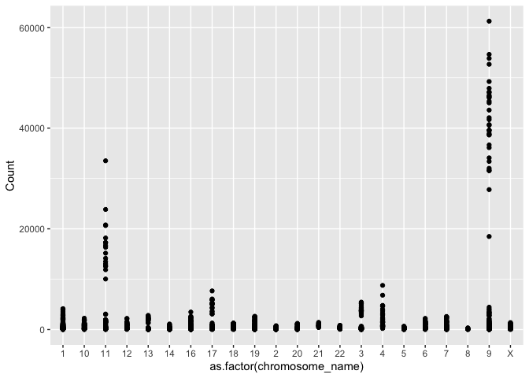

Seminar 4 - Data aggregation with dplyr
================
Jenkin Tsui

**update Dec 29th, 2020, 12:10PM**

The following sections are to be submitted for marks:

  - Part 2 Exercise
  - Part 3 Exercise
  - Part 4 Exercise

# Objectives

The objectives for this lecture will be to

  - Understand that some freely available genomic, transcriptomic and
    proteomic data can be accessed through the Gene Expression Omnibus
    server (GEO)
  - Download gene expression datasets using GEOquery and explore the
    data using dplyr verbs
  - Use dplyr verbs in conjunction with ggplot2
  - Run a t-test and isolate the results in a table

# Part 1 - Accessing data using GEOquery

All of the packages you will need are listed below. If you have never
used them before, you will need to install them using the commented
lines above the library() command.

``` r
#if (!requireNamespace("BiocManager", quietly = TRUE))
#    install.packages("BiocManager")
#
#BiocManager::install("GEOquery")
#BiocManager::install("biomaRt")
library(GEOquery)
library(biomaRt)
#install.packages("tidyverse")
library(tidyverse)
#install.packages("data.table")
library(data.table)
```

A variety of freely available gene expression data is available through
the Gene Expression Omnibus (GEO) server. Most of these datasets have
associated papers in which they detail data acquisition and analysis
methods.

To simplify things for its users, GEO has four basic entitys that act as
containers for different types of data. The four main types are:

**GSM** - stores data associated with a single sample, and additional
info about how the data was collected

**GSE** - stores information about each sample, as well as overall
experiment info

**GPL** - stores platform info (i.e the machine used to collect the
data)

**GDS** - stores curated matrices that are GSM objects in an
“analysis-ready” format

The first thing we are going to do is download a dataset from the Gene
Expression Omnibus (GEO) repository using the GEOquery package. This
experiment is exploring gene expression differences between renal cell
carcinoma cells (RCC) and adjacent normal cells using an Affymetric
array. We are going to download data in the GDS format, as it is already
in a nice table for us. Note: you can download any type of GEO data you
want using the getGEO function.

``` r
gds <- getGEO("GDS507")
```

    ## File stored at:

    ## /var/folders/pz/rdjxq2157yl4wc05pqd_5fcrvz1p7p/T//RtmpdSlscT/GDS507.soft.gz

    ## 
    ## ── Column specification ────────────────────────────────────────────────────────
    ## cols(
    ##   ID_REF = col_character(),
    ##   IDENTIFIER = col_character(),
    ##   GSM11815 = col_double(),
    ##   GSM11832 = col_double(),
    ##   GSM12069 = col_double(),
    ##   GSM12083 = col_double(),
    ##   GSM12101 = col_double(),
    ##   GSM12106 = col_double(),
    ##   GSM12274 = col_double(),
    ##   GSM12299 = col_double(),
    ##   GSM12412 = col_double(),
    ##   GSM11810 = col_double(),
    ##   GSM11827 = col_double(),
    ##   GSM12078 = col_double(),
    ##   GSM12099 = col_double(),
    ##   GSM12269 = col_double(),
    ##   GSM12287 = col_double(),
    ##   GSM12301 = col_double(),
    ##   GSM12448 = col_double()
    ## )

``` r
#we can use str() to peak at the structure of a data object. 
str(gds)
```

    ## Formal class 'GDS' [package "GEOquery"] with 3 slots
    ##   ..@ gpl      :Formal class 'GPL' [package "GEOquery"] with 2 slots
    ##   .. .. ..@ dataTable:Formal class 'GEODataTable' [package "GEOquery"] with 2 slots
    ##   .. .. .. .. ..@ columns:'data.frame':  0 obs. of  0 variables
    ##   .. .. .. .. ..@ table  :'data.frame':  0 obs. of  0 variables
    ##   .. .. ..@ header   : list()
    ##   ..@ dataTable:Formal class 'GEODataTable' [package "GEOquery"] with 2 slots
    ##   .. .. ..@ columns:'data.frame':    17 obs. of  4 variables:
    ##   .. .. .. ..$ sample       : Factor w/ 17 levels "GSM11810","GSM11815",..: 2 4 5 7 9 10 12 14 16 1 ...
    ##   .. .. .. ..$ disease.state: Factor w/ 2 levels "normal","RCC": 2 2 2 2 2 2 2 2 2 1 ...
    ##   .. .. .. ..$ individual   : Factor w/ 10 levels "001","005","011",..: 6 4 1 2 3 5 8 9 10 6 ...
    ##   .. .. .. ..$ description  : chr [1:17] "Value for GSM11815: C035 Renal Clear Cell Carcinoma U133B; src: Trizol isolation of total RNA from Renal Clear "| __truncated__ "Value for GSM11832: C023 Renal Clear Cell Carcinoma U133B; src: Trizol isolation of total RNA from Renal Clear "| __truncated__ "Value for GSM12069: C001 Renal Clear Cell Carcinoma U133B; src: Trizol isolation of total RNA from Renal Clear "| __truncated__ "Value for GSM12083: C005 Renal Clear Cell Carcinoma U133B; src: Trizol isolation of total RNA from Renal Clear "| __truncated__ ...
    ##   .. .. ..@ table  :'data.frame':    22645 obs. of  19 variables:
    ##   .. .. .. ..$ ID_REF    : chr [1:22645] "200000_s_at" "200001_at" "200002_at" "200003_s_at" ...
    ##   .. .. .. ..$ IDENTIFIER: chr [1:22645] "PRPF8" "CAPNS1" "RPL35" "MIR6805" ...
    ##   .. .. .. ..$ GSM11815  : num [1:22645] 4254 17996 41679 65391 19030 ...
    ##   .. .. .. ..$ GSM11832  : num [1:22645] 5298 12011 39117 34806 15814 ...
    ##   .. .. .. ..$ GSM12069  : num [1:22645] 4026 10284 38759 31257 16356 ...
    ##   .. .. .. ..$ GSM12083  : num [1:22645] 3498 2535 32848 28308 9580 ...
    ##   .. .. .. ..$ GSM12101  : num [1:22645] 3566 11048 39634 67448 14274 ...
    ##   .. .. .. ..$ GSM12106  : num [1:22645] 4903 13354 43511 56990 17217 ...
    ##   .. .. .. ..$ GSM12274  : num [1:22645] 6373 8564 46857 57972 19117 ...
    ##   .. .. .. ..$ GSM12299  : num [1:22645] 4829 17248 47032 57570 17488 ...
    ##   .. .. .. ..$ GSM12412  : num [1:22645] 5206 16018 22152 29062 14672 ...
    ##   .. .. .. ..$ GSM11810  : num [1:22645] 2757 6077 26661 35141 17733 ...
    ##   .. .. .. ..$ GSM11827  : num [1:22645] 3932 15704 26374 23629 18022 ...
    ##   .. .. .. ..$ GSM12078  : num [1:22645] 3730 10138 23810 22100 17957 ...
    ##   .. .. .. ..$ GSM12099  : num [1:22645] 3223 11614 24749 21651 15958 ...
    ##   .. .. .. ..$ GSM12269  : num [1:22645] 3640 8460 21937 18551 15800 ...
    ##   .. .. .. ..$ GSM12287  : num [1:22645] 4886 10283 31463 23496 16686 ...
    ##   .. .. .. ..$ GSM12301  : num [1:22645] 4070 11844 22734 21315 18817 ...
    ##   .. .. .. ..$ GSM12448  : num [1:22645] 3482 9742 25396 28631 17421 ...
    ##   .. .. .. ..- attr(*, "spec")=
    ##   .. .. .. .. .. cols(
    ##   .. .. .. .. ..   ID_REF = col_character(),
    ##   .. .. .. .. ..   IDENTIFIER = col_character(),
    ##   .. .. .. .. ..   GSM11815 = col_double(),
    ##   .. .. .. .. ..   GSM11832 = col_double(),
    ##   .. .. .. .. ..   GSM12069 = col_double(),
    ##   .. .. .. .. ..   GSM12083 = col_double(),
    ##   .. .. .. .. ..   GSM12101 = col_double(),
    ##   .. .. .. .. ..   GSM12106 = col_double(),
    ##   .. .. .. .. ..   GSM12274 = col_double(),
    ##   .. .. .. .. ..   GSM12299 = col_double(),
    ##   .. .. .. .. ..   GSM12412 = col_double(),
    ##   .. .. .. .. ..   GSM11810 = col_double(),
    ##   .. .. .. .. ..   GSM11827 = col_double(),
    ##   .. .. .. .. ..   GSM12078 = col_double(),
    ##   .. .. .. .. ..   GSM12099 = col_double(),
    ##   .. .. .. .. ..   GSM12269 = col_double(),
    ##   .. .. .. .. ..   GSM12287 = col_double(),
    ##   .. .. .. .. ..   GSM12301 = col_double(),
    ##   .. .. .. .. ..   GSM12448 = col_double()
    ##   .. .. .. .. .. )
    ##   ..@ header   :List of 23
    ##   .. ..$ channel_count           : chr "1"
    ##   .. ..$ dataset_id              : chr [1:12] "GDS507" "GDS507" "GDS507" "GDS507" ...
    ##   .. ..$ description             : chr [1:13] "Investigation into mechanisms of renal clear cell carcinogenesis (RCC). Comparison of renal clear cell tumor ti"| __truncated__ "RCC" "normal" "035" ...
    ##   .. ..$ email                   : chr "geo@ncbi.nlm.nih.gov"
    ##   .. ..$ feature_count           : chr "22645"
    ##   .. ..$ institute               : chr "NCBI NLM NIH"
    ##   .. ..$ name                    : chr "Gene Expression Omnibus (GEO)"
    ##   .. ..$ order                   : chr "none"
    ##   .. ..$ platform                : chr "GPL97"
    ##   .. ..$ platform_organism       : chr "Homo sapiens"
    ##   .. ..$ platform_technology_type: chr "in situ oligonucleotide"
    ##   .. ..$ pubmed_id               : chr "14641932"
    ##   .. ..$ ref                     : chr "Nucleic Acids Res. 2005 Jan 1;33 Database Issue:D562-6"
    ##   .. ..$ reference_series        : chr "GSE781"
    ##   .. ..$ sample_count            : chr "17"
    ##   .. ..$ sample_id               : chr [1:12] "GSM11815,GSM11832,GSM12069,GSM12083,GSM12101,GSM12106,GSM12274,GSM12299,GSM12412" "GSM11810,GSM11827,GSM12078,GSM12099,GSM12269,GSM12287,GSM12301,GSM12448" "GSM11810,GSM11815" "GSM11827,GSM11832" ...
    ##   .. ..$ sample_organism         : chr "Homo sapiens"
    ##   .. ..$ sample_type             : chr "RNA"
    ##   .. ..$ title                   : chr "Renal clear cell carcinoma (HG-U133B)"
    ##   .. ..$ type                    : chr [1:13] "Expression profiling by array" "disease state" "disease state" "individual" ...
    ##   .. ..$ update_date             : chr "Mar 04 2004"
    ##   .. ..$ value_type              : chr "count"
    ##   .. ..$ web_link                : chr "http://www.ncbi.nlm.nih.gov/geo"

You can see that the GDS object has many different slots in which to put
data. For example, our GDS file has a slot for information about the
machine (@GPL), meta data and actual gene expression (@data.table) and
information about the experiment and its authors (@header).

The first thing we want to do is extract a meta data table, and a gene
expression table.

``` r
meta_data <- data.frame(Sample = gds@dataTable@columns$sample, disease = gds@dataTable@columns$disease.state)
#we grab this info from the appropriate slots above. 

gds_data <- gds@dataTable@table
```

# Part 2 - Exploring a gene expression dataset

Let’s peak at the data to see its structure using head(). This gives us
the first few rows of the dataset.

``` r
head(gds_data)
```

    ##        ID_REF IDENTIFIER GSM11815 GSM11832 GSM12069 GSM12083 GSM12101 GSM12106
    ## 1 200000_s_at      PRPF8   4254.0   5298.2   4026.5   3498.4   3566.4   4903.1
    ## 2   200001_at     CAPNS1  17996.2  12010.7  10283.5   2534.7  11048.4  13354.0
    ## 3   200002_at      RPL35  41678.8  39116.9  38758.9  32847.7  39633.9  43511.2
    ## 4 200003_s_at    MIR6805  65390.9  34806.2  31257.2  28308.5  67447.5  56989.9
    ## 5   200004_at     EIF4G2  19030.1  15813.6  16355.7   9579.7  14273.5  17217.0
    ## 6   200005_at      EIF3D   8824.5   9706.2  10590.0   6986.7   9400.4  12835.2
    ##   GSM12274 GSM12299 GSM12412 GSM11810 GSM11827 GSM12078 GSM12099 GSM12269
    ## 1   6372.6   4829.1   5205.8   2756.8   3932.0   3729.9   3223.4   3640.5
    ## 2   8563.8  17247.6  16018.5   6077.0  15703.8  10138.5  11614.4   8460.5
    ## 3  46856.7  47032.4  22152.2  26660.7  26373.6  23809.6  24749.3  21936.8
    ## 4  57972.5  57570.5  29062.2  35140.9  23629.3  22100.5  21651.0  18550.7
    ## 5  19116.9  17487.6  14671.6  17733.1  18022.4  17957.4  15958.0  15799.8
    ## 6  10299.0  12375.2   7645.4   8661.5   7355.7   6973.4   6855.9   7949.2
    ##   GSM12287 GSM12301 GSM12448
    ## 1   4886.3   4070.2   3482.1
    ## 2  10282.6  11844.3   9741.6
    ## 3  31462.8  22733.7  25395.5
    ## 4  23496.5  21315.4  28631.4
    ## 5  16685.8  18817.3  17421.1
    ## 6   9486.5   7494.5   7252.1

``` r
nrow(gds_data)
```

    ## [1] 22645

``` r
ncol(gds_data)
```

    ## [1] 19

In our data frame, the first two columns correspond to gene names.
ID\_REF refers to the probe name. IDENTIFIER refers to the gene name to
which this probe maps. The remaining columns contain expression values
for the 17 samples. In summary, we have an array with dimensions 22645 x
19 (row x column).

Notice that some gene names are duplicated, because there are multiple
probes that map to the same gene. We will deal with this later\!

Now we can start exploring the dataset a bit. Just for fun - let’s
compute the average count in each sample.

We will do this using a function called apply() in base R.

``` r
#We exclude the first and second columns because they hold the probe and gene names, respectively. 
apply(gds_data[,-c(1, 2)], 2, median)
```

    ## GSM11815 GSM11832 GSM12069 GSM12083 GSM12101 GSM12106 GSM12274 GSM12299 
    ##    265.6    250.3    218.5    309.7    281.9    240.1    280.2    217.0 
    ## GSM12412 GSM11810 GSM11827 GSM12078 GSM12099 GSM12269 GSM12287 GSM12301 
    ##    264.4    273.8    264.6    266.5    269.3    288.6    238.7    244.5 
    ## GSM12448 
    ##    264.3

apply() is useful, but it is limited in that it can only operate on
rows, columns, or individual elements of a dataframe directly. More
complex operations get get cumbersome.

One more versatile set of tools are the **dplyr verbs**. These are a set
of functions designed for easy manipulation of data.

They are: **filter** - extract rows that meet certain criteria from data
frame

**select** - extract columns that meet certain criteria from data frame

**mutate** - add a new column

**arrange** - arrange the data in descending or ascending order

**group\_by** - group rows by descriptors (e.g. group all “control”
patients together)

**summarize** - summarize certain statistics from the data (i.e mean,
median, mode, number of samples)

**join** - a set of methods to combine two tidy datasets, roughly
corresponding to typical notions of database joins, see the [join
page](https://dplyr.tidyverse.org/reference/join.html) of the tidyverse
reference for more information

Most, if not all, of these operations are available in the `data.table`
package, albeit in a less readable syntax. This package was developed to
quickly read, write, and manipulate large amounts of data. If you plan
to work with large sets of features, it may be helpful to consider
learning this framework as well. See the [Introduction to
data.table](https://cran.r-project.org/web/packages/data.table/vignettes/datatable-intro.html)
vignette for more information.

An important thing to know about the dplyr verbs, and data.table for
that matter) is that they will only work on data frames that meet
certain structural criteria. Namely, each variable must be in its own
column. In data science, we call this “tidy” data.

Let’s look at a few small datasets that are “tidy”.

``` r
head(iris) #data describing flower parts for several species
```

    ##   Sepal.Length Sepal.Width Petal.Length Petal.Width Species
    ## 1          5.1         3.5          1.4         0.2  setosa
    ## 2          4.9         3.0          1.4         0.2  setosa
    ## 3          4.7         3.2          1.3         0.2  setosa
    ## 4          4.6         3.1          1.5         0.2  setosa
    ## 5          5.0         3.6          1.4         0.2  setosa
    ## 6          5.4         3.9          1.7         0.4  setosa

``` r
head(band_members) #Members of the Beatles and Rolling Stones
```

    ## # A tibble: 3 x 2
    ##   name  band   
    ##   <chr> <chr>  
    ## 1 Mick  Stones 
    ## 2 John  Beatles
    ## 3 Paul  Beatles

``` r
head(band_instruments) #Instruments of the above band members
```

    ## # A tibble: 3 x 2
    ##   name  plays 
    ##   <chr> <chr> 
    ## 1 John  guitar
    ## 2 Paul  bass  
    ## 3 Keith guitar

The iris dataset contains information about certain species of flowers.

As you can see, each variable has its own column, and each row is an
instance of that variable. There are no rownames. We can now use dplyr
verbs to manipulate the data.

These verbs can be used together in a sequence of functions with the
“pipe” operator. R will interpret the output of the previous function
as the input to the subsequent function when you put the “pipe” operator
( %\>% ) inbetween the functions.

``` r
#select all rows with sepal length greater than 5. 
iris %>% 
    filter(Sepal.Length > 5) %>% 
    head()
```

    ##   Sepal.Length Sepal.Width Petal.Length Petal.Width Species
    ## 1          5.1         3.5          1.4         0.2  setosa
    ## 2          5.4         3.9          1.7         0.4  setosa
    ## 3          5.4         3.7          1.5         0.2  setosa
    ## 4          5.8         4.0          1.2         0.2  setosa
    ## 5          5.7         4.4          1.5         0.4  setosa
    ## 6          5.4         3.9          1.3         0.4  setosa

``` r
#group all rows of the same species together.
iris %>% 
    group_by(Species) %>% 
    head()
```

    ## # A tibble: 6 x 5
    ## # Groups:   Species [1]
    ##   Sepal.Length Sepal.Width Petal.Length Petal.Width Species
    ##          <dbl>       <dbl>        <dbl>       <dbl> <fct>  
    ## 1          5.1         3.5          1.4         0.2 setosa 
    ## 2          4.9         3            1.4         0.2 setosa 
    ## 3          4.7         3.2          1.3         0.2 setosa 
    ## 4          4.6         3.1          1.5         0.2 setosa 
    ## 5          5           3.6          1.4         0.2 setosa 
    ## 6          5.4         3.9          1.7         0.4 setosa

``` r
#select the column called "Sepal.Width"
iris %>% 
    dplyr::select(Sepal.Width) %>% 
    head()
```

    ##   Sepal.Width
    ## 1         3.5
    ## 2         3.0
    ## 3         3.2
    ## 4         3.1
    ## 5         3.6
    ## 6         3.9

``` r
#create another column with the species name capitalized. 
iris %>%
    group_by(Species) %>% 
    mutate(Capitalized_names = toupper(Species)) %>% 
    head()
```

    ## # A tibble: 6 x 6
    ## # Groups:   Species [1]
    ##   Sepal.Length Sepal.Width Petal.Length Petal.Width Species Capitalized_names
    ##          <dbl>       <dbl>        <dbl>       <dbl> <fct>   <chr>            
    ## 1          5.1         3.5          1.4         0.2 setosa  SETOSA           
    ## 2          4.9         3            1.4         0.2 setosa  SETOSA           
    ## 3          4.7         3.2          1.3         0.2 setosa  SETOSA           
    ## 4          4.6         3.1          1.5         0.2 setosa  SETOSA           
    ## 5          5           3.6          1.4         0.2 setosa  SETOSA           
    ## 6          5.4         3.9          1.7         0.4 setosa  SETOSA

``` r
#summarize the average sepal length and number of rows belonging to each species.
iris %>% 
    group_by(Species) %>% 
    summarize(average_sepal_length = mean(Sepal.Length), n = n()) %>% 
    head()
```

    ## `summarise()` ungrouping output (override with `.groups` argument)

    ## # A tibble: 3 x 3
    ##   Species    average_sepal_length     n
    ##   <fct>                     <dbl> <int>
    ## 1 setosa                     5.01    50
    ## 2 versicolor                 5.94    50
    ## 3 virginica                  6.59    50

``` r
#arrange the species in alphabetical order
iris %>% 
    arrange(desc(Species)) %>% 
    head()
```

    ##   Sepal.Length Sepal.Width Petal.Length Petal.Width   Species
    ## 1          6.3         3.3          6.0         2.5 virginica
    ## 2          5.8         2.7          5.1         1.9 virginica
    ## 3          7.1         3.0          5.9         2.1 virginica
    ## 4          6.3         2.9          5.6         1.8 virginica
    ## 5          6.5         3.0          5.8         2.2 virginica
    ## 6          7.6         3.0          6.6         2.1 virginica

``` r
#join band members with their instruments by "name"
band_members %>% left_join(band_instruments) 
```

    ## Joining, by = "name"

    ## # A tibble: 3 x 3
    ##   name  band    plays 
    ##   <chr> <chr>   <chr> 
    ## 1 Mick  Stones  <NA>  
    ## 2 John  Beatles guitar
    ## 3 Paul  Beatles bass

``` r
band_members %>% right_join(band_instruments)
```

    ## Joining, by = "name"

    ## # A tibble: 3 x 3
    ##   name  band    plays 
    ##   <chr> <chr>   <chr> 
    ## 1 John  Beatles guitar
    ## 2 Paul  Beatles bass  
    ## 3 Keith <NA>    guitar

``` r
band_members %>% full_join(band_instruments)
```

    ## Joining, by = "name"

    ## # A tibble: 4 x 3
    ##   name  band    plays 
    ##   <chr> <chr>   <chr> 
    ## 1 Mick  Stones  <NA>  
    ## 2 John  Beatles guitar
    ## 3 Paul  Beatles bass  
    ## 4 Keith <NA>    guitar

Now let’s apply these functions to our gene expression dataset\!

One problem: our dataset is not “tidy”. Rather, it’s arranged like an
excel spreadsheet. While intuitive for us to read, dplyr does not like
this very much. So, we have to change it so that each row contains only
one expression value. Luckily, the `pivot_longer()` function from the
‘tidyr’ package helps out with that.

``` r
long_data <- pivot_longer(gds_data, 
                          cols = 3:19,
                          values_to = "Expression",
                          names_to = "Sample")
```

It’s hard to describe what this function does. You can see that the
first \~20,000 rows will correspond to data from the first gene
identifier, and the next group of rows will correspond to data from the
second gene identifier/ You can think of this function as stretching out
a dataset into its long form, so that each row has only one expression
value. I would suggest reading
[this](https://tidyr.tidyverse.org/reference/pivot_longer.html) for more
information about what the `pivot_longer()` function does.

Now we have four columns, each one corresponding to a variable: the
probe name, the gene name, the sample name and the count.

We can do a lot of stuff with this setup\! Let’s calculate the mean gene
expression per sample.

``` r
long_data %>% 
    group_by(Sample) %>% 
    summarize(mean = mean(Expression))
```

    ## `summarise()` ungrouping output (override with `.groups` argument)

    ## # A tibble: 17 x 2
    ##    Sample    mean
    ##    <chr>    <dbl>
    ##  1 GSM11810  765.
    ##  2 GSM11815  751.
    ##  3 GSM11827  780.
    ##  4 GSM11832  742.
    ##  5 GSM12069  748.
    ##  6 GSM12078  774.
    ##  7 GSM12083  735.
    ##  8 GSM12099  766.
    ##  9 GSM12101  803.
    ## 10 GSM12106  744.
    ## 11 GSM12269  710.
    ## 12 GSM12274  761.
    ## 13 GSM12287  791.
    ## 14 GSM12299  802.
    ## 15 GSM12301  770.
    ## 16 GSM12412  685.
    ## 17 GSM12448  757.

Another thing we note is that there are multiple probes that map to a
specific gene. In a real life analysis workflow, there are multiple ways
to deal with this. Some popular options include picking the probe with
the highest expression, or taking the mean/median of all probes’
expression. For simplicity, we will use summarize() to take the mean of
each probe’s expression.

``` r
(new_long_data<- long_data %>% 
    group_by(Sample, IDENTIFIER) %>% 
    summarize(Count = mean(Expression)))
```

    ## `summarise()` regrouping output by 'Sample' (override with `.groups` argument)

    ## # A tibble: 279,905 x 3
    ## # Groups:   Sample [17]
    ##    Sample   IDENTIFIER    Count
    ##    <chr>    <chr>         <dbl>
    ##  1 GSM11810 --Control   15008. 
    ##  2 GSM11810 222968_at      45.8
    ##  3 GSM11810 223641_at     406. 
    ##  4 GSM11810 224429_x_at  1973. 
    ##  5 GSM11810 224438_at     130  
    ##  6 GSM11810 225714_s_at   222. 
    ##  7 GSM11810 225934_at     256. 
    ##  8 GSM11810 226014_at      44.6
    ##  9 GSM11810 226061_s_at    23.3
    ## 10 GSM11810 226138_s_at   152. 
    ## # … with 279,895 more rows

Now, every gene will only have one value per sample.

Now that we are more familiar with dplyr verbs, we can explore how to
access information about genes we are interested in.

The `biomaRt` package is very useful in this regard. It accesses the
ensembl database of gene names and annotations (ensembl.org). `biomaRt`
can help us convert ensemble ids (eg. ENSGXXXXX) into HGNC symbols (i.e
BRCA1), for example, along with a host of other things.

Say we want to learn more about the gene expression on a particular
chromosome, across all samples. We can use biomaRt to look up the
chromosomal location of each gene. Read the biomaRt manual for more
detailed explanation of the following bit of code.

``` r
#open connection between biomaRt and R. 
human = useMart("ensembl", dataset = "hsapiens_gene_ensembl")
#function that takes in data frame, and outputs same data frame with associated chromosome annotations.
identify_gene_names <- function(df){
    names(df) <- c("Sample", "hgnc_symbol", "Count")
    names <- getBM( attributes=c("hgnc_symbol", "chromosome_name") , filters= "hgnc_symbol", values = unique(df$hgnc_symbol), mart = human, useCache = FALSE)
    left_join(df, names, by = "hgnc_symbol")
}

#There's a lot of variation in how the chromosomal location is annotated. To simplify things, let's filter out all genes with annotations that are not numeric numbers between 1 and 23, X or Y. 
data_with_chromosome <- identify_gene_names(new_long_data) %>% 
    filter(chromosome_name %in% c(1:23, "X", "Y"))
```

## Part 2 Exercise

*Modify the above code to also identify the length of each gene captured
in the dataset we have been working with in the above exercises. This
can be done by adding “transcript\_length” as attribute in getBM
function. You should end up with an extra column for “transcript
length”. We will use this number later.*

Let’s say we’re interested in how the average expression of genes on the
X chromosome changes between RCC and normal cells.

The first thing we will do is combine information from the meta data
file (meta\_data) with our expression table (data\_with\_chromosome).
Then we will use dplyr verbs to first group all samples by disease
status, filter out all non-X-chromosome genes, and then calculate the
mean using summarize().

``` r
full_data <- left_join(data_with_chromosome, meta_data, by = "Sample")

full_data %>% 
    group_by(disease) %>% 
    filter(chromosome_name == "X") %>% 
    summarize(mean = mean(Count))
```

    ## `summarise()` ungrouping output (override with `.groups` argument)

    ## # A tibble: 2 x 2
    ##   disease  mean
    ##   <fct>   <dbl>
    ## 1 normal   688.
    ## 2 RCC      659.

# Part 3: Graphing expression data

What if we want to graph our count data? Time for ggplot\!

Because we can’t graph all of the probes, let’s choose a random sampling
of 100.

``` r
#choose random number between 1 and however many genes we have. 
set.seed(5747540)
sample_to_choose <- sample(1:length(unique(full_data$hgnc_symbol)), size = 100)
#choose genes that correspond to those numbers in a list of genes. 
names_to_choose <- as.character(unique(full_data$hgnc_symbol)[sample_to_choose])

full_data %>% 
    filter(hgnc_symbol %in% names_to_choose) %>% 
    group_by(Sample) %>% 
    ggplot(aes(x = as.factor(chromosome_name), y = Count)) + geom_point()
```

<!-- -->

## Part 3 Exercise

By adding one additional function to the unmodified code (in Part 2)
above, calculate the sum of all counts in each sample and divide each
expression value by that sum (hint: use mutate).

Please do not use the modified code (in Part 2 exercise) to do this
exercise. Your code would be different if you use the modified data
frame (one with the transcription\_length) instead of the data frame in
Part 2 (one without the transcription\_length).

As an optional exercise, what would be the consequence if we use the
data frame with the “transcription\_length” column?

Remember, you can add multiple new columns using mutate by separating
each column with a comma (i.e mutate(x = c(“a”, “b”), y = c(“d”, “c”))).
Plot this new transformed column.

# Part 4 - Analyzing the results of statistical tests

Being able to graph these results is useful, but what we really want to
do is run statistical tests on the data. There are a variety of ways to
do that which will be explored in subsequent lectures. But in this
seminar we will focus on doing this using dplyr.

In this case, we want to identify the genes that are differentially
expressed between the normal and RCC samples. We will use summarize() to
perform a t-test for each gene.

``` r
full_data %>% 
    group_by(hgnc_symbol) %>% 
    summarize( pvalue = t.test(Count ~ disease)$p.value)
```

    ## `summarise()` ungrouping output (override with `.groups` argument)

    ## # A tibble: 9,206 x 2
    ##    hgnc_symbol pvalue
    ##    <chr>        <dbl>
    ##  1 A1BG        0.708 
    ##  2 A1BG-AS1    0.0366
    ##  3 A1CF        0.132 
    ##  4 A2MP1       0.0245
    ##  5 AADACL2     0.143 
    ##  6 AADAT       0.0304
    ##  7 AAGAB       0.469 
    ##  8 AAK1        0.0229
    ##  9 AARS2       0.0416
    ## 10 AASDH       0.0743
    ## # … with 9,196 more rows

## Part 4 Exercise - Take home

*Make a density plot using geom\_density() graph of the p-value
distributions of the above t-test. It should look like this:*


*Note that if you acquired transcript lengths, you should NOT be using
that data frame for this task. Can you see why?*

*Also, extract a data frame of all genes with p-values lower than 0.05.
Finally, extract the name of the gene with the lowest p-value.*
