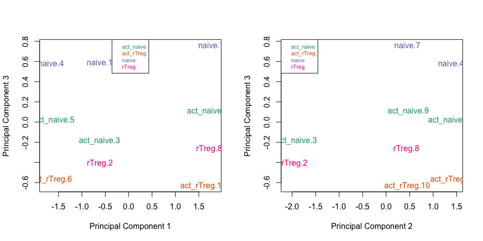
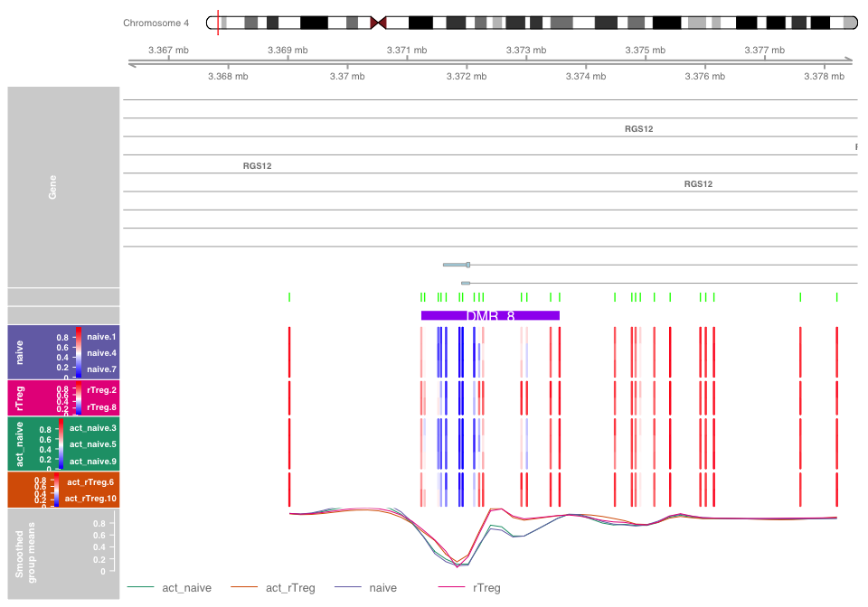

# DNA methylation analysis with Illumina’s Infinium DNA microarrays

Contributors: Keegan Korthauer

> For an overview of DNA methylation analysis, you may wish to review
> [this slide deck from last
> year](https://github.com/STAT540-UBC/STAT540-UBC.github.io/blob/master/lectures/archive/lectures_2020/lect17_Methylation.pdf).
> Unfortunately, we had to cut a lecture this year due to a decrease in
> teaching days, so we weren’t able to cover this topic in lecture.

> This seminar is modeled after the Bioconductor Workflow [“**A
> cross-package Bioconductor workflow for analysing methylation array
> data**”](https://bioconductor.org/packages/devel/workflows/vignettes/methylationArrayAnalysis/inst/doc/methylationArrayAnalysis.html)
> by Jovana Maksimovic, Belinda Phipson and Alicia Oshlack. We skip over
> some details that are included in the workflow, and add in some
> details not included in the workflow. *As we’ve seen with other
> analysis types in this course (e.g. RNA-seq), there are several
> sensible options for analyzing DNA microarray data*.

## Learning objectives

By the end of this tutorial, you should be able to  
- Identify the basic steps in a methylation array analysis pipeline  
- Appreciate the role of normalization prior to analysis in methylation
datasets  
- Explain the difference between beta and M-values, and which are
appropriate for various steps of the anlaysis  
- Undertake exploratory visual analysis of methylation data (plotting
Beta value densities, PCA plots, sample correlation plots)  
- Undertake differential methylation analysis of **probes and regions**
and annotate probes with genomic information (chromosome, position, CpG
island status, nearest gene, etc) for interpretation  
- Plot results from differential analysis (differentially methylated
probes and regions) to highlight areas under regulatory influence

## Setup - install and load packages

First we load necessary packages into our session. If any of these
packages are not already installed on your system, you’ll first need to
install them with `BiocManager::install()`. You likely don’t already
have the Bioconductor Workflow package (`methylationArrayAnalysis`) or
`DMRcatedata` pre-installed, so we’ve included those commands in the
following chunk. The first package includes the dataset we’ll work with,
so it involves a sizeable download (on the order of hundreds of MB) and
may take several minutes depending on your connection. We’ll also make
heavy use of the `minfi`, `limma`, and `DMRcate` Bioconductor packages,
which are automatically loaded by the workflow package.

First install `methylationArrayAnalysis` and `DMRcatedata` by running
this command in your console (only need to run it once, not every time
you knit, so chunk is set to `eval = FALSE`).

``` r
BiocManager::install("methylationArrayAnalysis")
BiocManager::install("DMRcatedata")
```

Install any other packages below before loading the libraries if you
don’t already have them. Note that the loading of these packages may
take a couple of minutes, so be patient!

``` r
library(methylationArrayAnalysis)
library(DMRcatedata)
library(tidyverse)
library(ggplot2)
theme_set(theme_bw())
library(ComplexHeatmap)
library(circlize)
```

## Introduction

The Illumina Infiniumn Array is a microarray-based high throughput
platform for methylation profiling on more than 450,000 pre-selected
probes for CpGs across the human genome. This platform is an aggregation
of the earlier Illumina HumanMethylation27 (“27K”) and
HumanMethylation450 (“450K”) arrays. There also exists an “850K” array
called the Illumina MethylationEPIC that houses more than 850,000
probes.

On these arrays, each CpG is measured by two values: a methylated
intensity (M) and an unmethylated intensity (U). Methylation levels are
commonly reported as either beta values (beta=M/(M+U)) or M-values
(Mvalue=log2(M/U)=log2(beta/(1-beta))), which are the logit transformed
beta values. A small offset is often added to the denominator of the
beta value to avoid dividing by small values. Beta values are readily
interpretable as a methylation percentage, and are generally preferable
for visualization and effect size interpretation. M-values, on the other
hand, are more appropriate for statistical testing due to their
distributional properties (see [Du et
al. 2010](https://bmcbioinformatics.biomedcentral.com/articles/10.1186/1471-2105-11-587)
for an excellent primer on why).

## Read in 450K methylation array data

A great number of these types of datasets have been made publicly
available through Gene Expression Omnibus (GEO). However, they are often
available most conveniently as Bioconductor objects in the form of
processed datasets, e.g. beta values already computed. We would like to
demonstrate the analysis steps from the raw signal intensity data (the M
and U values). To avoid the hassle of downloading the raw signal
intensity data and formatting it into a Bioconductor object, we’ll use
the data provided in the `methylationArrayAnalysis` package.

In this seminar, we are going to perform differential methylation
analysis on sorted T-cell types from [Zhang et
al. 2013](https://www.ncbi.nlm.nih.gov/pmc/articles/PMC3798997/). This
data is publicly available at GEO accession
[GSE49667](https://www.ncbi.nlm.nih.gov/geo/query/acc.cgi?acc=GSE49667),
but as mentioned above, we’ll save time by loading the raw data in
already formatted objects. The dataset contains 10 samples: naive,
rTreg, act\_naive, act\_rTreg, collected from 3 different individuals
(M28, M29, M30).

Let’s take a look at the data files we have.

``` r
# set up a path to the data directory
dataDirectory <- system.file("extdata", package = "methylationArrayAnalysis")
# list the files
list.files(dataDirectory, recursive = TRUE)
```

    ##  [1] "48639-non-specific-probes-Illumina450k.csv"
    ##  [2] "5975827018/5975827018_R06C02_Grn.idat"     
    ##  [3] "5975827018/5975827018_R06C02_Red.idat"     
    ##  [4] "6264509100/6264509100_R01C01_Grn.idat"     
    ##  [5] "6264509100/6264509100_R01C01_Red.idat"     
    ##  [6] "6264509100/6264509100_R01C02_Grn.idat"     
    ##  [7] "6264509100/6264509100_R01C02_Red.idat"     
    ##  [8] "6264509100/6264509100_R02C01_Grn.idat"     
    ##  [9] "6264509100/6264509100_R02C01_Red.idat"     
    ## [10] "6264509100/6264509100_R02C02_Grn.idat"     
    ## [11] "6264509100/6264509100_R02C02_Red.idat"     
    ## [12] "6264509100/6264509100_R03C01_Grn.idat"     
    ## [13] "6264509100/6264509100_R03C01_Red.idat"     
    ## [14] "6264509100/6264509100_R03C02_Grn.idat"     
    ## [15] "6264509100/6264509100_R03C02_Red.idat"     
    ## [16] "6264509100/6264509100_R04C01_Grn.idat"     
    ## [17] "6264509100/6264509100_R04C01_Red.idat"     
    ## [18] "6264509100/6264509100_R04C02_Grn.idat"     
    ## [19] "6264509100/6264509100_R04C02_Red.idat"     
    ## [20] "6264509100/6264509100_R05C01_Grn.idat"     
    ## [21] "6264509100/6264509100_R05C01_Red.idat"     
    ## [22] "6264509100/6264509100_R05C02_Grn.idat"     
    ## [23] "6264509100/6264509100_R05C02_Red.idat"     
    ## [24] "6264509100/6264509100_R06C01_Grn.idat"     
    ## [25] "6264509100/6264509100_R06C01_Red.idat"     
    ## [26] "6264509100/6264509100_R06C02_Grn.idat"     
    ## [27] "6264509100/6264509100_R06C02_Red.idat"     
    ## [28] "ageData.RData"                             
    ## [29] "human_c2_v5.rdata"                         
    ## [30] "model-based-cpg-islands-hg19-chr17.txt"    
    ## [31] "SampleSheet.csv"                           
    ## [32] "wgEncodeRegDnaseClusteredV3chr17.bed"

We can see several pairs of ‘Red’ and ‘Grn’ IDAT (Intensity Data) files.
These are the raw signal intensities for the read and green channels
(which can be parsed to obtain the relative methylated and unmethylated
signals). There are more than 10 pairs, since there are three extra
samples included that we will not consider here. There is also a file
called `SampleSheet.csv`, which contains sample metadata linking the
IDAT files to samples. This file is formatted with one row per sample,
and one column per metadata/phenotypic data variable. We will use the
`read.metharray.sheet` sheet from the `minfi` package to read this info
in. We’ll then remove an extra sample from another dataset that is
included but we’ll not consider in this seminar.

``` r
targets <- read.metharray.sheet(dataDirectory, pattern="SampleSheet.csv")
```

    ## [read.metharray.sheet] Found the following CSV files:

    ## [1] "/Library/Frameworks/R.framework/Versions/4.0/Resources/library/methylationArrayAnalysis/extdata/SampleSheet.csv"

``` r
targets
```

    ##    Sample_Name Sample_Well   Sample_Source Sample_Group Sample_Label Pool_ID
    ## 1            1          A1             M28        naive        naive    <NA>
    ## 2            2          B1             M28        rTreg        rTreg    <NA>
    ## 3            3          C1             M28    act_naive    act_naive    <NA>
    ## 4            4          D1             M29        naive        naive    <NA>
    ## 5            5          E1             M29    act_naive    act_naive    <NA>
    ## 6            6          F1             M29    act_rTreg    act_rTreg    <NA>
    ## 7            7          G1             M30        naive        naive    <NA>
    ## 8            8          H1             M30        rTreg        rTreg    <NA>
    ## 9            9          A2             M30    act_naive    act_naive    <NA>
    ## 10          10          B2             M30    act_rTreg    act_rTreg    <NA>
    ## 11          11         H06 VICS-72098-18-B        birth        birth    <NA>
    ##     Array      Slide
    ## 1  R01C01 6264509100
    ## 2  R02C01 6264509100
    ## 3  R03C01 6264509100
    ## 4  R04C01 6264509100
    ## 5  R05C01 6264509100
    ## 6  R06C01 6264509100
    ## 7  R01C02 6264509100
    ## 8  R02C02 6264509100
    ## 9  R03C02 6264509100
    ## 10 R04C02 6264509100
    ## 11 R06C02 5975827018
    ##                                                                                                                        Basename
    ## 1  /Library/Frameworks/R.framework/Versions/4.0/Resources/library/methylationArrayAnalysis/extdata/6264509100/6264509100_R01C01
    ## 2  /Library/Frameworks/R.framework/Versions/4.0/Resources/library/methylationArrayAnalysis/extdata/6264509100/6264509100_R02C01
    ## 3  /Library/Frameworks/R.framework/Versions/4.0/Resources/library/methylationArrayAnalysis/extdata/6264509100/6264509100_R03C01
    ## 4  /Library/Frameworks/R.framework/Versions/4.0/Resources/library/methylationArrayAnalysis/extdata/6264509100/6264509100_R04C01
    ## 5  /Library/Frameworks/R.framework/Versions/4.0/Resources/library/methylationArrayAnalysis/extdata/6264509100/6264509100_R05C01
    ## 6  /Library/Frameworks/R.framework/Versions/4.0/Resources/library/methylationArrayAnalysis/extdata/6264509100/6264509100_R06C01
    ## 7  /Library/Frameworks/R.framework/Versions/4.0/Resources/library/methylationArrayAnalysis/extdata/6264509100/6264509100_R01C02
    ## 8  /Library/Frameworks/R.framework/Versions/4.0/Resources/library/methylationArrayAnalysis/extdata/6264509100/6264509100_R02C02
    ## 9  /Library/Frameworks/R.framework/Versions/4.0/Resources/library/methylationArrayAnalysis/extdata/6264509100/6264509100_R03C02
    ## 10 /Library/Frameworks/R.framework/Versions/4.0/Resources/library/methylationArrayAnalysis/extdata/6264509100/6264509100_R04C02
    ## 11 /Library/Frameworks/R.framework/Versions/4.0/Resources/library/methylationArrayAnalysis/extdata/5975827018/5975827018_R06C02

``` r
# only keep files from Slide ID 6264509100 (remove one extra sample from another study)
targets <- filter(targets, Slide == "6264509100")
```

Next, we read the IDAT files into R using the `read.metharray.exp`
function, also from the `minfi` package. This creates an `RGChannelSet`
object that contains all the raw intensity data, from both the red and
green colour channels, for each sample. Note that it takes in our
targets data frame as an argument - the function will look in the
`Basename` column for the filenames of the idat files to grab.

``` r
# read in the raw data from the IDAT files
rgSet <- read.metharray.exp(targets = targets)
rgSet
```

    ## class: RGChannelSet 
    ## dim: 622399 10 
    ## metadata(0):
    ## assays(2): Green Red
    ## rownames(622399): 10600313 10600322 ... 74810490 74810492
    ## rowData names(0):
    ## colnames(10): 6264509100_R01C01 6264509100_R02C01 ... 6264509100_R03C02
    ##   6264509100_R04C02
    ## colData names(10): Sample_Name Sample_Well ... Basename filenames
    ## Annotation
    ##   array: IlluminaHumanMethylation450k
    ##   annotation: ilmn12.hg19

``` r
assays(rgSet)$Green[1:5, 1:5]
```

    ##          6264509100_R01C01 6264509100_R02C01 6264509100_R03C01
    ## 10600313               108               165               238
    ## 10600322              3855              5324              6653
    ## 10600328              1239              1263              1755
    ## 10600336               836              1094              1214
    ## 10600345               629               651               922
    ##          6264509100_R04C01 6264509100_R05C01
    ## 10600313               276               289
    ## 10600322              9404             10689
    ## 10600328              2821              3363
    ## 10600336              2242              2618
    ## 10600345              2769              2681

As you can see, this object looks a lot like an `ExpressionSet` object,
with two assays - one for Green and one for Red channel. Indeed, it
behaves in much the same way, but has several useful
methylation-specific methods we can perform on it.

At this stage, it can be useful to rename the samples with more
descriptive names.

``` r
# give the samples descriptive names
targets$ID <- paste(targets$Sample_Group, targets$Sample_Name, sep = ".")
sampleNames(rgSet) <- targets$ID
sampleNames(rgSet)
```

    ##  [1] "naive.1"      "rTreg.2"      "act_naive.3"  "naive.4"      "act_naive.5" 
    ##  [6] "act_rTreg.6"  "naive.7"      "rTreg.8"      "act_naive.9"  "act_rTreg.10"

## Normalization

To minimise the unwanted variation within and between samples, we need
to **normalize** our data. Many different types of normalization have
been developed for methylation arrays and it is beyond the scope of this
seminar to compare and contrast all of them. Several methods are built
into the `minfi` package. Although there is no single normalization
method that is universally considered best, the `preprocessFunnorm`
([Fortin et
al. 2014](https://genomebiology.biomedcentral.com/articles/10.1186/s13059-014-0503-2))
function is most appropriate for datasets with **global methylation
differences** such as cancer/normal or vastly different tissue types,
whilst the `preprocessQuantile` function ([Touleimat and Tost
2012](https://www.futuremedicine.com/doi/full/10.2217/epi.12.21)) is
more suitable for datasets where you **don’t expect global differences**
(e.g. for example a single tissue). For further discussion on
appropriate choice of normalization, including data-driven tests for the
assumptions of quantile normalization, see [Hicks and Irizarry
(2015)](https://genomebiology.biomedcentral.com/articles/10.1186/s13059-015-0679-0).

In this dataset, we are comparing different blood cell types, which we
expect to be globally relatively similar. Therefore, we will apply the
`preprocessQuantile` method. This function implements quantile
normalization on the methylated and unmethylated signal intensities
separately, and takes into account the different probe types
(e.g. background probes). We specify `sex = "M"` since all samples in
the dataset are male.

``` r
# normalize the data; this results in a GenomicRatioSet object
mSetNorm <- preprocessQuantile(rgSet, sex = "M")
```

    ## [preprocessQuantile] Mapping to genome.

    ## [preprocessQuantile] Fixing outliers.

    ## [preprocessQuantile] Quantile normalizing.

``` r
mSetNorm
```

    ## class: GenomicRatioSet 
    ## dim: 485512 10 
    ## metadata(0):
    ## assays(2): M CN
    ## rownames(485512): cg13869341 cg14008030 ... cg08265308 cg14273923
    ## rowData names(0):
    ## colnames(10): naive.1 rTreg.2 ... act_naive.9 act_rTreg.10
    ## colData names(10): Sample_Name Sample_Well ... Basename filenames
    ## Annotation
    ##   array: IlluminaHumanMethylation450k
    ##   annotation: ilmn12.hg19
    ## Preprocessing
    ##   Method: Raw (no normalization or bg correction)
    ##   minfi version: 1.36.0
    ##   Manifest version: 0.4.0

Note that after normalization, the data is housed in a `GenomicRatioSet`
object. This is a much more compact representation of the data as the
two colour channel information has been discarded and the M and U
intensity information has been converted to M-values, together with
associated genomic coordinates. We can pull out beta values with
`getBeta(mSetNorm)`.

Let’s plot the per-sample distributions of the raw versus normalized
beta values.

``` r
# vizualise what the data looks like before and after normalization
par(mfrow = c(1,2))
densityPlot(rgSet, sampGroups = targets$Sample_Group,main="Raw", legend = FALSE)
legend("top", legend = levels(factor(targets$Sample_Group)), 
       text.col=brewer.pal(8,"Dark2"))
densityPlot(getBeta(mSetNorm), sampGroups=targets$Sample_Group,
            main="Normalized", legend=FALSE)
legend("top", legend = levels(factor(targets$Sample_Group)), 
       text.col=brewer.pal(8,"Dark2"))
```

<!-- -->

As we can see, the distributions of beta values appear much more similar
after normalization.

Let’s also check out some PCA plots based on the top 1000 most variable
genes using `plotMDS` in limma.

``` r
# MDS plots to look at largest sources of variation
par(mfrow=c(1,2))
pal <- brewer.pal(8,"Dark2")

plotMDS(getM(mSetNorm), top = 1000, gene.selection="common", 
        col=pal[factor(targets$Sample_Group)])
legend("top", legend=levels(factor(targets$Sample_Group)), text.col=pal,
       bg="white", cex=0.7)

plotMDS(getM(mSetNorm), top = 1000, gene.selection="common",  
        col=pal[factor(targets$Sample_Source)])
legend("top", legend=levels(factor(targets$Sample_Source)), text.col=pal,
       bg="white", cex=0.7)
```

<!-- -->

Notice that PCs 1 and 2 largely separate samples by donor/individual.
Let’s look at higher dimensions.

``` r
# Examine higher dimensions to look at other sources of variation
par(mfrow=c(1,2))
plotMDS(getM(mSetNorm), top=1000, gene.selection="common", 
        col=pal[factor(targets$Sample_Group)], dim=c(1,3))
legend("top", legend=levels(factor(targets$Sample_Group)), text.col=pal, 
       cex=0.7, bg="white")

plotMDS(getM(mSetNorm), top=1000, gene.selection="common", 
        col=pal[factor(targets$Sample_Group)], dim=c(2,3))
legend("topleft", legend=levels(factor(targets$Sample_Group)), text.col=pal,
       cex=0.7, bg="white")
```

<!-- -->

PC 3 seems to capture the cell type differences.

Let’s also look at a sample-sample correlation plot based on the top
1000 most variable probes.

``` r
top1000 <- which(rank(-rowVars(getM(mSetNorm))) <= 1000)
cc <- as.matrix(cor(getM(mSetNorm[top1000,]), 
                     use = "pairwise.complete.obs"), 
                     row.names = colnames(mSetNorm))

annot <- HeatmapAnnotation(df = data.frame(Individual = colData(mSetNorm)$Sample_Source,
                                           CellType = colData(mSetNorm)$Sample_Group),
                           col = list(Group = c("M28" =  pal[8], "M29" = pal[7], "M30" = pal[6]),
                                      CellType = c("naive" = pal[1], "rTreg" = pal[2], 
                                                   "act_naive" = pal[3], "act_rTreg" = pal[4])))

bcols <- colorRamp2(c(0, 1), c("red", "white"))

Heatmap(cc, name = "Corr", col = bcols,
        column_title = "Correlation of M values",
        cluster_rows = TRUE, cluster_columns = TRUE, 
        top_annotation = annot, 
        row_names_gp = gpar(fontsize = 8), 
        column_names_gp = gpar(fontsize = 8))
```

<!-- -->

Samples cluster strongly by donor/individual.

## Quality Control (Filtering)

First, let’s remove poor quality probes. We define poor quality probes
as those which have a total signal (M+U) that is similar to the
background signal. We evaluate this by calculating ‘detection p-values’
for each probe that test whether the total signal is greater than the
background signal. If there are any samples with low mean detection
p-values, they should be removed. We will also remove probes with
p-values larger than 0.01 in at least one sample (since small p-values
indicate reliable signal). We can calculate these detection p-values
with the `detectionP` function in `minfi`.

``` r
# calculate the detection p-values
detP <- detectionP(rgSet)
head(detP)
```

    ##                  naive.1       rTreg.2  act_naive.3     naive.4   act_naive.5
    ## cg00050873  0.000000e+00  0.000000e+00 0.000000e+00 0.00000e+00  0.000000e+00
    ## cg00212031  0.000000e+00  0.000000e+00 0.000000e+00 0.00000e+00  0.000000e+00
    ## cg00213748  2.139652e-88  4.213813e-31 1.181802e-12 1.29802e-47  8.255482e-15
    ## cg00214611  0.000000e+00  0.000000e+00 0.000000e+00 0.00000e+00  0.000000e+00
    ## cg00455876 1.400696e-234 9.349236e-111 4.272105e-90 0.00000e+00 3.347145e-268
    ## cg01707559  0.000000e+00  0.000000e+00 0.000000e+00 0.00000e+00  0.000000e+00
    ##              act_rTreg.6      naive.7       rTreg.8  act_naive.9  act_rTreg.10
    ## cg00050873  0.000000e+00  0.00000e+00  0.000000e+00 0.000000e+00  0.000000e+00
    ## cg00212031  0.000000e+00  0.00000e+00  0.000000e+00 0.000000e+00  0.000000e+00
    ## cg00213748  2.592206e-23  1.16160e-28  1.469801e-05 1.543654e-21  1.365951e-08
    ## cg00214611  0.000000e+00  0.00000e+00  0.000000e+00 0.000000e+00  0.000000e+00
    ## cg00455876 4.690740e-308 1.08647e-219 5.362780e-178 0.000000e+00 7.950724e-295
    ## cg01707559  0.000000e+00  0.00000e+00  0.000000e+00 0.000000e+00  0.000000e+00

``` r
# flag probes with pvals > 0.01 in any sample
keep <- rowSums(detP < 0.01) == ncol(mSetNorm) 
table(keep)
```

    ## keep
    ##  FALSE   TRUE 
    ##    977 484535

``` r
# remove poor quality probes from GenomicRatioSet
mSetNormFilt <- mSetNorm[keep,]
mSetNormFilt
```

    ## class: GenomicRatioSet 
    ## dim: 484535 10 
    ## metadata(0):
    ## assays(2): M CN
    ## rownames(484535): cg13869341 cg14008030 ... cg08265308 cg14273923
    ## rowData names(0):
    ## colnames(10): naive.1 rTreg.2 ... act_naive.9 act_rTreg.10
    ## colData names(10): Sample_Name Sample_Well ... Basename filenames
    ## Annotation
    ##   array: IlluminaHumanMethylation450k
    ##   annotation: ilmn12.hg19
    ## Preprocessing
    ##   Method: Raw (no normalization or bg correction)
    ##   minfi version: 1.36.0
    ##   Manifest version: 0.4.0

It is also advisable to consider removing **probes on sex chromosomes**
(if they are not of interest in your study), **probes that may interact
with known SNPs** (they may inflate inter-individual variation), and/or
**probes that map to multiple places in the genome**. Here, we’ll remove
probes that may interact with known SNPs with the convenient `minfi`
function `dropLociWithSnps` - for more info on other types of filtering,
see the [Bioconductor workflow on which this seminar is
based](https://bioconductor.org/packages/devel/workflows/vignettes/methylationArrayAnalysis/inst/doc/methylationArrayAnalysis.html).

``` r
mSetNormFilt <- dropLociWithSnps(mSetNormFilt)
mSetNormFilt
```

    ## class: GenomicRatioSet 
    ## dim: 467023 10 
    ## metadata(0):
    ## assays(2): M CN
    ## rownames(467023): cg13869341 cg14008030 ... cg08265308 cg14273923
    ## rowData names(0):
    ## colnames(10): naive.1 rTreg.2 ... act_naive.9 act_rTreg.10
    ## colData names(10): Sample_Name Sample_Well ... Basename filenames
    ## Annotation
    ##   array: IlluminaHumanMethylation450k
    ##   annotation: ilmn12.hg19
    ## Preprocessing
    ##   Method: Raw (no normalization or bg correction)
    ##   minfi version: 1.36.0
    ##   Manifest version: 0.4.0

Let’s recheck the PCA plots.

``` r
# MDS plots to look at largest sources of variation
par(mfrow=c(1,2))
pal <- brewer.pal(8,"Dark2")

plotMDS(getM(mSetNormFilt), top = 1000, gene.selection="common", 
        col=pal[factor(targets$Sample_Group)])
legend("topright", legend=levels(factor(targets$Sample_Group)), text.col=pal,
       bg="white", cex=0.7)

plotMDS(getM(mSetNormFilt), top = 1000, gene.selection="common",  
        col=pal[factor(targets$Sample_Source)])
legend("topright", legend=levels(factor(targets$Sample_Source)), text.col=pal,
       bg="white", cex=0.7)
```

<!-- -->

Great! After filtering poor quality probes and probes near SNPs, we see
that PC1 and PC2 are not as strongly associated with individual
variation (especially PC2).

Let’s recheck the sample-sample correlation plot.

``` r
top1000 <- which(rank(-rowVars(getM(mSetNormFilt))) <= 1000)
cc <- as.matrix(cor(getM(mSetNormFilt[top1000,]), 
                     use = "pairwise.complete.obs"), 
                     row.names = colnames(mSetNorm))

Heatmap(cc, name = "Corr", col = bcols,
        column_title = "Correlation of M values",
        cluster_rows = TRUE, cluster_columns = TRUE, 
        top_annotation = annot, 
        row_names_gp = gpar(fontsize = 8), 
        column_names_gp = gpar(fontsize = 8))
```

<!-- -->

Samples still cluster by individual/donor, but the correlation patterns
are not nearly as striking as before filtering.

## Probe-level differential methylation analysis

We are interested in pairwise comparisons between the four cell types,
taking into account individual to individual variation. We perform this
analysis on the matrix of M-values in `limma`, obtaining moderated
t-statistics and associated p-values for each CpG site (this part will
be very familiar to you!). We’ll use a design matrix with no intercept
term (recall the **cell means parameterization**).

A convenient way to set up the model when the user has many comparisons
of interest that they would like to test is to use a **contrast matrix**
in conjunction with the design matrix. A contrast matrix will take
linear combinations of the columns of the design matrix corresponding to
the comparisons of interest. Here we’ll construct a contrast matrix of
the 4 pairwise comparisons we are interested in.

``` r
# use the above to create a design matrix (cell means parameterization)
design <- model.matrix(~ 0 + Sample_Group + Sample_Source, 
                       data = targets)
# simplify column names of design matrix
colnames(design) <- gsub("Sample_Group|Sample_Source", "", colnames(design))
design
```

    ##    act_naive act_rTreg naive rTreg M29 M30
    ## 1          0         0     1     0   0   0
    ## 2          0         0     0     1   0   0
    ## 3          1         0     0     0   0   0
    ## 4          0         0     1     0   1   0
    ## 5          1         0     0     0   1   0
    ## 6          0         1     0     0   1   0
    ## 7          0         0     1     0   0   1
    ## 8          0         0     0     1   0   1
    ## 9          1         0     0     0   0   1
    ## 10         0         1     0     0   0   1
    ## attr(,"assign")
    ## [1] 1 1 1 1 2 2
    ## attr(,"contrasts")
    ## attr(,"contrasts")$Sample_Group
    ## [1] "contr.treatment"
    ## 
    ## attr(,"contrasts")$Sample_Source
    ## [1] "contr.treatment"

``` r
# fit the linear model 
fit <- lmFit(getM(mSetNormFilt), design)

# create a contrast matrix for specific comparisons
contMatrix <- makeContrasts(naive - rTreg,
                            naive - act_naive,
                            rTreg - act_rTreg,
                            act_naive - act_rTreg,
                            levels = design)
contMatrix
```

    ##            Contrasts
    ## Levels      naive - rTreg naive - act_naive rTreg - act_rTreg
    ##   act_naive             0                -1                 0
    ##   act_rTreg             0                 0                -1
    ##   naive                 1                 1                 0
    ##   rTreg                -1                 0                 1
    ##   M29                   0                 0                 0
    ##   M30                   0                 0                 0
    ##            Contrasts
    ## Levels      act_naive - act_rTreg
    ##   act_naive                     1
    ##   act_rTreg                    -1
    ##   naive                         0
    ##   rTreg                         0
    ##   M29                           0
    ##   M30                           0

``` r
# fit the contrasts
fit2 <- contrasts.fit(fit, contMatrix)
fit2 <- eBayes(fit2)

# look at the numbers of DM CpGs at FDR < 0.05
summary(decideTests(fit2))
```

    ##        naive - rTreg naive - act_naive rTreg - act_rTreg act_naive - act_rTreg
    ## Down            1602               396                 0                   548
    ## NotSig        464027            466406            467023                465585
    ## Up              1394               221                 0                   890

Now, we’ll show how to annotate the significant probes for genomic
context. We use the `IlluminaHumanMethylation450kmanifest` which
contains all of the annotation information for each of the CpG probes on
the 450k array. This information can be combined with the `topTable`
output. Here, we’ll demonstrate this for the first contrast (naive vs
rTreg).

``` r
# read in annotation and keep only particularly relevant columns (we've preselected some)
ann450k <- getAnnotation(IlluminaHumanMethylation450kanno.ilmn12.hg19)[,c(1:4,18:19,24:30)]
head(ann450k)
```

    ## DataFrame with 6 rows and 13 columns
    ##                    chr       pos      strand        Name           Islands_Name
    ##            <character> <integer> <character> <character>            <character>
    ## cg00050873        chrY   9363356           -  cg00050873   chrY:9363680-9363943
    ## cg00212031        chrY  21239348           -  cg00212031 chrY:21238448-21240005
    ## cg00213748        chrY   8148233           -  cg00213748   chrY:8147877-8148210
    ## cg00214611        chrY  15815688           -  cg00214611 chrY:15815488-15815779
    ## cg00455876        chrY   9385539           -  cg00455876   chrY:9385471-9385777
    ## cg01707559        chrY   6778695           +  cg01707559   chrY:6778574-6780028
    ##            Relation_to_Island UCSC_RefGene_Name UCSC_RefGene_Accession
    ##                   <character>       <character>            <character>
    ## cg00050873            N_Shore    TSPY4;FAM197Y2 NM_001164471;NR_001553
    ## cg00212031             Island            TTTY14              NR_001543
    ## cg00213748            S_Shore                                         
    ## cg00214611             Island     TMSB4Y;TMSB4Y    NM_004202;NM_004202
    ## cg00455876             Island                                         
    ## cg01707559             Island TBL1Y;TBL1Y;TBL1Y NM_134259;NM_033284;..
    ##              UCSC_RefGene_Group     Phantom         DMR    Enhancer
    ##                     <character> <character> <character> <character>
    ## cg00050873         Body;TSS1500                                    
    ## cg00212031               TSS200                                    
    ## cg00213748                                                         
    ## cg00214611        1stExon;5'UTR                                    
    ## cg00455876                                                         
    ## cg01707559 TSS200;TSS200;TSS200                                    
    ##                     HMM_Island
    ##                    <character>
    ## cg00050873   Y:9973136-9976273
    ## cg00212031 Y:19697854-19699393
    ## cg00213748   Y:8207555-8208234
    ## cg00214611 Y:14324883-14325218
    ## cg00455876   Y:9993394-9995882
    ## cg01707559   Y:6838022-6839951

``` r
# overall Island annotation across all significant 
table(ann450k$Relation_to_Island) / nrow(ann450k)
```

    ## 
    ##     Island    N_Shelf    N_Shore    OpenSea    S_Shelf    S_Shore 
    ## 0.30947536 0.05117072 0.12949216 0.36260072 0.04593089 0.10133014

``` r
# get the table of results for the first contrast (naive - rTreg)
ann450kSub <- ann450k[match(rownames(mSetNormFilt), ann450k$Name), ]
DMPs <- topTable(fit2, n = Inf, p.value = 0.05, coef = "naive - rTreg", genelist = ann450kSub)
head(DMPs)
```

    ##              chr       pos strand       Name            Islands_Name
    ## cg07499259  chr1  12188502      + cg07499259                        
    ## cg09747445 chr15  70387268      - cg09747445 chr15:70387929-70393206
    ## cg26992245  chr8  29848579      - cg26992245                        
    ## cg18808929  chr8  61825469      - cg18808929  chr8:61822358-61823028
    ## cg21179654  chr3 114057297      + cg21179654                        
    ## cg25015733  chr2  99342986      - cg25015733  chr2:99346882-99348177
    ##            Relation_to_Island                                UCSC_RefGene_Name
    ## cg07499259            OpenSea                                  TNFRSF8;TNFRSF8
    ## cg09747445            N_Shore                                   TLE3;TLE3;TLE3
    ## cg26992245            OpenSea                                                 
    ## cg18808929            S_Shelf                                                 
    ## cg21179654            OpenSea ZBTB20;ZBTB20;ZBTB20;ZBTB20;ZBTB20;ZBTB20;ZBTB20
    ## cg25015733            N_Shelf                                           MGAT4A
    ##                                                                             UCSC_RefGene_Accession
    ## cg07499259                                                                     NM_152942;NM_001243
    ## cg09747445                                                        NM_001105192;NM_020908;NM_005078
    ## cg26992245                                                                                        
    ## cg18808929                                                                                        
    ## cg21179654 NM_001164343;NM_001164346;NM_001164345;NM_001164342;NM_001164344;NM_001164347;NM_015642
    ## cg25015733                                                                               NM_012214
    ##                                   UCSC_RefGene_Group Phantom DMR Enhancer
    ## cg07499259                                5'UTR;Body                     
    ## cg09747445                            Body;Body;Body                     
    ## cg26992245                                                           TRUE
    ## cg18808929                                                           TRUE
    ## cg21179654 3'UTR;3'UTR;3'UTR;3'UTR;3'UTR;3'UTR;3'UTR                     
    ## cg25015733                                     5'UTR                     
    ##                     HMM_Island     logFC     AveExpr         t      P.Value
    ## cg07499259 1:12111023-12111225  3.654104  2.46652171  18.94328 7.701148e-08
    ## cg09747445                     -3.337299 -0.25201484 -18.49601 9.257504e-08
    ## cg26992245                      4.450696 -0.09180715  18.41846 9.561827e-08
    ## cg18808929                     -2.990263  0.77522878 -18.22255 1.038213e-07
    ## cg21179654                      2.859016  1.32460816  17.59581 1.358819e-07
    ## cg25015733                     -3.054336  0.83280190 -17.59252 1.360772e-07
    ##              adj.P.Val        B
    ## cg07499259 0.005600017 7.354860
    ## cg09747445 0.005600017 7.255153
    ## cg26992245 0.005600017 7.237384
    ## cg18808929 0.005600017 7.191831
    ## cg21179654 0.005600017 7.039532
    ## cg25015733 0.005600017 7.038705

``` r
# Look at Island annotation across all significant 
table(DMPs$Relation_to_Island) / nrow(DMPs)
```

    ## 
    ##     Island    N_Shelf    N_Shore    OpenSea    S_Shelf    S_Shore 
    ## 0.05440587 0.06875834 0.14118825 0.57176235 0.06275033 0.10113485

Now we’ll plot the top 5 differentially methylated probes.

``` r
top5 <- getBeta(mSetNormFilt)[rownames(DMPs[1:5,]),] %>%
  data.frame() %>%
  rownames_to_column(var = "probe") %>%
  pivot_longer(cols = -probe, names_to = c("Sample"), values_to = "Beta") %>%
  left_join(colData(mSetNormFilt) %>% data.frame() %>% rownames_to_column(var = "Sample"), 
            by = "Sample") 

top5 %>%
   ggplot(aes(x = Sample_Group, y = Beta, color = Sample_Group)) + 
   geom_point(position = position_jitter(width = 0.05), na.rm = T) + 
   facet_grid(. ~ probe) + 
   ggtitle("Probe beta values within top 5 DM (naive-rTreg) probes") + 
   xlab("Sample Type") + 
   ylab("Beta") +
   theme(axis.text.x = element_text(angle = 90))
```

<!-- -->

All of these show a clear difference between naive and rTreg.

Finally, plot location of differentially methylated probes along each
chromosome.

``` r
# fetch chromosome length info
chrlen = getChromInfoFromUCSC("hg19") %>%
  rename(chr = chrom) %>%
  filter(chr %in% c("chrX", "chrY", paste("chr",1:22,sep=""))) %>%
  mutate(chr = factor(chr, levels = c(paste("chr",1:22,sep=""), "chrX", "chrY")))

DMPs %>%
  ggplot() +
    geom_linerange(aes(x = chr, ymin = 0, ymax = size), data = chrlen, alpha = 0.5) + 
    geom_point(aes(x = chr, y = pos), alpha = 0.5,
              position = position_jitter(width = 0.03), na.rm = TRUE) + 
    ggtitle("DMP (naive-rTreg) positions along the genome") + 
    ylab("Position of DMPs") +
    xlab("chr") +
    coord_flip() 
```

<!-- -->

## Region level differential methylation analysis

Although performing a probe-wise analysis is useful and informative,
sometimes we are interested in knowing whether several neighboring CpGs
are concordantly differentially methylated. In other words, we want to
identify **differentially methylated regions** (DMRs). There are several
Bioconductor packages that have functions for identifying differentially
methylated regions from 450k data, including `bumphunter` and `DMRcate`.
Here, we will demonstrate an analysis using the `DMRcate`. As it is
based on limma, we can directly use the design and contrast matrices we
previously defined.

First, our matrix of M-values is annotated with the relevant information
about the probes such as their genomic position, gene annotation, etc.
By default, this is done using the `ilmn12.hg19` annotation, but this
can be modified. The limma pipeline is then used for differential
methylation analysis to calculate moderated t-statistics.

``` r
myAnnotation <- cpg.annotate(object = getM(mSetNormFilt), datatype = "array", what = "M", 
                             analysis.type = "differential", design = design, 
                             contrasts = TRUE, cont.matrix = contMatrix, 
                             coef = "naive - rTreg", arraytype = "450K")
```

    ## Your contrast returned 2996 individually significant probes. We recommend the default setting of pcutoff in dmrcate().

``` r
myAnnotation
```

    ## CpGannotated object describing 467023 CpG sites, with independent
    ## CpG threshold indexed at fdr=0.05 and 2996 significant CpG sites.

Now that we have the relevant statistics for the individual CpGs, we can
then use the `dmrcate` function to combine them to identify DMRs. The
parameter `lambda` here represents a smoothing bandwidth (in basepairs).
Here we use the default value of 1000. `C` is a related parameter that
is recommended to be set to 2.

We then need to run `extractRanges` to pull out a `GRanges` object with
our results.

``` r
# run DMRcate
DMRs <- dmrcate(myAnnotation, lambda = 1000, C = 2)
```

    ## Fitting chr1...

    ## Fitting chr2...

    ## Fitting chr3...

    ## Fitting chr4...

    ## Fitting chr5...

    ## Fitting chr6...

    ## Fitting chr7...

    ## Fitting chr8...

    ## Fitting chr9...

    ## Fitting chr10...

    ## Fitting chr11...

    ## Fitting chr12...

    ## Fitting chr13...

    ## Fitting chr14...

    ## Fitting chr15...

    ## Fitting chr16...

    ## Fitting chr17...

    ## Fitting chr18...

    ## Fitting chr19...

    ## Fitting chr20...

    ## Fitting chr21...

    ## Fitting chr22...

    ## Fitting chrX...

    ## Fitting chrY...

    ## Demarcating regions...

    ## Done!

``` r
DMRs
```

    ## DMResults object with 534 DMRs.
    ## Use extractRanges() to produce a GRanges object of these.

``` r
# pull out results
results.ranges <- extractRanges(DMRs, genome = "hg19")
```

    ## snapshotDate(): 2020-10-27

    ## see ?DMRcatedata and browseVignettes('DMRcatedata') for documentation

    ## loading from cache

``` r
results.ranges
```

    ## GRanges object with 534 ranges and 8 metadata columns:
    ##         seqnames              ranges strand |   no.cpgs min_smoothed_fdr
    ##            <Rle>           <IRanges>  <Rle> | <integer>        <numeric>
    ##     [1]    chr17   57915665-57918682      * |        12      6.90337e-92
    ##     [2]     chr3 114012316-114012912      * |         5     4.44376e-183
    ##     [3]    chr18   21452730-21453131      * |         7     1.68022e-117
    ##     [4]    chr17   74639731-74640078      * |         6      6.45252e-92
    ##     [5]     chrX   49121205-49122718      * |         6      6.05585e-85
    ##     ...      ...                 ...    ... .       ...              ...
    ##   [530]     chr6   28830789-28831653      * |        14      6.59482e-65
    ##   [531]     chr6 144385771-144387124      * |        22      7.11287e-62
    ##   [532]     chrX   43741310-43742501      * |        10      1.31471e-62
    ##   [533]     chr2   25141532-25142229      * |         8      2.65863e-26
    ##   [534]     chr6   31867698-31868470      * |        29      1.05904e-38
    ##            Stouffer      HMFDR      Fisher   maxdiff   meandiff
    ##           <numeric>  <numeric>   <numeric> <numeric>  <numeric>
    ##     [1] 1.28678e-09 0.02542749 1.18852e-07  0.398286   0.313161
    ##     [2] 2.23045e-07 0.00778721 2.00359e-06  0.543428   0.425162
    ##     [3] 1.02793e-06 0.01330660 2.50414e-06 -0.386747  -0.254609
    ##     [4] 2.01606e-07 0.01481111 3.35072e-06 -0.252864  -0.195190
    ##     [5] 4.23078e-07 0.01261049 4.99594e-06  0.452909   0.300624
    ##     ...         ...        ...         ...       ...        ...
    ##   [530]    0.861899  0.0805919    0.686099 -0.248661 -0.0350761
    ##   [531]    0.997064  0.0843747    0.706964  0.325422  0.0449451
    ##   [532]    0.928940  0.0523664    0.738215  0.413832  0.0234547
    ##   [533]    0.992982  0.0591987    0.756754  0.282058  0.0314244
    ##   [534]    0.999914  0.2132780    0.916127 -0.204744 -0.0406369
    ##         overlapping.genes
    ##               <character>
    ##     [1]       VMP1, MIR21
    ##     [2]             TIGIT
    ##     [3]             LAMA3
    ##     [4]        ST6GALNAC1
    ##     [5]             FOXP3
    ##     ...               ...
    ##   [530]  XXbac-BPG308K3.6
    ##   [531]              <NA>
    ##   [532]              MAOB
    ##   [533]             ADCY3
    ##   [534]        C2, ZBTB12
    ##   -------
    ##   seqinfo: 23 sequences from an unspecified genome; no seqlengths

Let’s visualize the results for DMR number 8 (which I selected because
it has a relatively high number of CpGs (14), and a relatively high mean
beta difference). The `DMR.plot` function from `DMRcate` plots
sample-level heatmaps and smoothed group means (only useful for larger
numbers of CpGs) of methylation values in the context of genomic
location.

``` r
# set up the grouping variables and colours
groups <- pal[1:length(unique(targets$Sample_Group))]
names(groups) <- levels(factor(targets$Sample_Group))
cols <- groups[as.character(factor(targets$Sample_Group))]

# draw the plot for the top DMR
par(mfrow=c(1,1))
DMR.plot(ranges = results.ranges, dmr = 8, CpGs = getBeta(mSetNormFilt), phen.col = cols, 
         what = "Beta", arraytype = "450K", genome = "hg19")
```

    ## snapshotDate(): 2020-10-27

    ## see ?DMRcatedata and browseVignettes('DMRcatedata') for documentation

    ## loading from cache

<!-- -->

## Exercise

There are no graded deliverables for this seminar, but as an exercise,
repeat the analysis in the previous sections (plot top 5 differentially
methylated probes, plot all differentially methylated probes across the
genome, and obtain DMRs) for one of the other contrasts. In addition,
add the name(s) of nearest genes to the plot of the top 5 differentially
methylated probes.

## Interpretation and functional enrichment analysis

The next step in the analysis pipeline would be to interpret our result
by associating these differentially methylated regions (DMRs) with
biological features. DNA methylation in different genomic regions,
i.e. promoter regions, enhancers, gene body etc., has different impact
on gene transcription. A common practice in DMR analysis is to separate
DMRs associated with different types of genomic regions and study them
separately. Our key interest is to see how these DMRs affect gene
expression level and consequently biological function. Gene set
enrichment analyses will be explored later in the course (Seminar 10).

## Methylation sequencing

We’ve only scratched the surface of DNA methylation analysis. This
seminar focused entirely on analysis of DNA methylation microarrays (in
particular the 450K array). As sequencing technologies are becoming
popular, techniques like Whole Genome Bisulfite Sequencing (WGBS) and
Methylated DNA Immunoprecipitation followed by sequencing (MEDIP-seq)
are becoming more widely used. These bring with them new analysis
challenges. For an overview, refer to [this slide deck from last
year](https://github.com/STAT540-UBC/STAT540-UBC.github.io/blob/master/lectures/archive/lectures_2020/lect17_Methylation.pdf).

## Session info

``` r
sessionInfo()
```

    ## R version 4.0.3 (2020-10-10)
    ## Platform: x86_64-apple-darwin17.0 (64-bit)
    ## Running under: macOS Big Sur 10.16
    ## 
    ## Matrix products: default
    ## BLAS:   /Library/Frameworks/R.framework/Versions/4.0/Resources/lib/libRblas.dylib
    ## LAPACK: /Library/Frameworks/R.framework/Versions/4.0/Resources/lib/libRlapack.dylib
    ## 
    ## locale:
    ## [1] en_CA.UTF-8/en_CA.UTF-8/en_CA.UTF-8/C/en_CA.UTF-8/en_CA.UTF-8
    ## 
    ## attached base packages:
    ##  [1] grid      stats4    parallel  stats     graphics  grDevices utils    
    ##  [8] datasets  methods   base     
    ## 
    ## other attached packages:
    ##  [1] circlize_0.4.12                                    
    ##  [2] ComplexHeatmap_2.6.2                               
    ##  [3] forcats_0.5.1                                      
    ##  [4] dplyr_1.0.4                                        
    ##  [5] purrr_0.3.4                                        
    ##  [6] readr_1.4.0                                        
    ##  [7] tidyr_1.1.2                                        
    ##  [8] tibble_3.1.0                                       
    ##  [9] ggplot2_3.3.3                                      
    ## [10] tidyverse_1.3.0                                    
    ## [11] DMRcatedata_2.8.2                                  
    ## [12] ExperimentHub_1.16.0                               
    ## [13] AnnotationHub_2.22.0                               
    ## [14] BiocFileCache_1.14.0                               
    ## [15] dbplyr_2.1.0                                       
    ## [16] methylationArrayAnalysis_1.14.0                    
    ## [17] FlowSorted.Blood.450k_1.28.0                       
    ## [18] stringr_1.4.0                                      
    ## [19] DMRcate_2.4.1                                      
    ## [20] Gviz_1.34.0                                        
    ## [21] minfiData_0.36.0                                   
    ## [22] missMethyl_1.24.0                                  
    ## [23] IlluminaHumanMethylationEPICanno.ilm10b4.hg19_0.6.0
    ## [24] RColorBrewer_1.1-2                                 
    ## [25] IlluminaHumanMethylation450kmanifest_0.4.0         
    ## [26] IlluminaHumanMethylation450kanno.ilmn12.hg19_0.6.0 
    ## [27] minfi_1.36.0                                       
    ## [28] bumphunter_1.32.0                                  
    ## [29] locfit_1.5-9.4                                     
    ## [30] iterators_1.0.13                                   
    ## [31] foreach_1.5.1                                      
    ## [32] Biostrings_2.58.0                                  
    ## [33] XVector_0.30.0                                     
    ## [34] SummarizedExperiment_1.20.0                        
    ## [35] Biobase_2.50.0                                     
    ## [36] MatrixGenerics_1.2.1                               
    ## [37] matrixStats_0.58.0                                 
    ## [38] GenomicRanges_1.42.0                               
    ## [39] GenomeInfoDb_1.26.2                                
    ## [40] IRanges_2.24.1                                     
    ## [41] S4Vectors_0.28.1                                   
    ## [42] BiocGenerics_0.36.0                                
    ## [43] limma_3.46.0                                       
    ## [44] BiocStyle_2.18.1                                   
    ## [45] rmarkdown_2.7                                      
    ## [46] knitr_1.31                                         
    ## 
    ## loaded via a namespace (and not attached):
    ##   [1] utf8_1.1.4                    R.utils_2.10.1               
    ##   [3] tidyselect_1.1.0              RSQLite_2.2.3                
    ##   [5] AnnotationDbi_1.52.0          htmlwidgets_1.5.3            
    ##   [7] BiocParallel_1.24.1           munsell_0.5.0                
    ##   [9] codetools_0.2-18              preprocessCore_1.52.1        
    ##  [11] statmod_1.4.35                withr_2.4.1                  
    ##  [13] colorspace_2.0-0              highr_0.8                    
    ##  [15] rstudioapi_0.13               labeling_0.4.2               
    ##  [17] GenomeInfoDbData_1.2.4        farver_2.0.3                 
    ##  [19] bit64_4.0.5                   rhdf5_2.34.0                 
    ##  [21] vctrs_0.3.6                   generics_0.1.0               
    ##  [23] xfun_0.21                     biovizBase_1.38.0            
    ##  [25] R6_2.5.0                      clue_0.3-58                  
    ##  [27] illuminaio_0.32.0             AnnotationFilter_1.14.0      
    ##  [29] bitops_1.0-6                  rhdf5filters_1.2.0           
    ##  [31] cachem_1.0.4                  reshape_0.8.8                
    ##  [33] DelayedArray_0.16.2           assertthat_0.2.1             
    ##  [35] promises_1.2.0.1              scales_1.1.1                 
    ##  [37] bsseq_1.26.0                  nnet_7.3-15                  
    ##  [39] gtable_0.3.0                  Cairo_1.5-12.2               
    ##  [41] ensembldb_2.14.0              rlang_0.4.10                 
    ##  [43] genefilter_1.72.1             GlobalOptions_0.1.2          
    ##  [45] splines_4.0.3                 rtracklayer_1.50.0           
    ##  [47] lazyeval_0.2.2                DSS_2.38.0                   
    ##  [49] GEOquery_2.58.0               dichromat_2.0-0              
    ##  [51] broom_0.7.5                   checkmate_2.0.0              
    ##  [53] modelr_0.1.8                  BiocManager_1.30.10          
    ##  [55] yaml_2.2.1                    GenomicFeatures_1.42.1       
    ##  [57] backports_1.2.1               httpuv_1.5.5                 
    ##  [59] Hmisc_4.4-2                   tools_4.0.3                  
    ##  [61] nor1mix_1.3-0                 ellipsis_0.3.1               
    ##  [63] siggenes_1.64.0               Rcpp_1.0.6                   
    ##  [65] plyr_1.8.6                    base64enc_0.1-3              
    ##  [67] sparseMatrixStats_1.2.1       progress_1.2.2               
    ##  [69] zlibbioc_1.36.0               RCurl_1.98-1.2               
    ##  [71] prettyunits_1.1.1             rpart_4.1-15                 
    ##  [73] openssl_1.4.3                 GetoptLong_1.0.5             
    ##  [75] haven_2.3.1                   cluster_2.1.1                
    ##  [77] fs_1.5.0                      magrittr_2.0.1               
    ##  [79] data.table_1.14.0             reprex_1.0.0                 
    ##  [81] ProtGenerics_1.22.0           mime_0.10                    
    ##  [83] hms_1.0.0                     evaluate_0.14                
    ##  [85] xtable_1.8-4                  XML_3.99-0.5                 
    ##  [87] jpeg_0.1-8.1                  readxl_1.3.1                 
    ##  [89] mclust_5.4.7                  shape_1.4.5                  
    ##  [91] gridExtra_2.3                 compiler_4.0.3               
    ##  [93] biomaRt_2.46.3                crayon_1.4.1                 
    ##  [95] R.oo_1.24.0                   htmltools_0.5.1.1            
    ##  [97] later_1.1.0.1                 Formula_1.2-4                
    ##  [99] lubridate_1.7.10              DBI_1.1.1                    
    ## [101] MASS_7.3-53.1                 rappdirs_0.3.3               
    ## [103] Matrix_1.3-2                  cli_2.3.1                    
    ## [105] permute_0.9-5                 quadprog_1.5-8               
    ## [107] R.methodsS3_1.8.1             pkgconfig_2.0.3              
    ## [109] GenomicAlignments_1.26.0      foreign_0.8-81               
    ## [111] xml2_1.3.2                    annotate_1.68.0              
    ## [113] rngtools_1.5                  multtest_2.46.0              
    ## [115] beanplot_1.2                  rvest_0.3.6                  
    ## [117] doRNG_1.8.2                   scrime_1.3.5                 
    ## [119] VariantAnnotation_1.36.0      digest_0.6.27                
    ## [121] cellranger_1.1.0              base64_2.0                   
    ## [123] htmlTable_2.1.0               edgeR_3.32.1                 
    ## [125] DelayedMatrixStats_1.12.3     curl_4.3                     
    ## [127] shiny_1.6.0                   Rsamtools_2.6.0              
    ## [129] gtools_3.8.2                  rjson_0.2.20                 
    ## [131] jsonlite_1.7.2                lifecycle_1.0.0              
    ## [133] nlme_3.1-152                  Rhdf5lib_1.12.1              
    ## [135] askpass_1.1                   BSgenome_1.58.0              
    ## [137] fansi_0.4.2                   pillar_1.5.0                 
    ## [139] lattice_0.20-41               fastmap_1.1.0                
    ## [141] httr_1.4.2                    survival_3.2-7               
    ## [143] interactiveDisplayBase_1.28.0 glue_1.4.2                   
    ## [145] png_0.1-7                     BiocVersion_3.12.0           
    ## [147] bit_4.0.4                     stringi_1.5.3                
    ## [149] HDF5Array_1.18.1              blob_1.2.1                   
    ## [151] org.Hs.eg.db_3.12.0           latticeExtra_0.6-29          
    ## [153] memoise_2.0.0
