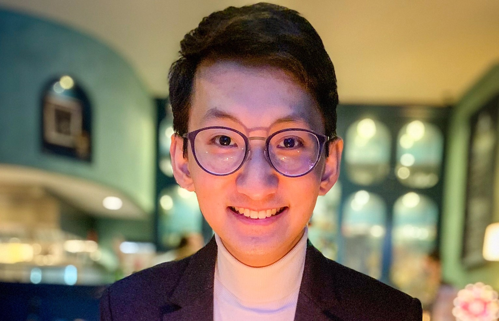
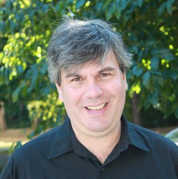
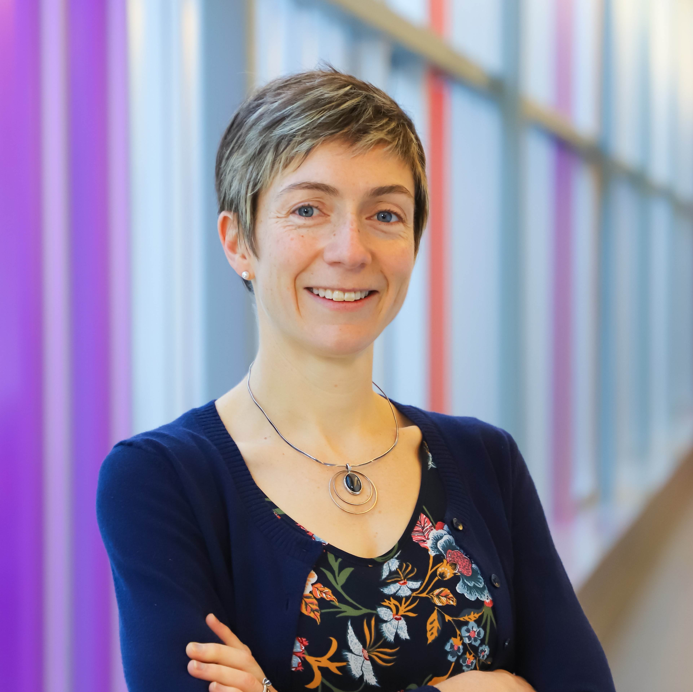
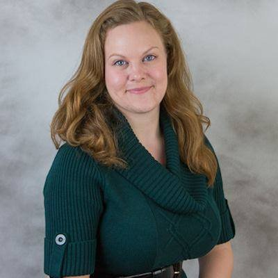

## Instructor

:::: {style="display: grid; grid-template-columns: 1fr 1fr; grid-column-gap: 10px;"}

::: {}
{width=45%}
 [Keegan Korthauer](https://kkorthauer.org/)
 Assistant Professor of Statistics
 <keegan@stat.ubc.ca>
 Pronouns: She/her/hers
:::

::: {}
Keegan is an Assistant Professor in the Department of Statistics at UBC and an Investigator at the BC Children's Hospital Research Institute. She grew up and studied in the United States before moving to Vancouver in 2019. Her research is focused on developing and applying statistical and computational tools for the analysis of high-throughput sequencing data, with the ultimate goal of uncovering new molecular signals in cancer, child health, and development. Her hobbies include running, hiking, board gaming, and playing with her two cats (who may make an appearance during lectures!). 
:::

::::

## Teaching Assistants 

:::: {style="display: grid; grid-template-columns: 1fr 1fr; grid-column-gap: 10px;"}

::: {}
{width=65%}
 Jenkin Tsui
 PhD Student, Bioinformatics
 <jenkin.tsui@aya.yale.edu>
 Pronouns: He/Him/His
:::

::: {}
Jenkin is a Ph.D. student in Bioinformatics at UBC and he is a researcher at BC Cancer Research Centre. He grew up in Hong Kong and Calgary and studied and researched in East Coast Canada/United States and Japan before moving to Vancouver in 2020. His research is focused on developing Bayesian methods for analyzing spatial expression data, with the ultimate goal to understand cancer heterogeneity and cell-to-cell interactions. His hobbies include hiking, Japanese cooking, photography, and interior design.
:::

::::

&nbsp;

:::: {style="display: grid; grid-template-columns: 1fr 1fr; grid-column-gap: 10px;"}

::: {}
{width=50%}
 Marco Tello
 MSc Student, Bioinformatics
 <Marco.TelloPalencia@bcchr.ca>
 Pronouns: He/Him/His
:::

::: {}
Marco is an M.Sc. student in Bioinformatics, and he works at BC Children's Hospital Research Institute. He finished the undergraduate program in Genomic Sciences from the Autonomous University of Mexico (UNAM) before joining the Korthauer Lab in 2020. Marco has always been interested in gene regulation dynamics; his current work is focused on unraveling the effects of DNA methylation in gene expression using publicly available data. In his free time, Marco likes painting, swimming, and playing videogames/boardgames.
:::

::::

## Guest Lecturers
|  |   |  |
|---------------|---------------|---------------|
| {width=60%} | | {width=60%} |
|  [Paul Pavlidis](https://pavlab.msl.ubc.ca/)  | | [Youngjin Park](https://ypark.github.io/) |
|  Professor of Psychiatry / Michael Smith Labs <paul@msl.ubc.ca> | | Assistant Professor of Pathology and Statistics <ypp@stat.ubc.ca> |
|  &nbsp; |  &nbsp; | &nbsp;  |
 | {width=60%} | | {width=60%}  |
 | [Jessica Dennis](www.dennislab.ca) | |  Sarah Merrill |
 |  Assistant Professor of Medical Genetics <Jessica.Dennis@bcchr.ca> | |  Postdoctoral Fellow, Kobor Lab  <sarah.merrill@bcchr.ca> |

