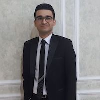

## Instructors

|  |   |  |
|---------------|---------------|---------------|
 |  | |   |
 | [Sara Mostafavi](http://www.stat.ubc.ca/~saram/) | |  Keegan Korthauer      |
 |  Assistant Professor of Statistics & Medical Genetics <saram@stat.ubc.ca> | |  Assistant Professor of Statistics  <keegan@stat.ubc.ca> |
|  | 
|  Paul Pavlidis  | 
|  Professor of Psychiatry / Michael Smith Labs <paul@msl.ubc.ca> | 
## TAs

|  |   |  |
|---------------|---------------|---------------|
|  |  |  |
| Sina Jafarzadeh |    | Jasper Wong |
|  Bioinformatics program <sjafarzadeh@cmmt.ubc.ca> | |  Medical Genetics program <jasperwong_123@hotmail.com> |

<!-- [Sara Mostafavi](http://www.stat.ubc.ca/~saram/), lead instructor

  * Statistics and Medical Genetics
  * <saram@cs.stanford.edu>
  
Paul Pavlidis, instructor
  
  * CHiBi and Psychiatry
  * <paul@chibi.ubc.ca>
  
Marjan Farahbod, TA

  * <marjan.farahbod@gmail.com>
  
Santina Lin, TA

  * <hello@santina.me> -->
